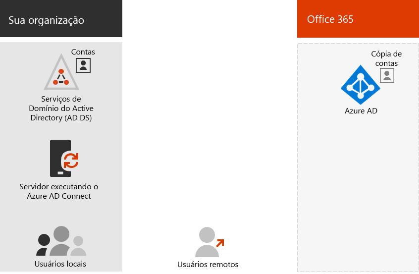

# Modelos de identidade do Microsoft 365 e Active Directory do AzureMicrosoft 365 identity models and Azure Active Directory

*Este artigo se aplica ao Microsoft 365 Enterprise e ao Office 365 Enterprise.**This article applies to both Microsoft 365 Enterprise and Office 365 Enterprise.*

O Microsoft 365 usa o Azure Active Directory (Azure AD), um serviço de autenticação e identidade do usuário baseado na nuvem que está incluído na assinatura do Microsoft 365, para gerenciar identidades e autenticação para o Microsoft 365.Microsoft 365 uses Azure Active Directory (Azure AD), a cloud-based user identity and authentication service that is included with your Microsoft 365 subscription, to manage identities and authentication for Microsoft 365. Obter sua infraestrutura de identidade configurada corretamente é vital para gerenciar o acesso de usuário e permissões do Microsoft 365 para sua organização.Getting your identity infrastructure configured correctly is vital to managing Microsoft 365 user access and permissions for your organization.

Antes de começar, assista a este vídeo para ter uma visão geral dos modelos de identidade e autenticação do Microsoft 365.Before you begin, watch this video for an overview of identity models and authentication for Microsoft 365.

> [!VIDEO https://www.microsoft.com/videoplayer/embed/RE2Pjwu]

Sua primeira opção de planejamento é o modelo de identidade do Microsoft 365.Your first planning choice is the Microsoft 365 identity model.

## Modelos de identidade do Microsoft 365Microsoft 365 identity models

Para planejar contas de usuário, primeiro você precisa entender os dois modelos de identidade no Microsoft 365.To plan for user accounts, you first need to understand the two identity models in Microsoft 365. Você pode manter as identidades da sua organização apenas na nuvem ou pode manter suas identidades do AD DS (serviços de domínio Active Directory) locais e usá-las para autenticação quando os usuários acessarem os serviços de nuvem do Microsoft 365.You can maintain your organization's identities only in the cloud, or you can maintain your on-premises Active Directory Domain Services (AD DS) identities and use them for authentication when users access Microsoft 365 cloud services.  

Estes são os dois tipos de identidade e seus benefícios e melhores necessidades.Here are the two types of identity and their best fit and benefits.

|||
|:-------|:-----|:-----|
|  | **Identidade somente na nuvem****Cloud-only identity** | **Identidade híbrida****Hybrid identity** |
| **Definição****Definition** | A conta de usuário existe somente no locatário do Azure AD para sua assinatura do Microsoft 365.User account only exists in the Azure AD tenant for your Microsoft 365 subscription. | A conta de usuário existe no AD DS e uma cópia também está no locatário do Azure AD para sua assinatura do Microsoft 365.User account exists in AD DS and a copy is also in the Azure AD tenant for your Microsoft 365 subscription. A conta de usuário no Azure AD também pode incluir uma versão de hash da senha da conta de usuário do AD DS já codificada.The user account in Azure AD might also include a hashed version of the already hashed AD DS user account password. |
| **Como o Microsoft 365 autentica as credenciais do usuário****How Microsoft 365 authenticates user credentials** | O locatário do Azure AD para sua assinatura do Microsoft 365 realiza a autenticação com a conta de identidade de nuvem.The Azure AD tenant for your Microsoft 365 subscription performs the authentication with the cloud identity account. | O locatário do Azure AD para sua assinatura do Microsoft 365 manipula o processo de autenticação ou redireciona o usuário para outro provedor de identidade.The Azure AD tenant for your Microsoft 365 subscription either handles the authentication process or redirects the user to another identity provider. |
| **Melhor para****Best for** | Organizações que não têm ou precisam de um AD DS local.Organizations that do not have or need an on-premises AD DS. | Organizações que usam o AD DS ou outro provedor de identidade.Organizations using AD DS or another identity provider. |
| **Melhor benefício****Greatest benefit** | Simples de usar.Simple to use. Não é necessária nenhuma ferramenta ou servidor de diretório extra.No extra directory tools or servers required. | Os usuários podem usar as mesmas credenciais ao acessar recursos locais ou baseados em nuvem.Users can use the same credentials when accessing on-premises or cloud-based resources. |
||||

## Identidade somente na nuvemCloud-only identity

Uma identidade somente na nuvem usa contas de usuário que existem somente no Azure AD.A cloud-only identity uses user accounts that exist only in Azure AD. A identidade em nuvem é normalmente usada por pequenas organizações que não têm servidores locais ou não usam o AD DS para gerenciar identidades locais.Cloud identity is typically used by small organizations that do not have on-premises servers or do not use AD DS to manage local identities. 

Estes são os componentes básicos da identidade somente na nuvem.Here are the basic components of cloud-only identity.
 

Os usuários locais e remotos (online) usam suas contas de usuário e senhas do Azure AD para acessar os serviços de nuvem da Microsoft 365.Both on-premises and remote (online) users use their Azure AD user accounts and passwords to access Microsoft 365 cloud services. O Azure AD autentica as credenciais do usuário com base em suas contas de usuário e senhas armazenadas.Azure AD authenticates user credentials based on its stored user accounts and passwords.

### AdministraçãoAdministration
Como as contas de usuário são armazenadas apenas no Azure AD, você gerencia identidades de nuvem com ferramentas como o [centro de administração do Microsoft 365](https://admin.microsoft.com) e o [Windows PowerShell](https://docs.microsoft.com/office365/enterprise/powershell/manage-user-accounts-and-licenses-with-office-365-powershell).Because user accounts are only stored in Azure AD, you manage cloud identities with tools such as the [Microsoft 365 admin center](https://admin.microsoft.com) and [Windows PowerShell](https://docs.microsoft.com/office365/enterprise/powershell/manage-user-accounts-and-licenses-with-office-365-powershell). 

## Identidade híbridaHybrid identity

A identidade híbrida usa contas originadas em um AD DS local e ter uma cópia no locatário do Azure AD de uma assinatura do Microsoft 365.Hybrid identity uses accounts that originate in an on-premises AD DS and have a copy in the Azure AD tenant of a Microsoft 365 subscription. No entanto, a maioria das alterações só flui de uma forma.However, most changes only flow one way. As alterações feitas nas contas de usuário do AD DS são sincronizadas com sua cópia no Azure AD.Changes that you make to AD DS user accounts are synchronized to their copy in Azure AD. Mas as alterações feitas nas contas baseadas em nuvem no Azure AD, como novas contas de usuário, não são sincronizadas com o AD DS.But changes made to cloud-based accounts in Azure AD, such as new user accounts, are not synchronized with AD DS.

O Azure AD Connect fornece a sincronização de contas contínuas.Azure AD Connect provides the ongoing account synchronization. Ele é executado em um servidor local, verifica as alterações no AD DS e encaminha essas alterações para o Azure AD.It runs on an on-premises server, checks for changes in the AD DS, and forwards those changes to Azure AD. O Azure AD Connect oferece a capacidade de filtrar quais contas estão sincronizadas e se deve sincronizar uma versão de hash de senhas de usuário, conhecida como sincronização de hash de senha (PHS).Azure AD Connect provides the ability to filter which accounts are synchronized and whether to synchronize a hashed version of user passwords, known as password hash synchronization (PHS).

Ao implementar a identidade híbrida, seu AD DS local é a fonte autoritativa de informações da conta.When you implement hybrid identity, your on-premises AD DS is the authoritative source for account information. Isso significa que você realiza tarefas de administração principalmente no local, que são então sincronizadas com o Azure AD.This means that you perform administration tasks mostly on-premises, which are then synchronized to Azure AD. 

Estes são os componentes da identidade híbrida.Here are the components of hybrid identity.

O locatário do Azure AD tem uma cópia das contas do AD DS.The Azure AD tenant has a copy of the AD DS accounts. Nessa configuração, os usuários locais e remotos que acessam o Microsoft 365 Cloud Services são autenticados no Azure AD.In this configuration, both on-premises and remote users accessing Microsoft 365 cloud services authenticate against Azure AD.

>[!Note]
>Você sempre precisa usar o Azure AD Connect para sincronizar contas de usuário para identidade híbrida.You always need to use Azure AD Connect to synchronize user accounts for hybrid identity. Você precisa das contas de usuário sincronizadas no Azure AD para realizar a atribuição de licença e o gerenciamento de grupo, configurar permissões e outras tarefas administrativas que envolvem contas de usuário.You need the synchronized user accounts in Azure AD to perform license assignment and group management, configure permissions, and other administrative tasks that involve user accounts.
>

### AdministraçãoAdministration

Como as contas de usuário originais e autoritativas são armazenadas no AD DS local, você gerencia suas identidades com as mesmas ferramentas que o AD DS, como a ferramenta usuários e computadores do Active Directory.Because the original and authoritative user accounts are stored in the on-premises AD DS, you manage your identities with the same tools as AD DS, such as the Active Directory Users and Computers tool. 

Você não usa o centro de administração do Microsoft 365 ou o Office 365 PowerShell para gerenciar contas de usuário sincronizadas no Azure AD.You don’t use the Microsoft 365 admin center or Office 365 PowerShell to manage synchronized user accounts in Azure AD.

## Próxima etapaNext step

Se você precisar do modelo de identidade somente na nuvem, confira [identidade somente na nuvem](cloud-only-identities.md).If you need the cloud-only identity model, see [Cloud-only identity](cloud-only-identities.md).

Se você precisar do modelo de identidade híbrida, consulte [identidade híbrida](plan-for-directory-synchronization.md).If you need the hybrid identity model, see [Hybrid identity](plan-for-directory-synchronization.md).

## Também consulteSee also

[Visão geral do Microsoft 365 EnterpriseMicrosoft 365 Enterprise overview](https://docs.microsoft.com/microsoft-365/enterprise/microsoft-365-overview)
