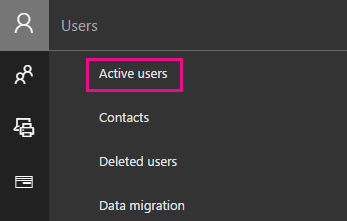
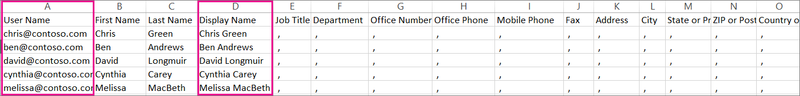
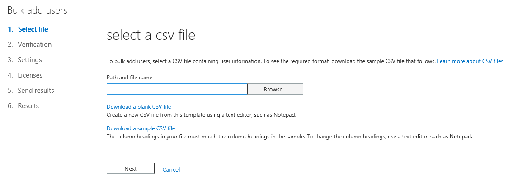
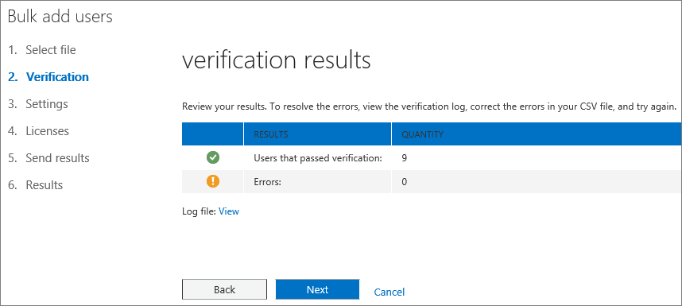

# <a name="add-several-users-at-the-same-time-to-office-365---admin-help"></a>Adicionar vários usuários ao mesmo tempo para o Office 365 – Ajuda da administração

É necessário que cada pessoa na sua equipe tenha uma conta de usuário para poder entrar e acessar os serviços do Office 365, como o email e o Office. Se houver muitas pessoas, é possível adicionar todas as contas de uma só vez a partir de uma planilha do Excel ou de outro arquivo salvo em formato CSV. [Não sabe o que é o formato CSV?](add-several-users-at-the-same-time.md#__toc316652088)
  
## <a name="add-multiple-users-to-office-365-in-the-microsoft-365-admin-center"></a>Adicionar vários usuários ao Office 365 no centro de administração do Microsoft 365

1. Entre no Office 365 com uma conta corporativa ou de estudante. 
    
2. No centro de administração, escolha usuários **ativos**do **usuário** \> .
    
    
  
    
3. No painel **Importar vários usuários**, opcionalmente, você pode baixar um arquivo CSV de exemplo com ou sem dados de exemplo preenchidos. 
    
    
  
    A planilha deve incluir **exatamente os mesmos títulos de coluna** que os da planilha de exemplo (Nome de Usuário, Nome, etc...). Se você usar o modelo, abra-o em uma ferramenta de edição de texto, como o Bloco de Notas, e considere a opção de manter todos os dados na linha 1 e inserir dados apenas nas linhas 2 e abaixo. 
    
    A planilha também precisa incluir valores de nome de usuário (por exemplo, carlos@contoso.com) e um nome para exibição (por exemplo, Carlos Lima) para cada usuário. 
    
  ```
  User Name,First Name,Last Name,Display Name,Job Title,Department,Office Number,Office Phone,Mobile Phone,Fax,Address,City,State or Province,ZIP or Postal Code,Country or Region
  chris@contoso.com,Chris,Green,Chris Green,IT Manager,Information Technology,123451,123-555-1211,123-555-6641,123-555-9821,1 Microsoft way,Redmond,Wa,98052,United States
  ben@contoso.com,Ben,Andrews,Ben Andrews,IT Manager,Information Technology,123452,123-555-1212,123-555-6642,123-555-9822,1 Microsoft way,Redmond,Wa,98052,United States
  david@contoso.com,David,Longmuir,David Longmuir,IT Manager,Information Technology,123453,123-555-1213,123-555-6643,123-555-9823,1 Microsoft way,Redmond,Wa,98052,United States
  cynthia@contoso.com,Cynthia,Carey,Cynthia Carey,IT Manager,Information Technology,123454,123-555-1214,123-555-6644,123-555-9824,1 Microsoft way,Redmond,Wa,98052,United States
  melissa@contoso.com,Melissa,MacBeth,Melissa MacBeth,IT Manager,Information Technology,123455,123-555-1215,123-555-6645,123-555-9825,1 Microsoft way,Redmond,Wa,98052,United States
  
  ```

4. Insira um caminho de arquivo na caixa ou escolha **Procurar** para navegar até o local do arquivo CSV. Em seguida, escolha **Verificar**.
    
    
  
    Se houver algum problema com o arquivo, o problema será exibido no painel. Você também pode baixar um arquivo de log.
    
5. Na caixa de diálogo **Definir opções do usuário**, você pode definir o status de entrada e escolher a licença de produto que será atribuída a todos os usuários. 
    
6. Na caixa de diálogo **Exibir seu resultado**, você pode optar por enviar os resultados a si mesmo ou a outros usuários (as senhas estarão em texto sem formatação), pode ver quantos usuários foram criados e se precisa comprar mais licenças para atribuir a alguns dos novos usuários. 
    
## <a name="watch-the-video"></a>Ver o vídeo
<a name="bk_preview"> </a>

 Assista a um vídeo curto que mostra como adicionar usuários em massa. 
  
> [!VIDEO https://www.microsoft.com/videoplayer/embed/f4e7f161-8ae6-4264-a429-9297b539a8de?autoplay=false]
  
## <a name="next-steps"></a>Próximas etapas
<a name="bk_preview"> </a>

- Agora que essas pessoas têm contas, elas precisam [baixar e instalar ou reinstalar o office 365 ou o office 2016 em um PC ou Mac](https://support.office.com/article/4414eaaf-0478-48be-9c42-23adc4716658). Cada pessoa de sua equipe pode instalar o Office 365 em até 5 PCs ou Macs. 
    
- Cada pessoa também pode [configurar os aplicativos do Office e o email em um dispositivo móvel](https://support.office.com/article/7dabb6cb-0046-40b6-81fe-767e0b1f014f) em até 5 tablets e 5 telefones, como iPhones, iPads e telefones e tablets Android. Dessa forma, elas podem editar arquivos do Office em qualquer lugar. 
    
    Consulte [Configurar o Office 365 for Business](https://support.office.com/article/6a3a29a0-e616-4713-99d1-15eda62d04fa) para obter uma lista completa das etapas de configuração. 
    
## <a name="more-information-about-how-to-add-users-to-office-365"></a>Mais informações sobre como adicionar usuários ao Office 365
<a name="bk_preview"> </a>

### <a name="not-sure-what-csv-format-is"></a>Não sabe o que é o formato CSV?
<a name="__toc316652088"> </a>

Um arquivo CSV é um arquivo com valores separados por vírgulas. Você pode criar ou editar um arquivo como esse com qualquer editor de texto ou programa de planilha, como o Excel.
  
Você pode baixar [esta planilha de exemplo](https://www.microsoft.com/download/details.aspx?id=45485) como ponto de partida. Lembre-se de que o Office 365 requer títulos de coluna na primeira linha; portanto, não os substitua por outra coisa. 
  
Salve o arquivo com um novo nome e especifique o formato CSV.
  

  
Ao salvar o arquivo, você provavelmente receberá um aviso de que alguns recursos da pasta de trabalho serão perdidos se você salvar o arquivo no formato CSV. Não há problema. Clique em **Sim** para continuar. 
  

  
### <a name="tips-for-formatting-your-spreadsheet"></a>Dicas para formatar a sua planilha
<a name="__toc314595848"> </a>

- **Preciso dos mesmos títulos de coluna como mostrado na planilha de exemplo?** Sim. A planilha de exemplo contém títulos de coluna na primeira linha. Esses títulos são obrigatórios. Para cada usuário que você desejar adicionar ao Office 365, crie uma linha sob o título. Se você adicionar, mudar ou excluir qualquer um dos títulos de coluna, o Office 365 poderá não ser capaz de criar os usuários com base nas informações do arquivo. 
    
- **E se eu não tiver todas as informações necessárias sobre cada usuário?** O nome de usuário e o nome para exibição são obrigatórios, e não será possível adicionar um novo usuário sem essas informações. Caso não tenha alguma outra informação, como o fax, use um espaço e uma vírgula para indicar que o campo deve permanecer em branco. 
    
- ** How small or large can the spreadsheet be? ** The spreadsheet must have at least two rows. One is for the column headings (the user data column label) and one for the user. You cannot have more than 251 rows. If you need to import more than 250 users, you can create more than one spreadsheet. 
    
- ** What languages can I use? ** When you create your spreadsheet, you can enter user data column labels in any language or characters, but you must not change the order of the labels, as shown in the sample. You can then make entries into the fields, using any language or characters, and save your file in a Unicode or UTF-8 format. 
    
- **E se eu estiver adicionando usuários de diferentes países ou regiões?** Crie uma planilha separada para cada área. Você precisará percorrer o assistente Adicionar usuários em massa em cada planilha, fornecendo um único local para todos os usuários incluídos no arquivo que você está trabalhando. 
    
- **Há um limite quanto ao número de caracteres que eu posso usar?** A tabela a seguir mostra os rótulos de colunas de dados de usuário e o respectivo tamanho máximo de caracteres na planilha de exemplo. 
    
|**Rótulo da coluna de dados do usuário**|**Comprimento máximo de caracteres**|
|:-----|:-----|
|Nome de Usuário (Obrigatório)  <br/> |79 incluindo o sinal (@), no formato de nome@domínio.\<extensão\>. O alias do usuário não pode exceder 30 caracteres e o nome de domínio não pode exceder 48 caracteres.  <br/> |
|Nome  <br/> |64  <br/> |
|Sobrenome  <br/> |64  <br/> |
|Nome de Exibição (obrigatório)  <br/> |256  <br/> |
|Cargo  <br/> |64  <br/> |
|Departamento  <br/> |64  <br/> |
|Número Comercial  <br/> |128  <br/> |
|Telefone Comercial  <br/> |64  <br/> |
|Telefone Celular  <br/> |64  <br/> |
|Fax  <br/> |64  <br/> |
|Endereço  <br/> |1023  <br/> |
|Cidade  <br/> |128  <br/> |
|Estado ou Província  <br/> |128  <br/> |
|CEP  <br/> |40  <br/> |
|País ou Região  <br/> |128  <br/> |
   
### <a name="still-having-problems-when-adding-users-to-office-365"></a>Ainda com problemas ao adicionar usuários ao Office 365?

- **Verifique se o arquivo está formatado corretamente.** Verifique se os títulos das colunas correspondem àqueles do arquivo de exemplo. Você deverá seguir as regras de tamanho de caracteres e verificar se cada campo está separado por uma vírgula. 
    
- ** If you don't see the new users in Office 365 right away, wait a few minutes. ** It can take a little while for changes to go across all the services in Office 365. 
    
## <a name="add-multiple-users-to-office-365-in-the-old-admin-center"></a>Adicionar vários usuários ao Office 365 no centro de administração antigo

1. Baixe [esta planilha de exemplo](https://www.microsoft.com/download/details.aspx?id=45485) e abra-a no Excel. 
    
    A planilha deve incluir **exatamente os mesmos títulos de coluna** que os da planilha de exemplo (Nome de Usuário, Nome, etc...). Se você usar o modelo, considere a opção de manter todos os dados na linha 1 e inserir dados apenas nas linhas 2 e abaixo. 
    
    A planilha também precisa incluir os valores para o nome de usuário (por exemplo, carlos@contoso.com) e um nome para exibição (por exemplo, Carlos Lima) para cada usuário. Para deixar os outros campos em branco, insira um espaço e uma vírgula no campo, conforme mostrado na figura abaixo. 
    
    
  
    Se você tiver pessoas trabalhando em diferentes países/regiões, precisará criar uma planilha para os usuários em cada país/região. Por exemplo, uma planilha que lista todas as pessoas que vivem nos EUA e outra que lista todos os que vivem no Japão. Isso é necessário porque a disponibilidade dos serviços do Office 365 varia em cada região. 
    
    **Dica:** antes de adicionar um grande número de usuários ao Office 365, talvez você queira praticar com uma planilha de exemplo. Por exemplo, edite a planilha de exemplo com dados de alguns dos seus usuários, talvez 5 ou 10, e salve o arquivo com um novo nome. Execute as etapas descritas neste procedimento, verifique os resultados, exclua as novas contas e comece novamente. Dessa forma, você pode praticar como obter todos os dados corretos para a sua situação. Confira também [Dicas para formatar a sua planilha](add-several-users-at-the-same-time.md#__toc314595848).
    
2. Entre no Office 365 com uma conta corporativa ou de estudante. 
    
3. Vá para o centro de administração.
    
4. Para que as pessoas possam usar serviços do Office 365, elas precisam ter uma licença atribuída. Antes de continuar, convém verificar se você possui licenças suficientes para todos os usuários listados na sua planilha. Escolha **Cobrança** \> **Assinaturas** para ver se há licenças suficientes. Se você precisar comprar mais licenças, escolha ** Alterar a quantidade de licenças **. Ou você pode executar o assistente, atribuir as licenças que você possui, comprar outras licenças mais tarde e executar o assistente novamente. 
    
5. Agora, vá para o assistente Adicionar usuários em massa: escolha **Usuários** \> **Usuários Ativos**. Escolha  conforme mostrado na figura a seguir. 
    
    
  
    O assistente Adicionar usuários em massa aparecerá e o guiará pelas etapas para adicionar um grupo de usuários ao Office 365. 
    
6. Na Etapa 1, Selecione um arquivo CSV, especifique a sua própria planilha conforme mostrado na figura a seguir.
    
    
  
7. Na Etapa 2, Verificação, o assistente informa se o conteúdo da planilha está formatado corretamente.
    
    
  
8. Na Etapa 3, Configurações, escolha **Permitidos** para que as pessoas listadas na sua planilha possam usar o Office 365. Escolha também o país/região em que essas pessoas usarão o Office 365. Lembre-se, se algumas pessoas em sua organização forem usar o Office 365 em outro país, crie uma planilha separada com os nomes delas e execute o assistente Adicionar usuários em massa novamente para adicioná-los. 
    
    
  
9. A página de atribuição de licenças informa quantas licenças estão disponíveis. 
    
    
  
    Você pode escolher **comprar mais licenças**, mas sairá do assistente de adição de usuários em massa e vá para **cobrança** no centro de administração do Microsoft 365. Após comprar mais licenças, você terá que esperar alguns minutos para que o pedido seja processado e para que você possa iniciar o assistente para Adicionar usuários em massa desde o começo. 
    
    Se você não comprar mais licenças, não serão criadas contas para todas as pessoas listadas na sua planilha. 
    
    Vamos ver o que acontece se nós não comprarmos mais licenças e continuarmos com o assistente Adicionar usuários em massa.
    
10. Na Etapa 5 - Enviar resultados, digite os endereços de email das pessoas que você deseja que recebam um email listando  *todos*  os nomes de usuário e senhas temporárias do Office 365 para as pessoas na planilha. 
    
    
  
    O seguinte email é enviado a todos os endereços de email especificados na Etapa 5 - Enviar resultados. Esse email indica que contas foram criadas. Observe que não foram criadas contas para algumas pessoas porque não havia licenças suficientes. 
    
    
  
    Você pode comprar outras licenças mais tarde e executar novamente o assistente Adicionar usuários em massa com a mesma planilha. O assistente ignora os usuários que já têm contas; o relatório de resultados mostrará "nome de usuário duplicado" para indicar que alguém com aquelas informações já possui uma conta.
    
11. A página final do assistente o assistente Adicionar usuários em massa lista os nomes de usuário e senhas temporárias, conforme mostrado na figura a seguir.
    
    
  
12. Após adicionar usuários ao Office 365, você deve fornecer a eles as informações de conta do Office 365. Use seu processo normal para comunicar as novas senhas.
    

