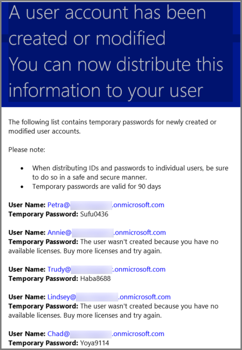

# <a name="add-several-users-at-the-same-time-to-office-365---admin-help"></a>Adicionar vários usuários ao mesmo tempo no Office 365 – Ajuda para Administradores

Cada pessoa da sua equipe precisa de uma conta de usuário antes que eles possam entrar e acessar os serviços do Office 365, como email e escritório. Se você tiver muitas pessoas, você pode adicionar suas contas ao mesmo tempo de uma planilha do Excel ou outro arquivo salvo no formato CSV. [é não tem certeza de qual formato CSV?](add-several-users-at-the-same-time.md#__toc316652088)
  
## <a name="add-multiple-users-to-office-365-in-the-office-365-admin-center"></a>Adicionar vários usuários para o Office 365 no Centro de administração do Office 365

1. Entre no Office 365 com sua conta corporativa ou de estudante. 
    
2. No Centro de administração do Office 365, escolha **usuários** \> **usuários ativos**.
    
    
  
3. No menu suspenso **mais** , escolha **importar vários usuários**.
    
4. No painel **importar vários usuários** , você pode opcionalmente baixar um arquivo CSV de exemplo com ou sem dados de amostra preenchidos. 
    
    
  
    Sua planilha precisa incluir os **títulos de colunas de mesma exato** como o exemplo de um (nome de usuário, nome, etc...). Se você usar o modelo, abri-lo em uma ferramenta de edição de texto, como o bloco de notas e considere deixando todos os dados na linha 1 sozinhos e apenas inserem dados nas linhas 2 e abaixo. 
    
    Sua planilha também precisa incluir valores para o nome de usuário (como bob@contoso.com) e um nome de exibição (como Bob Kelly) para cada usuário. 
    
  ```
  User Name,First Name,Last Name,Display Name,Job Title,Department,Office Number,Office Phone,Mobile Phone,Fax,Address,City,State or Province,ZIP or Postal Code,Country or Region
  chris@contoso.com,Chris,Green,Chris Green,IT Manager,Information Technology,123451,123-555-1211,123-555-6641,123-555-9821,1 Microsoft way,Redmond,Wa,98052,United States
  ben@contoso.com,Ben,Andrews,Ben Andrews,IT Manager,Information Technology,123452,123-555-1212,123-555-6642,123-555-9822,1 Microsoft way,Redmond,Wa,98052,United States
  david@contoso.com,David,Longmuir,David Longmuir,IT Manager,Information Technology,123453,123-555-1213,123-555-6643,123-555-9823,1 Microsoft way,Redmond,Wa,98052,United States
  cynthia@contoso.com,Cynthia,Carey,Cynthia Carey,IT Manager,Information Technology,123454,123-555-1214,123-555-6644,123-555-9824,1 Microsoft way,Redmond,Wa,98052,United States
  melissa@contoso.com,Melissa,MacBeth,Melissa MacBeth,IT Manager,Information Technology,123455,123-555-1215,123-555-6645,123-555-9825,1 Microsoft way,Redmond,Wa,98052,United States
  
  ```

5. Insira um caminho de arquivo na caixa ou escolha **Procurar** para navegar até o local do arquivo CSV, depois escolha **Verificar**.
    
    
  
    Se houver problemas com o arquivo, o problema é exibido no painel. Você também pode baixar um arquivo de log.
    
6. Na caixa de diálogo **definir opções de usuário** , você pode definir o status de entrada e escolha a licença do produto que será atribuída a todos os usuários. 
    
7. Na caixa de diálogo **Exibir seu resultado** , você pode optar por enviar os resultados para si mesmo ou outros usuários (serão senhas em texto sem formatação) e você pode ver quantos usuários foram criados, e se você precisar comprar mais licenças para atribuir a alguns dos novos usuários. 
    
## <a name="watch-the-video"></a>Assista ao vídeo
<a name="bk_preview"> </a>

 Assista a um vídeo rápido que mostra como em massa adicionar usuários. 
  
> [!VIDEO https://www.microsoft.com/videoplayer/embed/f4e7f161-8ae6-4264-a429-9297b539a8de?autoplay=false]
  
## <a name="next-steps"></a>Próximas etapas
<a name="bk_preview"> </a>

- Agora que essas pessoas têm contas, precisam [baixar e instalar ou reinstala o Office 365 ou 2016 do Office em um PC ou Mac](https://support.office.com/article/4414eaaf-0478-48be-9c42-23adc4716658). Cada pessoa da sua equipe pode instalar o Office 365 em até 5 computadores ou Macs. 
    
- Cada pessoa também pode [Configurar os aplicativos do Office e email em um dispositivo móvel](https://support.office.com/article/7dabb6cb-0046-40b6-81fe-767e0b1f014f) em até 5 tablets e 5 telefones, como iPhones, iPads e Android telefones e tablets. Dessa forma, que eles podem editar arquivos do Office em qualquer lugar. 
    
    Para obter uma lista de ponta a ponta das etapas de instalação, consulte [Configurar o Office 365 para empresas](https://support.office.com/article/6a3a29a0-e616-4713-99d1-15eda62d04fa) . 
    
## <a name="more-information-about-how-to-add-users-to-office-365"></a>Para obter mais informações sobre como adicionar usuários ao Office 365
<a name="bk_preview"> </a>

### <a name="not-sure-what-csv-format-is"></a>Não tem certeza que formato CSV é?
<a name="__toc316652088"> </a>

Um arquivo CSV é um arquivo com valores separados por vírgulas. Você pode criar ou editar um arquivo com qualquer editor de texto ou de um programa de planilha, como o Excel.
  
Você pode baixar [essa planilha de exemplo](https://www.microsoft.com/en-us/download/details.aspx?id=45485) como um ponto de partida. Lembre-se de que o Office 365 exige títulos de coluna na primeira linha portanto não substituí-los por algo diferente. 
  
Salve o arquivo com um novo nome e especifique o formato CSV.
  

  
Quando você salva o arquivo, você provavelmente receberá um prompt de que alguns recursos na sua pasta de trabalho serão perdidos se você salvar o arquivo no formato CSV. Isso é okey. Clique em **Sim** para continuar. 
  

  
### <a name="tips-for-formatting-your-spreadsheet"></a>Dicas para formatar sua planilha
<a name="__toc314595848"> </a>

- **eu preciso os mesmos títulos de coluna como a planilha de amostra?** Sim. A planilha de exemplo contém os títulos de coluna na primeira linha. Estes títulos são necessários. Para cada usuário que você deseja adicionar ao Office 365, crie uma linha sob o título. Se você adicionar, alterar ou excluir qualquer um dos títulos de coluna, Office 365 pode não ser capaz de criar usuários das informações no arquivo do. 
    
- **o que ocorre se eu não tenho todas as informações necessárias para cada usuário?** O nome de usuário e o nome de exibição são necessários, e você não pode adicionar um novo usuário sem essas informações. Se você não possui algumas das outras informações, como o fax, você pode usar um espaço, além de uma vírgula para indicar que o campo deve permanecer em branco. 
    
- * * Como pequeno ou grande pode ser a planilha? * * A planilha deve ter pelo menos duas linhas. Um é para os títulos de coluna (o usuário coluna rótulo de dados) e outra para o usuário. Você não pode ter mais de 251 linhas. Se você precisar importar mais de 250 usuários, você pode criar mais de uma planilha. 
    
- * * Quais idiomas pode usar? * * Quando você criar sua planilha, você pode inserir rótulos de coluna de dados de usuário em qualquer idioma ou caracteres, mas você não deve alterar a ordem dos rótulos, conforme mostrado no exemplo. Você pode fazer com que entradas para os campos, usando qualquer idioma ou caracteres e salve o arquivo em um formato Unicode ou UTF-8. 
    
- **o que ocorre se eu estou adicionando usuários de diferentes países ou regiões?** Crie uma planilha separada para cada área. Você precisará percorrer o grosso Assistente para adicionar usuários qual cada planilha, oferecendo um único local de todos os usuários incluídos no arquivo que você está trabalhando. 
    
- **Existe um limite para o número de caracteres que eu posso usar?** A tabela a seguir mostra os rótulos de coluna de dados de usuário e o comprimento máximo de caracteres para cada da planilha de amostra. 
    
|**Rótulo de coluna de dados de usuário**|**Comprimento máximo de caracteres**|
|:-----|:-----|
|Nome de usuário (obrigatório)  <br/> |incluindo 79 o sinal de arroba (@), em name@domain o formato. \<extensão\>. O alias do usuário não pode exceder 30 caracteres e o nome de domínio não pode exceder 48 caracteres.  <br/> |
|Nome  <br/> |64  <br/> |
|Sobrenome  <br/> |64  <br/> |
|Nome para exibição (obrigatório)  <br/> |256  <br/> |
|Cargo  <br/> |64  <br/> |
|Departamento  <br/> |64  <br/> |
|Número do escritório  <br/> |128  <br/> |
|Telefone Comercial  <br/> |64  <br/> |
|Celular  <br/> |64  <br/> |
|Fax  <br/> |64  <br/> |
|Endereço  <br/> |1023  <br/> |
|Cidade  <br/> |128  <br/> |
|Estado ou Província  <br/> |128  <br/> |
|CEP ou código Postal  <br/> |40  <br/> |
|País ou Região  <br/> |128  <br/> |
   
### <a name="still-having-problems-when-adding-users-to-office-365"></a>Ainda está com problemas ao adicionar usuários para o Office 365?

- **Verifique novamente se a planilha está formatada corretamente.** Verifique se os títulos de coluna para certificar-se de que haja correspondência com os títulos no arquivo de exemplo. Certifique-se de que você está seguindo as regras de comprimentos de caracteres, e cada campo é separado por uma vírgula. 
    
- * * Se você não vir os novos usuários no Office 365 imediatamente, aguarde alguns minutos. * * Pode demorar um pouco enquanto para alterações vá em todos os serviços no Office 365. 
    
## <a name="add-multiple-users-to-office-365-in-the-old-office-365-admin-center"></a>Adicionar vários usuários para o Office 365 no Centro de administração do Office 365 antigo

1. Baixe [essa planilha de exemplo](https://www.microsoft.com/en-us/download/details.aspx?id=45485) e abri-lo no Excel. 
    
    Sua planilha precisa incluir os **títulos de colunas de mesma exato** como o exemplo de um (nome de usuário, nome, etc...). Se você usar o modelo, considere deixando todos os dados na linha 1 sozinhos e apenas inserem dados nas linhas 2 e abaixo. 
    
    Sua planilha também precisa incluir valores para o nome de usuário (como bob@contoso.com) e um nome de exibição (como Bob Kelly) para cada usuário. Para deixar os outros campos em branco, insira um espaço, além de uma vírgula no campo conforme mostrado na figura a seguir. 
    
    
  
    Se você tiver pessoas que trabalham em diferentes países, você precisará criar uma planilha para os usuários em cada país. Por exemplo, uma planilha que lista todas as pessoas que funciona nos EUA e outro que lista todas as pessoas que funciona no Japão. Isso ocorre porque a disponibilidade dos serviços do Office 365 varia por região. 
    
    **Dica:** Antes de adicionar vários usuários para o Office 365, você talvez queira prática com a planilha de exemplo. Por exemplo, edite a planilha de amostra com os dados de alguns dos seus usuários, diga 5 ou 10 e salve o arquivo com um novo nome. Executar etapas descritas neste procedimento, verifique os resultados e excluir as novas contas e recomece novamente. Dessa forma, que você pode practice obtendo todos o direito de dados à sua situação. Confira também [dicas para formatação de sua planilha](add-several-users-at-the-same-time.md#__toc314595848).
    
2. Entre no Office 365 com sua conta corporativa ou de estudante. 
    
3. Vá para o centro de administração do Office 365.
    
4. Para as pessoas a usar os serviços do Office 365, elas precisam ser atribuiu uma licença. Antes de continuar, talvez você queira Verifique se você tem licenças suficientes para todas as pessoas listadas em sua planilha. Escolha **de faturamento** \> **inscrições** para ver se você tem suficiente. Se você precisar comprar mais licenças, escolha * * alterar a quantidade de licença * *. Ou, você pode executar o assistente e atribuir as licenças que você tiver, compra mais licenças posteriormente e executar novamente o assistente. 
    
5. Agora vá para o grosso Adicionar Assistente para usuários: escolha **usuários** \> **Usuários ativos**. Escolha  conforme mostrado na figura a seguir. 
    
    
  
    A maior parte adicionar usuários assistente aparece e percorre a adição de um grupo de usuários para o Office 365. 
    
6. Na etapa 1: selecione um arquivo CSV, especifique seu próprio planilha conforme mostrado na figura a seguir.
    
    
  
7. Na etapa 2 - verificação, o assistente informa se o conteúdo da planilha está formatado corretamente.
    
    
  
8. Na etapa 3 - configurações, escolha **permitidos** para que as pessoas listadas em sua planilha poderão usar o Office 365. Também escolha o país em que essas pessoas usarão o Office 365. Lembre-se se algumas pessoas na sua organização pretende usar o Office 365 em um país diferente, crie uma planilha separada com seus nomes e executar o grosso Adicionar Assistente usuários novamente para adicioná-los. 
    
    
  
9. Página Atribuir licenças informa quantas licenças estão disponíveis. 
    
    
  
    Você pode escolher **comprar mais licenças**, mas você vai deixar em massa adicionar o Assistente para usuários e vá para **faturamento** no Centro de administração do Office 365. Depois de comprar mais licenças, você vai ter que aguarde alguns minutos para a ordem de processamento e iniciar o grosso adicione Assistente para usuários desde o início. 
    
    Se você não comprar mais licenças, contas não serão criadas para cada pessoa listada em sua planilha. 
    
    Neste exemplo, podemos não comprar mais licenças de qualquer e continuar com a maior parte adicionar o Assistente para usuários.
    
10. Na etapa 5 - enviar resultados, digite os endereços de email das pessoas que você deseja obter um email alertando que lista *todos os* do Office 365 nomes de usuário e senhas temporárias para as pessoas na planilha. 
    
    
  
    O seguinte email é enviado a todos os endereços de email que você especificou na etapa 5 - enviar resultados. Este email indica as contas que foram criadas. Observe que as contas não foram criadas para algumas pessoas porque não havia licenças suficientes. 
    
    
  
    Você pode comprar mais licenças posteriormente e novamente em massa Adicionar Assistente para usuários com a mesma planilha. O assistente ignora os usuários que já têm contas; no relatório de resultados, ele indicará que a "nome de usuário duplicado" para indicar a alguém com essas informações já tem uma conta.
    
11. A página final na massa Adicionar Assistente de usuários lista os nomes de usuário e senhas temporárias, conforme mostrado na figura a seguir.
    
    
  
12. Depois de adicionar usuários ao Office 365, você precisa informá-los sobre suas próprias informações de conta do Office 365. Use o processo normal para a comunicação de novas senhas.
    

