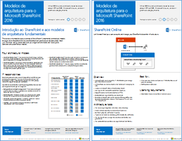
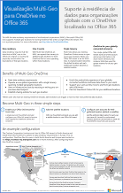
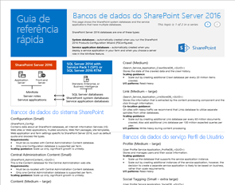
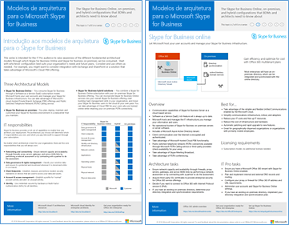
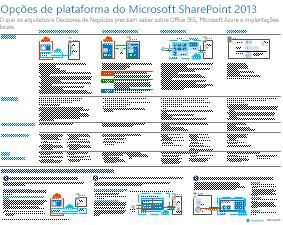
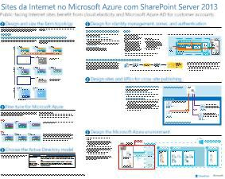
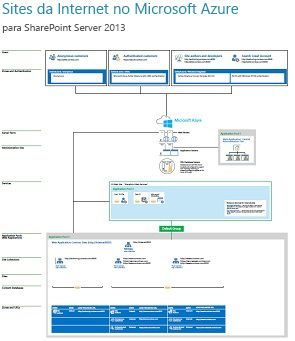

# Modelos de arquitetura para SharePoint, Exchange, Skype for Business e LyncArchitectural models for SharePoint, Exchange, Skype for Business, and Lync

 **Resumo:** obtenha os cartazes de TI que descrevem os modelos de arquitetura, implantação e opções de plataforma para o SharePoint, o Exchange, o Skype for Business e o Lync.**Summary:** Get the IT posters that describe the architectural models, deployment, and platform options for SharePoint, Exchange, Skype for Business, and Lync.
  
Estes cartazes de TI descrevem os modelos de arquitetura e as opções de implantação para o SharePoint, o Exchange, o Skype for Business e o Lync e fornecem informações sobre o design para a implantação do SharePoint no Microsoft Azure.These IT posters describe the architectural models and deployment options for SharePoint, Exchange, Skype for Business, and Lync, and they provide design information for deploying SharePoint in Microsoft Azure.
  
Com o Office 365, é possível fornecer a colaboração e os serviços de comunicação com os quais seus usuários estejam familiarizados como serviço baseado na nuvem. Com algumas poucas exceções, a experiência do usuário permanece a mesma, tanto se você estiver mantendo uma implantação local como usando o Office 365. Esta experiência unificada de usuário torna a decisão de onde colocar cada carga de trabalho menos direta e gera perguntas como:With Office 365, you can provide the collaboration and communication services your users are familiar with as a cloud-based service. With a few exceptions, the user experience remains the same whether you are maintaining an on-premises deployment or using Office 365. This unified user experience makes it less straightforward to decide where to place each workload and raises questions such as:
  
- Como determinar que opção de plataforma escolher para as suas cargas de trabalho individuais?How do you determine which platform option to choose for your individual workloads?
    
- Faz sentido manter algum serviço local?Does it make sense to keep any service on-premises?
    
- Em que cenário uma implantação híbrida é apropriada?What is a scenario where a hybrid deployment is appropriate?
    
- Como o Microsoft Azure se encaixa na situação?How does Microsoft Azure fit in the picture?
    
- Quais são as configurações suportadas para as cargas de trabalho do Office Server no Azure?What are the supported configurations for Office Server workloads in Azure?
    
> [!TIP]
> A maioria dos cartazes desta página está disponível em vários idiomas, inclusive alemão, chinês, coreano, espanhol, francês, inglês, italiano, japonês, português e russo. Para baixar um cartaz em um desses idiomas, clique no link **Mais idiomas**.Most of the posters on this page are available in multiple languages, including Chinese, English, French, German, Italian, Japanese, Korean, Portuguese, Russian, and Spanish. To download a poster in one of these languages, click the **More languages** link for that poster.
  
Dê sua opinião! Envie um email para [cloudadopt@microsoft.com](mailto:cloudadopt@microsoft.com).Let us know what you think! Send us email at [cloudadopt@microsoft.com](mailto:cloudadopt@microsoft.com). 
  
Esta página liga você aos seguintes cartazes:This page links you to the following posters:
  
- **Cartazes de modelos de arquiteturas** É possível usar estes recursos para determinar a plataforma e a configuração ideais para o SharePoint 2016 e o Skype for Business 2015.**Architectural models posters** You can use these resources to determine your ideal platform and configuration for SharePoint 2016 and Skype for Business 2015.
    
  - [Modelos de arquiteturas para o Microsoft SharePoint 2016Microsoft SharePoint 2016 Architectural Models](architectural-models-for-sharepoint-exchange-skype-for-business-and-lync.md#SP2016_ArchModel)
    
  - [Funcionalidades multigeográficas no OneDrive e SharePoint Online no Office 365Multi-Geo Capabilities in OneDrive and SharePoint Online in Office 365](architectural-models-for-sharepoint-exchange-skype-for-business-and-lync.md#MultiGeoO365ODB)
    
  - [Bancos de dados do SharePoint Server 2016SharePoint Server 2016 Databases](architectural-models-for-sharepoint-exchange-skype-for-business-and-lync.md#SP2016_Databases)
    
  - [Modelos de arquitetura para o Microsoft Skype for Business 2015Microsoft Skype for Business 2015 Architectural Models](architectural-models-for-sharepoint-exchange-skype-for-business-and-lync.md#SfB2015_ArchModel)
    
- **Cartazes com opções de plataforma** Você pode usar estes recursos para determinar a plataforma a e configuração ideais do SharePoint 2013, do Exchange 2013 e do Lync 2013.**Platform options posters** You can use these resources to determine your ideal platform and configuration for SharePoint 2013, Exchange 2013, and Lync 2013.
    
  - [Opções de plataforma para o SharePoint 2013SharePoint 2013 Platform Options](architectural-models-for-sharepoint-exchange-skype-for-business-and-lync.md#SP2013_Options)
    
  - [Opções de plataforma para o Exchange 2013Exchange 2013 Platform Options](architectural-models-for-sharepoint-exchange-skype-for-business-and-lync.md#Exch2013_options)
    
  - [Opções de plataforma para o Lync 2013Lync 2013 Platform Options](architectural-models-for-sharepoint-exchange-skype-for-business-and-lync.md#Lync2013_Options)
    
- **Cartazes com soluções para o SharePoint 2013 no Azure** Você pode usar estes cartazes de TI para determinar o design e a configuração para cargas de trabalho do SharePoint Server 2013 nos serviços de infraestrutura do Azure.**SharePoint Server 2013 in Azure solutions posters** You can use these IT posters to determine the design and configuration for SharePoint Server 2013 workloads in Azure infrastructure services.
    
  - [Sites da Internet no Microsoft Azure usando o SharePoint Server 2013Internet sites in Microsoft Azure using SharePoint Server 2013](architectural-models-for-sharepoint-exchange-skype-for-business-and-lync.md#Azure_sharepoint2013)
    
  - [Amostra de design: sites da Internet no Microsoft Azure para SharePoint 2013Design sample: Internet sites in Microsoft Azure for SharePoint 2013](architectural-models-for-sharepoint-exchange-skype-for-business-and-lync.md#DesignSampleInternetSites)
    
  - [Recuperação de desastres do SharePoint para o Microsoft AzureSharePoint Disaster Recovery to Microsoft Azure](architectural-models-for-sharepoint-exchange-skype-for-business-and-lync.md#sharepoint_recovery_Azure)
    
## Cartazes com modelos de arquiteturaArchitectural models posters

Esses novos cartazes de TI para o SharePoint 2016 e o Skype for Business 2015 oferecem uma maneira de comparar os vários métodos de implantação em um formato fácil de imprimir. Cada cartaz apresenta uma lista com todas as configurações ou opções de plataforma disponíveis e fornece as seguintes informações para cada opção:These new IT posters for SharePoint 2016 and Skype for Business 2015 provide a way to compare the various deployment methods in an easy-to-print format. Each poster provides a list of all the configurations or platform options available and gives you the following information for each option:
  
- **Visão geral** Um breve resumo da plataforma, incluindo um diagrama conceitual.**Overview** A brief summary of the platform, including a conceptual diagram.
    
- **Melhor para** Cenários comuns que são ideais para a plataforma específica.**Best for** Common scenarios that are ideally suited for the particular platform.
    
- **Requisitos de licença** As licenças necessárias para a implantação.**License requirements** The licenses you need for deployment.
    
- **Tarefas de arquitetura** As decisões que você precisa tomar como arquiteto.**Architecture tasks** The decisions you need to make as an architect.
    
- **Tarefas ou responsabilidades dos profissionais de TI** As responsabilidades diárias que a equipe de TI precisa planejar.**IT Pro tasks or responsibilities** The daily responsibilities that your IT staff needs to plan for.
    

### Modelos de arquiteturas para o Microsoft SharePoint 2016Microsoft SharePoint 2016 Architectural Models

|**Item****Item**|**Descrição****Description**|
|:-----|:-----|
|[          ](https://www.microsoft.com/download/details.aspx?id=52650)[          ](https://www.microsoft.com/download/details.aspx?id=52650)   [PDF](https://download.microsoft.com/download/4/F/A/4FA0F94B-EE2F-41DB-A047-D9864FEF41E9/SharePoint2016ArchitecturalModels.pdf)  \| [Visio](https://download.microsoft.com/download/4/F/A/4FA0F94B-EE2F-41DB-A047-D9864FEF41E9/SharePoint2016ArchitecturalModels.vsdx)  \| [Mais idiomas](https://www.microsoft.com/download/details.aspx?id=52650)[PDF](https://download.microsoft.com/download/4/F/A/4FA0F94B-EE2F-41DB-A047-D9864FEF41E9/SharePoint2016ArchitecturalModels.pdf)  \| [Visio](https://download.microsoft.com/download/4/F/A/4FA0F94B-EE2F-41DB-A047-D9864FEF41E9/SharePoint2016ArchitecturalModels.vsdx)  \| [More languages](https://www.microsoft.com/download/details.aspx?id=52650)   | Este cartaz de TI descreve as configurações locais do SharePoint Online, do Microsoft Azure, e do SharePoint de que os responsáveis por decisões de negócios e os arquitetos de soluções precisam saber.This IT poster describes the SharePoint Online, Microsoft Azure, and SharePoint on-premises configurations that business decision makers and solutions architects need to know about.    - **SharePoint Online (SaaS)** – consome o SharePoint por meio de um modelo de assinatura de software como serviço (SaaS).- **SharePoint Online (SaaS)** - Consume SharePoint through a Software as a Service (SaaS) subscription model.   - **SharePoint híbrido** – move seus sites e aplicativos do SharePoint para a nuvem seguindo seu ritmo.- **SharePoint Hybrid** - Move your SharePoint sites and apps to the cloud at your own pace.   - **SharePoint no Azure (IaaS)** – você estende seu ambiente local para o Microsoft Azure e implanta servidores do SharePoint 2016 lá. (Isso é recomendado para ambientes de alta disponibilidade/recuperação de desastres e desenvolvimento/testes).- **SharePoint in Azure (IaaS)** - You extend your on-premises environment into Microsoft Azure and deploy SharePoint 2016 Servers there. (This is recommended for High Availability/Disaster Recovery and dev/test environments.)   - **SharePoint Local** – você planeja, implanta, mantém e customiza o ambiente de SharePoint em um datacenter que você mantém.- **SharePoint On-premises** - You plan, deploy, maintain and customize your SharePoint environment in a datacenter that you maintain.   |
   

### Funcionalidades multigeográficas no OneDrive e SharePoint Online no Office 365Multi-Geo Capabilities in OneDrive and SharePoint Online in Office 365

|**Item****Item**|**Descrição****Description**|
|:-----|:-----|
|[          ](https://github.com/MicrosoftDocs/OfficeDocs-Enterprise/raw/live/Enterprise/media/Multi-Geo-ODB.pdf)[          ](https://github.com/MicrosoftDocs/OfficeDocs-Enterprise/raw/live/Enterprise/media/Multi-Geo-ODB.pdf)   [PDF](https://github.com/MicrosoftDocs/OfficeDocs-Enterprise/raw/live/Enterprise/media/Multi-Geo-ODB.pdf)  \| [Visio](https://github.com/MicrosoftDocs/OfficeDocs-Enterprise/raw/live/Enterprise/media/Multi-Geo-ODB.vsdx)[PDF](https://github.com/MicrosoftDocs/OfficeDocs-Enterprise/raw/live/Enterprise/media/Multi-Geo-ODB.pdf)  \| [Visio](https://github.com/MicrosoftDocs/OfficeDocs-Enterprise/raw/live/Enterprise/media/Multi-Geo-ODB.vsdx)   | Esse cartaz é uma descrição de uma página de funcionalidades multigeográficas do OneDrive e do SharePoint Online no Office 365. Este modelo inclui:This poster is a one-page overview of Multi-Geo Capabilities in OneDrive and SharePoint Online in Office 365. This model includes:    - Benefícios- Benefits   - Etapas de implantação- Steps for deployment   - Uma configuração de exemplo- An example configuration     Para saber mais sobre Funcionalidades Multigeográficas no OneDrive e no SharePoint Online do Office 365, clique [aqui](https://aka.ms/onedrivemultigeo).For more information about Multi-Geo Capabilities in OneDrive and SharePoint Online in Office 365, click [here](https://aka.ms/onedrivemultigeo).    |
   

### Bancos de dados do SharePoint Server 2016SharePoint Server 2016 Databases

|**Item****Item**|**Descrição****Description**|
|:-----|:-----|
|[          ](https://www.microsoft.com/download/details.aspx?id=55041)[          ](https://www.microsoft.com/download/details.aspx?id=55041)   [PDF](https://download.microsoft.com/download/D/5/D/D5DC1121-8BC5-4953-834F-1B5BB03EB691/DBrefguideSPS2016_tabloid.pdf)  \| [Visio](https://download.microsoft.com/download/D/5/D/D5DC1121-8BC5-4953-834F-1B5BB03EB691/DBrefguideSPS2016_tabloid.vsdx)  \| [Mais idiomas](https://www.microsoft.com/download/details.aspx?id=55041)[PDF](https://download.microsoft.com/download/D/5/D/D5DC1121-8BC5-4953-834F-1B5BB03EB691/DBrefguideSPS2016_tabloid.pdf)  \| [Visio](https://download.microsoft.com/download/D/5/D/D5DC1121-8BC5-4953-834F-1B5BB03EB691/DBrefguideSPS2016_tabloid.vsdx)  \| [More languages](https://www.microsoft.com/download/details.aspx?id=55041)   | Este cartaz de TI é um guia de referência rápida para bancos de dados do SharePoint Server 2016. Cada banco de dados contém os seguintes detalhes: This IT poster is a quick reference guide for SharePoint Server 2016 databases. Each database has the following details:    - Tamanho- Size   - Diretrizes de escala- Scaling guidance   - Padrões I/O- I/O patterns   - Requisitos- Requirements     A primeira página contém os bancos de dados do sistema do SharePoint e aplicativos de serviço com vários bancos de dados. A segunda página mostra todos os aplicativos de serviço com bancos de dados simples. The first page has the SharePoint system databases and the service applications that have multiple databases. The second page shows all of the service applications that have single databases.     Para saber mais sobre os bancos de dados para SharePoint Server 2016, confira [Tipos e descrições de bancos de dados no SharePoint Server 2016](https://technet.microsoft.com/pt-BR/library/cc678868%28v=office.16%29.aspx)For more information about the SharePoint Server 2016 databases, see [Database types and descriptions in SharePoint Server 2016](https://technet.microsoft.com/en-us/library/cc678868%28v=office.16%29.aspx)   |
   

### Modelos de arquitetura para o Microsoft Skype for Business 2015Microsoft Skype for Business 2015 Architectural Models

|**Item****Item**|**Descrição****Description**|
|:-----|:-----|
|[          ](https://www.microsoft.com/download/details.aspx?id=55022)[          ](https://www.microsoft.com/download/details.aspx?id=55022)   [PDF](https://download.microsoft.com/download/7/7/4/7741262C-A60D-41F7-863B-99BF5964FBFE/Skype%20for%20Business%20Architectural%20Models.pdf)  \| [Visio](https://download.microsoft.com/download/7/7/4/7741262C-A60D-41F7-863B-99BF5964FBFE/Skype%20for%20Business%20Architectural%20Models.vsd)  \| [Mais idiomas](https://www.microsoft.com/download/details.aspx?id=55022)[PDF](https://download.microsoft.com/download/7/7/4/7741262C-A60D-41F7-863B-99BF5964FBFE/Skype%20for%20Business%20Architectural%20Models.pdf)  \| [Visio](https://download.microsoft.com/download/7/7/4/7741262C-A60D-41F7-863B-99BF5964FBFE/Skype%20for%20Business%20Architectural%20Models.vsd)  \| [More languages](https://www.microsoft.com/download/details.aspx?id=55022)   |Este cartaz de TI descreve as configurações do Skype for Business Online, locais, híbridas, do cloud PBX e de integração com o Exchange e o SharePoint, que os responsáveis por decisões de negócios e os arquitetos de soluções precisam saber.This poster describes the Skype for Business Online, on-premises, hybrid, cloud PBX, and integration with Exchange and SharePoint configurations that business decision makers and solutions architects need to know about.    Destina-se a profissionais de TI com o objetivo de aumentar a consciência sobre os diferentes modelos de arquitetura fundamentais por meio dos quais o Skype for Business Online e o Skype for Business local podem ser consumidos.It is intended for the IT Pro audience to raise awareness of the different fundamental architectural models through which Skype for Business Online and Skype for Business on premises can be consumed.   Comece com qualquer configuração que melhor atenda às necessidades e planos futuros de sua organização. Por exemplo, talvez você queira considerar a integração com o Exchange e do SharePoint ou uma solução que tira proveito das ofertas do PBX da Microsoft Cloud.Start with whichever configuration best suits your organization's needs and future plans. Consider and use others as needed. For example, you might want to consider integration with Exchange and SharePoint or a solution that takes advantage of Microsoft's Cloud PBX offering.    |
   
## Cartazes com opções de plataformaPlatform options posters

Estes cartazes de TI para o SharePoint 2013, o Exchange 2013 e o Lync 2013 oferecem uma maneira para comparar os vários métodos de implantação de uma única vez em um formato de cartaz grande. Cada cartaz apresenta uma lista com todas as configurações ou opções de plataforma disponíveis e fornece as seguintes informações para cada opção:These IT posters for SharePoint 2013, Exchange 2013, and Lync 2013 provide a way to compare the various deployment methods at a single glance in a large poster format. Each poster provides a list of all the configurations or platform options available and gives you the following information for each option:
  
- **Visão geral** Um breve resumo da plataforma, incluindo um diagrama conceitual.**Overview** A brief summary of the platform, including a conceptual diagram.
    
- **Melhor para** Cenários comuns que são ideais para a plataforma específica.**Best for** Common scenarios that are ideally suited for the particular platform.
    
- **Requisitos de licença** As licenças necessárias para a implantação.**License requirements** The licenses you need for deployment.
    
- **Tarefas de arquitetura** As decisões que você precisa tomar como arquiteto.**Architecture tasks** The decisions you need to make as an architect.
    
- **Tarefas ou responsabilidades dos profissionais de TI** As responsabilidades diárias que a equipe de TI precisa planejar.**IT Pro tasks or responsibilities** The daily responsibilities that your IT staff needs to plan for.
    

## Opções de Plataforma para o SharePoint 2013SharePoint 2013 Platform Options

****

|**Item****Item**|**Descrição****Description**|
|:-----|:-----|
|[          ](https://www.microsoft.com/download/details.aspx?id=40332)[          ](https://www.microsoft.com/download/details.aspx?id=40332)   [PDF](http://go.microsoft.com/fwlink/p/?LinkId=324594)  \| [Visio](https://go.microsoft.com/fwlink/p/?LinkId=324593)  \| [Mais idiomas](https://www.microsoft.com/download/details.aspx?id=40332)[PDF](http://go.microsoft.com/fwlink/p/?LinkId=324594)  \| [Visio](https://go.microsoft.com/fwlink/p/?LinkId=324593)  \| [More languages](https://www.microsoft.com/download/details.aspx?id=40332)   |Para tomadores de decisões de negócios (BDMs) e arquitetos, este modelo descreve as opções de plataforma do SharePoint 2013, do SharePoint no Office 365, híbrido local com Office 365, Azure e implantações somente locais. Ele inclui uma visão geral de cada arquitetura, recomendações, requisitos de licença, e listas de tarefas de arquitetos e profissionais de TI para cada plataforma. Também são destacadas várias soluções do SharePoint no Windows Azure.For business decision makers (BDMs) and architects, this model shows the platform options for SharePoint 2013, SharePoint in Office 365, on-premises hybrid with Office 365, Azure, and on-premises only deployments. It includes an overview of each architecture, recommendations, license requirements, and lists of architect and IT Pro tasks for each platform. Several SharePoint solutions on Azure are highlighted.   Para uma versão acessível deste cartaz em texto, confira [Diagrama acessível, opções de plataforma para Microsoft SharePoint 2013](accessible-diagrammicrosoft-sharepoint-2013-platform-options.md).For an accessible text version of this poster, see [Accessible diagram - Microsoft SharePoint 2013 Platform Options](accessible-diagrammicrosoft-sharepoint-2013-platform-options.md).    |
   

## Opções de plataforma para o Exchange 2013Exchange 2013 Platform Options

****

|**Item****Item**|**Descrição****Description**|
|:-----|:-----|
|[          ](https://www.microsoft.com/download/details.aspx?id=42676)[          ](https://www.microsoft.com/download/details.aspx?id=42676)   [PDF](https://go.microsoft.com/fwlink/p/?LinkID=398740)  \| [Visio](https://go.microsoft.com/fwlink/p/?LinkID=398742)  \| [Mais idiomas](https://www.microsoft.com/download/details.aspx?id=42676)[PDF](https://go.microsoft.com/fwlink/p/?LinkID=398740)  \| [Visio](https://go.microsoft.com/fwlink/p/?LinkID=398742)  \| [More languages](https://www.microsoft.com/download/details.aspx?id=42676)   |Para os responsáveis por decisões de negócios e os arquitetos, este modelo descreve as opções de plataforma disponíveis para o Exchange 2013. Os clientes podem escolher entre o Exchange Online com o Office 365, Exchange híbrido, Exchange Server local e Exchange alojado. O cartaz inclui detalhes de cada opção de arquitetura, incluindo os cenários mais ideais para cada uma delas, os requisitos de licença e as responsabilidades dos profissionais de TI.For BDMs and architects, this model describes the available platform options for Exchange 2013. Customers can choose from Exchange Online with Office 365, Hybrid Exchange, Exchange Server on-premises and Hosted Exchange. The poster includes details of each architectural option, including the most ideal scenarios for each, the license requirements and IT Pro responsibilities.   Para uma versão acessível deste cartaz em texto, confira [Diagrama acessível, opções de plataforma para Microsoft SharePoint 2013](accessible-diagrammicrosoft-exchange-2013-platform-options.md).For an accessible text version of this poster, see [Accessible diagram - Microsoft Exchange 2013 Platform Options](accessible-diagrammicrosoft-exchange-2013-platform-options.md).    |
   

## Opções de plataforma para o Lync 2013Lync 2013 Platform Options

****

|**Item****Item**|**Descrição****Description**|
|:-----|:-----|
|[          ](https://www.microsoft.com/download/details.aspx?id=41677)[          ](https://www.microsoft.com/download/details.aspx?id=41677)   [PDF](https://go.microsoft.com/fwlink/p/?LinkID=391837)  \| [Visio](https://go.microsoft.com/fwlink/p/?LinkID=391839)  \| [Mais idiomas](https://www.microsoft.com/download/details.aspx?id=41677)[PDF](https://go.microsoft.com/fwlink/p/?LinkID=391837)  \| [Visio](https://go.microsoft.com/fwlink/p/?LinkID=391839)  \| [More languages](https://www.microsoft.com/download/details.aspx?id=41677)   |Para os responsáveis por decisões de negócios e os arquitetos, este modelo descreve as opções de plataforma disponível para o Lync 2013. Os clientes podem escolher entre o Lync Online com o Office 365, o Lync Híbrido, o Lync Server local e o Lync Hospedado. O cartaz de TI inclui detalhes de cada opção de arquitetura, incluindo os cenários mais ideais para cada uma delas, os requisitos de licença e responsabilidades dos profissionais de TI.For BDMs and architects, this model describes the available platform options for Lync 2013. Customers can choose from Lync Online with Office 365, Hybrid Lync, Lync Server on-premises and Hosted Lync. The IT poster includes details of each architectural option, including the most ideal scenarios for each, the license requirements and IT Pro responsibilities.    |
   

## Cartazes com soluções do SharePoint no AzureSharePoint in Azure solutions posters

Estes cartazes de TI mostram soluções baseadas em Azure usando o SharePoint Server 2013 em um formato de cartaz grande.These IT posters show Azure-based solutions using SharePoint Server 2013 in a large poster format.
  

### Sites da Internet no Microsoft Azure usando o SharePoint Server 2013Internet sites in Microsoft Azure using SharePoint Server 2013

****

|**Item****Item**|**Descrição****Description**|
|:-----|:-----|
|[          ](https://www.microsoft.com/download/details.aspx?id=41992)[          ](https://www.microsoft.com/download/details.aspx?id=41992)   [PDF](https://go.microsoft.com/fwlink/p/?LinkId=392552)  \| [Visio](https://go.microsoft.com/fwlink/p/?LinkId=392551)  \| [Mais idiomas](https://www.microsoft.com/download/details.aspx?id=41992)[PDF](https://go.microsoft.com/fwlink/p/?LinkId=392552)  \| [Visio](https://go.microsoft.com/fwlink/p/?LinkId=392551)  \| [More languages](https://www.microsoft.com/download/details.aspx?id=41992)   |Este cartaz descreve as principais atividades de design e as opções de arquitetura recomendadas para sites voltados para a Internet no Azure. Para obter uma versão acessível deste cartaz em texto, confira [Diagrama acessível - Sites da Internet no Microsoft Azure para SharePoint 2013](accessible-diagraminternet-sites-in-microsoft-azure-for-sharepoint-2013.md).This poster outlines key design activities and recommended architecture choices for Internet-facing sites in Azure. For an accessible text version of this poster, see [Accessible diagram - Internet sites in Microsoft Azure for SharePoint 2013](accessible-diagraminternet-sites-in-microsoft-azure-for-sharepoint-2013.md).     Para saber mais, confira os seguintes artigos:For more information, see the following articles:     - [Sites da Internet no Microsoft Azure usando o SharePoint Server 2013](internet-sites-in-microsoft-azure-using-sharepoint-server-2013.md)- [Internet Sites in Microsoft Azure using SharePoint Server 2013](internet-sites-in-microsoft-azure-using-sharepoint-server-2013.md)   - [Arquiteturas do Microsoft Azure para o SharePoint 2013](microsoft-azure-architectures-for-sharepoint-2013.md)- [Microsoft Azure Architectures for SharePoint 2013](microsoft-azure-architectures-for-sharepoint-2013.md)   |
   

### Exemplo de design: sites da Internet no Microsoft Azure para SharePoint 2013Design sample: Internet sites in Microsoft Azure for SharePoint 2013

****

|**Item****Item**|**Descrição****Description**|
|:-----|:-----|
|[          ](https://www.microsoft.com/download/details.aspx?id=41991)   [PDF](https://go.microsoft.com/fwlink/p/?LinkId=392549)  \| [Visio](https://go.microsoft.com/fwlink/p/?LinkId=392548)  \| [Mais idiomas](https://www.microsoft.com/download/details.aspx?id=41991)[PDF](https://go.microsoft.com/fwlink/p/?LinkId=392549)  \| [Visio](https://go.microsoft.com/fwlink/p/?LinkId=392548)  \| [More languages](https://www.microsoft.com/download/details.aspx?id=41991)   |Use este exemplo de design como ponto de partida para seu próprio site de arquitetura voltado para a Internet no Azure usando o SharePoint Server 2013. Para obter uma versão acessível deste cartaz em texto, confira [Diagrama acessível - Amostra de design: sites da Internet no Microsoft Azure para SharePoint 2013](accessible-diagramdesign-sample-internet-sites-in-microsoft-azure-for-sharepoint.md).Use this design sample as a starting point for your own architecture Internet-facing site in Azure using SharePoint Server 2013. For an accessible text version of this poster, see [Accessible diagram - Design sample: Internet sites in Microsoft Azure for SharePoint 2013](accessible-diagramdesign-sample-internet-sites-in-microsoft-azure-for-sharepoint.md).     Para saber mais, confira os seguintes artigos:For more information, see the following articles:     - [Sites da Internet no Microsoft Azure usando o SharePoint Server 2013](internet-sites-in-microsoft-azure-using-sharepoint-server-2013.md)- [Internet Sites in Microsoft Azure using SharePoint Server 2013](internet-sites-in-microsoft-azure-using-sharepoint-server-2013.md)   - [Arquiteturas do Microsoft Azure para o SharePoint 2013](microsoft-azure-architectures-for-sharepoint-2013.md)- [Microsoft Azure Architectures for SharePoint 2013](microsoft-azure-architectures-for-sharepoint-2013.md)   |
   

### Recuperação de desastres do SharePoint para o Microsoft AzureSharePoint Disaster Recovery to Microsoft Azure

****

|**Item****Item**|**Descrição****Description**|
|:-----|:-----|
|[          ](https://www.microsoft.com/download/details.aspx?id=41993)[          ](https://www.microsoft.com/download/details.aspx?id=41993)   [PDF](https://go.microsoft.com/fwlink/p/?LinkId=392555)  \| [Visio](https://go.microsoft.com/fwlink/p/?LinkId=392554)  \| [Mais idiomas](https://www.microsoft.com/download/details.aspx?id=41993)[PDF](https://go.microsoft.com/fwlink/p/?LinkId=392555)  \| [Visio](https://go.microsoft.com/fwlink/p/?LinkId=392554)  \| [More languages](https://www.microsoft.com/download/details.aspx?id=41993)   |Este cartaz de TI ilustra os princípios de arquitetura de um ambiente de recuperação de desastres no Azure. Para obter uma versão acessível deste cartaz em texto, veja [Diagrama acessível - Recuperação de desastres do SharePoint para Microsoft Azure](accessible-diagramsharepoint-disaster-recovery-to-microsoft-azure.md).This IT poster shows architecture principles for a disaster recovery environment in Azure. For an accessible text version of this poster, see [Accessible diagram - SharePoint Disaster Recovery to Microsoft Azure](accessible-diagramsharepoint-disaster-recovery-to-microsoft-azure.md).     Para saber mais, confira os seguintes artigos:For more information, see the following articles:     - [Recuperação de desastres do SharePoint Server 2013 no Microsoft Azure](sharepoint-server-2013-disaster-recovery-in-microsoft-azure.md)- [SharePoint Server 2013 Disaster Recovery in Microsoft Azure](sharepoint-server-2013-disaster-recovery-in-microsoft-azure.md)   - [Arquiteturas do Microsoft Azure para o SharePoint 2013](microsoft-azure-architectures-for-sharepoint-2013.md)- [Microsoft Azure Architectures for SharePoint 2013](microsoft-azure-architectures-for-sharepoint-2013.md)   |
   

## Confira também
See Also

[Adoção da nuvem e soluções híbridasCloud adoption and hybrid solutions](cloud-adoption-and-hybrid-solutions.md)
  
[Recursos de arquitetura de TI do MicrosoftMicrosoft Cloud IT architecture resources](microsoft-cloud-it-architecture-resources.md)
  
[Guias do Laboratório de Teste (TLGs) para adoção de nuvemCloud adoption Test Lab Guides (TLGs)](cloud-adoption-test-lab-guides-tlgs.md)
  
[Soluções híbridasHybrid solutions](hybrid-solutions.md)

