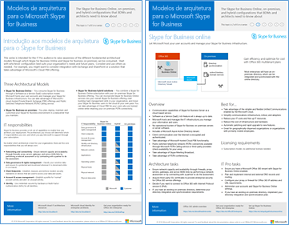
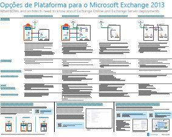
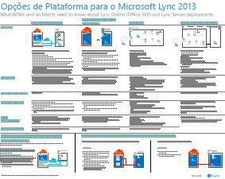

# Modelos de arquitetura para SharePoint, Exchange, Skype for Business e Lync

 **Resumo:** Obtenha os cartazes IT que descrevem os modelos de arquitetura, implantação e opções de plataforma para SharePoint, Exchange, Skype para Lync e de negócios.
  
Estes cartazes de TI descrevem os modelos de arquitetura e as opções de implantação para o SharePoint, o Exchange, o Skype for Business e o Lync e fornecem informações sobre o design para a implantação do SharePoint no Microsoft Azure.
  
Com o Office 365, você pode fornecer os serviços de colaboração e comunicação, que os usuários estão familiarizados com como um serviço baseado em nuvem. Com algumas poucas exceções, a experiência do usuário permanece o mesmo se você está mantendo uma implantação local ou usando o Office 365. Esta experiência de usuário unificada torna menos direto decidir onde colocar cada carga de trabalho e levanta questões como:
  
- Como determinar que opção de plataforma escolher para as suas cargas de trabalho individuais?
    
- Faz sentido manter algum serviço local?
    
- Em que cenário uma implantação híbrida é apropriada?
    
- Como o Microsoft Azure se encaixa na Figura?
    
- Quais são as configurações suportadas para as cargas de trabalho do Office Server no Azure?
    
> [!TIP]
> A maioria dos cartazes desta página está disponível em vários idiomas, inclusive alemão, chinês, coreano, espanhol, francês, inglês, italiano, japonês, português e russo. Para baixar um cartaz em um desses idiomas, clique no link **Mais idiomas**.
  
Dê sua opinião! Envie um email para [cloudadopt@microsoft.com](mailto:cloudadopt@microsoft.com). 
  
Esta página liga você aos seguintes cartazes:
  
- **Modelos de arquitetônica cartazes** Você pode usar estes recursos para determinar a configuração para o SharePoint 2016 e Skype para negócios 2015 e plataforma ideal.
    
  - [Modelos de arquitetura do Microsoft SharePoint 2016](architectural-models-for-sharepoint-exchange-skype-for-business-and-lync.md#SP2016_ArchModel)
    
  - [Visualização de multi-Geo onedrive no Office 365](architectural-models-for-sharepoint-exchange-skype-for-business-and-lync.md#MultiGeoO365ODB)
    
  - [Bancos de dados do SharePoint Server 2016](architectural-models-for-sharepoint-exchange-skype-for-business-and-lync.md#SP2016_Databases)
    
  - [Microsoft Skype para modelos de arquitetura de negócios 2015](architectural-models-for-sharepoint-exchange-skype-for-business-and-lync.md#SfB2015_ArchModel)
    
- **Cartazes de opções de plataforma** Você pode usar estes recursos para determinar a configuração para o SharePoint 2013, Exchange 2013 e Lync 2013 e a plataforma ideal.
    
  - [Opções de plataforma do SharePoint 2013](architectural-models-for-sharepoint-exchange-skype-for-business-and-lync.md#SP2013_Options)
    
  - [Opções de plataforma do Exchange 2013](architectural-models-for-sharepoint-exchange-skype-for-business-and-lync.md#Exch2013_options)
    
  - [Opções de plataforma do Lync 2013](architectural-models-for-sharepoint-exchange-skype-for-business-and-lync.md#Lync2013_Options)
    
- **SharePoint Server 2013 in cartazes de soluções do Windows Azure** Você pode usar essas cartazes IT para determinar o design e configuração para cargas de trabalho do SharePoint Server 2013 nos serviços de infraestrutura do Windows Azure.
    
  - [Sites da Internet no Microsoft Azure using SharePoint Server 2013](architectural-models-for-sharepoint-exchange-skype-for-business-and-lync.md#Azure_sharepoint2013)
    
  - [Amostra de design: sites da Internet no Microsoft Azure para o SharePoint 2013](architectural-models-for-sharepoint-exchange-skype-for-business-and-lync.md#DesignSampleInternetSites)
    
  - [Recuperação de desastres do SharePoint para Microsoft Azure](architectural-models-for-sharepoint-exchange-skype-for-business-and-lync.md#sharepoint_recovery_Azure)
    
## Cartazes com modelos de arquitetura

Esses novos cartazes de TI para o SharePoint 2016 e o Skype for Business 2015 oferecem uma maneira de comparar os vários métodos de implantação em um formato fácil de imprimir. Cada cartaz apresenta uma lista com todas as configurações ou opções de plataforma disponíveis e fornece as seguintes informações para cada opção:
  
- **Visão geral** Um breve resumo da plataforma, incluindo um diagrama conceitual.
    
- **Melhor para** Cenários comuns que são ideais para a plataforma específica.
    
- **Requisitos de licença** As licenças que necessárias para a implantação.
    
- **Tarefas de arquitetura** As decisões que você precisa tomar um arquiteto.
    
- **Tarefas de profissional de TI ou responsabilidades** As responsabilidades diárias que sua equipe de TI precisa planejar.
    
### Modelos de arquiteturas para o Microsoft SharePoint 2016

|**Item**|**Descrição**|
|:-----|:-----|
|[          ](https://www.microsoft.com/download/details.aspx?id=52650)   [PDF](https://download.microsoft.com/download/4/F/A/4FA0F94B-EE2F-41DB-A047-D9864FEF41E9/SharePoint2016ArchitecturalModels.pdf)  \| [Visio](https://download.microsoft.com/download/4/F/A/4FA0F94B-EE2F-41DB-A047-D9864FEF41E9/SharePoint2016ArchitecturalModels.vsdx)  \| [Mais idiomas](https://www.microsoft.com/download/details.aspx?id=52650)   | Este cartaz de TI descreve as configurações locais do SharePoint Online, do Microsoft Azure, e do SharePoint de que os responsáveis por decisões de negócios e os arquitetos de soluções precisam saber.    - **SharePoint Online (SaaS)** - consumir SharePoint por meio de um Software como um modelo de assinatura do serviço (SaaS).   - **SharePoint híbrido** - mover seus sites do SharePoint e aplicativos para a nuvem em seu próprio ritmo.   - **SharePoint no Windows Azure (IaaS)** - você estender seu ambiente local em Microsoft Azure e implantar servidores do SharePoint 2016 lá. (Isso é recomendado para ambientes de desenvolvimento e teste e alta disponibilidade/recuperação de desastre).  - **SharePoint local** - planejar, implantar, manter e personalizar o seu ambiente do SharePoint em um data center que você faz manutenção.   |
   
### Visualização de multi-Geo onedrive no Office 365

|**Item**|**Descrição**|
|:-----|:-----|
|[          ](http://download.microsoft.com/download/0/5/9/0594634F-7893-4201-938A-C2FF2F21B655/Multi-Geo-ODB.pdf)   [PDF](http://download.microsoft.com/download/0/5/9/0594634F-7893-4201-938A-C2FF2F21B655/Multi-Geo-ODB.pdf)  \| [Visio](http://download.microsoft.com/download/0/5/9/0594634F-7893-4201-938A-C2FF2F21B655/Multi-Geo-ODB.vsdx)   | Este modelo é uma visão geral de uma página do OneDrive Multi-Geo no Office 365, que está atualmente no modo de visualização particular. Este modelo inclui:   -Benefícios   -Etapas de implantação   -Um exemplo de configuração     Para obter mais informações sobre a visualização de Multi-Geo onedrive no Office 365, clique [aqui](https://aka.ms/onedrivemultigeo).    |
   
### Bancos de dados do SharePoint Server 2016

|**Item**|**Descrição**|
|:-----|:-----|
|[          ](https://www.microsoft.com/download/details.aspx?id=55041)   [PDF](https://download.microsoft.com/download/D/5/D/D5DC1121-8BC5-4953-834F-1B5BB03EB691/DBrefguideSPS2016_tabloid.pdf)  \| [Visio](https://download.microsoft.com/download/D/5/D/D5DC1121-8BC5-4953-834F-1B5BB03EB691/DBrefguideSPS2016_tabloid.vsdx)  \| [Mais idiomas](https://www.microsoft.com/download/details.aspx?id=55041)   | Este cartaz de TI é um guia de referência rápida para bancos de dados do SharePoint Server 2016. Cada banco de dados contém os seguintes detalhes:   -Size   -Diretrizes de dimensionamento   -Padrões de e/s   -Requisitos     A primeira página contém os bancos de dados de sistema do SharePoint e os aplicativos de serviço que tem vários bancos de dados. A segunda página mostra todos os aplicativos de serviço que tem bancos de dados único.    Para obter mais informações sobre os bancos de dados do SharePoint Server 2016, consulte [Database types and descriptions no SharePoint Server 2016](https://technet.microsoft.com/en-us/library/cc678868%28v=office.16%29.aspx)   |
   
### Modelos de arquitetura para o Microsoft Skype for Business 2015

|**Item**|**Descrição**|
|:-----|:-----|
|[          ](https://www.microsoft.com/download/details.aspx?id=55022)   [PDF](https://download.microsoft.com/download/7/7/4/7741262C-A60D-41F7-863B-99BF5964FBFE/Skype%20for%20Business%20Architectural%20Models.pdf)  \| [Visio](https://download.microsoft.com/download/7/7/4/7741262C-A60D-41F7-863B-99BF5964FBFE/Skype%20for%20Business%20Architectural%20Models.vsd)  \| [Mais idiomas](https://www.microsoft.com/download/details.aspx?id=55022)   |Este cartaz descreve o Skype para negócios Online, local, híbrida, nuvem PBX e integração com as configurações do Exchange e SharePoint que tomadores de decisão de negócios e arquitetos de soluções precisam saber sobre.    Ele foi projetado para o público profissional de TI a atenção dos modelos de arquitetura diferentes fundamentais através do qual podem ser consumido Skype para Business Online e Skype for Business no local.   Comece com qualquer configuração recomendada adequada às necessidades da sua organização e os planos futuros. Considere e usar outras pessoas conforme necessário. Por exemplo, convém considerar a integração com o Exchange e SharePoint ou uma solução que aproveita a oferta de PBX de nuvem da Microsoft.    |
   
## Cartazes com opções de plataforma

Estes cartazes de TI para o SharePoint 2013, o Exchange 2013 e o Lync 2013 oferecem uma maneira para comparar os vários métodos de implantação de uma única vez em um formato de cartaz grande. Cada cartaz apresenta uma lista com todas as configurações ou opções de plataforma disponíveis e fornece as seguintes informações para cada opção:
  
- **Visão geral** Um breve resumo da plataforma, incluindo um diagrama conceitual.
    
- **Melhor para** Cenários comuns que são ideais para a plataforma específica.
    
- **Requisitos de licença** As licenças que necessárias para a implantação.
    
- **Tarefas de arquitetura** As decisões que você precisa tomar um arquiteto.
    
- **Tarefas de profissional de TI ou responsabilidades** As responsabilidades diárias que sua equipe de TI precisa planejar.
    
## Opções de Plataforma para o SharePoint 2013

****

|**Item**|**Descrição**|
|:-----|:-----|
|[          ](https://www.microsoft.com/download/details.aspx?id=40332)   [PDF](http://go.microsoft.com/fwlink/p/?LinkId=324594)  \| [Visio](https://go.microsoft.com/fwlink/p/?LinkId=324593)  \| [Mais idiomas](https://www.microsoft.com/download/details.aspx?id=40332)   |Para obter e business decision tomadores de arquitetos, este modelo ilustra as opções de plataforma para o SharePoint 2013, SharePoint no Office 365, híbrido local com o Office 365, Windows Azure e implantações apenas locais. Ela inclui uma visão geral de cada arquitetura, recomendações, requisitos de licença e listas de arquiteto e tarefas para profissionais de TI em cada plataforma. Várias soluções do SharePoint no Azure são realçadas.  Para obter uma versão texto acessível este cartaz, consulte o [diagrama acessível - opções de plataforma do Microsoft SharePoint 2013](accessible-diagrammicrosoft-sharepoint-2013-platform-options.md).    |
   
## Opções de plataforma para o Exchange 2013

****

|**Item**|**Descrição**|
|:-----|:-----|
|[          ](https://www.microsoft.com/download/details.aspx?id=42676)   [PDF](https://go.microsoft.com/fwlink/p/?LinkID=398740)  \| [Visio](https://go.microsoft.com/fwlink/p/?LinkID=398742)  \| [Mais idiomas](https://www.microsoft.com/download/details.aspx?id=42676)   |Para arquitetos e BDMs, este modelo descreve as opções de plataforma disponíveis para o Exchange 2013. Os clientes podem escolher entre o Exchange Online com o Office 365, Exchange híbrido, Exchange Server local e Hosted Exchange. O cartaz e inclui detalhes de cada opção de arquitetura, incluindo os cenários mais ideais para cada um, os requisitos de licença e as responsabilidades profissionais de TI.  Para obter uma versão texto acessível este cartaz, consulte o [diagrama acessível - opções de plataforma do Microsoft Exchange 2013](accessible-diagrammicrosoft-exchange-2013-platform-options.md).    |
   
## Opções de plataforma para o Lync 2013

****

|**Item**|**Descrição**|
|:-----|:-----|
|[          ](https://www.microsoft.com/download/details.aspx?id=41677)   [PDF](https://go.microsoft.com/fwlink/p/?LinkID=391837)  \| [Visio](https://go.microsoft.com/fwlink/p/?LinkID=391839)  \| [Mais idiomas](https://www.microsoft.com/download/details.aspx?id=41677)   |Para os responsáveis por decisões de negócios e os arquitetos, este modelo descreve as opções de plataforma disponível para o Lync 2013. Os clientes podem escolher entre o Lync Online com o Office 365, o Lync Híbrido, o Lync Server local e o Lync Hospedado. O cartaz de TI inclui detalhes de cada opção de arquitetura, incluindo os cenários mais ideais para cada uma delas, os requisitos de licença e responsabilidades dos profissionais de TI.      |
   
## Cartazes com soluções do SharePoint no Azure

Destes cartazes IT mostram as soluções baseadas no Windows Azure usando o SharePoint Server 2013 em um formato de pôster grande.
  
### Sites da Internet no Microsoft Azure usando o SharePoint Server 2013

****

|**Item**|**Descrição**|
|:-----|:-----|
|[          ](https://www.microsoft.com/download/details.aspx?id=41992)   [PDF](https://go.microsoft.com/fwlink/p/?LinkId=392552)  \| [Visio](https://go.microsoft.com/fwlink/p/?LinkId=392551)  \| [Mais idiomas](https://www.microsoft.com/download/details.aspx?id=41992)   |Este cartaz descreve as atividades de design principal e recomendado escolhas de arquitetura para sites na Internet no Windows Azure. Para obter uma versão texto acessível este cartaz, consulte o [diagrama acessível - sites da Internet no Microsoft Azure para o SharePoint 2013](accessible-diagraminternet-sites-in-microsoft-azure-for-sharepoint-2013.md).   Para saber mais, confira os seguintes artigos:     - [Sites da Internet no Microsoft Azure using SharePoint Server 2013](internet-sites-in-microsoft-azure-using-sharepoint-server-2013.md)   - [Microsoft Azure arquiteturas do SharePoint 2013](microsoft-azure-architectures-for-sharepoint-2013.md)   |
   
### Exemplo de design: sites da Internet no Microsoft Azure para SharePoint 2013

****

|**Item**|**Descrição**|
|:-----|:-----|
|[          ](https://www.microsoft.com/download/details.aspx?id=41991)   [PDF](https://go.microsoft.com/fwlink/p/?LinkId=392549)  \| [Visio](https://go.microsoft.com/fwlink/p/?LinkId=392548)  \| [Mais idiomas](https://www.microsoft.com/download/details.aspx?id=41991)   |Use essa amostra de design como ponto de partida para seu próprio site voltado à Internet de arquitetura no Windows Azure usando o SharePoint Server 2013. Para obter uma versão texto acessível este cartaz, consulte [diagrama acessível - exemplo de Design: sites da Internet no Microsoft Azure para o SharePoint 2013](accessible-diagramdesign-sample-internet-sites-in-microsoft-azure-for-sharepoint.md).   Para saber mais, confira os seguintes artigos:     - [Sites da Internet no Microsoft Azure using SharePoint Server 2013](internet-sites-in-microsoft-azure-using-sharepoint-server-2013.md)   - [Microsoft Azure arquiteturas do SharePoint 2013](microsoft-azure-architectures-for-sharepoint-2013.md)   |
   
### Recuperação de desastre do SharePoint para o Microsoft Azure

****

|**Item**|**Descrição**|
|:-----|:-----|
|[          ](https://www.microsoft.com/download/details.aspx?id=41993)   [PDF](https://go.microsoft.com/fwlink/p/?LinkId=392555)  \| [Visio](https://go.microsoft.com/fwlink/p/?LinkId=392554)  \| [Mais idiomas](https://www.microsoft.com/download/details.aspx?id=41993)   |Este cartaz IT ilustra os princípios de arquitetura para um ambiente de recuperação de desastres no Azure. Para obter uma versão texto acessível este cartaz, consulte o [diagrama acessível - recuperação de desastres do SharePoint para o Microsoft Azure](accessible-diagramsharepoint-disaster-recovery-to-microsoft-azure.md).   Para saber mais, confira os seguintes artigos:     - [SharePoint Server 2013 Disaster Recovery in Microsoft Azure](sharepoint-server-2013-disaster-recovery-in-microsoft-azure.md)   - [Microsoft Azure arquiteturas do SharePoint 2013](microsoft-azure-architectures-for-sharepoint-2013.md)   |
   
## Veja também

[Adoção da nuvem e soluções híbridas](cloud-adoption-and-hybrid-solutions.md)
  
[Recursos de arquitetura de TI do Microsoft](microsoft-cloud-it-architecture-resources.md)
  
[Guias do Laboratório de Teste (TLGs) para adoção de nuvem](cloud-adoption-test-lab-guides-tlgs.md)
  
[Soluções híbridas](hybrid-solutions.md)

