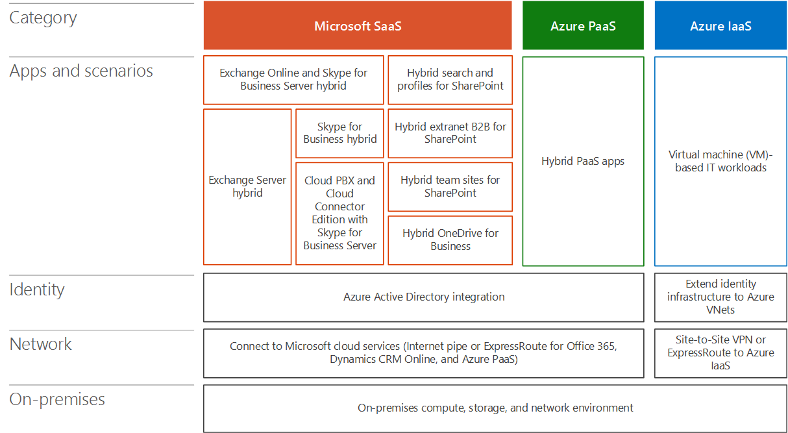

# Arquitetura de cenários de nuvem híbrida da Microsoft

 **Resumo:** Entenda a arquitetura das ofertas de nuvem híbrida da Microsoft.
  
Use uma abordagem arquitetônica para planejar e implementar cenários de nuvem híbrida com plataformas e serviços em nuvem da Microsoft.
  
**Figura 1: a pilha de nuvem híbrida da Microsoft**

  
A Figura 1 mostra a pilha de nuvem híbrida da Microsoft e sua camada, que incluem local, rede, identidade, aplicativos e cenários e a categoria de serviço de nuvem (Microsoft SaaS, Azure PaaS e Azure PaaS).
  
A camada aplicativos e cenários tem os cenários de nuvem híbrida específicos que são detalhados nos artigos adicionais desse modelo. A identidade, a rede e as camadas locais podem ser comuns às categorias de serviço de nuvem (SaaS, PaaS ou PaaS).
  
- No local
    
    A infraestrutura local para cenários híbridos pode incluir servidores para o SharePoint, o Exchange, o Skype for Business e aplicativos de linha de negócios. Também pode incluir repositórios de dados (bancos de dados, listas, arquivos). Sem conexões ExpressRoute, o acesso aos armazenamentos de dados locais deve ser permitido por meio de um proxy reverso ou ao tornar o servidor ou os dados acessíveis em sua DMZ ou Extranet.
    
- Rede
    
    Há duas opções de conectividade para plataformas e serviços da nuvem da Microsoft: seu pipe da Internet existente e o ExpressRoute. Use uma conexão ExpressRoute se o desempenho previsível for importante. Você pode usar uma conexão ExpressRoute para se conectar diretamente aos serviços Microsoft SaaS (Office 365 e Dynamics 365), serviços de PaaS do Azure e serviços do Azure IaaS.
    
- Identidade
    
    Para a infraestrutura de identidade em nuvem, há duas maneiras de ir, dependendo da plataforma de nuvem da Microsoft. Para o SaaS e o PaaS do Azure, integre sua infraestrutura de identidade local com o Azure AD ou Federação com sua infraestrutura de identidade local ou provedores de identidade de terceiros. Para VMs em execução no Azure, você pode estender sua infraestrutura de identidade local, como os serviços de domínio do Active Directory (AD DS), para as redes virtuais (VNets) onde suas VMs residem.
    
## Cenários de nuvem híbrida para o processo de adoção em nuvem de três fases

Muitas empresas, incluindo a Microsoft, usam uma abordagem de três fases para adotar a nuvem. Cenários de nuvem híbrida podem desempenhar uma função em cada fase.
  
1. Mover cargas de trabalho de produtividade para o SaaS
    
    Para cargas de trabalho de produtividade que atualmente estão ou devem permanecer no local, os cenários híbridos permitem que eles sejam integrados às suas contrapartes da nuvem.
    
2. Desenvolver aplicativos novos e modernos na PaaS do Azure
    
    Os aplicativos híbridos da PaaS do Azure podem aproveitar com segurança os recursos de servidor ou armazenamento local.
    
3. Mover aplicativos existentes para o Azure IaaS
    
    Para cenários de aumento e de fim e de compilação em nuvem, os aplicativos baseados em servidor executados nas VMs do Azure oferecem provisionamento e dimensionamento simples.
    
## Confira também

[Nuvem híbrida da Microsoft para Arquitetos Corporativos](microsoft-hybrid-cloud-for-enterprise-architects.md)
  
[Recursos de arquitetura de TI do Microsoft Cloud](microsoft-cloud-it-architecture-resources.md)

