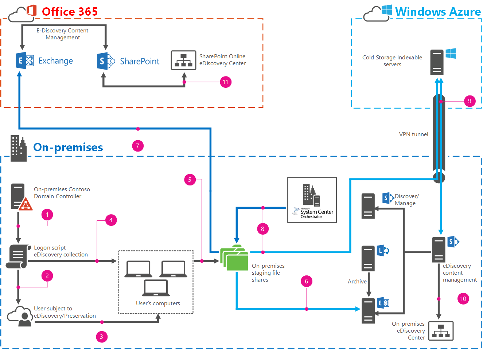

# <a name="automate-file-collection-for-ediscovery"></a><span data-ttu-id="86993-103">Automatizar a coleta de arquivos para descoberta eletrônica</span><span class="sxs-lookup"><span data-stu-id="86993-103">Automate file collection for eDiscovery</span></span>

<span data-ttu-id="86993-104">Todas as empresas enfrentam o potencial de processos judiciais ou outros tipos de ações legais.</span><span class="sxs-lookup"><span data-stu-id="86993-104">All companies face the potential of lawsuits or other types of legal action.</span></span> <span data-ttu-id="86993-105">Embora os departamentos jurídicos trabalhem para reduzir essa exposição, o litígio é um fato da vida útil da empresa.</span><span class="sxs-lookup"><span data-stu-id="86993-105">While legal departments work to reduce that exposure, litigation is a fact of business life.</span></span> <span data-ttu-id="86993-106">Quando uma empresa enfrenta ações legais, elas são necessárias, por meio do processo de descoberta legal, para fornecer todo o material documentário relevante para o tribunal e para o advogado oposto.</span><span class="sxs-lookup"><span data-stu-id="86993-106">When a company faces legal action, they are required, through the process of legal discovery, to provide all relevant documentary materials to the court and to opposing counsel.</span></span> 
  
<span data-ttu-id="86993-107">a descoberta eletrônica é o processo pelo qual as empresas fazem inventário, pesquisa, identificar, preservar, filtrar e disponibilizar os materiais documentários relevantes que existem em formato eletrônico.</span><span class="sxs-lookup"><span data-stu-id="86993-107">eDiscovery is the process by which companies inventory, search, identify, preserve, filter, and make available the relevant documentary materials that exist in electronic form.</span></span> <span data-ttu-id="86993-108">O SharePoint 2013, o Exchange Server 2013, o Lync Server 2013, o SharePoint Online e o Exchange Online podem armazenar grandes quantidades de conteúdo documentário.</span><span class="sxs-lookup"><span data-stu-id="86993-108">SharePoint 2013, Exchange Server 2013, Lync Server 2013, SharePoint Online, and Exchange Online can hold large amounts of documentary content.</span></span> <span data-ttu-id="86993-109">Dependendo da versão, esses produtos podem oferecer suporte a descoberta eletrônica e bloqueios no local (Lync através do Exchange Server), tornando mais fácil para as equipes legais indexar, identificar, reter e filtrar o conteúdo mais relevante para um determinado caso.</span><span class="sxs-lookup"><span data-stu-id="86993-109">Depending on the version, these products may support eDiscovery and in place holds (Lync via Exchange Server), making it easier for the legal teams to index, identify, hold, and filter the most relevant content for a given case.</span></span>
  
<span data-ttu-id="86993-110">Muitos documentos são armazenados nos computadores locais dos usuários (responsáveis), e não em um local centralizado.</span><span class="sxs-lookup"><span data-stu-id="86993-110">Many documents are stored on users' (Custodians) local computers, not in a centralized location.</span></span> <span data-ttu-id="86993-111">Isso torna praticamente impossível que o SharePoint 2013 pesquise e, se não puder ser pesquisado, não possa ser incluído no eDiscovery.</span><span class="sxs-lookup"><span data-stu-id="86993-111">This makes it essentially impossible for SharePoint 2013 to search, and if it can't be searched, it can't be included in eDiscovery.</span></span> <span data-ttu-id="86993-112">Esta solução mostra como usar scripts de logon, System Center Orchestrator 2012 R2 e Windows PowerShell para Exchange Server para automatizar a identificação e coleção de materiais documentários de computadores dos usuários.</span><span class="sxs-lookup"><span data-stu-id="86993-112">This solution shows you how to use logon scripts, System Center Orchestrator 2012 R2 and Windows PowerShell for Exchange Server to automate the identification and collection of documentary materials from users' computers.</span></span>
  
## <a name="what-this-solution-does"></a><span data-ttu-id="86993-113">O que esta solução faz</span><span class="sxs-lookup"><span data-stu-id="86993-113">What this solution does</span></span>

<span data-ttu-id="86993-114">Esta solução usa um grupo de segurança global, uma diretiva de grupo e um script do Windows PowerShell para localizar, inventariar e coletar conteúdo e arquivos de repositório pessoal do Outlook de computadores locais de usuários para um compartilhamento de arquivo oculto.</span><span class="sxs-lookup"><span data-stu-id="86993-114">This solution uses a global security group, Group Policy, and a Windows PowerShell script to locate, inventory, and collect content and Outlook personal store (PST) files from users local computers to a hidden file share.</span></span> <span data-ttu-id="86993-115">A partir daí, os arquivos PST podem ser importados para o Exchange Server 2013 ou o Exchange Online.</span><span class="sxs-lookup"><span data-stu-id="86993-115">From there, the PST files can be imported into either Exchange Server 2013 or Exchange Online.</span></span> <span data-ttu-id="86993-116">Todos os arquivos são movidos usando um runbook do System Center Orchestrator 2012 R2 para outro compartilhamento de arquivos no Microsoft Azure para armazenamento de longo prazo e indexação pelo SharePoint 2013.</span><span class="sxs-lookup"><span data-stu-id="86993-116">All files are then moved using a System Center Orchestrator 2012 R2 runbook to another file share in Microsoft Azure for long-term storage and indexing by SharePoint 2013.</span></span> <span data-ttu-id="86993-117">Em seguida, você usa centros de descoberta eletrônica em sua implantação local do SharePoint 2013 ou no SharePoint Online, como faria regularmente para executar a descoberta eletrônica.</span><span class="sxs-lookup"><span data-stu-id="86993-117">You then use eDiscovery centers in your on-premises SharePoint 2013 deployment or in SharePoint Online as you regularly would to perform eDiscovery.</span></span> 
  
> [!IMPORTANT]
> <span data-ttu-id="86993-118">Esta solução usa o Robocopy para copiar arquivos dos computadores dos responsáveis para um compartilhamento de arquivos centralizado.</span><span class="sxs-lookup"><span data-stu-id="86993-118">This solution uses robocopy to copy files from custodian's computers to a centralized file share.</span></span> <span data-ttu-id="86993-119">Como o Robocopy não copia arquivos que estão abertos ou bloqueados, qualquer arquivo, incluindo arquivos PST, que os responsáveis por abrir não serão coletados.</span><span class="sxs-lookup"><span data-stu-id="86993-119">Because robocopy does not copy files that are open or locked, any files, including PST files, that the custodian has open will not be collected.</span></span> <span data-ttu-id="86993-120">Você terá que coletar manualmente.</span><span class="sxs-lookup"><span data-stu-id="86993-120">You will have to collect them manually.</span></span> <span data-ttu-id="86993-121">Esta solução fornece uma lista que identifica explicitamente os arquivos que não podem ser copiados e o caminho completo para cada arquivo.</span><span class="sxs-lookup"><span data-stu-id="86993-121">This solution does provide you with a list that explicitly identifies the files it cannot copy and the full path to each file.</span></span> 
  
<span data-ttu-id="86993-122">O diagrama a seguir orienta você por todas as etapas e elementos da solução.</span><span class="sxs-lookup"><span data-stu-id="86993-122">The following diagram walks you through all the steps and elements of the solution.</span></span>
  

  
|<span data-ttu-id="86993-124">Legenda \* \* \* \*</span><span class="sxs-lookup"><span data-stu-id="86993-124">\*\*\*\*Legend\*\*\*\*</span></span>||
|:-----|:-----|
||<span data-ttu-id="86993-126">Crie um objeto de política de grupo (GPO) e associe-o ao script de logon da coleção.</span><span class="sxs-lookup"><span data-stu-id="86993-126">Create a Group Policy object (GPO), and associate it with the collection logon script.</span></span>  <br/> |
|| <span data-ttu-id="86993-128">Configure o filtro de segurança do GPO para aplicar o GPO somente ao grupo responsáveis.</span><span class="sxs-lookup"><span data-stu-id="86993-128">Configure the GPO security filter to apply the GPO only to the Custodians group.</span></span> <br/> |
||<span data-ttu-id="86993-130">Os responsáveis fizer o logon e o GPO ser executado, chamando o script de logon da coleção.</span><span class="sxs-lookup"><span data-stu-id="86993-130">A Custodian logs on and the GPO runs, calling the collection logon script.</span></span>  <br/> |
||<span data-ttu-id="86993-132">O script de logon da coleção faz o inventário de todas as unidades conectadas localmente no computador responsáveis, pesquisando os arquivos que você deseja e gravando sua localização.</span><span class="sxs-lookup"><span data-stu-id="86993-132">The collection logon script inventories all locally attached drives on the Custodians computer, searching for the files you want, and recording their location.</span></span>  <br/> |
||<span data-ttu-id="86993-134">O script de logon da coleção copia os arquivos inventariados para um compartilhamento de arquivo oculto no servidor de teste.</span><span class="sxs-lookup"><span data-stu-id="86993-134">The collection logon script copies the inventoried files to a hidden file share on the staging server.</span></span>  <br/> |
|| <span data-ttu-id="86993-136">(Opção A) Execute manualmente o script de importação PST para importar os arquivos PST coletados para o Exchange Server 2013.</span><span class="sxs-lookup"><span data-stu-id="86993-136">(Option A) Manually run the PST import script to import the collected PST files into Exchange Server 2013.</span></span> <br/> |
||<span data-ttu-id="86993-138">(Opção B) Usando a ferramenta e o processo de importação do Microsoft 365, importe os arquivos PST coletados para o Exchange Online.</span><span class="sxs-lookup"><span data-stu-id="86993-138">(Option B) Using the Microsoft 365 Import tool and process, import the collected PST files into Exchange Online.</span></span>  <br/> |
||<span data-ttu-id="86993-140">Mova todos os arquivos coletados para um compartilhamento de arquivos do Azure para armazenamento de longo prazo com o runbook do MoveToColdStorage System Center Orchestrator 2012 R2.</span><span class="sxs-lookup"><span data-stu-id="86993-140">Move all collected files to an Azure file share for long term storage with the MoveToColdStorage System Center Orchestrator 2012 R2 runbook.</span></span> <br/> |
||<span data-ttu-id="86993-142">Indexe os arquivos no compartilhamento de arquivos de armazenamento Cold com o SharePoint 2013.</span><span class="sxs-lookup"><span data-stu-id="86993-142">Index the files in the cold storage file share with SharePoint 2013.</span></span>  <br/> |
||<span data-ttu-id="86993-144">Realize o conteúdo de descoberta eletrônica no armazenamento Cold e no Exchange Server 2013 local.</span><span class="sxs-lookup"><span data-stu-id="86993-144">Perform eDiscovery on content in cold storage and in the on-premises Exchange Server 2013.</span></span>  <br/> |
||<span data-ttu-id="86993-146">Realize o conteúdo de descoberta eletrônica no Microsoft 365.</span><span class="sxs-lookup"><span data-stu-id="86993-146">Perform eDiscovery on content in Microsoft 365.</span></span>  <br/> |
   
## <a name="prerequisites"></a><span data-ttu-id="86993-147">Pré-requisitos</span><span class="sxs-lookup"><span data-stu-id="86993-147">Prerequisites</span></span>

<span data-ttu-id="86993-148">A configuração dessa solução requer muitos elementos, a maioria dos quais você provavelmente já fez e configurou se você está pensando no eDiscovery.</span><span class="sxs-lookup"><span data-stu-id="86993-148">The configuration of this solution requires many elements, most of which you likely have in place and configured if you're thinking about eDiscovery.</span></span> <span data-ttu-id="86993-149">Para os elementos que você não pode ter ou que exijam uma configuração específica, forneceremos os links necessários para desenvolver sua configuração básica.</span><span class="sxs-lookup"><span data-stu-id="86993-149">For the elements that you may not have or ones that require a specific configuration, we'll provide you with the links you need build out your base configuration.</span></span> <span data-ttu-id="86993-150">Você deve ter a configuração básica in-loco antes de configurar a própria solução.</span><span class="sxs-lookup"><span data-stu-id="86993-150">You must have the base configuration in place before you configure the solution itself.</span></span>
  
### <a name="base-configuration"></a><span data-ttu-id="86993-151">Configuração base</span><span class="sxs-lookup"><span data-stu-id="86993-151">Base configuration</span></span>

|<span data-ttu-id="86993-152">**Elemento**</span><span class="sxs-lookup"><span data-stu-id="86993-152">**Element**</span></span>|<span data-ttu-id="86993-153">**Link**</span><span class="sxs-lookup"><span data-stu-id="86993-153">**Link**</span></span>|
|:-----|:-----|
|<span data-ttu-id="86993-154">Domínio dos serviços de domínio do Active Directory (AD DS)</span><span class="sxs-lookup"><span data-stu-id="86993-154">Active Directory Domain Services (AD DS) domain</span></span>  <br/> ||
|<span data-ttu-id="86993-155">Conectividade com a Internet da sua rede local</span><span class="sxs-lookup"><span data-stu-id="86993-155">Internet connectivity from your on-premises network</span></span>  <br/> ||
|<span data-ttu-id="86993-156">SQL Server 2012 para oferecer suporte ao SharePoint 2013 e ao System Center Orchestrator 2012 R2</span><span class="sxs-lookup"><span data-stu-id="86993-156">SQL Server 2012 to support SharePoint 2013 and System Center Orchestrator 2012 R2</span></span>  <br/> |[<span data-ttu-id="86993-157">Implantando o System Center Orchestrator-2012</span><span class="sxs-lookup"><span data-stu-id="86993-157">Deploying System Center Orchestrator - 2012</span></span>](https://go.microsoft.com/fwlink/p/?LinkId=613503) <br/> |
| <span data-ttu-id="86993-158">SharePoint 2013 local ou baseado no Azure para descoberta eletrônica (necessário para A opção A)</span><span class="sxs-lookup"><span data-stu-id="86993-158">On-premises or Azure based SharePoint 2013 for eDiscovery (required for Option A)</span></span> <br/> ||
|<span data-ttu-id="86993-159">Servidor de compartilhamento de arquivos no local para preparação</span><span class="sxs-lookup"><span data-stu-id="86993-159">On-premises file share server for staging</span></span>  <br/> ||
|<span data-ttu-id="86993-160">Exchange Server 2013 local para A opção uma importação de PST</span><span class="sxs-lookup"><span data-stu-id="86993-160">On-premises Exchange Server 2013 for Option A PST import</span></span>  <br/> |<span data-ttu-id="86993-161">CU5 (15.913.22) está disponível em [CU5](https://go.microsoft.com/fwlink/p/?LinkId=613426).</span><span class="sxs-lookup"><span data-stu-id="86993-161">CU5 (15.913.22) is available at [CU5](https://go.microsoft.com/fwlink/p/?LinkId=613426).</span></span>  <br/> |
|<span data-ttu-id="86993-162">System Center Orchestrator 2012 R2</span><span class="sxs-lookup"><span data-stu-id="86993-162">System Center Orchestrator 2012 R2</span></span>  <br/> |[<span data-ttu-id="86993-163">Implantando o System Center Orchestrator-2012</span><span class="sxs-lookup"><span data-stu-id="86993-163">Deploying System Center Orchestrator - 2012</span></span>](https://go.microsoft.com/fwlink/p/?LinkId=613503) <br/> |
|<span data-ttu-id="86993-164">Microsoft 365 E3 com Exchange Online e SharePoint Online (necessário para a opção B)</span><span class="sxs-lookup"><span data-stu-id="86993-164">Microsoft 365 E3 with Exchange Online and SharePoint Online (required for Option B)</span></span>  <br/> |<span data-ttu-id="86993-165">Para se inscrever em uma assinatura do Microsoft 365 E3, confira [assinatura do microsoft 365 E3](https://www.microsoft.com/microsoft-365/enterprise-e3-business-software?activetab=pivot%3aoverviewtab).</span><span class="sxs-lookup"><span data-stu-id="86993-165">To sign up for a Microsoft 365 E3 subscription, see [Microsoft 365 E3 subscription](https://www.microsoft.com/microsoft-365/enterprise-e3-business-software?activetab=pivot%3aoverviewtab).</span></span>  <br/> |
|<span data-ttu-id="86993-166">Assinatura do Azure com uma máquina virtual</span><span class="sxs-lookup"><span data-stu-id="86993-166">Azure subscription with a virtual machine</span></span>  <br/> |<span data-ttu-id="86993-167">Para se inscrever no Azure, confira [inscrever-se no Windows Azure](https://go.microsoft.com/fwlink/p/?LinkId=512010)</span><span class="sxs-lookup"><span data-stu-id="86993-167">To sign up for a Azure, see [Subscribe to Windows Azure](https://go.microsoft.com/fwlink/p/?LinkId=512010)</span></span> <br/> |
|<span data-ttu-id="86993-168">Uma conexão VPN entre a rede local e sua assinatura do Azure</span><span class="sxs-lookup"><span data-stu-id="86993-168">A VPN connection between your on-premises network and your Azure subscription</span></span>  <br/> |<span data-ttu-id="86993-169">Para configurar um túnel VPN entre sua assinatura do Azure e sua rede local, consulte [conectar uma rede local a uma rede virtual do Microsoft Azure](https://go.microsoft.com/fwlink/p/?LinkId=613507).</span><span class="sxs-lookup"><span data-stu-id="86993-169">To set up a VPN tunnel between your Azure subscription and your on-premises network, see [Connect an on-premises network to a Microsoft Azure virtual network](https://go.microsoft.com/fwlink/p/?LinkId=613507).</span></span>  <br/> |
|<span data-ttu-id="86993-170">Descoberta eletrônica do SharePoint 2013 configurada para pesquisar no SharePoint e no Exchange Server 2013 e, opcionalmente, Lync Server 2013</span><span class="sxs-lookup"><span data-stu-id="86993-170">SharePoint 2013 eDiscovery configured to search across SharePoint and Exchange Server 2013 and optionally Lync Server 2013</span></span>  <br/> |<span data-ttu-id="86993-171">Para configurar a descoberta eletrônica dessa maneira, confira [Configurar a descoberta eletrônica no SharePoint Server 2013](https://go.microsoft.com/fwlink/p/?LinkId=613508) e[testar o guia de laboratório: configurar a descoberta eletrônica para um laboratório de teste de compartilhamentos de arquivos do Exchange, Lync, SharePoint e Windows](https://go.microsoft.com/fwlink/p/?LinkId=393130).</span><span class="sxs-lookup"><span data-stu-id="86993-171">To configure eDiscovery in this fashion, see [Configure eDiscovery in SharePoint Server 2013](https://go.microsoft.com/fwlink/p/?LinkId=613508) and[Test Lab Guide: Configure eDiscovery for an Exchange, Lync, SharePoint and Windows File Shares Test Lab](https://go.microsoft.com/fwlink/p/?LinkId=393130).</span></span>  <br/> |
|<span data-ttu-id="86993-172">Descoberta eletrônica no Microsoft 365 para SharePoint Online e Exchange Online</span><span class="sxs-lookup"><span data-stu-id="86993-172">eDiscovery in Microsoft 365 for SharePoint Online and Exchange Online</span></span>  <br/> |<span data-ttu-id="86993-173">Para configurar a descoberta eletrônica no Microsoft 365, consulte [configurar um centro de descoberta eletrônica no SharePoint Online](https://go.microsoft.com/fwlink/p/?LinkId=613628).</span><span class="sxs-lookup"><span data-stu-id="86993-173">To configure eDiscovery in Microsoft 365, see [Set up an eDiscovery Center in SharePoint Online](https://go.microsoft.com/fwlink/p/?LinkId=613628).</span></span>  <br/> |
   
## <a name="configure-the-environment"></a><span data-ttu-id="86993-174">Configurar o ambiente</span><span class="sxs-lookup"><span data-stu-id="86993-174">Configure the environment</span></span>

<span data-ttu-id="86993-175">Agora que você tem a configuração base in-loco, você pode prosseguir para configurar a própria solução.</span><span class="sxs-lookup"><span data-stu-id="86993-175">Now that you have the base configuration in place, you can move ahead to configuring the solution itself.</span></span> 
  
### <a name="staging-file-share"></a><span data-ttu-id="86993-176">Compartilhamento de arquivo de preparação</span><span class="sxs-lookup"><span data-stu-id="86993-176">Staging file share</span></span>

1. <span data-ttu-id="86993-177">No domínio local, crie um grupo de segurança global chamado responsáveis.</span><span class="sxs-lookup"><span data-stu-id="86993-177">In the on-premises domain, create a global security group named Custodians.</span></span>
    
2. <span data-ttu-id="86993-178">Criar um compartilhamento de arquivo oculto para os arquivos coletados de computadores.</span><span class="sxs-lookup"><span data-stu-id="86993-178">Create a hidden file share for the files that are collected from Custodians computers.</span></span> <span data-ttu-id="86993-179">Ele deve estar em um servidor local.</span><span class="sxs-lookup"><span data-stu-id="86993-179">This should be on an on-premises server.</span></span> <span data-ttu-id="86993-180">Por exemplo, em um servidor chamado preparação, crie um compartilhamento de arquivos chamado casos $.</span><span class="sxs-lookup"><span data-stu-id="86993-180">For example, on a server called Staging, create a file share called Cases$.</span></span> <span data-ttu-id="86993-181">O **$** é necessário para tornar este um compartilhamento oculto.</span><span class="sxs-lookup"><span data-stu-id="86993-181">The **$** is required to make this a hidden share.</span></span>
    
3. <span data-ttu-id="86993-182">Defina as seguintes permissões de compartilhamento:</span><span class="sxs-lookup"><span data-stu-id="86993-182">Set the following share permissions:</span></span>
    
  - <span data-ttu-id="86993-183">Responsáveis: alterar, ler</span><span class="sxs-lookup"><span data-stu-id="86993-183">Custodians: Change, Read</span></span>
    
  - <span data-ttu-id="86993-184">Administradores: Controle Total</span><span class="sxs-lookup"><span data-stu-id="86993-184">Administrators: Full Control</span></span>
    
  - <span data-ttu-id="86993-185">Subsistema confiável do Exchange: alterar, ler</span><span class="sxs-lookup"><span data-stu-id="86993-185">Exchange Trusted Subsystem: Change, Read</span></span>
    
4. <span data-ttu-id="86993-186">Abra a guia **segurança** , adicione o grupo responsáveis e clique em **avançado**.</span><span class="sxs-lookup"><span data-stu-id="86993-186">Open the **Security** tab, add the Custodians group, and click **Advanced**.</span></span> <span data-ttu-id="86993-187">Defina as seguintes permissões para o grupo responsáveis:</span><span class="sxs-lookup"><span data-stu-id="86993-187">Set the following permissions for the Custodians group:</span></span>
    
  - <span data-ttu-id="86993-188">**Tipo: negar**</span><span class="sxs-lookup"><span data-stu-id="86993-188">**Type: Deny**</span></span>
    
  - <span data-ttu-id="86993-189">**Aplica-se a: esta pasta, subpastas e arquivos**</span><span class="sxs-lookup"><span data-stu-id="86993-189">**Applies to: This folder, subfolders and files**</span></span>
    
5. <span data-ttu-id="86993-190">Clique em **permissões avançadas** e selecione o seguinte:</span><span class="sxs-lookup"><span data-stu-id="86993-190">Click **Advanced Permissions** and select the following:</span></span>
    
  - <span data-ttu-id="86993-191">**Atributos de leitura**</span><span class="sxs-lookup"><span data-stu-id="86993-191">**Read attributes**</span></span>
    
  - <span data-ttu-id="86993-192">**Ler atributos estendidos**</span><span class="sxs-lookup"><span data-stu-id="86993-192">**Read extended attributes**</span></span>
    
  - <span data-ttu-id="86993-193">**Permissões de leitura**</span><span class="sxs-lookup"><span data-stu-id="86993-193">**Read permissions**</span></span>
    
6. <span data-ttu-id="86993-194">Teste o acesso ao compartilhamento de arquivos de casos $, fazendo o seguinte:</span><span class="sxs-lookup"><span data-stu-id="86993-194">Test access to the Cases$ file share by doing the following:</span></span>
    
1. <span data-ttu-id="86993-195">Adicionar um usuário ao grupo responsáveis.</span><span class="sxs-lookup"><span data-stu-id="86993-195">Add a user to the Custodians group.</span></span>
    
2. <span data-ttu-id="86993-196">Coloque um arquivo na pasta casos $.</span><span class="sxs-lookup"><span data-stu-id="86993-196">Place a file in the Cases$ folder.</span></span>
    
3. <span data-ttu-id="86993-197">Como usuário, navegue até o servidor de teste, por exemplo, navegue até o \\ \\ compartilhamento de preparo para ver quais compartilhamentos estão disponíveis.</span><span class="sxs-lookup"><span data-stu-id="86993-197">As the user, browse to the staging server, for example browse to the \\\\Staging share to see what shares are available.</span></span> <span data-ttu-id="86993-198">Você não verá os **casos $** share listados.</span><span class="sxs-lookup"><span data-stu-id="86993-198">You shouldn't see the **Cases$** share listed.</span></span>
    
4. <span data-ttu-id="86993-199">Digite manualmente o caminho completo para os casos $ share no Explorer.</span><span class="sxs-lookup"><span data-stu-id="86993-199">Manually type the full path to the Cases$ share into Explorer.</span></span> <span data-ttu-id="86993-200">Isso deve abrir os casos $ share.</span><span class="sxs-lookup"><span data-stu-id="86993-200">This should open the Cases$ share.</span></span>
    
5. <span data-ttu-id="86993-201">Tente abrir o arquivo que você colocou anteriormente no compartilhamento.</span><span class="sxs-lookup"><span data-stu-id="86993-201">Try to open the file you previously placed in the share.</span></span> <span data-ttu-id="86993-202">Isso deve falhar.</span><span class="sxs-lookup"><span data-stu-id="86993-202">This should fail.</span></span>
    
### <a name="logon-script"></a><span data-ttu-id="86993-203">Script de logon</span><span class="sxs-lookup"><span data-stu-id="86993-203">Logon script</span></span>

1. <span data-ttu-id="86993-204">Copie e cole este script do Windows PowerShell no bloco de notas:</span><span class="sxs-lookup"><span data-stu-id="86993-204">Copy and paste this Windows PowerShell script into Notepad:</span></span>
    
  ```
  # Automated file collection script
# Substantial error processing should be added for robust execution and troubleshooting opportunities
# All commented out write-hosts are for debugging only and are commented out for regular execution

# Functions 

Function CreateCaseFolder() {

#Check to see if case folder already exists
$CaseFolderCheck = Test-Path $CaseLocation

try {

    if (!$CaseFolderCheck) {
    # Case folder doesn't exist.  Create the case folder and the log file location
    # Write-Host -ForegroundColor Cyan "Creating Case Folder $CaseLocation"
    New-Item "$CaseLocation" -ItemType Directory -Force -ErrorAction SilentlyContinue
    # Write-Host -ForegroundColor Cyan "Creating Case Log Folder $CaseLogLocation"
    New-Item "$CaseLogLocation" -ItemType Directory -Force -ErrorAction SilentlyContinue
    # Write-Host -ForegroundColor Cyan "Creating Case PST folder $CasePSTLocation"
    New-Item "$CasePSTLocation" -ItemType Directory -Force -ErrorAction SilentlyContinue

    }
    else {

    # do nothing since the target case folder already exists

    }
}
catch [System.Exception] {

    # To do..
    # to log to an exception or log file
    
    }
}

Function CopyFileToCaseFolder($SourcePath, $TargetPath, $FileName) {
    
    # Check to see if the file already exists
    $TargetFileCheck = Test-Path $TargetPath\$FileName

try {

    if (!$TargetFileCheck) {
    # Copy the file to the case folder
    Write-Host $SourcePath $TargetPath $FileName
    robocopy "$SourcePath" "$TargetPath" "$FileName" /COPY:DATSO /TEE /LOG+:$LoggingFile /R:10 /W:10 | Out-Null

    }
    else {

    # do nothing since file is already in the target case folder

    }
}
catch [System.Exception] {

    # To do..
    # to log to an exception or log file
    
    }
}

# Global variable initializations

# Error log
$Loggederrors=@()

# The array to contain the file types we collect
$FileTypes = @("*.doc","*.docx","*.pst","*.txt")

# We'll set the case number to be a combination of the date and user name
# For example, a case for John Doe on Dec 14, 2014 at 2:38pm would be:
# 201412141438_jdoe
$CaseNo = get-date -Format yyyyMMddHHmm
$CaseNo = $CaseNo + "_" + [Environment]::UserName

# Target location to copy case files
$CaseRootLocation = "\\staging\Cases$" 

# File copy location, log file location, PST file location and temporary log file location
$CaseLocation = $CaseRootLocation + "\" + $CaseNo
$CaseLogLocation = $CaseRootLocation + "\" + $CaseNo + "\_Log"
$CasePSTLocation = $CaseRootLocation + "\" + $CaseNo + "\_PSTs"
$TemporaryLogLocation = [Environment]::getfolderpath('ApplicationData') + "\" + $CaseNo

# Inventory of local drives
$LocalDrives = Get-PSDrive -PSProvider FileSystem -Scope Global

$LoggingFile = "$CaseLogLocation\FileCopyErrors.log"

# Main script

# Create the case folder if it doesn't already exist
CreateCaseFolder

# Create the list of files to be copied
# First create the temporary directory in the AppData\Roaming folder
New-Item "$TemporaryLogLocation" -ItemType Directory -Force -ErrorAction SilentlyContinue
$LocalDrives | foreach {

    # Write-Host -ForeGroundColor Cyan "Collecting Files for Drive: " $_
    Get-ChildItem -Path $_.Root -Recurse -Include $FileTypes -ErrorAction SilentlyContinue -ErrorVariable +Loggederrors | Export-Clixml $TemporaryLogLocation\$_.xml -Force
    # Needs try catch and logged collection error file
}

# Now let's read each file and copy any files we need to the case folder
# We will also copy these XMLs to the case log files folder as we go along
# We only want to process XML files, just in case something else got in there as the script ran
$CaseDriveFiles = Get-ChildItem $TemporaryLogLocation -Filter '*.xml'
$CaseDriveFiles | foreach {
    # Copy the XML file to the case log location
    CopyFileToCaseFolder $_.Directory.FullName $CaseLogLocation $_.Name
    $DriveFile = $_.FullName
    # Write-Host -ForegroundColor Cyan "Copying Files specified in the XML file: $DriveFile"
    $CurrentDriveFile = Import-Clixml $DriveFile
    $CurrentDriveFile | foreach {
        # write-host $_.FullName
        # if it's a PST, add to the PSTs folder. otherwise add it to case folder
        if ($_.Extension -match '.PST')
        {
            CopyFileToCaseFolder $_.Directory.FullName $CasePSTLocation $_.Name
            write-host "this is a PST"
        }
        else
        {
            CopyFileToCaseFolder $_.Directory.FullName $CaseLocation $_.Name
        }
    }
}

# Now delete the temporary log file
Remove-Item $TemporaryLogLocation -Recurse 

Write-Host -ForegroundColor Cyan "Finished."

  ```

2. <span data-ttu-id="86993-205">Salve o script acima como CollectionScript.ps1 em um local que seja fácil de localizar, por exemplo, C: \\ AFCScripts.</span><span class="sxs-lookup"><span data-stu-id="86993-205">Save the above script as CollectionScript.ps1 in a location that's easy for you to find, for example, C:\\AFCScripts.</span></span>
    
3. <span data-ttu-id="86993-206">Use o recurso ir para no bloco de notas.</span><span class="sxs-lookup"><span data-stu-id="86993-206">Use the Go To feature in Notepad.</span></span> <span data-ttu-id="86993-207">Faça as seguintes alterações, conforme necessário:</span><span class="sxs-lookup"><span data-stu-id="86993-207">Make the following changes, as needed:</span></span>
    
|<span data-ttu-id="86993-208">**Número da linha**</span><span class="sxs-lookup"><span data-stu-id="86993-208">**Line #**</span></span>|<span data-ttu-id="86993-209">**O que você precisa alterar**</span><span class="sxs-lookup"><span data-stu-id="86993-209">**What you need to change**</span></span>|<span data-ttu-id="86993-210">**Obrigatório/opcional**</span><span class="sxs-lookup"><span data-stu-id="86993-210">**Required/optional**</span></span>|
|:-----|:-----|:-----|
|<span data-ttu-id="86993-211">71</span><span class="sxs-lookup"><span data-stu-id="86993-211">71</span></span>  <br/> |<span data-ttu-id="86993-212">**$Filetypes** variável.</span><span class="sxs-lookup"><span data-stu-id="86993-212">**$FileTypes** variable.</span></span> <span data-ttu-id="86993-213">Inclua todas as extensões de tipo de arquivo que você deseja que o script faça inventário e colete na variável de matriz.</span><span class="sxs-lookup"><span data-stu-id="86993-213">Include all the file type extensions that you want the script to inventory and collect in the array variable.</span></span> <br/> |<span data-ttu-id="86993-214">Opcional</span><span class="sxs-lookup"><span data-stu-id="86993-214">Optional</span></span>  <br/> |
|<span data-ttu-id="86993-215">76 e 77</span><span class="sxs-lookup"><span data-stu-id="86993-215">76 and 77</span></span>  <br/> |<span data-ttu-id="86993-216">Alterar a maneira como a variável de **$CaseNo** é criada para atender às suas necessidades.</span><span class="sxs-lookup"><span data-stu-id="86993-216">Change the way the **$CaseNo** variable is built to suit your needs.</span></span> <span data-ttu-id="86993-217">O script captura a data atual e a hora e acrescenta o nome de usuário a ela.</span><span class="sxs-lookup"><span data-stu-id="86993-217">The script captures the current date and time and appends the user name to it.</span></span> <br/> |<span data-ttu-id="86993-218">Opcional</span><span class="sxs-lookup"><span data-stu-id="86993-218">Optional</span></span>  <br/> |
|<span data-ttu-id="86993-219">80</span><span class="sxs-lookup"><span data-stu-id="86993-219">80</span></span>  <br/> |<span data-ttu-id="86993-220">**$CaseRootLocation** variável precisa ser definida para o compartilhamento de arquivos do conjunto de servidores de preparo, por exemplo, \*\* \\ \\ exemplos de preparação \\ $\*\*.</span><span class="sxs-lookup"><span data-stu-id="86993-220">**$CaseRootLocation** variable needs to be set to your staging servers collection file share, for example **\\\\Staging\\Cases$**.</span></span> <br/> |<span data-ttu-id="86993-221">Obrigatório</span><span class="sxs-lookup"><span data-stu-id="86993-221">Required</span></span>  <br/> |
   
4. <span data-ttu-id="86993-222">Coloque o arquivo CollectionScript.ps1 no compartilhamento de arquivos Netlogon em um controlador de domínio.</span><span class="sxs-lookup"><span data-stu-id="86993-222">Place the CollectionScript.ps1 file in the Netlogon file share on a domain controller.</span></span> 
    
### <a name="configure-gpo-for-the-logon-script-and-custodians-group"></a><span data-ttu-id="86993-223">Configurar o GPO para o script de logon e o grupo de responsáveis</span><span class="sxs-lookup"><span data-stu-id="86993-223">Configure GPO for the logon script and Custodians Group</span></span>

1. <span data-ttu-id="86993-224">Configure um script de logon para o grupo responsáveis seguindo a seção "como atribuir scripts de logon do usuário" no tópico, [usando scripts de inicialização, desligamento, logon e logoff na política de grupo](https://go.microsoft.com/fwlink/p/?LinkId=614844).</span><span class="sxs-lookup"><span data-stu-id="86993-224">Configure a logon script for the Custodians group by following the "How to assign user logon scripts" section in the topic, [Using Startup, Shutdown, Logon, and Logoff Scripts in Group Policy](https://go.microsoft.com/fwlink/p/?LinkId=614844).</span></span>
    
2. <span data-ttu-id="86993-225">Remova os usuários autenticados da **filtragem de segurança**e adicione o grupo responsáveis.</span><span class="sxs-lookup"><span data-stu-id="86993-225">Remove authenticated users from **Security Filtering**, and add the Custodians group.</span></span>
    
### <a name="pst-import-option-a-script-for-exchange-server-2013"></a><span data-ttu-id="86993-226">Opção de importação de PST A, script para o Exchange Server 2013</span><span class="sxs-lookup"><span data-stu-id="86993-226">PST import Option A, script for Exchange Server 2013</span></span>

1.  <span data-ttu-id="86993-227">Copie e cole o seguinte script do Windows PowerShell no bloco de notas:</span><span class="sxs-lookup"><span data-stu-id="86993-227">Copy and paste the following Windows PowerShell script into Notepad:</span></span>
    
  ```
  # Script to import all PSTs in a given folder to a target mailbox
#
# This is for on-prem Exchange only
# Input parameters
# When you run the script, you call it with two parameters, PST source path and target mailbox alias
# For example:  .\PSTImport.ps1 \\FileShare\PSTFiles jdoe

param ([String]$SourcePath,[String]$MailboxAlias)

# Folder identifier is the string we want to show in the mailbox that we import the PSTs to

$FolderIdentifier = "zzImportedPSTs_"

# Connect to Exchange remote powershell using the connection Uri below
# This would be the format https://<exchange server FQDN>/Powershell

$ConnectionUri = 'https://h10-exch/PowerShell'
$RemoteEx2013Session = New-PSSession -ConfigurationName Microsoft.Exchange -ConnectionUri $ConnectionUri -Authentication Kerberos
Import-PSSession $RemoteEx2013Session

# Get all the files in the source path

$AllFiles = Get-ChildItem $SourcePath -Recurse

# Go through each file and if it's a PST launch a mailbox import request for it

$AllFiles | ForEach-Object {
    If ($_.Extension -eq ".pst") {
        $ImportName = $MailboxAlias + "_" + $_.Name
        $FolderName = $FolderIdentifier + $_.Name
        New-MailboxImportRequest -Name $ImportName -Mailbox $MailboxAlias -FilePath $_.FullName -TargetRootFolder $FolderName
    }
}
  ```

2. <span data-ttu-id="86993-228">Salve o script como PSTImportScript.ps1 em um local que seja fácil de encontrar.</span><span class="sxs-lookup"><span data-stu-id="86993-228">Save the script as PSTImportScript.ps1 in a location that's easy for you to find.</span></span> <span data-ttu-id="86993-229">Por exemplo e facilidade de uso, crie uma pasta no seu servidor de teste, chamada \\ \\ preparação \\ de AFCScripts, e salve-a.</span><span class="sxs-lookup"><span data-stu-id="86993-229">For example and ease of use, create a folder on your staging server called \\\\Staging\\AFCScripts, and save it there.</span></span>
    
3. <span data-ttu-id="86993-230">Use o recurso ir para no bloco de notas e faça as seguintes alterações, conforme necessário:</span><span class="sxs-lookup"><span data-stu-id="86993-230">Use the Go To feature in Notepad, and make the following changes, as needed:</span></span>
    
|<span data-ttu-id="86993-231">**Número da linha**</span><span class="sxs-lookup"><span data-stu-id="86993-231">**Line #**</span></span>|<span data-ttu-id="86993-232">**O que você precisa alterar**</span><span class="sxs-lookup"><span data-stu-id="86993-232">**What you need to change**</span></span>|<span data-ttu-id="86993-233">**Obrigatório/opcional**</span><span class="sxs-lookup"><span data-stu-id="86993-233">**Required/optional**</span></span>|
|:-----|:-----|:-----|
|<span data-ttu-id="86993-234">12 </span><span class="sxs-lookup"><span data-stu-id="86993-234">12</span></span>  <br/> |<span data-ttu-id="86993-235">**$FolderIdentifier** marca as pastas de caixa de correio nas quais os PSTs são importados.</span><span class="sxs-lookup"><span data-stu-id="86993-235">**$FolderIdentifier** tags the mailbox folders that PSTs are imported into.</span></span> <span data-ttu-id="86993-236">Altere isso se necessário.</span><span class="sxs-lookup"><span data-stu-id="86993-236">Change this if necessary.</span></span> <br/> |<span data-ttu-id="86993-237">Opcional</span><span class="sxs-lookup"><span data-stu-id="86993-237">Optional</span></span>  <br/> |
|<span data-ttu-id="86993-238">17 </span><span class="sxs-lookup"><span data-stu-id="86993-238">17</span></span>  <br/> |<span data-ttu-id="86993-239">**$ConnectionURI** precisa ser definido para seu próprio servidor.</span><span class="sxs-lookup"><span data-stu-id="86993-239">**$ConnectionUri** needs to be set to your own server.</span></span> <br/> <span data-ttu-id="86993-240">> [!IMPORTANT]> certifique-se de que o **$ConnectionURI** aponta para um local http, e não HTTPS.</span><span class="sxs-lookup"><span data-stu-id="86993-240">> [!IMPORTANT]> Make sure your **$ConnectionUri** points to a http location, not https.</span></span> <span data-ttu-id="86993-241">Ele não funcionará com https:.</span><span class="sxs-lookup"><span data-stu-id="86993-241">It won't work with https:.</span></span>          |<span data-ttu-id="86993-242">Obrigatório</span><span class="sxs-lookup"><span data-stu-id="86993-242">Required</span></span>  <br/> |
   
4. <span data-ttu-id="86993-243">Verifique se a conta de subsistema confiável do Exchange tem permissões de leitura, gravação e execução para o \\ \\ compartilhamento de casos de preparação \\ $.</span><span class="sxs-lookup"><span data-stu-id="86993-243">Verify that the Exchange Trusted Subsystem account has Read, Write, and Execute permissions to the \\\\Staging\\Cases$ share.</span></span>
    
5. <span data-ttu-id="86993-244">O script de importação de PST requer os dois parâmetros de entrada a seguir:</span><span class="sxs-lookup"><span data-stu-id="86993-244">The PST import script requires the following two input parameters:</span></span>
    
  - <span data-ttu-id="86993-245">**$SourcePath** O local dos arquivos PST a serem importados, por exemplo, \\ \\ exemplos de preparação \\ $.</span><span class="sxs-lookup"><span data-stu-id="86993-245">**$SourcePath** The location of the PST files to be imported, for example \\\\Staging\\Cases$.</span></span>
    
  - <span data-ttu-id="86993-246">**$MailboxAlias** O alias da caixa de correio de destino que receberá os itens de email importados.</span><span class="sxs-lookup"><span data-stu-id="86993-246">**$MailboxAlias** The alias of the target mailbox that will receive the imported email items.</span></span>
    
6. <span data-ttu-id="86993-247">Por exemplo, se você deseja importar todos os arquivos PST do caminho \\ Staging\Cases $ para uma caixa de correio com o alias eDiscoveryMailbox, você deve executar o script como este `\\staging\AFCscripts\PSTImportScript.ps1 \\Staging\cases$ eDiscoveryMailbox` .</span><span class="sxs-lookup"><span data-stu-id="86993-247">For example, if you want to import all the PST files from the path \\Staging\Cases$ into a mailbox with the alias eDiscoveryMailbox, you would run the script like this `\\staging\AFCscripts\PSTImportScript.ps1 \\Staging\cases$ eDiscoveryMailbox`.</span></span>
    
### <a name="pst-import-option-b-for-exchange-online"></a><span data-ttu-id="86993-248">Opção de importação de PST B, para o Exchange Online</span><span class="sxs-lookup"><span data-stu-id="86993-248">PST Import Option B, for Exchange Online</span></span>

-  <span data-ttu-id="86993-249">Crie a estrutura da caixa de correio para colocar os arquivos PST importados no.</span><span class="sxs-lookup"><span data-stu-id="86993-249">Create the mailbox structure to place the imported PST files into.</span></span> <span data-ttu-id="86993-250">Para saber mais sobre como criar uma caixa de correio de usuário no Exchange Online, confira[criar caixas de correio de usuário no Exchange Online](https://go.microsoft.com/fwlink/p/?LinkId=615118).</span><span class="sxs-lookup"><span data-stu-id="86993-250">For more information on how to create a user mailbox in Exchange Online, see[Create User Mailboxes in Exchange Online](https://go.microsoft.com/fwlink/p/?LinkId=615118).</span></span>
    
### <a name="cold-storage"></a><span data-ttu-id="86993-251">Armazenamento Cold</span><span class="sxs-lookup"><span data-stu-id="86993-251">Cold storage</span></span>

1. <span data-ttu-id="86993-252">Crie um compartilhamento de arquivos na máquina virtual do Azure, onde todos os arquivos coletados serão colocados, por exemplo, \\ \\ AZFile1 \\ ContentColdStorage.</span><span class="sxs-lookup"><span data-stu-id="86993-252">Create a file share on the Azure Virtual Machine, where all the collected files will be placed, for example, \\\\AZFile1\\ContentColdStorage.</span></span>
    
2. <span data-ttu-id="86993-253">Conceda à conta de acesso ao conteúdo padrão pelo menos permissões de leitura para o compartilhamento e todas as subpastas e arquivos.</span><span class="sxs-lookup"><span data-stu-id="86993-253">Grant the default content access account at least Read permissions to the share and all subfolders and files.</span></span> <span data-ttu-id="86993-254">Para obter mais informações sobre como configurar a pesquisa do SharePoint 2013, consulte [Create and configure a Search Service Application in SharePoint Server 2013](https://go.microsoft.com/fwlink/p/?LinkId=614940).</span><span class="sxs-lookup"><span data-stu-id="86993-254">For more information about configuring SharePoint 2013 Search, see [Create and configure a Search service application in SharePoint Server 2013](https://go.microsoft.com/fwlink/p/?LinkId=614940).</span></span>
    
3. <span data-ttu-id="86993-255">Se você previr a importação de arquivos PST do \\ \\ AZFile1 \\ ContentColdStorage, conceda permissões de leitura, gravação e execução do subsistema confiável do Exchange para o compartilhamento.</span><span class="sxs-lookup"><span data-stu-id="86993-255">If you anticipate importing PST files from \\\\AZFile1\\ContentColdStorage, grant the Exchange Trusted Subsystem Read, Write, and Execute permissions to the share.</span></span>
    
### <a name="orchestrator"></a><span data-ttu-id="86993-256">Orquestrador</span><span class="sxs-lookup"><span data-stu-id="86993-256">Orchestrator</span></span>

1. <span data-ttu-id="86993-257">Baixe o[ runbook MoveToColdStorage](https://go.microsoft.com/fwlink/?LinkId=616095) do centro de download da Microsoft.</span><span class="sxs-lookup"><span data-stu-id="86993-257">Download the[ MoveToColdStorage runbook](https://go.microsoft.com/fwlink/?LinkId=616095) from the Microsoft Download Center.</span></span>
    
2. <span data-ttu-id="86993-258">Abra o **runbook designer**, no painel **conexões** , clique na pasta para a qual você deseja importar o runbook.</span><span class="sxs-lookup"><span data-stu-id="86993-258">Open the **Runbook Designer**, in the **Connections** pane, click the folder that you want to import the runbook into.</span></span> <span data-ttu-id="86993-259">Clique no menu **ações** e clique em **importar**.</span><span class="sxs-lookup"><span data-stu-id="86993-259">Click the **Actions** menu, and the click **Import**.</span></span> <span data-ttu-id="86993-260">A caixa de diálogo **importar** é exibida.</span><span class="sxs-lookup"><span data-stu-id="86993-260">The **Import** dialog box appears.</span></span>
    
3. <span data-ttu-id="86993-261">Na caixa **local do arquivo** , digite o caminho e o nome de arquivo do runbook que você deseja importar ou clique nas reticências ( **...**) para navegar até o arquivo que você deseja importar.</span><span class="sxs-lookup"><span data-stu-id="86993-261">In the **File Location** box, type the path and file name of the runbook you want to import, or click the ellipsis ( **...**) to browse to the file you want to import.</span></span> 
    
4. <span data-ttu-id="86993-262">Selecione **importar runbooks** e **importar dados criptografados do Orchestrator**.</span><span class="sxs-lookup"><span data-stu-id="86993-262">Select **Import runbooks** and **Import Orchestrator encrypted data**.</span></span> <span data-ttu-id="86993-263">Limpe **contadores**, **agendas**, **variáveis**, **grupos de computadores**, **importe configurações globais**e **substitua as configurações globais existentes**.</span><span class="sxs-lookup"><span data-stu-id="86993-263">Clear **Counters**, **Schedules**, **Variables**, **Computer Groups**, **Import global configurations**, and **Overwrite existing global configurations**.</span></span>
    
5. <span data-ttu-id="86993-264">Clique em **Concluir**.</span><span class="sxs-lookup"><span data-stu-id="86993-264">Click **Finish**.</span></span>
    
6. <span data-ttu-id="86993-265">Edite o runbook **MoveFilesToColdStorage** da seguinte maneira:</span><span class="sxs-lookup"><span data-stu-id="86993-265">Edit the **MoveFilesToColdStorage** runbook as follows:</span></span>
    
1. <span data-ttu-id="86993-266">**Mover arquivo** atividade-define o caminho do **arquivo de origem** para o compartilhamento de arquivo de conjunto, por exemplo, \\ \\ exemplos de preparação \\ $.</span><span class="sxs-lookup"><span data-stu-id="86993-266">**Move File** activity - set the **Source File** path to the collection file share, for example \\\\Staging\\cases$.</span></span> <span data-ttu-id="86993-267">Defina a **pasta de destino** para o compartilhamento de arquivo de armazenamento Cold no Azure, por exemplo, \\ \\ AZFile1 \\ ContentColdStorage.</span><span class="sxs-lookup"><span data-stu-id="86993-267">Set the **Destination Folder** to the cold storage file share in Azure, for example \\\\AZFile1\\ContentColdStorage.</span></span> <span data-ttu-id="86993-268">Selecione **criar um arquivo com um nome exclusivo**.</span><span class="sxs-lookup"><span data-stu-id="86993-268">Select **Create a file with a unique name**.</span></span>
    
2. <span data-ttu-id="86993-269">**Excluir** atividade da pasta-defina o **caminho:** para o compartilhamento de arquivo da coleção, por exemplo, \\ \\ casos de preparação \\ $ \\ \*, e selecione **excluir todos os arquivos e subpastas**.</span><span class="sxs-lookup"><span data-stu-id="86993-269">**Delete Folder** activity - Set the **Path:** to the collection file share, for example \\\\Staging\\cases$\\*, and select **Delete all files and sub-folders**.</span></span> 
    
7. <span data-ttu-id="86993-270">Implante o runbook **MoveToColdStorage** usando os procedimentos de[implantação de Runbooks](https://go.microsoft.com/fwlink/p/?LinkId=615120).</span><span class="sxs-lookup"><span data-stu-id="86993-270">Deploy the **MoveToColdStorage** runbook using the procedures in[Deploying Runbooks](https://go.microsoft.com/fwlink/p/?LinkId=615120).</span></span>
    
### <a name="sharepoint-on-premises-search-for-cold-storage"></a><span data-ttu-id="86993-271">Pesquisa do SharePoint no local para armazenamento Cold</span><span class="sxs-lookup"><span data-stu-id="86993-271">SharePoint on-premises search for cold storage</span></span>

1. <span data-ttu-id="86993-272">Crie uma nova fonte de conteúdo no seu farm do SharePoint 2013 para o compartilhamento de armazenamento Cold no Azure, por exemplo, \\ \\ AZFile1 \\ ContentColdStorage.</span><span class="sxs-lookup"><span data-stu-id="86993-272">Create an new content source in your SharePoint 2013 farm for the cold storage share in Azure, for example \\\\AZFile1\\ContentColdStorage.</span></span> <span data-ttu-id="86993-273">Para obter mais informações sobre como gerenciar fontes de conteúdo, consulte [Adicionar, editar ou excluir uma fonte de conteúdo no SharePoint Server 2013](https://go.microsoft.com/fwlink/p/?LinkId=615004)</span><span class="sxs-lookup"><span data-stu-id="86993-273">For more information about managing content sources, see [Add, edit, or delete a content source in SharePoint Server 2013](https://go.microsoft.com/fwlink/p/?LinkId=615004)</span></span>
    
2. <span data-ttu-id="86993-274">Inicie um rastreamento completo.</span><span class="sxs-lookup"><span data-stu-id="86993-274">Start a full crawl.</span></span> <span data-ttu-id="86993-275">Para obter mais informações, consulte, [Iniciar, pausar, continuar ou parar um rastreamento no SharePoint Server 2013](https://go.microsoft.com/fwlink/p/?LinkId=615005).</span><span class="sxs-lookup"><span data-stu-id="86993-275">For more information see, [Start, pause, resume, or stop a crawl in SharePoint Server 2013](https://go.microsoft.com/fwlink/p/?LinkId=615005).</span></span>
    
## <a name="using-the-solution"></a><span data-ttu-id="86993-276">Usando a solução</span><span class="sxs-lookup"><span data-stu-id="86993-276">Using the solution</span></span>

<span data-ttu-id="86993-277">Há cinco etapas principais para usar essa solução, supondo que você não queira importar os arquivos PST para o Exchange Server 2013 e o Exchange Online.</span><span class="sxs-lookup"><span data-stu-id="86993-277">There are five major steps in using this solution, assuming you don't want to import the PST files into both Exchange Server 2013 and Exchange Online.</span></span> <span data-ttu-id="86993-278">Esta seção fornece os procedimentos para todos eles.</span><span class="sxs-lookup"><span data-stu-id="86993-278">This section provides you with the procedures for all of them.</span></span> <span data-ttu-id="86993-279">Sua interação principal com a solução será fazer o seguinte:</span><span class="sxs-lookup"><span data-stu-id="86993-279">Your primary interaction with the solution will be in doing the following:</span></span>
  
1. <span data-ttu-id="86993-280">Gerenciar a associação do usuário no grupo responsáveis.</span><span class="sxs-lookup"><span data-stu-id="86993-280">Manage user membership in the Custodians group.</span></span>
    
2. <span data-ttu-id="86993-281">Revise os arquivos de log gerados pelo script de logon.</span><span class="sxs-lookup"><span data-stu-id="86993-281">Review the log files generated by the logon script.</span></span> <span data-ttu-id="86993-282">O FileCopyErrors. log lista todos os arquivos que não foram copiados com êxito.</span><span class="sxs-lookup"><span data-stu-id="86993-282">The FileCopyErrors.log lists all the files that were not successfully copied.</span></span> <span data-ttu-id="86993-283">Você precisa decidir o que deseja fazer com eles</span><span class="sxs-lookup"><span data-stu-id="86993-283">You need to decide what you want to do with them</span></span>
    
3. <span data-ttu-id="86993-284">Gerenciar o processo de importação de PST.</span><span class="sxs-lookup"><span data-stu-id="86993-284">Managing the PST import process.</span></span>
    
4. <span data-ttu-id="86993-285">Mover os arquivos da coleção para o armazenamento Cold.</span><span class="sxs-lookup"><span data-stu-id="86993-285">Moving the collection files to cold storage.</span></span>
    
<span data-ttu-id="86993-286">Todas as outras etapas não são específicas desta solução.</span><span class="sxs-lookup"><span data-stu-id="86993-286">All the other steps are not specific to this solution.</span></span> <span data-ttu-id="86993-287">São tarefas administrativas padrão que você executa no SharePoint 2013, no Microsoft 365 e no Azure.</span><span class="sxs-lookup"><span data-stu-id="86993-287">They are standard administrative tasks that you perform in SharePoint 2013, Microsoft 365, and Azure.</span></span> <span data-ttu-id="86993-288">Há itens que esta solução não fornece orientações que você precisará para trabalhar com base nas necessidades da sua empresa, como:</span><span class="sxs-lookup"><span data-stu-id="86993-288">There are items that this solution does not provide any guidance that you will need to work out based on your company's needs, such as:</span></span>
  
1. <span data-ttu-id="86993-289">Controle de casos de descoberta eletrônica e quais responsáveis estão associados a esse caso.</span><span class="sxs-lookup"><span data-stu-id="86993-289">Tracking your eDiscovery cases, and which Custodians are associated with which case.</span></span>
    
2. <span data-ttu-id="86993-290">Controlar quais conjuntos de coleções de arquivos são associados ao caso de descoberta eletrônica.</span><span class="sxs-lookup"><span data-stu-id="86993-290">Tracking which sets of file collections are associate with which eDiscovery case.</span></span>
    
3. <span data-ttu-id="86993-291">Coordenar o tempo das etapas de importação e migração para o armazenamento Cold.</span><span class="sxs-lookup"><span data-stu-id="86993-291">Coordinating the timing of the Import and move to cold storage steps.</span></span>
    
4. <span data-ttu-id="86993-292">Gerenciar o espaço de arquivo usado no Azure.</span><span class="sxs-lookup"><span data-stu-id="86993-292">Managing the file space used in Azure.</span></span>
    
5. <span data-ttu-id="86993-293">Gerenciar as caixas de correio nas quais os PSTs são importados.</span><span class="sxs-lookup"><span data-stu-id="86993-293">Managing the mailboxes that PSTs are imported into.</span></span>
    
6. <span data-ttu-id="86993-294">Backup e restauração de todos os dados locais.</span><span class="sxs-lookup"><span data-stu-id="86993-294">Backup and restoration of all on-premises data.</span></span>
    
### <a name="custodian-management"></a><span data-ttu-id="86993-295">Gerenciamento de responsáveis</span><span class="sxs-lookup"><span data-stu-id="86993-295">Custodian management</span></span>

- <span data-ttu-id="86993-296">Para iniciar o processo de coleta automatizada de arquivos para um usuário individual, adicione-os ao grupo responsáveis.</span><span class="sxs-lookup"><span data-stu-id="86993-296">To start the automated file collection process for an individual user, add them to the Custodians group.</span></span> <span data-ttu-id="86993-297">Na próxima vez que o usuário fizer logon, o script de logon atribuído ao grupo responsáveis por meio da política de grupo será executado.</span><span class="sxs-lookup"><span data-stu-id="86993-297">The next time that the user logs on, the logon script assigned to the Custodians group through Group Policy will run.</span></span> 
    
### <a name="monitor-collected-files-and-review-log-files"></a><span data-ttu-id="86993-298">Monitorar arquivos coletados e examinar arquivos de log</span><span class="sxs-lookup"><span data-stu-id="86993-298">Monitor collected files and review log files</span></span>

1. <span data-ttu-id="86993-299">Assista ao compartilhamento de arquivo de coleção, por exemplo, \\ \\ casos de preparação \\ $ \\ \*, para a pasta de coleção do usuário.</span><span class="sxs-lookup"><span data-stu-id="86993-299">Watch the collection file share, for example \\\\Staging\\cases$\\*, for the collection folder from the user.</span></span> <span data-ttu-id="86993-300">O nome da pasta será formatado da seguinte maneira: *yyyyMMddHHmm_UserName* .</span><span class="sxs-lookup"><span data-stu-id="86993-300">The name of the folder will be formatted like this:  *yyyyMMddHHmm_UserName*  .</span></span>
    
2. <span data-ttu-id="86993-301">Quando a coleção estiver concluída, abra a pasta da coleção e navegue até a pasta _Log.</span><span class="sxs-lookup"><span data-stu-id="86993-301">When the collection is completed, open the collection folder, and browse to the _Log folder.</span></span> <span data-ttu-id="86993-302">Na pasta _Log, você verá o seguinte:</span><span class="sxs-lookup"><span data-stu-id="86993-302">In the _Log folder, you will see the following:</span></span>
    
  - <span data-ttu-id="86993-303">Um arquivo XML para cada unidade local no computador do usuário, por exemplo **A.xml** **C.xml**.</span><span class="sxs-lookup"><span data-stu-id="86993-303">One XML file for every local drive on the user's computer, for example **A.xml**, **C.xml**.</span></span> <span data-ttu-id="86993-304">Esses arquivos contêm as unidades de estoque que são nomeadas após e são usadas para a operação do Robocopy.</span><span class="sxs-lookup"><span data-stu-id="86993-304">These files contain the inventory drives that they are named after, and they are used for the robocopy operation.</span></span>
    
    > [!NOTE]
    > <span data-ttu-id="86993-305">O script de coleção só criará uma entrada no arquivo de inventário para os tipos de arquivo que você definiu no próprio script.</span><span class="sxs-lookup"><span data-stu-id="86993-305">The collection script will only create an entry in the inventory file for the file types that you defined in the script itself.</span></span> <span data-ttu-id="86993-306">Ele não criará uma entrada de inventário para cada arquivo no computador do usuário.</span><span class="sxs-lookup"><span data-stu-id="86993-306">It will not create an inventory entry for every file on the user's computer.</span></span> 
  
  - <span data-ttu-id="86993-307">Um arquivo de log chamado FileCopyErrors. log para cada execução de coleção.</span><span class="sxs-lookup"><span data-stu-id="86993-307">One log file named FileCopyErrors.log for each collection run.</span></span> <span data-ttu-id="86993-308">Este arquivo contém uma lista dos arquivos que o Robocopy não pôde copiar para o compartilhamento de coleção de arquivos, por exemplo, \\ \\ casos de preparação \\ $ \\ \*.</span><span class="sxs-lookup"><span data-stu-id="86993-308">This file contains a listing of the files that robocopy could not copy to the file collection share, for example, \\\\Staging\\cases$\\*.</span></span> <span data-ttu-id="86993-309">Você precisará revisar esta ação e decidir quais ações tomar para esses arquivos perdidos.</span><span class="sxs-lookup"><span data-stu-id="86993-309">You will need to review this and decide what actions to take for these missed files.</span></span> <span data-ttu-id="86993-310">Normalmente, você precisará coletar manualmente, se quiser, ou pode decidir que elas não são necessárias e, portanto, podem ser omitidas da coleção.</span><span class="sxs-lookup"><span data-stu-id="86993-310">Usually, you either need to collect them manually if you want them, or you may decide that they are not required and can therefore be omitted from the collection.</span></span>
    
### <a name="pst-import-option-a-for-exchange-server-2013"></a><span data-ttu-id="86993-311">Opção de importação de PST A para o Exchange Server 2013</span><span class="sxs-lookup"><span data-stu-id="86993-311">PST import option A for Exchange Server 2013</span></span>

1. <span data-ttu-id="86993-312">Faça logon no servidor que hospeda o compartilhamento de arquivo de conjunto, por exemplo, **preparação**e abra o Windows PowerShell.</span><span class="sxs-lookup"><span data-stu-id="86993-312">Log on to the server that hosts the collection file share, for example **Staging**, and open Windows PowerShell.</span></span> <span data-ttu-id="86993-313">Para obter mais informações sobre como iniciar o Windows PowerShell, consulte[iniciando o Windows PowerShell no Windows Server](https://go.microsoft.com/fwlink/p/?LinkId=615115).</span><span class="sxs-lookup"><span data-stu-id="86993-313">For more information about starting Windows PowerShell, see[Starting Windows PowerShell on Windows Server](https://go.microsoft.com/fwlink/p/?LinkId=615115).</span></span>
    
2. <span data-ttu-id="86993-314">Defina a política de execução como irrestrita.</span><span class="sxs-lookup"><span data-stu-id="86993-314">Set the Execution policy to Unrestricted .</span></span> <span data-ttu-id="86993-315">Digite `Set-ExecutionPolicy Unrestricted -Scope Process` no Windows PowerShell e pressione Enter.</span><span class="sxs-lookup"><span data-stu-id="86993-315">Type  `Set-ExecutionPolicy Unrestricted -Scope Process` into Windows PowerShell, and press Enter.</span></span>
    
3. <span data-ttu-id="86993-316">Execute o arquivo PSTImportScript.ps1 e forneça os parâmetros **$SourcePath** e **$MailboxAlias** .</span><span class="sxs-lookup"><span data-stu-id="86993-316">Run the PSTImportScript.ps1 file, and provide the **$SourcePath** and **$MailboxAlias** parameters.</span></span> <span data-ttu-id="86993-317">Para obter mais informações sobre a execução de scripts do Windows PowerShell, consulte[running scripts](https://go.microsoft.com/fwlink/p/?LinkID=615117).</span><span class="sxs-lookup"><span data-stu-id="86993-317">For more information about running Windows PowerShell scripts, see[Running Scripts](https://go.microsoft.com/fwlink/p/?LinkID=615117).</span></span>
    
4. <span data-ttu-id="86993-318">Revise a saída para ver se há erros.</span><span class="sxs-lookup"><span data-stu-id="86993-318">Review the output for errors.</span></span>
    
5. <span data-ttu-id="86993-319">Antes de tentar importar um arquivo PST com nome idêntico para a mesma caixa de correio, você precisa remover a solicitação de importação de caixa de correio.</span><span class="sxs-lookup"><span data-stu-id="86993-319">Before you attempt to import an identically named PST file into the same mailbox, you have to remove the mailbox import request.</span></span> <span data-ttu-id="86993-320">Execute o seguinte comando para fazer isso: `Get-MailboxImportRequest | Remove-MailboxImportRequest` .</span><span class="sxs-lookup"><span data-stu-id="86993-320">Run the following command to do that:  `Get-MailboxImportRequest | Remove-MailboxImportRequest`.</span></span> <span data-ttu-id="86993-321">Você será solicitado a remover cada solicitação individual da fila.</span><span class="sxs-lookup"><span data-stu-id="86993-321">You will be prompted to remove each individual request from the queue.</span></span> <span data-ttu-id="86993-322">Responder conforme necessário.</span><span class="sxs-lookup"><span data-stu-id="86993-322">Respond as needed.</span></span>
    
### <a name="pst-import-option-b-for-exchange-online"></a><span data-ttu-id="86993-323">Opção de importação de PST B, para o Exchange Online</span><span class="sxs-lookup"><span data-stu-id="86993-323">PST import option B, for Exchange Online</span></span>

- <span data-ttu-id="86993-324">Para colocar os arquivos PST coletados no Exchange Online, siga os procedimentos no arquivo importar arquivos no Microsoft 365 por meio de [upload de rede](https://docs.microsoft.com/microsoft-365/compliance/use-network-upload-to-import-pst-files).</span><span class="sxs-lookup"><span data-stu-id="86993-324">To place the collected PST files into Exchange Online, follow the procedures in the Import files into Microsoft 365 through [network upload](https://docs.microsoft.com/microsoft-365/compliance/use-network-upload-to-import-pst-files).</span></span>
    
### <a name="move-to-cold-storage"></a><span data-ttu-id="86993-325">Mover para o armazenamento Cold</span><span class="sxs-lookup"><span data-stu-id="86993-325">Move to cold storage</span></span>

1. <span data-ttu-id="86993-326">Execute o runbook **MoveToColdStorage** usando os procedimentos em [executando Runbooks](https://go.microsoft.com/fwlink/p/?LinkId=615123).</span><span class="sxs-lookup"><span data-stu-id="86993-326">Run the **MoveToColdStorage** runbook using the procedures in [Running Runbooks](https://go.microsoft.com/fwlink/p/?LinkId=615123).</span></span>
    
2. <span data-ttu-id="86993-327">Assista ao compartilhamento de arquivos do Azure que você está usando para armazenamento de longo prazo, por exemplo, \\ \\ AZFile1 \\ ContentColdStorage e o compartilhamento de arquivo da coleção local, por exemplo, \\ \\ exemplos de preparação \\ $.</span><span class="sxs-lookup"><span data-stu-id="86993-327">Watch the Azure file share you are using for long term storage, for example \\\\AZFile1\\ContentColdStorage and the on-premises collection file share, for example \\\\Staging\\cases$.</span></span> <span data-ttu-id="86993-328">Você deve ver os arquivos e pastas que aparecem no compartilhamento de arquivos de armazenamento Cold e desaparecem do conjunto de arquivos de coleção.</span><span class="sxs-lookup"><span data-stu-id="86993-328">You should see the files and folders appear in the cold storage file share and disappear from the collection file share.</span></span>
    
### <a name="ediscovery"></a><span data-ttu-id="86993-329">Descoberta eletrônica</span><span class="sxs-lookup"><span data-stu-id="86993-329">eDiscovery</span></span>

1. <span data-ttu-id="86993-330">Permitir que o rastreamento completo do compartilhamento de arquivos de armazenamento Cold seja executado como agendamentos ou iniciar um rastreamento.</span><span class="sxs-lookup"><span data-stu-id="86993-330">Either allow the full crawl of the cold storage file share to run as schedules, or initiate a crawl.</span></span> <span data-ttu-id="86993-331">Para obter mais informações sobre como iniciar rastreamentos completos ou incrementais, consulte [Iniciar, pausar, continuar ou parar um rastreamento no SharePoint Server 2013](https://go.microsoft.com/fwlink/p/?LinkId=615005).</span><span class="sxs-lookup"><span data-stu-id="86993-331">For more information on starting full or incremental crawls, see [Start, pause, resume, or stop a crawl in SharePoint Server 2013](https://go.microsoft.com/fwlink/p/?LinkId=615005).</span></span>
    
2. <span data-ttu-id="86993-332">Criar um caso de descoberta eletrônica no SharePoint 2013 se você usou A opção A para um arquivo PST, importe ou crie um caso de descoberta eletrônica no SharePoint Online se você usou a opção B.</span><span class="sxs-lookup"><span data-stu-id="86993-332">Create an eDiscovery case in SharePoint 2013 if you used option A for a PST file import or create an eDiscovery case in SharePoint Online if you used option B.</span></span>
    

