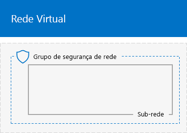
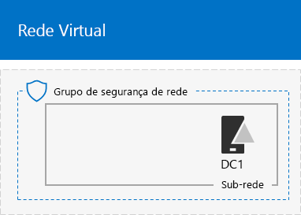
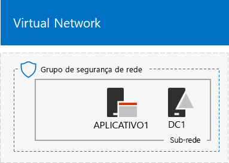

# <a name="base-configuration-devtest-environment"></a>Ambiente de desenvolvimento e teste de configuração de base

 **Resumo:** Crie uma intranet simplificada como um ambiente de desenvolvimento e teste in Microsoft Azure.
  
Este artigo fornece instruções passo a passo para criar o ambiente de desenvolvimento e teste de configuração básica seguinte no Windows Azure:
  
**Figura 1: Ambiente de desenvolvimento e teste a configuração básica**


  
O ambiente de desenvolvimento e teste de configuração básica na Figura 1 consiste de subnet Corpnet uma somente em nuvem rede virtual do Azure chamada de laboratório de teste que simule uma intranet simplificada, privada conectada à Internet. Ele contém três máquinas virtuais do Azure executando o Windows Server 2016:
  
- DC1 está configurado como um controlador de domínio da intranet e o servidor de sistema de nome de domínio (DNS)
    
- App1 esteja configurado como um servidor de aplicativos e web geral
    
- CLIENT1 atua como um cliente de intranet
    
Essa configuração permite DC1, APP1, CLIENT1 e outros computadores da sub-rede Corpnet ser: 
  
- Conectado à Internet para instalar as atualizações, acessar os recursos da Internet em tempo real e participar de tecnologias de nuvem pública, como o Microsoft Office 365 e outros serviços do Azure.
    
- Gerenciar remotamente usando conexões de área de trabalho remota do seu computador que está conectado à Internet ou à rede da organização.
    
Você pode usar o ambiente de teste resultante:
  
- Para o desenvolvimento de aplicativos e testes.
    
- Como a configuração inicial de um ambiente de teste estendido de seu próprio design que inclui outras máquinas virtuais, serviços do Azure ou outras ofertas de nuvem da Microsoft, como o Office 365 + mobilidade e segurança da empresa.
    
Há quatro fases para configurar o ambiente de teste de configuração básica no Windows Azure:
  
1. Crie a rede virtual.
    
2. Configure o DC1.
    
3. Configure APP1.
    
4. Definir CLIENT1.
    
Se você ainda não tiver uma assinatura do Windows Azure, você pode se inscrever para uma avaliação gratuita no [Azure tente](https://azure.microsoft.com/pricing/free-trial/). Se você tiver uma assinatura do MSDN ou o Visual Studio, consulte [crédito Azure mensal para assinantes do Visual Studio](https://azure.microsoft.com/pricing/member-offers/msdn-benefits-details/).
  
> [!NOTE]
> Máquinas virtuais do Azure incorrer em um custo monetário em andamento quando eles estão em execução. Esse custo é cobrado em relação a sua assinatura do MSDN de avaliação, livre ou assinatura paga. Para obter mais informações sobre os custos da execução de máquinas virtuais do Azure, consulte [Detalhes de preços de máquinas virtuais](https://azure.microsoft.com/pricing/details/virtual-machines/) e [Calculadora de preços do Azure](https://azure.microsoft.com/pricing/calculator/). Para reduzir os custos, consulte [minimizar os custos de máquinas virtuais do teste ambiente no Windows Azure](base-configuration-dev-test-environment.md#mincost). 
  

  
> [!TIP]
> Clique [aqui](http://aka.ms/catlgstack) para obter um mapa visual para todos os artigos na pilha de um Microsoft Cloud Test Lab Guide.
  
## <a name="phase-1-create-the-virtual-network"></a>Fase 1: Criar a rede virtual

Em primeiro lugar, inicie um prompt do Azure PowerShell.
  
> [!NOTE]
> O comando a seguir define usar a versão mais recente do Azure PowerShell. Consulte a [Introdução ao cmdlets do PowerShell do Windows Azure](https://docs.microsoft.com/en-us/powershell/azureps-cmdlets-docs/). 
  
Inscreva-se à sua conta do Windows Azure com o seguinte comando.
  
```
Login-AzureRMAccount
```

> [!TIP]
> Clique [aqui](https://gallery.technet.microsoft.com/PowerShell-commands-for-ba957d3d) para obter um arquivo de texto que contém todos os comandos do PowerShell neste artigo.
  
Para obter o nome de sua assinatura, use este comando.
  
```
Get-AzureRMSubscription | Sort Name | Select Name
```

Defina sua assinatura do Azure. Substitua tudo o que está entre aspas, incluindo os caracteres < e >, pelo nome correto.
  
```
$subscr="<subscription name>"
Get-AzureRmSubscription -SubscriptionName $subscr | Select-AzureRmSubscription
```

Em seguida, crie um novo grupo de recursos para o seu laboratório de teste de configuração básica. Para determinar o nome de um grupo de recursos exclusivos, use este comando para listar os grupos de recursos existentes.
  
```
Get-AzureRMResourceGroup | Sort ResourceGroupName | Select ResourceGroupName
```

Crie seu novo grupo de recursos com esses comandos. Substituir tudo entre aspas, incluindo o < e > caracteres, com os nomes corretos.
  
```
$rgName="<resource group name>"
$locName="<location name, such as West US>"
New-AzureRMResourceGroup -Name $rgName -Location $locName
```

Em seguida, crie a rede virtual do laboratório de teste que hospedará a sub-rede Corpnet da configuração básica e protegê-lo com um grupo de segurança de rede.
  
```
$rgName="<name of your new resource group>"
$locName=(Get-AzureRmResourceGroup -Name $rgName).Location
$corpnetSubnet=New-AzureRMVirtualNetworkSubnetConfig -Name Corpnet -AddressPrefix 10.0.0.0/24
New-AzureRMVirtualNetwork -Name TestLab -ResourceGroupName $rgName -Location $locName -AddressPrefix 10.0.0.0/8 -Subnet $corpnetSubnet -DNSServer 10.0.0.4
$rule1=New-AzureRMNetworkSecurityRuleConfig -Name "RDPTraffic" -Description "Allow RDP to all VMs on the subnet" -Access Allow -Protocol Tcp -Direction Inbound -Priority 100 -SourceAddressPrefix Internet -SourcePortRange * -DestinationAddressPrefix * -DestinationPortRange 3389
New-AzureRMNetworkSecurityGroup -Name Corpnet -ResourceGroupName $rgName -Location $locName -SecurityRules $rule1
$vnet=Get-AzureRMVirtualNetwork -ResourceGroupName $rgName -Name TestLab
$nsg=Get-AzureRMNetworkSecurityGroup -Name Corpnet -ResourceGroupName $rgName
Set-AzureRMVirtualNetworkSubnetConfig -VirtualNetwork $vnet -Name Corpnet -AddressPrefix "10.0.0.0/24" -NetworkSecurityGroup $nsg
```

Esta é a configuração atual.
  

  
## <a name="phase-2-configure-dc1"></a>Fase 2: Configurar DC1

Nesta fase, criamos máquina virtual DC1 e configurá-lo como um controlador de domínio para o domínio do Windows Server Active Directory (AD) corp.contoso.com e um servidor DNS para as máquinas virtuais da rede virtual laboratório de teste.
  
Para criar uma máquina virtual do Azure para DC1, no nome de seu grupo de recursos de preenchimento e executar esses comandos no prompt de comando do PowerShell do Azure no computador local.
  
```
$rgName="<resource group name>"
$locName=(Get-AzureRmResourceGroup -Name $rgName).Location
$vnet=Get-AzureRMVirtualNetwork -Name TestLab -ResourceGroupName $rgName
$pip=New-AzureRMPublicIpAddress -Name DC1-PIP -ResourceGroupName $rgName -Location $locName -AllocationMethod Dynamic
$nic=New-AzureRMNetworkInterface -Name DC1-NIC -ResourceGroupName $rgName -Location $locName -SubnetId $vnet.Subnets[0].Id -PublicIpAddressId $pip.Id -PrivateIpAddress 10.0.0.4
$vm=New-AzureRMVMConfig -VMName DC1 -VMSize Standard_A1
$cred=Get-Credential -Message "Type the name and password of the local administrator account for DC1."
$vm=Set-AzureRMVMOperatingSystem -VM $vm -Windows -ComputerName DC1 -Credential $cred -ProvisionVMAgent -EnableAutoUpdate
$vm=Set-AzureRMVMSourceImage -VM $vm -PublisherName MicrosoftWindowsServer -Offer WindowsServer -Skus 2016-Datacenter -Version "latest"
$vm=Add-AzureRMVMNetworkInterface -VM $vm -Id $nic.Id
$vm=Set-AzureRmVMOSDisk -VM $vm -Name "DC1-OS" -DiskSizeInGB 128 -CreateOption FromImage -StorageAccountType "StandardLRS"
$diskConfig=New-AzureRmDiskConfig -AccountType "StandardLRS" -Location $locName -CreateOption Empty -DiskSizeGB 20
$dataDisk1=New-AzureRmDisk -DiskName "DC1-DataDisk1" -Disk $diskConfig -ResourceGroupName $rgName
$vm=Add-AzureRmVMDataDisk -VM $vm -Name "DC1-DataDisk1" -CreateOption Attach -ManagedDiskId $dataDisk1.Id -Lun 1
New-AzureRMVM -ResourceGroupName $rgName -Location $locName -VM $vm
```

Você será solicitado para um nome de usuário e senha para a conta de administrador local no DC1. Use uma senha forte e registre o nome e a senha em um local seguro.
  
Em seguida, conecte-se à máquina virtual DC1.
  
### <a name="connect-to-dc1-using-local-administrator-account-credentials"></a>Conectar-se ao DC1 usando credenciais de conta de administrador local

1. No [portal do Azure](https://portal.azure.com), clique em **grupos de recursos >** <the name of your new resource group> **> DC1 > conectar**.
    
2. Abra o arquivo de DC1.rdp que é baixado e, em seguida, clique em **Conectar**.
    
3. Especifique o nome de conta de administrador local DC1:
    
  - Para Windows 7:
    
    Na caixa de diálogo **Segurança do Windows** , clique em **usar outra conta**. Em **nome de usuário**, digite **DC1\\**[nome de conta de Administrador Local].
    
  - Para o Windows 8 ou Windows 10:
    
    Na caixa de diálogo **Segurança do Windows** , clique em **mais opções**e, em seguida, clique em **usar uma conta diferente**. Em **nome de usuário**, digite **DC1\\**[nome de conta de Administrador Local].
    
4. Em **senha**, digite a senha da conta de administrador local e, em seguida, clique em **Okey**.
    
5. Quando solicitado, clique em **Sim**.
    
Em seguida, adicione um disco de dados extras como um novo volume com a letra da unidade f: com este comando em um prompt de comando do Windows PowerShell de nível de administrador no DC1.
  
```
Get-Disk | Where PartitionStyle -eq "RAW" | Initialize-Disk -PartitionStyle MBR -PassThru | New-Partition -AssignDriveLetter -UseMaximumSize | Format-Volume -FileSystem NTFS -NewFileSystemLabel "WSAD Data"
```

Em seguida, configure DC1 como um controlador de domínio e o servidor DNS para o domínio corp.contoso.com. Execute estes comandos em um prompt de comando do Windows PowerShell de nível de administrador.
  
```
Install-WindowsFeature AD-Domain-Services -IncludeManagementTools
Install-ADDSForest -DomainName corp.contoso.com -DatabasePath "F:\\NTDS" -SysvolPath "F:\\SYSVOL" -LogPath "F:\\Logs"
```

Você precisará especificar uma senha de administrador do modo de segurança. Armazene esta senha em um local seguro.
  
Esses comandos podem levar alguns minutos para serem concluídos.
  
Após a reinicialização do DC1, reconecte à máquina virtual DC1.
  
### <a name="connect-to-dc1-using-domain-credentials"></a>Conectar-se ao DC1 usando credenciais de domínio

1. No [portal do Azure](https://portal.azure.com), clique em **grupos de recursos >** <your resource group name> **> DC1 > conectar**.
    
2. Execute o arquivo DC1.rdp que é baixado e, em seguida, clique em **Conectar**.
    
3. Na **Segurança do Windows**, clique em **usar outra conta**. Em **nome de usuário**, digite **CORP\\**[nome de conta de Administrador Local].
    
4. Em **senha**, digite a senha da conta de administrador local e, em seguida, clique em **Okey**.
    
5. Quando solicitado, clique em **Sim**.
    
Em seguida, crie uma conta de usuário no Active Directory que será usada ao fazer logon no computador de membro de domínio CORP. Execute este comando em um prompt de comando do Windows PowerShell de nível de administrador.
  
```
New-ADUser -SamAccountName User1 -AccountPassword (read-host "Set user password" -assecurestring) -name "User1" -enabled $true -PasswordNeverExpires $true -ChangePasswordAtLogon $false
```

Observe que este comando solicitará que você forneça a senha da conta User1. Como essa conta será usada para conexões de área de trabalho remotas para todos os computadores de membro de domínio CORP, escolha uma senha forte. Registre a senha da conta User1 e armazená-lo em um local seguro.
  
Em seguida, configure a nova conta User1 como um administrador da empresa. Execute este comando no prompt de comando do Windows PowerShell nível de administrador.
  
```
Add-ADPrincipalGroupMembership -Identity "CN=User1,CN=Users,DC=corp,DC=contoso,DC=com" -MemberOf "CN=Enterprise Admins,CN=Users,DC=corp,DC=contoso,DC=com","CN=Domain Admins,CN=Users,DC=corp,DC=contoso,DC=com","CN=Schema Admins,CN=Users,DC=corp,DC=contoso,DC=com"
```

Fechar a sessão de área de trabalho remota com DC1 e depois reconectar usando CORP\\conta User1.
  
Em seguida, para permitir o tráfego para a ferramenta de Ping, execute este comando em um prompt de comando do Windows PowerShell de nível de administrador.
  
```
Set-NetFirewallRule -DisplayName "File and Printer Sharing (Echo Request - ICMPv4-In)" -enabled True
```

Esta é a configuração atual.
  

  
## <a name="phase-3-configure-app1"></a>Fase 3: Configurar APP1

App1 fornece web e serviços de compartilhamento de arquivo.
  
Para criar uma máquina Virtual de Windows Azure para APP1, preencher no nome de seu grupo de recursos, Azure local e nome da conta de armazenamento e executar esses comandos no prompt de comando do PowerShell do Azure no computador local.
  
```
$rgName="<resource group name>"
$locName=(Get-AzureRmResourceGroup -Name $rgName).Location
$vnet=Get-AzureRMVirtualNetwork -Name TestLab -ResourceGroupName $rgName
$pip=New-AzureRMPublicIpAddress -Name APP1-PIP -ResourceGroupName $rgName -Location $locName -AllocationMethod Dynamic
$nic=New-AzureRMNetworkInterface -Name APP1-NIC -ResourceGroupName $rgName -Location $locName -SubnetId $vnet.Subnets[0].Id -PublicIpAddressId $pip.Id
$vm=New-AzureRMVMConfig -VMName APP1 -VMSize Standard_A1
$cred=Get-Credential -Message "Type the name and password of the local administrator account for APP1."
$vm=Set-AzureRMVMOperatingSystem -VM $vm -Windows -ComputerName APP1 -Credential $cred -ProvisionVMAgent -EnableAutoUpdate
$vm=Set-AzureRMVMSourceImage -VM $vm -PublisherName MicrosoftWindowsServer -Offer WindowsServer -Skus 2016-Datacenter -Version "latest"
$vm=Add-AzureRMVMNetworkInterface -VM $vm -Id $nic.Id
$vm=Set-AzureRmVMOSDisk -VM $vm -Name "APP1-OS" -DiskSizeInGB 128 -CreateOption FromImage -StorageAccountType "StandardLRS"
New-AzureRMVM -ResourceGroupName $rgName -Location $locName -VM $vm
```

Em seguida, conecte-se à máquina virtual APP1 usando a APP1 nome da conta de administrador local e a senha e, em seguida, abra um prompt de comando do Windows PowerShell.
  
Para verificar a comunicação de rede e resolução de nome entre APP1 e DC1, execute o comando **ping dc1.corp.contoso.com** e verifique se há quatro respostas.
  
Em seguida, ingresse máquina virtual APP1 no domínio CORP com esses comandos no prompt do Windows PowerShell.
  
```
Add-Computer -DomainName corp.contoso.com
Restart-Computer
```

Observe que você deve fornecer o CORP\\User1 credenciais de conta de domínio após executar o comando **Add-Computer** .
  
Após a reinicialização do APP1, conectá-lo usando o CORP\\conta User1 e, então, abra um nível de administrador Windows PowerShell prompt de comando.
  
Em seguida, verifique APP1 um servidor da web com este comando no prompt de comando do Windows PowerShell no APP1.
  
```
Install-WindowsFeature Web-WebServer -IncludeManagementTools
```

Em seguida, crie uma pasta compartilhada e um arquivo de texto dentro da pasta no APP1 com esses comandos do PowerShell.
  
```
New-Item -path c:\\files -type directory
Write-Output "This is a shared file." | out-file c:\\files\\example.txt
New-SmbShare -name files -path c:\\files -changeaccess CORP\\User1
```

Esta é a configuração atual.
  

  
## <a name="phase-4-configure-client1"></a>Fase 4: Configurar CLIENT1

CLIENT1 atua como um laptop típica, tablet ou computador desktop na intranet da Contoso.
  
> [!NOTE]
> O conjunto de comandos a seguir cria CLIENT1 executando o Windows Server 2016 Datacenter, que pode ser feito para todos os tipos de inscrições do Azure. Se você tiver uma assinatura do Windows Azure baseados no Visual Studio, você pode criar CLIENT1 executando Windows 10, Windows 8 ou Windows 7 com o [portal do Azure](https://portal.azure.com). 
  
Para criar uma máquina Virtual de Windows Azure para CLIENT1, preencher no nome de seu grupo de recursos, Azure local e nome da conta de armazenamento e executar esses comandos no prompt de comando do PowerShell do Azure no computador local.
  
```
$rgName="<resource group name>"
$locName=(Get-AzureRmResourceGroup -Name $rgName).Location
$vnet=Get-AzureRMVirtualNetwork -Name TestLab -ResourceGroupName $rgName
$pip=New-AzureRMPublicIpAddress -Name CLIENT1-PIP -ResourceGroupName $rgName -Location $locName -AllocationMethod Dynamic
$nic=New-AzureRMNetworkInterface -Name CLIENT1-NIC -ResourceGroupName $rgName -Location $locName -SubnetId $vnet.Subnets[0].Id -PublicIpAddressId $pip.Id
$vm=New-AzureRMVMConfig -VMName CLIENT1 -VMSize Standard_A1
$cred=Get-Credential -Message "Type the name and password of the local administrator account for CLIENT1."
$vm=Set-AzureRMVMOperatingSystem -VM $vm -Windows -ComputerName CLIENT1 -Credential $cred -ProvisionVMAgent -EnableAutoUpdate
$vm=Set-AzureRMVMSourceImage -VM $vm -PublisherName MicrosoftWindowsServer -Offer WindowsServer -Skus 2016-Datacenter -Version "latest"
$vm=Add-AzureRMVMNetworkInterface -VM $vm -Id $nic.Id
$vm=Set-AzureRmVMOSDisk -VM $vm -Name "CLIENT1-OS" -DiskSizeInGB 128 -CreateOption FromImage -StorageAccountType "StandardLRS"
New-AzureRMVM -ResourceGroupName $rgName -Location $locName -VM $vm
```

Em seguida, conecte-se à máquina virtual CLIENT1 usando a CLIENT1 nome da conta de administrador local e a senha e, em seguida, abra um prompt de comando do Windows PowerShell de nível de administrador.
  
Para verificar a comunicação de rede e resolução de nome entre CLIENT1 e DC1, execute o comando **ping dc1.corp.contoso.com** em um prompt de comando do Windows PowerShell e verifique se há quatro respostas.
  
Em seguida, ingresse a máquina virtual CLIENT1 no domínio CORP com esses comandos no prompt do Windows PowerShell.
  
```
Add-Computer -DomainName corp.contoso.com
Restart-Computer
```

Observe que você deve fornecer sua CORP\\User1 credenciais de conta de domínio após executar o comando **Add-Computer** .
  
Após a reinicialização do CLIENT1, conecte-se a ela usando o CORP\\Usuário1 nome e a senha da conta e, em seguida, abra um prompt de comando do Windows PowerShell de nível de administrador.
  
Em seguida, verifique se que você pode acessar os recursos de compartilhamento de arquivo e web no APP1 do CLIENT1.
  
### <a name="verify-client-access-to-app1"></a>Verificar o acesso de cliente App1

1. No Gerenciador de servidores, no painel de árvore, clique em **Servidor Local**.
    
2. Em **Propriedades para CLIENT1**, clique **em** ao lado de **Configuração de segurança reforçada do Internet Explorer**.
    
3. **A configuração de segurança reforçada do Internet Explorer**, clique em **Desativar** para **administradores** e **usuários**e clique em **Okey**.
    
4. Na tela Iniciar, clique em **Internet Explorer**e clique em **Okey**.
    
5. Na barra endereço, digite **http://app1.corp.contoso.com/**e pressione ENTER. Você deverá ver uma página da web padrão do Internet Information Services para APP1.
    
6. Na barra de tarefas da área de trabalho, clique no ícone do Gerenciador de arquivos.
    
7. Na barra de endereços, digite ** \\ \\app1\\arquivos**, e pressione ENTER. Você deverá ver uma janela de pasta com o conteúdo da pasta compartilhada de arquivos.
    
8. Na janela de pasta compartilhada de **arquivos** , clique duas vezes no arquivo **txt** . Você deverá ver o conteúdo do arquivo txt.
    
9. Feche o **txt - o bloco de notas** e as janelas da pasta de **arquivos** compartilhados.
    
Esta é a configuração final.
  

  
A configuração de Base no Windows Azure agora está pronta para teste e desenvolvimento de aplicativos ou para a criação de ambientes de teste adicionais. 
  
> [!TIP]
> Clique [aqui](http://aka.ms/catlgstack) para obter um mapa visual para todos os artigos na pilha de um Microsoft Cloud Test Lab Guide.
  
## <a name="minimizing-the-costs-of-test-environment-virtual-machines-in-azure"></a>Minimizar os custos de máquinas virtuais do teste ambiente no Windows Azure
<a name="mincost"> </a>

Para minimizar o custo de execução máquinas virtuais do ambiente de teste, siga um destes procedimentos:
  
- Criar o ambiente de teste e execute seus testes necessários e demonstração mais depressa possível. Quando concluir, exclua o grupo de recursos para o ambiente de teste.
    
- Desligue suas máquinas de virtuais do ambiente de teste em um estado de liberada.
    
Para encerrar as máquinas virtuais com o Azure PowerShell, preencha o nome do grupo de recursos e executar esses comandos.
  
```
$rgName="<your resource group name>"
Stop-AzureRMVM -ResourceGroupName $rgName -Name "CLIENT1" -Force
Stop-AzureRMVM -ResourceGroupName $rgName -Name "APP1" -Force
Stop-AzureRMVM -ResourceGroupName $rgName -Name "DC1" -Force
```

Para garantir que suas máquinas virtuais funcionam corretamente ao iniciar todos eles do estado de parado (Deallocated), você deve iniciá-los na seguinte ordem:
  
1. DC1
    
2. APP1
    
3. CLIENT1
    
Para iniciar as máquinas virtuais em ordem com o Azure PowerShell, preencha o nome do grupo de recursos e executar esses comandos.
  
```
$rgName="<your resource group name>"
Start-AzureRMVM -ResourceGroupName $rgName -Name "DC1"
Start-AzureRMVM -ResourceGroupName $rgName -Name "APP1"
Start-AzureRMVM -ResourceGroupName $rgName -Name "CLIENT1"
```

## <a name="see-also"></a>Veja também

<a name="mincost"> </a>

[Ambiente de desenvolvimento e teste do Office 365](office-365-dev-test-environment.md)
  
[DirSync para seu ambiente de desenvolvimento e teste do Office 365](dirsync-for-your-office-365-dev-test-environment.md)
  
[Segurança de aplicativo de nuvem para seu ambiente de desenvolvimento e teste do Office 365](cloud-app-security-for-your-office-365-dev-test-environment.md)
  
[Proteção de ameaça avançada para seu ambiente de desenvolvimento e teste do Office 365](advanced-threat-protection-for-your-office-365-dev-test-environment.md)
  
[Adoção da nuvem e soluções híbridas](cloud-adoption-and-hybrid-solutions.md)


