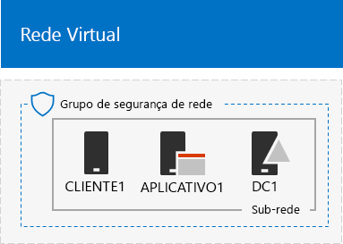
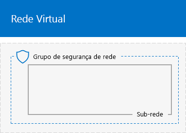
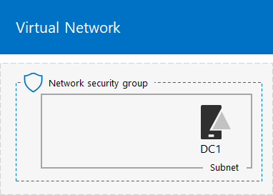
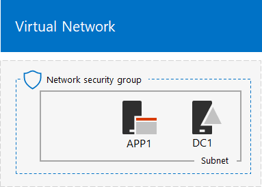

# <a name="base-configuration-devtest-environment"></a>Ambiente de desenvolvimento/teste para a Configuração Base

 **Resumo:** Criar uma intranet simplificada como um ambiente de desenvolvimento/teste no Microsoft Azure.
  
Este artigo fornece instruções para criar o seguinte ambiente de desenvolvimento/teste para a Configuração Básica no Azure:
  

  
**Figura 1: Ambiente de desenvolvimento/teste da Configuração Base**

O ambiente de desenvolvimento/teste da Configuração Base na Figura 1 inclui a sub-rede Corpnet em uma rede virtual do Azure, somente na nuvem, chamada TestLab que simula uma intranet simplificada e privada conectada à Internet. Ele contém três máquinas virtuais do Azure em que o Windows Server 2016 é executado:
  
- O DC1 está configurado como um controlador de domínio de intranet e servidor de Sistema de Nomes de Domínio (DNS).
    
- O APP1 está configurado como um servidor Web e aplicativo geral.
    
- O CLIENT1 atua como um cliente de intranet.
    
Essa configuração permite que o DC1, APP1, CLIENT1 e outros computadores adicionais da sub-rede da rede corporativa Corpnet a ser: 
  
- Fiquem conectados à Internet para instalar atualizações, acessar os recursos da Internet em tempo real e participar de tecnologias públicas de nuvem como o Microsoft Office 365 e outros serviços do Azure.
    
- Sejam gerenciados remotamente usando conexões da de Área de Trabalho Remota do seu computador que está conectado à Internet ou à rede da sua organização.
    
É possível usar o ambiente teste resultante:
  
- Para testes e desenvolvimento de aplicativos.
    
- Como a configuração inicial de um ambiente de teste estendido dos seu próprios designs, que inclui máquinas virtuais adicionais, serviços do Azure ou outras ofertas de nuvem da Microsoft como o Office 365 e Enterprise Mobility + Security (EMS).
    
Há dois métodos para criar esse ambiente:

1. Um modelo do Azure Resource Manager
2. Usar o Azure PowerShell

## <a name="method-1-build-your-simulated-intranet-with-an-azure-resource-manager-template"></a>Método 1: criar sua intranet simulada com um modelo do Azure Resource Manager

Nesse método, você usa um modelo do Azure Resource Manager (ARM) para criar uma intranet simulada. Os modelos do ARM contêm todas as instruções para criar e configurar a infraestrutura de rede do Azure e as máquinas virtuais.

Antes de implantar o modelo, leia toda a [página LEIAME do modelo](https://github.com/maxskunkworks/TLG/tree/master/tlg-base-config_3-vm) e tenha as seguintes informações em mãos:

- O nome da assinatura do Azure. Você precisará inserir esse rótulo nas **assinatura** campo dos **implantação personalizada** página.
- O nome do grupo de recursos do Azure. Você precisará inserir esse rótulo nas **grupo de recursos** campo dos **implantação personalizada** página.
- Um prefixo de rótulo DNS para as URLs dos endereços IP públicos de suas máquinas virtuais. Você precisará inserir esse rótulo no campo **Prefixo do rótulo DNS** da página **Implantação personalizada**.

Depois de ler todas as instruções, clique em **Implantar no Azure** na [página LEIAME do modelo](https://github.com/maxskunkworks/TLG/tree/master/tlg-base-config_3-vm) para começar.

>[!Note]
>A intranet simulada criada pelo modelo do ARM requer uma assinatura paga do Azure.
>

Esta é sua configuração após a conclusão do modelo.


## <a name="method-2-build-your-simulated-intranet-with-azure-powershell"></a>Método 2: criar sua intranet simulada com o Azure PowerShell

Nesse método, use o módulo do Windows PowerShell e do Azure PowerShell para criar a infraestrutura de rede, as máquinas virtuais e suas configurações.

Use esse método caso deseje obter a experiência de criação de elementos de infraestrutura do Azure um bloco de comando por vez com o PowerShell. Assim, é possível personalizar os blocos de comando do PowerShell para sua própria implantação de outras máquinas virtuais no Azure.

Há quatro etapas para configurar o ambiente de teste de configuração básica usando o Azure PowerShell:
  
1. Criar uma rede virtual.
    
2. Configurar o DC1.
    
3. Configurar o APP1.
    
4. Configurar o CLIENT1.
    
Se você ainda não tem a assinatura do Azure, inscreva-se para uma avaliação gratuita em [Experimentar o Azure](https://azure.microsoft.com/pricing/free-trial/). Se você já tem a assinatura do MSDN ou Visual Studio, consulte o [crédito mensal do Azure para assinantes do Visual Studio](https://azure.microsoft.com/pricing/member-offers/msdn-benefits-details/).
  
> [!NOTE]
> As máquinas virtuais no Azure implicam um custo monetário contínuo quando estão em execução. Esse custo é cobrado em relação à avaliação gratuita, assinatura do MSDN ou assinatura paga. Para saber mais sobre os custos de execução de máquinas virtuais do Azure, consulte os [detalhes de preços de máquinas virtuais](https://azure.microsoft.com/pricing/details/virtual-machines/) e a [calculadora de preços do Azure](https://azure.microsoft.com/pricing/calculator/). Para reduzir custos, consulte também mais informações sobre como [minimizar os custos de máquinas virtuais do ambiente de teste no Azure](base-configuration-dev-test-environment.md#mincost). 
  

  
> [!TIP]
> Clique [aqui](http://aka.ms/catlgstack) para exibir um mapa visual de todos os artigos da pilha da Guia do Laboratório de Teste do Office 365.
  
### <a name="step-1-create-the-virtual-network"></a>Etapa 1: Criar rede virtual

Nesta etapa, você a rede virtual TestLab no Azure.

Primeiro, abra um prompt no Azure PowerShell.
  
> [!NOTE]
> O comando a seguir define o uso da versão mais recente do Azure PowerShell. Consulte a [introdução aos cmdlets do Azure PowerShell](https://docs.microsoft.com/pt-BR/powershell/azureps-cmdlets-docs/). 
  
Entre na sua conta do Azure usando o comando a seguir.
  
```
Connect-AzAccount
```

> [!TIP]
> Clique [aqui](https://gallery.technet.microsoft.com/PowerShell-commands-for-ba957d3d) para obter um arquivo de texto que contém todos os comandos do PowerShell deste artigo.

Para obter o nome de sua assinatura, use este comando.
  
```
Get-AzSubscription | Sort Name | Select Name
```

Configure a assinatura do Azure. Substitua tudo o que está entre aspas, incluindo os caracteres < e >, pelo nome correto.
  
```
$subscrName="<subscription name>"
Select-AzSubscription -SubscriptionName $subscrName
```

Depois, crie um novo grupo de recursos para seu laboratório de teste da Configuração Base. Para determinar um nome de grupo de recursos exclusivo, use este comando para listar seus grupos de recurso existentes.
  
```
Get-AzResourceGroup | Sort ResourceGroupName | Select ResourceGroupName
```

Crie seu novo grupo de recursos com estes comandos. Substitua tudo o que está entre aspas, incluindo os caracteres < e >, pelos nomes corretos.
  
```
$rgName="<resource group name>"
$locName="<location name, such as West US>"
New-AzResourceGroup -Name $rgName -Location $locName
```

Em seguida, crie a rede virtual TestLab, que hospedará a sub-rede Corpnet da configuração base e a protegerá com um grupo de segurança de rede.
  
```
$rgName="<name of your new resource group>"
$locName=(Get-AzResourceGroup -Name $rgName).Location
$corpnetSubnet=New-AzVirtualNetworkSubnetConfig -Name Corpnet -AddressPrefix 10.0.0.0/24
New-AzVirtualNetwork -Name TestLab -ResourceGroupName $rgName -Location $locName -AddressPrefix 10.0.0.0/8 -Subnet $corpnetSubnet -DNSServer 10.0.0.4
$rule1=New-AzNetworkSecurityRuleConfig -Name "RDPTraffic" -Description "Allow RDP to all VMs on the subnet" -Access Allow -Protocol Tcp -Direction Inbound -Priority 100 -SourceAddressPrefix Internet -SourcePortRange * -DestinationAddressPrefix * -DestinationPortRange 3389
New-AzNetworkSecurityGroup -Name Corpnet -ResourceGroupName $rgName -Location $locName -SecurityRules $rule1
$vnet=Get-AzVirtualNetwork -ResourceGroupName $rgName -Name TestLab
$nsg=Get-AzNetworkSecurityGroup -Name Corpnet -ResourceGroupName $rgName
Set-AzVirtualNetworkSubnetConfig -VirtualNetwork $vnet -Name Corpnet -AddressPrefix "10.0.0.0/24" -NetworkSecurityGroup $nsg
$vnet | Set-AzVirtualNetwork
```

Essa é sua configuração atual.
  

  
### <a name="step-2-configure-dc1"></a>Etapa 2: configurar o DC1

Nesta fase, você vai criar a máquina virtual DC1 e configurá-la como o controle de domínio para o domínio corp.contoso.com do AD (Active Directory) do Windows Server e um servidor DNS para as máquinas virtuais da rede virtual TestLab.

> [!NOTE]
> Antes de executar o bloco de comando a seguir, certifique-se do região do Azure (local) que você escolheu seja compatível com o tamanho de máquina virtual Azure, que é definido como Standard_A1 por padrão. Clique em [veja](https://azure.microsoft.com/global-infrastructure/services/?products=virtual-machines) para ver as informações mais recentes em tamanhos de máquina virtual Azure e locais.
  
Para criar uma máquina virtual para o DC1, preencha o nome do grupo de recursos e execute estes comandos no prompt de comando do Azure PowerShell no computador local.
  
```
$rgName="<resource group name>"
$locName=(Get-AzResourceGroup -Name $rgName).Location
$vnet=Get-AzVirtualNetwork -Name TestLab -ResourceGroupName $rgName
$pip=New-AzPublicIpAddress -Name DC1-PIP -ResourceGroupName $rgName -Location $locName -AllocationMethod Dynamic
$nic=New-AzNetworkInterface -Name DC1-NIC -ResourceGroupName $rgName -Location $locName -SubnetId $vnet.Subnets[0].Id -PublicIpAddressId $pip.Id -PrivateIpAddress 10.0.0.4
$vm=New-AzVMConfig -VMName DC1 -VMSize Standard_A1
$cred=Get-Credential -Message "Type the name and password of the local administrator account for DC1."
$vm=Set-AzVMOperatingSystem -VM $vm -Windows -ComputerName DC1 -Credential $cred -ProvisionVMAgent -EnableAutoUpdate
$vm=Set-AzVMSourceImage -VM $vm -PublisherName MicrosoftWindowsServer -Offer WindowsServer -Skus 2016-Datacenter -Version "latest"
$vm=Add-AzVMNetworkInterface -VM $vm -Id $nic.Id
$vm=Set-AzVMOSDisk -VM $vm -Name "DC1-OS" -DiskSizeInGB 128 -CreateOption FromImage -StorageAccountType "Standard_LRS"
$diskConfig=New-AzDiskConfig -AccountType "Standard_LRS" -Location $locName -CreateOption Empty -DiskSizeGB 20
$dataDisk1=New-AzDisk -DiskName "DC1-DataDisk1" -Disk $diskConfig -ResourceGroupName $rgName
$vm=Add-AzVMDataDisk -VM $vm -Name "DC1-DataDisk1" -CreateOption Attach -ManagedDiskId $dataDisk1.Id -Lun 1
New-AzVM -ResourceGroupName $rgName -Location $locName -VM $vm
```

Será solicitado que você insira um nome de usuário e uma senha para a conta de administrador local no DC1. Use uma senha forte e armazene ambos, a senha e o nome, em um local seguro.
  
Em seguida, conecte-se à máquina virtual DC1.
  
1. No [portal do Azure](https://portal.azure.com), clique em **Grupos de Recursos >** [nome do novo grupo de recursos] **> DC1 > Conectar**.
    
2. No painel aberto, clique em **Baixar o arquivo RDP**. Abra o arquivo DC1.rdp que foi baixado e clique em **Conectar**.
    
3. Especifique o nome da conta de administrador local na DC1:
    
  - No Windows 7:
    
    Na caixa de diálogo **Segurança do Windows**, clique em **Usar outra conta**. Em **Nome de usuário**, digite **DC1\\**[nome da conta de administrador local].
    
  - No Windows 8 ou Windows 10:
    
    Na caixa de diálogo **Segurança do Windows**, clique em **Mais opções** e, então, clique em **Usar uma conta diferente**. Em **Nome de usuário**, digite **DC1\\**[nome da conta de administrador local].
    
4. Em **Senha**, digite a senha da conta de administrador local e clique em **OK**.
    
5. Quando solicitado, clique em **Sim**.
    
Em seguida, adicione um disco de dados extra como um novo volume com a letra de unidade F:, com este comando, em um prompt de comando do Windows PowerShell de nível de administrador no DC1.
  
```
Get-Disk | Where PartitionStyle -eq "RAW" | Initialize-Disk -PartitionStyle MBR -PassThru | New-Partition -AssignDriveLetter -UseMaximumSize | Format-Volume -FileSystem NTFS -NewFileSystemLabel "WSAD Data"
```

Depois, configure o DC1 como controlador de domínio e servidor DNS para o domínio corp.contoso.com. Execute estes comandos em um prompt de comando do Windows PowerShell de nível de administrador.
  
```
Install-WindowsFeature AD-Domain-Services -IncludeManagementTools
Install-ADDSForest -DomainName corp.contoso.com -DatabasePath "F:\NTDS" -SysvolPath "F:\SYSVOL" -LogPath "F:\Logs"
```
Será preciso especificar uma senha de administrador no modo de segurança. Armazene essa senha em um local seguro.
  
Esses comandos podem levar alguns minutos para serem concluídos.
  
Após a reinicialização da DC1, reconecte a máquina virtual de DC1 usando credenciais de domínio.
  
1. No [portal do Azure](https://portal.azure.com), clique em **Grupos de Recursos >** [nome do seu grupo de recursos] **> DC1 > Conectar**.
    
2. Execute o arquivo DC1.rdp que foi baixado e clique em **Conectar**.
    
3. Em **Segurança do Windows**, clique em **Usar outra conta**. Em **Nome de usuário**, digite **CORP\\**[nome da conta de administrador local].
    
4. Em **Senha**, digite a senha da conta de administrador local e clique em **OK**.
    
5. Quando solicitado, clique em **Sim**.
    
Em seguida, crie uma conta de usuário no Active Directory que será usada quando entrar nos computadores dos membros do domínio CORP. Execute este comando no prompt de comando nível de administrador do Windows PowerShell.
  
```
New-ADUser -SamAccountName User1 -AccountPassword (read-host "Set user password" -assecurestring) -name "User1" -enabled $true -PasswordNeverExpires $true -ChangePasswordAtLogon $false
```

Esse comando solicitará que você forneça a senha da conta User1. Como essa conta será usada para conexões remotas da área de trabalho para todos os computadores que são membros do domínio CORP, escolha uma senha forte. Registre a senha da conta User1 e armazene-a em um local seguro.
  
Em seguida, configure a nova conta User1 como administrador corporativo. Execute este comando no prompt de comando do Windows PowerShell no nível de administrador.
  
```
Add-ADPrincipalGroupMembership -Identity "CN=User1,CN=Users,DC=corp,DC=contoso,DC=com" -MemberOf "CN=Enterprise Admins,CN=Users,DC=corp,DC=contoso,DC=com","CN=Domain Admins,CN=Users,DC=corp,DC=contoso,DC=com","CN=Schema Admins,CN=Users,DC=corp,DC=contoso,DC=com"
```

Feche a sessão de Área de Trabalho Remota com o DC1 e se reconecte usando a conta CORP\\User1.
  
Em seguida, para permitir o tráfego da ferramenta Ping, execute este comando no prompt de comando de nível de administrador do Windows PowerShell.
  
```
Set-NetFirewallRule -DisplayName "File and Printer Sharing (Echo Request - ICMPv4-In)" -enabled True
```

Essa é sua configuração atual.
  

  
### <a name="step-3-configure-app1"></a>Etapa 3: configurar o APP1

Nesta etapa, criar e configurar APP1 que fornece serviços de compartilhamento de arquivos e da web.

> [!NOTE]
> Antes de executar o bloco de comando a seguir, certifique-se do região do Azure (local) que você escolheu seja compatível com o tamanho de máquina virtual Azure, que é definido como Standard_A1 por padrão. Clique em [veja](https://azure.microsoft.com/global-infrastructure/services/?products=virtual-machines) para ver as informações mais recentes em tamanhos de máquina virtual Azure e locais.
  
Para criar uma Máquina Virtual para o APP1, preencha o nome do grupo de recursos e execute estes comandos no prompt de comando do Azure PowerShell no computador local.
  
```
$rgName="<resource group name>"
$locName=(Get-AzResourceGroup -Name $rgName).Location
$vnet=Get-AzVirtualNetwork -Name TestLab -ResourceGroupName $rgName
$pip=New-AzPublicIpAddress -Name APP1-PIP -ResourceGroupName $rgName -Location $locName -AllocationMethod Dynamic
$nic=New-AzNetworkInterface -Name APP1-NIC -ResourceGroupName $rgName -Location $locName -SubnetId $vnet.Subnets[0].Id -PublicIpAddressId $pip.Id
$vm=New-AzVMConfig -VMName APP1 -VMSize Standard_A1
$cred=Get-Credential -Message "Type the name and password of the local administrator account for APP1."
$vm=Set-AzVMOperatingSystem -VM $vm -Windows -ComputerName APP1 -Credential $cred -ProvisionVMAgent -EnableAutoUpdate
$vm=Set-AzVMSourceImage -VM $vm -PublisherName MicrosoftWindowsServer -Offer WindowsServer -Skus 2016-Datacenter -Version "latest"
$vm=Add-AzVMNetworkInterface -VM $vm -Id $nic.Id
$vm=Set-AzVMOSDisk -VM $vm -Name "APP1-OS" -DiskSizeInGB 128 -CreateOption FromImage -StorageAccountType "Standard_LRS"
New-AzVM -ResourceGroupName $rgName -Location $locName -VM $vm
```

Em seguida, conecte-se à máquina virtual APP1 usando o nome da conta e a senha do administrador local APP1 e depois abra um prompt de comando do Windows PowerShell.
  
Para verificar a comunicação da rede e a resolução de nome entre o APP1 e o DC1, execute o comando **ping dc1.corp.contoso.com** e verifique se há quatro respostas.
  
Em seguida, adicione a máquina virtual do APP1 ao domínio CORP com estes comandos no prompt do Windows PowerShell.
  
```
Add-Computer -DomainName corp.contoso.com
Restart-Computer
```

Você deve fornecer as credenciais de conta do domínio CORP\\User1 depois de executar o comando **Add-Computer**.
  
Depois de reiniciar o APP1, conecte-se a ele usando a conta CORP\\User1 e, em seguida, abra um prompt de comando de nível de administrador do Windows PowerShell.
  
Depois, transforme o APP1 em um servidor web usando este comando no prompt de comando do Windows PowerShell no APP1:
  
```
Install-WindowsFeature Web-WebServer -IncludeManagementTools
```

Em seguida, crie uma pasta compartilhada e um arquivo de texto dentro da pasta do APP1 com estes comandos no PowerShell.
  
```
New-Item -path c:\files -type directory
Write-Output "This is a shared file." | out-file c:\files\example.txt
New-SmbShare -name files -path c:\files -changeaccess CORP\User1
```

Essa é sua configuração atual.
  

  
### <a name="step-4-configure-client1"></a>Etapa 4: configurar o CLIENT1

Nessa etapa, você cria e configura o CLIENT1, que atua como um laptop, tablet ou computador na Contoso intranet.

> [!NOTE]  
> O seguinte conjunto de comandos cria a CLIENT1 executando o Windows Server 2016 Datacenter, o que pode ser feito em todos os tipos de assinaturas do Azure. Se você tiver a assinatura do Azure baseada em Visual Studio, será possível criar a CLIENT1 executando o Windows 10 no [Portal do Azure](https://portal.azure.com). 
  

> [!NOTE]
> Antes de executar o bloco de comando a seguir, certifique-se do região do Azure (local) que você escolheu seja compatível com o tamanho de máquina virtual Azure, que é definido como Standard_A1 por padrão. Clique em [veja](https://azure.microsoft.com/global-infrastructure/services/?products=virtual-machines) para ver as informações mais recentes em tamanhos de máquina virtual Azure e locais.
  
Para criar uma Máquina Virtual no Azure para o CLIENT1, preencha o nome do grupo de recursos e execute estes comandos no prompt de comando do Azure PowerShell no computador local.
  
```
$rgName="<resource group name>"
$locName=(Get-AzResourceGroup -Name $rgName).Location
$vnet=Get-AzVirtualNetwork -Name TestLab -ResourceGroupName $rgName
$pip=New-AzPublicIpAddress -Name CLIENT1-PIP -ResourceGroupName $rgName -Location $locName -AllocationMethod Dynamic
$nic=New-AzNetworkInterface -Name CLIENT1-NIC -ResourceGroupName $rgName -Location $locName -SubnetId $vnet.Subnets[0].Id -PublicIpAddressId $pip.Id
$vm=New-AzVMConfig -VMName CLIENT1 -VMSize Standard_A1
$cred=Get-Credential -Message "Type the name and password of the local administrator account for CLIENT1."
$vm=Set-AzVMOperatingSystem -VM $vm -Windows -ComputerName CLIENT1 -Credential $cred -ProvisionVMAgent -EnableAutoUpdate
$vm=Set-AzVMSourceImage -VM $vm -PublisherName MicrosoftWindowsServer -Offer WindowsServer -Skus 2016-Datacenter -Version "latest"
$vm=Add-AzVMNetworkInterface -VM $vm -Id $nic.Id
$vm=Set-AzVMOSDisk -VM $vm -Name "CLIENT1-OS" -DiskSizeInGB 128 -CreateOption FromImage -StorageAccountType "Standard_LRS"
New-AzVM -ResourceGroupName $rgName -Location $locName -VM $vm
```

Em seguida, conecte-se à máquina virtual CLIENT1 usando o nome da conta e a senha do administrador local da CLIENT1 e depois abra um prompt de comando de nível de administrador no Windows PowerShell.
  
Para verificar a comunicação da rede e a resolução de nome entre o CLIENT1 e o DC1, execute o comando **ping dc1.corp.contoso.com** no prompt de comando do Windows PowerShell e verifique se há quatro respostas.
  
Em seguida, adicione a máquina virtual do CLIENT1 ao domínio CORP com estes comandos no prompt do Windows PowerShell.
  
```
Add-Computer -DomainName corp.contoso.com
Restart-Computer
```

Observe que você deve fornecer as credenciais de conta do domínio CORP\\User1 depois de executar o comando **Add-Computer**.
  
Depois de reiniciar o CLIENT1, conecte-se a ele usando o nome e a senha da conta CORP\\User1 e, em seguida, abra um prompt de comando de nível de administrador no Windows PowerShell.
  
Após esse procedimento, verifique se você consegue acessar os recursos de compartilhamento de arquivo e da Web no APP1 a partir do CLIENT1.
  
1. No Gerenciador do servidor, na árvore do painel, clique em **Servidor Local**.
    
2. Em **Propriedades do CLIENT1**, clique em **Ativar** ao lado da **Configuração de Segurança Aprimorada do IE**.
    
3. Na **Configuração de Segurança Aprimorada do Internet Explorer**, clique em **Desativar** para **Administradores** e **Usurários** e, então, clique em **OK**.
    
4. Na tela Inicial, clique em **Internet Explorer** e, então, em**OK**.
    
5. Na barra de endereços, digite **http:\//app1.corp.contoso.com/** e pressione Enter. Você verá uma página padrão da Web sobre Serviços de Informações da Internet para APP1.
    
6. Na barra de tarefas da área de trabalho, clique no ícone do Explorador de Arquivos.
    
7. Na barra de endereços, digite **\\\\app1\\Files** e pressione Enter. Você verá uma janela de pasta com o conteúdo da pasta compartilhada de arquivos.
    
8. Na janela da pasta compartilhada **Arquivos**, clique duas vezes no arquivo **Example.txt**. Você verá o conteúdo do arquivo Example.txt.
    
9. Feche o **Bloco de notas do Example.txt ** e a janela da pasta compartilhada **Arquivos**.
    
Esta é sua configuração final.
  

  
A Configuração Base no Azure agora está pronta para o desenvolvimento e os teste do aplicativo ou para criar ambientes de teste adicionais. 
  
> [!TIP]
> Clique [aqui](http://aka.ms/catlgstack) para exibir um mapa visual de todos os artigos da pilha da Guia do Laboratório de Teste do Office 365.
  
<a name="mincost"> </a>
## <a name="minimizing-the-costs-of-test-environment-virtual-machines-in-azure"></a>Minimizar os custos de máquinas virtuais do teste ambiente no Azure

Para reduzir os custos com a execução de máquinas virtuais em ambiente de teste, siga um destes procedimentos:
  
- Crie um ambiente de teste e realize a demonstração e os testes necessários com a maior brevidade possível. Ao concluir, exclua o grupo de recursos do ambiente de teste.
    
- Desligue as máquinas virtuais do ambiente de teste para o estado desalocado.
    
Para desligar as máquinas virtuais com o Azure PowerShell, preencha o nome do grupo de recursos e execute estes comandos.
  
```
$rgName="<your resource group name>"
Stop-AzVM -ResourceGroupName $rgName -Name "CLIENT1" -Force
Stop-AzVM -ResourceGroupName $rgName -Name "APP1" -Force
Stop-AzVM -ResourceGroupName $rgName -Name "DC1" -Force
```

Para garantir que as máquinas virtuais funcionem corretamente ao iniciar todas elas do estado Parado (Desalocado), inicie-as na seguinte ordem:
  
1. DC1
2. APP1
3. CLIENT1
    
Para ligar as máquinas virtuais em ordem com o Azure PowerShell, preencha o nome do grupo de recursos e execute estes comandos.
  
```
$rgName="<your resource group name>"
Start-AzVM -ResourceGroupName $rgName -Name "DC1"
Start-AzVM -ResourceGroupName $rgName -Name "APP1"
Start-AzVM -ResourceGroupName $rgName -Name "CLIENT1"
```

## <a name="see-also"></a>Confira também

- [Ambiente de desenvolvimento/teste do Office 365](office-365-dev-test-environment.md)
- [DirSync para o ambiente de desenvolvimento/ teste do Office 365](dirsync-for-your-office-365-dev-test-environment.md)
- [Segurança de Aplicativo na Nuvem para seu ambiente de desenvolvimento/teste do Office 365](cloud-app-security-for-your-office-365-dev-test-environment.md)
- [Proteção Avançada contra Ameaças para seu ambiente de desenvolvimento/teste do Office 365](advanced-threat-protection-for-your-office-365-dev-test-environment.md)
- [Adoção da nuvem e de soluções híbridas](cloud-adoption-and-hybrid-solutions.md)
