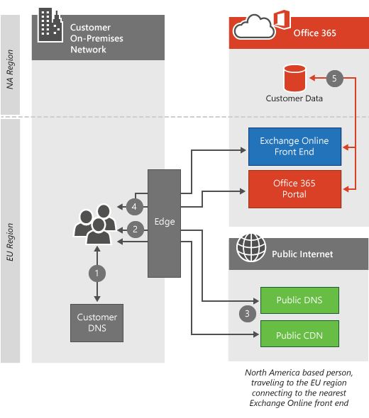

# Conectividade de clienteClient connectivity

 **Resumo:** Explica como os computadores cliente se conectam aos locatários do Office 365, dependendo do local do computador cliente e do datacenter de locatário do Office 365.**Summary:** Explains how client computers connect to Office 365 tenants, depending on the location of the client computer and Office 365 tenant datacenter.
  
O Office 365 reside nos datacenters da Microsoft em todo o mundo, o que ajuda a manter o serviço em execução, mesmo quando há um problema significativo em uma região, como um terremoto ou uma queda de energia.Office 365 resides in Microsoft datacenters around the world which help keep the service up and running even when there's a major problem in one region, such as an earthquake or a power outage. Quando você se conectar ao seu locatário do Office 365, a conexão do cliente será direcionada para o datacenter apropriado onde o locatário está sendo hospedado.When you connect to your Office 365 tenant, the client connection will be directed to the appropriate datacenter where your tenant is being hosted. As regras que determinam onde seu locatário podem ser hospedados são definidas por seu contrato com a Microsoft.The rules that determine where your tenant can be hosted are defined by your agreement with Microsoft. As regras que determinam como o cliente adquire os dados desse local de datacenter dependem da arquitetura do serviço que você está usando.The rules that determine how your client acquires the data from that datacenter location depend on the architecture of the service you're using.
  
Por exemplo, quando você faz logon no portal do Office 365, geralmente está conectado ao datacenter mais próximo ao cliente e, em seguida, direcionado, dependendo do serviço que você usa em seguida.For example, when you log on to the Office 365 portal, you're usually connected to the closest datacenter to the client and then directed depending on the service you use next. Se você iniciar o email, a conexão inicial para exibir a interface do usuário ainda pode ser proveniente do datacenter mais próximo, mas uma segunda conexão pode ser aberta entre o datacenter mais próximo e o datacenter onde o locatário está localizado para mostrar o que há nos emails que você lê.If you launch email, the initial connection to display the UI may still come from the nearest datacenter, but a second connection might be opened between the nearest datacenter and the datacenter where your tenant is located to show you what's in the emails you read. A Microsoft opera uma das dez principais redes do mundo, resultando em conexões de datacenter incrivelmente rápidas.Microsoft operates one of the top ten networks in the world, resulting in incredibly fast datacenter-to-datacenter connections.
  
Depois de ler o artigo, é provável que você entenda por que não fornecemos as [URLs e os intervalos de endereços IP do Office 365](https://support.office.com/article/8548a211-3fe7-47cb-abb1-355ea5aa88a2) por datacenter, eles são simplesmente interconectados e dependentes uns dos outros para torná-lo viável.After you read the article, you'll likely understand why we don't provide [Office 365 URLs and IP address ranges](https://support.office.com/article/8548a211-3fe7-47cb-abb1-355ea5aa88a2) per datacenter, they are simply too interconnected and reliant on each other to make that feasible.
  
Se você estiver usando o Azure ExpressRoute para Office 365, na maioria dos casos, sua conectividade passará por uma conexão privada para o Office 365 em vez da conexão pública descrita aqui.If you're using Azure ExpressRoute for Office 365, in most cases your connectivity will go over a private connection to Office 365 instead of the public connection described here. Os princípios sobre como os clientes se conectam ainda são precisos.The principles about how clients connect are still accurate. Saiba mais sobre o [Azure ExpressRoute para Office 365](azure-expressroute.md).Learn more about [Azure ExpressRoute for Office 365](azure-expressroute.md).
  
Para obter mais detalhes sobre as solicitações de rede do Skype for Business, leia o artigo [qualidade de mídia e desempenho de conectividade de rede no Skype for Business online](https://support.office.com/article/Media-Quality-and-Network-Connectivity-Performance-in-Skype-for-Business-Online-5fe3e01b-34cf-44e0-b897-b0b2a83f0917).For more depth on Skype for Business network requests, read the article [Media Quality and Network Connectivity Performance in Skype for Business Online](https://support.office.com/article/Media-Quality-and-Network-Connectivity-Performance-in-Skype-for-Business-Online-5fe3e01b-34cf-44e0-b897-b0b2a83f0917).

||
|:-----|
| Este artigo faz parte do [planejamento de rede e do ajuste de desempenho do Office 365](https://aka.ms/tune).This article is part of [Network planning and performance tuning for Office 365](https://aka.ms/tune).|

> [!NOTE]
> Temos muito cuidado para gerenciar os dados do cliente, de modo que eles sejam seguros e privados em nossos data centers.We take great care to manage customer data so it's secure and private in our datacenters. Os detalhes sobre as etapas tomadas para gerenciar a privacidade estão incluídos na [central de confiabilidade](https://go.microsoft.com/fwlink/?LinkID=397383).Details about the steps we take to manage privacy are included in the [Trust Center](https://go.microsoft.com/fwlink/?LinkID=397383).
  
## Conectando-se ao datacenter mais próximoConnecting to the nearest datacenter

Este é o tipo mais comum de conexão e é usado pelo portal do Office 365 e pelo Exchange Online.This is the most common type of connection, and it's used by both the Office 365 portal and Exchange Online. Nessa situação, quando os clientes tentam se conectar ao Office 365, a consulta DNS do computador determina a região do mundo da qual o computador está vindo e o Office 365 redireciona a solicitação para o datacenter mais próximo.In this situation, when clients attempt to connect to Office 365, their computer's DNS query determines the region of the world their computer is coming from, and Office 365 redirects the request to the nearest datacenter.
  
As conexões com o portal param no datacenter mais próximo e o computador cliente é apresentado com informações sobre o locatário do cliente desse local.Connections to the portal stop at the nearest datacenter, and the client computer is presented with information about the client's tenant from that location.
  
O Exchange Online vai um passo adiante.Exchange Online goes a step further. Depois que o computador cliente está conectado ao datacenter mais próximo, um servidor Exchange no datacenter conecta-se ao datacenter onde o locatário está realmente localizado, conforme ilustrado na *seção como funciona* .Once the client computer is connected to the nearest datacenter, an Exchange server in that datacenter connects to the datacenter where the tenant is actually located as illustrated in the  *How does this work section*  below. Os servidores do Exchange Online no datacenter mais próximo então proxy as solicitações do computador cliente para o servidor de caixa de correio.The Exchange Online servers in the nearest datacenter then proxy the requests from the client computer to the mailbox server. Isso aumenta a experiência do computador cliente, movendo o trabalho pesado da recuperação de emails e itens de calendário para a rede da Microsoft.This speeds up the experience for the client computer by moving the heavy lifting of retrieving emails and calendar items to the Microsoft network.
  
## Como isso funciona para ofertas de nuvem padrão?How does this work for standard cloud offerings?

Esse processo de conexão é padrão para grandes tráfegos, aplicativos Web de alto valor como o Office 365.This connection process is standard for high traffic, high value web applications like Office 365. Nesta seção, descrevemos e ilustramos as etapas no processo.In this section, we outline and illustrate the steps in the process. Quando o computador cliente não está na mesma região que o locatário, a conexão parece muito diferente dependendo do serviço ao qual o cliente está se conectando.When the client computer is not in the same region as the tenant, the connection looks much different depending on the service the client is connecting to.
  
 Este diagrama ilustra um cliente usando uma oferta padrão do Office 365 com um locatário na América do Norte.This diagram depicts a customer using a standard Office 365 offering with a tenant in North America. Neste cenário, a pessoa que está fazendo a solicitação viajau para a Europa e está usando o Office 365 desse local.In this scenario, the person making the request has traveled to Europe and is using Office 365 from that location.
  
1. O computador cliente solicita os servidores DNS locais para o endereço IP associado ao Office 365.The client computer asks the local DNS servers for the IP address associated with Office 365.

2. Os servidores DNS locais do computador cliente solicitam aos servidores DNS da Microsoft o endereço IP associado ao Office 365.The client computer's local DNS servers ask the Microsoft DNS servers for the IP address associated with Office 365.

3. Os servidores DNS da Microsoft retornam o nome do servidor regional (com base no local dos servidores DNS do cliente) e o computador cliente repete as etapas 1 e 2 para obter o endereço IP do datacenter regional do Office 365.Microsoft's DNS servers return the regional server name (based on the location of the client's DNS servers), and the client computer repeats steps 1 and 2 to obtain the IP address of the regional Office 365 datacenter.

4. O computador cliente se conecta ao endereço IP do datacenter regional.The client computer connects to the regional datacenter IP address.

5. Os servidores do Exchange Online estabelecem uma conexão com o datacenter ativo onde reside o locatário do cliente.The Exchange Online servers establish a connection to the active datacenter where the customer's tenant resides.

  
## Como isso funciona para as ofertas de nuvem do soberana?How does this work for sovereign cloud offerings?

Essa conexão é um pouco diferente para ofertas de nuvem do soberana, como o Office 365 operado por 21 vianet.This connection is slightly different for sovereign cloud offerings such as Office 365 operated by 21 Vianet. Com o locatário em uma instância do soberana do Office 365, os servidores do Office 365 mais próximos que aceitarão conexões do portal são os servidores dentro da região do soberana onde o locatário reside.With the tenant in a sovereign instance of Office 365, the nearest Office 365 servers that will accept portal connections are the servers within the sovereign region where the tenant resides. Da mesma forma, os clientes que acessam o SharePoint Online em nossa nuvem soberana ou ofertas padrão serão direcionados para servidores front-end nos quais o locatário reside.Similarly, customers accessing SharePoint Online in our sovereign cloud or standard offerings will be directed to front end servers where the tenant resides. Consulte conectar-se ao datacenter ativo abaixo.See connecting to the active datacenter below.
  
1. O computador cliente solicita os servidores DNS locais para o endereço IP associado ao Office 365.The client computer asks the local DNS servers for the IP address associated with Office 365.

2. Os servidores DNS locais do computador cliente solicitam aos servidores DNS da Microsoft o endereço IP associado ao Office 365.The client computer's local DNS servers ask the Microsoft DNS servers for the IP address associated with Office 365.

3. Os servidores DNS da Microsoft retornam o nome do servidor regional (com base no local dos servidores DNS do cliente) e o computador cliente repete as etapas 1 e 2 para obter o endereço IP do datacenter regional do Office 365.Microsoft's DNS servers return the regional server name (based on the location of the client's DNS servers), and the client computer repeats steps 1 and 2 to obtain the IP address of the regional Office 365 datacenter.

4. O computador cliente se conecta ao endereço IP do datacenter regional.The client computer connects to the regional datacenter IP address.

5. Os servidores do Exchange Online estabelecem uma conexão com o datacenter ativo onde reside o locatário do cliente.The Exchange Online servers establish a connection to the active datacenter where the customer's tenant resides.

  
## Conexão com o datacenter ativoConnecting to the active datacenter

A conexão com o datacenter ativo foi projetada para cargas de trabalho de transferência de dados mais pesadas e é usada no momento pelo SharePoint Online.Connecting to the active datacenter is designed for heavier data transfer workloads and is currently used by SharePoint Online. Nessa situação, quando os clientes tentam se conectar ao Office 365, seu navegador é redirecionado para o datacenter ativo para seu locatário do SharePoint Online.In this situation, when clients attempt to connect to Office 365, their browser is redirected to the active datacenter for their SharePoint Online tenant.
  
## Como isso funciona?How does this work?

Quando o computador cliente está se conectando ao SharePoint Online a partir de uma região diferente, a conexão é redirecionada para o datacenter ativo do SharePoint Online.When the client computer is connecting to SharePoint Online from a different region, the connection is redirected to the active SharePoint Online datacenter. Neste cenário, o cliente está usando uma oferta padrão, resultando nas conexões de portal restantes locais e nas conexões do SharePoint Online direcionadas para o datacenter ativo.In this scenario, the customer is using a standard offering, resulting in the portal connections remaining local and the SharePoint Online connections being directed to the active datacenter.
  
1. O computador cliente solicita os servidores DNS locais para o endereço IP associado ao Office 365.The client computer asks the local DNS servers for the IP address associated with Office 365.

2. Os servidores DNS locais do computador cliente solicitam aos servidores DNS da Microsoft o endereço IP associado ao Office 365.The client computer's local DNS servers ask the Microsoft DNS servers for the IP address associated with Office 365.

3. Os servidores DNS da Microsoft retornam o nome do servidor do datacenter do SharePoint Online ativo (com base no local do locatário do Office 365 do cliente) e o computador cliente repete as etapas 1 e 2 para obter o endereço IP do datacenter do Office 365 ativo.Microsoft's DNS servers return the server name of the active SharePoint Online datacenter (based on the location of the client's Office 365 tenant), and the client computer repeats steps 1 and 2 to obtain the IP address of the active Office 365 datacenter.

4. O computador cliente se conecta ao endereço IP do datacenter ativo.The client computer connects to the active datacenter IP address.

  
## Conectando-se por redes privadas virtuais (VPNs)Connecting over Virtual Private Networks (VPNs)

Esse tipo de conexão só se aplica quando uma rede virtual privada (VPN) é usada por computadores cliente.This type of connection applies only when a virtual private network (VPN) is used by client computers. Na realidade, o comportamento do Office 365 não é alterado simplesmente porque uma VPN é usada, mas as VPNs são comumente usadas para controlar como os computadores cliente estabelecem conexões com o Office 365 e normalmente resultam em uma experiência degradada, portanto, é importante cobrir.In reality, Office 365 behavior isn't changed simply because a VPN is used, but VPNs are commonly used to control how client computers establish connections to Office 365 and usually results in a degraded experience, so it's important to cover.
  
## Como isso funciona?How does this work?

Quando o computador cliente estabelece uma conexão VPN com um escritório corporativo em uma região diferente, os servidores DNS no Office são usados em vez dos servidores DNS no local do computador cliente.When the client computer establishes a VPN connection to a corporate office in a different region, the DNS servers at that office are used instead of the DNS servers at the client computer's location. Na maioria dos casos, essa conexão adicional sobre a VPN degradará a experiência do Office 365.In most cases, this extra connection over the VPN will degrade the Office 365 experience. Os serviços do Office 365 são otimizados para conexões do cliente de serviço o mais próximo possível do usuário final.The Office 365 services are optimized to service customer connections as close to the end user as possible. Muitos serviços aproveitam a rede de borda do Azure, redes de distribuição de conteúdo e a capacidade de rede confiável na rede da Microsoft para oferecer a melhor experiência de usuário possível quando as solicitações de rede para os serviços do Office 365 são feitas como próximas ao computador cliente possível.Many services leverage the Azure edge network, Content Delivery Networks, and the reliable network capacity on the Microsoft network to deliver the best possible user experience when network requests for Office 365 services are made as close to the client computer as possible.
  
1. O computador cliente solicita aos servidores DNS VPN o endereço IP associado ao Office 365.The client computer asks the VPN DNS servers for the IP address associated with Office 365.

2. Os servidores DNS VPN do computador cliente solicitam aos servidores DNS da Microsoft o endereço IP associado ao Office 365.The client computer's VPN DNS servers ask the Microsoft DNS servers for the IP address associated with Office 365.

3. Os servidores DNS da Microsoft retornam o nome do servidor regional (com base no local dos servidores DNS VPN) e o computador cliente repete as etapas 1 e 2 para obter as informações de endereço IP do datacenter regional do Office 365.Microsoft's DNS servers return the regional server name (based on the location of the VPN DNS servers), and the client computer repeats steps 1 and 2 to obtain the IP address information of the regional Office 365 datacenter.

4. O computador cliente se conecta ao endereço IP do datacenter que está mais próximo do escritório corporativo que estabeleceu uma conexão VPN com o.The client computer connects to the datacenter IP address that's closest to the corporate office they established a VPN connection with.

  
Aqui está um link curto que você pode usar para voltar: [https://aka.ms/o365clientconnectivity](https://aka.ms/o365clientconnectivity)Here's a short link you can use to come back: [https://aka.ms/o365clientconnectivity](https://aka.ms/o365clientconnectivity)
  
## Confira tambémSee also

[Gerenciar pontos de extremidade do Office 365Managing Office 365 endpoints](https://support.office.com/article/99cab9d4-ef59-4207-9f2b-3728eb46bf9a)
  
[Avaliando a conectividade de rede do Office 365Assessing Office 365 network connectivity](assessing-network-connectivity.md)
