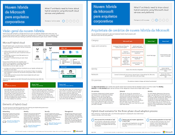

# Contoso no Microsoft Cloud

 **Resumo:** como uma organização global fictícia, mas representativa, está adotando uma infraestrutura de TI inclusiva em nuvem com as ofertas de nuvem da Microsoft.
  
Este artigo oferece links para um conjunto de artigos que descrevem como a Contoso Corporation, um conglomerado global de fabricação com sede em Paris, está adotando uma infraestrutura de TI com serviços de nuvem e tratou das principais decisões de design relacionadas a rede, identidade e segurança, e como ela está implementando cenários na nuvem corporativa para tratar dos problemas da empresa. Você pode também visualizar essas informações como um cartaz de 11 páginas e imprimi-lo em formato tabloide (também conhecido por ledger, 11 x 17 ou A3).
  

  
[PDF](https://go.microsoft.com/fwlink/p/?linkid=842085)  | [Visio](https://go.microsoft.com/fwlink/p/?linkid=842086)  | [Mais idiomas](https://www.microsoft.com/download/details.aspx?id=54427)
  
Confira as seguintes seções:
  
- [Visão geral de nuvem híbrida](hybrid-cloud-overview.md)
    
    A Contoso Corporation é um conglomerado global de fabricação, vendas e suporte com mais de 100 mil produtos.
    
- [A Contoso precisa e da infraestrutura de TI](contoso-it-infrastructure-and-needs.md)
    
    A Contoso está fazendo a transição de uma infraestrutura de TI centralizada local para uma infraestrutura incluindo nuvem que incorpore cargas de trabalho, aplicativos e cenários híbridos de produtividade pessoal baseados em nuvem.
    
- [Sistema de rede para a Contoso Corporation](networking-for-the-contoso-corporation.md)
    
    Para melhorar o desempenho dos serviços baseados em nuvem, os engenheiros de rede da Contoso otimizaram o tráfego para a borda da Internet e pela Internet.
    
- [Identidade para a Contoso Corporation](identity-for-the-contoso-corporation.md)
    
    A identidade da Contoso na solução da nuvem aproveita o provedor de identidades local dela e inclui autenticação federada com os próprios provedores confiáveis de identidades de terceiros existentes.
    
- [Contas de usuário para a Contoso Corporation, licenças e assinaturas](subscriptions-licenses-and-user-accounts-for-the-contoso-corporation.md)
    
    A Contoso usa a hierarquia das contas da organização/assinaturas/licenças/usuários para acessar as ofertas de nuvem da Microsoft.
    
- [Segurança para a Contoso Corporation](security-for-the-contoso-corporation.md)
    
    Ao fazer a transição da infraestrutura de TI para uma incluindo nuvem, a Contoso garantiu o suporte e a implementação dos requisitos de segurança local nas ofertas de nuvem da Microsoft.
    
- [Cenários empresariais para a Contoso Corporation](enterprise-scenarios-for-the-contoso-corporation.md)
    
    Veja como a Contoso está lidando com as necessidades comerciais com ofertas de nuvem da Microsoft.
    
> [!NOTE]
> Estes artigos refletem a versão de **setembro de 2017** do cartaz Contoso no Microsoft Cloud.
  
## Veja também

[Recursos de arquitetura de TI do Microsoft](microsoft-cloud-it-architecture-resources.md)

[Roteiro do Enterprise Cloud da Microsoft: recursos para os responsáveis pelas decisões de TI](https://sway.com/FJ2xsyWtkJc2taRD)

