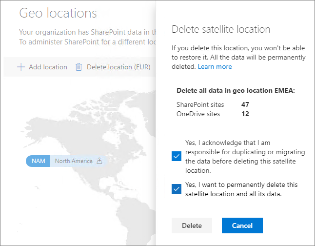

# Excluir um local de satélite no Office 365 Multi-geográfico

Se você não precisa mais de uma localização de satélite, exclua-a do seu locatário no centro de administração do SharePoint.

> [!WARNING]
> Todos os dados de usuário na localização de satélite serão excluídos permanentemente. Isso inclui todos o conteúdo do OneDrive for Business, sites do SharePoint e caixas de correio do Exchange incluindo caixas de correio do Grupo do Office 365. Você deve migrar todos os dados para outra localização de satélite ou para a localização central antes de excluir a localização de satélite. Não é possível desfazer a ação.

Somente os administradores globais podem excluir localizações de satélites.

Para excluir uma localização de satélite

1. Abra o Centro de Administração do SharePoint.

2. Navegue até a guia **Localizações geográficas**.

3. No mapa, clique na localização geográfica que você deseja excluir.

4. Clique em **Excluir localização**.

5. Confirme a exclusão marcando as caixas de seleção de confirmação.

6. Clique em **Excluir**.
