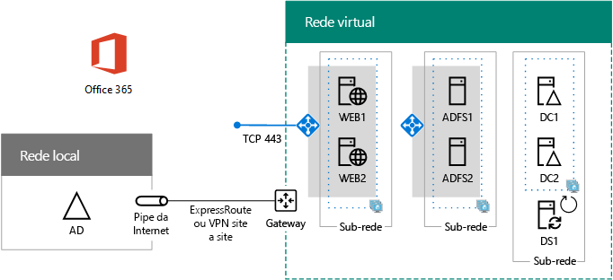

# Implantar a autenticação federada de alta disponibilidade para o Office 365 no Azure

 **Resumo:** configurar a autenticação federada de alta disponibilidade para sua assinatura do Office 365 no Microsoft Azure.
  
Este artigo contém links para as instruções passo a passo de implantação da autenticação federada de alta disponibilidade do Microsoft Office 365 nos serviços de infraestrutura do Azure com estas máquinas virtuais:
  
- Dois servidores proxy de aplicativo Web
    
- Dois servidores dos Serviços de Federação do Active Directory (AD FS)
    
- Dois controladores de domínio de réplica
    
- Um servidor de sincronização (DirSync) de diretório que executa o Azure AD Connect
    
Aqui está a configuração, com nomes de espaço reservado para cada servidor.
  
**Uma autenticação federada de alta disponibilidade para a infraestrutura do Office 365 no Azure**

  
Todas as máquinas virtuais estão em uma única rede virtual do Azure entre instalações (VNet). 
  
> [!NOTE]
> A autenticação federada de usuários individuais não confia em nenhum recurso local. No entanto, se a conexão entre instalações ficar indisponível, os controladores de domínio na VNet não receberão as atualizações das contas de usuários e grupos feitas no AD do Windows Server local. Para garantir que isso não aconteça, você pode configurar a alta disponibilidade para sua conexão entre instalações. Veja mais informações em [Conectividade VNet para VNet e entre instalações altamente disponível](https://docs.microsoft.com/azure/vpn-gateway/vpn-gateway-highlyavailable)
  
Cada par de máquinas virtuais para uma função específica está em sua própria sub-rede e conjunto de disponibilidade.
  
> [!NOTE]
> Como esta VNet está conectada à rede local, essa configuração não inclui jumpbox ou monitoramento de máquinas virtuais em uma sub-rede de gerenciamento. Veja mais informações em [Executando VMs do Windows para uma arquitetura de N camadas](https://docs.microsoft.com/azure/guidance/guidance-compute-n-tier-vm). 
  
Como resultado dessa configuração, você terá a autenticação federada para todos os usuários do Office 365, em que eles podem usar as credenciais do Active Directory do Windows Server para fazer logon em vez da conta do Office 365 deles. A infraestrutura de autenticação federada usa um conjunto redundante de servidores que são mais facilmente implantados em serviços de infraestrutura do Azure, em vez de em sua rede de borda local.
  
## Lista de materiais

Essa configuração da linha de base requer o conjunto de serviços do Azure e os componentes a seguir:
  
- Sete máquinas virtuais
    
- Uma rede virtual entre locais com quatro sub-redes
    
- Quatro grupos de recursos
    
- Três conjuntos de disponibilidade
    
- Uma assinatura do Azure
    
Veja as máquinas virtuais e seus respectivos tamanhos padrão para essa configuração.
  
|**Item**|**Descrição da máquina virtual**|**Imagem da galeria do Azure**|**Tamanho padrão**|
|:-----|:-----|:-----|:-----|
|1.    |Primeiro controlador de domínio    |Windows Server 2016 Datacenter    |D2    |
|2.    |Segundo controlador de domínio    |Windows Server 2016 Datacenter    |D2    |
|3.    |Servidor do Azure AD Connect    |Windows Server 2016 Datacenter    |D2    |
|4.    |Primeiro servidor do AD FS    |Windows Server 2016 Datacenter    |D2    |
|5.    |Segundo servidor do AD FS    |Windows Server 2016 Datacenter    |D2    |
|6.    |Primeiro servidor proxy de aplicativo Web    |Windows Server 2016 Datacenter    |D2    |
|7.    |Segundo servidor proxy de aplicativo Web    |Windows Server 2016 Datacenter    |D2    |
   
Para calcular os custos estimados para essa configuração, veja a [Calculadora de preços do Azure](https://azure.microsoft.com/pricing/calculator/).
  
## Fases da implantação

Implante essa carga de trabalho nas seguintes fases:
  
- [Autenticação federada de alta disponibilidade, Fase 1: configurar o Azure](high-availability-federated-authentication-phase-1-configure-azure.md). Crie grupos de recursos, contas de armazenamento, conjuntos de disponibilidade e uma rede virtual entre locais.
    
- [High availability federated authentication Phase 2: Configure domain controllers](high-availability-federated-authentication-phase-2-configure-domain-controllers.md). Crie e configure os controladores de domínio do Windows Server Active Directory (AD) e o DirSync server.
    
- [Autenticação federada de alta disponibilidade Fase 3: configurar servidores do AD FS](high-availability-federated-authentication-phase-3-configure-ad-fs-servers.md). Crie e configure os dois servidores do AD FS.
    
- [Autenticação federada de alta disponibilidade Fase 4: configurar proxies de aplicativos Web](high-availability-federated-authentication-phase-4-configure-web-application-pro.md). Crie e configure os dois servidores proxy de aplicativo Web.
    
- [Autenticação federada de alta disponibilidade, Fase 5: configurar a autenticação federada para Office 365](high-availability-federated-authentication-phase-5-configure-federated-authentic.md) – Configure a autenticação federada para sua assinatura do Office 365.
    
Estes artigos fornecem um guia descritivo, fase por fase, de uma arquitetura predefinida para criar uma autenticação federada funcional e de alta disponibilidade para o Office 365 nos serviços de infraestrutura do Azure. Lembre-se do seguinte:
  
- Se você for um implementador experiente do AD FS, fique à vontade para adaptar as instruções nas fases 3 e 4 e crie o conjunto de servidores que seja mais adequado às suas necessidades. 
    
- Se você já tiver uma implantação de nuvem híbrida do Azure com uma rede virtual entre instalações, fique à vontade para adaptar ou ignorar as instruções nas etapas 1 e 2 e coloque os servidores proxy de aplicativo Web e o AD FS nas sub-redes adequadas.
    
Para criar um ambiente de desenvolvimento e teste ou uma prova de conceito dessa configuração, veja [Identidade federada para seu ambiente de desenvolvimento e teste do Office 365](federated-identity-for-your-office-365-dev-test-environment.md).
  
## Próxima etapa

Inicie a configuração dessa carga de trabalho com [Autenticação federada de alta disponibilidade Fase 1: Configurar o Azure](high-availability-federated-authentication-phase-1-configure-azure.md). 
  
> [!TIP]
> Para um conjunto de arquivos implantar mais rapidamente sua autenticação federada de alta disponibilidade para o Office 365 no Azure, confira [Autenticação federada do Office 365 no Kit de implantação do Azure](https://gallery.technet.microsoft.com/Federated-Authentication-8a9f1664). 
 

