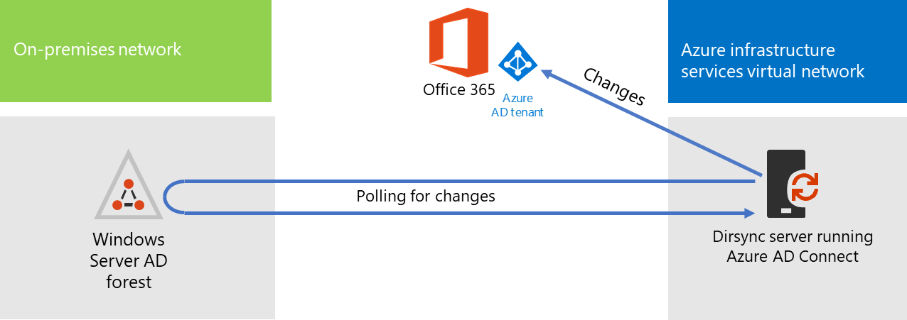
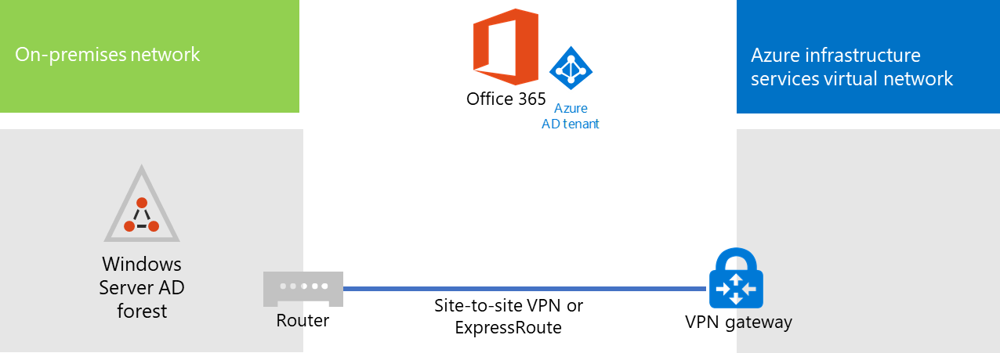

# Implantar a sincronização de diretórios do Microsoft 365 no Microsoft AzureDeploy Microsoft 365 Directory Synchronization in Microsoft Azure

O Azure Active Directory (Azure AD) Connect (anteriormente conhecido como a ferramenta de sincronização de diretório, a ferramenta de sincronização de diretório ou a ferramenta de DirSync.exe) é um aplicativo que você instala em um servidor associado a um domínio para sincronizar seus usuários do AD DS (serviços de domínio Active Directory) local para o locatário do Azure AD da sua assinatura do Microsoft 365.Azure Active Directory (Azure AD) Connect (formerly known as the Directory Synchronization tool, Directory Sync tool, or the DirSync.exe tool) is an application that you install on a domain-joined server to synchronize your on-premises Active Directory Domain Services (AD DS) users to the Azure AD tenant of your Microsoft 365 subscription. A Microsoft 365 usa o Azure AD para o serviço de diretório.Microsoft 365 uses Azure AD for its directory service. Sua assinatura do Microsoft 365 inclui um locatário do Azure AD.Your Microsoft 365 subscription includes an Azure AD tenant. Esse locatário também pode ser usado para o gerenciamento de identidades da sua organização com outras cargas de trabalho de nuvem, incluindo outros aplicativos SaaS e aplicativos no Azure.This tenant can also be used for management of your organization's identities with other cloud workloads, including other SaaS applications and apps in Azure.

Você pode instalar o Azure AD Connect em um servidor local, mas pode também instalá-lo em uma máquina virtual no Azure pelos seguintes motivos:You can install Azure AD Connect on a on-premises server, but you can also install it on a virtual machine in Azure for these reasons:
  
- Você pode provisionar e configurar servidores baseados na nuvem mais depressa, disponibilizando os serviços aos usuários com mais antecedência.You can provision and configure cloud-based servers faster, making the services available to your users sooner.
- O Azure oferece melhor disponibilidade de sites com menos esforço.Azure offers better site availability with less effort.
- Você pode reduzir o número de servidores locais em sua organização.You can reduce the number of on-premises servers in your organization.

This solution requires connectivity between your on-premises network and your Azure virtual network.This solution requires connectivity between your on-premises network and your Azure virtual network. For more information, see [Connect an on-premises network to a Microsoft Azure virtual network](connect-an-on-premises-network-to-a-microsoft-azure-virtual-network.md).For more information, see [Connect an on-premises network to a Microsoft Azure virtual network](connect-an-on-premises-network-to-a-microsoft-azure-virtual-network.md). 
  
> [!NOTE]
> Este artigo descreve a sincronização de um único domínio em uma única floresta.This article describes synchronization of a single domain in a single forest. O Azure AD Connect sincroniza todos os domínios do AD DS em sua floresta do Active Directory com o Microsoft 365.Azure AD Connect synchronizes all AD DS domains in your Active Directory forest with Microsoft 365. Se você tiver várias florestas do Active Directory para sincronizar com o Microsoft 365, confira [sincronização de diretórios com várias florestas com o cenário de logon único](https://go.microsoft.com/fwlink/p/?LinkId=393091).If you have multiple Active Directory forests to synchronize with Microsoft 365, see [Multi-forest Directory Sync with Single Sign-On Scenario](https://go.microsoft.com/fwlink/p/?LinkId=393091). 
  
## Visão geral da implantação da sincronização de diretório do Microsoft 365 no AzureOverview of deploying Microsoft 365 directory synchronization in Azure

O diagrama a seguir mostra o Azure AD Connect em execução em uma máquina virtual no Azure (o servidor de sincronização de diretório) que sincroniza uma floresta local do AD DS com uma assinatura do Microsoft 365.The following diagram shows Azure AD Connect running on a virtual machine in Azure (the directory sync server) that synchronizes an on-premises AD DS forest to a Microsoft 365 subscription.
  

  
In the diagram, there are two networks connected by a site-to-site VPN or ExpressRoute connection.In the diagram, there are two networks connected by a site-to-site VPN or ExpressRoute connection. There is an on-premises network where AD DS domain controllers are located, and there is an Azure virtual network with a directory sync server, which is a virtual machine running [Azure AD Connect](https://www.microsoft.com/download/details.aspx?id=47594).There is an on-premises network where AD DS domain controllers are located, and there is an Azure virtual network with a directory sync server, which is a virtual machine running [Azure AD Connect](https://www.microsoft.com/download/details.aspx?id=47594). There are two main traffic flows originating from the directory sync server:There are two main traffic flows originating from the directory sync server:
  
-  O Azure AD Connect consulta um controlador de domínio na rede local para detectar alterações em contas e senhas.Azure AD Connect queries a domain controller on the on-premises network for changes to accounts and passwords.
-  O Azure AD Connect envia as alterações para contas e senhas para a instância do Azure AD da sua assinatura do Microsoft 365.Azure AD Connect sends the changes to accounts and passwords to the Azure AD instance of your Microsoft 365 subscription. Como o servidor de sincronização de diretório está em uma parte estendida da sua rede local, essas alterações são enviadas pelo servidor de proxy da rede local.Because the directory sync server is in an extended portion of your on-premises network, these changes are sent through the on-premises network's proxy server.
    
> [!NOTE]
> Esta solução descreve a sincronização de um único domínio do Active Directory, uma única floresta do Active Directory.This solution describes synchronization of a single Active Directory domain, in a single Active Directory forest. O Azure AD Connect sincroniza todos os domínios do Active Directory em sua floresta do Active Directory com o Microsoft 365.Azure AD Connect synchronizes all Active Directory domains in your Active Directory forest with Microsoft 365. Se você tiver várias florestas do Active Directory para sincronizar com o Microsoft 365, confira [sincronização de diretórios com várias florestas com o cenário de logon único](https://go.microsoft.com/fwlink/p/?LinkId=393091).If you have multiple Active Directory forests to synchronize with Microsoft 365, see [Multi-forest Directory Sync with Single Sign-On Scenario](https://go.microsoft.com/fwlink/p/?LinkId=393091). 
  
Há duas etapas principais quando você implanta essa solução:There are two major steps when you deploy this solution:
  
1. Create an Azure virtual network and establish a site-to-site VPN connection to your on-premises network.Create an Azure virtual network and establish a site-to-site VPN connection to your on-premises network. For more information, see [Connect an on-premises network to a Microsoft Azure virtual network](connect-an-on-premises-network-to-a-microsoft-azure-virtual-network.md).For more information, see [Connect an on-premises network to a Microsoft Azure virtual network](connect-an-on-premises-network-to-a-microsoft-azure-virtual-network.md).
    
2. Instale o [Azure ad Connect](https://www.microsoft.com/download/details.aspx?id=47594) em uma máquina virtual associada ao domínio no Azure e sincronize o AD DS local com o Microsoft 365.Install [Azure AD Connect](https://www.microsoft.com/download/details.aspx?id=47594) on a domain-joined virtual machine in Azure, and then synchronize the on-premises AD DS to Microsoft 365. Isso envolve:This involves:
    
    Criar uma Máquina Virtual do Azure para executar o Azure AD Connect.Creating an Azure Virtual Machine to run Azure AD Connect.
    
    Instalar e configurar o [Azure AD Connect](https://www.microsoft.com/download/details.aspx?id=47594).Installing and configuring [Azure AD Connect](https://www.microsoft.com/download/details.aspx?id=47594).
    
    Configurar o Azure AD Connect requer as credenciais (nome de usuário e senha) de uma conta de administrador do Azure AD e uma conta de administrador corporativo do AD DS.Configuring Azure AD Connect requires the credentials (user name and password) of an Azure AD administrator account and a AD DS enterprise administrator account. O Azure AD Connect é executado imediatamente e continuamente para sincronizar a floresta do AD DS local com o Microsoft 365.Azure AD Connect runs immediately and on an ongoing basis to synchronize the on-premises AD DS forest to Microsoft 365.
    
Antes de implantar essa solução em produção, você pode usar as instruções da [configuração de base corporativa simulada](https://docs.microsoft.com/microsoft-365/enterprise/simulated-ent-base-configuration-microsoft-365-enterprise) para definir essa configuração como prova de conceito, para demonstrações ou para experimentos.Before you deploy this solution in production, you can use the instructions in [The simulated enterprise base configuration](https://docs.microsoft.com/microsoft-365/enterprise/simulated-ent-base-configuration-microsoft-365-enterprise) to set this configuration up as a proof of concept, for demonstrations, or for experimentation.
  
> [!IMPORTANT]
> Quando a configuração do Azure AD Connect for concluída, ele não salvará as credenciais de conta de administrador corporativo do AD DS.When Azure AD Connect configuration completes, it does not save the AD DS enterprise administrator account credentials. 
  
> [!NOTE]
> Esta solução descreve a sincronização de uma única floresta do AD DS para o Microsoft 365.This solution describes synchronizing a single AD DS forest to Microsoft 365. A topologia abordada neste artigo representa apenas uma das maneiras de implementar essa solução.The topology discussed in this article represents only one way to implement this solution. A topologia de sua organização pode ser diferente, com base em requisitos de rede e considerações de segurança exclusivos.Your organization's topology might differ based on your unique network requirements and security considerations. 
  
## Planejar a hospedagem de um servidor de sincronização de diretório para o Microsoft 365 no AzurePlan for hosting a directory sync server for Microsoft 365 in Azure

### Pré-requisitosPrerequisites

Antes de começar, examine os seguintes pré-requisitos para essa solução:Before you begin, review the following prerequisites for this solution:
  
- Examine o conteúdo de planejamento relacionado em [Planejar sua rede virtual do Azure](connect-an-on-premises-network-to-a-microsoft-azure-virtual-network.md#plan-your-azure-virtual-network).Review the related planning content in [Plan your Azure virtual network](connect-an-on-premises-network-to-a-microsoft-azure-virtual-network.md#plan-your-azure-virtual-network).
    
- Verifique se você atende a todos os [pré-requisitos](connect-an-on-premises-network-to-a-microsoft-azure-virtual-network.md#prerequisites) para configurar a Rede Virtual do Azure.Ensure that you meet all [Prerequisites](connect-an-on-premises-network-to-a-microsoft-azure-virtual-network.md#prerequisites) for configuring the Azure virtual network.
    
- Ter uma assinatura do Microsoft 365 que inclua o recurso integração com o Active Directory.Have a Microsoft 365 subscription that includes the Active Directory integration feature. Para obter informações sobre assinaturas do Microsoft 365, vá para a [página de assinatura do microsoft 365](https://products.office.com/compare-all-microsoft-office-products?tab=2).For information about Microsoft 365 subscriptions, go to the [Microsoft 365 subscription page](https://products.office.com/compare-all-microsoft-office-products?tab=2).
    
- Provisione uma máquina virtual do Azure que executa o Azure AD Connect para sincronizar sua floresta do AD DS local com o Microsoft 365.Provision one Azure Virtual Machine that runs Azure AD Connect to synchronize your on-premises AD DS forest with Microsoft 365.
    
    Você deve ter as credenciais (nomes e senhas) para a conta de administrador corporativo do AD DS e uma conta de Administrador do Azure AD.You must have the credentials (names and passwords) for a AD DS enterprise administrator account and an Azure AD Administrator account.
    
### Suposições de design de arquitetura da soluçãoSolution architecture design assumptions

A lista a seguir descreve as opções de design feitas para essa solução.The following list describes the design choices made for this solution.
  
- This solution uses a single Azure virtual network with a site-to-site VPN connection.This solution uses a single Azure virtual network with a site-to-site VPN connection. The Azure virtual network hosts a single subnet that has one server, the directory sync server that is running Azure AD Connect.The Azure virtual network hosts a single subnet that has one server, the directory sync server that is running Azure AD Connect. 
    
- Na rede local, existem servidores DNS e um controlador de domínio.On the on-premises network, a domain controller and DNS servers exist.
    
- Azure AD Connect performs password hash synchronization instead of single sign-on.Azure AD Connect performs password hash synchronization instead of single sign-on. You do not have to deploy an Active Directory Federation Services (AD FS) infrastructure.You do not have to deploy an Active Directory Federation Services (AD FS) infrastructure. To learn more about password hash synchronization and single sign-on options, see [Choosing the right authentication method for your Azure Active Directory hybrid identity solution](https://aka.ms/auth-options).To learn more about password hash synchronization and single sign-on options, see [Choosing the right authentication method for your Azure Active Directory hybrid identity solution](https://aka.ms/auth-options).
    
There are additional design choices that you might consider when you deploy this solution in your environment.There are additional design choices that you might consider when you deploy this solution in your environment. These include the following:These include the following:
  
- Se houver servidores DNS em uma rede virtual existente do Azure, determine se você deseja que seu servidor de sincronização de diretório os use para resolução de nomes em vez dos servidores DNS da rede local.If there are existing DNS servers in an existing Azure virtual network, determine whether you want your directory sync server to use them for name resolution instead of DNS servers on the on-premises network.
    
- If there are domain controllers in an existing Azure virtual network, determine whether configuring Active Directory Sites and Services may be a better option for you.If there are domain controllers in an existing Azure virtual network, determine whether configuring Active Directory Sites and Services may be a better option for you. The directory sync server can query the domain controllers in the Azure virtual network for changes in accounts and passwords instead of domain controllers on the on-premises network.The directory sync server can query the domain controllers in the Azure virtual network for changes in accounts and passwords instead of domain controllers on the on-premises network.
    
## Roteiro de implantaçãoDeployment roadmap

A implantação do Azure AD Connect em uma máquina virtual no Azure tem três etapas:Deploying Azure AD Connect on a virtual machine in Azure consists of three phases:
  
- Fase 1: Criar e configurar a rede virtual do AzurePhase 1: Create and configure the Azure virtual network
    
- Fase 2: Criar e configurar a máquina virtual do AzurePhase 2: Create and configure the Azure virtual machine
    
- Fase 3: Instalar e configurar o Azure AD ConnectPhase 3: Install and configure Azure AD Connect
    
Após a implantação, você também deve atribuir locais e licenças para as novas contas de usuário no Microsoft 365.After deployment, you must also assign locations and licenses for the new user accounts in Microsoft 365.

### Fase 1: Criar e configurar a rede virtual do AzurePhase 1: Create and configure the Azure virtual network

Para criar e configurar a rede virtual do Azure, conclua a [Fase 1: preparar sua rede local](connect-an-on-premises-network-to-a-microsoft-azure-virtual-network.md#phase-1-prepare-your-on-premises-network) e a [Fase 2: criar a rede virtual entre locais no Azure](connect-an-on-premises-network-to-a-microsoft-azure-virtual-network.md#phase-2-create-the-cross-premises-virtual-network-in-azure) no roteiro de implantação de [Conectar uma rede local a uma rede virtual do Microsoft Azure](connect-an-on-premises-network-to-a-microsoft-azure-virtual-network.md).To create and configure the Azure virtual network, complete [Phase 1: Prepare your on-premises network](connect-an-on-premises-network-to-a-microsoft-azure-virtual-network.md#phase-1-prepare-your-on-premises-network) and [Phase 2: Create the cross-premises virtual network in Azure](connect-an-on-premises-network-to-a-microsoft-azure-virtual-network.md#phase-2-create-the-cross-premises-virtual-network-in-azure) in the deployment roadmap of [Connect an on-premises network to a Microsoft Azure virtual network](connect-an-on-premises-network-to-a-microsoft-azure-virtual-network.md).
  
Esta é a configuração resultante.This is your resulting configuration.
  

  
Esta figura mostra uma rede local conectada a uma rede virtual do Azure por meio de uma conexão VPN ou ExpressRoute de site a site.This figure shows an on-premises network connected to an Azure virtual network through a site-to-site VPN or ExpressRoute connection.
  
### Fase 2: Criar e configurar a máquina virtual do AzurePhase 2: Create and configure the Azure virtual machine

Create the virtual machine in Azure using the instructions [Create your first Windows virtual machine in the Azure portal](https://go.microsoft.com/fwlink/p/?LinkId=393098).Create the virtual machine in Azure using the instructions [Create your first Windows virtual machine in the Azure portal](https://go.microsoft.com/fwlink/p/?LinkId=393098). Use the following settings:Use the following settings:
  
- On the **Basics** pane, select the same subscription, location, and resource group as your virtual network.On the **Basics** pane, select the same subscription, location, and resource group as your virtual network. Record the user name and password in a secure location.Record the user name and password in a secure location. You will need these later to connect to the virtual machine.You will need these later to connect to the virtual machine.
    
- No painel **Escolher um tamanho**, escolha o tamanho **A2 Padrão**.On the **Choose a size** pane, choose the **A2 Standard** size.
    
- On the **Settings** pane, in the **Storage** section, select the **Standard** storage type.On the **Settings** pane, in the **Storage** section, select the **Standard** storage type. In the **Network** section, select the name of your virtual network and the subnet for hosting the directory sync server (not the GatewaySubnet).In the **Network** section, select the name of your virtual network and the subnet for hosting the directory sync server (not the GatewaySubnet). Leave all other settings at their default values.Leave all other settings at their default values.
    
Para conferir se o servidor de sincronização de diretório está usando o DNS corretamente, verifique o DNS interno para garantir que um registro de endereço (A) foi adicionado à máquina virtual com o respectivo endereço IP.Verify that your directory sync server is using DNS correctly by checking your internal DNS to make sure that an Address (A) record was added for the virtual machine with its IP address. 
  
Use the instructions in [Connect to the virtual machine and sign on](https://docs.microsoft.com/azure/virtual-machines/windows/connect-logon) to connect to the directory sync server with a Remote Desktop Connection.Use the instructions in [Connect to the virtual machine and sign on](https://docs.microsoft.com/azure/virtual-machines/windows/connect-logon) to connect to the directory sync server with a Remote Desktop Connection. After signing in, join the virtual machine to the on-premises AD DS domain.After signing in, join the virtual machine to the on-premises AD DS domain.
  
For Azure AD Connect to gain access to Internet resources, you must configure the directory sync server to use the on-premises network's proxy server.For Azure AD Connect to gain access to Internet resources, you must configure the directory sync server to use the on-premises network's proxy server. You should contact your network administrator for any additional configuration steps to perform.You should contact your network administrator for any additional configuration steps to perform.
  
Esta é a configuração resultante.This is your resulting configuration.
  

  
Esta figura mostra a máquina virtual do servidor de sincronização de diretório na rede virtual entre locais do Azure.This figure shows the directory sync server virtual machine in the cross-premises Azure virtual network.
  
### Fase 3: Instalar e configurar o Azure AD ConnectPhase 3: Install and configure Azure AD Connect

Faça o procedimento a seguir:Complete the following procedure:
  
1. Connect to the directory sync server using a Remote Desktop Connection with an AD DS domain account that has local administrator privileges.Connect to the directory sync server using a Remote Desktop Connection with an AD DS domain account that has local administrator privileges. See [Connect to the virtual machine and sign on](https://docs.microsoft.com/azure/virtual-machines/windows/connect-logon).See [Connect to the virtual machine and sign on](https://docs.microsoft.com/azure/virtual-machines/windows/connect-logon).
    
2. No servidor de sincronização de diretório, abra o artigo [Configurar a sincronização de diretório para o Microsoft 365](set-up-directory-synchronization.md) e siga as instruções para a sincronização de diretório com a sincronização de hash de senha.From the directory sync server, open the [Set up directory synchronization for Microsoft 365](set-up-directory-synchronization.md) article and follow the directions for directory synchronization with password hash synchronization.
    
> [!CAUTION]
> Setup creates the **AAD_xxxxxxxxxxxx** account in the Local Users organizational unit (OU).Setup creates the **AAD_xxxxxxxxxxxx** account in the Local Users organizational unit (OU). Do not move or remove this account or synchronization will fail.Do not move or remove this account or synchronization will fail.
  
Esta é a configuração resultante.This is your resulting configuration.
  

  
Esta figura mostra o servidor de sincronização de diretório com o Azure AD Connect na rede virtual entre locais do Azure.This figure shows the directory sync server with Azure AD Connect in the cross-premises Azure virtual network.
  
### Atribuir locais e licenças aos usuários no Microsoft 365Assign locations and licenses to users in Microsoft 365

O Azure AD Connect adiciona contas à sua assinatura do Microsoft 365 do AD DS local, mas, para que os usuários entrem no Microsoft 365 e usem seus serviços, as contas devem ser configuradas com um local e licenças.Azure AD Connect adds accounts to your Microsoft 365 subscription from the on-premises AD DS, but in order for users to sign in to Microsoft 365 and use its services, the accounts must be configured with a location and licenses. Use essas etapas para adicionar o local e as licenças ativas às devidas contas de usuário:Use these steps to add the location and activate licenses for the appropriate user accounts:
  
1. Entre no centro de [Administração do Microsoft 365](https://admin.microsoft.com)e, em seguida, clique em **administrador**.Sign in to the [Microsoft 365 admin center](https://admin.microsoft.com), and then click **Admin**.
    
2. Na navegação à esquerda, clique em **Usuários > Usuários ativos**.In the left navigation, click **Users > Active users**.
    
3. Na lista das contas de usuário, marque a caixa de seleção ao lado do usuário que você deseja ativar.In the list of user accounts, select the check box next to the user you want to activate.
    
4. Na página do usuário, clique em **Editar** para **Licenças de produto**.On the page for the user, click **Edit** for **Product licenses**.
    
5. Na página **Licenças de produto**, selecione um local para o usuário em **Local** e habilite as licenças apropriadas para ele.On the **Product licenses** page, select a location for the user for **Location**, and then enable the appropriate licenses for the user.
    
6. Ao concluir, clique em **Salvar** e, em seguida, clique em **Fechar** duas vezes.When complete, click **Save**, and then click **Close** twice.
    
7. Volte à etapa 3 para usuários adicionais.Go back to step 3 for additional users.
    
## Confira tambémSee also

[Adoção da nuvem e soluções híbridasCloud adoption and hybrid solutions](cloud-adoption-and-hybrid-solutions.yml)
  
[Conectar uma rede local a uma rede virtual do Microsoft AzureConnect an on-premises network to a Microsoft Azure virtual network](connect-an-on-premises-network-to-a-microsoft-azure-virtual-network.md)

[Baixar o Azure AD ConnectDownload Azure AD Connect](https://www.microsoft.com/download/details.aspx?id=47594)
  
[Configurar a sincronização de diretórios para o Microsoft 365Set up directory synchronization for Microsoft 365](set-up-directory-synchronization.md)
  
