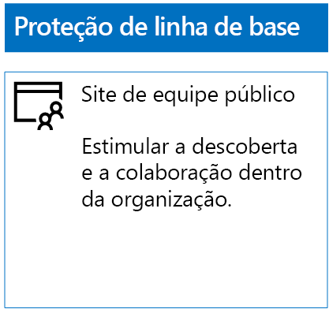
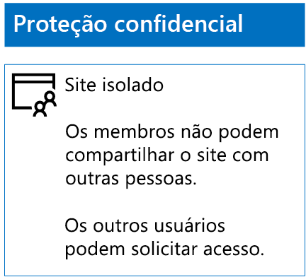
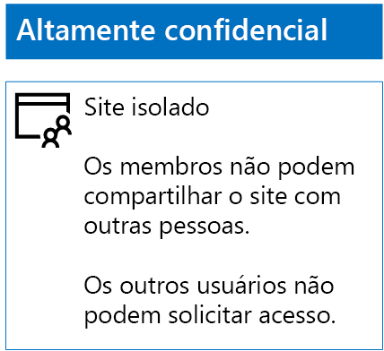

# Implantar sites do SharePoint Online para três camadas de proteçãoDeploy SharePoint Online sites for three tiers of protection

 **Resumo:** Criar e configurar sites de equipe do SharePoint Online para diversos níveis de proteção de informações.**Summary:** Create and configure SharePoint Online team sites for various levels of information protection.
  
Use as etapas neste artigo para projetar e implantar a linha de base, confidenciais e altamente confidenciais team sites do SharePoint Online. Para obter mais informações sobre esses três camadas de proteção, consulte [arquivos e sites seguro do SharePoint Online](secure-sharepoint-online-sites-and-files.md).Use the steps in this article to design and deploy baseline, sensitive, and highly confidential SharePoint Online team sites. For more information about these three tiers of protection, see [Secure SharePoint Online sites and files](secure-sharepoint-online-sites-and-files.md).
  
## Sites de equipe do SharePoint Online da linha de baseBaseline SharePoint Online team sites

Proteção de linha de base inclui os dois sites de equipe públicos e particulares. Sites de equipe públicas podem ser descobertos e acessados por qualquer pessoa na organização. Sites privadas só podem ser descobertos e acessados pelos membros do grupo do Office 365 associadas ao site de equipe. Ambos os tipos de sites de equipe permitem que os membros compartilhe o site com outras pessoas.Baseline protection includes both public and private team sites. Public team sites can be discovered and accessed by anybody in the organization. Private sites can only be discovered and accessed by members of the Office 365 group associated with the team site. Both of these types of team sites allow members to share the site with others.
  
### PúblicoPublic

Para criar um site de equipe do SharePoint Online da linha de base com e permissões de acesso público, faça o seguinte:To create a baseline SharePoint Online team site with public access and permissions, do the following:
  
1. Entrar no portal do Office 365 com uma conta que também será usada para administrar o site da equipe do SharePoint Online (um administrador do SharePoint Online). Para obter ajuda, consulte [Where entrar no Office 365](https://support.office.com/Article/Where-to-sign-in-to-Office-365-e9eb7d51-5430-4929-91ab-6157c5a050b4).Sign in to the Office 365 portal with an account that will also be used to administer the SharePoint Online team site (a SharePoint Online administrator). For help, see [Where to sign in to Office 365](https://support.office.com/Article/Where-to-sign-in-to-Office-365-e9eb7d51-5430-4929-91ab-6157c5a050b4).
    
2. Na lista de blocos, clique em **SharePoint**.In the list of tiles, click **SharePoint**.
    
3. Na guia **SharePoint** nova no seu navegador, clique em **Criar site +**.On the new **SharePoint** tab in your browser, click **+ Create site**.
    
4. Na página **criar um site** , clique em **sites de equipe**.On the **Create a site** page, click **Team site**.
    
5. Em **nome do Site**, digite um nome para o site de equipe pública.In **Site name**, type a name for the public team site. 
    
6. Em **Descrição do site de equipe**, digite uma descrição do objetivo do site.In **Team site description**, type a description of the purpose of the site.
    
7. Nas **configurações de privacidade**, selecione **pública - qualquer pessoa da organização pode acessar esse site**e clique em **Avançar**.In **Privacy settings**, select **Public - anyone in the organization can access this site**, and then click **Next**.
    
8. Sobre o **que você deseja adicionar?** painel, clique em **Concluir**.On the **Who do you want to add?** pane, click **Finish**.
    
Esta é a configuração resultante.Here is your resulting configuration.
  

  
### ParticularPrivate

Para criar um site de equipe do SharePoint Online da linha de base com permissões e acesso privado, faça o seguinte:To create a baseline SharePoint Online team site with private access and permissions, do the following:
  
1. Entrar no portal do Office 365 com uma conta que também será usada para administrar o site da equipe do SharePoint Online (um administrador do SharePoint Online). Para obter ajuda, consulte [Where entrar no Office 365](https://support.office.com/Article/Where-to-sign-in-to-Office-365-e9eb7d51-5430-4929-91ab-6157c5a050b4).Sign in to the Office 365 portal with an account that will also be used to administer the SharePoint Online team site (a SharePoint Online administrator). For help, see [Where to sign in to Office 365](https://support.office.com/Article/Where-to-sign-in-to-Office-365-e9eb7d51-5430-4929-91ab-6157c5a050b4).
    
2. Na lista de blocos, clique em **SharePoint**.In the list of tiles, click **SharePoint**.
    
3. Na guia **SharePoint** nova no seu navegador, clique em **Criar site +**.On the new **SharePoint** tab in your browser, click **+ Create site**.
    
4. Na página **criar um site** , clique em **sites de equipe**.On the **Create a site** page, click **Team site**.
    
5. Em **nome do Site**, digite um nome para o site de equipe particular.In **Site name**, type a name for the private team site. 
    
6. Em **Descrição do site de equipe,** digite uma descrição do objetivo do site.In **Team site description,** type a description of the purpose of the site.
    
7. Nas **configurações de privacidade**, selecione **privada - somente membros podem acessar esse site**e, em seguida, clique em **Avançar**.In **Privacy settings**, select **Private - only members can access this site**, and then click **Next**.
    
8. Sobre o **que você deseja adicionar?** painel, em **Adicionar membros**, digite os nomes das contas de usuário que têm acesso a este site de equipe particular.On the **Who do you want to add?** pane, in **Add members**, type the names of user accounts that have access to this private team site.
    
9. Quando você terminar adicionando o conjunto inicial de membros para o site, clique em **Concluir**When you are done adding the initial set of members to the site, click **Finish**
    
Esta é a configuração resultante.Here is your resulting configuration.
  

  
## Sites de equipe do SharePoint Online confidenciaisSensitive SharePoint Online team sites

Um site de equipe do SharePoint Online confidencial é um site de equipe isolado, o que significa que as permissões são controladas por meio de associação nos grupos do SharePoint, em vez de ser membro do grupo do Office 365 associado ao site de equipe.A sensitive SharePoint Online team site is an isolated team site, which means that permissions are controlled through membership in SharePoint groups instead of membership in the Office 365 group associated with the team site.
  
Para criar um site de equipe isolado, há duas etapas principais.To create an isolated team site, there are two main steps.
  
### Etapa 1: Criar o seu site isoladoStep 1: Design your isolated site

Para criar o seu site de equipe isolado, você precisa determinar:To design your isolated team site, you need to determine:
  
- Seus grupos do SharePoint e níveis de permissão.Your SharePoint groups and permission levels.
    
- O conjunto de grupos de acesso que serão membros de seus grupos do SharePoint.The set of access groups that will be members of your SharePoint groups.
    
     O conjunto recomendado de grupos de acesso é um para membros do site, um para os visualizadores de site e outra para os administradores de sites.The recommended set of access groups is one for site members, one for site viewers, and one for site administrators.
    
- Se você usará grupos aninhados dentro dos seus grupos de acesso.Whether you will use nested groups within your access groups.
    
Por exemplo, os níveis de permissão e estrutura de grupo recomendada semelhante a esta:For example, the recommended group structure and permission levels look like this:
  
|**Grupo do SharePoint****SharePoint group**|**Nível de permissão****Permission level**|**Grupo de acesso (exemplos)****Access group (examples)**|
|:-----|:-----|:-----|
|[nome do site] Membros[site name] Members    |EditarEdit    |[nome do site] Membros[site name] Members    |
|[nome do site] Visitantes[site name] Visitors    |LeituraRead    |[nome do site] Visualizadores[site name] Viewers    |
|[nome do site] Proprietários[site name] Owners    |Controle totalFull control    |[nome do site] Administradores[site name] Admins    |
   
Os grupos do SharePoint e níveis de permissão são criados por padrão para um site de equipe. Você precisa determinar os nomes dos seus grupos de acesso.The SharePoint groups and permission levels are created by default for a team site. You need to determine the names of your access groups.
  
Para obter detalhes sobre o processo de design, consulte [Design um site de equipe do SharePoint Online isolado](design-an-isolated-sharepoint-online-team-site.md).For the details of the design process, see [Design an isolated SharePoint Online team site](design-an-isolated-sharepoint-online-team-site.md).
  
### Etapa 2: Implantar seu site isoladoStep 2: Deploy your isolated site

Para implantar seu site isolado, você precisa primeiro:To deploy your isolated site, you first need to:
  
- Determine as contas de usuário e grupos a serem adicionados a cada um dos seus grupos de acesso.Determine the user accounts and groups to add to each of your access groups.
    
- Criar os grupos de acesso e adicione os membros de grupo e usuário.Create the access groups and add the user and group members.
    
Para obter etapas detalhadas, consulte **Phase 1** de [implantar um site de equipe do SharePoint Online isolado](deploy-an-isolated-sharepoint-online-team-site.md).For the detailed steps, see **Phase 1** of [Deploy an isolated SharePoint Online team site](deploy-an-isolated-sharepoint-online-team-site.md).
  
Em seguida, você cria o site da equipe do SharePoint Online com estas etapas.Next, you create the SharePoint Online team site with these steps.
  
1. Entrar no portal do Office 365 com uma conta que também será usada para administrar o site da equipe do SharePoint Online (um administrador do SharePoint Online). Para obter ajuda, consulte [Where entrar no Office 365](https://support.office.com/Article/Where-to-sign-in-to-Office-365-e9eb7d51-5430-4929-91ab-6157c5a050b4).Sign in to the Office 365 portal with an account that will also be used to administer the SharePoint Online team site (a SharePoint Online administrator). For help, see [Where to sign in to Office 365](https://support.office.com/Article/Where-to-sign-in-to-Office-365-e9eb7d51-5430-4929-91ab-6157c5a050b4).
    
2. Na lista de blocos, clique em **SharePoint**.In the list of tiles, click **SharePoint**.
    
3. Na guia **SharePoint** novo do seu navegador, clique em **+ Criar site**.In the new **SharePoint** tab of your browser, click **+ Create site**.
    
4. Na página **criar um site** , clique em **sites de equipe**.On the **Create a site** page, click **Team site**.
    
5. Em **nome do Site**, digite um nome para o site de equipe particular.In **Site name**, type a name for the private team site.
    
6. Na **Descrição do site de equipe**, digite uma descrição opcional.In **Team site description**, type an optional description.
    
7. Nas **configurações de privacidade**, selecione **privada - somente membros podem acessar esse site**e, em seguida, clique em **Avançar**.In **Privacy settings**, select **Private - only members can access this site**, and then click **Next**.
    
8. Sobre o **que você deseja adicionar?** painel, clique em **Concluir**.On the **Who do you want to add?** pane, click **Finish**.
    
Em seguida, do novo site de equipe do SharePoint Online, configure permissões com estas etapas.Next, from the new SharePoint Online team site, configure permissions with these steps.
  
1. Determinar o nome Principal de usuário (UPN) do administrador de TI ou outra pessoa de quem será responsável para responder e lidando com as solicitações de acesso ao site (belindan@contoso.com é um exemplo de um UPN). Gravar esse UPN aqui: _.Determine the User Principal Name (UPN) of the IT administrator or other person who will be responsible for responding to and addressing requests for access to the site (belindan@contoso.com is an example of a UPN). Write that UPN here: _________________________________________.
    
2. Na barra de ferramentas, clique no ícone configurações e, em seguida, clique em **permissões do Site**.In the tool bar, click the settings icon, and then click **Site permissions**.
    
3. No painel de **permissões do Site** , clique em **configurações de permissões avançadas**.In the **Site permissions** pane, click **Advanced permissions settings**.
    
4. Na guia **permissões** novo do navegador, clique em **Configurações de solicitação de acesso**.On the new **Permissions** tab of your browser, click **Access Request Settings**.
    
5. Na caixa de diálogo **Configurações de solicitações de acesso** :In the **Access Requests Settings** dialog box:
    
  - Desmarque as caixas de seleção **Permitir que os membros para compartilhar o site e arquivos e pastas individuais** e **Permitir que os membros para convidar outras pessoas ao grupo de membros do site** .Clear the **Allow members to share the site and individual files and folders** and **Allow members to invite others to the site members group** check boxes.
    
  - Digite o UPN do seu administrador de TI da etapa 1 na **Enviar todas as solicitações de acesso**.Type the UPN of your IT administrator from step 1 in **Send all requests for access**.
    
  - Clique em **OK**.Click **OK**.
    
6. Na guia **permissões** do seu navegador, clique em **membros do [nome do site]** na lista.On the **Permissions** tab of your browser, click **[site name] Members** in the list.
    
7. Em **pessoas e grupos**, clique em **novo**.In **People and Groups**, click **New**.
    
8. Na caixa de diálogo **compartilhamento** , digite o nome do seu grupo de acesso de membros do site para este site, selecioná-la e, em seguida, clique em **compartilhar**.In the **Share** dialog box, type the name of your site members access group for this site, select it, and then click **Share**.
    
9. Clique no botão voltar de seu navegador.Click the back button on your browser.
    
10. Na lista, clique em **[nome do site] proprietários** .Click **[site name] Owners** in the list.
    
11. Em **pessoas e grupos**, clique em **novo**.In **People and Groups**, click **New**.
    
12. Na caixa de diálogo **compartilhamento** , digite o nome do grupo de acesso de administradores de site para este site, selecioná-la e, em seguida, clique em **compartilhar**.In the **Share** dialog box, type the name of the site administrators access group for this site, select it, and then click **Share**.
    
13. Clique no botão voltar de seu navegador.Click the back button on your browser.
    
14. Clique em **visitantes do [nome do site]** na lista.Click **[site name] Visitors** in the list.
    
15. Em **pessoas e grupos**, clique em **novo**.In **People and Groups**, click **New**.
    
16. Na caixa de diálogo **compartilhamento** , digite o nome do grupo de acesso ao site visualizadores para esse site, selecioná-la e, em seguida, clique em **compartilhar**.In the **Share** dialog box, type the name of the site viewers access group for this site, select it, and then click **Share**.
    
17. Feche a guia **permissões** do navegador.Close the **Permissions** tab of your browser.
    
Os resultados dessas configurações de permissão são:The results of these permission settings are:
  
- Os **proprietários do [nome do site]** grupo do SharePoint contém o grupo de acesso de administradores de site, no quais todos os membros têm o nível de permissão **controle total** .The **[site name] Owners** SharePoint group contains the site administrators access group, in which all the members have the **Full control** permission level.
    
- Os **membros do [nome do site]** grupo do SharePoint contém o grupo de acesso de membros do site, no quais todos os membros têm o nível de permissão **Editar** .The **[site name] Members** SharePoint group contains the site members access group, in which all the members have the **Edit** permission level.
    
- **Visitantes do [nome do site]** grupo do SharePoint contém site grupo visualizadores de acesso, no quais todos os membros têm o nível de permissão de **leitura** .The **[site name] Visitors** SharePoint group contains the site viewers access group, in which all the members have the **Read** permission level.
    
- A capacidade de membros convidar outros membros está desabilitada.The ability for members to invite other members is disabled.
    
- A capacidade de membros solicitar acesso está habilitada.The ability for non-members to request access is enabled.
    
Esta é a configuração resultante.Here is your resulting configuration.
  

  
Os membros do site, por meio de associação de grupo em um dos grupos de acesso, agora podem colaborar com segurança com os recursos do site.The members of the site, through group membership in one of the access groups, can now securely collaborate on the resources of the site.
  
## Altamente confidenciais sites de equipe do SharePoint OnlineHighly confidential SharePoint Online team sites

Um site de equipe do SharePoint Online altamente confidencial é um site de equipe isolado, o que significa que as permissões são controladas por meio de associação nos grupos do SharePoint, em vez de ser membro do grupo do Office 365 associado ao site de equipe.A highly confidential SharePoint Online team site is an isolated team site, which means that permissions are controlled through membership in SharePoint groups instead of membership in the Office 365 group associated with the team site.
  
Para criar um site de equipe isolado informações altamente confidenciais e colaboração, há duas etapas principais.To create an isolated team site for highly confidential information and collaboration, there are two main steps.
  
### Etapa 1: Criar o seu site isoladoStep 1: Design your isolated site

Para criar o seu site de equipe isolado, você precisa determinar:To design your isolated team site, you need to determine:
  
- Seus grupos do SharePoint e níveis de permissão.Your SharePoint groups and permission levels.
    
- O conjunto de grupos de acesso que serão membros de seus grupos do SharePoint.The set of access groups that will be members of your SharePoint groups.
    
     O conjunto recomendado de grupos de acesso é um para membros do site, um para os visualizadores de site e outra para os administradores de sites.The recommended set of access groups is one for site members, one for site viewers, and one for site administrators.
    
- Se você usará grupos aninhados dentro dos seus grupos de acesso.Whether you will use nested groups within your access groups.
    
Por exemplo, os níveis de permissão e estrutura de grupo recomendada semelhante a esta:For example, the recommended group structure and permission levels look like this:
  
|**Grupo do SharePoint****SharePoint group**|**Nível de permissão****Permission level**|**Grupo de acesso (exemplos)****Access group (examples)**|
|:-----|:-----|:-----|
|[nome do site] Membros[site name] Members    |EditarEdit    |[nome do site] Membros[site name] Members    |
|[nome do site] Visitantes[site name] Visitors    |LeituraRead    |[nome do site] Visualizadores[site name] Viewers    |
|[nome do site] Proprietários[site name] Owners    |Controle totalFull control    |[nome do site] Administradores[site name] Admins    |
   
Os grupos do SharePoint e níveis de permissão são criados por padrão para um site de equipe. Você precisa determinar os nomes dos seus grupos de acesso.The SharePoint groups and permission levels are created by default for a team site. You need to determine the names of your access groups.
  
Para obter detalhes sobre o processo de design, consulte [Design um site de equipe do SharePoint Online isolado](design-an-isolated-sharepoint-online-team-site.md).For the details of the design process, see [Design an isolated SharePoint Online team site](design-an-isolated-sharepoint-online-team-site.md).
  
### Etapa 2: Implantar seu site isoladoStep 2: Deploy your isolated site

Para implantar seu site isolado, você precisa primeiro:To deploy your isolated site, you first need to:
  
- Determinar os membros de grupo e usuário de cada um dos seus grupos de acessoDetermine the user and group members of each of your access groups
    
- Criar os grupos de acesso e adicionar os membros de grupo e usuárioCreate the access groups and add the user and group members
    
- Criar um site de equipe isolado que usa os grupos de acessoCreate an isolated team site that uses your access groups
    
Para obter etapas detalhadas, consulte [Deploy um site de equipe do SharePoint Online isolado](deploy-an-isolated-sharepoint-online-team-site.md).For the detailed steps, see [Deploy an isolated SharePoint Online team site](deploy-an-isolated-sharepoint-online-team-site.md).
  
Os resultados das configurações de permissão são:The results of the permission settings are:
  
- Os **proprietários do [nome do site]** grupo do SharePoint contém o grupo de acesso de administradores de site, no quais todos os membros têm o nível de permissão **controle total** .The **[site name] Owners** SharePoint group contains the site administrators access group, in which all the members have the **Full control** permission level.
    
- Os **membros do [nome do site]** grupo do SharePoint contém o grupo de acesso de membros do site, no quais todos os membros têm o nível de permissão **Editar** .The **[site name] Members** SharePoint group contains the site members access group, in which all the members have the **Edit** permission level.
    
- **Visitantes do [nome do site]** grupo do SharePoint contém site grupo visualizadores de acesso, no quais todos os membros têm o nível de permissão de **leitura** .The **[site name] Visitors** SharePoint group contains the site viewers access group, in which all the members have the **Read** permission level.
    
- A capacidade de membros convidar outros membros está desabilitada.The ability for members to invite other members is disabled.
    
- A capacidade de membros solicitar acesso está desabilitada.The ability for non-members to request access is disabled.
    
Esta é a configuração resultante.Here is your resulting configuration.
  

  
Os membros do site, por meio de associação de grupo em um dos grupos de acesso, agora podem colaborar com segurança com os recursos do site.The members of the site, through group membership in one of the access groups, can now securely collaborate on the resources of the site.
  
## Próxima etapaNext step

[Proteger os arquivos do SharePoint Online com o Office 365 rótulos e DLPProtect SharePoint Online files with Office 365 labels and DLP](protect-sharepoint-online-files-with-office-365-labels-and-dlp.md)
    
## Veja tambémSee Also

[Proteja arquivos e sites do SharePoint OnlineSecure SharePoint Online sites and files](secure-sharepoint-online-sites-and-files.md)
  
[Proteger sites do SharePoint Online em um ambiente de desenvolvimento e testeSecure SharePoint Online sites in a dev/test environment](secure-sharepoint-online-sites-in-a-dev-test-environment.md)
  
[Orientação de segurança da Microsoft para campanhas políticas, organizações sem fins lucrativos e outras organizações ágilMicrosoft Security Guidance for Political Campaigns, Nonprofits, and Other Agile Organizations](microsoft-security-guidance-for-political-campaigns-nonprofits-and-other-agile-o.md)
  
[Adoção da nuvem e soluções híbridasCloud adoption and hybrid solutions](cloud-adoption-and-hybrid-solutions.md)

