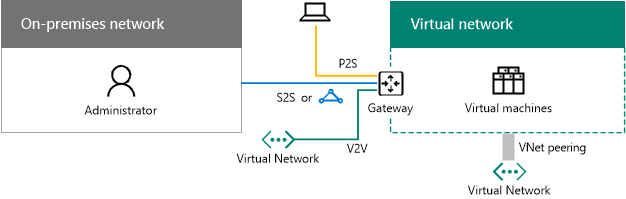
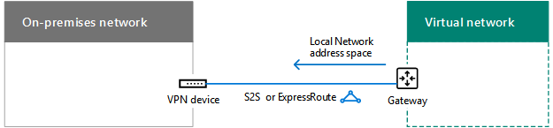

# Projetando a rede para o Microsoft Azure IaaS

 **Resumo:** Compreenda como projetar rede otimizada para cargas de trabalho no Microsoft Azure IaaS.
  
Otimização de rede para cargas de trabalho do IT hospedado no Windows Azure IaaS requer uma compreensão de redes virtuais do Azure (VNets), espaços de endereçamento, roteamento, DNS e balanceamento de carga.
  
## Etapas de planejamento para qualquer VNet

Siga estas etapas para qualquer tipo de VNet.
  
### Etapa 1: Prepare sua intranet para serviços de nuvem da Microsoft.

Percorra a seção de **etapas para preparar sua rede para serviços de nuvem da Microsoft** em [elementos comuns da conectividade de nuvem da Microsoft](common-elements-of-microsoft-cloud-connectivity.md).
  
### Etapa 2: Otimize sua largura de banda da Internet.

Otimize sua largura de banda da Internet usando as etapas 2 a 4 da seção **etapas para preparar a sua rede de serviços Microsoft SaaS** em [projetar a rede para o Microsoft SaaS](designing-networking-for-microsoft-saas.md).
  
### Etapa 3: Determinar o tipo de VNet (somente em nuvem ou entre instalações).

Um VNet somente em nuvem não tem nenhuma conexão a uma rede local. Aqui está um exemplo.
  
**Figura 1: Um somente em nuvem VNet**

  
A Figura 1 mostra um conjunto de máquinas virtuais em um VNet somente em nuvem.
  
Uma locais cruzados VNet tem uma site a site (S2S) conexão VPN ou ExpressRoute a uma rede local através de um gateway Azure. Aqui está um exemplo.
  
**Figura 2: Uma VNet entre locais**

  
Figura 2 mostra um conjunto de máquinas virtuais em um VNet entre locais, que é conectado a uma rede local.
  
Consulte o adicionais seção [etapas de planejamento para uma VNet locais cruzados](designing-networking-for-microsoft-azure-iaas.md#cross_prem) neste artigo.
  
### Etapa 4: Determine o espaço de endereçamento do VNet.

A tabela 1 mostra os espaços de endereço para os diferentes tipos de VNets.
  
|**Tipo de VNet**|**Espaço de endereço de rede virtual**|
|:-----|:-----|
|Apenas Nuvem    |Espaço de endereço privado arbitrário    |
|Interconectados somente em nuvem    |Privado arbitrário, mas não sobrepostas com os outros conectados VNets    |
|Entre locais    |Privadas, mas não sobrepostas com o local    |
|Interconexão entre locais    |Privadas, mas não sobrepostas com local e outros conectados VNets    |
   
 **Tabela 1: Espaço de endereçamento de tipos de VNets e seus correspondente**
  
Máquinas virtuais são atribuídas a uma configuração de endereço a partir do espaço de endereço da sub-rede por DHCP:
  
- Endereço/máscara de sub-rede
    
- Gateway padrão
    
- Endereços IP do servidor DNS
    
Você também pode reservar um endereço IP estático.
  
Máquinas virtuais pode também ser atribuídas um endereço IP público, individualmente ou do serviço de nuvem que contêm (para máquinas de implantação clássico somente).
  
### Etapa 5: Determine as sub-redes dentro do VNet e os espaços de endereço atribuídos a cada uma.

Existem dois tipos de sub-redes em uma VNet, uma sub-rede de gateway e uma sub-rede de hospedagem de máquinas virtuais.
  
**Figura 3: Os dois tipos de sub-redes no Windows Azure**

  
A Figura 3 mostra uma VNet contendo uma sub-rede de gateway que contenha um gateway Azure e um conjunto de sub-redes de hospedagem de máquinas virtuais contendo as máquinas virtuais.
  
A sub-rede do Azure gateway é necessário pelo Windows Azure para hospedar as duas máquinas virtuais do Azure gateway de. Especificar um espaço de endereçamento com pelo menos um comprimento de prefixo 29 bits (exemplo: 192.168.15.248/29). É recomendável um comprimento de prefixo 28 bits ou menor, especialmente se você estiver planejando usar ExpressRoute.
  
Uma prática recomendada para determinar o espaço de endereço da sub-rede Azure gateway é o seguinte:
  
1. Decida sobre o tamanho da sub-rede gateway.
    
2. Nos bits variáveis no espaço de endereço do VNet, defina os bits usados para a sub-rede do gateway como 0 e defina os bits restantes como 1.
    
3. Converter em decimal e express como um espaço de endereçamento com o comprimento de prefixo definido como o tamanho da sub-rede gateway.
    
Com este método, o espaço de endereço para a sub-rede do gateway é sempre o final mais distante do espaço de endereço VNet.
  
Aqui está um exemplo de como definir o prefixo de endereço para a sub-rede do gateway: espaço de endereço do VNet é 10.119.0.0/16. A organização usará inicialmente uma conexão VPN de site a site, mas receberá eventualmente ExpressRoute. Tabela 2 mostra as etapas e os resultados de determinar o prefixo de endereço de sub-rede de gateway em notação de prefixo de rede (também conhecido como CIDR).

Aqui estão as etapas e exemplo de determinar o prefixo de endereço de sub-rede de gateway:

1. Decida sobre o tamanho da sub-rede gateway. Para nosso exemplo, podemos escolheu /28.
2. Defina os bits na variável parte do espaço de endereço VNet (b) como 0 para o gateway de bits de sub-rede (G), caso contrário 1 (V). Para nosso exemplo, estamos usando o espaço de endereçamento 10.119.0.0/16 para o VNet. 
 10.119. bbbbbbbb. bbbbbbbb 10.119. VVVVVVVV. VVVVGGGG 10.119. 11111111. 11110000  
3. Converta o resultado da etapa 2 para decimal e expressa como um espaço de endereçamento. Para nosso exemplo, 10.119. 11111111. 11110000 é 10.119.255.240 e com o comprimento de prefixo da etapa 1, (28 em nosso exemplo), o prefixo de endereço de sub-rede de gateway resultante é 10.119.255.240/28.
  
Para obter mais informações, consulte o [Calculadora de espaço de endereço para sub-redes de gateway do Azure](https://gallery.technet.microsoft.com/scriptcenter/Address-prefix-calculator-a94b6eed) .
  
Hospedagem de máquinas virtuais sub-redes são onde você colocar máquinas virtuais do Azure, que pode ser feito de acordo com as diretrizes de local típico, uma função comuns ou a camada de um aplicativo ou para o isolamento de sub-rede.
  
Azure usa os 3 primeiros endereços em cada sub-rede. Portanto, o número de endereços possíveis em uma sub-rede Azure é 2n -5, onde n é o número de bits de host. Mostra a tabela 3 hospeda o intervalo de máquinas virtuais necessárias, o número de bits necessários e o tamanho de sub-rede correspondente.
  
|**Máquinas virtuais necessárias**|**Bits de host**|**Tamanho de sub-rede**|
|:-----|:-----|:-----|
|1 a 3    |3    |/29    |
|4 a 11    |4    |/28    |
|12 a 27    |5    |/27    |
|28 a 59    |6    |/26    |
|60 a 123    |7    |/25    |
   
 **Tabela 3: requisitos de máquina Virtual e seus tamanhos de sub-rede**
  
Para obter mais informações sobre a quantidade máxima de máquinas virtuais em uma sub-rede ou VNet, consulte [Limites do serviço de rede](https://docs.microsoft.com/azure/azure-subscription-service-limits#networking-limits).
  
Para obter mais informações, consulte [Plan and design redes virtuais do Azure](https://azure.microsoft.com/documentation/articles/virtual-network-vnet-plan-design-arm/).
  
### Etapa 6: Determine a configuração do servidor DNS e os endereços dos servidores DNS para atribuir a VMs no VNet.

Azure atribui os endereços dos servidores DNS por DHCP de máquinas virtuais. Os servidores DNS podem ser:
  
- Fornecidos pelo Windows Azure: fornece o registro de nome local e o local e a resolução de nomes de Internet
    
- Fornecido por você: fornece o registro de nome local ou intranet e intranet ou resolução de nomes de Internet
    
A tabela 4 mostra as diferentes configurações de servidores DNS para cada tipo de VNet.
    
|**Tipo de VNet**|**Servidor DNS**|
|:-----|:-----|
|Apenas Nuvem    |Fornecidos pelo Windows Azure para o local e a resolução de nomes de Internet    Máquina virtual do Azure para o local e a resolução de nomes de Internet (encaminhamento de DNS)    |
|Entre locais    |No local para resolução de nomes de local e intranet    Máquina virtual do Azure para resolução de nomes de local e intranet (replicação DNS e encaminhamento)    |
   
 **Tabela 4: Opções de servidor DNS para os dois tipos diferentes de VNets**
  
Para obter mais informações, consulte [Resolução de nomes de máquinas virtuais e instâncias de função](https://docs.microsoft.com/azure/virtual-network/virtual-networks-name-resolution-for-vms-and-role-instances).
  
### Etapa 7: Determinar a configuração de balanceamento de carga (voltados para a Internet ou interno).

Em alguns casos, você deseja distribuir o tráfego de entrada para um conjunto de servidores que possuem a mesma função. Azure IaaS tem um recurso interno para fazer isso para voltados para a Internet e cargas de tráfego interno.
  
Azure voltado à Internet balanceamento aleatoriamente distribui o tráfego de entrada não solicitado da Internet para os membros de um conjunto com balanceamento de carga.
  
**Figura 4: Um balanceador de carga externo no Windows Azure**

  
Figura 4 mostra um balanceador de carga externo no Azure que distribui o tráfego de entrada em uma regra de entrada NAT ou ponto de extremidade para um conjunto de máquinas virtuais em um conjunto com balanceamento de carga.
  
Aleatoriamente de balanceamento de carga de interna Azure distribui o tráfego de entrada não solicitado a partir de outras VMs Azure ou computadores da intranet para os membros de um conjunto com balanceamento de carga. 
  
**Figura 5: Um balanceador de carga interno no Windows Azure**

  
Figura 5 mostra um balanceador de carga interno no Azure que distribui o tráfego de entrada em uma regra de entrada NAT ou ponto de extremidade para um conjunto de máquinas virtuais em um conjunto com balanceamento de carga.
  
Para obter mais informações, consulte o [Balanceador de carga do Windows Azure](https://docs.microsoft.com/azure/load-balancer/load-balancer-overview).
  
### Etapa 8: Determine o uso de dispositivos virtuais e rotas definidas pelo usuário.

Se você precisar encaminhar o tráfego de aparelhos virtuais na sua VNet, você pode precisar adicionar uma ou mais rotas definidas pelo usuário a uma sub-rede.
  
**Figura 6: Dispositivos virtuais e rotas definidas pelo usuário no Windows Azure**

  
Figura 6 mostra uma VNet entre locais e uma rota definida pelo usuário atribuído a uma sub-rede de hospedagem de máquina virtual que aponta para um dispositivo virtual.
  
Para obter mais informações, consulte [as rotas definidas pelo usuário e o encaminhamento de IP](https://docs.microsoft.com/azure/virtual-network/virtual-networks-udr-overview).
  
### Etapa 9: Determine como computadores da Internet se conectará para máquinas virtuais.

Há várias maneiras de fornecer acesso à Internet para as máquinas virtuais em um VNet, que inclui o acesso a partir da rede da organização por meio de seu servidor proxy ou outro dispositivo de borda.
  
Tabela 5 lista os métodos de filtragem ou inspecionando o tráfego de entrada não solicitado.
  
|**Método**|**Modelo de implantação**|
|:-----|:-----|
|1. ACLs configuradas em serviços em nuvem e pontos de extremidade    |Clássico    |
|2. grupos de segurança de rede de    |Gerenciador de recursos e clássico    |
|3. balanceador de carga de voltado à Internet com as regras de entrada NAT    |Gerente de Recursos    |
|4. rede aparelhos de segurança no Azure Marketplace (não mostrada)    |Gerenciador de recursos e clássico    |
   
 **Tabela 5: Métodos para máquinas virtuais e seus modelos de implantação Azure correspondentes conectar**
  
**Figura 7: Conectar-se a máquinas virtuais do Azure pela Internet**

  
Figura 7 mostra um computador conectado à Internet, conectando-se a uma máquina virtual em um serviço de nuvem usando um ponto de extremidade, uma máquina virtual em uma sub-rede usando um grupo de segurança de rede e uma máquina virtual em uma sub-rede usando um balanceador de carga externo e as regras de entrada NAT.
  
Segurança adicional é fornecida por:
  
- Conexões da área de trabalho remota e SSH, que são autenticadas e criptografadas.
    
- PowerShell sessões remotas, que são autenticadas e criptografadas.
    
- Modo de transporte IPsec, que pode ser usada para a criptografia de ponta a ponta.
    
- Proteção de DDOS Azure, que ajuda a impedir ataques de internas e externas
    
Para obter mais informações, consulte [Microsoft Security de nuvem para arquitetos da empresa](https://aka.ms/cloudarchsecurity) e [Segurança de rede do Windows Azure](https://azure.microsoft.com/blog/azure-network-security/).
  
### Etapa 10: Para vários VNets, determine a topologia de conexão VNet para VNet.

VNets pode ser conectado uns aos outros usando topologias similares às utilizada para conectar os sites de uma organização.
  
Uma configuração de corrente margarida conecta-se a VNets em uma série.
  
**Figura 8: Uma conectados configuração para VNets**

  
Figura 8 mostra cinco VNets conectados na série usando uma configuração conectados.
  
Uma configuração de hub e spoke conecta vários VNets para um conjunto de VNets central, que são sozinhos conectados entre si.
  
**Figura 9: Uma configuração hub e spoke para VNets**

  
Figura 9 mostra seis VNets, que dois VNets são hubs que estão conectados a umas às outras e também dois outro spoke VNets.
  
Uma configuração de malha completa se conecta a cada VNet uns aos outros.
  
**Figura 10: Configuração para VNets de malha completa**

  
Figura 10 mostra quatro VNets que estão conectados entre si, usando um total de conexões de seis VNet para VNet.
  
## Etapas de planejamento para uma VNet entre locais

Siga estas etapas para uma VNet entre locais.
  
> [!TIP]
> Para criar um ambiente de desenvolvimento e teste simulado entre locais, consulte [simuladas locais cruzados rede virtual no Windows Azure](simulated-cross-premises-virtual-network-in-azure.md). 
  
### Etapa 1: Determine a conexão entre locais para o VNet (S2S VPN ou ExpressRoute).

Tabela 6 lista os diferentes tipos de conexões.
  
|**Tipo de conexão**|**Objetivo**|
|:-----|:-----|
|VPN to-Site (S2S)    |Conecte sites de 1 a 10 (incluindo outros VNets) para um único VNet.    |
|ExpressRoute    |Um link particular e seguro no Azure por meio de um provedor de Exchange da Internet (IXP) ou um provedor de serviço de rede (NSP).    |
|VPN ponto-a-Site (P2S)    |Conecta-se um único computador para um VNet.    |
|Correspondência de VNet ou VNet para VNet (V2V) VPN    |Conecta-se um VNet para outra VNet.    |
   
 **Tabela 6: Os tipos de conexões para locais cruzados VNets**
  
Para obter mais informações sobre o número máximo de conexões, consulte [Limites do serviço de rede](https://docs.microsoft.com/azure/azure-subscription-service-limits#networking-limits).
  
Para obter mais informações sobre dispositivos VPN, consulte [dispositivos VPN para conexões de rede virtual do site a site](https://docs.microsoft.com/azure/vpn-gateway/vpn-gateway-about-vpn-devices).
  
Para obter mais informações sobre VNet correspondência, consulte [VNet correspondência](https://docs.microsoft.com/azure/virtual-network/virtual-network-peering-overview).
  
**Figura 11: As quatro maneiras para se conectar a um VNet entre locais**

  
A Figura 11 mostra um VNet com os quatro tipos de conexões: uma conexão P2S de um computador, uma conexão VPN S2S de uma rede local, uma conexão ExpressRoute de uma rede local e uma conexão de VNet para VNet a partir de outra VNet. 
  
Você pode conectar VMs em um VNet das seguintes maneiras:
  
- Administração de VMs VNet da sua rede local ou da Internet
    
- Acesso de carga de trabalho do IT da sua rede local
    
- Extensão da sua rede por meio de VNets adicionais
    
Segurança para conexões é fornecida pelo seguinte:
  
- P2S usa o Secure Socket encapsulamento SSTP (Protocol) 
    
- Conexões S2S e VNet para VNet VPN usam o modo de túnel IPsec AES256
    
- ExpressRoute é uma conexão WAN privada
    
Para obter mais informações, consulte [Microsoft Security de nuvem para arquitetos da empresa](https://aka.ms/cloudarchsecurity) e [Segurança de rede do Windows Azure](https://azure.microsoft.com/blog/azure-network-security/).
  
### Etapa 2: Determine o dispositivo VPN no local ou roteador.

Seu dispositivo VPN no local ou roteador atua como:
  
- Um ponto IPsec, abortar a conexão VPN S2S do Azure gateway.
    
- O ponto BPG e rescisão apontam para a conexão privada de ExpressRoute de correspondência.
    
**Figura 12: O roteador VPN local ou dispositivo**

  
Figura 12 mostra que um VNet locais cruzados conectado a um roteador VPN local ou dispositivo.
  
Para obter mais informações, consulte [gateway sobre VPN](https://docs.microsoft.com/azure/vpn-gateway/vpn-gateway-about-vpngateways).
  
### Etapa 3: Adicione rotas à sua intranet para tornar o espaço de endereço do VNet pode ser acessado.

O roteamento para VNets no local consiste das seguintes opções:
  
1. Uma rota para o espaço de endereçamento de VNet direcionará seu dispositivo VPN.
    
2. Uma rota para o espaço de endereçamento VNet no seu dispositivo VPN que aponta entre a conexão VPN S2S ou ExpressRoute
    
**Figura 13: As rotas de local necessário para fazer um VNet pode ser acessado**

  
Figura 13 mostra as informações de roteamento exigidas pelos roteadores no local e o roteador VPN ou dispositivo que representa o espaço de endereço do VNet.
  
### Etapa 4: Para ExpressRoute, planeje a nova conexão com seu provedor.

Você pode criar uma conexão ExpressRoute com correspondência privada entre sua rede local e a nuvem da Microsoft de três maneiras diferentes:
  
- Co localizado em uma troca de nuvem
    
- Conexões Ethernet de ponto a ponto
    
- Para qualquer redes de (VPN IP)
    
**Figura 14: Usando ExpressRoute para se conectar a um VNet entre locais**

  
Figura 14 mostra uma VNet entre locais e uma conexão de ExpressRoute de um roteador no local para o Microsoft Azure.
  
Para obter mais informações, consulte [ExpressRoute para conectividade de nuvem da Microsoft](expressroute-for-microsoft-cloud-connectivity.md).
  
### Etapa 5: Determine o espaço de endereço de rede Local para o gateway do Azure.

Para o roteamento para outros VNets ou local de um VNet, o Azure encaminha o tráfego entre um gateway Azure que coincida com o espaço de endereço de rede Local atribuído ao gateway.
  
**Figura 15: O espaço de endereço de rede Local para uma VNet entre locais**

  
Figura 15 mostra uma VNet entre locais e o espaço de endereço de rede Local no gateway do Azure, que representa o espaço de endereçamento pode ser acessado na rede local. 
  
Você pode definir o espaço de endereço de rede Local das seguintes maneiras:
  
- Opção 1: Lista de prefixos para o espaço de endereçamento necessitado no momento ou em uso (atualizações podem ser necessários quando você adiciona novas sub-redes).
    
- Opção 2: O seu local em toda a (necessários apenas quando você adiciona o novo espaço de endereçamento de atualizações) de espaço de endereçamento.
    
Porque o Azure gateway não permite rotas resumidas, você deve definir o espaço de endereço de rede Local para a opção 2 para que ele não inclui o espaço de endereçamento VNet.
  
**Figura 16: O endereço espaço orifício criado pelo espaço de endereçamento VNet**

  
Figura 16 mostra uma representação de um espaço de endereçamento, com o espaço de raiz e o espaço de endereçamento VNet.
  
Aqui está um exemplo de como definir os prefixos para o espaço de endereço de rede Local ao redor do espaço de endereço "brecha" criado pelo VNet:
  
- Uma organização utiliza partes do espaço de endereço privado (10.0.0.0/8, 172.16.0.0/12 e 192.168.0.0/16) toda a sua rede local. Que escolheram a opção 2 e 10.100.100.0/24 como seu espaço de endereço VNet.
    
A tabela 7 mostra as etapas e os prefixos resultantes que definem o espaço de endereço de rede Local para que esse exemplo.
  
|**Etapa**|**Resultados**|
|:-----|:-----|
|1. listam os prefixos que não sejam o espaço de raiz para o espaço de endereçamento VNet.    |172.16.0.0/12 e 192.168.0.0/16    |
|2. listam os prefixos não sobrepostos para variáveis octetos até, mas não incluindo o último octeto usado no espaço de endereçamento VNet.    |10.0.0.0/16, 10.1.0.0/16... 10.99.0.0/16, 10.101.0.0/16... 10.254.0.0/16, 10.255.0.0/16 (255 prefixos, ignorando 10.100.0.0/16)    |
|3. listam os prefixos não sobrepostos dentro o último octeto usado do espaço de endereço VNet.    |10.100.0.0/24, 10.100.1.0/24... 10.100.99.0/24, 10.100.101.0/24... 10.100.254.0/24, 10.100.0.255.0/24 (255 prefixos, ignorando 10.100.100.0/24)    |
   
 **Tabela 7: Espaço de endereço do Local de exemplo de rede**
  
### Etapa 6: Configure os servidores DNS locais para replicação de DNS com servidores DNS hospedados no Windows Azure.

Para garantir que os computadores no local podem resolver os nomes dos servidores baseados no Windows Azure e servidores baseados no Windows Azure podem resolver os nomes dos computadores no local, configure:
  
- Os servidores DNS na sua VNet para encaminhar para os servidores DNS locais
    
- Replicação de DNS das zonas adequadas entre servidores DNS no local e o VNet
    
**Figura 17: Replicação de DNS e o encaminhamento para um servidor DNS em uma VNet locais cruzados**

  
Figura 17 mostra uma VNet entre locais com os servidores DNS na rede local e em uma sub-rede em que o VNet. Encaminhamento e replicação de DNS foi configurado entre os dois servidores DNS.
  
### Etapa 7: Determine o uso de encapsulamento forçado.

A rota de sistema padrão para sub-redes Azure aponta para a Internet. Para garantir que todo o tráfego de máquinas virtuais percorrem a conexão entre locais, crie uma tabela de roteamento com a rota padrão que usa o gateway Azure como seu endereço de próximo salto. Você, em seguida, associe a tabela de rota da sub-rede. Esse procedimento é conhecido como forçado encapsulamento. Para obter mais informações, consulte [Configure forçado encapsulamento](https://docs.microsoft.com/azure/vpn-gateway/vpn-gateway-forced-tunneling-rm).
  
**Figura 18: Rotas definidas pelo usuário e encapsulamento forçado para um VNet entre locais**

  
Figura 18 mostra uma VNet entre locais com uma rota definida pelo usuário para uma sub-rede apontando para o gateway do Azure.
  
## Farm do SharePoint Server 2016 no Windows Azure

Um exemplo de uma carga de trabalho de TI hospedado no Windows Azure IaaS intranet é um farm do SharePoint Server 2016 altamente disponível e de várias camado.
  
**Figura 19: Um farm de SharePoint Server 2016 de intranet altamente disponível no Azure IaaS**

  
Figura 19 mostra os nove servidores de um farm do SharePoint Server 2016 implantado em um VNet entre locais que usa balanceadores de carga interno para as camadas de front-end e de dados. Para obter mais informações, incluindo design passo a passo e instruções de implantação, consulte [2016 do SharePoint Server in Microsoft Azure](https://technet.microsoft.com/library/mt779107%28v=office.16%29.aspx).
  
> [!TIP]
> Para criar um farm do SharePoint Server 2016 de servidor único em um VNet simulado entre locais, consulte [Intranet do SharePoint Server 2016 no ambiente de desenvolvimento e teste do Azure](https://technet.microsoft.com/library/mt806351%28v=office.16%29.aspx). 
  
Para obter exemplos adicionais de cargas de trabalho do IT implantados nas máquinas virtuais em um virtual de Azure entre locais de rede, consulte [os cenários de nuvem híbrida para o Windows Azure IaaS](https://technet.microsoft.com/library/mt750502.aspx).
  
## Confira também

[Microsoft Cloud Networking para arquitetos corporativos](microsoft-cloud-networking-for-enterprise-architects.md)
  
[Recursos de arquitetura de TI do Microsoft](microsoft-cloud-it-architecture-resources.md)

[Roteiro do Enterprise Cloud da Microsoft: recursos para os responsáveis pelas decisões de TI](https://sway.com/FJ2xsyWtkJc2taRD)

