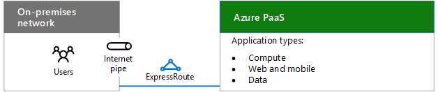
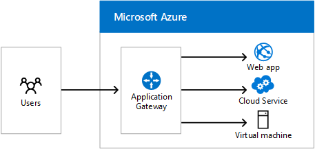
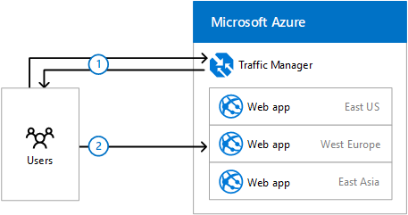

# Criação de rede para o Microsoft Azure PaaSDesigning networking for Microsoft Azure PaaS

 **Resumo:** Compreenda como otimizar sua rede para o acesso ao Microsoft Azure PaaS.**Summary:** Understand how to optimize your network for access to Microsoft Azure PaaS.
  
Otimizar a rede para os aplicativos PaaS do Azure exige uma largura de banda de Internet adequada e pode ainda exigir a distribuição de tráfego de rede em diversos sites ou aplicativos.Optimizing networking for Azure PaaS apps requires adequate Internet bandwidth and can require the distribution of network traffic across multiple sites or apps.
  
## Etapas de planejamento para hospedar aplicativos PaaS de organização no Windows AzurePlanning steps for hosting organization PaaS applications in Azure

1. Percorra a seção de **etapas para preparar sua rede para serviços de nuvem da Microsoft** em [elementos comuns da conectividade de nuvem da Microsoft](common-elements-of-microsoft-cloud-connectivity.md).Go through the **Steps to prepare your network for Microsoft cloud services** section in [Common elements of Microsoft cloud connectivity](common-elements-of-microsoft-cloud-connectivity.md).
    
2. Otimize sua largura de banda da Internet usando as etapas 2 a 4 da seção **etapas para preparar a sua rede de serviços Microsoft SaaS** em [projetar a rede para o Microsoft SaaS](designing-networking-for-microsoft-saas.md).Optimize your Internet bandwidth using steps 2 - 4 of the **Steps to prepare your network for Microsoft SaaS services** section in [Designing networking for Microsoft SaaS](designing-networking-for-microsoft-saas.md).
    
3. Determine se você precisa de uma conexão ExpressRoute no Azure.Determine whether you need an ExpressRoute connection to Azure.
    
4. Para cargas de trabalho baseados na web, determine se é necessário que o Gateway de aplicativo do Windows Azure.For web-based workloads, determine whether you need the Azure Application Gateway.
    
5. Para distribuição de tráfego para os pontos de extremidade diferentes em datacenters diferentes, determine se é necessário que o Gerenciador de tráfego do Azure.For distribution of traffic to different endpoints in different data centers, determine whether you need Azure Traffic Manager.
    
## Largura de banda de Internet para aplicativos de PaaS da organizaçãoInternet bandwidth for organization PaaS applications

Aplicativos de organização hospedados no Azure PaaS exigem largura de banda da Internet para os usuários da intranet. Há duas opções:Organization applications hosted in Azure PaaS require Internet bandwidth for intranet users. There are two options:
  
- **Opção 1:** Use seu pipe existente, otimizado para o tráfego da Internet com a capacidade de lidar com cargas de pico. Consulte[Projetando a rede para o Microsoft SaaS](designing-networking-for-microsoft-saas.md) para borda de Internet, uso do cliente e considerações de operações de IT.**Option 1:** Use your existing pipe, optimized for Internet traffic with the capacity to handle peak loads. See[Designing networking for Microsoft SaaS](designing-networking-for-microsoft-saas.md) for Internet edge, client usage, and IT operations considerations.
    
- **Opção 2:** Para alta largura de banda ou baixa latência necessidades, use uma conexão ExpressRoute no Azure.**Option 2:** For high-bandwidth or low latency needs, use an ExpressRoute connection to Azure.
    
**Figura 1: Opções de Conexão para conectar-se os serviços do Azure PaaS****Figure 1: Connection options for connecting the Azure PaaS services**

  
A Figura 1 mostra uma rede local conectando-se aos serviços do Azure PaaS através de uma conexão de Internet ou ExpressRoute.Figure 1 shows an on-premises network connecting to Azure PaaS services over an Internet pipe or ExpressRoute.
  
## Gateway de aplicativo do AzureAzure Application Gateway

Roteamento de nível de aplicativo e balanceamento de serviços que permitem que você construir um escalonável e altamente disponível web front-end no Windows Azure para aplicativos web, serviços em nuvem e máquinas virtuais.Application-level routing and load balancing services that let you build a scalable and highly-available web front end in Azure for web apps, cloud services, and virtual machines. 
  
**Figura 2: Gateway de aplicativo do Azure****Figure 2: Azure Application Gateway**

  
A Figura 2 mostra o Gateway de aplicativo do Windows Azure e como o usuário solicita da Internet pode ser roteada para os aplicativos web do Azure, serviços de nuvem ou máquinas virtuais.Figure 2 shows the Azure Application Gateway and how user requests from the Internet can be routed to Azure web apps, cloud services, or virtual machines.
  
Application Gateway suporta atualmente o fornecimento de 7 de aplicativos de camada para o seguinte:Application Gateway currently supports layer 7 application delivery for the following:
  
- Balanceamento de carga HTTPHTTP load balancing
    
- Afinidade baseada em cookie de sessãoCookie-based session affinity
    
- Descarregamento SSLSSL offload
    
Para obter mais informações, consulte [Application Gateway](https://docs.microsoft.com/azure/application-gateway/application-gateway-introduction).For more information, see [Application Gateway](https://docs.microsoft.com/azure/application-gateway/application-gateway-introduction).
  
## Gerenciador de tráfego do AzureAzure Traffic Manager

Distribuição de tráfego para os pontos de extremidade diferentes, que podem incluir serviços em nuvem ou aplicativos web Azure localizados em datacenters diferentes ou pontos de extremidade externos.Distribution of traffic to different endpoints, which can include cloud services or Azure web apps located in different data centers or external endpoints.
  
Gerenciador de tráfego usa os seguintes métodos de roteamento:Traffic Manager uses the following routing methods:
  
- **Failover:** Os pontos de extremidade estão em data centers Azure o mesmo ou diferente e você deseja usar um ponto de extremidade principal para todo o tráfego, mas fornecer backups em caso do principal ou os pontos de extremidade de backup não estão disponíveis.**Failover:** The endpoints are in the same or different Azure datacenters and you want to use a primary endpoint for all traffic, but provide backups in case the primary or the backup endpoints are unavailable.
    
- **Rodízio:** Você deseja distribuir a carga em um conjunto de pontos de extremidade no mesmo datacenter ou em datacenters diferentes.**Round robin:** You want to distribute load across a set of endpoints in the same datacenter or across different datacenters.
    
- **Desempenho:** Você tem pontos de extremidade em diferentes locais geográficos e quiser que o solicitante aos clientes utilizarem o ponto de extremidade "mais próximo" em termos a mais baixa latência.**Performance:** You have endpoints in different geographic locations and you want requesting clients to use the "closest" endpoint in terms of the lowest latency.
    
Aqui está um exemplo para três aplicativos da web distribuídos geograficamente.Here is an example for three geographically-distributed web apps.
  
**Figura 3: Gerenciador de tráfego do Azure****Figure 3: Azure Traffic Manager**

  
A Figura 3 mostra o processo básico que o Gerenciador de tráfego usa para rotear solicitações para três aplicativos web Azure diferente nos Estados Unidos, Europa e Ásia. No exemplo:Figure 3 shows the basic process that Traffic Manager uses to route requests to three different Azure web apps in United States, Europe, and Asia. In the example:
  
1. Uma consulta DNS do usuário para um site da web que URL obtém direcionados para Azure Gerenciador de tráfego, que retorna o nome de um aplicativo web regionais, com base no método de roteamento de desempenho.A user DNS query for a web site URL gets directed to Azure Traffic Manager, which returns the name of a regional web app, based on the performance routing method.
    
2. O usuário inicia o tráfego com o aplicativo web regionais na Europa.The user initiates traffic with the regional web app in Europe.
    
Para obter mais informações, consulte [Gerenciador de tráfego](https://docs.microsoft.com/azure/traffic-manager/traffic-manager-overview).For more information, see [Traffic Manager](https://docs.microsoft.com/azure/traffic-manager/traffic-manager-overview).

## Próxima etapaNext step

[Criação de rede para o Microsoft Azure IaaSDesigning networking for Microsoft Azure IaaS](designing-networking-for-microsoft-azure-iaas.md)
 
## Confira tambémSee also

[Rede do Microsoft Cloud para Arquitetos CorporativosMicrosoft Cloud Networking for Enterprise Architects](microsoft-cloud-networking-for-enterprise-architects.md)
  
[Recursos de arquitetura de TI do Microsoft CloudMicrosoft Cloud IT architecture resources](microsoft-cloud-it-architecture-resources.md)

