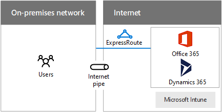

# Projetando a rede para o Microsoft SaaS

 **Resumo:** Compreenda como otimizar sua rede para o acesso aos serviços de SaaS da Microsoft, incluindo o Office 365 e Microsoft Intune Dynamics 365.
  
Otimizar sua rede para os serviços SaaS da Microsoft requer uma análise cuidadosa da borda de Internet, dos dispositivos do cliente e das operações típicas de TI.
  
## Etapas para preparar sua rede para serviços SaaS da Microsoft

Siga estas etapas para otimizar a sua rede de serviços SaaS da Microsoft:
  
1. Percorra a seção de **etapas para preparar sua rede para serviços de nuvem da Microsoft** em [elementos comuns da conectividade de nuvem da Microsoft](common-elements-of-microsoft-cloud-connectivity.md).
    
2. Otimize sua saída da Internet para os serviços do Microsoft SaaS usando as recomendações do servidor proxy.
    
3. Otimize sua taxa de transferência da Internet usando as recomendações de proximidade e local.
    
4. Otimize o desempenho de seus computadores clientes e intranet em que eles estão localizados usando as considerações de uso do cliente.
    
5. Conforme necessário, otimize o desempenho de sincronização usando as considerações de operações de IT e migrações de dados.
    
## Considerações sobre a borda da Internet

Aqui estão algumas coisas a considerar otimizam sua borda da Internet e a taxa de transferência aos serviços do Microsoft SaaS.
  
**Figura 1: Opções de Conexão para serviços SaaS da Microsoft**

  
A Figura 1 mostra uma rede local conectando-se aos serviços do Microsoft SaaS através de um pipe de Internet ou ExpressRoute.
  
Aqui estão algumas recomendações para otimizar o seu servidor proxy:
  
- Configurar clientes web usando WPAD, PAC ou GPO
    
- Não use a interceptação de SSL
    
- Usar um arquivo PAC para ignorar o proxy para nomes DNS do serviço Microsoft SaaS
    
- Permitir o tráfego de verificação de CRL/OCSP
    
Aqui estão alguns afunilamentos de servidor proxy para verificar:
  
- Conexões persistentes insuficientes (Outlook)
    
- Capacidade suficiente
    
- Fazendo a avaliação de fora da rede
    
- Exigir autenticação
    
- Não há suporte para o tráfego UDP (Skype para negócios)
    
Aqui estão algumas recomendações de proximidade e local:
  
- Não rotear o tráfego da Internet pela WAN privada
    
- Usar o fluxo de tráfego DNS e a Internet na região para usuários de fora da região
    
- Use ExpressRoute para alta largura de banda para o Office 365 e conectividade simultânea com os serviços do Azure
    
Aqui estão as portas de saída necessárias para o tráfego do Office 365:
  
- TCP 80 (para verificações CRL/OCSP)
    
- TCP 443
    
- UDP 3478
    
- TCP 5223
    
- TCP 50000-59999
    
- UDP 50000-59999
    
## Considerações de uso do cliente

Primeiro, configure o conjunto de serviços que os clientes usarão, tais como:
  
- Azure Active Directory
    
- Office 365
    
  - Aplicativos de cliente do Office
    
  - SharePoint Online
    
  - Exchange Online
    
  - Skype for Business
    
- Microsoft Intune
    
- Dynamics 365
    
Para os computadores cliente, determine o seguinte:
  
- Número máximo de cada vez (hora do dia, sazonais, picos e os vales em uso)
    
- Largura de banda total necessária para picos
    
- Latência para o dispositivo de saída de Internet
    
- País de origem versus país de localização conjunta do datacenter
    
Para cada tipo de cliente (PC, smartphone, tablet), verifique se o atual:
  
- Sistema operacional
    
- Navegador da Internet
    
- Pilha TCP/IP
    
- Hardware de rede
    
- Drivers de sistema operacional para o hardware de rede
    
- Atualizações e patches estão instalados
    
Além disso, otimizar a taxa de transferência de conexão de intranet (com fio, sem fio ou VPN).
  
Para obter mais informações, consulte [suporte a NAT com o Office 365](https://support.office.com/article/NAT-support-with-Office-365-170e96ea-d65d-4e51-acac-1de56abe39b9).
  
Para obter as recomendações mais recentes para usar ExpressRoute com o Office 365, consulte [ExpressRoute para o Office 365](https://support.office.com/article/Azure-ExpressRoute-for-Office-365-6d2534a2-c19c-4a99-be5e-33a0cee5d3bd).
  
Para otimizar o desempenho da sua intranet, faça o seguinte:
  
- Usar ferramentas para medir viagem de ida e tempo (RTTs) para seus dispositivos de borda da Internet (PsPing, Ping, Tracert, TraceTCP, Monitor de rede)
    
- Executar a análise de caminho de saída usando os protocolos de fluxo
    
- Executar a análise de dispositivos intermediários (idade, integridade, etc.)
    
Para obter mais informações, consulte a [ferramenta PsPing](https://technet.microsoft.com/sysinternals/jj729731.aspx).
  
## Considerações de operações de IT

Aqui estão algumas coisas a considerar quando operando uma carga de trabalho de TI em um serviço do Microsoft SaaS.
  
### Migrações de ocorrência únicas

Exemplos de migrações ocasionais são a transferência de dados em massa para aplicativos baseados em nuvem ou armazenamento de arquivamento.
  
Para otimizar sua rede para migrações em tempo:
  
- Evite pico de uso de rede e tempos de aplicação de patch do computador
    
- Deve ser a linha e testados, avaliar a integridade de rede e resolver problemas antes de tentar migração real
    
- Execute o post-mortem para migrações futuras
    
### Sincronizações em andamento

Exemplos de sincronizações em andamento são informações de diretório, configurações ou arquivos.
  
Para otimizar sua rede para sincronizações em andamento:
  
- Certifique-se de que um sistema de monitoramento de largura de banda está no lugar, resolver ou descartar erros coletados
    
- Use monitoramento resultados de largura de banda para determinar a necessidade de alterações na rede (up/dimensionamento, circuitos novos ou adicionar dispositivos)
    
Para obter mais informações, consulte:
  
- [Rede e planejamento de migração para o Office 365](https://aka.ms/tune)
    
- [Curso de gerenciamento de desempenho Microsoft Academy Virtual do Office 365](https://aka.ms/o365perf)
    
- [ExpressRoute para o Office 365](https://aka.ms/expressrouteoffice365)
    
## Veja também

[Microsoft Cloud Networking para arquitetos corporativos](microsoft-cloud-networking-for-enterprise-architects.md)
  
[Recursos de arquitetura de TI do Microsoft](microsoft-cloud-it-architecture-resources.md)

[Roteiro do Enterprise Cloud da Microsoft: recursos para responsáveis pelas decisões de TI](https://sway.com/FJ2xsyWtkJc2taRD)

