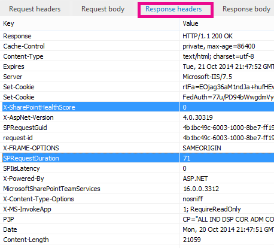

# Diagnosticando problemas de desempenho no SharePoint OnlineDiagnosing performance issues with SharePoint Online

Este artigo mostra como você pode diagnosticar problemas comuns com o seu site do SharePoint Online usando as ferramentas de desenvolvedor do Internet Explorer.This article shows you how you can diagnose common issues with your SharePoint Online site using Internet Explorer developer tools.
  
Há três maneiras diferentes de identificar que uma página em um site do SharePoint Online tem um problema de desempenho com as personalizações.There are three different ways that you can identify that a page on a SharePoint Online site has a performance problem with the customizations.
  
- O monitor de rede da barra de ferramentas F12The F12 tool bar network monitor
    
- Comparação com uma linha de base não personalizadaComparison to a non-customized baseline
    
- Métricas de cabeçalho de resposta do SharePoint OnlineSharePoint Online response header metrics
    
Este tópico descreve como usar cada um desses métodos para diagnosticar problemas de desempenho. Depois que você calculou a causa do problema, você pode trabalhar em direção de uma solução usando os artigos sobre como melhorar o desempenho do SharePoint que podem ser encontradas em http://aka.ms/tune.This topic describes how to use each of these methods to diagnose performance issues. Once you've figured out the cause of the problem, you can work toward a solution using the articles about improving SharePoint performance that you can find on http://aka.ms/tune.
  
## Usando a barra de ferramentas F12 para diagnosticar o desempenho no SharePoint OnlineUsing the F12 tool bar to diagnose performance in SharePoint Online

Neste artigo, usamos o Internet Explorer 11. As versões das ferramentas de desenvolvedor F12 em outros navegadores possuem recursos semelhantes, embora possam parecer um pouco diferentes. Para saber mais sobre as ferramentas de desenvolvedor F12, consulte:In this article we use Internet Explorer 11. Versions of the F12 developer tools on other browsers have similar features though they may look slightly different. For information on the F12 developer tools, see:
  
- [O que há de novo nas ferramentas F12What's new in F12 Tools](https://go.microsoft.com/fwlink/p/?LinkId=522545)
    
- [Usando as ferramentas de desenvolvedor F12Using the F12 developer tools](https://go.microsoft.com/fwlink/p/?LinkId=522546)
    
Para exibir as ferramentas de desenvolvedor, pressione **F12** e, em seguida, clique no ícone de Wi-Fi: 
To bring up the developer tools press **F12** and then click the Wi-Fi icon: 
  

  
Na guia **Rede**, pressione o botão Reproduzir verde para carregar uma página. A ferramenta retorna todos os arquivos que o navegador solicita para obter a página que você requisitou. A captura de tela a seguir mostra uma dessas listas.On the **Network** tab, press the green play button to load a page. The tool returns all of the files that the browser requests in order to get the page you asked for. The following screen shot shows one such list. 
  

  
Você também pode ver os tempos de download de arquivos no lado direito, como mostra a captura de tela.You can also see the download times of the files on the right side as shown in this screen shot.
  

  
Isso oferece uma representação visual de quanto tempo o arquivo levou para ser carregado. A linha verde representa quando a página está pronta para ser processada pelo navegador. Isso pode fornecer uma visualização rápida dos diferentes arquivos que podem estar causando carregamentos de página lentos no seu site.

This gives you a visual representation of how long the file took to load. The green line represents when the page is ready to be rendered by the browser. This can give you a quick view of the different files that might be causing slow page loads on your site.
  
## Configurando uma linha de base não personalizada para o SharePoint OnlineSetting up a non-customized baseline for SharePoint Online

Configurar um conjunto de sites de completamente-de-imediata no SharePoint Online é a melhor maneira de determinar os pontos fracos do desempenho do seu site. Dessa forma você pode comparar todos os vários aspectos do seu site com obtido sem personalização na página. O OneDrive for Business home page é um bom exemplo de um conjunto de sites separado é improvável que tenha todas as personalizações.The best way to determine your site's performance weak points is to set up a completely out-of-the-box site collection in SharePoint Online. This way you can compare all the various aspects of your site with what you would get with no customization on the page. The OneDrive for Business home page is a good example of a separate site collection that is unlikely to have any customizations.
  
## Exibindo informações de cabeçalho de resposta do SharePointViewing SharePoint response header information

No SharePoint Online e no SharePoint Server 2013, é possível acessar as informações enviadas ao navegador no cabeçalho de resposta de cada arquivo. Os dois valores mais úteis para diagnosticar problemas de desempenho são SPRequestDuration e X-SharePointHealthScore:In SharePoint Online and SharePoint Server 2013 you can access the information that is sent back to the browser in the response header for each file. The two most useful values for diagnosing performance issues are SPRequestDuration and X-SharePointHealthScore:
  
- **SPRequestDuration****SPRequestDuration**
    
    Esse é o período de tempo que a solicitação demorou para ser processada no servidor. Isso pode ajudar a determinar se a solicitação é muito pesada e se faz uso intensivo de recursos. É a sua melhor percepção sobre a quantidade de trabalho que o servidor tem para atender a página.This is the amount of time that the request took on the server to be processed. This can help determine if the request is very heavy and resource intensive. This is the best insight you have into how much work the server is doing to serve the page.
    
- **X-SharePointHealthScore****X-SharePointHealthScore**
    
    Isso indica que a utilização do servidor, ou CPU, no qual sua instância do SharePoint é executado. Este intervalos de números de 0 a 10, onde 0 indica que o servidor está ocioso e 10 indica que o servidor está muito ocupado. Uma pontuação de integridade é consistentemente 9 ou 10 pode indicar um problema de desempenho em andamento com o servidor. Qualquer outro número indica que o servidor está funcionando no intervalo esperado.This indicates the utilization of the server, or CPU, on which your SharePoint instance runs. This number ranges from 0 to 10 where 0 indicates the server is idle and 10 indicates the server is very busy. A HealthScore that is consistently 9 or 10 might indicate an ongoing performance issue with the server. Any other number indicates that server is operating within the expected range.
    
 **Para exibir informações de cabeçalho de resposta do SharePoint****To view SharePoint response header information**
  
1. Certifique-se de que você tenha as ferramentas F12 instaladas. Para obter mais informações sobre como baixar e instalar essas ferramentas, consulte [o que há de novo nas ferramentas de F12](https://go.microsoft.com/fwlink/p/?LinkId=522545).Ensure that you have the F12 tools installed. For more information on downloading and installing these tools, see [What's new in F12 tools](https://go.microsoft.com/fwlink/p/?LinkId=522545).
    
2. Em ferramentas F12, na guia **Rede**, pressione o botão Reproduzir verde para carregar uma página.In the F12 tools, on the **Network** tab, press the green play button to load a page. 
    
3. Clique em um dos arquivos .aspx retornados pela ferramenta e, em seguida, clique em **DETALHES**.Click one of the .aspx files returned by the tool and then click **DETAILS**. 
    
    
  
4. Clique em **Cabeçalhos de resposta**.Click **Response headers**. 
    
    
  
## O que está causando problemas de desempenho no SharePoint Online?What's causing performance issues in SharePoint Online?

O artigo [Opções de navegação para o SharePoint Online](navigation-options-for-sharepoint-online.md) mostra um exemplo de usando o valor de SPRequestDuration para determinar a navegação estrutural complicada estava fazendo com que a página para levar muito tempo para processar no servidor. De acordo com um valor para um site de linha de base (sem personalização), é possível determinar se qualquer tipo de arquivo está demorando muito tempo para carregar. O exemplo usado em [Opções de navegação para o SharePoint Online](navigation-options-for-sharepoint-online.md) é o arquivo. aspx principal. Esse arquivo contém a maioria do código ASP.NET que executa sua carga de página. Dependendo do modelo de site que você use, isso poderia ser start.aspx, aspx, default. aspx ou outro nome se você personalizar a home page. Se esse número for consideravelmente maior do que o seu site de linha de base, é uma boa indicação de que há algo complexo acontecendo na sua página que está causando problemas de desempenho.The article [Navigation options for SharePoint Online](navigation-options-for-sharepoint-online.md) shows an example of using the SPRequestDuration value to determine that the complicated structural navigation was causing the page to take a long time to process on the server. By taking a value for a baseline site (without customization), it is possible to determine if any given file is taking a long time to load. The example used in [Navigation options for SharePoint Online](navigation-options-for-sharepoint-online.md) is the main .aspx file. That file contains most of the ASP.NET code that runs for your page load. Depending on the site template you use, this could be start.aspx, home.aspx, default.aspx, or another name if you customize the home page. If this number is considerably higher than your baseline site, then it's a good indication that there is something complex going on in your page that is causing performance issues. 
  
Depois de ter identificado que é um problema específico do seu site, a maneira recomendada para descobrir o que está causando o baixo desempenho é eliminar todas as possíveis causas, como personalizações de página, e adicioná-las uma por uma novamente ao local. Depois de remover personalizações suficientes e a página apresentar bom desempenho, você pode então adicionar personalizações específicas uma por uma novamente.Once you have identified that an issue specific to your site, the recommended way to figure out what is causing poor performance is to eliminate all of the possible causes, like page customizations, and then add them back to the site one by one. Once you have removed enough customizations that the page is performing well, you can then add back specific customizations one by one.
  
Por exemplo, se você tiver uma navegação muito complexa tente alterar a navegação para não mostrar subsites e verifique as ferramentas de desenvolvedor para ver se isso faz diferença. Ou se você tiver uma grande quantidade de conteúdos acumulados, tente removê-los da página e veja se isso melhora as coisas. Ao eliminar todas as possíveis causas e adicioná-las uma por uma novamente, você pode identificar facilmente quais recursos são o maior problema e procurar uma solução. 
For example, if you have a very complex navigation try changing the navigation to not show sub-sites then check the developer tools to see if this makes a difference. Or if you have a large amount of content roll-ups try removing them from your page and see if this improves things. If you eliminate all of the possible causes and add them back in one at a time, you can easily identify which features are the biggest problem and then work towards a solution.
  

