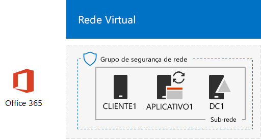
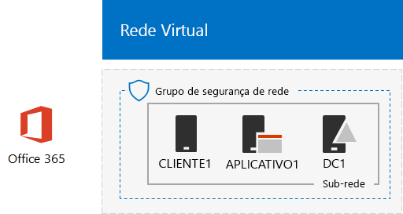

# <a name="directory-synchronization-for-your-office-365-devtest-environment"></a>Sincronização de diretórios para o seu ambiente de desenvolvimento e teste do Office 365

 **Resumo:** Configure a sincronização de diretório para o seu ambiente de desenvolvimento e teste do Office 365.
  
Muitas organizações uso Connect do Azure AD e sincronização de diretórios para sincronizar o conjunto de contas em sua floresta do Windows Server Active Directory (AD) de local para o conjunto de contas no Office 365. Este artigo descreve como você pode adicionar sincronização de diretórios com a sincronização de hash de senha para o ambiente de desenvolvimento e teste do Office 365, resultando na configuração a seguir.
  

  
Esta configuração consiste em: 
  
- Um Office 365 E5 avaliação assinatura, que expira 30 dias a partir de quando você criá-lo.
- Uma intranet da organização simplificado conectado à Internet, consistindo em três máquinas virtuais em uma sub-rede de uma rede virtual do Azure (DC1, APP1 e CLIENT1). Conectar do Azure AD executa no APP1 para sincronizar o domínio do Windows Server AD para o Office 365.
    
Há duas fases para configurar esse ambiente de desenvolvimento e teste:
  
1. Crie o ambiente de desenvolvimento e teste do Office 365 (os DC1, APP1 e CLIENT1 máquinas virtuais em uma rede virtual do Azure com uma assinatura de avaliação do Office 365 E5).
2. Instalar e configurar o Azure Connect do AD no APP1.
    
> [!TIP]
> Clique [aqui](http://aka.ms/catlgstack) para ver um mapa visual para todos os artigos da pilha do Guia do Laboratório de Teste do One Microsoft Cloud.
  
## <a name="phase-1-create-an-office-365-devtest-environment"></a>Fase 1: Criar um ambiente de desenvolvimento e teste do Office 365

Siga as instruções em fases 1, 2 e 3 do artigo [ambiente de desenvolvimento e teste do Office 365](office-365-dev-test-environment.md) . Aqui está a configuração resultante.
  

  
Esta configuração consiste em: 
  
- Uma assinatura de avaliação do E5 do Office 365.
- Uma intranet da organização simplificado conectado à Internet, consistindo das máquinas virtuais DC1, APP1 e CLIENT1 em uma sub-rede de uma rede virtual do Azure.
    
## <a name="phase-2-install-azure-ad-connect-on-app1"></a>Fase 2: Instalar o Azure AD conectar no APP1

Depois de instalado e configurado, Connect do Azure AD sincroniza o conjunto de contas no domínio CORP Windows Server AD com o conjunto de contas em sua assinatura de avaliação do Office 365. O procedimento a seguir orienta você na instalação Connect do Azure AD no APP1 e verificando se ela funciona.
  
### <a name="install-and-configure-azure-ad-connect-on-app1"></a>Instalar e configurar o Azure Connect do AD no APP1

1. No [portal do Azure](https://portal.azure.com), conecte-se App1 com CORP\\conta User1.
    
2. No APP1, abra um prompt de comando do Windows PowerShell de nível de administrador e, em seguida, execute estes comandos:
    
  ```
  Set-ItemProperty -Path "HKLM:\\SOFTWARE\\Microsoft\\Active Setup\\Installed Components\\{A509B1A7-37EF-4b3f-8CFC-4F3A74704073}" -Name "IsInstalled" -Value 0
Set-ItemProperty -Path "HKLM:\\SOFTWARE\\Microsoft\\Active Setup\\Installed Components\\{A509B1A8-37EF-4b3f-8CFC-4F3A74704073}" -Name "IsInstalled" -Value 0
Stop-Process -Name Explorer -Force

  ```

3. Na barra de tarefas, clique em **Internet Explorer** e vá para [https://aka.ms/aadconnect](https://aka.ms/aadconnect).
    
4. Na página Microsoft Azure Active Directory Connect, clique em **Download**e, em seguida, clique em **Executar**.
    
5. Na página **Bem-vindo ao conectar do Azure AD** , clique em **Concordo**e clique em **continuar**.
    
6. Na página **Configurações Express** , clique em **usar configurações express**.
    
7. Na página **conectar ao AD do Windows Azure** , digite o nome da sua conta de administrador global no tipo de **nome de usuário,** sua senha na **senha**e clique em **Avançar**.
    
8. Na página **conectar ao AD DS** , digite **CORP\\User1** em **nome de usuário,** digite sua senha em **senha**e clique em **Avançar**.
    
9. Na página **configuração de entrada do Azure AD** , clique em **continuar sem qualquer domínio verificado**e, em seguida, clique em **Avançar**.
    
10. Na página **pronto para configurar** , clique em **instalar**.
    
11. Na página **configuração concluída** , clique em **Sair**.
    
12. No Internet Explorer, vá para o portal do Office 365 ([https://portal.office.com](https://portal.office.com)) e se conectar à sua assinatura de avaliação do Office 365 com sua conta de administrador global.
    
13. Na página principal do portal, clique em **Admin**.
    
14. Na navegação à esquerda, clique em **Usuários > Usuários ativos**.
    
    Observe a conta denominada **User1**. Esta conta é do domínio CORP Windows Server AD e à prova de que a sincronização de diretórios tem funcionado.
    
15. Clique na conta **User1** . Para licenças de produto, clique em **Editar**.
    
16. Em **licenças do produto**, selecione seu país e clique em controle **desativado** para **Office 365 Enterprise E5** (alternando para **ativado**). Clique em **Salvar** na parte inferior da página e, em seguida, clique em **Fechar**.
    
Essa é a configuração resultante.
  

  
Esta configuração consiste em: 
  
- Uma assinatura de avaliação do E5 do Office 365.
- Uma intranet da organização simplificado conectado à Internet, consistindo das máquinas virtuais DC1, APP1 e CLIENT1 em uma sub-rede de uma rede virtual do Azure. Conectar do Azure AD executa no APP1 para sincronizar o domínio CORP Windows Server AD para o Office 365 a cada 30 minutos.
    
## <a name="next-step"></a>Próxima etapa

Quando estiver pronto para implantar a sincronização de diretórios para a sua organização, consulte [implantar o Office 365 directory synchronization in Microsoft Azure](deploy-office-365-directory-synchronization-dirsync-in-microsoft-azure.md).

## <a name="see-also"></a>Confira também

[Nuvem adoção Test Lab Guides (TLGs)](cloud-adoption-test-lab-guides-tlgs.md)
[ambiente de desenvolvimento e teste de configuração básica](base-configuration-dev-test-environment.md)
[o ambiente de desenvolvimento e teste do Office 365](office-365-dev-test-environment.md)
[Segurança de aplicativo de nuvem para seu ambiente de desenvolvimento e teste do Office 365](cloud-app-security-for-your-office-365-dev-test-environment.md) 
 [ Proteção de ameaça avançada para seu ambiente de desenvolvimento e teste do Office 365](advanced-threat-protection-for-your-office-365-dev-test-environment.md)
[adoção da nuvem e soluções híbridas](cloud-adoption-and-hybrid-solutions.md)


