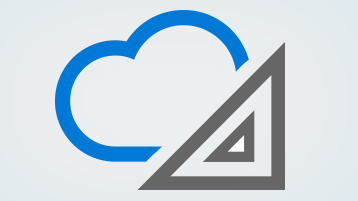

# Organizações corporativas e o Office 365

Como uma organização maior com profissionais de ti no pessoal, você tem requisitos e padrões específicos para manter seu ambiente. Veja aqui as informações necessárias para planejar e gerenciar o Office 365 para sua empresa.
  

> [!VIDEO https://www.microsoft.com/videoplayer/embed/d08b637c-66dc-4f0e-afc2-56da92e99589?autoplay=false]
  
## Recursos principais

  
 **Obter assistência do FastTrack**
  
Planejar, configurar e migrar dados para o Office 365 com a ajuda do FastTrack.
  
[Obter no FastTrack](https://go.microsoft.com/fwlink/?linkid=238431)
  

  
 **Conformidade &amp; de segurança**
  
Proteger seus dados e cumprir padrões legais ou normativos.
  
[Visão geral da &amp; conformidade de segurança no Office 365](https://support.office.com/article/dcb83b2c-ac66-4ced-925d-50eb9698a0b2)
  

  
 **Entender a arquitetura da nuvem**
  
Explore os pôsteres de arquitetura sobre a nuvem empresarial.
  
[Obter cartazes](https://aka.ms/cloudarch)
  

  
 **Saiba mais sobre ataques comuns**
  
Saiba como a Microsoft pode ajudar a proteger sua organização.
  
[Baixar o cartaz](https://aka.ms/commonattacks)
  
## Treinamento para profissionais de ti

  
 **Treinamento para profissionais de ti**
  
Descubra cursos de vídeo gratuitos trazidos para você pelo LinkedIn Learning.
  
[Treinamento avançado](https://support.office.com/article/68cc9b95-0bdc-491e-a81f-ee70b3ec63c5.aspx)
  

  
 **Microsoft Learning**
  
Treinamento e certificação do Office 365 para profissionais de ti.
  
[Treinamento popular](https://go.microsoft.com/fwlink/?linkid=826247)
  

  
 **Virtual Academy**
  
Aprenda com os especialistas da Microsoft Virtual Academy.
  
[Procurar cursos](https://go.microsoft.com/fwlink/?linkid=826248)
  

  
 **Universidade edX**
  
Experiências de aprendizado online individualizadas para profissionais de ti do Office 365.
  
[Registrar agora](https://go.microsoft.com/fwlink/?linkid=852994)
  
## Artigos em destaque

[Contatar o suporte para produtos empresariais – Ajuda para Administradores](https://support.office.com/article/32a17ca7-6fa0-4870-8a8d-e25ba4ccfd4b)
  
[Implantar o novo cliente de sincronização do OneDrive para Windows](https://support.office.com/article/3f3a511c-30c6-404a-98bf-76f95c519668)
  
[Formas de migrar várias contas de email para o Office 365](https://support.office.com/article/0a4913fe-60fb-498f-9155-a86516418842)
  
[Atualizar de servidores e clientes do Office 2010](upgrade-from-office-2010-servers-and-products.md)
  
[Supervisores de implantação para serviços do Office 365](deployment-advisors-for-office-365.md)
  
 **Treinamento para usuários finais**
  
[Treinamento de produtividade do Office 365](https://support.office.com/article/af07cb6b-980d-4f33-8599-322582767408)
  
[Vídeo: o que é o Office 365?](https://support.office.com/article/847caf12-2589-452c-8aca-1c009797678b)
  
 **Recursos de desenvolvimento**
  
[Centro de Desenvolvedores do Office](https://go.microsoft.com/fwlink/?linkid=615418)
  

