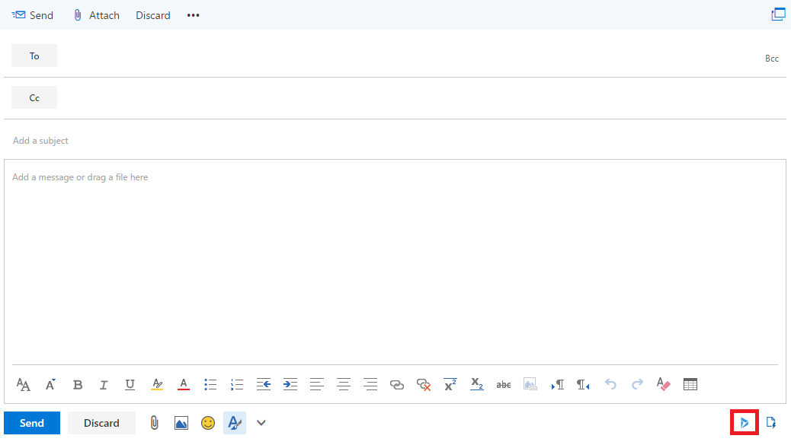
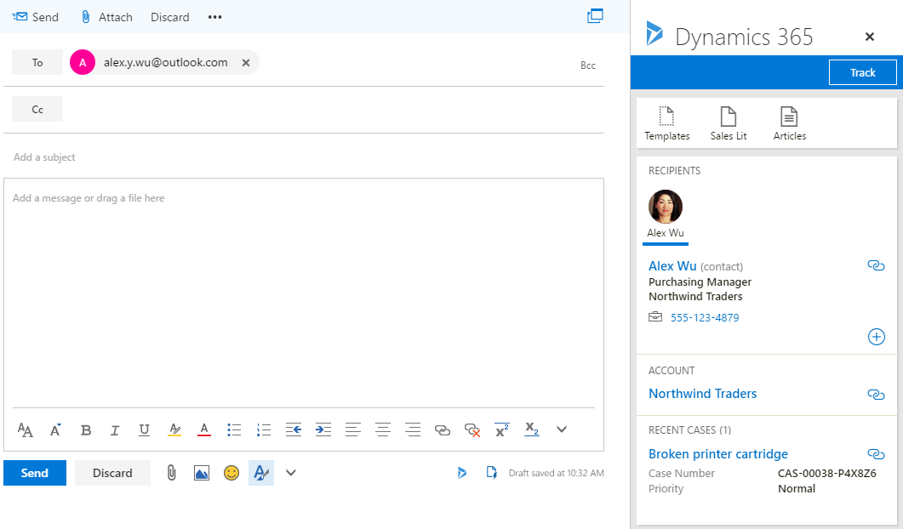

# Integração do Exchange Online para seu ambiente de desenvolvimento e teste do Office 365 e Dynamics 365

 **Resumo:** Use este guia de laboratório de teste para habilitar a integração de Dynamics 365 para Exchange Online em sua assinatura de avaliação do Office 365.
  
Um uso valioso do Microsoft Dynamics 365 é armazenar todas as comunicações de cliente em um único local, para que qualquer pessoa com as permissões apropriadas pode ver todos os registros do cliente relevante. Por exemplo, exiba todos os emails associados a um determinado contato, conta, oportunidade ou caso.
  
Para armazenar o email e outros registros de mensagens no Dynamics 365, você precisa sincronizar seu sistema de email com Dynamics 365. Sincronização do servidor é o método de escolha para sincronização de email.
  
Use este guia de laboratório de teste para configurar e demonstrar como Exchange Online e o cliente Outlook Online podem aproveitar as informações armazenadas no Dynamics 365. 
  
## Fase 1: Criar o ambiente de desenvolvimento e teste do Office 365 e Dynamics 365

Use as instruções no [Office 365 e o ambiente de desenvolvimento e teste do Dynamics 365](office-365-and-dynamics-365-dev-test-environment.md) para criar uma versão de empresa leve ou simulado de um ambiente de desenvolvimento e teste do Office 365 e Dynamics 365.
  
> [!NOTE]
> A configuração neste artigo não requer que o ambiente de desenvolvimento e teste de simulado empresarial, que inclui uma intranet simulada conectada à Internet e a sincronização de diretório para uma floresta do Windows Server AD (Active Directory). Ele é fornecido aqui como uma opção para que você pode experimentar com o Office 365 e Dynamics 365 em um ambiente que representa uma organização típica 
  
## Fase 2: Configurar e demonstrar a integração do Dynamics 365 no Exchange Online

Use estas etapas para configurar a caixa de correio do administrador global para a integração do Dynamics 365 e o Exchange Online:
  
1. Usando uma sessão particular do seu navegador, vá para [http://portal.office.com](http://portal.office.com) e entrar usando sua conta de administrador global do Office 365.
    
2. Na página **Inicial do Microsoft Office** , clique no lado do **email** .
    
3. Na guia **email** nova no seu navegador, clique em **novo** e observe como o canto inferior do painel abaixo da caixa para digitar uma mensagem contém um ícone para Meus modelos.
    
     
  
4. Clique em **Descartar** e deixe a guia **email** aberto.
    
5. Clique na guia **Página inicial do Microsoft Office** no seu navegador e, em seguida, clique no lado de **Administração** .
    
6. No painel de navegação à esquerda da guia **Centro de administração do Office** , clique em **centrais de Admin > Dynamics 365**.
    
7. Na guia **Dynamics 365** nova em seu navegador, na lista de instâncias de Dynamics 365, clique em **Abrir**.
    
8. Na guia **Administração** nova em seu navegador, na barra de navegação, clique na seta ao lado de **configurações**e clique em **Configuração de Email** em **sistema**.
    
9.  Na página **Configuração de Email** , clique em **Definições de configuração de Email**.
    
10. Na guia **Email** na caixa de diálogo **Configurações do sistema** , altere **compromissos, contatos e tarefas** para **Sincronização do lado do servidor**e clique em **Okey**.
    
11. Na página **Configuração de Email** , clique em **caixas de correio**.
    
12. Selecione o nome de administrador global do Office 365 na coluna a marca de seleção à esquerda, clique em **Aplicar configurações de Email padrão** , na barra de ferramentas e clique em **Okey**.
    
13. Clique em **Aprovar Email** na barra de ferramentas e clique em **Okey**.
    
14. Selecione o nome de administrador global do Office 365 na coluna a marca de seleção à esquerda, clique em **teste &amp; habilitar caixas de correio** na ferramenta de barra e, em seguida, clique em **Okey**.
    
15. Clique na guia open **Mail** e confirme que o administrador global recebeu uma mensagem de teste.
    
16. Volte à guia **Caixas de correio meu ativa as caixas de correio** no seu navegador e atualize a página. As colunas de **Status de Email de entrada** e o **Status de Email de saída** devem ser definidas com **sucesso** para o nome da conta de administrador global. Observe que pode demorar até 15 minutos para concluir os dois testes.
    
Use estas etapas para instalar o aplicativo do Dynamics 365 para o Outlook e demonstrar os recursos do Dynamics 365 dentro da caixa de correio do administrador global:
  
1. Na guia **Caixas de correio meu ativa as caixas de correio** no seu navegador, clique na seta ao lado de **configurações**e clique em **Aplicativo do Dynamics 365 para o Outlook** em **sistema**.
    
2. Na página **Introdução ao Microsoft Dynamics 365 App para o Outlook** , clique no nome do administrador global e, em seguida, clique em **Adicionar aplicativo para Outlook**. A coluna **Status** muda para **pendente**.
    
3. Atualize a página até que o status muda para **foram adicionados ao Outlook**. Observe que pode demorar até 15 minutos para completar esta configuração.
    
4. Clique na guia **email** no seu navegador e fechá-lo.
    
5. Clique na guia **Página inicial do Microsoft Office** no seu navegador e, em seguida, clique no lado de **email** .
    
6. Na guia **email** nova no seu navegador, clique em **novo**. Observe que o canto inferior do painel abaixo da caixa para digitar uma mensagem agora contém um ícone para Dynamics 365.
    
     
  
7. Clique no ícone do Dynamics 365. Você verá um painel **Dynamics 365** , do qual você pode controlar esse modelos de email ou de acesso, especificações ou artigos.
    
8. No campo **para** da mensagem de email, digite **alex.y.wu@outlook.com**e, em seguida, clique em **Repetir** no painel **Dynamics 365** . Você deverá ver uma seção de **destinatários** no painel **Dynamics 365** com informações sobre Alex Wu, um contato do aplicativo de venda que foi fornecido com os dados de amostra para sua assinatura de avaliação.
    
     
  
9. Clique em **Descartar**.

> [!TIP]
> Clique [aqui](http://aka.ms/catlgstack) para obter um mapa visual para todos os artigos na pilha de um Microsoft Cloud Test Lab Guide.
    
## Veja também

[Office 365 e o ambiente de desenvolvimento e teste do Dynamics 365](office-365-and-dynamics-365-dev-test-environment.md)
  
[Guias do Laboratório de Teste (TLGs) para adoção de nuvem](cloud-adoption-test-lab-guides-tlgs.md)
  
[Ambiente de desenvolvimento e teste de configuração de base](base-configuration-dev-test-environment.md)
  
[Ambiente de desenvolvimento e teste do Office 365](office-365-dev-test-environment.md)
  
[DirSync para seu ambiente de desenvolvimento e teste do Office 365](dirsync-for-your-office-365-dev-test-environment.md)

[Gerenciamento de assinatura do Dynamics 365 (online)](https://technet.microsoft.com/library/jj679903.aspx)
  
[Administrando o Dynamics 365](https://technet.microsoft.com/library/dn531101.aspx)

