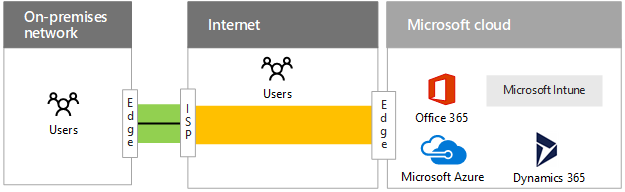
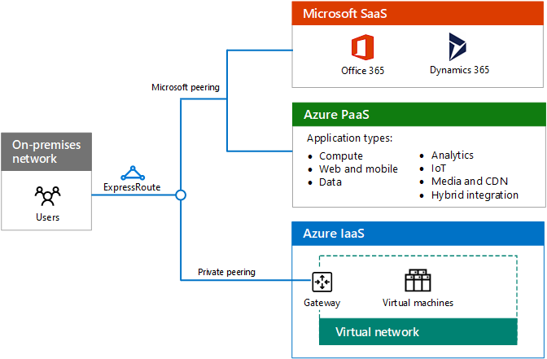
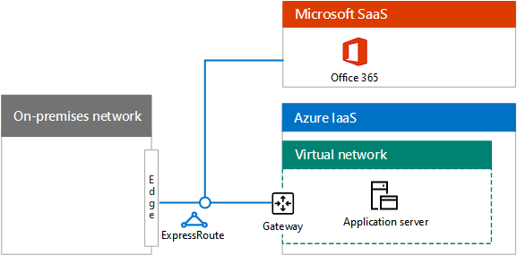
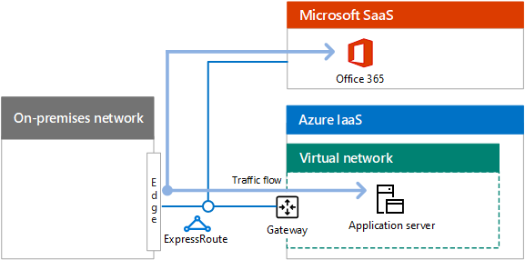
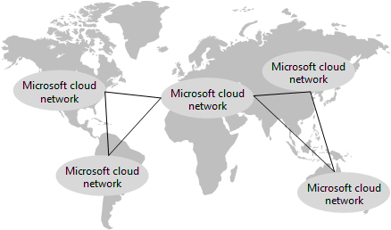

# ExpressRoute para conectividade de nuvem da MicrosoftExpressRoute for Microsoft cloud connectivity

 **Resumo:** Entenda como o ExpressRoute pode ajudá-lo com conexões mais rápidas e mais confiáveis para plataformas e serviços em nuvem da Microsoft.**Summary:** Understand how ExpressRoute can help you with faster and more reliable connections to Microsoft's cloud services and platforms.
  
O ExpressRoute oferece uma conexão de rede privada, dedicada e de alta taxa de transferência para a nuvem da Microsoft.ExpressRoute provides a private, dedicated, high-throughput network connection to Microsoft's cloud.
  
## ExpressRoute para a nuvem da MicrosoftExpressRoute to the Microsoft cloud

Este é o caminho de rede para a nuvem da Microsoft sem uma conexão ExpressRoute.Here is the networking path to the Microsoft cloud without an ExpressRoute connection.
  
**Figura 1: o caminho de rede sem o ExpressRoute****Figure 1: The networking path without ExpressRoute**

  
A Figura 1 mostra o caminho típico entre uma rede local e a nuvem da Microsoft.Figure 1 shows the typical path between an on-premises network and the Microsoft cloud. A borda de rede local conecta-se à Internet por meio de um link de WAN para um provedor.The on-premises network edge connects to the Internet through a WAN link to an ISP. O tráfego passa pela Internet para a borda da Microsoft Cloud.The traffic then travels across the Internet to the edge of the Microsoft cloud. As ofertas de nuvem no Microsoft Cloud incluem o Office 365, o Microsoft Azure, o Microsoft Intune e o Dynamics 365.Cloud offerings within the Microsoft cloud include Office 365, Microsoft Azure, Microsoft Intune, and Dynamics 365. Os usuários de uma organização podem estar localizados na rede local ou na Internet.Users of an organization can be located on the on-premises network or on the Internet.
  
Sem uma conexão ExpressRoute, a única parte do caminho de tráfego para a nuvem da Microsoft que você pode controlar (e ter uma relação com o provedor de serviços) é o link entre sua borda de rede local e seu ISP.Without an ExpressRoute connection, the only part of the traffic path to the Microsoft cloud that you can control (and have a relationship with the service provider) is the link between your on-premises network edge and your ISP. 
  
O caminho entre o seu ISP e o Microsoft Cloud Edge é um sistema de entrega de melhor esforço na Internet sujeito a interrupções, congestionamento de tráfego e monitoramento por usuários mal-intencionados.The path between your ISP and the Microsoft cloud edge is a best-effort delivery system on the Internet subject to outages, traffic congestion, and monitoring by malicious users.
  
Os usuários na Internet, como usuários móveis ou remotos, enviam o tráfego para a nuvem da Microsoft pela Internet.Users on the Internet, such as roaming or remote users, send their traffic to the Microsoft cloud over the Internet.
  
Estes são os caminhos de rede para a nuvem da Microsoft com uma conexão ExpressRoute.Here are the networking paths to the Microsoft cloud with an ExpressRoute connection.
  
**Figura 2: caminhos de rede com ExpressRoute****Figure 2: The networking paths with ExpressRoute**

  
A Figura 2 mostra dois caminhos de rede.Figure 2 shows two networking paths. O tráfego para o Microsoft Intune viaja para o mesmo caminho que o tráfego de Internet normal.Traffic to Microsoft Intune travels the same path as normal Internet traffic. O tráfego para o Office 365, Microsoft Azure e Dynamics 365 passa pela conexão ExpressRoute, um caminho dedicado entre a borda da rede local e a borda da Microsoft Cloud.Traffic to Office 365, Microsoft Azure, and Dynamics 365 travels across the ExpressRoute connection, a dedicated path between the edge of the on-premises network and the edge of the Microsoft cloud.
  
Com uma conexão ExpressRoute, agora você tem controle, por meio de uma relação com seu provedor de serviços, sobre todo o caminho de tráfego da sua borda para a borda da Microsoft em nuvem.With an ExpressRoute connection, you now have control, through a relationship with your service provider, over the entire traffic path from your edge to the Microsoft cloud edge. Essa conexão pode oferecer desempenho previsível e um [SLA de tempo de atividade de 99,95%](https://azure.microsoft.com/support/legal/sla/expressroute/v1_3/).This connection can offer predictable performance and a [99.95% uptime SLA](https://azure.microsoft.com/support/legal/sla/expressroute/v1_3/).
  
Agora, você pode contar com a taxa de transferência e a latência previsíveis, com base na conexão do provedor de serviços, para os serviços do Office 365, Azure e Dynamics 365.You can now count on predictable throughput and latency, based on your service provider's connection, to Office 365, Azure, and Dynamics 365 services. As conexões ExpressRoute com o Microsoft Intune não são suportadas no momento.ExpressRoute connections to Microsoft Intune are not supported at this time.
  
O tráfego enviado pela conexão ExpressRoute não está mais sujeito a interrupções de Internet, congestionamento de tráfego e monitoramento.Traffic sent over the ExpressRoute connection is no longer subject to Internet outages, traffic congestion, and monitoring.
  
Os usuários na Internet, como usuários móveis ou remotos, ainda enviam o tráfego para a nuvem da Microsoft pela Internet.Users on the Internet, such as roaming or remote users, still send their traffic to the Microsoft cloud over the Internet. Uma exceção é o tráfego para um aplicativo de linha de negócios de intranet hospedado no Azure IaaS, que é enviado pela conexão ExpressRoute por meio de uma conexão de acesso remoto à rede local.One exception is traffic to an intranet line of business application hosted in Azure IaaS, which is sent over the ExpressRoute connection via a remote access connection to the on-premises network.
  
Mesmo com uma conexão ExpressRoute, algum tráfego ainda é enviado pela Internet, como consultas de DNS, verificação de lista de certificados revogados e solicitações de rede de distribuição de conteúdo (CDN).Even with an ExpressRoute connection, some traffic is still sent over the Internet, such as DNS queries, certificate revocation list checking, and content delivery network (CDN) requests.
  
ConFira estes recursos adicionais para obter mais informações:See these additional resources for more information:
  
- [Rota Expressa para Office 365ExpressRoute for Office 365](https://aka.ms/expressrouteoffice365)
    
- [ExpressRoute para AzureExpressRoute for Azure](https://azure.microsoft.com/services/expressroute/)
    
## Vantagens do ExpressRoute para o AzureAdvantages of ExpressRoute for Azure

Veja algumas vantagens de usar o ExpressRoute para serviços de nuvem baseados no Azure:Here are some advantages of using ExpressRoute for Azure-based cloud services:
  
- **Desempenho previsível:** Com um caminho dedicado para a borda da nuvem da Microsoft, seu desempenho não está sujeito às interrupções e aos picos do provedor de Internet no tráfego da Internet.**Predictable performance:** With a dedicated path to the edge of the Microsoft cloud, your performance is not subject to Internet provider outages and spikes in Internet traffic. Você pode determinar e manter seus provedores em sua conta em um SLA de taxa de transferência e latência para a nuvem da Microsoft.You can determine and hold your providers accountable to a throughput and latency SLA to the Microsoft cloud.
    
- **Privacidade dos dados de seu tráfego:** O tráfego enviado por sua conexão expressa dedicada não está sujeito à monitoração da Internet ou captura de pacotes e análise por usuários mal-intencionados.**Data privacy for your traffic:** Traffic sent over your dedicated ExpressRoute connection is not subject to Internet monitoring or packet capture and analysis by malicious users. É tão seguro quanto usar links WAN baseados em comutação de rótulo de multiProtocolo (MPLS).It is as secure as using Multiprotocol Label Switching (MPLS)-based WAN links.
    
- **Conexões de alto desempenho:** Com amplo suporte para conexões ExpressRoute por provedores do Exchange e provedores de serviços de rede, você pode obter até um link de 10 Gbps para a nuvem da Microsoft.**High throughput connections:** With wide support for ExpressRoute connections by exchange providers and network service providers, you can obtain up to a 10 Gbps link to the Microsoft cloud.
    
- **Custo mais baixo para algumas configurações:** Embora as conexões de ExpressRoute sejam um custo adicional, em alguns casos, uma única conexão ExpressRoute pode custar menos do que aumentar sua capacidade de Internet em vários locais de sua organização para fornecer uma taxa de transferência adequada para os serviços de nuvem da Microsoft.**Lower cost for some configurations:** Although ExpressRoute connections are an additional cost, in some cases a single ExpressRoute connection can cost less than increasing your Internet capacity at multiple locations of your organization to provide adequate throughput to Microsoft cloud services.
    
Uma conexão ExpressRoute não é uma garantia de melhor desempenho em todas as configurações.An ExpressRoute connection is not a guarantee of higher performance in every configuration. É possível ter um desempenho menor em relação a uma conexão ExpressRoute de baixa largura de banda do que uma conexão com a Internet de alta largura de banda que seja apenas alguns saltos de um datacenter regional da Microsoft.It is possible to have lower performance over a low-bandwidth ExpressRoute connection than a high-bandwidth Internet connection that is only a few hops away from a regional Microsoft datacenter.
  
Para obter as recomendações mais recentes para usar o ExpressRoute com o Office 365, consulte [ExpressRoute para office 365](https://support.office.com/article/Azure-ExpressRoute-for-Office-365-6d2534a2-c19c-4a99-be5e-33a0cee5d3bd).For the latest recommendations for using ExpressRoute with Office 365, see [ExpressRoute for Office 365](https://support.office.com/article/Azure-ExpressRoute-for-Office-365-6d2534a2-c19c-4a99-be5e-33a0cee5d3bd).
  
## Modelos de conectividade ExpressRouteExpressRoute connectivity models

A tabela 1 mostra os três modelos de conectividade principais para conexões ExpressRoute.Table 1 shows the three primary connectivity models for ExpressRoute connections.
  
|**Localizado em um Exchange na nuvem****Co-located at a cloud exchange**|**Ethernet ponto a ponto****Point-to-point Ethernet**|**Conexão de qualquer um (IP VPN)****Any-to-any (IP VPN) connection**|
|:-----|:-----|:-----|
||||
|Se o seu datacenter estiver localizado em um recurso com uma troca de nuvem, você poderá solicitar uma conexão cruzada virtual para a nuvem da Microsoft por meio do Exchange Ethernet do provedor de colocalização.If your datacenter is co-located in a facility with a cloud exchange, you can order a virtual cross-connection to the Microsoft cloud through the co-location provider's Ethernet exchange.    |Se o seu datacenter estiver localizado em seu local, você poderá usar um link Ethernet ponto a ponto para se conectar à nuvem da Microsoft.If your datacenter is located on your premises, you can use a point-to-point Ethernet link to connect to the Microsoft cloud.    |Se você já estiver usando um provedor de IP VPN (MPLS) para conectar os sites da sua organização, uma conexão ExpressRoute ao Microsoft Cloud funcionará como outro local na sua WAN privada.If you are already using an IP VPN (MPLS) provider to connect the sites of your organization, an ExpressRoute connection to the Microsoft cloud acts like another location on your private WAN.    |
   
 **Tabela 1: modelos de conectividade do ExpressRoute****Table 1: ExpressRoute connectivity models**
  
## Relações de emparelhamento de rota para os serviços de nuvem da MicrosoftExpressRoute peering relationships to Microsoft cloud services

Uma única conexão ExpressRoute oferece suporte a até dois relacionamentos de emparelhamento do protocolo BGP (Border Gateway Protocol) diferentes para partes diferentes da nuvem da Microsoft.A single ExpressRoute connection supports up to two different Border Gateway Protocol (BGP) peering relationships to different parts of the Microsoft cloud. O BPG usa relações de emparelhamento para estabelecer informações de roteamento de confiança e Exchange.BPG uses peering relationships to establish trust and exchange routing information.
  
**Figura 3: as duas relações de BGP diferentes em uma única conexão ExpressRoute****Figure 3: The two different BGP relationships in a single ExpressRoute connection**

  
A Figura 3 mostra uma conexão ExpressRoute de uma rede local.Figure 3 shows an ExpressRoute connection from an on-premises network. A conexão ExpressRoute tem duas relações lógicas de emparelhamento.The ExpressRoute connection has two logical peering relationships. Uma relação de emparelhamento da Microsoft vai para os serviços Microsoft SaaS, incluindo o Office 365, o Dynamcs 365 e os serviços do Azure PaaS.A Microsoft peering relationship goes to Microsoft SaaS services, including Office 365, Dynamcs 365, and Azure PaaS services. Uma relação de emparelhamento privado passa para o Azure IaaS e para um gateway de rede virtual que hospeda máquinas virtuais.A private peering relationship goes to Azure IaaS and to a virtual network gateway that hosts virtual machines.
  
A relação BGP de emparelhamento da Microsoft:The Microsoft peering BGP relationship: 
  
- É de um roteador em sua DMZ para os endereços públicos do Office 365, do Dynamics 365 e dos serviços do Azure.Is from a router in your DMZ to the public addresses of Office 365, Dynamics 365, and Azure services. 
    
- Oferece suporte à comunicação iniciada bidirecional.Supports bidirectional-initiated communication.
    
A relação BGP de emparelhamento privado:The private peering BGP relationship:
  
- É de um roteador na borda da rede da sua organização para os endereços IP privados atribuídos ao seu VNets do Azure.Is from a router on the edge of your organization network to the private IP addresses assigned to your Azure VNets.
    
- Oferece suporte à comunicação iniciada bidirecional.Supports bidirectional-initiated communication.
    
- É uma extensão da rede da sua organização para a nuvem da Microsoft, completa com endereçamento e roteamento consistentes internamente.Is an extension of your organization network to the Microsoft cloud, complete with internally-consistent addressing and routing.

>[!Note]
>A relação de BGP de emparelhamento público descrita em versões anteriores deste artigo foi preterida.The public peering BGP relationship described in previous versions of this article has been deprecated.
>
    
## Exemplo de implantação de aplicativo e fluxo de tráfego com ExpressRouteExample of application deployment and traffic flow with ExpressRoute

O modo como o tráfego percorre as conexões ExpressRoute e dentro da nuvem da Microsoft é uma função das rotas nos saltos do caminho entre a origem e o comportamento de aplicativo e de destino.How traffic travels across ExpressRoute connections and within the Microsoft cloud is a function of the routes at the hops of the path between the source and the destination and application behavior. Veja a seguir um exemplo de um aplicativo em execução em uma máquina virtual do Azure que acessa um farm do SharePoint local em uma conexão VPN de site a site.Here is an example of an application running on an Azure virtual machine that accesses an on-premises SharePoint farm over a site-to-site VPN connection.
  
**Figura 4: um aplicativo em uma máquina virtual do Azure que acessa um farm local do SharePoint****Figure 4: An application on an Azure virtual machine accessing an on-premises SharePoint farm**

  
A Figura 4 mostra um farm do SharePoint local, uma conexão VPN de site a site entre a rede local e uma rede virtual no Azure IaaS, um servidor de aplicativos executando como uma máquina virtual do Azure IaaS e o fluxo de tráfego entre o servidor de aplicativos e farm do SharePoint.Figure 4 shows an on-premises SharePoint farm, a site-to-site VPN connection between the on-premises network and a virtual network in Azure IaaS, an application server running as an Azure IaaS virtual machine, and the traffic flow between the application server and the SharePoint farm.
  
O aplicativo localiza o endereço IP do farm do SharePoint usando o DNS local e todo o tráfego passa pela conexão VPN site a site.The application locates the IP address of the SharePoint farm using the on-premises DNS and all traffic goes over the site-to-site VPN connection.
  
Esta organização migrou o farm local do SharePoint para o SharePoint Online no Office 365 e implantou uma conexão ExpressRoute.This organization migrated their on-premises SharePoint farm to SharePoint Online in Office 365 and deployed an ExpressRoute connection.
  
**Figura 5: movendo o farm do SharePoint local para o SharePoint Online****Figure 5: Moving the on-premises SharePoint farm to SharePoint Online**

  
A Figura 5 mostra a adição de uma conexão ExpressRoute com relações de emparelhamento com o Microsoft SaaS e o Office 365 e para o Azure IaaS contendo o servidor de aplicativos em uma rede virtual.Figure 5 shows the addition of an ExpressRoute connection with peering relationships to Microsoft SaaS and Office 365 and to Azure IaaS containing the application server on a virtual network. O farm local do SharePoint foi migrado para o Office 365.The SharePoint on-premises farm has been migrated to Office 365.
  
Com as relações de emparelhamento privado e da Microsoft:With the Microsoft and private peering relationships:
  
- No gateway de rede virtual do Azure, locais no local estão disponíveis na conexão ExpressRoute.From the Azure virtual network gateway, on-premises locations are available across the ExpressRoute connection.
    
- Na assinatura do Office 365, os endereços IP públicos de dispositivos de borda, como servidores proxy, estão disponíveis na conexão ExpressRoute.From the Office 365 subscription, public IP addresses of edge devices, such as proxy servers, are available across the ExpressRoute connection.
    
- Na borda da rede local, os endereços IP privados da VNet do Azure e os endereços IP públicos do Office 365 estão disponíveis na conexão ExpressRoute.From the on-premises network edge, the private IP addresses of the Azure VNet and the public IP addresses of Office 365 are available across the ExpressRoute connection.
    
Quando o aplicativo acessa as URLs do SharePoint Online, ele encaminha seu tráfego pela conexão ExpressRoute para um servidor proxy na borda.When the application accesses the URLs of SharePoint Online, it forwards its traffic across the ExpressRoute connection to a proxy server in the edge. 
  
Quando o servidor proxy localizar o endereço IP do SharePoint Online, ele encaminhará o tráfego de volta pela conexão ExpressRoute.When the proxy server locates the IP address of SharePoint Online, it forwards the traffic back over the ExpressRoute connection. O tráfego de resposta Percorra o caminho reverso.Response traffic travels the reverse path.
  
**Figura 6: fluxo de tráfego quando o farm do SharePoint foi migrado para o SharePoint Online no Office 365****Figure 6: Traffic flow when the SharePoint farm has been migrated to SharePoint Online in Office 365**

  
A Figura 6 mostra como o tráfego entre o servidor de aplicativos e o SharePoint Online no Office 365 flui sobre a relação de emparelhamento privado do servidor de aplicativos para a borda de rede local e, em seguida, da borda sobre a relação de emparelhamento da Microsoft para o Office 365.Figure 6 shows how the traffic between the application server and SharePoint Online in Office 365 flows over the private peering relationship from the application server to the on-premises network edge, and then from the edge over the Microsoft peering relationship to Office 365.
  
O resultado é a fixação de cabelo, uma conseqüência do comportamento de roteamento e aplicativo.The result is hair pinning, a consequence of the routing and application behavior.
  
## Rota expressa e rede de nuvem da MicrosoftExpressRoute and Microsoft's cloud network

As conexões ExpressRoute estão disponíveis em duas versões diferentes: ExpressRoute e ExpressRoute Premium.ExpressRoute connections are available in two different versions: ExpressRoute and ExpressRoute Premium.
  
### ExpressRouteExpressRoute

O modo como o tráfego transita entre a rede da sua organização e um datacenter da Microsoft é uma combinação de:How traffic travels between your organization network and a Microsoft datacenter is a combination of:
  
- Seus locais.Your locations.
    
- Locais de emparelhamento de nuvem da Microsoft (os locais físicos para se conectar ao Microsoft Edge).Microsoft cloud peering locations (the physical locations to connect to the Microsoft edge).
    
- Locais de datacenter da Microsoft.Microsoft datacenter locations.
    
O Microsoft datacenter e locais de emparelhamento na nuvem estão conectados à rede de nuvem da Microsoft.Microsoft datacenter and cloud peering locations are all connected to the Microsoft cloud network.
  
Ao criar uma conexão ExpressRoute com um local de emparelhamento de nuvem da Microsoft, você está conectado à rede do Microsoft Cloud e a todos os locais de datacenter da Microsoft no mesmo continente.When you create an ExpressRoute connection to a Microsoft cloud peering location, you are connected to the Microsoft cloud network and all the Microsoft datacenter locations in the same continent. O tráfego entre o local de emparelhamento da nuvem e o datacenter da Microsoft de destino é transportado pela rede da Microsoft em nuvem.The traffic between the cloud peering location and the destination Microsoft datacenter is carried over the Microsoft cloud network.
  
Isso pode resultar em uma entrega não ideal para data centers da Microsoft locais para o modelo de conectividade qualquer-para-qualquer.This can result in non-optimal delivery to local Microsoft datacenters for the any-to-any connectivity model.
  
**Figura 7: exemplo de uma organização geograficamente distribuída que usa uma única conexão ExpressRoute****Figure 7: Example of a geographically-distributed organization that uses a single ExpressRoute connection**

  
A Figura 7 mostra uma organização com dois locais, local 1 no noroeste dos Estados Unidos e local 2 no nordeste.Figure 7 shows an organization with two locations, Location 1 in the northwest of the United States and Location 2 in the northeast. Eles estão conectados por um provedor de WAN de qualquer um.They are connected by an any-to-any WAN provider. Essa organização também tem uma conexão ExpressRoute com um local de emparelhamento da Microsoft na costa oeste.This organization also has an ExpressRoute connection to a Microsoft peering location on the west coast. O tráfego de local 2 no nordeste destinado a um datacenter de costa leste deve viajar completamente pela WAN da organização para a costa oeste, para o local de emparelhamento da Microsoft e, em seguida, de volta em todo o país da rede de nuvem da Microsoft para a costa leste datacenter.Traffic from Location 2 in the northeast destined for an east coast datacenter must travel all the way across the organization's WAN to the west coast, to the Microsoft peering location, and then back across the country over the Microsoft cloud network to the east coast datacenter.
  
Para a entrega ideal, use várias conexões ExpressRoute para locais regionais de emparelhamento da nuvem da Microsoft.For optimal delivery, use multiple ExpressRoute connections to regional Microsoft cloud peering locations. 
  
**Figura 8: o uso de várias conexões ExpressRoute para a entrega ideal para datacenters regionais****Figure 8: The use of multiple ExpressRoute connections for optimal delivery to regional datacenters**

  
A Figura 8 mostra a mesma organização com duas conexões ExpressRoute, uma para cada local, para locais de emparelhamento da Microsoft locais de região.Figure 8 shows the same organization with two ExpressRoute connections, one for each location, to regionally local Microsoft peering locations. Nessa configuração, o tráfego do local 2 no nordeste destinado a um datacenter de costa leste vai diretamente para um local de emparelhamento da costa leste, para a rede de nuvem da Microsoft e, em seguida, para o datacenter da costa leste.In this configuration, traffic from Location 2 in the northeast destined for an east coast datacenter goes directly to an east coast peering location, to the Microsoft cloud network, and then to the east coast datacenter.
  
Várias conexões ExpressRoute podem fornecer:Multiple ExpressRoute connections can provide:
  
- Melhor desempenho para os locais de datacenters da Microsoft em região local.Better performance to regionally local Microsoft datacenter locations.
    
- Maior disponibilidade para a nuvem da Microsoft quando uma conexão expressa local fica indisponível.Higher availability to the Microsoft cloud when a local ExpressRoute connection becomes unavailable.
    
Isso funciona bem para organizações no mesmo continente.This works well for organizations in the same continent. No enTanto, o tráfego para os data centers da Microsoft fora do continente da organização passa pela Internet.However, traffic to Microsoft datacenters outside the organization's continent travels over the Internet.
  
Para o tráfego Intercontinental na rede do Microsoft Cloud, você deve usar conexões Premium do ExpressRoute.For intercontinental traffic over the Microsoft cloud network, you must use ExpressRoute Premium connections.
  
### ExpressRoute PremiumExpressRoute Premium

Para organizações distribuídas globalmente entre continentes, você pode usar o ExpressRoute Premium.For organizations that are globally distributed across continents, you can use ExpressRoute Premium. 
  
Com o ExpressRoute Premium, você pode alcançar qualquer Datacenter da Microsoft em qualquer continente de qualquer local de emparelhamento da Microsoft em qualquer continente.With ExpressRoute Premium, you can reach any Microsoft datacenter on any continent from any Microsoft peering location on any continent. O tráfego entre os continentes é transportado pela rede da Microsoft em nuvem.The traffic between continents is carried over the Microsoft cloud network.
  
Com várias conexões Premium do ExpressRoute, você pode ter:With multiple ExpressRoute Premium connections, you can have:
  
- Melhor desempenho para data centers da Microsoft localmente.Better performance to continentally local Microsoft datacenters.
    
- Maior disponibilidade para a nuvem global da Microsoft quando uma conexão expressa local fica indisponível.Higher availability to the global Microsoft cloud when a local ExpressRoute connection becomes unavailable.
    
O ExpressRoute Premium é necessário para conexões ExpressRoute baseadas no Office 365.ExpressRoute Premium is required for Office 365-based ExpressRoute connections.
  
**Figura 9: a rede de nuvem da Microsoft em todo o mundo****Figure 9: The world-wide Microsoft cloud network**

  
A Figura 9 mostra um diagrama lógico da rede em nuvem da Microsoft em todo o mundo, com redes que abrangem os continentes e regiões do mundo e suas interconexões.Figure 9 shows a logical diagram of the worldwide Microsoft cloud network, with networks that span the continents and regions of the world and their interconnections. Com uma parte da rede de nuvem da Microsoft em cada continente, uma empresa global cria conexões de ExpressRoute Premium a partir de seus escritórios de Hub regionais para locais de emparelhamento da Microsoft locais.With a portion of the Microsoft cloud network in each continent, a global enterprise creates ExpressRoute Premium connections from its regional hub offices to local Microsoft peering locations.
  
Para um escritório regional, o tráfego apropriado do Office 365 para:For a regional office, appropriate Office 365 traffic to:
  
- Os datacenters do Office 365 são transferidos pela rede de nuvem da Microsoft dentro do continente.Continental Office 365 datacenters travels over the Microsoft cloud network within the continent.
    
- Os datacenters do Office 365 em outro continente trafegam pela rede de nuvem do Intercontinental da Microsoft.Office 365 datacenters in another continent travels over the intercontinental Microsoft cloud network.
    
Para obter mais informações, consulte:For more information, see:
  
- [Treinamento do Azure ExpressRoute para Office 365Azure ExpressRoute for Office 365 Training](https://channel9.msdn.com/series/aer/)
    
- [Planejamento de rede e ajuste de desempenho para o Office 365Network planning and performance tuning for Office 365](https://aka.ms/tune)
    
## Opções do ExpressRouteExpressRoute options

Você também pode incorporar as seguintes opções à sua implantação do ExpressRoute:You can also incorporate the following options into your ExpressRoute deployment:
  
- **Segurança na sua borda:** Para fornecer segurança avançada para o tráfego enviado e recebido pela conexão ExpressRoute, como inspeção de tráfego ou detecção de invasão/malware, coloque seus dispositivos de segurança no caminho de tráfego dentro do DMZ ou na borda da sua intranet.**Security at your edge:** To provide advanced security for the traffic sent and received over the ExpressRoute connection, such as traffic inspection or intrusion/malware detection, place your security appliances in the traffic path within your DMZ or at the border of your intranet.
    
- **Tráfego da Internet para VMs:** Para impedir que as VMs do Azure iniciem o tráfego diretamente com locais da Internet, anuncie a rota padrão à Microsoft.**Internet traffic for VMs:** To prevent Azure VMs from initiating traffic directly with Internet locations, advertise the default route to Microsoft. O tráfego para a Internet é roteado pela conexão ExpressRoute e por meio de seus servidores proxy no local.Traffic to the Internet is routed across the ExpressRoute connection and through your on-premises proxy servers. O tráfego de VMs do Azure para os serviços do Azure PaaS ou Office 365 é roteado de volta pela conexão ExpressRoute.Traffic from Azure VMs to Azure PaaS services or Office 365 is routed back across the ExpressRoute connection.
    
- **Otimizadores de WAN:** Você pode implantar otimizadores de WAN em ambos os lados de uma conexão de emparelhamento privado para uma rede virtual do Azure entre locais (VNet).**WAN optimizers:** You can deploy WAN optimizers on both sides of a private peering connection for a cross-premises Azure virtual network (VNet). Dentro da VNet do Azure, use um dispositivo de rede de otimizador de WAN do Azure Marketplace e o roteamento definido pelo usuário para encaminhar o tráfego pelo dispositivo.Inside the Azure VNet, use a WAN optimizer network appliance from the Azure marketplace and user-defined routing to route the traffic through the appliance.
    
- **Qualidade do serviço:** Use valores de ponto de código de serviços diferenciados (DSCP) no cabeçalho IPv4 do seu tráfego para marcá-lo para voz, vídeo/interativo ou entrega de melhor esforço.**Quality of service:** Use Differentiated Services Code Point (DSCP) values in the IPv4 header of your traffic to mark it for voice, video/interactive, or best-effort delivery. Isso é especialmente importante para o relacionamento de emparelhamento da Microsoft e o tráfego do Skype for Business online.This is especially important for the Microsoft peering relationship and Skype for Business Online traffic.
    
ConFira estes recursos adicionais para obter mais informações:See these additional resources for more information:
  
- [Rota Expressa para Office 365ExpressRoute for Office 365](https://aka.ms/expressrouteoffice365)
    
- [Treinamento do Azure ExpressRoute para Office 365Azure ExpressRoute for Office 365 Training](https://channel9.msdn.com/series/aer/)
    
- [ExpressRoute para AzureExpressRoute for Azure](https://azure.microsoft.com/services/expressroute/)
    
## Próxima etapaNext step

[Criação de rede para o Microsoft SaaSDesigning networking for Microsoft SaaS](designing-networking-for-microsoft-saas.md)

## Confira tambémSee also

[Rede do Microsoft Cloud para arquitetos corporativosMicrosoft Cloud Networking for Enterprise Architects](microsoft-cloud-networking-for-enterprise-architects.md)
  
[Recursos de arquitetura de TI do Microsoft CloudMicrosoft Cloud IT architecture resources](microsoft-cloud-it-architecture-resources.md)

