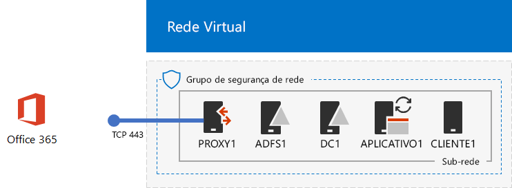
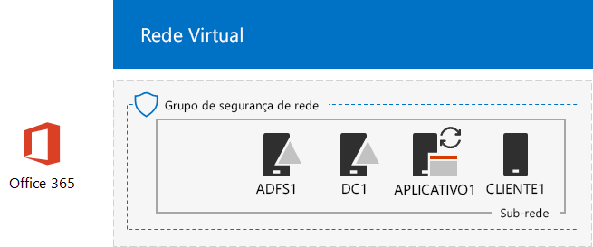

# <a name="federated-identity-for-your-office-365-devtest-environment"></a>Identidade federada para seu ambiente de desenvolvimento e teste do Office 365

 **Resumo:** Configure autenticação federada para seu ambiente de desenvolvimento e teste do Office 365.
  
Office 365 oferece suporte a identidade federada. Isso significa que em vez de executar a validação de credenciais em si, Office 365 se refere ao usuário se conectando a um servidor de autenticação federada relações de confiança do Office 365. Se as credenciais do usuário estão corretas, o servidor de autenticação federada emite um token de segurança que envia o cliente para o Office 365 como prova de autenticação. Identidade federada permite o descarregamento e expansão de autenticação para uma assinatura do Office 365 e cenários de autenticação e segurança avançada.
  
Este artigo descreve como você pode configurar a autenticação federada para o ambiente de desenvolvimento e teste do Office 365, resultando no seguinte:
  
**Figura 1: A autenticação federada para o ambiente de desenvolvimento e teste do Office 365**


  
A configuração mostrada na Figura 1 consiste em: 
  
- Um Office 365 E5 avaliação assinatura, que expira 30 dias a partir de quando você criá-lo.
    
- Uma intranet da organização simplificado conectado à Internet, consistindo em cinco máquinas virtuais em uma sub-rede de uma rede virtual do Azure (DC1, APP1, CLIENT1, ADFS1 e PROXY1). Conectar do Azure AD executa no APP1 para sincronizar a lista de contas no domínio AD do Windows Server para o Office 365. PROXY1 recebe as solicitações de autenticação de entrada. ADFS1 valida credenciais com DC1 e emite tokens de segurança.
    
Há cinco fases para configurar esse ambiente de desenvolvimento e teste:
  
1. Crie o ambiente de desenvolvimento e teste simulado enterprise Office 365 com o DirSync.
    
2. Crie um servidor AD FS (ADFS1).
    
3. Crie o servidor de proxy da web (PROXY1).
    
4. Criar um certificado autoassinado e configure ADFS1 e PROXY1.
    
5. Configure o Office 365 para identidade federada.
    
Para depurar uma implantação de produção da autenticação federada para o Office 365 no Windows Azure, consulte [Deploy autenticação federada do alta disponibilidade para o Office 365 no Windows Azure](deploy-high-availability-federated-authentication-for-office-365-in-azure.md).
  
> [!NOTE]
> Você não pode configurar esse ambiente de desenvolvimento e teste com uma assinatura de avaliação do Azure. 
  
> [!TIP]
> Clique [aqui](http://aka.ms/catlgstack) para obter um mapa visual para todos os artigos na pilha de um Microsoft Cloud Test Lab Guide.
  
## <a name="phase-1-create-the-simulated-enterprise-office-365-devtest-environment-with-dirsync"></a>Fase 1: Criar o ambiente de desenvolvimento e teste simulado enterprise Office 365 com DirSync

Siga as instruções no [DirSync para seu ambiente de desenvolvimento e teste do Office 365](dirsync-for-your-office-365-dev-test-environment.md) para criar o ambiente de desenvolvimento e teste simulado enterprise Office 365 com APP1 como o servidor de DirSync e a identidade sincronizada entre o Office 365 e o Windows Server AD contas no DC1.
  
Em seguida, crie um novo nome de domínio público DNS com base em seu nome de domínio atual e adicioná-lo à sua assinatura do Office 365. É recomendável usar o nome **laboratório de teste.** \<seu domínio público >. Por exemplo, se seu nome de domínio público for contoso.com, adicione o testlab.contoso.com de nome de domínio público.
  
Para obter instruções sobre como criar os registros DNS corretos no seu provedor de DNS e adicionar o domínio à sua assinatura de avaliação do Office 365, consulte [Adicionar usuários e o domínio ao Office 365](https://support.office.com/article/Add-users-and-domain-to-Office-365-6383f56d-3d09-4dcb-9b41-b5f5a5efd611). 
  
Esta é a configuração resultante.
  
**Figura 2: DirSync para o ambiente de desenvolvimento e teste do Office 365**


  
A Figura 2 mostra o DirSync para ambiente de desenvolvimento e teste do Office 365, que inclui máquinas virtuais do Office 365 e CLIENT1, APP1 e DC1 em uma rede virtual do Azure.
  
## <a name="phase-2-create-the-ad-fs-server"></a>Fase 2: Criar um servidor AD FS

Um servidor AD FS fornece autenticação federada entre o Office 365 e as contas no domínio corp.contoso.com hospedado em DC1.
  
Para criar uma máquina virtual do Azure para ADFS1, preencher no nome de sua assinatura e o grupo de recursos e o Azure local para sua configuração básica e, em seguida, execute estes comandos no prompt de comando do PowerShell do Azure no computador local.
  
```
$subscr="<your Azure subscription name>"
$rgName="<the resource group name of your Base Configuration>"
Login-AzureRMAccount
Get-AzureRmSubscription -SubscriptionName $subscr | Select-AzureRmSubscription
$staticIP="10.0.0.100"
$locName=(Get-AzureRmResourceGroup -Name $rgName).Location
$vnet=Get-AzureRMVirtualNetwork -Name TestLab -ResourceGroupName $rgName
$pip = New-AzureRMPublicIpAddress -Name ADFS1-PIP -ResourceGroupName $rgName -Location $locName -AllocationMethod Dynamic
$nic = New-AzureRMNetworkInterface -Name ADFS1-NIC -ResourceGroupName $rgName -Location $locName -SubnetId $vnet.Subnets[0].Id -PublicIpAddressId $pip.Id -PrivateIpAddress $staticIP
$vm=New-AzureRMVMConfig -VMName ADFS1 -VMSize Standard_D2_v2
$cred=Get-Credential -Message "Type the name and password of the local administrator account for ADFS1."
$vm=Set-AzureRMVMOperatingSystem -VM $vm -Windows -ComputerName ADFS1 -Credential $cred -ProvisionVMAgent -EnableAutoUpdate
$vm=Set-AzureRMVMSourceImage -VM $vm -PublisherName MicrosoftWindowsServer -Offer WindowsServer -Skus 2016-Datacenter -Version "latest"
$vm=Add-AzureRMVMNetworkInterface -VM $vm -Id $nic.Id
$vm=Set-AzureRmVMOSDisk -VM $vm -Name "ADFS-OS" -DiskSizeInGB 128 -CreateOption FromImage -StorageAccountType "StandardLRS"
New-AzureRMVM -ResourceGroupName $rgName -Location $locName -VM $vm
```

> [!TIP]
> Clique [aqui](https://gallery.technet.microsoft.com/PowerShell-commands-for-f79bc2c2?redir=0) para obter um arquivo de texto que contém todos os comandos do PowerShell neste artigo.
  
Em seguida, usar o [portal do Windows Azure](http://portal.azure.com) para conectar-se à máquina virtual ADFS1 usando o nome de conta de administrador local ADFS1 e a senha e, em seguida, abra um prompt de comando do Windows PowerShell.
  
Para verificar a comunicação de rede e resolução de nome entre ADFS1 e DC1, execute o comando **ping dc1.corp.contoso.com** e verifique se há quatro respostas.
  
Em seguida, ingresse ADFS1 máquina virtual ao domínio CORP com esses comandos no prompt do Windows PowerShell no ADFS1.
  
```
$cred=Get-Credential -UserName "CORP\\User1" -Message "Type the User1 account password."
Add-Computer -DomainName corp.contoso.com -Credential $cred
Restart-Computer
```

Esta é a configuração resultante.
  
**Figura 3: Adicionar o servidor do AD FS**


  
A Figura 3 mostra a adição do servidor ADFS1 para DirSync para o ambiente de desenvolvimento e teste do Office 365.
  
## <a name="phase-3-create-the-web-proxy-server"></a>Fase 3: Criar o servidor de proxy da web

PROXY1 fornece um proxy de mensagens de autenticação entre usuários tentando autenticar e ADFS1.
  
Para criar uma máquina virtual do Azure para PROXY1, preencher no nome de seu grupo de recursos e o Azure local e, em seguida, execute estes comandos no prompt de comando do PowerShell do Azure no computador local.
  
```
$rgName="<the resource group name of your Base Configuration>"
$staticIP="10.0.0.101"
$locName=(Get-AzureRmResourceGroup -Name $rgName).Location
$vnet=Get-AzureRMVirtualNetwork -Name TestLab -ResourceGroupName $rgName
$pip = New-AzureRMPublicIpAddress -Name PROXY1-PIP -ResourceGroupName $rgName -Location $locName -AllocationMethod Static
$nic = New-AzureRMNetworkInterface -Name PROXY1-NIC -ResourceGroupName $rgName -Location $locName -SubnetId $vnet.Subnets[0].Id -PublicIpAddressId $pip.Id -PrivateIpAddress $staticIP
$vm=New-AzureRMVMConfig -VMName PROXY1 -VMSize Standard_D2_v2
$cred=Get-Credential -Message "Type the name and password of the local administrator account for PROXY1."
$vm=Set-AzureRMVMOperatingSystem -VM $vm -Windows -ComputerName PROXY1 -Credential $cred -ProvisionVMAgent -EnableAutoUpdate
$vm=Set-AzureRMVMSourceImage -VM $vm -PublisherName MicrosoftWindowsServer -Offer WindowsServer -Skus 2016-Datacenter -Version "latest"
$vm=Add-AzureRMVMNetworkInterface -VM $vm -Id $nic.Id
$vm=Set-AzureRmVMOSDisk -VM $vm -Name "PROXY1-OS" -DiskSizeInGB 128 -CreateOption FromImage -StorageAccountType "StandardLRS"
New-AzureRMVM -ResourceGroupName $rgName -Location $locName -VM $vm
```

> [!NOTE]
> PROXY1 é atribuída a um endereço IP estático e público porque você criará um registro DNS público que aponta para ele e ele não deve alterar quando você reiniciar a máquina virtual PROXY1. 
  
Em seguida, adicione uma regra para o grupo de segurança de rede para a sub-rede da rede corporativa para permitir o tráfego de entrada não solicitado da Internet para o endereço IP particular do PROXY1 e a porta TCP 443. Execute estes comandos no prompt de comando do PowerShell do Azure no computador local.
  
```
$rgName="<the resource group name of your Base Configuration>"
Get-AzureRmNetworkSecurityGroup -Name CorpNet -ResourceGroupName $rgName | Add-AzureRmNetworkSecurityRuleConfig -Name "HTTPS-to-PROXY1" -Description "Allow TCP 443 to PROXY1" -Access "Allow" -Protocol "Tcp" -Direction "Inbound" -Priority 101 -SourceAddressPrefix "Internet" -SourcePortRange "*" -DestinationAddressPrefix "10.0.0.101" -DestinationPortRange "443" | Set-AzureRmNetworkSecurityGroup
```

Em seguida, usar o [portal do Windows Azure](http://portal.azure.com) para conectar-se à máquina virtual PROXY1 usando o nome de conta de administrador local PROXY1 e a senha e, em seguida, abra um prompt de comando do Windows PowerShell em PROXY1.
  
Para verificar a comunicação de rede e resolução de nome entre PROXY1 e DC1, execute o comando **ping dc1.corp.contoso.com** e verifique se há quatro respostas.
  
Em seguida, ingresse PROXY1 máquina virtual ao domínio CORP com esses comandos no prompt do Windows PowerShell no PROXY1.
  
```
$cred=Get-Credential -UserName "CORP\\User1" -Message "Type the User1 account password."
Add-Computer -DomainName corp.contoso.com -Credential $cred
Restart-Computer
```

Exiba o endereço IP público do PROXY1 com estes comandos do PowerShell do Windows Azure no computador local:
  
```
Write-Host (Get-AzureRMPublicIpaddress -Name "PROXY1-PIP" -ResourceGroup $rgName).IPAddress
```

Em seguida, trabalhar com seu provedor de DNS público e criar um novo registro DNS A pública para **fs.testlab.** \<seu nome de domínio DNS > que se resolva como o endereço IP exibido pelo comando **Write-Host** . O **fs.testlab.** \<seu nome de domínio DNS > é citado como o *FQDN do serviço de Federação* .
  
Em seguida, usar o [portal do Azure](http://portal.azure.com) para conectar-se à máquina virtual DC1 usando a CORP\\User1 credenciais e execute os seguintes comandos em um prompt de comando do Windows PowerShell de nível de administrador:
  
```
$testZone="<the FQDN of your testlab domain from phase 1, example: testlab.contoso.com>"
$testZoneFile= $testZone + ".dns"
Add-DnsServerPrimaryZone -Name $testZone -ZoneFile $testZoneFile
Add-DnsServerResourceRecordA -Name "fs" -ZoneName $testZone -AllowUpdateAny -IPv4Address "10.0.0.100" -TimeToLive 01:00:00
```

Esses comandos criam um registro DNS A para seu serviço de Federação FQDN máquinas virtuais em uma rede virtual Azure pode resolver para o endereço IP particular do ADFS1.
  
Esta é a configuração resultante.
  
**Figura 4: Adicionar o servidor de proxy de aplicativo web**


  
Figura 4 mostra a adição do servidor PROXY1.
  
## <a name="phase-4-create-a-self-signed-certificate-and-configure-adfs1-and-proxy1"></a>Fase 4: Criar um certificado autoassinado e configurar ADFS1 e PROXY1

Nesta fase, você cria um certificado digital autoassinado para seu serviço de Federação FQDN e configure ADFS1 e PROXY1 como um farm do AD FS.
  
Primeiro, use o [portal do Windows Azure](http://portal.azure.com) para conectar-se a máquina virtual DC1 usando a CORP\\User1 credenciais e, então, abra um nível de administrador Windows PowerShell prompt de comando.
  
Em seguida, crie a conta de serviço do AD FS com este comando no prompt de comando do Windows PowerShell no DC1:
  
```
New-ADUser -SamAccountName ADFS-Service -AccountPassword (read-host "Set user password" -assecurestring) -name "ADFS-Service" -enabled $true -PasswordNeverExpires $true -ChangePasswordAtLogon $false
```

Observe que este comando solicitará que você forneça a senha da conta. Escolha uma senha forte e registre-a em um local seguro. Você precisará dele para esta fase e a fase 5.
  
Usar o [portal do Windows Azure](http://portal.azure.com) para conectar-se à máquina virtual ADFS1 usando CORP\\User1 credenciais. Abra um prompt de comando do Windows PowerShell de nível de administrador em ADFS1, preencha o FQDN do serviço de Federação e, em seguida, execute estes comandos para criar um certificado autoassinado:
  
```
$fedServiceFQDN="<federation service FQDN>"
New-SelfSignedCertificate -DnsName $fedServiceFQDN -CertStoreLocation "cert:\\LocalMachine\\My"
New-Item -path c:\\Certs -type directory
New-SmbShare -name Certs -path c:\\Certs -changeaccess CORP\\User1
```

Em seguida, execute estas etapas para salvar o novo certificado autoassinado como um arquivo.
  
1. Clique em **Iniciar**, digite **mmc.exe**e pressione **Enter**.
    
2. Clique em **arquivo > Adicionar/Remover Snap-in**.
    
3. Em **Adicionar ou Remover Snap-ins**, clique duas vezes em **certificados** na lista de snap-ins disponíveis, clique em **conta de computador**e clique em **Avançar**.
    
4. Em **Selecionar computador**, clique em **Concluir**e clique em **Okey**.
    
5. No painel de árvore, abra **certificados (computador Local) > pessoal > certificados**.
    
6. Com o botão direito o certificado com seu FQDN do serviço de federação, clique em **All tasks**e clique em **Exportar**.
    
7. Na página de **boas-vindas** , clique em **Avançar**.
    
8. Na página **Exportar chave particular** , clique em **Sim**e, em seguida, clique em **Avançar**.
    
9. Na página **Exportar formato de arquivo** , clique em **Exportar todas as propriedades estendidas**e clique em **Avançar**.
    
10. Na página **segurança** , clique em **senha** e digite uma senha na **senha** e **Confirmar senha.**
    
11. Na página **arquivo a ser exportado** , clique em **Procurar**.
    
12. Navegue até o **c:\\certificados** pasta, digite **SSL** em **nome do arquivo**e, em seguida, clique em **Salvar.**
    
13. Na página **arquivo a ser exportado** , clique em **Avançar**.
    
14. Na página **Concluindo o Assistente para exportação de certificados** , clique em **Concluir**. Quando solicitado, clique em **Okey**.
    
Em seguida, instale o serviço AD FS com este comando no prompt de comando do Windows PowerShell em ADFS1:
  
```
Install-WindowsFeature ADFS-Federation -IncludeManagementTools
```

Aguarde a conclusão da instalação.
  
Em seguida, configure o serviço AD FS com estas etapas:
  
1. Clique em **Iniciar**e, em seguida, clique no ícone do **Gerenciador de servidores** .
    
2. No painel da árvore do Gerenciador de servidores, clique em **AD FS**.
    
3. Na barra de ferramentas na parte superior, clique no símbolo de cuidado laranja e, em seguida, clique em **Configurar o serviço de Federação nesse servidor**.
    
4. Na página de **boas-vindas** do Assistente de configuração de serviços de Federação Active Directory, clique em **Avançar**.
    
5. Na página **conectar ao AD DS** , clique em **Avançar**.
    
6. Na página **Especificar propriedades do serviço** :
    
  - Para o **Certificado SSL**, clique na seta para baixo e, em seguida, clique no certificado com o nome do seu serviço de Federação FQDN.
    
  - Em **Nome de exibição do serviço de Federação**, digite o nome da sua organização a empresa fictícia.
    
  - Clique em **Avançar**.
    
7. Na página **Especificar a conta de serviço** , clique em **Selecionar** para o **nome da conta**.
    
8. Em **Selecionar usuário ou conta de serviço**, digite **Serviço ADFS**, clique em **Verificar nomes**e, em seguida, clique em **Okey**.
    
9. Em **Senha da conta**, digite a senha da conta de serviço do ADFS e clique em **Avançar**.
    
10. Na página **Especificar banco de dados de configuração** , clique em **Avançar**.
    
11. Na página **Opções de revisão** , clique em **Avançar**.
    
12. Na página **Verificações de pré-requisito** , clique em **Configurar**.
    
13. Na página de **resultados** , clique em **Fechar**.
    
14. Clique em **Iniciar**, clique no ícone de energia, clique em **Reiniciar**e, em seguida, clique em **continuar**.
    
No [portal do Azure](http://portal.azure.com), se conectar ao PROXY1 com CORP\\credenciais de conta User1.
  
Em seguida, execute estas etapas para instalar o certificado autoassinado e configurar PROXY1.
  
1. Clique em **Iniciar**, digite **mmc.exe**e pressione **Enter**.
    
2. Clique em **arquivo > Adicionar/Remover Snap-in**.
    
3. Em **Adicionar ou Remover Snap-ins**, clique duas vezes em **certificados** na lista de snap-ins disponíveis, clique em **conta de computador**e clique em **Avançar**.
    
4. Em **Selecionar computador**, clique em **Concluir**e clique em **Okey**.
    
5. No painel de árvore, abra **certificados (computador Local) > pessoal > certificados**.
    
6. Clique com o botão **pessoais**, clique em **All tasks**e, em seguida, clique em **Importar**.
    
7. Na página de **boas-vindas** , clique em **Avançar**.
    
8. Na página **arquivo a ser importado** , digite ** \\ \\adfs1\\certificados\\ssl.pfx**e, em seguida, clique em **Avançar**.
    
9. Na página de **proteção de chave privada** , digite a senha do certificado na **senha**e, em seguida, clique em **próxima.**
    
10. Na página **repositório de certificado** , clique em **próxima.**
    
11. Na página **Concluindo** , clique em **Concluir**.
    
12. Na página **Repositório de certificados** , clique em **Avançar**.
    
13. Quando solicitado, clique em **Okey**.
    
14. No painel de árvore, clique em **certificados** .
    
15. Com o botão direito no certificado e, em seguida, clique em **Copiar**.
    
16. No painel de árvore, abra **autoridades de certificação raiz confiáveis > certificados**.
    
17. Mover o ponteiro do mouse abaixo da lista de certificados instalados, com o botão direito e depois clique em **Colar**.
    
Abra um prompt de comando do PowerShell de nível de administrador e execute o seguinte comando:
  
```
Install-WindowsFeature Web-Application-Proxy -IncludeManagementTools
```

Aguarde a conclusão da instalação.
  
Use estas etapas para configurar o serviço de proxy de aplicativo web para usar ADFS1 como seu servidor de Federação:
  
1. Clique em **Iniciar**e, em seguida, clique em **Gerenciador de servidores**.
    
2. No painel de árvore, clique em **Acesso remoto**.
    
3. Na barra de ferramentas na parte superior, clique no símbolo de cuidado laranja e clique em **Abrir o Assistente de Proxy de aplicativo Web**.
    
4. Na página de **boas-vindas** do Assistente de configuração de Proxy de aplicativo Web, clique em **Avançar**.
    
5. Na página **Servidor de Federação** :
    
  - Digite o FQDN do serviço de federação no **nome do serviço de Federação**.
    
  - Tipo **CORP\\User1** em **nome de usuário**.
    
  - Digite a senha para a conta User1 na **senha**.
    
  - Clique em **Avançar**.
    
6. Na página **Certificado de Proxy do AD FS** , clique na seta para baixo, clique no certificado com o FQDN do serviço de Federação e clique em **Avançar**.
    
7. Na página de **confirmação** , clique em **Configurar**.
    
8. Na página de **resultados** , clique em **Fechar**.
    
## <a name="phase-5-configure-office-365-for-federated-identity"></a>Fase 5: Configurar o Office 365 para identidades federadas

Usar o [portal do Azure](http://portal.azure.com) para conectar-se a máquina virtual APP1 com CORP\\credenciais de conta User1.
  
Use estas etapas para configurar Connect do Azure AD e sua assinatura do Office 365 para autenticação federada:
  
1. Na área de trabalho, clique duas vezes em **Connect do Azure AD**.
    
2. Na página **Bem-vindo ao conectar do Azure AD** , clique em **Configurar**.
    
3. Na página **tarefas adicionais** , clique em **Alterar usuário entrar**e clique em **Avançar**.
    
4. Na página **conectar ao AD do Windows Azure** , digite seu nome de conta de administrador global do Office 365 e a senha e clique em **Avançar**.
    
5. Na página de **logon do usuário** , clique em **federação com o AD FS**e, em seguida, clique em **Avançar**.
    
6. Na página **farm AD FS** , clique em **usar um farm existente do AD FS**, digite **ADFS1** em **Nome do servidor**e, em seguida, clique em **Avançar**.
    
7. Quando solicitado a fornecer credenciais do servidor, insira as credenciais de CORP\\User1 da conta e clique em **Okey**.
    
8. Na página credenciais de **Administrador de domínio** , digite **CORP\\User1** no **nome de usuário** e a senha da conta em **senha**e clique em **Avançar**.
    
9. Na página **conta de serviço do AD FS** , digite **CORP\\serviço ADFS** no **Nome de usuário de domínio** e a senha da conta em **Senha de usuário de domínio**e, em seguida, clique em **Avançar**.
    
10. Na página **Domínio do Windows Azure AD** , no **domínio**, selecione o nome do domínio que você criou anteriormente e adicionado à sua assinatura do Office 365 na fase 1 e clique em **Avançar**.
    
11. Na página **pronto para configurar** , clique em **Configurar**.
    
12. Na página **instalação concluída** , clique em **Verificar**.
    
    Você deverá ver mensagens indicando que a intranet e a Internet configuração foi verificada.
    
13. Na página **instalação concluída** , clique em **Sair**.
    
Para demonstrar que a autenticação federada está funcionando, faça o seguinte:
  
1. Abra uma nova instância particular do navegador no computador local e vá para [https://portal.office.com](https://portal.office.com).
    
2. Para as credenciais de login, digite **Usuário1 @**\<o domínio criado na fase 1 >. 
    
    Por exemplo, se o seu domínio de teste for **testlab.contoso.com**, você digitaria **user1@testlab.contoso.com**. Pressione a tecla TAB ou permitir que o Office 365 para redirecioná-lo automaticamente.
    
    Agora, você deverá ver uma página de **sua conexão é não particular** . Você está vendo isso porque você instalou um certificado autoassinado em ADFS1 computador desktop não foi possível validar. Em uma implantação de produção da autenticação federada, você usaria um certificado de uma autoridade de certificação confiável e seus usuários não veria nesta página.
    
3. Na página **sua conexão é não particular** , clique em **Avançado**e, em seguida, clique em **prossiga para \<seu serviço de Federação FQDN >**. 
    
4. Na página com o nome da sua organização a empresa fictícia, entrar com o seguinte:
    
  - **CORP\\User1** para o nome
    
  - A senha para a conta User1
    
    Você deverá ver a página do **Microsoft Office Home** .
    
Esse procedimento demonstra que sua assinatura de avaliação do Office 365 é federada com o domínio corp.contoso.com do AD do Windows Server hospedado no DC1. Aqui estão os fundamentos do processo de autenticação:
  
1. Quando você usa o domínio federado que você criou na fase 1 do nome de conta de entrada, o Office 365 redireciona o navegador para sua federação FQDN e PROXY1 de serviço.
    
2. PROXY1 envia a página de entrada de empresa fictícia de seu computador local.
    
3. Quando você envia CORP\\User1 e a senha para PROXY1, ele encaminha para ADFS1.
    
4. ADFS1 valida CORP\\User1 e a senha com DC1 e envia um token de segurança de computador local.
    
5. Computador local envia o token de segurança para o Office 365.
    
6. O Office 365 valida que o token de segurança foi criado por ADFS1 e permite o acesso.
    
Agora, a sua assinatura de avaliação do Office 365 é configurada com autenticação federada. Você pode usar esse ambiente de desenvolvimento e teste para cenários de autenticação avançada.
  
## <a name="next-step"></a>Próxima etapa

Quando estiver pronto para implantar pronto para produção, autenticação federada de alta disponibilidade para o Office 365 no Windows Azure, consulte [Deploy autenticação federada do alta disponibilidade para o Office 365 no Windows Azure](deploy-high-availability-federated-authentication-for-office-365-in-azure.md).
  
## <a name="see-also"></a>Veja também

[Guias do Laboratório de Teste (TLGs) para adoção de nuvem](cloud-adoption-test-lab-guides-tlgs.md)
  
[Ambiente de desenvolvimento e teste de configuração de base](base-configuration-dev-test-environment.md)
  
[Ambiente de desenvolvimento e teste do Office 365](office-365-dev-test-environment.md)
  
[Adoção da nuvem e soluções híbridas](cloud-adoption-and-hybrid-solutions.md)
  
[Implantar a autenticação federada de alta disponibilidade para o Office 365 no Windows Azure](deploy-high-availability-federated-authentication-for-office-365-in-azure.md)


