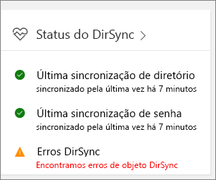

# Corrigir problemas de sincronização de diretório do Office 365

Com a sincronização de diretório, você pode continuar gerenciar usuários e grupos locais e sincronizar adições, exclusões e alterações para a nuvem. Mas instalação é um pouco complicada e em alguns casos, pode ser difícil identificar a origem dos problemas. Temos recursos para ajudá-lo a identificar possíveis problemas e corrigi-los.
  
## Como saber se algo está errado?

A primeira indicação de que há algo errado é quando os blocos de Status do DirSync no Centro de administração do Office 365 indica que há um problema:
  

  
Você também receberá um email (para o email alternativos e seu email do admin) do Office 365 que indica que seu locatário encontrou erros de sincronização de diretório. Para obter detalhes, consulte [identificar erros de sincronização de diretórios no Office 365](identify-directory-synchronization-errors.md).
  
## Como posso obter ferramenta conectar do Azure Active Directory?

No Centro de administração do Office 365, navegue até * * usuários * * \> **usuários ativos**. Clique no menu **mais** e selecione a **sincronização de diretórios**. 
  

  
No antigo Centro de administração do Office 365, navegue até **os usuários** \> **Usuários ativos**e selecione **Configurar** ao lado de **sincronização do Active Directory**. 
  

  
Siga as [instruções no assistente](set-up-directory-synchronization.md) para baixar Connect do Azure AD. 
  
Se você ainda estiver usando sincronização Azure Active Directory (DirSync), dê uma olhada em [como solucionar problemas de instalação da ferramenta de sincronização do Azure Active Directory e mensagens de erro do Assistente de configuração no Office 365](https://go.microsoft.com/fwlink/p/?LinkId=396717) para obter informações sobre os requisitos de sistema para instalar DirSync, as permissões que necessárias e como solucionar erros comuns. 
  
Para atualizar a partir de sincronização do Azure Active Directory para conectar do Azure AD, consulte [as instruções de atualização](https://go.microsoft.com/fwlink/p/?LinkId=733240).
  
## Resolvendo comuns causa de problemas com a sincronização de diretórios no Office 365

### **Objetos sincronizados não estão aparecendo ou atualizando online ou estou recebendo relatórios de erros de sincronização do serviço.**

- [Resiliência de atributo de sincronização e duplicata de identidade](https://docs.microsoft.com/azure/active-directory/hybrid/how-to-connect-syncservice-duplicate-attribute-resiliency)

### **Posso ter um alerta no Centro de administração do Office 365 ou estou recebendo emails automatizados que ainda não foi um evento de sincronização recentes**
- [Resolver problemas de conectividade com Connect do Azure AD](https://docs.microsoft.com/azure/active-directory/hybrid/tshoot-connect-connectivity)
- [Azure AD conectar contas e permissões](https://go.microsoft.com/fwlink/p/?LinkId=820598)
- [Sincronização do Azure AD Connect: como gerenciar a conta de serviço do Windows Azure AD](https://docs.microsoft.com/azure/active-directory/hybrid/how-to-connect-azureadaccount)
- [Sincronização de diretórios para paradas do Azure Active Directory ou você estiver avisados que sync ainda não registrados em mais de um dia](https://support.microsoft.com/help/2882421/directory-synchronization-to-azure-active-directory-stops-or-you-re-warned-that-sync-hasn-t-registered-in-more-than-a-day)

### **Hashes de senha não estão sincronizando ou Estou obtendo um alerta no Centro de administração do Office 365, que ainda não foi uma sincronização recente de hash de senha**
- [Implementar a sincronização de hash de senha com a sincronização do Azure Connect do AD](https://docs.microsoft.com/azure/active-directory/hybrid/how-to-connect-password-hash-synchronization)

### **Estou obtendo um alerta que excederam a cota de objeto**
- Temos uma cota de objeto incorporado para ajudar a proteger o serviço. Se você tiver muitos objetos em seu diretório que precisa para sincronizar com o Office 365, você terá a [contatos de suporte para produtos de negócios](https://support.office.com/article/32a17ca7-6fa0-4870-8a8d-e25ba4ccfd4b) para aumentar sua cota.

### **Preciso saber quais atributos são sincronizados**
- Você pode encontrar uma lista de todos os atributos são sincronizados entre o local e a nuvem [direita aqui](https://go.microsoft.com/fwlink/p/?LinkId=396719).

### **Não consigo gerenciar ou remover objetos que foram sincronizados com a nuvem**
- Você está pronto para gerenciar objetos na nuvem apenas? Ou então, há um objeto que foi excluído no local, mas preso na nuvem? Dê uma olhada neste [Solucionar problemas de erros durante a sincronização](https://go.microsoft.com/fwlink/p/?linkid=842044) e o [artigo de suporte](https://go.microsoft.com/fwlink/p/?LinkId=396720) para obter orientação sobre como resolver esses problemas.

### **Recebi uma mensagem de erro de que minha empresa excedeu a quantidade de objetos que podem ser sincronizada**
- Você pode ler mais sobre essa questão [aqui](https://go.microsoft.com/fwlink/p/?LinkId=396721).
   
## Outros recursos

- [Script para corrigir UPNs duplicados](https://go.microsoft.com/fwlink/p/?LinkId=396725)
    
- [Como preparar um domínio não roteáveis (por exemplo, o domínio. local) para sincronização de diretórios](prepare-a-non-routable-domain-for-directory-synchronization.md)
    
- [Script para contar o total de objetos sincronizados](https://go.microsoft.com/fwlink/p/?LinkId=396726)
    
- [Solucionar problemas do AD FS 2.0](https://go.microsoft.com/fwlink/p/?LinkId=396727)
    
- [Usar o PowerShell para corrigir os atributos DisplayName vazios para grupos habilitados para email](https://go.microsoft.com/fwlink/p/?LinkId=396728)
    
- [Usar o PowerShell para corrigir o UPN duplicado](https://go.microsoft.com/fwlink/p/?LinkId=396730)
    
- [Usar o PowerShell para corrigir endereços de email duplicados](https://go.microsoft.com/fwlink/p/?LinkId=396731)
    
## Ferramentas de diagnóstico

[Ferramenta IDFix](prepare-directory-attributes-for-synch-with-idfix.md) é usado para executar a descoberta e correção de objetos de identidade e seus atributos em um ambiente do Active Directory local em preparação para a migração para o Office 365. IDFix destina-se os administradores do Active Directory responsáveis por DirSync com o serviço do Office 365. 

[Baixe a ferramenta IDFix](https://go.microsoft.com/fwlink/p/?LinkId=396718) do Centro de download da Microsoft.