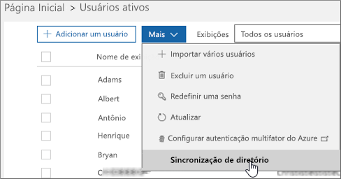

# Corrigindo problemas de sincronização de diretório no Office 365

Com a sincronização de diretórios, você pode continuar a gerenciar usuários e grupos locais e sincronizar adições, exclusões e alterações na nuvem. Mas a configuração é um pouco complicada e, às vezes, pode ser difícil identificar a origem dos problemas. Temos recursos para ajudá-lo a identificar possíveis problemas e corrigi-los.
  
## Como saber se algo está errado?

A primeira indicação de que algo está errado é quando o bloco de status dirSync no centro de administração do Microsoft 365 indica que há um problema:
  

  
Você também receberá um email (para o email alternativo e para o email do administrador) do Office 365 que indica que seu locatário encontrou erros de sincronização de diretório. Para obter detalhes, consulte [identificar erros de sincronização de diretório no Office 365](identify-directory-synchronization-errors.md).
  
## Como obter a ferramenta Azure Active Directory Connect?

no [centro de administração do Microsoft 365](https://admin.microsoft.com), navegue até * * usuários * \> * **ativos**. Clique no menu **mais** e selecione **sincronização de diretório**. 
  

  
Siga as [instruções no assistente](set-up-directory-synchronization.md) para baixar o Azure ad Connect. 
  
Se você ainda estiver usando a sincronização do Azure Active Directory (dirSync), confira [como solucionar problemas de mensagens de erro do assistente de instalação e configuração da ferramenta de sincronização do Azure Active Directory no Office 365](https://go.microsoft.com/fwlink/p/?LinkId=396717) para obter informações sobre os requisitos do sistema para instalar DirSync, as permissões necessárias e como solucionar erros comuns. 
  
Para atualizar da sincronização do Azure Active Directory para o Azure AD Connect, consulte [as instruções de atualização](https://go.microsoft.com/fwlink/p/?LinkId=733240).
  
## Resolver causas comuns de problemas com a sincronização de diretórios no Office 365

### **Objetos sincronizados não aparecem ou estão sendo atualizados online, ou estou obtendo relatórios de erro de sincronização do serviço.**

- [Sincronização de identidade e resiliência de atributo duplicada](https://docs.microsoft.com/azure/active-directory/hybrid/how-to-connect-syncservice-duplicate-attribute-resiliency)

### **Tenho um alerta no centro de administração ou estou recebendo emails automatizados que não foram mais recentes eventos de sincronização**
- [Solucionar problemas de conectividade com o Azure AD Connect](https://docs.microsoft.com/azure/active-directory/hybrid/tshoot-connect-connectivity)
- [Contas e permissões do Azure AD Connect](https://go.microsoft.com/fwlink/p/?LinkId=820598)
- [Sincronização do Azure AD Connect: como gerenciar a conta de serviço do Azure AD](https://docs.microsoft.com/azure/active-directory/hybrid/how-to-connect-azureadaccount)
- [A sincronização de diretórios com o Azure Active Directory é interrompida ou você é avisado de que a sincronização não foi registrada em mais de um dia](https://support.microsoft.com/help/2882421/directory-synchronization-to-azure-active-directory-stops-or-you-re-warned-that-sync-hasn-t-registered-in-more-than-a-day)

### **Os hashes de senha não estão sincronizando ou estou vendo um alerta no centro de administração que não havia uma sincronização de hash de senha recente**
- [Implementar a sincronização de hash de senha com a sincronização do Azure AD Connect](https://docs.microsoft.com/azure/active-directory/hybrid/how-to-connect-password-hash-synchronization)

### **Estou vendo um alerta que a cota de objeto excedeu**
- Temos uma cota de objeto interna para ajudar a proteger o serviço. Se você tiver muitos objetos em seu diretório que precisam ser sincronizados com o Office 365, será necessário [entrar em contato com o suporte para produtos de negócios](https://support.office.com/article/32a17ca7-6fa0-4870-8a8d-e25ba4ccfd4b) para aumentar sua cota.

### **Preciso saber quais atributos estão sincronizados**
- Você pode encontrar uma lista de todos os atributos sincronizados entre o local e a nuvem [imediatamente](https://go.microsoft.com/fwlink/p/?LinkId=396719).

### **Não consigo gerenciar ou remover objetos que foram sincronizados com a nuvem**
- Você está pronto para gerenciar objetos somente na nuvem? Ou há um objeto que foi excluído no local, mas está preso na nuvem? Confira os erros de [solução de problemas durante a sincronização](https://go.microsoft.com/fwlink/p/?linkid=842044) e o [artigo de suporte](https://go.microsoft.com/fwlink/p/?LinkId=396720) para obter orientação sobre como resolver esses problemas.

### **Recebi uma mensagem de erro de que minha empresa excedeu o número de objetos que podem ser sincronizados**
- Você pode ler mais sobre esse problema [aqui](https://go.microsoft.com/fwlink/p/?LinkId=396721).
   
## Outros recursos

- [Script para corrigir UPNs duplicados](https://go.microsoft.com/fwlink/p/?LinkId=396725)
    
- [Como preparar um domínio não roteável (como o domínio. local) para a sincronização de diretórios](prepare-a-non-routable-domain-for-directory-synchronization.md)
    
- [Total de objetos sincronizados com o script para contagem](https://go.microsoft.com/fwlink/p/?LinkId=396726)
    
- [Solução de problemas do AD FS 2,0](https://go.microsoft.com/fwlink/p/?LinkId=396727)
    
- [Usar o PowerShell para corrigir atributos DisplayName vazios para grupos habilitados para email](https://go.microsoft.com/fwlink/p/?LinkId=396728)
    
- [Usar o PowerShell para corrigir o UPN duplicado](https://go.microsoft.com/fwlink/p/?LinkId=396730)
    
- [Usar o PowerShell para corrigir endereços de email duplicados](https://go.microsoft.com/fwlink/p/?LinkId=396731)
    
## Ferramentas de diagnóstico

[IDFix ferramenta](prepare-directory-attributes-for-synch-with-idfix.md) é usada para executar a descoberta e a correção de objetos Identity e seus atributos em um ambiente do Active Directory local em preparação para a migração para o Office 365. O IDFix destina-se aos administradores do Active Directory responsáveis pelo dirSync com o serviço do Office 365. 

[Baixe a ferramenta IDFix](https://go.microsoft.com/fwlink/p/?LinkId=396718) do centro de download da Microsoft.