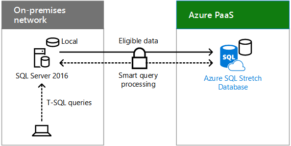

# Cenários de nuvem híbrida para PaaS do AzureHybrid cloud scenarios for Azure PaaS

 **Resumo:** Entenda os cenários e arquitetura híbrida para a plataforma Microsoft como um serviço (PaaS)-based ofertas de nuvem no Windows Azure.**Summary:** Understand the hybrid architecture and scenarios for Microsoft's Platform as a Service (PaaS)-based cloud offerings in Azure.
  
Combinar os dados no local ou recursos de computação com aplicativos novos ou convertidos em execução no Azure PaaS, que podem tirar proveito de escala, confiabilidade e desempenho na nuvem e oferecer um suporte melhor para usuários móveis.Combine on-premises data or computing resources with new or converted applications running in Azure PaaS, which can take advantage of cloud performance, reliability, and scale and provide better support for mobile users. 
  
## Arquitetura de cenário do Windows Azure PaaS híbridaAzure PaaS hybrid scenario architecture

A Figura 1 mostra a arquitetura dos cenários de implantação híbrida baseada em PaaS Microsoft no Azure.Figure 1 shows the architecture of Microsoft PaaS-based hybrid scenarios in Azure.
  
**Figura 1: Cenários de implantação híbrida baseada em PaaS Microsoft no Azure****Figure 1: Microsoft PaaS-based hybrid scenarios in Azure**

  
Para cada camada da arquitetura:For each layer of the architecture:
  
- Cenários e aplicativosApps and scenarios
    
    Um aplicativo de PaaS híbrido é executado no Windows Azure e usa os recursos de computação ou armazenamento local.A hybrid PaaS application runs in Azure and uses on-premises compute or storage resources.
    
- IdentidadeIdentity
    
    Consiste de sincronização de diretório ou federação com um provedor de identidade de terceiros.Consists of either directory synchronization or federation with a third-party identity provider.
    
- RedeNetwork
    
    Consiste em seu pipe Internet existente ou uma conexão ExpressRoute com correspondência pública para PaaS do Azure. Você deve incluir uma maneira para o aplicativo do Azure PaaS acessar o recurso de compute ou armazenamento local.Consists of either your existing Internet pipe or an ExpressRoute connection with public peering to Azure PaaS. You must include a way for the Azure PaaS application to access the on-premises compute or storage resource.
    
- LocalOn-premises
    
    Consiste em infraestrutura de segurança e de identidade e a linha existente de aplicativos de negócios (LOB) ou servidores de banco de dados, que um aplicativo do Windows Azure PaaS pode acessar com segurança.Consists of identity and security infrastructure and existing line of business (LOB) applications or database servers, which an Azure PaaS application can securely access.
    
## Aplicativo do Azure PaaS híbridaAzure PaaS hybrid application

Figura 2 mostra a configuração de um aplicativo híbrida executando no Windows Azure.Figure 2 shows the configuration of a hybrid application running in Azure.
  
**Figura 2: Aplicativo de implantação híbrida baseada em PaaS Azure****Figure 2: Azure PaaS-based hybrid application**

  
Na Figura 2, uma rede local hospeda aplicativos nos servidores e DMZ contendo um servidor proxy ou armazenamento. Ele está conectado aos serviços do Azure PaaS pela Internet ou com uma conexão ExpressRoute.In Figure 2, an on-premises network hosts storage or apps on servers and a DMZ containing a proxy server. It is connected to Azure PaaS services either over the Internet or with an ExpressRoute connection.
  
Uma organização pode tornar seus recursos de armazenamento ou compute disponíveis para o aplicativo de híbrido Azure PaaS por:An organization can make its compute or storage resources available to the Azure PaaS hybrid application by:
  
- Hospedando o recurso em servidores no DMZ.Hosting the resource on servers in the DMZ.
    
- Hospedagem de um servidor proxy reverso no DMZ, que permite solicitações de entrada, autenticadas e baseada em HTTPS para o recurso que está localizado no local.Hosting a reverse proxy server in the DMZ, which allows authenticated, inbound, HTTPS-based requests to the resource that is located on-premises.
    
O aplicativo do Azure pode usar as credenciais a partir de:The Azure app can use credentials from:
  
- Azure AD, que pode ser sincronizado com seu provedor de identidade de local, como o Windows Server AD.Azure AD, which can be synchronized with your on-premises identity provider, such as Windows Server AD.
    
- Um provedor de identidade de terceiros.A third-party identity provider.
    
### Aplicativo do exemplo Azure PaaS híbridoExample Azure PaaS hybrid application

A Figura 3 mostra um exemplo de aplicativo híbrida executando no Windows Azure.Figure 3 shows an example hybrid application running in Azure.
  
**Figura 3: Um exemplo aplicativo baseado no Windows Azure PaaS híbrido****Figure 3: An example Azure PaaS-based hybrid application**

  
Na Figura 3, um hosts de rede local uma LOB App. Azure PaaS hospeda um aplicativo móvel personalizado. Um smartphone na Internet acessa o aplicativo móvel personalizado no Azure, que envia solicitações de dados para o aplicativo LOB local.In Figure 3, an on-premises network hosts an LOB app. Azure PaaS hosts a custom mobile app. A smartphone on the Internet accesses the custom mobile app in Azure, which sends data requests to the on-premises LOB app.
  
Este exemplo de aplicativo do Windows Azure PaaS híbrido é um aplicativo móvel personalizado que fornece informações de contato atualizadas sobre funcionários. O cenário híbrido de ponta a ponta consiste em:This example Azure PaaS hybrid application is a custom mobile app that provides up-to-date contact information on employees. The end-to-end hybrid scenario consists of:
  
- Um smartphone aplicativo que exige validado, credenciais de local para ser executado.A smartphone app that requires validated, on-premises credentials to run.
    
- Um aplicativo móvel personalizado em execução no Azure PaaS, que solicita informações sobre funcionários específicos com base em consultas do aplicativo do smartphone de um usuário.A custom mobile app running in Azure PaaS, which requests information about specific employees based on queries from a user's smartphone app.
    
- Um servidor proxy reverso no DMZ que valide o aplicativo móvel personalizado e encaminha a solicitação.A reverse proxy server in the DMZ that validates the custom mobile app and forwards the request.
    
- Um farm de servidores de aplicativos LOB que atende à solicitação de contato, sujeito as permissões da conta do usuário.An LOB application server farm that services the contact request, subject to the permissions of the user's account.
    
Porque o provedor de identidade local foi sincronizado com o Azure AD, o aplicativo móvel personalizado e o aplicativo LOB possam validar nome da conta do usuário solicitante.Because the on-premises identity provider has been synchronized with Azure AD, both the custom mobile app and the LOB app can validate the requesting user's account name.
  
## Estender o banco de dados com o SQL Server 2016Stretch Database with SQL Server 2016

Alongar banco de dados é um recurso do SQL Server 2016 que permite transparente e segurança mover dados frio, como dados corporativos fechado em uma tabela grande que contém as informações de pedido de cliente, para um banco de dados SQL Alongar no Windows Azure.Stretch database is a feature of SQL Server 2016 that allows you to transparently and securely move cold data, such as closed business data in a large table that contains customer order information, to a SQL Stretch database in Azure.
  
Quando alongado, o conteúdo de uma instância do SQL Server, um banco de dados ou até mesmo em uma única tabela é a combinação de dados local no servidor do SQL Server 2016 e dados remotos no Windows Azure. Dados que se tornará qualificados para alongar automaticamente são movidos para o Azure pelo 2016 do SQL Server.When stretched, the contents of a SQL Server instance, a database, or even a single table is the combination of local data in SQL Server 2016 server and remote data in Azure. Data that becomes eligible for stretch is automatically moved to Azure by SQL Server 2016.
  
Figura 4 mostra o banco de dados de alongar com 2016 do SQL Server.Figure 4 shows Stretch Database with SQL Server 2016.
  
**Figura 4: Alongamento banco de dados com o SQL Server 2016****Figure 4: Stretch Database with SQL Server 2016**

  
Na Figura 4, uma rede local hospeda um servidor executando o SQL Server 2016 com um pequeno banco de dados local. Azure PaaS hospeda uma instância do banco de dados do SQL Server Alongar Azure com a parte estendida do banco de dados. Consultas de T-SQL de um usuário local enviadas ao SQL server no local com segurança são encaminhadas para o Azure SQL Alongar banco de dados, que retorna os resultados ao usuário solicitante.In Figure 4, an on-premises network hosts a server running SQL Server 2016 with a small local database. Azure PaaS hosts an instance of Azure SQL Server Stretch Database with the stretched portion of the database. T-SQL queries from an on-premises user sent to the on-premises SQL server are securely forwarded to the Azure SQL Stretch Database, which returns the results to the requesting user.
  
 Consultas de usuário que incluem os dados históricos transparente são encaminhadas para o banco de dados Alongar do SQL Azure. As consultas não precisará ser escritos novamente, mesmo que a tabela é alongada.User queries that include the historical data are transparently forwarded to Azure SQL Stretch database. The queries do not need to be re-written, even though the table is stretched.
  
Banco de dados Alongar fornece uma opção econômica para armazenamento de longo prazo e transparente acesso a dados históricos. Ele também resolve problemas de desempenho e disponibilidade que surgem quando tabelas tornam-se muito grandes.Stretch database provides a cost-effective option for long-term storage and transparent access to historical data. It also solves performance and availability problems that arise when tables become very large.
  
Para obter mais informações, consulte [Alongar banco de dados](https://msdn.microsoft.com/library/dn935011.aspx).For more information, see [Stretch Database](https://msdn.microsoft.com/library/dn935011.aspx).
  
## Veja tambémSee Also

[Nuvem híbrida da Microsoft para arquitetos corporativosMicrosoft Hybrid Cloud for Enterprise Architects](microsoft-hybrid-cloud-for-enterprise-architects.md)
  
[Recursos de arquitetura de TI do MicrosoftMicrosoft Cloud IT architecture resources](microsoft-cloud-it-architecture-resources.md)

[Roteiro do Enterprise Cloud da Microsoft: recursos para responsáveis pelas decisões de TIMicrosoft's Enterprise Cloud Roadmap: Resources for IT Decision Makers](https://sway.com/FJ2xsyWtkJc2taRD)

