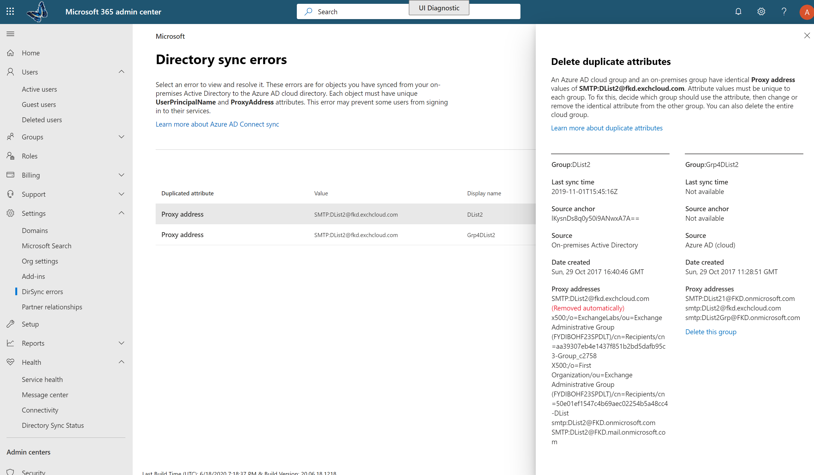

# Exibir erros de sincronização de diretório no Office 365View directory synchronization errors in Office 365

Você pode exibir os erros de sincronização de diretório no [centro de administração do Microsoft 365](https://admin.microsoft.com).You can view directory synchronization errors in the [Microsoft 365 admin center](https://admin.microsoft.com). Somente os erros de objeto do usuário são exibidos.Only the User object errors are displayed. Para exibir erros usando o PowerShell, consulte [identificar objetos com DirSyncProvisioningErrors](https://docs.microsoft.com/azure/active-directory/hybrid/how-to-connect-syncservice-duplicate-attribute-resiliency).To view errors by using PowerShell, see [Identify objects with DirSyncProvisioningErrors](https://docs.microsoft.com/azure/active-directory/hybrid/how-to-connect-syncservice-duplicate-attribute-resiliency).

Após a exibição, confira [corrigir problemas de sincronização de diretório para o Office 365](fix-problems-with-directory-synchronization.md) para corrigir quaisquer problemas identificados.After viewing, see [fixing problems with directory synchronization for Office 365](fix-problems-with-directory-synchronization.md) to correct any identified issues.
  
## Exibir erros de sincronização de diretório no centro de administraçãoView directory synchronization errors in the admin center

Para exibir qualquer erro no centro de administração:To view any errors in the admin center:
  
1. Entre no Office 365 com uma conta corporativa ou de estudante.Sign in to Office 365 with your work or school account. 
    
2. Vá até o [centro de administração](https://support.office.com/article/758befc4-0888-4009-9f14-0d147402fd23).Go to the [About the admin center](https://support.office.com/article/758befc4-0888-4009-9f14-0d147402fd23).
    
3. Na **Home** Page, você verá o bloco **status DirSync** .On the **Home** page you will see the **DirSync Status** tile. 
    
    
  
4. No bloco, escolha **status DirSync** para ir para a página **status de sincronização de diretório** .On the tile, choose **DirSync Status** to go to the **Directory Sync Status** page. 
    
    Na parte inferior da página, você pode ver se há erros dirSync.On the bottom of the page you can see if there are DirSync errors.
    
    
  
    Escolha encontramos **erros de objeto DirSync** para ir para um modo de exibição detalhado dos erros de sincronização de diretório.Choose **We found DirSync object errors** to go to a detailed view of the directory synchronization errors. 
    
    > [!NOTE]
    > Você também pode acessar a página **erros DirSync** se escolher erros de **objeto DirSync** no bloco de **status DirSync** .You can also go to the **DirSync errors** page if you choose **We found DirSync object errors** on the **DirSync status** tile. 
  

  
5. Na página **erros DirSync** , escolha qualquer um dos erros listados para exibir o painel de detalhes com informações sobre o erro e dicas sobre como corrigi-lo.On the **DirSync errors** page, choose any of the errors listed to display the details pane with information about the error and tips on how to fix it. 
