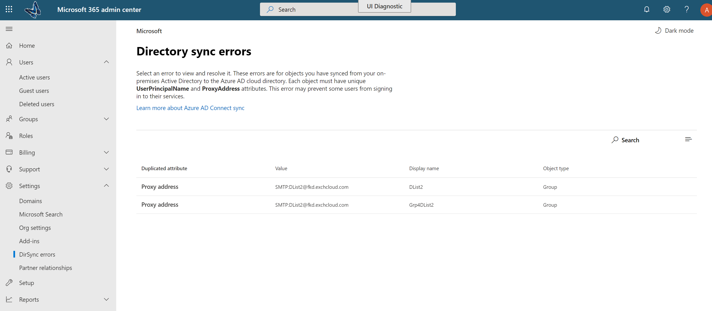

# Exibir erros de sincronização de diretórios no Office 365

Você pode exibir erros de sincronização de diretório no Centro de administração do Office 365. Somente os erros de objeto de usuário são exibidos. Para exibir erros usando o PowerShell, consulte [objetos de identidade com DirSyncProvisioningErrors](https://docs.microsoft.com/azure/active-directory/hybrid/how-to-connect-syncservice-duplicate-attribute-resiliency).

Depois de exibição, consulte [Corrigindo problemas com a sincronização de diretório para o Office 365](fix-problems-with-directory-synchronization.md) para corrigir os problemas identificados.
  
## Exibir erros de sincronização de diretório no Centro de administração

Para exibir quaisquer erros no Centro de administração:
  
1. Entre no Office 365 com a sua conta corporativa ou de estudante. 
    
2. Vá para o [Centro de administração sobre o Office 365](https://support.office.com/article/758befc4-0888-4009-9f14-0d147402fd23).
    
3. Na página **inicial** do, você verá a **Status do DirSync** lado a lado. 
    
    
  
4. Na organização lado o lado, escolha **DirSync Status** para ir para a página **Status da sincronização de diretório** . 
    
    Na parte inferior da página, você pode ver se há erros de DirSync.
    
    
  
    Escolha **encontramos DirSync erros de objeto** para ir para uma exibição detalhada dos erros de sincronização de diretório. 
    
    > [!NOTE]
    > Você também pode ir à página **DirSync erros** se você escolher **encontramos DirSync erros de objetos** no lado a lado **status de DirSync** . 
  

  
5. Na página **DirSync erros** , escolha qualquer um dos erros listados para exibir o painel de detalhes, com informações sobre o erro e dicas sobre como corrigi-lo. 
