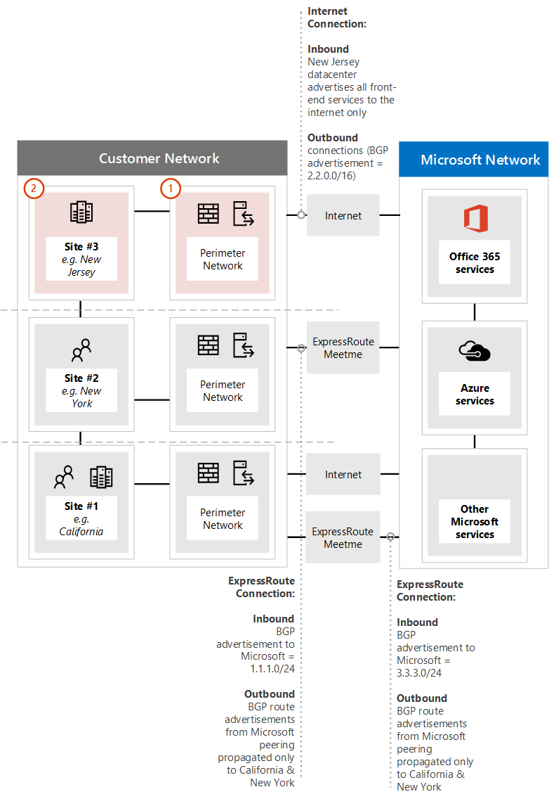

# <a name="implementing-expressroute-for-office-365"></a><span data-ttu-id="ede6e-106">Como implementar o ExpressRoute para Office 365</span><span class="sxs-lookup"><span data-stu-id="ede6e-106">Implementing ExpressRoute for Office 365</span></span>

<span data-ttu-id="ede6e-p102">ExpressRoute para o Office 365 fornece um caminho alternativo de roteamento para internet muitos enfrentados pelos serviços do Office 365. A arquitetura do ExpressRoute para o Office 365 se baseia em anuncie públicos prefixos IP dos serviços do Office 365 que já estão acessíveis através da Internet em seus circuitos ExpressRoute provisionados para redistribuição subsequente desses prefixos IP em sua rede. Com ExpressRoute você efetivamente habilitar várias diferentes caminhos de roteamento, através da internet e ExpressRoute, para muitos serviços do Office 365. Este estado do roteamento em sua rede pode representar uma alteração significativa para como sua topologia de rede interna é criada.</span><span class="sxs-lookup"><span data-stu-id="ede6e-p102">ExpressRoute for Office 365 provides an alternate routing path to many internet facing Office 365 services. The architecture of ExpressRoute for Office 365 is based on advertising public IP prefixes of Office 365 services that are already accessible over the Internet into your provisioned ExpressRoute circuits for subsequent redistribution of those IP prefixes into your network. With ExpressRoute you effectively enable several different routing paths, through the internet and through ExpressRoute, for many Office 365 services. This state of routing on your network may represent a significant change to how your internal network topology is designed.</span></span>
  
 <span data-ttu-id="ede6e-111">**Status:** Guia completo v2</span><span class="sxs-lookup"><span data-stu-id="ede6e-111">**Status:** Complete Guide v2</span></span>
  
<span data-ttu-id="ede6e-p103">Planeje cuidadosamente sua ExpressRoute para a implementação do Office 365 para acomodar para a complexidade da rede de ter de roteamento disponíveis via ambas um circuito dedicado com rotas inseridas no sua rede principal e a internet. Se você e sua equipe não executam o planejamento detalhado e teste neste guia, há um alto risco que você vai enfrentar intermitente ou uma perda total de conectividade para o Office 365 serviços quando o circuito ExpressRoute está habilitado.</span><span class="sxs-lookup"><span data-stu-id="ede6e-p103">You must carefully plan your ExpressRoute for Office 365 implementation to accommodate for the network complexities of having routing available via both a dedicated circuit with routes injected into your core network and the internet. If you and your team don't perform the detailed planning and testing in this guide, there is a high risk you'll experience intermittent or a total loss of connectivity to Office 365 services when the ExpressRoute circuit is enabled.</span></span>
  
<span data-ttu-id="ede6e-p104">Para uma implementação com êxito, você precisará analisar os requisitos de infraestrutura, passar a avaliação de rede detalhado e projetar, planejar a distribuição de maneira em estágios e controlada cuidadosamente e crie um plano de teste e a validação detalhada. Para um ambiente distribuído grande não é incomum ver implementações abranger vários meses. Este guia foi projetado para ajudá-lo a planejar com antecedência.</span><span class="sxs-lookup"><span data-stu-id="ede6e-p104">To have a successful implementation, you will need to analyze your infrastructure requirements, go through detailed network assessment and design, carefully plan the rollout in a staged and controlled manner, and build a detailed validation and testing plan. For a large, distributed environment it's not uncommon to see implementations span several months. This guide is designed to help you plan ahead.</span></span>
  
<span data-ttu-id="ede6e-p105">Implantações de grandes porte bem-sucedida podem tirar seis meses no planejamento e geralmente incluem os membros da equipe de várias áreas da organização, incluindo a rede, os administradores de servidor de Firewall e Proxy, administradores do Office 365, segurança, suporte ao usuário final, project gerenciamento e apoio executivo. Seu investimento no processo de planejamento reduzirá a probabilidade de que você vai sofrer falhas de implantação, resultando em tempo de inatividade ou solução de problemas complexas e caras.</span><span class="sxs-lookup"><span data-stu-id="ede6e-p105">Large successful deployments may take six months in planning and often include team members from many areas in the organization including networking, Firewall and Proxy server administrators, Office 365 administrators, security, end-user support, project management, and executive sponsorship. Your investment in the planning process will reduce the likelihood that you'll experience deployment failures resulting in downtime or complex and expensive troubleshooting.</span></span>
  
<span data-ttu-id="ede6e-119">Esperamos que os seguintes pré-requisitos para ser concluída antes que este guia de implementação é iniciado.</span><span class="sxs-lookup"><span data-stu-id="ede6e-119">We expect the following pre-requisites to be completed before this implementation guide is started.</span></span>
  
1. <span data-ttu-id="ede6e-120">Você concluiu uma avaliação de rede para determinar se ExpressRoute é recomendado e aprovada.</span><span class="sxs-lookup"><span data-stu-id="ede6e-120">You've completed a network assessment to determine if ExpressRoute is recommended and approved.</span></span>

2. <span data-ttu-id="ede6e-p106">Você selecionou um provedor de serviço de rede ExpressRoute. Encontre detalhes sobre os [parceiros de ExpressRoute e aos locais](https://azure.microsoft.com/documentation/articles/expressroute-locations/).</span><span class="sxs-lookup"><span data-stu-id="ede6e-p106">You've selected an ExpressRoute network service provider. Find details about the [ExpressRoute partners and peering locations](https://azure.microsoft.com/documentation/articles/expressroute-locations/).</span></span>

3. <span data-ttu-id="ede6e-123">Você já tenha lido e compreender a [documentação ExpressRoute](https://azure.microsoft.com/documentation/services/expressroute/) e a rede interna é capaz de atender aos ExpressRoute pré-requisitos ponta a ponta.</span><span class="sxs-lookup"><span data-stu-id="ede6e-123">You've already read and understand the [ExpressRoute documentation](https://azure.microsoft.com/documentation/services/expressroute/) and your internal network is able to meet ExpressRoute pre-requisites end to end.</span></span>

4. <span data-ttu-id="ede6e-124">Sua equipe tem ler todas as orientações pública e a documentação em [https://aka.ms/expressrouteoffice365](https://aka.ms/expressrouteoffice365), [https://aka.ms/ert](https://aka.ms/ert)e observadas da série [ExpressRoute do Windows Azure para treinamento do Office 365](https://channel9.msdn.com/series/aer) no Channel 9 para obter uma compreensão do críticos detalhes técnicos, incluindo:</span><span class="sxs-lookup"><span data-stu-id="ede6e-124">Your team has read all of the public guidance and documentation at [https://aka.ms/expressrouteoffice365](https://aka.ms/expressrouteoffice365), [https://aka.ms/ert](https://aka.ms/ert), and watched the [Azure ExpressRoute for Office 365 Training](https://channel9.msdn.com/series/aer) series on Channel 9 to gain an understanding of critical technical details including:</span></span>

      - <span data-ttu-id="ede6e-125">As dependências de internet dos serviços SaaS.</span><span class="sxs-lookup"><span data-stu-id="ede6e-125">The internet dependencies of SaaS services.</span></span>

      - <span data-ttu-id="ede6e-126">Como evitar assimétricas rotas e tratar do roteamento complexos.</span><span class="sxs-lookup"><span data-stu-id="ede6e-126">How to avoid asymmetric routes and handle complex routing.</span></span>

      - <span data-ttu-id="ede6e-127">Como incorporar a segurança de perímetro, disponibilidade e controles de nível de aplicativo.</span><span class="sxs-lookup"><span data-stu-id="ede6e-127">How to incorporate perimeter security, availability, and application level controls.</span></span>

## <a name="begin-by-gathering-requirements"></a><span data-ttu-id="ede6e-128">Comece a coleta de requisitos</span><span class="sxs-lookup"><span data-stu-id="ede6e-128">Begin by gathering requirements</span></span>
<span data-ttu-id="ede6e-129"><a name="requirements"> </a></span><span class="sxs-lookup"><span data-stu-id="ede6e-129"></span></span>

<span data-ttu-id="ede6e-p107">Inicie determinando quais recursos e serviços que você planeja adotar dentro da sua organização. Você precisa determinar quais recursos dos serviços do Office 365 diferentes serão usados e quais locais em sua rede hospedará pessoas que usam esses recursos. Com o catálogo de cenários, é necessário adicionar a rede de atributos que cada um desses cenários exigem; como os fluxos de tráfego de rede de entrada e saída e se os pontos de extremidade do Office 365 estão disponíveis via ExpressRoute ou não.</span><span class="sxs-lookup"><span data-stu-id="ede6e-p107">Start by determining which features and services you plan to adopt within your organization. You need to determine which features of the different Office 365 services will be used and which locations on your network will host people using those features. With the catalog of scenarios, you need to add the network attributes that each of those scenarios require; such as inbound and outbound network traffic flows and if the Office 365 endpoints are available over ExpressRoute or not.</span></span>
  
<span data-ttu-id="ede6e-133">Para coletar os requisitos da sua organização:</span><span class="sxs-lookup"><span data-stu-id="ede6e-133">To gather your organization's requirements:</span></span>
  
- <span data-ttu-id="ede6e-p108">Catálogo o tráfego de rede de entrada e saída para os sua organização estiver usando serviços do Office 365. Consulte a página de intervalos de endereço IP e URLs do Office 365 para a descrição de fluxos que exigem diferentes cenários do Office 365.</span><span class="sxs-lookup"><span data-stu-id="ede6e-p108">Catalog the inbound and outbound network traffic for the Office 365 services your organization is using. Consult Office 365 URLs and IP address ranges page for the description of flows that different Office 365 scenarios require.</span></span>

- <span data-ttu-id="ede6e-136">Reunir documentação da topologia de rede existente mostrando detalhes do seu backbone de rede de longa distância interna e a topologia, a conectividade dos sites de satélite, conectividade de usuário milha última, o roteamento para os pontos de saída do perímetro de rede e serviços de proxy.</span><span class="sxs-lookup"><span data-stu-id="ede6e-136">Gather documentation of existing network topology showing details of your internal WAN backbone and topology, connectivity of satellite sites, last mile user connectivity, routing to network perimeter egress points, and proxy services.</span></span>

  - <span data-ttu-id="ede6e-137">Identifique os pontos de extremidade de serviço de entrada nos diagramas de rede que outros serviços do Microsoft Office 365 e o conectará à, mostrando a internet e caminhos de conexão ExpressRoute propostos.</span><span class="sxs-lookup"><span data-stu-id="ede6e-137">Identify inbound service endpoints on the network diagrams that Office 365 and other Microsoft services will connect to, showing both internet and proposed ExpressRoute connection paths.</span></span>

  - <span data-ttu-id="ede6e-138">Identifique todos os locais do usuário geográfica e conectividade WAN entre locais, juntamente com os quais locais têm atualmente uma saída para a internet e quais locais são propostos para ter uma saída para um local de correspondência ExpressRoute.</span><span class="sxs-lookup"><span data-stu-id="ede6e-138">Identify all geographic user locations and WAN connectivity between locations along with which locations currently have an egress to the internet and which locations are proposed to have an egress to an ExpressRoute peering location.</span></span>

  - <span data-ttu-id="ede6e-139">Identificar todos os dispositivos de borda, como proxies, firewalls e assim por diante e elas se relacionam fluxos indo pela Internet e ExpressRoute de catálogo.</span><span class="sxs-lookup"><span data-stu-id="ede6e-139">Identify all edge devices, such as proxies, firewalls, and so on and catalog their relationship to flows going over the Internet and ExpressRoute.</span></span>

  - <span data-ttu-id="ede6e-140">Se os usuários finais irão acessar os serviços do Office 365 via roteamento direct ou proxy de aplicativo indiretas para fluxos de Internet e ExpressRoute do documento.</span><span class="sxs-lookup"><span data-stu-id="ede6e-140">Document whether end users will access Office 365 services via direct routing or indirect application proxy for both Internet and ExpressRoute flows.</span></span>

- <span data-ttu-id="ede6e-141">Adicionar o local do seu locatário e atender-me locais ao seu diagrama de rede.</span><span class="sxs-lookup"><span data-stu-id="ede6e-141">Add the location of your tenant and meet-me locations to your network diagram.</span></span>

- <span data-ttu-id="ede6e-p109">Estime as rede esperado e observado latência características de desempenho e de locais de usuário principal para o Office 365. Tenha em mente que o Office 365 é um conjunto global e distribuído de serviços e usuários se conectarão ao locais que podem ser diferentes do local de seus inquilinos. Por esse motivo, é recomendável para medir e otimizar a latência entre o usuário e a borda mais próxima da rede global da Microsoft através de conexões de ExpressRoute e a Internet. Você pode usar as descobertas de avaliação de rede para auxiliar com esta tarefa.</span><span class="sxs-lookup"><span data-stu-id="ede6e-p109">Estimate the expected and observed network performance and latency characteristics from major user locations to Office 365. Keep in mind that Office 365 is a global and distributed set of services and users will be connecting to locations that may be different from the location of their tenant. For this reason, it is recommended to measure and optimize for latency between the user and the closest edge of Microsoft global network over ExpressRoute and Internet connections. You can use your findings from the network assessment to aid with this task.</span></span>

- <span data-ttu-id="ede6e-p110">Lista os requisitos de alta disponibilidade que precisam ser atendidos com a nova conexão ExpressRoute e segurança da rede de empresa. Por exemplo, como os usuários continuarão obter acesso ao Office 365 em caso da saída de Internet ou falha de circuito de ExpressRoute.</span><span class="sxs-lookup"><span data-stu-id="ede6e-p110">List company network security and high availability requirements that need to be met with the new ExpressRoute connection. For example, how do users continue to get access to Office 365 in the event of the Internet egress or ExpressRoute circuit failure.</span></span>

- <span data-ttu-id="ede6e-p111">Documento quais Office 365 de rede de entrada e saída flui usará o caminho da Internet e que usará ExpressRoute. As especificações de localizações geográficas dos seus usuários e os detalhes de sua topologia de rede local podem exigir o plano seja diferente do local de um usuário para outro.</span><span class="sxs-lookup"><span data-stu-id="ede6e-p111">Document which inbound and outbound Office 365 network flows will use the Internet path and which will use ExpressRoute. The specifics of geographical locations of your users and details of your on-premises network topology may require the plan to be different from one user location to another.</span></span>

### <a name="catalog-your-outbound-and-inbound-network-traffic"></a><span data-ttu-id="ede6e-150">O tráfego de rede de entrada e saída do catálogo</span><span class="sxs-lookup"><span data-stu-id="ede6e-150">Catalog your outbound and inbound network traffic</span></span>
<span data-ttu-id="ede6e-151"><a name="trafficCatalog"> </a></span><span class="sxs-lookup"><span data-stu-id="ede6e-151"></span></span>

<span data-ttu-id="ede6e-p112">Para minimizar a complexidade de rede de roteamento e outros, é recomendável que você só use ExpressRoute para o Office 365 para os fluxos de tráfego de rede que são necessárias para passar por uma conexão dedicado devido aos requisitos normativos ou como resultado da avaliação de rede. Além disso, recomendamos que você deve preparar o escopo dos fluxos de tráfego de rede de entrada e saída de roteamento e a abordagem de ExpressRoute como diferentes e distintos estágios do projeto de implementação. Implantar ExpressRoute para Office 365 para o usuário apenas iniciadas fluxos de tráfego de rede de saída e deixe fluxos de tráfego de rede de entrada pela Internet podem ajudar a controlar o aumento no topológica complexidade e os riscos de apresentando adicionais assimétrica possibilidades de roteamento.</span><span class="sxs-lookup"><span data-stu-id="ede6e-p112">To minimize routing and other network complexities, we recommend that you only use ExpressRoute for Office 365 for the network traffic flows that are required to go over a dedicated connection due to regulatory requirements or as the result of the network assessment. Additionally, we recommend that you stage the scope of ExpressRoute routing and approach outbound and inbound network traffic flows as different and distinct stages of the implementation project. Deploy ExpressRoute for Office 365 for just user initiated outbound network traffic flows and leave inbound network traffic flows across the Internet can help to control the increase in topological complexity and risks of introducing additional asymmetric routing possibilities.</span></span>
  
<span data-ttu-id="ede6e-155">Seu catálogo de tráfego de rede deve conter listagens de todas as conexões de rede de entrada e saída que você vai ter entre sua rede local e a Microsoft.</span><span class="sxs-lookup"><span data-stu-id="ede6e-155">Your network traffic catalog should contain listings of all the inbound and outbound network connections that you'll have between your on-premises network and Microsoft.</span></span>
  
- <span data-ttu-id="ede6e-p113">Fluxos de tráfego de rede de saída são quaisquer cenários onde uma conexão é iniciado do seu ambiente local, como os clientes internos ou servidores, com um destino dos serviços do Microsoft. Essas conexões podem ser diretas para o Office 365 ou indiretas, como quando a conexão passa servidores proxy, firewalls ou outros dispositivos de rede no caminho para o Office 365.</span><span class="sxs-lookup"><span data-stu-id="ede6e-p113">Outbound network traffic flows are any scenarios where a connection is initiated from your on-premises environment, such as from internal clients or servers, with a destination of the Microsoft services. These connections may be direct to Office 365 or indirect, such as when the connection goes through proxy servers, firewalls, or other networking devices on the path to Office 365.</span></span>

- <span data-ttu-id="ede6e-p114">Fluxos de tráfego de rede de entrada são quaisquer cenários onde uma conexão é iniciada de nuvem da Microsoft para um host local. Essas conexões geralmente precisam passar por meio do firewall e outra infraestrutura de segurança que requer a diretiva de segurança do cliente para fluxos de originado externamente.</span><span class="sxs-lookup"><span data-stu-id="ede6e-p114">Inbound network traffic flows are any scenarios where a connection is initiated from the Microsoft cloud to an on-premises host. These connections typically need to go through firewall and other security infrastructure that customer security policy requires for externally originated flows.</span></span>

<span data-ttu-id="ede6e-160">Leia a seção **simetria da rota de garantia** do artigo [roteamento com ExpressRoute para o Office 365](https://support.office.com/article/Routing-with-ExpressRoute-for-Office-365-e1da26c6-2d39-4379-af6f-4da213218408) para determinar quais serviços enviará o tráfego de entrada e procure a coluna marcada **ExpressRoute para o Office 365** no [Office 365 pontos de extremidade](https://support.office.com/article/Office-365-URLs-and-IP-address-ranges-8548a211-3fe7-47cb-abb1-355ea5aa88a2) artigo de referência para determinar o restante das informações de conectividade.</span><span class="sxs-lookup"><span data-stu-id="ede6e-160">Read the **Ensuring route symmetry** section of the article [Routing with ExpressRoute for Office 365](https://support.office.com/article/Routing-with-ExpressRoute-for-Office-365-e1da26c6-2d39-4379-af6f-4da213218408) to determine which services will send inbound traffic and look for the column marked **ExpressRoute for Office 365** in the [Office 365 endpoints](https://support.office.com/article/Office-365-URLs-and-IP-address-ranges-8548a211-3fe7-47cb-abb1-355ea5aa88a2) reference article to determine the rest of the connectivity information.</span></span>
  
<span data-ttu-id="ede6e-161">Para cada serviço que requer uma conexão de saída, você vai querer descrevem a conectividade planejada para o serviço, incluindo o roteamento de rede, a configuração de proxy, inspeção de pacotes, e precisa de largura de banda.</span><span class="sxs-lookup"><span data-stu-id="ede6e-161">For each service that requires an outbound connection, you'll want to describe the planned connectivity for the service including network routing, proxy configuration, packet inspection, and bandwidth needs.</span></span>
  
<span data-ttu-id="ede6e-p115">Para cada serviço que requer uma conexão de entrada, você precisará algumas informações adicionais. Servidores em nuvem da Microsoft estabelecerá conexões à sua rede local. para garantir que as conexões sejam feitas corretamente, você vai querer descrevem todos os aspectos dessa conectividade, inclusive; as entradas DNS públicas para os serviços que aceitarão essas conexões de entrada, o CIDR formatado endereços de IP de IPv4, qual equipamento ISP está envolvido, e como entrada de NAT ou fonte NAT é tratado para essas conexões.</span><span class="sxs-lookup"><span data-stu-id="ede6e-p115">For each service that requires an inbound connection, you'll need some additional information. Servers in the Microsoft cloud will establish connections to your on-premises network. to ensure the connections are made correctly, you'll want to describe all aspects of this connectivity, including; the public DNS entries for the services that will accept these inbound connections, the CIDR formatted IPv4 IP addresses, which ISP equipment is involved, and how inbound NAT or source NAT is handled for these connections.</span></span>
  
<span data-ttu-id="ede6e-p116">Conexões de entrada devem ser revisadas independentemente se estiver se conectando pela internet ou ainda não foram introduzido ExpressRoute para garantir o roteamento assimétrico. Em alguns casos, local pontos de extremidade de serviços do Office 365 iniciam conexões de entrada para maio também precisam ser acessados por outros Microsoft e os serviços de não-Microsoft. É fundamental que habilitar ExpressRoute o roteamento para esses serviços para o Office 365 não quebra a outros cenários. Em muitos casos, os clientes, talvez seja necessário implementar as alterações específicas à sua rede interna, como fonte com base em NAT, para assegurar que os fluxos de entrada da Microsoft permaneçam simétricos após ExpressRoute está habilitado.</span><span class="sxs-lookup"><span data-stu-id="ede6e-p116">Inbound connections should be reviewed regardless of whether they're connecting over the internet or ExpressRoute to ensure asymmetric routing hasn't been introduced. In some cases, on-premises endpoints that Office 365 services initiate inbound connections to may also need to be accessed by other Microsoft and non-Microsoft services. It is paramount that enabling ExpressRoute routing to these services for Office 365 purposes doesn't break other scenarios. In many cases, customers may need to implement specific changes to their internal network, such as source based NAT, to ensure that inbound flows from Microsoft remain symmetric after ExpressRoute is enabled.</span></span>
  
<span data-ttu-id="ede6e-p117">Aqui está um exemplo do nível de detalhes necessário. Nesse caso Exchange híbrido seria encaminhar para o sistema local via ExpressRoute.</span><span class="sxs-lookup"><span data-stu-id="ede6e-p117">Here's a sample of the level of detail required. In this case Exchange Hybrid would route to the on-premises system over ExpressRoute.</span></span>

|<span data-ttu-id="ede6e-171">**Propriedade de Conexão**</span><span class="sxs-lookup"><span data-stu-id="ede6e-171">**Connection property**</span></span>|<span data-ttu-id="ede6e-172">**Valor**</span><span class="sxs-lookup"><span data-stu-id="ede6e-172">**Value**</span></span>|
|:-----|:-----|
|<span data-ttu-id="ede6e-173">**Direção do tráfego de rede**</span><span class="sxs-lookup"><span data-stu-id="ede6e-173">**Network traffic direction**</span></span> <br/> |<span data-ttu-id="ede6e-174">entrada</span><span class="sxs-lookup"><span data-stu-id="ede6e-174">Inbound</span></span>  <br/> |
|<span data-ttu-id="ede6e-175">**Serviço**</span><span class="sxs-lookup"><span data-stu-id="ede6e-175">**Service**</span></span> <br/> |<span data-ttu-id="ede6e-176">Exchange híbrido</span><span class="sxs-lookup"><span data-stu-id="ede6e-176">Exchange Hybrid</span></span>  <br/> |
|<span data-ttu-id="ede6e-177">**Público ponto de extremidade do Office 365 (origem)**</span><span class="sxs-lookup"><span data-stu-id="ede6e-177">**Public Office 365 endpoint (source)**</span></span> <br/> |<span data-ttu-id="ede6e-178">O Exchange Online (endereços IP)</span><span class="sxs-lookup"><span data-stu-id="ede6e-178">Exchange Online (IP addresses)</span></span>  <br/> |
|<span data-ttu-id="ede6e-179">**Público ponto de extremidade de local (de destino)**</span><span class="sxs-lookup"><span data-stu-id="ede6e-179">**Public On-Premises Endpoint (destination)**</span></span> <br/> |<span data-ttu-id="ede6e-180">5.5.5.5</span><span class="sxs-lookup"><span data-stu-id="ede6e-180">5.5.5.5</span></span>  <br/> |
|<span data-ttu-id="ede6e-181">**Entrada de (Internet) DNS pública**</span><span class="sxs-lookup"><span data-stu-id="ede6e-181">**Public (Internet) DNS entry**</span></span> <br/> |<span data-ttu-id="ede6e-182">Autodiscover.contoso.com</span><span class="sxs-lookup"><span data-stu-id="ede6e-182">Autodiscover.contoso.com</span></span>  <br/> |
|<span data-ttu-id="ede6e-183">**Será esse ponto de extremidade de local usado para por outros serviços da Microsoft (não - Office 365)**</span><span class="sxs-lookup"><span data-stu-id="ede6e-183">**Will this on-premises endpoint be used for by other (non-Office 365) Microsoft services**</span></span> <br/> |<span data-ttu-id="ede6e-184">Não</span><span class="sxs-lookup"><span data-stu-id="ede6e-184">No</span></span>  <br/> |
|<span data-ttu-id="ede6e-185">**Neste ponto de extremidade de local será usado pelos usuários/sistemas na Internet**</span><span class="sxs-lookup"><span data-stu-id="ede6e-185">**Will this on-premises endpoint be used by users/systems on the Internet**</span></span> <br/> |<span data-ttu-id="ede6e-186">Sim</span><span class="sxs-lookup"><span data-stu-id="ede6e-186">Yes</span></span>  <br/> |
|<span data-ttu-id="ede6e-187">**Sistemas internos publicado por meio de pontos de extremidade públicos**</span><span class="sxs-lookup"><span data-stu-id="ede6e-187">**Internal systems published through public endpoints**</span></span> <br/> |<span data-ttu-id="ede6e-188">Função acesso para cliente do Exchange Server (local) 192.168.101, 192.168.102, 192.168.103</span><span class="sxs-lookup"><span data-stu-id="ede6e-188">Exchange Server client access role (on-premises) 192.168.101, 192.168.102, 192.168.103</span></span>  <br/> |
|<span data-ttu-id="ede6e-189">**Anúncio de IP do ponto de extremidade público**</span><span class="sxs-lookup"><span data-stu-id="ede6e-189">**IP advertisement of the public endpoint**</span></span> <br/> |<span data-ttu-id="ede6e-190">**Para Internet**: 5.5.0.0/16</span><span class="sxs-lookup"><span data-stu-id="ede6e-190">**To Internet**: 5.5.0.0/16</span></span>  <br/> <span data-ttu-id="ede6e-191">**Para ExpressRoute**: 5.5.5.0/24</span><span class="sxs-lookup"><span data-stu-id="ede6e-191">**To ExpressRoute**: 5.5.5.0/24</span></span>  <br/> |
|<span data-ttu-id="ede6e-192">**Controles de segurança/perímetro**</span><span class="sxs-lookup"><span data-stu-id="ede6e-192">**Security/Perimeter Controls**</span></span> <br/> |<span data-ttu-id="ede6e-193">**Caminho de Internet**: DeviceID_002</span><span class="sxs-lookup"><span data-stu-id="ede6e-193">**Internet path**: DeviceID_002</span></span>  <br/> <span data-ttu-id="ede6e-194">**Caminho de ExpressRoute**: DeviceID_003</span><span class="sxs-lookup"><span data-stu-id="ede6e-194">**ExpressRoute path**: DeviceID_003</span></span>  <br/> |
|<span data-ttu-id="ede6e-195">**Alta disponibilidade**</span><span class="sxs-lookup"><span data-stu-id="ede6e-195">**High Availability**</span></span> <br/> |<span data-ttu-id="ede6e-196">Ativa/ativa entre 2 geograficamente redundante</span><span class="sxs-lookup"><span data-stu-id="ede6e-196">Active/Active across 2 geo-redundant</span></span>  <br/> <span data-ttu-id="ede6e-197">ExpressRoute circuitos - Chicago e Dallas</span><span class="sxs-lookup"><span data-stu-id="ede6e-197">ExpressRoute circuits - Chicago and Dallas</span></span>  <br/> |
|<span data-ttu-id="ede6e-198">**Controle de simetria de caminho**</span><span class="sxs-lookup"><span data-stu-id="ede6e-198">**Path symmetry control**</span></span> <br/> |<span data-ttu-id="ede6e-199">**Método**: NAT de origem</span><span class="sxs-lookup"><span data-stu-id="ede6e-199">**Method**: Source NAT</span></span>  <br/> <span data-ttu-id="ede6e-200">**Caminho de Internet**: origem NAT as conexões 192.168.5.5 de entrada</span><span class="sxs-lookup"><span data-stu-id="ede6e-200">**Internet path**: Source NAT inbound connections to 192.168.5.5</span></span>  <br/> |<span data-ttu-id="ede6e-201">**Caminho de ExpressRoute**: conexões de fonte NAT 192.168.1.0 (Chicago) e 192.168.2.0 (Dallas)</span><span class="sxs-lookup"><span data-stu-id="ede6e-201">**ExpressRoute path**: Source NAT connections to 192.168.1.0 (Chicago) and 192.168.2.0 (Dallas)</span></span>  <br/> |

<span data-ttu-id="ede6e-202">Aqui está um exemplo de um serviço que só é saído:</span><span class="sxs-lookup"><span data-stu-id="ede6e-202">Here's a sample of a service that is outbound only:</span></span>
|<span data-ttu-id="ede6e-203">**Propriedade de Conexão**</span><span class="sxs-lookup"><span data-stu-id="ede6e-203">**Connection property**</span></span>|<span data-ttu-id="ede6e-204">**Valor**</span><span class="sxs-lookup"><span data-stu-id="ede6e-204">**Value**</span></span>|
|:-----|:-----|
|<span data-ttu-id="ede6e-205">**Direção do tráfego de rede**</span><span class="sxs-lookup"><span data-stu-id="ede6e-205">**Network traffic direction**</span></span> <br/> |<span data-ttu-id="ede6e-206">Saída</span><span class="sxs-lookup"><span data-stu-id="ede6e-206">Outbound</span></span>  <br/> |
|<span data-ttu-id="ede6e-207">**Serviço**</span><span class="sxs-lookup"><span data-stu-id="ede6e-207">**Service**</span></span> <br/> |<span data-ttu-id="ede6e-208">SharePoint Online</span><span class="sxs-lookup"><span data-stu-id="ede6e-208">SharePoint Online</span></span>  <br/> |
|<span data-ttu-id="ede6e-209">**Ponto de extremidade de local (origem)**</span><span class="sxs-lookup"><span data-stu-id="ede6e-209">**On-premises endpoint (source)**</span></span> <br/> |<span data-ttu-id="ede6e-210">Estação de trabalho do usuário</span><span class="sxs-lookup"><span data-stu-id="ede6e-210">User workstation</span></span>  <br/> |
|<span data-ttu-id="ede6e-211">**Público ponto de extremidade do Office 365 (de destino)**</span><span class="sxs-lookup"><span data-stu-id="ede6e-211">**Public Office 365 endpoint (destination)**</span></span> <br/> |<span data-ttu-id="ede6e-212">SharePoint Online (endereços IP)</span><span class="sxs-lookup"><span data-stu-id="ede6e-212">SharePoint Online (IP addresses)</span></span>  <br/> |
|<span data-ttu-id="ede6e-213">**Entrada de (Internet) DNS pública**</span><span class="sxs-lookup"><span data-stu-id="ede6e-213">**Public (Internet) DNS entry**</span></span> <br/> |<span data-ttu-id="ede6e-214">\*. sharepoint.com (e FQDNs adicionais)</span><span class="sxs-lookup"><span data-stu-id="ede6e-214">\*.sharepoint.com (and additional FQDNs)</span></span>  <br/> |
|<span data-ttu-id="ede6e-215">**Referências de CDN**</span><span class="sxs-lookup"><span data-stu-id="ede6e-215">**CDN Referrals**</span></span> <br/> |<span data-ttu-id="ede6e-216">CDN.sharepointonline.com (e FQDNs adicionais) - endereços IP mantidas por provedores CDN)</span><span class="sxs-lookup"><span data-stu-id="ede6e-216">cdn.sharepointonline.com (and additional FQDNs) - IP addresses maintained by CDN providers)</span></span>  <br/> |
|<span data-ttu-id="ede6e-217">**Anúncio de IP e NAT em uso**</span><span class="sxs-lookup"><span data-stu-id="ede6e-217">**IP advertisement and NAT in use**</span></span> <br/> |<span data-ttu-id="ede6e-218">**Caminho de Internet/NAT de origem**: 1.1.1.0/24</span><span class="sxs-lookup"><span data-stu-id="ede6e-218">**Internet path/Source NAT**: 1.1.1.0/24</span></span>  <br/> <span data-ttu-id="ede6e-219">**Caminho de ExpressRoute/NAT de origem**: 1.1.2.0/24 (Chicago) e 1.1.3.0/24 (Dallas)</span><span class="sxs-lookup"><span data-stu-id="ede6e-219">**ExpressRoute path/Source NAT**: 1.1.2.0/24 (Chicago) and 1.1.3.0/24 (Dallas)</span></span>  <br/> |
|<span data-ttu-id="ede6e-220">**Método de conectividade**</span><span class="sxs-lookup"><span data-stu-id="ede6e-220">**Connectivity method**</span></span> <br/> |<span data-ttu-id="ede6e-221">**Internet**: por meio do proxy de camada 7 (arquivo. PAC)</span><span class="sxs-lookup"><span data-stu-id="ede6e-221">**Internet**: via layer 7 proxy (.pac file)</span></span>  <br/> <span data-ttu-id="ede6e-222">**ExpressRoute**: direcionar circulação (nenhum proxy)</span><span class="sxs-lookup"><span data-stu-id="ede6e-222">**ExpressRoute**: direct routing (no proxy)</span></span>  <br/> |
|<span data-ttu-id="ede6e-223">**Controles de segurança/perímetro**</span><span class="sxs-lookup"><span data-stu-id="ede6e-223">**Security/Perimeter Controls**</span></span> <br/> |<span data-ttu-id="ede6e-224">**Caminho de Internet**: DeviceID_002</span><span class="sxs-lookup"><span data-stu-id="ede6e-224">**Internet path**: DeviceID_002</span></span>  <br/> <span data-ttu-id="ede6e-225">**Caminho de ExpressRoute**: DeviceID_003</span><span class="sxs-lookup"><span data-stu-id="ede6e-225">**ExpressRoute path**: DeviceID_003</span></span>  <br/> |
|<span data-ttu-id="ede6e-226">**Alta disponibilidade**</span><span class="sxs-lookup"><span data-stu-id="ede6e-226">**High Availability**</span></span> <br/> |<span data-ttu-id="ede6e-227">**Caminho de Internet**: saída do internet redundantes</span><span class="sxs-lookup"><span data-stu-id="ede6e-227">**Internet path**: Redundant internet egress</span></span>  <br/> <span data-ttu-id="ede6e-228">**Caminho de ExpressRoute**: ativa/ativa 'quente Batata' roteamento entre 2 circuitos ExpressRoute geograficamente redundante - Chicago e Dallas</span><span class="sxs-lookup"><span data-stu-id="ede6e-228">**ExpressRoute path**: Active/Active 'hot potato' routing across 2 geo-redundant ExpressRoute circuits - Chicago and Dallas</span></span>  <br/> |
|<span data-ttu-id="ede6e-229">**Controle de simetria de caminho**</span><span class="sxs-lookup"><span data-stu-id="ede6e-229">**Path symmetry control**</span></span> <br/> |<span data-ttu-id="ede6e-230">**Método**: NAT para todas as conexões de fonte</span><span class="sxs-lookup"><span data-stu-id="ede6e-230">**Method**: Source NAT for all connections</span></span>  <br/> |

### <a name="your-network-topology-design-with-regional-connectivity"></a><span data-ttu-id="ede6e-231">Design de sua topologia de rede com conectividade regional</span><span class="sxs-lookup"><span data-stu-id="ede6e-231">Your network topology design with regional connectivity</span></span>
<span data-ttu-id="ede6e-232"><a name="topology"> </a></span><span class="sxs-lookup"><span data-stu-id="ede6e-232"></span></span>

<span data-ttu-id="ede6e-p118">Depois que você entende os serviços e seus fluxos de tráfego de rede associado, você pode criar um diagrama de rede que incorpora esses novos requisitos de conectividade e ilustra as alterações que você fará para usar ExpressRoute para o Office 365. O diagrama deve incluir:</span><span class="sxs-lookup"><span data-stu-id="ede6e-p118">Once you understand the services and their associated network traffic flows, you can create a network diagram that incorporates these new connectivity requirements and illustrates the changes you'll make to use ExpressRoute for Office 365. Your diagram should include:</span></span>
  
1. <span data-ttu-id="ede6e-235">Onde o Office 365 e outros serviços serão acessados de todos os locais de usuário.</span><span class="sxs-lookup"><span data-stu-id="ede6e-235">All user locations where Office 365 and other services will be accessed from.</span></span>

2. <span data-ttu-id="ede6e-236">Todos os pontos de saída ExpressRoute e da internet.</span><span class="sxs-lookup"><span data-stu-id="ede6e-236">All internet and ExpressRoute egress points.</span></span>

3. <span data-ttu-id="ede6e-237">Dispositivos de saída e de entrada todos os que gerenciam a conectividade dentro e fora da rede, inclusive roteadores, firewalls, servidores de proxy de aplicativo e detecção de intrusão/prevenção.</span><span class="sxs-lookup"><span data-stu-id="ede6e-237">All outbound and inbound devices that manage connectivity in and out of the network, including routers, firewalls, application proxy servers, and intrusion detection/prevention.</span></span>

4. <span data-ttu-id="ede6e-238">Destinos internos para todo o tráfego de entrada, como os servidores internos do ADFS que aceitar conexões de servidores de proxy de aplicativo da web do ADFS.</span><span class="sxs-lookup"><span data-stu-id="ede6e-238">Internal destinations for all inbound traffic, such as internal ADFS servers that accept connections from the ADFS web application proxy servers.</span></span>

5. <span data-ttu-id="ede6e-239">Catálogo de todas as sub-redes IP que será anunciado</span><span class="sxs-lookup"><span data-stu-id="ede6e-239">Catalog of all IP subnets that will be advertised</span></span>

6. <span data-ttu-id="ede6e-240">Identifique cada local onde as pessoas serão acessar o Office 365 de e listar o reunir-me locais que serão usados para ExpressRoute.</span><span class="sxs-lookup"><span data-stu-id="ede6e-240">Identify each location where people will access Office 365 from and list the meet-me locations that will be used for ExpressRoute.</span></span>

7. <span data-ttu-id="ede6e-241">Locais e partes de sua topologia de rede interna, onde os prefixos de IP Microsoft aprendidos ExpressRoute serão aceitas, filtrados e propagadas para.</span><span class="sxs-lookup"><span data-stu-id="ede6e-241">Locations and portions of your internal network topology, where Microsoft IP prefixes learned from ExpressRoute will be accepted, filtered and propagated to.</span></span>

8. <span data-ttu-id="ede6e-242">A topologia de rede deve ilustram a localização geográfica de cada segmento de rede e como ele se conecta à rede Microsoft via ExpressRoute e/ou a Internet.</span><span class="sxs-lookup"><span data-stu-id="ede6e-242">The network topology should illustrate the geographic location of each network segment and how it connects to the Microsoft network over ExpressRoute and/or the Internet.</span></span>

<span data-ttu-id="ede6e-243">O diagrama abaixo mostra cada local onde as pessoas usarão Office 365 de junto com os anúncios de roteamento de entrada e saídos para o Office 365.</span><span class="sxs-lookup"><span data-stu-id="ede6e-243">The diagram below shows each location where people will be using Office 365 from along with the inbound and outbound routing advertisements to Office 365.</span></span>
  

  
<span data-ttu-id="ede6e-245">Para tráfego de saída, as pessoas acessar o Office 365 em uma destas três formas:</span><span class="sxs-lookup"><span data-stu-id="ede6e-245">For outbound traffic, the people access Office 365 in one of three ways:</span></span>
  
1. <span data-ttu-id="ede6e-246">Por meio de uma reunião-me local na América do Norte para as pessoas na Califórnia.</span><span class="sxs-lookup"><span data-stu-id="ede6e-246">Through a meet-me location in North America for the people in California.</span></span>

2. <span data-ttu-id="ede6e-247">Por meio de uma reunião-me local em Hong Kong para as pessoas em Hong Kong.</span><span class="sxs-lookup"><span data-stu-id="ede6e-247">Through a meet-me location in Hong Kong for the people in Hong Kong.</span></span>

3. <span data-ttu-id="ede6e-248">Através da internet, em Bangladesh onde há menos pessoas e nenhum circuito ExpressRoute provisionado.</span><span class="sxs-lookup"><span data-stu-id="ede6e-248">Through the internet in Bangladesh where there are fewer people and no ExpressRoute circuit provisioned.</span></span>


  
<span data-ttu-id="ede6e-250">Da mesma forma, o tráfego de rede de entrada do Office 365 retorna uma destas três formas:</span><span class="sxs-lookup"><span data-stu-id="ede6e-250">Similarly, the inbound network traffic from Office 365 returns in one of three ways:</span></span>
  
1. <span data-ttu-id="ede6e-251">Por meio de uma reunião-me local na América do Norte para as pessoas na Califórnia.</span><span class="sxs-lookup"><span data-stu-id="ede6e-251">Through a meet-me location in North America for the people in California.</span></span>

2. <span data-ttu-id="ede6e-252">Por meio de uma reunião-me local em Hong Kong para as pessoas em Hong Kong.</span><span class="sxs-lookup"><span data-stu-id="ede6e-252">Through a meet-me location in Hong Kong for the people in Hong Kong.</span></span>

3. <span data-ttu-id="ede6e-253">Através da internet, em Bangladesh onde há menos pessoas e nenhum circuito ExpressRoute provisionado.</span><span class="sxs-lookup"><span data-stu-id="ede6e-253">Through the internet in Bangladesh where there are fewer people and no ExpressRoute circuit provisioned.</span></span>


  
### <a name="determine-the-appropriate-meet-me-location"></a><span data-ttu-id="ede6e-255">Determinar o reunir apropriado-me local</span><span class="sxs-lookup"><span data-stu-id="ede6e-255">Determine the appropriate meet-me location</span></span>

<span data-ttu-id="ede6e-p119">A seleção de reunir-me locais, que são o local físico onde o seu circuito ExpressRoute conecta sua rede à rede Microsoft, é influenciada pelos locais onde as pessoas irão acessar o Office 365 de. Como uma oferta de SaaS, o Office 365 não funcionam sob o modelo regional IaaS ou PaaS da mesma maneira que o Azure faz. Em vez disso, o Office 365 é um conjunto de distribuída dos serviços de colaboração, onde os usuários talvez precisem se conectar aos pontos de extremidade em vários data centers e regiões, que não estejam necessariamente no mesmo local ou na região onde o locatário do usuário está hospedado.</span><span class="sxs-lookup"><span data-stu-id="ede6e-p119">The selection of meet-me locations, which are the physical location where your ExpressRoute circuit connects your network to the Microsoft network, is influenced by the locations where people will access Office 365 from. As a SaaS offering, Office 365 does not operate under the IaaS or PaaS regional model in the same way Azure does. Instead, Office 365 is a distributed set of collaboration services, where users may need to connect to endpoints across multiple datacenters and regions, which may not necessarily be in the same location or region where the user's tenant is hosted.</span></span>
  
<span data-ttu-id="ede6e-p120">Isso significa que a consideração mais importante que você precisa tomar ao selecionar reunir-me locais para ExpressRoute para o Office 365 é onde as pessoas na sua organização se conectarão de. A recomendação geral para melhor conectividade do Office 365 é implementar o roteamento, para que as solicitações de usuário para serviços do Office 365 são entregues no Microsoft network sobre o caminho mais curto de rede, isso é também está sendo conhecido como 'quente Batata' roteamento. Por exemplo, se a maioria dos usuários do Office 365 em um ou dois locais, selecionando reunir-me locais que estão o próximo até o local desses usuários criará o design ideal. Se sua empresa tiver população de grande de usuários em diferentes regiões muitos, convém considerar tendo vários circuitos ExpressRoute e atender-me locais. Para alguns dos seus locais do usuário, o caminho mais curto/mais ideal em Microsoft network e o Office 365, talvez não seja por meio de sua reunião interna de WAN e ExpressRoute-me points, mas através da Internet.</span><span class="sxs-lookup"><span data-stu-id="ede6e-p120">This means the most important consideration you need to make when selecting meet-me locations for ExpressRoute for Office 365 is where the people in your organization will be connecting from. The general recommendation for optimal Office 365 connectivity is implement routing, so that user requests to Office 365 services are handed off into the Microsoft network over the shortest network path, this is also often being referred to as 'hot potato' routing. For example, if most of the Office 365 users are in one or two locations, selecting meet-me locations that are in the closest proximity to the location of those users will create the optimal design. If your company has large user populations in many different regions, you may want to consider having multiple ExpressRoute circuits and meet-me locations. For some of your user locations, the shortest/most optimal path into Microsoft network and Office 365, may not be through your internal WAN and ExpressRoute meet-me points, but via the Internet.</span></span>
  
<span data-ttu-id="ede6e-p121">Muitas vezes, há vários reunir-me locais que pôde ser selecionados dentro de uma região com proximidade relativa para seus usuários. Preencha a tabela a seguir para guiá-suas decisões.</span><span class="sxs-lookup"><span data-stu-id="ede6e-p121">Often times, there are multiple meet-me locations that could be selected within a region with relative proximity to your users. Fill out the following table to guide your decisions.</span></span>

|<span data-ttu-id="ede6e-266">**Reunir planejada de ExpressRoute-me locais no Califórnia e Nova York**</span><span class="sxs-lookup"><span data-stu-id="ede6e-266">**Planned ExpressRoute meet-me locations in California and New York**</span></span>||
|:-----|:-----|
|<span data-ttu-id="ede6e-267">Localidade</span><span class="sxs-lookup"><span data-stu-id="ede6e-267">Location</span></span>  <br/> |<span data-ttu-id="ede6e-268">Número de pessoas</span><span class="sxs-lookup"><span data-stu-id="ede6e-268">Number of people</span></span>  <br/> |<span data-ttu-id="ede6e-269">Esperado latência à rede Microsoft sobre a saída da Internet</span><span class="sxs-lookup"><span data-stu-id="ede6e-269">Expected latency to Microsoft network over Internet egress</span></span>  <br/> |<span data-ttu-id="ede6e-270">Latência esperada à rede Microsoft sobre ExpressRoute</span><span class="sxs-lookup"><span data-stu-id="ede6e-270">Expected latency to Microsoft network over ExpressRoute</span></span>  <br/> |
|<span data-ttu-id="ede6e-271">Los Angeles</span><span class="sxs-lookup"><span data-stu-id="ede6e-271">Los Angeles</span></span>  <br/> |<span data-ttu-id="ede6e-272">10.000</span><span class="sxs-lookup"><span data-stu-id="ede6e-272">10,000</span></span>  <br/> |<span data-ttu-id="ede6e-273">~ 15 MS</span><span class="sxs-lookup"><span data-stu-id="ede6e-273">~15ms</span></span>  <br/> |<span data-ttu-id="ede6e-274">~ 10 ms (via vale do silício)</span><span class="sxs-lookup"><span data-stu-id="ede6e-274">~10ms (via Silicon Valley)</span></span>  <br/> |
|<span data-ttu-id="ede6e-275">Washington DC</span><span class="sxs-lookup"><span data-stu-id="ede6e-275">Washington DC</span></span>  <br/> |<span data-ttu-id="ede6e-276">15.000</span><span class="sxs-lookup"><span data-stu-id="ede6e-276">15,000</span></span>  <br/> |<span data-ttu-id="ede6e-277">~ 20 MS</span><span class="sxs-lookup"><span data-stu-id="ede6e-277">~20ms</span></span>  <br/> |<span data-ttu-id="ede6e-278">~ 10 ms (por meio de Nova York)</span><span class="sxs-lookup"><span data-stu-id="ede6e-278">~10ms (via New York)</span></span>  <br/> |
|<span data-ttu-id="ede6e-279">Dallas</span><span class="sxs-lookup"><span data-stu-id="ede6e-279">Dallas</span></span>  <br/> |<span data-ttu-id="ede6e-280">5.000</span><span class="sxs-lookup"><span data-stu-id="ede6e-280">5,000</span></span>  <br/> |<span data-ttu-id="ede6e-281">~ 15 MS</span><span class="sxs-lookup"><span data-stu-id="ede6e-281">~15ms</span></span>  <br/> |<span data-ttu-id="ede6e-282">~ 40ms (por meio de Nova York)</span><span class="sxs-lookup"><span data-stu-id="ede6e-282">~40ms (via New York)</span></span>  <br/> |

<span data-ttu-id="ede6e-p122">Depois que a arquitetura de rede global mostrando a região do Office 365, reunir de provedor de serviços de rede ExpressRoute-me locais e a quantidade de pessoas por local foi desenvolvido, ele pode ser usado para identificar se qualquer otimizações podem ser feitas. Pode também mostrar global hairpin conexões de rede onde o tráfego roteia a uma localização distante para obter o reunir-me local. Se um hairpin na rede global foi descoberto, que ele deve ser remediado antes de continuar. Localizar outro reunir-me local ou usar seletiva Internet inovador saída pontos para evitar a "hairpin".</span><span class="sxs-lookup"><span data-stu-id="ede6e-p122">Once the global network architecture showing the Office 365 region, ExpressRoute network service provider meet-me locations, and the quantity of people by location has been developed, it can be used to identify if any optimizations can be made. It may also show global hairpin network connections where traffic routes to a distant location in order to get the meet-me location. If a hairpin on the global network is discovered it should be remediated before continuing. Either find another meet-me location, or use selective Internet breakout egress points to avoid the hairpin.</span></span>
  
<span data-ttu-id="ede6e-p123">O primeiro diagrama, mostra um exemplo de um cliente com dois locais físicos na América do Norte. Você pode ver as informações sobre os diversos escritórios, locais de Inquilino do Office 365, e atendem a várias opções para ExpressRoute-me locais. Neste exemplo, o cliente tenha selecionado o reunir-me local com base em dois princípios, na ordem:</span><span class="sxs-lookup"><span data-stu-id="ede6e-p123">The first diagram, shows an example of a customer with two physical locations in North America. You can see the information about office locations, Office 365 tenant locations, and several choices for ExpressRoute meet-me locations. In this example, the customer has selected the meet-me location based on two principles, in order:</span></span>
  
1. <span data-ttu-id="ede6e-290">Próximo a pessoas na sua organização.</span><span class="sxs-lookup"><span data-stu-id="ede6e-290">Closest proximity to the people in their organization.</span></span>

2. <span data-ttu-id="ede6e-291">Mais próximos próximos de um datacenter da Microsoft onde o Office 365 está hospedado.</span><span class="sxs-lookup"><span data-stu-id="ede6e-291">Closest in proximity to a Microsoft datacenter where Office 365 is hosted.</span></span>


  
<span data-ttu-id="ede6e-p124">Expandindo desse conceito um pouco mais, mostra o diagrama segundo um cliente de exemplo multinacionais enfrentado com informações semelhantes e tomada de decisões. Esse cliente tem uma pequena empresa em Bangladesh com uma pequena equipe de dez pessoas focados no crescimento suas Pegadas na região. Não há um reunir-me local em Chennai e um datacenter da Microsoft com o Office 365 hospedados em Chennai tão atenderem aos-me local faria sentido; No entanto, para dez pessoas, a despesa de circuito adicional é fatigante. Ao olhar para a sua rede, você precisará determinar se a latência envolvidos em enviar o tráfego de rede através de sua rede é mais eficiente do que a letra maiuscula para adquirir outro circuito de ExpressRoute de gastos.</span><span class="sxs-lookup"><span data-stu-id="ede6e-p124">Expanding this concept slightly further, the second diagram shows an example multi-national customer faced with similar information and decision making. This customer has a small office in Bangladesh with only a small team of ten people focused on growing their footprint in the region. There is a meet-me location in Chennai and a Microsoft datacenter with Office 365 hosted in Chennai so a meet-me location would make sense; however, for ten people, the expense of the additional circuit is burdensome. As you look at your network, you'll need to determine if the latency involved in sending your network traffic across your network is more effective than spending the capital to acquire another ExpressRoute circuit.</span></span>
  
<span data-ttu-id="ede6e-297">Como alternativa, as dez pessoas em Bangladesh perceba um melhor desempenho com o tráfego de rede enviado pela internet à rede Microsoft que seria roteamento em sua rede interna, como podemos mostraram nos diagramas a introdutório e reproduzida abaixo.</span><span class="sxs-lookup"><span data-stu-id="ede6e-297">Alternatively, the ten people in Bangladesh may experience better performance with their network traffic sent over the internet to the Microsoft network than they would routing on their internal network as we showed in the introductory diagrams and reproduced below.</span></span>
  

  
## <a name="create-your-expressroute-for-office-365-implementation-plan"></a><span data-ttu-id="ede6e-299">Criar sua ExpressRoute para o plano de implementação do Office 365</span><span class="sxs-lookup"><span data-stu-id="ede6e-299">Create your ExpressRoute for Office 365 implementation plan</span></span>
<span data-ttu-id="ede6e-300"><a name="implementation"> </a></span><span class="sxs-lookup"><span data-stu-id="ede6e-300"></span></span>

<span data-ttu-id="ede6e-301">Seu plano de implementação deve abranger os detalhes técnicos de configuração ExpressRoute, bem como os detalhes de configuração da outra infra-estrutura em sua rede, como o seguinte.</span><span class="sxs-lookup"><span data-stu-id="ede6e-301">Your implementation plan should encompass both the technical details of configuring ExpressRoute as well as the details of configuring all the other infrastructure on your network, such as the following.</span></span>
  
- <span data-ttu-id="ede6e-302">Planeje quais serviços divididos entre ExpressRoute e a Internet.</span><span class="sxs-lookup"><span data-stu-id="ede6e-302">Plan which services split between ExpressRoute and Internet.</span></span>

- <span data-ttu-id="ede6e-303">Planejar a largura de banda, segurança, alta disponibilidade e failover.</span><span class="sxs-lookup"><span data-stu-id="ede6e-303">Plan for bandwidth, security, high availability and failover.</span></span>

- <span data-ttu-id="ede6e-304">Projetar a entrada e saída roteamento, incluindo as otimizações de caminho de roteamento apropriada para locais diferentes</span><span class="sxs-lookup"><span data-stu-id="ede6e-304">Design inbound and outbound routing, including proper routing path optimizations for different locations</span></span>

- <span data-ttu-id="ede6e-305">Decidir quanto ExpressRoute rotas serão anunciadas em sua rede e qual é o mecanismo para clientes selecionar um caminho de Internet ou ExpressRoute; Por exemplo, direcione o proxy de aplicativo ou de roteamento.</span><span class="sxs-lookup"><span data-stu-id="ede6e-305">Decide how far ExpressRoute routes will be advertised into your network and what is the mechanism for clients to select Internet or ExpressRoute path; for example, direct routing or application proxy.</span></span>

- <span data-ttu-id="ede6e-306">Planeje a alteração de registro de DNS, incluindo as entradas de [Estrutura de política do remetente](https://technet.microsoft.com/library/dn789058%28v=exchg.150%29.aspx) .</span><span class="sxs-lookup"><span data-stu-id="ede6e-306">Plan DNS record changes, including [Sender Policy Framework](https://technet.microsoft.com/library/dn789058%28v=exchg.150%29.aspx) entries.</span></span>

- <span data-ttu-id="ede6e-307">Planejar a estratégia NAT, incluindo a fonte de entrada e saída NAT.</span><span class="sxs-lookup"><span data-stu-id="ede6e-307">Plan NAT strategy including outbound and inbound source NAT.</span></span>

### <a name="plan-your-routing-with-both-internet-and-expressroute-network-paths"></a><span data-ttu-id="ede6e-308">Planejar seu roteamento com a internet e caminhos de rede ExpressRoute</span><span class="sxs-lookup"><span data-stu-id="ede6e-308">Plan your routing with both internet and ExpressRoute network paths</span></span>
<span data-ttu-id="ede6e-309"><a name="paths"> </a></span><span class="sxs-lookup"><span data-stu-id="ede6e-309"></span></span>

- <span data-ttu-id="ede6e-310">Para sua implantação inicial, todos os serviços de entrada, como o email de entrada ou conectividade híbrida, são recomendados para usar a internet.</span><span class="sxs-lookup"><span data-stu-id="ede6e-310">For your initial deployment, all inbound services, such as inbound email or hybrid connectivity, are recommended to use the internet.</span></span>

- <span data-ttu-id="ede6e-311">Planeje o usuário final cliente LAN roteamento, como [Configurar um arquivo de PAC/WPAD](https://aka.ms/manageo365endpoints), rota padrão, servidores proxy e anúncios de rota BGP.</span><span class="sxs-lookup"><span data-stu-id="ede6e-311">Plan end user client LAN routing, such as [configuring a PAC/WPAD file](https://aka.ms/manageo365endpoints), default route, proxy servers, and BGP route advertisements.</span></span>

- <span data-ttu-id="ede6e-312">Planeje o roteamento de perímetro, incluindo servidores proxy, firewalls e proxies de nuvem.</span><span class="sxs-lookup"><span data-stu-id="ede6e-312">Plan perimeter routing, including proxy servers, firewalls, and cloud proxies.</span></span>

### <a name="plan-your-bandwidth-security-high-availability-and-failover"></a><span data-ttu-id="ede6e-313">Planejar a largura de banda, segurança, alta disponibilidade e failover</span><span class="sxs-lookup"><span data-stu-id="ede6e-313">Plan your bandwidth, security, high availability and failover</span></span>
<span data-ttu-id="ede6e-314"><a name="availability"> </a></span><span class="sxs-lookup"><span data-stu-id="ede6e-314"></span></span>

<span data-ttu-id="ede6e-p125">Crie um plano para a largura de banda necessária para cada carga de trabalho principal do Office 365. Estime separadamente Exchange Online, SharePoint Online e Skype para requisitos de largura de banda Business Online. Você pode usar as calculadoras de estimativa que fornecemos para Exchange Online e Skype para negócios como um ponto de partida; No entanto, um teste piloto com um exemplo representativo de perfis de usuário e locais é necessário para entender completamente as necessidades de largura de banda da sua organização.</span><span class="sxs-lookup"><span data-stu-id="ede6e-p125">Create a plan for bandwidth required for each major Office 365 workload. Separately estimate Exchange Online, SharePoint Online, and Skype for Business Online bandwidth requirements. You can use the estimation calculators we've provided for Exchange Online and Skype for Business as a starting place; however, a pilot test with a representative sample of the user profiles and locations is required to fully understand the bandwidth needs of your organization.</span></span>
  
<span data-ttu-id="ede6e-318">Adicionar como a segurança é tratada em cada internet e ExpressRoute saída local para seu plano, lembre-se todas as conexões de ExpressRoute para o Office 365 usam a correspondência de público e ainda devem ser protegidas de acordo com suas políticas de segurança da empresa da conexão a externo redes.</span><span class="sxs-lookup"><span data-stu-id="ede6e-318">Add how security is handled at each internet and ExpressRoute egress location to your plan, remember all ExpressRoute connections to Office 365 use public peering and must still be secured in accordance with your company security policies of connecting to external networks.</span></span>
  
<span data-ttu-id="ede6e-319">Adicione detalhes a seu plano sobre quais pessoas serão afetadas pela qual tipo de interrupção e como as pessoas poderão realizar seus trabalhos em plena capacidade da maneira mais simples.</span><span class="sxs-lookup"><span data-stu-id="ede6e-319">Add details to your plan about which people will be affected by what type of outage and how those people will be able to perform their work at full capacity in the simplest manner.</span></span>
  
#### <a name="plan-bandwidth-requirements-including-skype-for-business-requirements-on-jitter-latency-congestion-and-headroom"></a><span data-ttu-id="ede6e-320">Planejar requisitos de largura de banda, incluindo Skype para requisitos de negócios em tremulação, latência, congestionamento e espaço reserva</span><span class="sxs-lookup"><span data-stu-id="ede6e-320">Plan bandwidth requirements including Skype for Business requirements on Jitter, Latency, Congestion, and Headroom</span></span>
  
<span data-ttu-id="ede6e-321">Skype para Business Online também tem requisitos de rede adicionais específicas quais são descritos no artigo [qualidade de mídia e o desempenho da conectividade de rede em Skype para negócios Online](https://support.office.com/article/Media-Quality-and-Network-Connectivity-Performance-in-Skype-for-Business-Online-5fe3e01b-34cf-44e0-b897-b0b2a83f0917).</span><span class="sxs-lookup"><span data-stu-id="ede6e-321">Skype for Business Online also has specific additional network requirements which are detailed in the article [Media Quality and Network Connectivity Performance in Skype for Business Online](https://support.office.com/article/Media-Quality-and-Network-Connectivity-Performance-in-Skype-for-Business-Online-5fe3e01b-34cf-44e0-b897-b0b2a83f0917).</span></span>
  
<span data-ttu-id="ede6e-322">Leia a seção **planejamento de largura de banda para ExpressRoute do Windows Azure** no [planejamento de rede com ExpressRoute para o Office 365](https://support.office.com/article/Network-planning-with-ExpressRoute-for-Office-365-103208f1-e788-4601-aa45-504f896511cd).</span><span class="sxs-lookup"><span data-stu-id="ede6e-322">Read the section **Bandwidth planning for Azure ExpressRoute** in [Network planning with ExpressRoute for Office 365](https://support.office.com/article/Network-planning-with-ExpressRoute-for-Office-365-103208f1-e788-4601-aa45-504f896511cd).</span></span>
  
<span data-ttu-id="ede6e-323">Ao realizar uma avaliação de largura de banda com seus usuários piloto, você pode usar o nosso guia; [Ajuste de desempenho de office 365 usando linhas de base e histórico de desempenho](https://support.office.com/article/Office-365-performance-tuning-using-baselines-and-performance-history-1492cb94-bd62-43e6-b8d0-2a61ed88ebae).</span><span class="sxs-lookup"><span data-stu-id="ede6e-323">When performing a bandwidth assessment with your pilot users, you can use our guide; [Office 365 performance tuning using baselines and performance history](https://support.office.com/article/Office-365-performance-tuning-using-baselines-and-performance-history-1492cb94-bd62-43e6-b8d0-2a61ed88ebae).</span></span>
  
#### <a name="plan-for-high-availability-requirements"></a><span data-ttu-id="ede6e-324">Planejar requisitos de alta disponibilidade</span><span class="sxs-lookup"><span data-stu-id="ede6e-324">Plan for high availability requirements</span></span>
  
<span data-ttu-id="ede6e-p126">Crie um plano para alta disponibilidade atender às suas necessidades e incorporá-los a seu diagrama de topologia de rede atualizado. Leia a seção de **alta disponibilidade e failover com ExpressRoute do Windows Azure** no [planejamento de rede com ExpressRoute para o Office 365](https://support.office.com/article/Network-planning-with-ExpressRoute-for-Office-365-103208f1-e788-4601-aa45-504f896511cd).</span><span class="sxs-lookup"><span data-stu-id="ede6e-p126">Create a plan for high availability to meet your needs and incorporate this into your updated network topology diagram. Read the section **High availability and failover with Azure ExpressRoute** in [Network planning with ExpressRoute for Office 365](https://support.office.com/article/Network-planning-with-ExpressRoute-for-Office-365-103208f1-e788-4601-aa45-504f896511cd).</span></span>
  
#### <a name="plan-for-network-security-requirements"></a><span data-ttu-id="ede6e-327">Planejar requisitos de segurança de rede</span><span class="sxs-lookup"><span data-stu-id="ede6e-327">Plan for network security requirements</span></span>
  
<span data-ttu-id="ede6e-p127">Crie um plano para atender às suas necessidades de segurança de rede e incorporá-los a seu diagrama de topologia de rede atualizado. Leia a seção **Applying controles de segurança para o Windows Azure ExpressRoute para cenários do Office 365** no [planejamento de rede com ExpressRoute para o Office 365](https://support.office.com/article/Network-planning-with-ExpressRoute-for-Office-365-103208f1-e788-4601-aa45-504f896511cd).</span><span class="sxs-lookup"><span data-stu-id="ede6e-p127">Create a plan to meet your network security requirements and incorporate this into your updated network topology diagram. Read the section **Applying security controls to Azure ExpressRoute for Office 365 scenarios** in [Network planning with ExpressRoute for Office 365](https://support.office.com/article/Network-planning-with-ExpressRoute-for-Office-365-103208f1-e788-4601-aa45-504f896511cd).</span></span>
  
### <a name="design-outbound-service-connectivity"></a><span data-ttu-id="ede6e-330">Conectividade de saída do serviço de design</span><span class="sxs-lookup"><span data-stu-id="ede6e-330">Design outbound service connectivity</span></span>
<span data-ttu-id="ede6e-331"><a name="outbound"> </a></span><span class="sxs-lookup"><span data-stu-id="ede6e-331"></span></span>

<span data-ttu-id="ede6e-p128">ExpressRoute para o Office 365 tem requisitos de rede de *saída* que podem estar familiarizados. Especificamente, os endereços IP que representam os seus usuários e redes para o Office 365 e a atuam como os pontos de extremidade de origem para conexões de rede de saída para a Microsoft devem seguir os requisitos específicos descritos abaixo.</span><span class="sxs-lookup"><span data-stu-id="ede6e-p128">ExpressRoute for Office 365 has  *outbound*  network requirements that may be unfamiliar. Specifically, the IP addresses that represent your users and networks to Office 365 and act as the source endpoints for outbound network connections to Microsoft must follow specific requirements outlined below.</span></span>
  
1. <span data-ttu-id="ede6e-334">Os pontos de extremidade devem ser endereços IP públicos, que são registrados para sua empresa ou operadora fornecendo conectividade ExpressRoute a você.</span><span class="sxs-lookup"><span data-stu-id="ede6e-334">The endpoints must be public IP addresses, that are registered to your company or to carrier providing ExpressRoute connectivity to you.</span></span>

2. <span data-ttu-id="ede6e-335">Os pontos de extremidade devem ser anunciado à Microsoft e validado/aceitos pelo ExpressRoute.</span><span class="sxs-lookup"><span data-stu-id="ede6e-335">The endpoints must be advertised to Microsoft and validated/accepted by ExpressRoute.</span></span>

3. <span data-ttu-id="ede6e-336">Os pontos de extremidade não devem ser anunciados para a Internet com a métrica de roteamento do mesma ou mais preferencial.</span><span class="sxs-lookup"><span data-stu-id="ede6e-336">The endpoints must not be advertised to the Internet with the same or more preferred routing metric.</span></span>

4. <span data-ttu-id="ede6e-337">Os pontos de extremidade não devem ser usados para conectividade com o Microsoft services que não sejam configuradas pela ExpressRoute.</span><span class="sxs-lookup"><span data-stu-id="ede6e-337">The endpoints must not be used for connectivity to Microsoft services that are not configured over ExpressRoute.</span></span>

<span data-ttu-id="ede6e-p129">Se o seu design de rede não atender a esses requisitos, há um alto risco em que os usuários observarão falhas de conectividade para o Office 365 e outros serviços da Microsoft devido à rota preto buraco ou roteamento assimétrico. Esse problema ocorre quando as solicitações para os serviços Microsoft são roteadas pela ExpressRoute, mas as respostas serão ignoradas pelo dispositivos de rede com estado, como firewalls e respostas são roteadas de volta pela internet, ou vice-versa.</span><span class="sxs-lookup"><span data-stu-id="ede6e-p129">If your network design doesn't meet these requirements, there is a high risk your users will experience connectivity failures to Office 365 and other Microsoft services due to route black holing or asymmetric routing. This occurs when requests to Microsoft services are routed over ExpressRoute, but responses are routed back across the internet, or vice versa, and the responses are dropped by stateful network devices such as firewalls.</span></span>
  
<span data-ttu-id="ede6e-p130">O método mais comum que você pode usar para atender aos requisitos acima é usar NAT, implementados como parte da sua rede ou fornecidos pela sua operadora ExpressRoute de origem. Fonte NAT permite que abstrai os detalhes e endereçamento IP privado da sua rede de internet do ExpressRoute e; juntamente com anúncios de rota IP adequados, fornecem um mecanismo simples para garantir simetria de caminho. Se você estiver usando dispositivos de rede com estado que são específicos para locais de correspondência ExpressRoute, você deve implementar os pools NAT separados para cada ExpressRoute correspondência para garantir simetria de caminho.</span><span class="sxs-lookup"><span data-stu-id="ede6e-p130">The most common method you can use to meet the above requirements is to use source NAT, either implemented as a part of your network or provided by your ExpressRoute carrier. Source NAT allows you to abstract the details and private IP addressing of your internet network from ExpressRoute and; coupled with proper IP route advertisements, provide an easy mechanism to ensure path symmetry. If you're using stateful network devices that are specific to ExpressRoute peering locations, you must implement separate NAT pools for each ExpressRoute peering to ensure path symmetry.</span></span>
  
<span data-ttu-id="ede6e-343">Leia mais sobre os [requisitos de NAT ExpressRoute](https://azure.microsoft.com/documentation/articles/expressroute-nat/).</span><span class="sxs-lookup"><span data-stu-id="ede6e-343">Read more about the [ExpressRoute NAT requirements](https://azure.microsoft.com/documentation/articles/expressroute-nat/).</span></span>
  
<span data-ttu-id="ede6e-344">Adicione as alterações para a conectividade de saída para o diagrama de topologia de rede.</span><span class="sxs-lookup"><span data-stu-id="ede6e-344">Add the changes for the outbound connectivity to the network topology diagram.</span></span>
  
### <a name="design-inbound-service-connectivity"></a><span data-ttu-id="ede6e-345">Projetar a conectividade do serviço de entrada</span><span class="sxs-lookup"><span data-stu-id="ede6e-345">Design inbound service connectivity</span></span>
<span data-ttu-id="ede6e-346"><a name="inbound"> </a></span><span class="sxs-lookup"><span data-stu-id="ede6e-346"></span></span>

<span data-ttu-id="ede6e-p131">A maioria das implantações empresariais Office 365 pressupõem alguma forma de conectividade de entrada do Office 365 para serviços no local, como para o Exchange, SharePoint e Skype para cenários híbridos corporativos, migrações de caixa de correio e a autenticação usando o ADFS infraestrutura. Quando ExpressRoute você ativar um caminho de roteamento adicional entre sua rede local e a Microsoft para conectividade de saída, essas conexões de entrada inadvertidamente podem ser afetadas pelo roteamento assimétrico, mesmo se você pretende ter esses fluxos continuam a Use a Internet. Algumas precauções descritas a seguir são recomendadas para garantir que não há nenhum impacto para Internet baseada em fluxos de entrada do Office 365 para sistemas de local.</span><span class="sxs-lookup"><span data-stu-id="ede6e-p131">The majority of enterprise Office 365 deployments assume some form of inbound connectivity from Office 365 to on-premises services, such as for Exchange, SharePoint, and Skype for Business hybrid scenarios, mailbox migrations, and authentication using ADFS infrastructure. When ExpressRoute you enable an additional routing path between your on-premises network and Microsoft for outbound connectivity, these inbound connections may inadvertently be impacted by asymmetric routing, even if you intend to have those flows continue to use the Internet. A few precautions described below are recommended to ensure there is no impact to Internet based inbound flows from Office 365 to on-premises systems.</span></span>
  
<span data-ttu-id="ede6e-p132">Para minimizar os riscos de roteamento assimétrico para fluxos de tráfego de rede de entrada, todas as conexões de entrada devem usar fonte NAT antes que eles estiver roteados em segmentos de rede que têm roteamento visibilidade ExpressRoute. Se as conexões de entrada são permitidas em um segmento de rede com roteamento visibilidade ExpressRoute sem fonte NAT, as solicitações originadas do Office 365 irá inserir da internet, mas a resposta voltando ao Office 365 será preferem o ExpressRoute caminho de rede voltar à rede Microsoft, fazendo com que o serviço de roteamento assimétrico.</span><span class="sxs-lookup"><span data-stu-id="ede6e-p132">To minimize the risks of asymmetric routing for inbound network traffic flows, all of the inbound connections should use source NAT before they're routed into segments of your network which have routing visibility into ExpressRoute. If the incoming connections are allowed onto a network segment with routing visibility into ExpressRoute without source NAT, requests originating from Office 365 will enter from the internet, but the response going back to Office 365 will prefer the ExpressRoute network path back to the Microsoft network, causing asymmetric routing.</span></span>
  
<span data-ttu-id="ede6e-352">Você pode considerar a um dos seguintes padrões de implementação para atender a esse requisito:</span><span class="sxs-lookup"><span data-stu-id="ede6e-352">You may consider one of the following implementation patterns to satisfy this requirement:</span></span>
  
1. <span data-ttu-id="ede6e-353">Executar fonte NAT antes de solicitações são roteadas para a rede interna usando o equipamento de rede, como firewalls ou balanceadores no caminho de carga da Internet aos seus sistemas locais.</span><span class="sxs-lookup"><span data-stu-id="ede6e-353">Perform source NAT before requests are routed into your internal network using networking equipment such as firewalls or load balancers on the path from the Internet to your on-premises systems.</span></span>

2. <span data-ttu-id="ede6e-354">Certifique-se de que as rotas de ExpressRoute não sejam propagadas para os segmentos de rede onde os serviços de entrada, como frente encerrar servidores ou reverso sistemas de proxy, manipulação Internet conexões residem.</span><span class="sxs-lookup"><span data-stu-id="ede6e-354">Ensure that ExpressRoute routes are not propagated to the network segments where inbound services, such as front end servers or reverse proxy systems, handling Internet connections reside.</span></span>

<span data-ttu-id="ede6e-355">Explicitamente accounting para esses cenários em sua rede e mantendo todo o tráfego de rede de entrada ao redor ajuda a Internet para minimizar o risco operacional de roteamento assimétrico e implantação.</span><span class="sxs-lookup"><span data-stu-id="ede6e-355">Explicitly accounting for these scenarios in your network and keeping all inbound network traffic flows over the Internet helps to minimize deployment and operational risk of asymmetric routing.</span></span>
  
<span data-ttu-id="ede6e-p133">Pode haver casos em que você pode escolher para direcionar alguns fluxos de entrada através de conexões de ExpressRoute. Para esses cenários, tome as seguintes considerações adicionais em consideração.</span><span class="sxs-lookup"><span data-stu-id="ede6e-p133">There may be cases where you may choose to direct some inbound flows over ExpressRoute connections. For these scenarios, take the following additional considerations into account.</span></span>
  
1. <span data-ttu-id="ede6e-p134">O Office 365 pode apenas destino local pontos de extremidade que usam IPs pública. Isso significa que, mesmo se o ponto de extremidade de entrada é exposto somente para o Office 365 via ExpressRoute no local, ele ainda precisa ter IP público associado a ela.</span><span class="sxs-lookup"><span data-stu-id="ede6e-p134">Office 365 can only target on-premises endpoints that use public IPs. This means that even if the on-premises inbound endpoint is only exposed to Office 365 over ExpressRoute, it still needs to have public IP associated with it.</span></span>

2. <span data-ttu-id="ede6e-p135">Resolução de nomes DNS que os serviços do Office 365 executam para resolver pontos de extremidade de local acontecer usando DNS público. Isso significa que você deve registrar o FQDN dos pontos de extremidade da entrada de serviço para mapeamentos de IP na Internet.</span><span class="sxs-lookup"><span data-stu-id="ede6e-p135">All DNS name resolution that Office 365 services perform to resolve on-premises endpoints happen using public DNS. This means that you must register inbound service endpoints' FQDN to IP mappings on the Internet.</span></span>

3. <span data-ttu-id="ede6e-362">Para receber conexões de rede de entrada pela ExpressRoute, as subredes de IP públicas para esses pontos de extremidade devem ser para ser divulgado à Microsoft sobre ExpressRoute.</span><span class="sxs-lookup"><span data-stu-id="ede6e-362">In order to receive inbound network connections over ExpressRoute, the public IP subnets for these endpoints must to be advertised to Microsoft over ExpressRoute.</span></span>

4. <span data-ttu-id="ede6e-363">Avaliar com cuidado esses fluxos de tráfego de rede de entrada para garantir a segurança adequada e controles de rede são aplicados a eles de acordo com suas diretivas de rede e segurança da empresa.</span><span class="sxs-lookup"><span data-stu-id="ede6e-363">Carefully evaluate these inbound network traffic flows to ensure that proper security and network controls are applied to them in accordance with your company security and network policies.</span></span>

5. <span data-ttu-id="ede6e-p136">Uma vez seu pontos de extremidade de entrada são anunciados à Microsoft sobre ExpressRoute no local, ExpressRoute efetivamente se tornará o caminho de roteamento preferencial para esses pontos de extremidade para todos os serviços da Microsoft, incluindo o Office 365. Isso significa que as sub-redes de ponto de extremidade devem ser usadas apenas para comunicação com os serviços do Office 365 e nenhum outro serviço do Microsoft Network. Caso contrário, seu design fará o roteamento assimétrico onde as conexões de entrada a partir de outros serviços preferem rotear da Microsoft entrada sobre ExpressRoute, enquanto o caminho de retorno usará a Internet.</span><span class="sxs-lookup"><span data-stu-id="ede6e-p136">Once your on-premises inbound endpoints are advertised to Microsoft over ExpressRoute, ExpressRoute will effectively become the preferred routing path to those endpoints for all Microsoft services, including Office 365. This means that those endpoint subnets must only be used for communications with Office 365 services and no other services on the Microsoft network. Otherwise, your design will cause asymmetric routing where inbound connections from other Microsoft services prefer to route inbound over ExpressRoute, while the return path will use the Internet.</span></span>

6. <span data-ttu-id="ede6e-p137">No evento um ExpressRoute por circuito ou reunir-me local está inativo, você precisará garantir a organização local pontos de extremidade de entrada ainda estão disponíveis para aceitar solicitações através de um caminho de rede separado. Isso pode significar sub-redes publicidade para esses pontos de extremidade por meio de vários circuitos ExpressRoute.</span><span class="sxs-lookup"><span data-stu-id="ede6e-p137">In the event an ExpressRoute circuit or meet-me location is down, you'll need to ensure the on-premises inbound endpoints are still available to accept requests over a separate network path. This may mean advertising subnets for those endpoints through multiple ExpressRoute circuits.</span></span>

7. <span data-ttu-id="ede6e-369">Recomendamos a aplicação de origem NAT para todos os fluxos de tráfego de rede de entrada entrar em sua rede por meio de ExpressRoute, especialmente quando esses fluxos cruzar os dispositivos de rede com estado, como firewalls.</span><span class="sxs-lookup"><span data-stu-id="ede6e-369">We recommend applying source NAT for all inbound network traffic flows entering your network through ExpressRoute, especially when these flows cross stateful network devices such as firewalls.</span></span>

8. <span data-ttu-id="ede6e-p138">Alguns serviços no local, como proxy ADFS ou descoberta automática do Exchange, poderão receber as solicitações de entrada dos usuários da Internet e serviços do Office 365. Para essas solicitações Office 365 será direcionar o mesmo FQDN que solicitações de usuário pela Internet. Permitindo que as conexões de entrada do usuário da internet para os pontos de extremidade de local, ao forçar conexões do Office 365 para usar ExpressRoute, representa a complexidade de roteamento significativa. Para a maioria dos clientes, a implementação de nesses cenários complexos sobre ExpressRoute não é recomendada devido às considerações operacionais. Essa sobrecarga adicional inclui, gerenciar os riscos de roteamento assimétrico e exige que você gerenciar cuidadosamente anúncios de roteamento e diretivas entre várias dimensões.</span><span class="sxs-lookup"><span data-stu-id="ede6e-p138">Some on-premises services, such as ADFS proxy or Exchange autodiscover, may receive inbound requests from both Office 365 services and users from the Internet. For these requests Office 365 will target the same FQDN as user requests over the Internet. Allowing inbound user connections from the internet to those on-premises endpoints, while forcing Office 365 connections to use ExpressRoute, represents significant routing complexity. For the vast majority of customers implementing such complex scenarios over ExpressRoute is not recommended due to operational considerations. This additional overhead includes, managing risks of asymmetric routing and will require you to carefully manage routing advertisements and policies across multiple dimensions.</span></span>

### <a name="update-your-network-topology-plan-to-show-how-you-would-avoid-asymmetric-routes"></a><span data-ttu-id="ede6e-375">Atualizar o seu plano de topologia de rede para mostrar como você faria evitar rotas assimétricas</span><span class="sxs-lookup"><span data-stu-id="ede6e-375">Update your network topology plan to show how you would avoid asymmetric routes</span></span>
<span data-ttu-id="ede6e-376"><a name="asymmetric"> </a></span><span class="sxs-lookup"><span data-stu-id="ede6e-376"></span></span>

<span data-ttu-id="ede6e-p139">Você deseja evitar roteamento assimétrico para garantir que as pessoas na sua organização podem usar perfeitamente Office 365, bem como outros serviços importantes na internet. Há duas configurações comuns os clientes têm que causam o roteamento assimétrico. Agora é um bom momento para examinar a configuração de rede que você estiver planejando usar e verifique se um desses cenários de roteamento assimétricos pode existir.</span><span class="sxs-lookup"><span data-stu-id="ede6e-p139">You want to avoid asymmetric routing to ensure people in your organization can seamlessly use Office 365 as well as other important services on the internet. There are two common configurations customers have that cause asymmetric routing. Now's a good time to review the network configuration you're planning to use and check if one of these asymmetric routing scenarios could exist.</span></span>
  
<span data-ttu-id="ede6e-p140">Para começar, vai examinamos algumas situações diferentes associadas com o seguinte diagrama de rede. Neste diagrama, todos os servidores que receber solicitações de entrada, como ADFS ou local híbrido servidores estão no data center Nova Jersey e são anunciadas à internet.</span><span class="sxs-lookup"><span data-stu-id="ede6e-p140">To begin, we'll examine a few different situations associated with the following network diagram. In this diagram, all servers that receive inbound requests, such as ADFS or on-premises hybrid servers are in the New Jersey data center and are advertised to the internet.</span></span>
  
1. <span data-ttu-id="ede6e-382">Embora a rede de perímetro seja segura, não NAT fonte está disponível para solicitações de entrada.</span><span class="sxs-lookup"><span data-stu-id="ede6e-382">While the perimeter network is secure, there is no Source NAT available for incoming requests.</span></span>

2. <span data-ttu-id="ede6e-383">Os servidores no data center Nova Jersey são poderá ver a internet e ExpressRoute rotas.</span><span class="sxs-lookup"><span data-stu-id="ede6e-383">The servers in the New Jersey data center are able to see both internet and ExpressRoute routes.</span></span>


  
<span data-ttu-id="ede6e-385">Também temos sugestões sobre como corrigi-los.</span><span class="sxs-lookup"><span data-stu-id="ede6e-385">We also have suggestions on how to fix them.</span></span>
  
#### <a name="problem-1-cloud-to-on-premises-connection-over-the-internet"></a><span data-ttu-id="ede6e-386">Problema 1: Nuvem para conexão local pela Internet</span><span class="sxs-lookup"><span data-stu-id="ede6e-386">Problem 1: Cloud to on-premises connection over the Internet</span></span>
  
<span data-ttu-id="ede6e-387">O diagrama a seguir ilustra o caminho de rede assimétrica tomado quando sua configuração de rede não fornece NAT para solicitações de entrada de nuvem da Microsoft pela internet.</span><span class="sxs-lookup"><span data-stu-id="ede6e-387">The following diagram illustrates the asymmetric network path taken when your network configuration doesn't provide NAT for inbound requests from the Microsoft cloud over the internet.</span></span>
  
1. <span data-ttu-id="ede6e-388">A solicitação de entrada do Office 365 recupera o endereço IP do ponto de extremidade de local de DNS público e envia a solicitação à sua rede de perímetro.</span><span class="sxs-lookup"><span data-stu-id="ede6e-388">The inbound request from Office 365 retrieves the IP address of the on-premises endpoint from public DNS and sends the request to your perimeter network.</span></span>

2. <span data-ttu-id="ede6e-389">Nesta configuração defeituoso, não há nenhuma NAT fonte configurado ou disponível na rede de perímetro onde o tráfego estiver resultando enviado no IP de origem real de endereços que está sendo usado como o destino de retorno.</span><span class="sxs-lookup"><span data-stu-id="ede6e-389">In this faulty configuration, there is no Source NAT configured or available at the perimeter network where the traffic is sent resulting in the actual source IP address being used as the return destination.</span></span>

  - <span data-ttu-id="ede6e-390">O servidor em sua rede roteia o tráfego de retorno para o Office 365 através de qualquer conexão de rede ExpressRoute disponível.</span><span class="sxs-lookup"><span data-stu-id="ede6e-390">The server on your network routes the return traffic to Office 365 through any available ExpressRoute network connection.</span></span>

  - <span data-ttu-id="ede6e-391">O resultado é um caminho assimétrico para aquele fluxo para o Office 365, resultando em uma conexão desfeito.</span><span class="sxs-lookup"><span data-stu-id="ede6e-391">The result is an Asymmetric path for that flow to Office 365, resulting in a broken connection.</span></span>


  
##### <a name="solution-1a-source-nat"></a><span data-ttu-id="ede6e-393">1a solução: NAT de origem</span><span class="sxs-lookup"><span data-stu-id="ede6e-393">Solution 1a: Source NAT</span></span>
  
<span data-ttu-id="ede6e-p141">Simplesmente adicionando uma fonte de NAT à solicitação de entrada resolve esta rede configurado incorretamente. Neste diagrama:</span><span class="sxs-lookup"><span data-stu-id="ede6e-p141">Simply adding a source NAT to the inbound request resolves this misconfigured network. In this diagram:</span></span>
  
1. <span data-ttu-id="ede6e-p142">A solicitação de entrada continua insiram pela rede de perímetro a nova Jersey do data center. Neste momento NAT de origem está disponível.</span><span class="sxs-lookup"><span data-stu-id="ede6e-p142">The incoming request continues to enter through the New Jersey data center's perimeter network. This time Source NAT is available.</span></span>

2. <span data-ttu-id="ede6e-398">A resposta das rotas de servidor em direção a IP associados a NAT fonte, em vez do endereço IP original, resultando na resposta retornando ao longo do mesmo caminho de rede.</span><span class="sxs-lookup"><span data-stu-id="ede6e-398">The response from the server routes back toward the IP associated with the Source NAT instead of the original IP address, resulting in the response returning along the same network path.</span></span>


  
##### <a name="solution-1b-route-scoping"></a><span data-ttu-id="ede6e-400">Solução 1b: roteiro de escopo</span><span class="sxs-lookup"><span data-stu-id="ede6e-400">Solution 1b: Route Scoping</span></span>
  
<span data-ttu-id="ede6e-p143">Como alternativa, você pode optar por não permitir que o BGP ExpressRoute prefixos para ser divulgado, removendo o caminho de rede alternativo para os computadores. Neste diagrama:</span><span class="sxs-lookup"><span data-stu-id="ede6e-p143">Alternatively, you can choose to not allow the ExpressRoute BGP prefixes to be advertised, removing the alternate network path for those computers. In this diagram:</span></span>
  
1. <span data-ttu-id="ede6e-p144">A solicitação de entrada continua insiram pela rede de perímetro a nova Jersey do data center. Nesse momento os prefixos divulgados da Microsoft via circuito ExpressRoute não estão disponíveis para o Centro de dados da Nova Jersey.</span><span class="sxs-lookup"><span data-stu-id="ede6e-p144">The incoming request continues to enter through the New Jersey data center's perimeter network. This time the prefixes advertised from Microsoft over the ExpressRoute circuit are not available to the New Jersey data center.</span></span>

2. <span data-ttu-id="ede6e-405">A resposta das rotas de servidor em direção a IP associados com o endereço IP original em relação à rota somente disponível, resultando na resposta retornando ao longo do mesmo caminho de rede.</span><span class="sxs-lookup"><span data-stu-id="ede6e-405">The response from the server routes back toward the IP associated with the original IP address over the only route available, resulting in the response returning along the same network path.</span></span>


  
#### <a name="problem-2-cloud-to-on-premises-connection-over-expressroute"></a><span data-ttu-id="ede6e-407">Problema 2: Nuvem para conexão de local sobre ExpressRoute</span><span class="sxs-lookup"><span data-stu-id="ede6e-407">Problem 2: Cloud to on-premises connection over ExpressRoute</span></span>
  
<span data-ttu-id="ede6e-408">O diagrama a seguir ilustra o caminho de rede assimétrica tomado quando sua configuração de rede não fornece NAT para solicitações de entrada de nuvem da Microsoft via ExpressRoute.</span><span class="sxs-lookup"><span data-stu-id="ede6e-408">The following diagram illustrates the asymmetric network path taken when your network configuration doesn't provide NAT for inbound requests from the Microsoft cloud over ExpressRoute.</span></span>
  
1. <span data-ttu-id="ede6e-409">A solicitação de entrada do Office 365 recupera o endereço IP do DNS e envia a solicitação à sua rede de perímetro.</span><span class="sxs-lookup"><span data-stu-id="ede6e-409">The inbound request from Office 365 retrieves the IP address from DNS and sends the request to your perimeter network.</span></span>

2. <span data-ttu-id="ede6e-410">Nesta configuração defeituoso, não há nenhuma NAT fonte configurado ou disponível na rede de perímetro onde o tráfego estiver resultando enviado no IP de origem real de endereços que está sendo usado como o destino de retorno.</span><span class="sxs-lookup"><span data-stu-id="ede6e-410">In this faulty configuration, there is no Source NAT configured or available at the perimeter network where the traffic is sent resulting in the actual source IP address being used as the return destination.</span></span>

  - <span data-ttu-id="ede6e-411">O computador em sua rede roteia o tráfego de retorno para o Office 365 através de qualquer conexão de rede ExpressRoute disponível.</span><span class="sxs-lookup"><span data-stu-id="ede6e-411">The computer on your network routes the return traffic to Office 365 through any available ExpressRoute network connection.</span></span>

  - <span data-ttu-id="ede6e-412">O resultado é uma conexão assimétrica para o Office 365.</span><span class="sxs-lookup"><span data-stu-id="ede6e-412">The result is an Asymmetric connection to Office 365.</span></span>


  
##### <a name="solution-2-source-nat"></a><span data-ttu-id="ede6e-414">Solução 2: Origem NAT</span><span class="sxs-lookup"><span data-stu-id="ede6e-414">Solution 2: Source NAT</span></span>
  
<span data-ttu-id="ede6e-p145">Simplesmente adicionando uma fonte de NAT à solicitação de entrada resolve esta rede configurado incorretamente. Neste diagrama:</span><span class="sxs-lookup"><span data-stu-id="ede6e-p145">Simply adding a source NAT to the inbound request resolves this misconfigured network. In this diagram:</span></span>
  
1. <span data-ttu-id="ede6e-p146">A solicitação de entrada continua insiram pela rede de perímetro do Centro de dados de Nova York. Neste momento NAT de origem está disponível.</span><span class="sxs-lookup"><span data-stu-id="ede6e-p146">The incoming request continues to enter through the New York data center's perimeter network. This time Source NAT is available.</span></span>

2. <span data-ttu-id="ede6e-419">A resposta das rotas de servidor em direção a IP associados a NAT fonte, em vez do endereço IP original, resultando na resposta retornando ao longo do mesmo caminho de rede.</span><span class="sxs-lookup"><span data-stu-id="ede6e-419">The response from the server routes back toward the IP associated with the Source NAT instead of the original IP address, resulting in the response returning along the same network path.</span></span>


  
### <a name="paper-verify-that-the-network-design-has-path-symmetry"></a><span data-ttu-id="ede6e-421">Papel, verifique se o design de rede possui simetria de caminho</span><span class="sxs-lookup"><span data-stu-id="ede6e-421">Paper verify that the network design has path symmetry</span></span>

<span data-ttu-id="ede6e-p147">Neste ponto, você precisará verificar em papel que seu plano de implementação oferece simetria da rota para os diferentes cenários nos quais você vai usando o Office 365. Você vai identificar a rota de rede específico esperada a ser executada quando uma pessoa utiliza diferentes recursos do serviço. Da rede local e roteamento de WAN, para os dispositivos de perímetro, como o caminho de conectividade; ExpressRoute ou a internet e para a conexão ao ponto de extremidade online.</span><span class="sxs-lookup"><span data-stu-id="ede6e-p147">At this point, you need to verify on paper that your implementation plan offers route symmetry for the different scenarios in which you'll be using Office 365. You'll identify the specific network route that is expected to be taken when a person uses different features of the service. From the on-premises network and WAN routing, to the perimeter devices, to the connectivity path; ExpressRoute or the internet, and on to the connection to the online endpoint.</span></span>
  
<span data-ttu-id="ede6e-425">Você precisará fazer isso para todos os serviços de rede do Office 365 que estavam anteriormente identificados como serviços que sua organização adotará.</span><span class="sxs-lookup"><span data-stu-id="ede6e-425">You'll need to do this for all of the Office 365 network services that were previously identified as services that your organization will adopt.</span></span>
  
<span data-ttu-id="ede6e-p148">Ele ajuda a fazer essa paper passagem de rotas com uma segunda pessoa. Explique a eles onde cada salto de rede é esperado para obter sua próxima rota da e certifique-se de que você está familiarizado com os caminhos de roteamento. Lembre-se de que ExpressRoute sempre fornecerá uma rota mais com escopo para endereços IP do servidor do Microsoft dando a ele um custo menor de rota que uma rota padrão de Internet.</span><span class="sxs-lookup"><span data-stu-id="ede6e-p148">It helps to do this paper walk through of routes with a second person. Explain to them where each network hop is expected to get its next route from and ensure that you're familiar with the routing paths. Remember that ExpressRoute will always provide a more scoped route to Microsoft server IP addresses giving it lower route cost than an Internet default route.</span></span>
  
### <a name="design-client-connectivity-configuration"></a><span data-ttu-id="ede6e-429">Configuração de conectividade de cliente de design</span><span class="sxs-lookup"><span data-stu-id="ede6e-429">Design Client Connectivity Configuration</span></span>
<span data-ttu-id="ede6e-430"><a name="asymmetric"> </a></span><span class="sxs-lookup"><span data-stu-id="ede6e-430"></span></span>


  
<span data-ttu-id="ede6e-p149">Se você estiver usando um servidor proxy para internet acoplado tráfego você precisa ajustar qualquer PAC ou arquivos de configuração do cliente para garantir que os computadores clientes em sua rede estão configurados corretamente para enviar o tráfego de ExpressRoute desejado para o Office 365 sem transiting seu servidor proxy e o tráfego restante, incluindo alguns tráfego do Office 365, é enviada ao proxy relevante. Leia nosso guia sobre como [gerenciar pontos de extremidade do Office 365](https://aka.ms/manageo365endpoints) por exemplo arquivos PAC.</span><span class="sxs-lookup"><span data-stu-id="ede6e-p149">If you're using a proxy server for internet bound traffic then you need to adjust any PAC or client configuration files to ensure client computers on your network are correctly configured to send the ExpressRoute traffic you desire to Office 365 without transiting your proxy server, and the remaining traffic, including some Office 365 traffic, is sent to the relevant proxy. Read our guide on [managing Office 365 endpoints](https://aka.ms/manageo365endpoints) for example PAC files.</span></span>
  
> [!NOTE]
> <span data-ttu-id="ede6e-p150">Os pontos de extremidade alterar com frequência, quantas vezes por semana. Você só deve fazer alterações de acordo com os serviços e recursos que sua organização tenha adotado para reduzir o número de alterações, que você deve certificar permaneçam atual. Preste atenção close à **Data efetiva** no RSS feed onde as alterações são anunciadas e um registro é mantido de todas as antigas alterações, IP endereços que são anunciados pode não ser divulgada ou removida do anúncio, até a data efetiva for atingida.</span><span class="sxs-lookup"><span data-stu-id="ede6e-p150">The endpoints change frequently, as often as weekly. You should only make changes based on the services and features your organization has adopted to reduce the number of changes you'll need to make to stay current. Pay close attention to the **Effective Date** in the RSS feed where the changes are announced and a record is kept of all past changes, IP addresses that are announced may not be advertised, or removed from advertisement, until the effective date is reached.</span></span>
  
## <a name="build-your-deployment-and-testing-procedures"></a><span data-ttu-id="ede6e-437">Construir sua implantação e os procedimentos de teste</span><span class="sxs-lookup"><span data-stu-id="ede6e-437">Build your deployment and testing procedures</span></span>
<span data-ttu-id="ede6e-438"><a name="testing"> </a></span><span class="sxs-lookup"><span data-stu-id="ede6e-438"></span></span>

<span data-ttu-id="ede6e-p151">Seu plano de implementação deve incluir tanto testes e planejamento de reversão. Se sua implementação não está funcionando conforme o esperado, o plano deve ser projetado para afetar o menor número de pessoas antes de que são detectados problemas. Estes são alguns princípios de alto níveis que seu plano deve ser considerados.</span><span class="sxs-lookup"><span data-stu-id="ede6e-p151">Your implementation plan should include both testing and rollback planning. If your implementation isn't functioning as expected, the plan should be designed to affect the least number of people before problems are discovered. The following are some high level principles your plan should consider.</span></span>
  
1. <span data-ttu-id="ede6e-442">Preparar a rede segmento e usuário serviço inclusão para minimizar a interrupção.</span><span class="sxs-lookup"><span data-stu-id="ede6e-442">Stage the network segment and user service onboarding to minimize disruption.</span></span>

2. <span data-ttu-id="ede6e-443">Plano para testar a rotas com traceroute e TCP se conectam a partir de um host de conectadas internet separado.</span><span class="sxs-lookup"><span data-stu-id="ede6e-443">Plan for testing routes with traceroute and TCP connect from a separate internet connected host.</span></span>

3. <span data-ttu-id="ede6e-444">De preferência, o teste dos serviços de entrada e saídos deve ser feita em uma rede de teste isolado com um locatário de teste o Office 365.</span><span class="sxs-lookup"><span data-stu-id="ede6e-444">Preferably, testing of inbound and outbound services should be done on an isolated test network with a test Office 365 tenant.</span></span>

      - <span data-ttu-id="ede6e-445">Como alternativa, teste pode ser executado em uma rede de produção se o cliente ainda não estiver usando o Office 365 ou está em piloto.</span><span class="sxs-lookup"><span data-stu-id="ede6e-445">Alternatively, testing can be performed on a production network if the customer is not yet using Office 365 or is in pilot.</span></span>

      - <span data-ttu-id="ede6e-446">Como alternativa, teste pode ser executadas durante uma interrupção de produção que está reservada para teste e monitoramento apenas.</span><span class="sxs-lookup"><span data-stu-id="ede6e-446">Alternatively, testing can be performed during a production outage that is set aside for test and monitoring only.</span></span>

      - <span data-ttu-id="ede6e-p152">Como alternativa, o teste pode ser feito verificando rotas para cada serviço em cada nó do roteador de camada 3. Este retorno ao estado só deve ser usado se nenhum outro teste for possível, pois uma falta de teste físico introduz riscos.</span><span class="sxs-lookup"><span data-stu-id="ede6e-p152">Alternatively, testing can be done by checking routes for each service on each layer 3 router node. This fall back should only be used if no other testing is possible since a lack of physical testing introduces risk.</span></span>

### <a name="build-your-deployment-procedures"></a><span data-ttu-id="ede6e-449">Crie os procedimentos de implantação</span><span class="sxs-lookup"><span data-stu-id="ede6e-449">Build your deployment procedures</span></span>

<span data-ttu-id="ede6e-p153">Os procedimentos de implantação devem distribuir para pequenos grupos de pessoas em estágios para permitir testes antes de implantar a maiores grupos de pessoas. A seguir estão várias maneiras de preparar a implantação do ExpressRoute.</span><span class="sxs-lookup"><span data-stu-id="ede6e-p153">Your deployment procedures should roll out to small groups of people in stages to allow for testing before deploying to larger groups of people. The following are several ways to stage the deployment of ExpressRoute.</span></span>
  
1. <span data-ttu-id="ede6e-452">Configurar ExpressRoute com correspondência da Microsoft e têm os anúncios de rota encaminhados para um único host apenas para fins de teste de preparo.</span><span class="sxs-lookup"><span data-stu-id="ede6e-452">Set up ExpressRoute with Microsoft peering and have the route advertisements forwarded to a single host only for staged testing purposes.</span></span>

2. <span data-ttu-id="ede6e-453">Anunciar rotas à rede ExpressRoute para um único segmento de rede em um primeiro momento e expanda anúncios de rota por segmento de rede ou a região.</span><span class="sxs-lookup"><span data-stu-id="ede6e-453">Advertise routes to the ExpressRoute network to a single network segment at first and expand route advertisements by network segment or region.</span></span>

3. <span data-ttu-id="ede6e-454">Se implantar o Office 365 pela primeira vez, use a implantação de rede ExpressRoute como um piloto para um pequeno número de pessoas.</span><span class="sxs-lookup"><span data-stu-id="ede6e-454">If deploying Office 365 for the first time, use the ExpressRoute network deployment as a pilot for a small number of people.</span></span>

4. <span data-ttu-id="ede6e-455">Se estiver usando servidores proxy, você pode configurar como alternativa um arquivo de PAC de teste para direcionar um pequeno número de pessoas para ExpressRoute com comentários e teste antes de adicionar mais.</span><span class="sxs-lookup"><span data-stu-id="ede6e-455">If using proxy servers, you can alternatively configure a test PAC file to direct a small number of people to ExpressRoute with testing and feedback before adding more.</span></span>

<span data-ttu-id="ede6e-p154">Seu plano de implementação deve listar cada um dos procedimentos de implantação que devem ser seguidos ou comandos que precisam ser usados para implantar a configuração de rede. Quando chega a hora de interrupção da rede todas as alterações que está sendo feita deve estar entre o plano de implantação redigidas que foi escrito com antecedência e o ponto revisado. Consulte nossa orientação sobre a configuração técnica dos ExpressRoute.</span><span class="sxs-lookup"><span data-stu-id="ede6e-p154">Your implementation plan should list each of the deployment procedures that must be taken or commands that need to be used to deploy the networking configuration. When the network outage time arrives all of the changes being made should be from the written deployment plan which was written in advance and peer reviewed. See our guidance on the technical configuration of ExpressRoute.</span></span>
  
- <span data-ttu-id="ede6e-459">Atualizando seus registros SPF TXT, se você alterou os endereços IP para todos os servidores no local que continuarão a enviar email.</span><span class="sxs-lookup"><span data-stu-id="ede6e-459">Updating your SPF TXT records if you've changed IP addresses for any on-premises servers that will continue to send email.</span></span>

- <span data-ttu-id="ede6e-460">Atualizando quaisquer entradas DNS para servidores locais, se você alterou os endereços IP para acomodar uma nova configuração de NAT.</span><span class="sxs-lookup"><span data-stu-id="ede6e-460">Updating any DNS entries for on-premises servers if you've changed IP addresses to accommodate a new NAT configuration.</span></span>

- <span data-ttu-id="ede6e-461">Certifique-se de que você se inscreveu no RSS feed para notificações de ponto de extremidade do Office 365 manter as configurações de roteamento ou proxy.</span><span class="sxs-lookup"><span data-stu-id="ede6e-461">Ensure you've subscribed to the RSS feed for Office 365 endpoint notifications to maintain any routing or proxy configurations.</span></span>

<span data-ttu-id="ede6e-p155">Após a conclusão da sua implantação ExpressRoute os procedimentos no plano de teste devem ser executados. Resultados para cada procedimento devem estar conectados. Você deve incluir procedimentos para a reversão para o ambiente de produção original no caso os resultados do plano de teste indicam que a implementação não foi bem-sucedida.</span><span class="sxs-lookup"><span data-stu-id="ede6e-p155">After your ExpressRoute deployment is complete the procedures in the test plan should be executed. Results for each procedure should be logged. You must include procedures for rolling back to the original production environment in the event the test plan results indicate the implementation was not successful.</span></span>
  
### <a name="build-your-test-procedures"></a><span data-ttu-id="ede6e-465">Crie os procedimentos de teste</span><span class="sxs-lookup"><span data-stu-id="ede6e-465">Build your test procedures</span></span>

<span data-ttu-id="ede6e-p156">Os procedimentos de testes devem incluir testes para cada serviço de rede de entrada e saída para o Office 365 que usarão ExpressRoute e aquelas que não. Os procedimentos devem incluir o teste de cada local de rede exclusivo incluindo os usuários que não são local em da LAN corporativa.</span><span class="sxs-lookup"><span data-stu-id="ede6e-p156">Your testing procedures should include tests for each outbound and inbound network service for Office 365 both that will be using ExpressRoute and ones that will not. The procedures should include testing from each unique network location including users who are not on-premises in the corporate LAN.</span></span>
  
<span data-ttu-id="ede6e-468">Alguns exemplos de atividades de teste incluem o seguinte.</span><span class="sxs-lookup"><span data-stu-id="ede6e-468">Some examples of test activities include the following.</span></span>
  
1. <span data-ttu-id="ede6e-469">Ping de seu roteador local ao seu roteador de operador de rede.</span><span class="sxs-lookup"><span data-stu-id="ede6e-469">Ping from your on-premises router to your network operator router.</span></span>

2. <span data-ttu-id="ede6e-470">Valide a 500 + Office 365 e CRM Online endereço IP anúncios são recebidos pelo seu roteador local.</span><span class="sxs-lookup"><span data-stu-id="ede6e-470">Validate the 500+ Office 365 and CRM Online IP address advertisements are received by your on-premises router.</span></span>

3. <span data-ttu-id="ede6e-471">Validar sua entrada e saída NAT está funcionando entre ExpressRoute e a rede interna.</span><span class="sxs-lookup"><span data-stu-id="ede6e-471">Validate your inbound and outbound NAT is operating between ExpressRoute and the internal network.</span></span>

4. <span data-ttu-id="ede6e-472">Valide que rotas para seu NAT estão sendo anunciadas do seu roteador.</span><span class="sxs-lookup"><span data-stu-id="ede6e-472">Validate that routes to your NAT are being advertised from your router.</span></span>

5. <span data-ttu-id="ede6e-473">Valide que ExpressRoute aceitou suas prefixos anunciados.</span><span class="sxs-lookup"><span data-stu-id="ede6e-473">Validate that ExpressRoute has accepted your advertised prefixes.</span></span>

      - <span data-ttu-id="ede6e-474">Use o cmdlet a seguir para verificar os anúncios de correspondência:</span><span class="sxs-lookup"><span data-stu-id="ede6e-474">Use the following cmdlet to verify peering advertisements:</span></span>

      ```PowerShell
      Get-AzureRmExpressRouteCircuitRouteTable -DevicePath Primary -ExpressRouteCircuitName TestER -ResourceGroupName RG -PeeringType MicrosoftPeering
      ```

6. <span data-ttu-id="ede6e-475">Valide a seu público IP NAT de intervalo não é anunciado para a Microsoft por meio de qualquer outro ExpressRoute ou circuito de rede de Internet público, a menos que é um subconjunto específico de um intervalo maior como no exemplo anterior.</span><span class="sxs-lookup"><span data-stu-id="ede6e-475">Validate your public NAT IP range is not advertised to Microsoft through any other ExpressRoute or public Internet network circuit unless it is a specific subset of a larger range as in the previous example.</span></span>

7. <span data-ttu-id="ede6e-476">ExpressRoute circuitos estiver emparelhados, validar que as sessões BGP estejam em execução.</span><span class="sxs-lookup"><span data-stu-id="ede6e-476">ExpressRoute circuits are paired, validate that both BGP sessions are running.</span></span>

8. <span data-ttu-id="ede6e-p157">Configurar um único host no interior da sua NAT e use ping, tracert e tcpping para testar a conectividade entre o novo circuito para o outlook.office365.com de host. Como alternativa, você poderia usar uma ferramenta como Wireshark ou Microsoft Network Monitor 3.4 em uma porta espelhada para o MSEE para validar que você está capazes de se conectar ao endereço IP associado ao outlook.office365.com.</span><span class="sxs-lookup"><span data-stu-id="ede6e-p157">Set up a single host on the inside of your NAT and use ping, tracert, and tcpping to test connectivity across the new circuit to the host outlook.office365.com. Alternatively, you could use a tool such as Wireshark or Microsoft Network Monitor 3.4 on a mirrored port to the MSEE to validate you're able to connect to the IP address associated with outlook.office365.com.</span></span>

9. <span data-ttu-id="ede6e-479">Testar a funcionalidade de nível de aplicativo para o Exchange Online.</span><span class="sxs-lookup"><span data-stu-id="ede6e-479">Test application level functionality for Exchange Online.</span></span>

  - <span data-ttu-id="ede6e-480">Testar o Outlook é capaz de se conectar ao Exchange Online e envio/recebimento de email.</span><span class="sxs-lookup"><span data-stu-id="ede6e-480">Test Outlook is able to connect to Exchange Online and send/receive email.</span></span>

  - <span data-ttu-id="ede6e-481">Testar o Outlook é capaz de usar o modo online.</span><span class="sxs-lookup"><span data-stu-id="ede6e-481">Test Outlook is able to use online-mode.</span></span>

  - <span data-ttu-id="ede6e-482">Testar a capacidade de conectividade e envio/recebimento do smartphone.</span><span class="sxs-lookup"><span data-stu-id="ede6e-482">Test smartphone connectivity and send/receive capability.</span></span>

10. <span data-ttu-id="ede6e-483">Testar a funcionalidade de nível de aplicativo para o SharePoint Online</span><span class="sxs-lookup"><span data-stu-id="ede6e-483">Test application level functionality for SharePoint Online</span></span>

  - <span data-ttu-id="ede6e-484">Teste OneDrive para o cliente de sincronização de negócios.</span><span class="sxs-lookup"><span data-stu-id="ede6e-484">Test OneDrive for Business sync client.</span></span>

  - <span data-ttu-id="ede6e-485">Testar o acesso de web do SharePoint Online.</span><span class="sxs-lookup"><span data-stu-id="ede6e-485">Test SharePoint Online web access.</span></span>

11. <span data-ttu-id="ede6e-486">Testar funcionalidade de nível de aplicativo para Skype para cenários de chamada de negócios:</span><span class="sxs-lookup"><span data-stu-id="ede6e-486">Test application level functionality for Skype for Business calling scenarios:</span></span>

  - <span data-ttu-id="ede6e-487">Ingresse como usuário autenticado [convidar iniciada pelo usuário final] a chamada em conferência.</span><span class="sxs-lookup"><span data-stu-id="ede6e-487">Join to conference call as authenticated user [invite initiated by end user].</span></span>

  - <span data-ttu-id="ede6e-488">Convide o usuário para a chamada em conferência [convidar enviada de MCU].</span><span class="sxs-lookup"><span data-stu-id="ede6e-488">Invite user to conference call [invite sent from MCU].</span></span>

  - <span data-ttu-id="ede6e-489">Ingressar em conferências como usuário anônimo usando o Skype para aplicativo web de negócios.</span><span class="sxs-lookup"><span data-stu-id="ede6e-489">Join conference as anonymous user using the Skype for Business web application.</span></span>

  - <span data-ttu-id="ede6e-490">Ingressar em chamadas de sua conexão com fio do PC, telefone IP e dispositivo móvel.</span><span class="sxs-lookup"><span data-stu-id="ede6e-490">Join call from your wired PC connection, IP phone, and mobile device.</span></span>

  - <span data-ttu-id="ede6e-491">Chamada para o usuário federado chamada para validação de PSTN: chamada for concluída, a qualidade da chamada é aceitável, tempo de conexão é aceitável.</span><span class="sxs-lookup"><span data-stu-id="ede6e-491">Call to federated user o Call to PSTN Validation: call is completed, call quality is acceptable, connection time is acceptable.</span></span>

  - <span data-ttu-id="ede6e-492">Verifique se foi atualizado para ambos os membros do inquilino de status de presença dos contatos e usuários federados.</span><span class="sxs-lookup"><span data-stu-id="ede6e-492">Verify presence status for contacts is updated for both members of the tenant and federated users.</span></span>

### <a name="common-problems"></a><span data-ttu-id="ede6e-493">Problemas comuns</span><span class="sxs-lookup"><span data-stu-id="ede6e-493">Common problems</span></span>

<span data-ttu-id="ede6e-p158">Roteamento assimétrico é o problema de implementação mais comum. Aqui estão algumas fontes comuns para procurar por:</span><span class="sxs-lookup"><span data-stu-id="ede6e-p158">Asymmetric routing is the most common implementation problem. Here are some common sources to look for:</span></span>
  
- <span data-ttu-id="ede6e-496">Usando uma topologia de roteamento de rede aberto ou flat sem NAT no local de origem.</span><span class="sxs-lookup"><span data-stu-id="ede6e-496">Using an open or flat network routing topology without source NAT in place.</span></span>

- <span data-ttu-id="ede6e-497">Não usando SNAT para rotear para entrada serviços através da internet e o ExpressRoute conexões.</span><span class="sxs-lookup"><span data-stu-id="ede6e-497">Not using SNAT to route to inbound services through both the internet and ExpressRoute connections.</span></span>

- <span data-ttu-id="ede6e-498">Testando não serviços de entrada no ExpressRoute em uma rede de teste antes de implantar amplamente.</span><span class="sxs-lookup"><span data-stu-id="ede6e-498">Not testing inbound services on ExpressRoute on a test network prior to deploying broadly.</span></span>

## <a name="deploying-expressroute-connectivity-through-your-network"></a><span data-ttu-id="ede6e-499">Implantando ExpressRoute a conectividade através de sua rede</span><span class="sxs-lookup"><span data-stu-id="ede6e-499">Deploying ExpressRoute connectivity through your network</span></span>
<span data-ttu-id="ede6e-500"><a name="testing"> </a></span><span class="sxs-lookup"><span data-stu-id="ede6e-500"></span></span>

<span data-ttu-id="ede6e-p159">Preparar sua implantação para um segmento de rede ao mesmo tempo, aplicação progressivamente a conectividade para diferentes partes da rede com um plano para reverter para cada novo segmento de rede. Se sua implantação está alinhada com uma implantação do Office 365, implantar para seus usuários piloto do Office 365 primeiro e estender a partir daí.</span><span class="sxs-lookup"><span data-stu-id="ede6e-p159">Stage your deployment to one segment of the network at a time, progressively rolling out the connectivity to different parts of the network with a plan to roll back for each new network segment. If your deployment is aligned with an Office 365 deployment, deploy to your Office 365 pilot users first and extend from there.</span></span>
  
<span data-ttu-id="ede6e-503">Primeiro para o seu teste e, em seguida, para a produção:</span><span class="sxs-lookup"><span data-stu-id="ede6e-503">First for your test and then for production:</span></span>
  
- <span data-ttu-id="ede6e-504">Execute as etapas de implantação para habilitar ExpressRoute.</span><span class="sxs-lookup"><span data-stu-id="ede6e-504">Run the deployment steps to enable ExpressRoute.</span></span>

- <span data-ttu-id="ede6e-505">Teste sua vejam que as rotas de rede são conforme o esperado.</span><span class="sxs-lookup"><span data-stu-id="ede6e-505">Test your seeing the network routes are as expected.</span></span>

- <span data-ttu-id="ede6e-506">Execute o teste de cada serviço de entrada e saído.</span><span class="sxs-lookup"><span data-stu-id="ede6e-506">Perform testing on each inbound and outbound service.</span></span>

- <span data-ttu-id="ede6e-507">Reversão, se você descobrir quaisquer problemas.</span><span class="sxs-lookup"><span data-stu-id="ede6e-507">Rollback if you discover any issues.</span></span>

### <a name="set-up-a-test-connection-to-expressroute-with-a-test-network-segment"></a><span data-ttu-id="ede6e-508">Configurar uma conexão de teste para ExpressRoute com um segmento de rede de teste</span><span class="sxs-lookup"><span data-stu-id="ede6e-508">Set up a test connection to ExpressRoute with a test network segment</span></span>

<span data-ttu-id="ede6e-p160">Agora que você tem o plano completo em papel é tempo para testar em uma pequena escala. Esse teste você estabelecerá uma conexão ExpressRoute único com Microsoft Peering a uma sub-rede de teste em sua rede local. Você pode configurar um [locatário avaliação do Office 365](https://go.microsoft.com/fwlink/p/?LinkID=403802) com conectividade para e da sub-rede do teste e incluir todos os serviços de entrada e saídos que será utilizada na produção da sub-rede de teste. Configurar o DNS para o segmento de rede de teste e estabelecer todos os serviços de entrada e saídos. Executar o seu plano de teste e certifique-se de que você está familiarizado com o roteamento para cada serviço e a propagação da rota.</span><span class="sxs-lookup"><span data-stu-id="ede6e-p160">Now that you have the completed plan on paper it is time to test at a small scale. In this test you will establish a single ExpressRoute connection with Microsoft Peering to a test subnet on your on-premises network. You can configure a [trial Office 365 tenant](https://go.microsoft.com/fwlink/p/?LinkID=403802) with connectivity to and from the test subnet and include all outbound and inbound services that you will be using in production in the test subnet. Set up DNS for the test network segment and establish all inbound and outbound services. Execute your test plan and ensure that you are familiar with the routing for each service and the route propagation.</span></span>
  
### <a name="execute-the-deployment-and-test-plans"></a><span data-ttu-id="ede6e-514">Execute os planos de implantação e teste</span><span class="sxs-lookup"><span data-stu-id="ede6e-514">Execute the deployment and test plans</span></span>

<span data-ttu-id="ede6e-515">À medida que concluir os itens descritos acima, desmarque as áreas você concluir e garantir que você e sua equipe revisá-las antes de executá-lo a implantação e testar planos.</span><span class="sxs-lookup"><span data-stu-id="ede6e-515">As you complete the items described above, check off the areas you've completed and ensure you and your team have reviewed them before executing your deployment and testing plans.</span></span>
  
- <span data-ttu-id="ede6e-516">Lista de serviços de entrada e saídas que estão envolvidos na alteração de rede.</span><span class="sxs-lookup"><span data-stu-id="ede6e-516">List of outbound and inbound services that are involved in the network change.</span></span>

- <span data-ttu-id="ede6e-517">Diagrama de arquitetura de rede global mostrando a saída de internet e o ExpressRoute reunir-me locais.</span><span class="sxs-lookup"><span data-stu-id="ede6e-517">Global network architecture diagram showing both internet egress and ExpressRoute meet-me locations.</span></span>

- <span data-ttu-id="ede6e-518">Diagrama do roteamento de rede demonstrando os caminhos de rede diferente, usados para cada serviço implantado.</span><span class="sxs-lookup"><span data-stu-id="ede6e-518">Network routing diagram demonstrating the different network paths used for each service deployed.</span></span>

- <span data-ttu-id="ede6e-519">Um plano de implantação com etapas para implementar as alterações e reversão, se necessário.</span><span class="sxs-lookup"><span data-stu-id="ede6e-519">A deployment plan with steps to implement the changes and rollback if needed.</span></span>

- <span data-ttu-id="ede6e-520">Um plano de teste para testar cada serviço de rede e do Office 365.</span><span class="sxs-lookup"><span data-stu-id="ede6e-520">A test plan for testing each Office 365 and network service.</span></span>

- <span data-ttu-id="ede6e-521">Concluída a validação de papel de rotas de produção para serviços de entrada e saídas.</span><span class="sxs-lookup"><span data-stu-id="ede6e-521">Completed paper validation of production routes for inbound and outbound services.</span></span>

- <span data-ttu-id="ede6e-522">Um teste concluído em um segmento de rede de teste incluindo testes de disponibilidade.</span><span class="sxs-lookup"><span data-stu-id="ede6e-522">A completed test across a test network segment including availability testing.</span></span>

<span data-ttu-id="ede6e-523">Escolha uma janela de interrupção que é grande o suficiente para ser executado por meio do plano de implantação inteira e o plano de teste, tem algum tempo disponível para solução de problemas e o tempo para a distribuição novamente caso seja necessário.</span><span class="sxs-lookup"><span data-stu-id="ede6e-523">Choose an outage window that is long enough to run through the entire deployment plan and the test plan, has some time available for troubleshooting and time for rolling back if required.</span></span>
  
> [!CAUTION]
> <span data-ttu-id="ede6e-524">Devido à natureza complexa do roteamento pela internet e ExpressRoute, é recomendável que o tempo de buffer adicionais seja adicionado a esta janela para lidar com roteamento complexo de solução de problemas.</span><span class="sxs-lookup"><span data-stu-id="ede6e-524">Due to the complex nature of routing over both the internet and ExpressRoute, it is recommended that additional buffer time is added to this window to handle troubleshooting complex routing.</span></span>
  
### <a name="configure-qos-for-skype-for-business-online"></a><span data-ttu-id="ede6e-525">Configurar QoS do Skype para negócios Online</span><span class="sxs-lookup"><span data-stu-id="ede6e-525">Configure QoS for Skype for Business Online</span></span>

<span data-ttu-id="ede6e-p161">QoS é necessário obter os benefícios de voz e reunião Skype para negócios Online. Após certificar-se de que a conexão de rede ExpressRoute não bloqueie qualquer um dos seu outro acesso de serviço do Office 365, você pode configurar QoS. Configuração de QoS é descrita no artigo [ExpressRoute e QoS em Skype para negócios Online](https://support.office.com/article/ExpressRoute-and-QoS-in-Skype-for-Business-Online-20c654da-30ee-4e4f-a764-8b7d8844431d) .</span><span class="sxs-lookup"><span data-stu-id="ede6e-p161">QoS is necessary to obtain voice and meeting benefits for Skype for Business Online. You can configure QoS after you have ensured that the ExpressRoute network connection does not block any of your other Office 365 service access. Configuration for QoS is described in the article [ExpressRoute and QoS in Skype for Business Online](https://support.office.com/article/ExpressRoute-and-QoS-in-Skype-for-Business-Online-20c654da-30ee-4e4f-a764-8b7d8844431d) .</span></span>
  
## <a name="troubleshooting-your-implementation"></a><span data-ttu-id="ede6e-529">A implementação da solução de problemas</span><span class="sxs-lookup"><span data-stu-id="ede6e-529">Troubleshooting your implementation</span></span>
<span data-ttu-id="ede6e-530"><a name="troubleshooting"> </a></span><span class="sxs-lookup"><span data-stu-id="ede6e-530"></span></span>

<span data-ttu-id="ede6e-p162">O primeiro lugar, a aparência é as etapas neste guia de implementação, foram qualquer perdidas no seu plano de implementação? Volte e executar o teste se possível para replicar o erro e depurá-lo lá de rede de pequeno.</span><span class="sxs-lookup"><span data-stu-id="ede6e-p162">The first place to look is at the steps in this implementation guide, were any missed in your implementation plan? Go back and run further small network testing if possible to replicate the error and debug it there.</span></span>
  
<span data-ttu-id="ede6e-p163">Identifica quais entrada ou saída serviços falha durante o teste. Obtenha especificamente os endereços IP e sub-redes para cada um dos serviços que falhou. Vá em frente e Oriente o diagrama de topologia de rede em papel e validar o roteamento. Validar especificamente onde o roteamento de ExpressRoute é anunciado para, esse roteamento durante a interrupção se possível com os rastreamentos de teste.</span><span class="sxs-lookup"><span data-stu-id="ede6e-p163">Identify which inbound or outbound services failed during testing. Get specifically the IP addresses and subnets for each of the services which failed. Go ahead and walk the network topology diagram on paper and validate the routing. Validate specifically where the ExpressRoute routing is advertised to, Test that routing during the outage if possible with traces.</span></span>
  
<span data-ttu-id="ede6e-p164">Execute PSPing com um rastreamento de rede para cada ponto de extremidade do cliente e avaliar os endereços IP de origem e destino para validar que estão conforme o esperado. Execute o telnet para qualquer host de correio que você exponha na porta 25 e verificar que o SNAT é ocultar o endereço IP de origem original se isso é esperado.</span><span class="sxs-lookup"><span data-stu-id="ede6e-p164">Run PSPing with a network trace to each customer endpoint and evaluate source and destination IP addresses to validate that they are as expected. Run telnet to any mail host that you expose on port 25 and verify that SNAT is hiding the original source IP address if this is expected.</span></span>
  
<span data-ttu-id="ede6e-p165">Tenha em mente que, ao mesmo tempo em que implantar o Office 365 com uma conexão de ExpressRoute, que você precisará garantir a configuração de rede para ExpressRoute foi projetado de forma ideal e você também tiver otimizado os outros componentes em sua rede, como computadores cliente. Além de usar este guia de planejamento para solucionar as etapas que você possa ter perdido, podemos também tenha escrito um [plano para o Office 365 de solução de problemas de desempenho](https://support.office.com/article/Performance-troubleshooting-plan-for-Office-365-e241e5d9-b1d8-4f1d-a5c8-4106b7325f8c) .</span><span class="sxs-lookup"><span data-stu-id="ede6e-p165">Keep in mind that while deploying Office 365 with an ExpressRoute connection you'll need to ensure both the network configuration for ExpressRoute is optimally designed and you've also optimized the other components on your network such as client computers. In addition to using this planning guide to troubleshoot the steps you may have missed, we also have written a [Performance troubleshooting plan for Office 365](https://support.office.com/article/Performance-troubleshooting-plan-for-Office-365-e241e5d9-b1d8-4f1d-a5c8-4106b7325f8c) .</span></span>
  
<span data-ttu-id="ede6e-541">Aqui está um link curto que você pode usar para voltar:[https://aka.ms/implementexpressroute365](https://aka.ms/implementexpressroute365)</span><span class="sxs-lookup"><span data-stu-id="ede6e-541">Here's a short link you can use to come back: [https://aka.ms/implementexpressroute365](https://aka.ms/implementexpressroute365)</span></span>
  
## <a name="related-topics"></a><span data-ttu-id="ede6e-542">Tópicos relacionados</span><span class="sxs-lookup"><span data-stu-id="ede6e-542">Related Topics</span></span>

[<span data-ttu-id="ede6e-543">Conectividade de rede para Office 365</span><span class="sxs-lookup"><span data-stu-id="ede6e-543">Network connectivity to Office 365</span></span>](network-connectivity.md)
  
[<span data-ttu-id="ede6e-544">Microsoft Azure ExpressRoute para Office 365</span><span class="sxs-lookup"><span data-stu-id="ede6e-544">Azure ExpressRoute for Office 365</span></span>](azure-expressroute.md)
  
[<span data-ttu-id="ede6e-545">Como gerenciar o ExpressRoute para a conectividade do Office 365</span><span class="sxs-lookup"><span data-stu-id="ede6e-545">Managing ExpressRoute for Office 365 connectivity</span></span>](managing-expressroute-for-connectivity.md)
  
[<span data-ttu-id="ede6e-546">Como rotear com o ExpressRoute para Office 365</span><span class="sxs-lookup"><span data-stu-id="ede6e-546">Routing with ExpressRoute for Office 365</span></span>](routing-with-expressroute.md)
  
[<span data-ttu-id="ede6e-547">Planejamento de rede com o ExpressRoute para Office 365</span><span class="sxs-lookup"><span data-stu-id="ede6e-547">Network planning with ExpressRoute for Office 365</span></span>](network-planning-with-expressroute.md)
  
[<span data-ttu-id="ede6e-548">Usando o comunidades BGP em ExpressRoute para cenários do Office 365 (preview)</span><span class="sxs-lookup"><span data-stu-id="ede6e-548">Using BGP communities in ExpressRoute for Office 365 scenarios (preview)</span></span>](bgp-communities-in-expressroute.md)
  
[<span data-ttu-id="ede6e-549">Qualidade de mídia e o desempenho de conectividade de rede no Skype para negócios on-line</span><span class="sxs-lookup"><span data-stu-id="ede6e-549">Media Quality and Network Connectivity Performance in Skype for Business Online</span></span>](https://support.office.com/article/5fe3e01b-34cf-44e0-b897-b0b2a83f0917)
  
[<span data-ttu-id="ede6e-550">Otimização de sua rede para Skype para negócios Online</span><span class="sxs-lookup"><span data-stu-id="ede6e-550">Optimizing your network for Skype for Business Online</span></span>](https://support.office.com/article/b363bdca-b00d-4150-96c3-ec7eab5a8a43)
  
[<span data-ttu-id="ede6e-551">ExpressRoute e QoS em Skype para negócios on-line</span><span class="sxs-lookup"><span data-stu-id="ede6e-551">ExpressRoute and QoS in Skype for Business Online</span></span>](https://support.office.com/article/20c654da-30ee-4e4f-a764-8b7d8844431d)
  
[<span data-ttu-id="ede6e-552">Fluxo de chamadas usando ExpressRoute</span><span class="sxs-lookup"><span data-stu-id="ede6e-552">Call flow using ExpressRoute</span></span>](https://support.office.com/article/413acb29-ad83-4393-9402-51d88e7561ab)
  
[<span data-ttu-id="ede6e-553">Ajuste de desempenho do Office 365 usando linhas de base e histórico de desempenho</span><span class="sxs-lookup"><span data-stu-id="ede6e-553">Office 365 performance tuning using baselines and performance history</span></span>](performance-tuning-using-baselines-and-history.md)
  
[<span data-ttu-id="ede6e-554">Plano de solução de problemas de desempenho do Office 365</span><span class="sxs-lookup"><span data-stu-id="ede6e-554">Performance troubleshooting plan for Office 365</span></span>](performance-troubleshooting-plan.md)
  
[<span data-ttu-id="ede6e-555">URLs e intervalos de endereços IP do Office 365</span><span class="sxs-lookup"><span data-stu-id="ede6e-555">Office 365 URLs and IP address ranges</span></span>](https://support.office.com/article/8548a211-3fe7-47cb-abb1-355ea5aa88a2)
  
[<span data-ttu-id="ede6e-556">Ajuste de desempenho e de rede do Office 365</span><span class="sxs-lookup"><span data-stu-id="ede6e-556">Office 365 network and performance tuning</span></span>](network-planning-and-performance.md)
