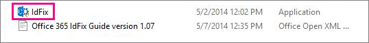

# Instalar e executar a ferramenta IdFix do Office 365

IdFix identifica erros como duplicatas e problemas de formatação no seu diretório antes de sincronizar com o Office 365. 
  
Para concluir essa tarefa com êxito, você deve estar seguro para trabalhar com objetos de usuário, de grupo e de contato no Active Directory.
  
Se você não puder concluir esta tarefa, há algumas outras coisas que você pode fazer. Esses métodos podem ser mais fáceis, mas também podem demorar mais ou ter outras desvantagens. São eles:
  
- **Executar a sincronização de diretórios sem executar o IdFix.** Você pode sincronizar seu diretório sem executar a ferramenta IdFix, mas não é recomendável. A correção de erros antes da sincronização leva menos tempo e geralmente fornece uma transição mais suave para a nuvem. 
- **Contratar um consultor.** Obter ajuda especializada pode colocar seus usuários em funcionamento rapidamente e seu diretório sincronizado. 
    
## O que você precisa para executar o IdFix

A maneira mais fácil de obter o IdFix em funcionamento é instalá-lo em um computador que tenha ingressado no seu domínio. Você pode executá-lo no controlador de domínio, se desejar, mas isso não é necessário.
  
### Requisitos de hardware do IdFix

O computador onde você instala o IdFix precisa atender a estes requisitos mínimos de hardware:
  
- 4 GB de RAM
- 2 GB de espaço em disco rígido
    
### Requisitos de software do IdFix

O computador onde você instala o IdFix precisa ser associado ao mesmo domínio do Active Directory do qual você deseja sincronizar os usuários para o Office 365. O computador também precisa ter o .NET Framework 4,0 instalado. 
  
Se você estiver executando o Windows Server 2008 ou o Windows Server 2012, o .NET Framework provavelmente já está instalado. Caso contrário, você pode [baixar o .net 4,0 do centro de download](https://go.microsoft.com/fwlink/p/?LinkId=400475) ou através do Windows Update. 
  
### Requisitos de permissões do IdFix

A conta de usuário que você usa para executar o IdFix precisa ter acesso de leitura/gravação ao diretório.
  
Se você não tiver certeza se sua conta de usuário atende a esses requisitos e se não tem certeza de como verificar, ainda pode instalar e executar o IdFix. Se sua conta de usuário não tiver as permissões corretas, o IdFix simplesmente exibirá um erro quando você tentar executá-la.
  
## Instalar o IdFix

Para instalar o IdFix, baixe e descompacte o **IdFix. exe**: 
  
1. Faça logon no computador onde você deseja instalar a ferramenta IdFix.
    
2. Vá para o site de download da Microsoft para a [ferramenta de correção de erros do IdFix DirSync](https://go.microsoft.com/fwlink/?linkid=867219).
    
3. Escolha **Download**.
    
4. Quando solicitado, escolha **executar**.
    
5. Na caixa de diálogo **WinZip Self-Extractor** , na caixa de texto **pasta de** descompactar, digite ou procure o local onde você deseja instalar a ferramenta IdFix. Por padrão, o IdFix é instalado `C:\Deployment Tools\`no. 
    
6. Escolha **unzip**.
    
## Executar a ferramenta IdFix

Após instalar o IdFix, execute a ferramenta para pesquisar problemas no diretório:
  
1. Usando uma conta com acesso de leitura/gravação ao diretório, faça logon no computador onde você instalou o IdFix.
    
2. No explorador de arquivos, vá para o local onde você instalou o IdFix. Se você escolher a pasta padrão durante a instalação, vá `C:\Deployment Tools\IdFix`para.
    
3. Clique duas vezes em **IdFix. exe**. 
    
    
  
4. Por padrão, o IdFix usa o conjunto de regras multilocatário para testar as entradas no seu diretório. Este é o conjunto de regras correto para a maioria dos clientes do Office 365. No entanto, se você for um cliente do Office 365 dedicado ou ITAR (leis internacionais de tráfego de braços), poderá configurar o IdFix para usar o conjunto de regras dedicado. Se você não tiver certeza sobre o tipo de cliente que você está, pode ignorar esta etapa com segurança. Para definir o conjunto de regras como dedicado, clique no ícone de engrenagem na barra de menus e, em seguida, escolha **dedicado**.
    
5. Escolha **consulta**.
    
    
  
6. Por padrão, o IdFix procura erros em todo o diretório.
    
    Dependendo do tamanho do seu diretório, a execução da consulta pode demorar um pouco. Você pode assistir ao progresso na parte inferior da janela principal da ferramenta. Se você clicar em **Cancelar**, precisará reiniciar desde o início.
    
    
  
7. Depois que o IdFix concluir a consulta, você poderá sincronizar o diretório se não houver erros. Se houver erros no diretório, é recomendável corrigi-los antes de sincronizar. Se você deseja obter informações mais específicas sobre os tipos de erros e recomendações sobre a melhor maneira de corrigir cada um deles, consulte os links no final deste tópico. 
    
    Embora não seja obrigatório corrigir os erros antes de sincronizar, é altamente recomendável que você pelo menos revise todos os erros retornados pelo IdFix.
    
    Cada erro é exibido em uma linha separada na janela principal da ferramenta. 
    
8. Se você concordar com a alteração sugerida na coluna **Atualizar** , na coluna **ação** , selecione o que você deseja que o IdFix faça para implementar a alteração e clique em **aplicar**. Quando você clica em **aplicar**, a ferramenta faz as alterações no diretório.
    
    Você não precisa clicar em **aplicar** após cada atualização. Em vez disso, você pode corrigir vários erros antes de clicar em **aplicar** e o IdFix todos serão alterados ao mesmo tempo. Você pode classificar os erros por tipo de erro clicando em **erro** na parte superior da coluna que lista os tipos de erro. 
    
    Uma estratégia é corrigir todos os erros do mesmo tipo; por exemplo, corrija primeiro todas as duplicatas e aplique-as. Em seguida, corrija os erros de formato de caractere e assim por diante. Cada vez que você aplica as alterações, a ferramenta IdFix cria um arquivo de log separado que você pode usar para desfazer suas alterações caso você cometa um erro. O [log de transações](idfix-transaction-log.md) é armazenado na pasta em que você instalou o IdFix.  _C:\Deployment Tools\IdFix_ por padrão. 
    
    
  
9. Depois que todas as suas alterações forem feitas no diretório, execute IdFix novamente para garantir que as correções que você fez não introduziu novos erros. Você pode repetir essas etapas quantas vezes for necessário. É uma boa ideia passar pelo processo algumas vezes antes de sincronizar.
    
## Desejo refinar minha pesquisa ou se aprofundar nos erros, o que mais posso fazer com o IdFix?

Informações mais detalhadas estão disponíveis nestes tópicos:
  
- [Preparar atributos de diretório para sincronização com o Office 365 usando a ferramenta IdFix](prepare-directory-attributes-for-synch-with-idfix.md) . Após instalar a ferramenta, vá para este tópico para obter instruções mais detalhadas sobre como executar a ferramenta, erros comuns que você encontrará, sugestões de correção, exemplos e práticas recomendadas para o que fazer quando você tiver um grande número de erros. 
- [Referência: IdFix objetos e atributos excluídos e com suporte](idfix-excluded-and-supported-objects-and-attributes.md)  
- [Referência: Log de transações do IdFix do Office 365](idfix-transaction-log.md)
    
## Treinamento em vídeo

Para obter mais informações, consulte a lição [instalar e usar a ferramenta IDFix](https://support.office.com/article/install-and-use-the-idfix-tool-4d81d73c-f172-4fd5-8542-f601c0c96aa9?ui=en-US&rs=en-US&ad=US), trazida para você pelo LinkedIn Learning.
  

