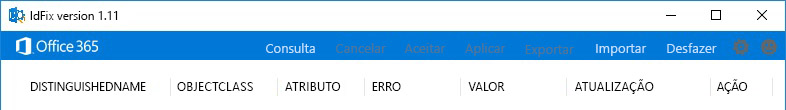
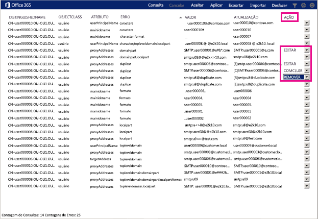

# Baixar e executar a ferramenta IdFix do Office 365

*Esse artigo se aplica ao Office 365 Enterprise e ao Microsoft 365 Enterprise.*

O IdFix identifica erros como duplicatas e problemas de formatação no Serviços de Domínio Active Directory (AD DS) antes de sincronizá-lo com o Office 365. 
  
Para concluir esta tarefa com êxito, você deve estar seguro para trabalhar com objetos de usuário, grupo e contato no AD DS.
  
Se não puder concluir essa tarefa, há algumas outras coisas que você pode fazer. Esses métodos podem ser mais fáceis, mas também podem levar mais tempo ou ter outras desvantagens. Que são:
  
- **Executar a sincronização de diretórios sem executar o IdFix** 

  Você pode sincronizar seu diretório sem usar a ferramenta IdFix, mas não é recomendável. A correção de erros antes da sincronização leva menos tempo e geralmente proporciona uma transição mais suave para a nuvem. 

- **Contratar um consultor** 

  Obter ajuda especializada pode colocar seus usuários prontos para trabalhar com rapidez e seu diretório sincronizado. 
    
## O que você precisa para executar o IdFix

A maneira mais fácil de garantir que o IdFix funcione é baixá-lo em um computador que ingressou no seu domínio do AD DS.  Você pode executá-lo no controlador de domínio, se desejar, mas isso não é necessário.
  
### Requisitos de hardware do IdFix

O computador onde você baixa o IdFix precisa atender a estes requisitos mínimos de hardware:
  
- 4 GB de RAM
- 2 GB de espaço em disco rígido
   
### Requisitos de software do IdFix

O computador onde você baixa o IdFix precisa ser associado ao mesmo domínio do AD DS do qual você deseja sincronizar os usuários com o Office 365. 

O computador também precisa ter o .NET Framework 4.0 instalado. Se você estiver executando o Windows Server 2008 ou posterior, o .NET Framework provavelmente já está instalado.  Caso contrário, você pode [baixar o .NET 4,0 do centro de download](https://go.microsoft.com/fwlink/p/?LinkId=400475) ou com o Windows Update. 
  
### Requisitos de permissões do IdFix

A conta de usuário que você usa para executar o IdFix deve ter acesso de leitura e gravação ao domínio do AD DS.
  
Se você não tiver certeza se sua conta de usuário atende a esses requisitos e se não tem certeza de como verificar, ainda assim é possível baixar e executar o IdFix.  Se sua conta de usuário não tiver as permissões corretas, o IdFix simplesmente exibirá um erro quando você tentar executá-la.
  
## Baixar e extrair o IdFix

Siga estas instruções. 
  
1. Faça logon no computador em que você deseja executar a ferramenta IdFix.
    
2. Vá para o site de download da Microsoft para obter a [Ferramenta de Correção de Erros de DirSync do IdFix](https://go.microsoft.com/fwlink/?linkid=867219).
    
3. Baixe e abra o arquivo zip.
    
3. Na janela **IdFix**, escolha **Extrair** e, em seguida, **Extrair tudo**. Por padrão, o IdFix é extraído para `C:\Users\<your user name>\Documents\IdFix`. 
    
6. Escolha **Extrair**.

Essas instruções foram feitas com o Internet Explorer em um servidor executando o Windows Server 2016.  Se você estiver usando uma versão diferente do Windows ou um navegador diferente, suas etapas podem variar.
    
## Executar a ferramenta IdFix

Depois de baixar e extrair o IdFix, execute-o para procurar problemas no seu domínio do AD DS.
  
1. Usando uma conta com acesso de leitura/gravação ao seu domínio do AD DS, entre no computador onde você baixou o IdFix.
    
2. No explorador de arquivos, vá para o local onde você extraiu o IdFix.  Se você escolher a pasta padrão durante a extração, vá para `C:\Users\<your user name>\Documents\IdFix`. 
    
3. Clique duas vezes em **IdFix.exe**. 
  
4. Por padrão, o IdFix usa a regra de Multilocatário definida para testar as entradas em seu diretório. Este é o conjunto de regras correto para a maioria dos clientes do Office 365.  No entanto, se você for um cliente do Office 365 Dedicado ou do Regulamento Internacional de Tráfego de Armas (ITAR)), você poderá configurar o IdFix para usar o conjunto de regras Dedicado. Se você não tem certeza do tipo de cliente que você é, ignore esta etapa. Para definir o conjunto de regras para Dedicado, clique no ícone de engrenagem na barra de menus e escolha **Dedicado**.
    
5. Escolha **Consulta**.
    
    
  
6. Por padrão, o IdFix procura erros em todo o diretório.
    
    Dependendo do tamanho do seu diretório, a execução da consulta pode demorar um pouco. Você pode observar o andamento na parte inferior da janela principal da ferramenta. Se você clicar em **Cancelar**, será necessário recomeçar do início.
  
7. Depois que o IdFix concluir a consulta, você poderá sincronizar seu diretório se não houver erros.  Se houver erros no diretório, é recomendável corrigi-los antes de sincronizar.  Confira [preparar atributos de diretório para sincronização com o Office 365](prepare-directory-attributes-for-synch-with-idfix.md) para obter mais informações.
    
    Embora não seja obrigatório corrigir os erros antes de sincronizar, é altamente recomendável que você, pelo menos, analise todos os erros retornados pelo IdFix.
    
    Cada erro é exibido em uma linha separada na janela principal da ferramenta.  
    
8. Se você concorda com a alteração sugerida na coluna **ATUALIZAÇÃO**, selecione na coluna **AÇÃO** o que deseja que a IdFix faça para implementar a alteração e clique em **Aplicar**. Quando você clica em **Aplicar**, a ferramenta faz todas as alterações no diretório.
    
    Você não precisa clicar em **Aplicar** após cada atualização. Em vez disso, é possível corrigir vários erros antes de clicar em **Aplicar** e o IdFix alterará todos ao mesmo tempo. Você pode classificar os erros por tipo de erro clicando em **ERRO** na parte superior da coluna que lista os tipos de erro. 
    
    Uma estratégia é corrigir todos os erros do mesmo tipo. Por exemplo, corrija primeiro todas as duplicatas e aplique-as. Em seguida, corrija os erros de formato de caractere e assim por diante. Todas as vezes que você aplicar as alterações, a ferramenta IdFix cria um arquivo de log separado que você pode usar para desfazer as alterações caso cometa um erro. O [log de transações](idfix-transaction-log.md) é armazenado na pasta onde você extraiu o IdFix, que é_C:\Usuários\<seu nome de usuário>\Documentos\idFix_ por padrão. 
    
    
  
9. Depois de fazer todas as alterações no diretório, execute o IdFix novamente para garantir que as correções feitas não introduzam novos erros. Você pode repetir essas etapas quantas vezes precisar. É uma boa ideia executar esse processo algumas vezes antes de sincronizar.
    
## Recursos adicionais no IdFix 

- [Objetos e atributos excluídos e compatíveis com o IdFix](idfix-excluded-and-supported-objects-and-attributes.md)  
- [Log de transações IdFix do Office 365](idfix-transaction-log.md)
    
## Treinamentos em vídeo

Para obter mais informações, confira a lição [Instalar e usar a ferramenta IdFix](https://support.office.com/article/install-and-use-the-idfix-tool-4d81d73c-f172-4fd5-8542-f601c0c96aa9?ui=en-US&rs=en-US&ad=US), oferecida pelo LinkedIn Learning.
  

