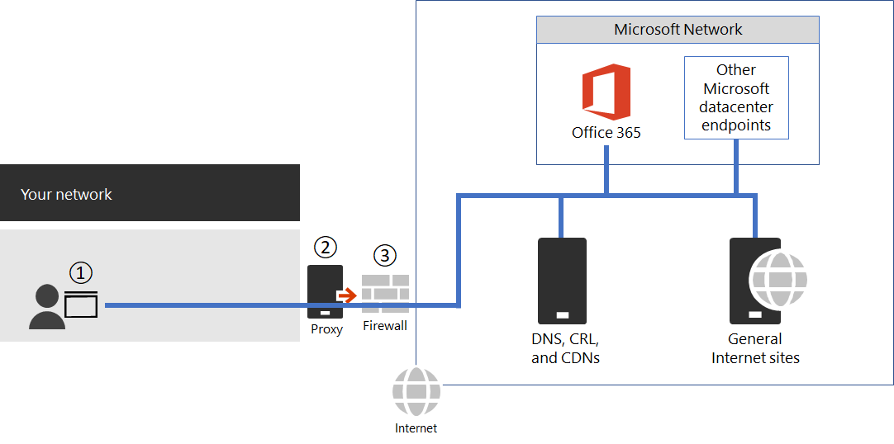

# <a name="managing-office-365-endpoints"></a><span data-ttu-id="64adc-105">Gerenciar pontos de extremidade do Office 365</span><span class="sxs-lookup"><span data-stu-id="64adc-105">Managing Office 365 endpoints</span></span>

<span data-ttu-id="64adc-106">A maioria das organizações corporativas que têm vários locais do Office e uma WAN de conexão precisará precisar de configuração para a conectividade de rede do Office 365.</span><span class="sxs-lookup"><span data-stu-id="64adc-106">Most enterprise organizations that have multiple office locations and a connecting WAN will need to need configuration for Office 365 network connectivity.</span></span> <span data-ttu-id="64adc-107">Você pode otimizar sua rede enviando todas as solicitações de rede do Office 365 confiáveis diretamente através do firewall, ignorando a inspeção ou o processamento de qualquer nível de pacote adicional.</span><span class="sxs-lookup"><span data-stu-id="64adc-107">You can optimize your network by sending all trusted Office 365 network requests directly through your firewall, bypassing all additional packet level inspection or processing.</span></span> <span data-ttu-id="64adc-108">Isso reduz a latência e seus requisitos de capacidade de perímetro.</span><span class="sxs-lookup"><span data-stu-id="64adc-108">This reduces latency and your perimeter capacity requirements.</span></span> <span data-ttu-id="64adc-109">A identificação do tráfego de rede do Office 365 é a primeira etapa para fornecer o melhor desempenho para seus usuários.</span><span class="sxs-lookup"><span data-stu-id="64adc-109">Identifying Office 365 network traffic is the first step in providing optimal performance for your users.</span></span> <span data-ttu-id="64adc-110">Para obter mais informações sobre a conectividade de rede do Office 365, consulte [office 365 princípios de conectividade de rede](office-365-network-connectivity-principles.md).</span><span class="sxs-lookup"><span data-stu-id="64adc-110">For more information about Office 365 network connectivity, see [Office 365 Network Connectivity Principles](office-365-network-connectivity-principles.md).</span></span>

<span data-ttu-id="64adc-111">A Microsoft recomenda que você acesse os pontos de extremidade de rede do Office 365 e altere-os usando o [endereço IP 365 do Office e o serviço Web de URL](office-365-ip-web-service.md).</span><span class="sxs-lookup"><span data-stu-id="64adc-111">Microsoft recommends you access the Office 365 network endpoints and changes to them using the [Office 365 IP Address and URL Web Service](office-365-ip-web-service.md).</span></span>

<span data-ttu-id="64adc-112">Independentemente de como você gerencia o tráfego de rede vital do Office 365, o Office 365 requer conectividade com a Internet.</span><span class="sxs-lookup"><span data-stu-id="64adc-112">Regardless of how you manage vital Office 365 network traffic, Office 365 requires Internet connectivity.</span></span> <span data-ttu-id="64adc-113">Outros pontos de extremidade de rede onde a conectividade é necessária são listados em [pontos de extremidade adicionais não incluídos no endereço IP do Office 365 e no serviço Web de URL](additional-office365-ip-addresses-and-urls.md).</span><span class="sxs-lookup"><span data-stu-id="64adc-113">Other network endpoints where connectivity is required are listed at [Additional endpoints not included in the Office 365 IP Address and URL Web service](additional-office365-ip-addresses-and-urls.md).</span></span>

<span data-ttu-id="64adc-114">O modo de uso dos pontos de extremidade de rede do Office 365 dependerá da arquitetura de rede da organização de sua empresa.</span><span class="sxs-lookup"><span data-stu-id="64adc-114">How you use the Office 365 network endpoints will depend on your enterprise organization network architecture.</span></span> <span data-ttu-id="64adc-115">Este artigo descreve várias maneiras pelas quais as arquiteturas de rede corporativas podem se integrar com os endereços IP e URLs do Office 365.</span><span class="sxs-lookup"><span data-stu-id="64adc-115">This article outlines several ways that enterprise network architectures can integrate with Office 365 IP addresses and URLs.</span></span> <span data-ttu-id="64adc-116">A maneira mais fácil de escolher quais solicitações de rede confiar é usar dispositivos SDWAN que suportam a configuração automatizada do Office 365 em cada um dos seus locais do Office.</span><span class="sxs-lookup"><span data-stu-id="64adc-116">The easiest way to choose which network requests to trust is to use SDWAN devices that support automated Office 365 configuration at each of your office locations.</span></span>

## <a name="sdwan-for-local-branch-egress-of-vital-office-365-network-traffic"></a><span data-ttu-id="64adc-117">SDWAN para saída de filial local de tráfego de rede vital do Office 365</span><span class="sxs-lookup"><span data-stu-id="64adc-117">SDWAN for local branch egress of vital Office 365 network traffic</span></span>

<span data-ttu-id="64adc-118">Em cada local de filial, você pode fornecer um dispositivo SDWAN que esteja configurado para rotear o tráfego para o Office 365 otimizar categoria de pontos de extremidade, ou otimizar e permitir categorias, diretamente à rede da Microsoft.</span><span class="sxs-lookup"><span data-stu-id="64adc-118">At each branch office location, you can provide an SDWAN device that is configured to route traffic for Office 365 Optimize category of endpoints, or Optimize and Allow categories, directly to Microsoft's network.</span></span> <span data-ttu-id="64adc-119">Outro tráfego de rede, incluindo o tráfego do datacenter local, tráfego geral de sites da Web da Internet e tráfego para os pontos de extremidade de categoria padrão do Office 365 é enviado para outro local onde você tem um perímetro de rede mais significativo.</span><span class="sxs-lookup"><span data-stu-id="64adc-119">Other network traffic including on-premises datacenter traffic, general Internet web sites traffic, and traffic to Office 365 Default category endpoints is sent to another location where you have a more substantial network perimeter.</span></span>

<span data-ttu-id="64adc-120">A Microsoft está trabalhando com provedores do SDWAN para habilitar a configuração automatizada.</span><span class="sxs-lookup"><span data-stu-id="64adc-120">Microsoft is working with SDWAN providers to enable automated configuration.</span></span> <span data-ttu-id="64adc-121">Para obter mais informações, consulte [programa de parceria de rede do Office 365](office-365-networking-partner-program.md).</span><span class="sxs-lookup"><span data-stu-id="64adc-121">For more information, see [Office 365 Networking Partner Program](office-365-networking-partner-program.md).</span></span>

<span data-ttu-id="64adc-122"><a name="pacfiles"> </a></span><span class="sxs-lookup"><span data-stu-id="64adc-122"><a name="pacfiles"> </a></span></span>
## <a name="use-a-pac-file-for-direct-routing-of-vital-office-365-traffic"></a><span data-ttu-id="64adc-123">Usar um arquivo PAC para o roteamento direto de tráfego vital do Office 365</span><span class="sxs-lookup"><span data-stu-id="64adc-123">Use a PAC file for direct routing of vital Office 365 traffic</span></span>

<span data-ttu-id="64adc-124">Use os arquivos PAC ou WPAD para gerenciar solicitações de rede associadas ao Office 365, mas que não têm um endereço IP.</span><span class="sxs-lookup"><span data-stu-id="64adc-124">Use PAC or WPAD files to manage network requests that are associated with Office 365 but don't have an IP address.</span></span> <span data-ttu-id="64adc-125">As solicitações de rede típicas enviadas por meio de um proxy ou dispositivo de perímetro aumentam a latência.</span><span class="sxs-lookup"><span data-stu-id="64adc-125">Typical network requests that are sent through a proxy or perimeter device increase latency.</span></span> <span data-ttu-id="64adc-126">Embora a interrupção e a inspeção do SSL criem a maior latência, outros serviços, como a autenticação de proxy e a pesquisa de reputação podem causar um desempenho ruim e uma experiência de usuário ruim.</span><span class="sxs-lookup"><span data-stu-id="64adc-126">While SSL Break and Inspect creates the largest latency, other services such as proxy authentication and reputation lookup can cause poor performance and a bad user experience.</span></span> <span data-ttu-id="64adc-127">Além disso, esses dispositivos de rede de perímetro precisam de capacidade suficiente para processar todas as solicitações de conexão de rede.</span><span class="sxs-lookup"><span data-stu-id="64adc-127">Additionally, these perimeter network devices need enough capacity to process all of the network connection requests.</span></span> <span data-ttu-id="64adc-128">Recomendamos ignorar seus dispositivos de proxy ou de inspeção para solicitações de rede diretas do Office 365.</span><span class="sxs-lookup"><span data-stu-id="64adc-128">We recommend bypassing your proxy or inspection devices for direct Office 365 network requests.</span></span>
  
<span data-ttu-id="64adc-129">A [Galeria do PowerShell Get-PacFile](https://www.powershellgallery.com/packages/Get-PacFile) é um script do PowerShell que lê os pontos de extremidade de rede mais recentes do endereço IP e URL do serviço Web do Office 365 e cria um arquivo de PAC de exemplo.</span><span class="sxs-lookup"><span data-stu-id="64adc-129">[PowerShell Gallery Get-PacFile](https://www.powershellgallery.com/packages/Get-PacFile) is a PowerShell script that reads the latest network endpoints from the Office 365 IP Address and URL Web service and creates a sample PAC file.</span></span> <span data-ttu-id="64adc-130">Você pode modificar o script para que ele se integre com o gerenciamento de arquivo de PAC existente.</span><span class="sxs-lookup"><span data-stu-id="64adc-130">You can modify the script so that it integrates with your existing PAC file management.</span></span>



<span data-ttu-id="64adc-132">**Figura 1: perímetro da rede corporativa simples**</span><span class="sxs-lookup"><span data-stu-id="64adc-132">**Figure 1 - Simple enterprise network perimeter**</span></span>

<span data-ttu-id="64adc-133">O arquivo de PAC é implantado em navegadores da Web, no ponto 1, na Figura 1.</span><span class="sxs-lookup"><span data-stu-id="64adc-133">The PAC file is deployed to web browsers at point 1 in Figure 1.</span></span> <span data-ttu-id="64adc-134">Ao usar um arquivo PAC para egresso direta de tráfego de rede vital do Office 365, você também precisará permitir a conectividade para os endereços IP por trás dessas URLs em seu firewall de perímetro de rede.</span><span class="sxs-lookup"><span data-stu-id="64adc-134">When using a PAC file for direct egress of vital Office 365 network traffic, you also need to allow connectivity to the IP addresses behind these URLs on your network perimeter firewall.</span></span> <span data-ttu-id="64adc-135">Isso é feito buscando os endereços IP para as mesmas categorias de pontos de extremidade do Office 365, conforme especificado no arquivo PAC e criando ACLs de firewall com base nesses endereços.</span><span class="sxs-lookup"><span data-stu-id="64adc-135">This is done by fetching the IP addresses for the same Office 365 endpoint categories as specified in the PAC file and creating firewall ACLs based on those addresses.</span></span> <span data-ttu-id="64adc-136">O firewall é o ponto 3 na Figura 1.</span><span class="sxs-lookup"><span data-stu-id="64adc-136">The firewall is point 3 in Figure 1.</span></span>

<span data-ttu-id="64adc-137">Separadamente se você optar por apenas o roteamento direto para os pontos de extremidade da categoria otimizar, qualquer ponto de extremidade de permissão de categoria necessário enviado para o servidor proxy precisará ser listado no servidor proxy para ignorar o processamento.</span><span class="sxs-lookup"><span data-stu-id="64adc-137">Separately if you choose to only do direct routing for the Optimize category endpoints, any required Allow category endpoints that you send to the proxy server will need to be listed in the proxy server to bypass further processing.</span></span> <span data-ttu-id="64adc-138">Por exemplo, as interrupções SSL e a inspeção e a autenticação de proxy são incompatíveis com os pontos de extremidade de categoria optimize e Allow.</span><span class="sxs-lookup"><span data-stu-id="64adc-138">For example, SSL break and Inspect and Proxy Authentication are incompatible with both the Optimize and Allow category endpoints.</span></span> <span data-ttu-id="64adc-139">O servidor proxy é o ponto 2 na Figura 1.</span><span class="sxs-lookup"><span data-stu-id="64adc-139">The proxy server is point 2 in Figure 1.</span></span>

<span data-ttu-id="64adc-140">A configuração comum é permitir sem o processamento de todo o tráfego de saída do servidor proxy para os endereços IP de destino do tráfego de rede do Office 365 que atinge o servidor proxy.</span><span class="sxs-lookup"><span data-stu-id="64adc-140">The common configuration is to permit without processing all outbound traffic from the proxy server for the destination IP addresses for Office 365 network traffic that hits the proxy server.</span></span> <span data-ttu-id="64adc-141">Para obter informações sobre problemas com o SSL Break e inspecionar, consulte [usando dispositivos de rede de terceiros ou soluções no tráfego do Office 365](https://support.microsoft.com/help/2690045/using-third-party-network-devices-or-solutions-with-office-365).</span><span class="sxs-lookup"><span data-stu-id="64adc-141">For information about issues with SSL Break and Inspect, see [Using third-party network devices or solutions on Office 365 traffic](https://support.microsoft.com/help/2690045/using-third-party-network-devices-or-solutions-with-office-365).</span></span>

<span data-ttu-id="64adc-142">Há dois tipos de arquivos de PAC que o script Get-PacFile gerará.</span><span class="sxs-lookup"><span data-stu-id="64adc-142">There are two types of PAC files that the Get-PacFile script will generate.</span></span>

|<span data-ttu-id="64adc-143">**Tipo**</span><span class="sxs-lookup"><span data-stu-id="64adc-143">**Type**</span></span>|<span data-ttu-id="64adc-144">**Descrição**</span><span class="sxs-lookup"><span data-stu-id="64adc-144">**Description**</span></span>|
|:-----|:-----|
|<span data-ttu-id="64adc-145">**1**</span><span class="sxs-lookup"><span data-stu-id="64adc-145">**1**</span></span> <br/> |<span data-ttu-id="64adc-146">Send otimiza o tráfego de ponto de extremidade direto e tudo o mais para o servidor proxy.</span><span class="sxs-lookup"><span data-stu-id="64adc-146">Send Optimize endpoint traffic direct and everything else to the proxy server.</span></span> <br/> |
|<span data-ttu-id="64adc-147">**duas**</span><span class="sxs-lookup"><span data-stu-id="64adc-147">**2**</span></span> <br/> |<span data-ttu-id="64adc-148">Enviar otimizar e permitir tráfego de ponto de extremidade direto e tudo o mais para o servidor proxy.</span><span class="sxs-lookup"><span data-stu-id="64adc-148">Send Optimize and Allow endpoint traffic direct and everything else to the proxy server.</span></span> <span data-ttu-id="64adc-149">Este tipo também pode ser usado para enviar todos os tráfegos do ExpressRoute suportados para o Office 365 para os segmentos de rede ExpressRoute e tudo o mais para o servidor proxy.</span><span class="sxs-lookup"><span data-stu-id="64adc-149">This type can also be used to send all supported ExpressRoute for Office 365 traffic to ExpressRoute network segments and everything else to the proxy server.</span></span> <br/> |

<span data-ttu-id="64adc-150">Veja um exemplo simples de chamar o script do PowerShell:</span><span class="sxs-lookup"><span data-stu-id="64adc-150">Here's a simple example of calling the PowerShell script:</span></span>

```powershell
Get-PacFile -ClientRequestId b10c5ed1-bad1-445f-b386-b919946339a7
```

<span data-ttu-id="64adc-151">Há vários parâmetros que podem ser passados para o script:</span><span class="sxs-lookup"><span data-stu-id="64adc-151">There are a number of parameters you can pass to the script:</span></span>

|<span data-ttu-id="64adc-152">**Parâmetro**</span><span class="sxs-lookup"><span data-stu-id="64adc-152">**Parameter**</span></span>|<span data-ttu-id="64adc-153">**Descrição**</span><span class="sxs-lookup"><span data-stu-id="64adc-153">**Description**</span></span>|
|:-----|:-----|
|<span data-ttu-id="64adc-154">**ClientRequestId**</span><span class="sxs-lookup"><span data-stu-id="64adc-154">**ClientRequestId**</span></span> <br/> |<span data-ttu-id="64adc-155">Isso é obrigatório e é um GUID passado para o serviço Web que representa a máquina cliente que está fazendo a chamada.</span><span class="sxs-lookup"><span data-stu-id="64adc-155">This is required and is a GUID passed to the web service that represents the client machine making the call.</span></span> <br/> |
|<span data-ttu-id="64adc-156">**Instância**</span><span class="sxs-lookup"><span data-stu-id="64adc-156">**Instance**</span></span> <br/> |<span data-ttu-id="64adc-157">A instância de serviço do Office 365 que assume como padrão em todo o mundo.</span><span class="sxs-lookup"><span data-stu-id="64adc-157">The Office 365 service instance which defaults to Worldwide.</span></span> <span data-ttu-id="64adc-158">Também passado para o serviço Web.</span><span class="sxs-lookup"><span data-stu-id="64adc-158">Also passed to the web service.</span></span> <br/> |
|<span data-ttu-id="64adc-159">**TenantName**</span><span class="sxs-lookup"><span data-stu-id="64adc-159">**TenantName**</span></span> <br/> |<span data-ttu-id="64adc-160">O nome do locatário do Office 365.</span><span class="sxs-lookup"><span data-stu-id="64adc-160">Your Office 365 tenant name.</span></span> <span data-ttu-id="64adc-161">Passado para o serviço Web e usado como um parâmetro substituível em algumas URLs do Office 365.</span><span class="sxs-lookup"><span data-stu-id="64adc-161">Passed to the web service and used as a replaceable parameter in some Office 365 URLs.</span></span> <br/> |
|<span data-ttu-id="64adc-162">**Tipo**</span><span class="sxs-lookup"><span data-stu-id="64adc-162">**Type**</span></span> <br/> |<span data-ttu-id="64adc-163">O tipo de arquivo de PAC de proxy que você deseja gerar.</span><span class="sxs-lookup"><span data-stu-id="64adc-163">The type of the proxy PAC file that you want to generate.</span></span> <br/> |

<span data-ttu-id="64adc-164">Este é outro exemplo de chamada do script do PowerShell com parâmetros adicionais:</span><span class="sxs-lookup"><span data-stu-id="64adc-164">Here's another example of calling the PowerShell script with additional parameters:</span></span>

```powershell
Get-PacFile -Type 2 -Instance Worldwide -TenantName Contoso -ClientRequestId b10c5ed1-bad1-445f-b386-b919946339a7
```

## <a name="proxy-server-bypass-processing-of-office-365-network-traffic"></a><span data-ttu-id="64adc-165">Servidor proxy ignora o processamento do tráfego de rede do Office 365</span><span class="sxs-lookup"><span data-stu-id="64adc-165">Proxy server bypass processing of Office 365 network traffic</span></span>

<span data-ttu-id="64adc-166">Onde os arquivos de PAC não são usados para tráfego de saída direta, você ainda deseja ignorar o processamento no seu perímetro de rede configurando seu servidor proxy.</span><span class="sxs-lookup"><span data-stu-id="64adc-166">Where PAC files are not used for direct outbound traffic, you still want to bypass processing on your network perimeter by configuring your proxy server.</span></span> <span data-ttu-id="64adc-167">Alguns fornecedores de servidor proxy habilitaram a configuração automatizada, conforme descrito no [programa de parceria de rede do Office 365](office-365-networking-partner-program.md).</span><span class="sxs-lookup"><span data-stu-id="64adc-167">Some proxy server vendors have enabled automated configuration of this as described in the [Office 365 Networking Partner Program](office-365-networking-partner-program.md).</span></span>

<span data-ttu-id="64adc-168">Se você estiver fazendo isso manualmente, precisará obter os dados de categoria otimizar e permitir ponto de extremidade do endereço IP do Office 365 e do serviço Web URL e configurar seu servidor proxy para ignorar o processamento para eles.</span><span class="sxs-lookup"><span data-stu-id="64adc-168">If you are doing this manually you will need to get the Optimize and Allow endpoint category data from the Office 365 IP Address and URL Web Service and configure your proxy server to bypass processing for these.</span></span> <span data-ttu-id="64adc-169">É importante evitar interrupção de SSL e autenticação de inspecionar e proxy para os pontos de extremidade de categoria otimizar e permitir.</span><span class="sxs-lookup"><span data-stu-id="64adc-169">It is important to avoid SSL Break and Inspect and Proxy Authentication for the Optimize and Allow category endpoints.</span></span>
  
<span data-ttu-id="64adc-170"><a name="bkmk_changes"> </a></span><span class="sxs-lookup"><span data-stu-id="64adc-170"><a name="bkmk_changes"> </a></span></span>
## <a name="change-management-for-office-365-ip-addresses-and-urls"></a><span data-ttu-id="64adc-171">Gerenciamento de alterações para endereços IP e URLs do Office 365</span><span class="sxs-lookup"><span data-stu-id="64adc-171">Change management for Office 365 IP addresses and URLs</span></span>

<span data-ttu-id="64adc-172">Além de selecionar a configuração apropriada para o seu perímetro de rede, é fundamental que você adote um processo de gerenciamento de alterações para os pontos de extremidade do Office 365.</span><span class="sxs-lookup"><span data-stu-id="64adc-172">In addition to selecting appropriate configuration for your network perimeter, it is critical that you adopt a change management process for Office 365 endpoints.</span></span> <span data-ttu-id="64adc-173">Esses pontos de extremidade mudam regularmente e, se você não gerencia as alterações, você pode terminar com usuários bloqueados ou com baixo desempenho após um novo endereço IP ou URL ser adicionado.</span><span class="sxs-lookup"><span data-stu-id="64adc-173">These endpoints change regularly and if you do not manage the changes, you can end up with users blocked or with poor performance after a new IP address or URL is added.</span></span>

<span data-ttu-id="64adc-174">Alterações nos endereços IP e URLs do Office 365 geralmente são publicadas próximo ao último dia de cada mês.</span><span class="sxs-lookup"><span data-stu-id="64adc-174">Changes to the Office 365 IP addresses and URLs are usually published near the last day of each month.</span></span> <span data-ttu-id="64adc-175">Às vezes, uma alteração será publicada fora desse cronograma devido aos requisitos operacionais, de suporte ou de segurança.</span><span class="sxs-lookup"><span data-stu-id="64adc-175">Sometimes a change will be published outside of that schedule due to operational, support, or security requirements.</span></span>

<span data-ttu-id="64adc-176">Quando uma alteração é publicada que requer que você atue porque um endereço IP ou uma URL foi adicionada, você deve receber um aviso de 30 dias da hora que publicamos a alteração até que haja um serviço do Office 365 nesse ponto de extremidade.</span><span class="sxs-lookup"><span data-stu-id="64adc-176">When a change is published that requires you to act because an IP address or URL was added, you should expect to receive 30 days notice from the time we publish the change until there is an Office 365 service on that endpoint.</span></span> <span data-ttu-id="64adc-177">Embora o objetivo desse período de notificação, nem sempre é possível ser possível devido aos requisitos de segurança, de suporte ou operacionais.</span><span class="sxs-lookup"><span data-stu-id="64adc-177">Although we aim for this notification period, it may not always be possible due to operational, support, or security requirements.</span></span> <span data-ttu-id="64adc-178">Alterações que não exigem ação imediata para manter a conectividade, como endereços IP removidos ou URLs ou alterações menos significativas, não incluem notificações antecipadas.</span><span class="sxs-lookup"><span data-stu-id="64adc-178">Changes that do not require immediate action to maintain connectivity, such as removed IP addresses or URLs or less significant changes, do not include advance notification.</span></span> <span data-ttu-id="64adc-179">Independentemente de qual notificação é fornecida, listamos a data de ativação do serviço esperada para cada alteração.</span><span class="sxs-lookup"><span data-stu-id="64adc-179">Regardless of what notification is provided, we list the expected service active date for each change.</span></span>

### <a name="change-notification-using-the-web-service"></a><span data-ttu-id="64adc-180">Notificação de alteração usando o serviço Web</span><span class="sxs-lookup"><span data-stu-id="64adc-180">Change notification using the Web Service</span></span>

<span data-ttu-id="64adc-181">Você pode usar o endereço IP do Office 365 e o serviço Web de URL para obter a notificação de alteração.</span><span class="sxs-lookup"><span data-stu-id="64adc-181">You can use the Office 365 IP Address and URL Web Service to get change notification.</span></span> <span data-ttu-id="64adc-182">Recomendamos chamar o método Web **/version** uma vez por hora para verificar a versão dos pontos de extremidade que você está usando para se conectar ao Office 365.</span><span class="sxs-lookup"><span data-stu-id="64adc-182">We recommend you call the **/version** web method once an hour to check the version of the endpoints that you are using to connect to Office 365.</span></span> <span data-ttu-id="64adc-183">Se essa versão mudar em comparação com a versão que você está usando, você deve obter os dados mais recentes do ponto de extremidade do método Web do **/Endpoints** e, opcionalmente, obter as diferenças do método Web **/Changes** .</span><span class="sxs-lookup"><span data-stu-id="64adc-183">If this version changes when compared to the version that you have in use, then you should get the latest endpoint data from the **/endpoints** web method and optionally get the differences from the **/changes** web method.</span></span> <span data-ttu-id="64adc-184">Não é necessário chamar os métodos Web **/Endpoints** ou **/Changes** se não houve nenhuma alteração na versão encontrada.</span><span class="sxs-lookup"><span data-stu-id="64adc-184">It is not necessary to call the **/endpoints** or **/changes** web methods if there has not been any change to the version you found.</span></span>

<span data-ttu-id="64adc-185">Para obter mais informações, consulte o [endereço IP do Office 365 e o serviço Web de URL](office-365-ip-web-service.md).</span><span class="sxs-lookup"><span data-stu-id="64adc-185">For more information, see [Office 365 IP Address and URL Web Service](office-365-ip-web-service.md).</span></span>

### <a name="change-notification-using-rss-feeds"></a><span data-ttu-id="64adc-186">Alterar notificação usando RSS feeds</span><span class="sxs-lookup"><span data-stu-id="64adc-186">Change notification using RSS feeds</span></span>

<span data-ttu-id="64adc-187">O serviço Web de URL e endereço IP do Office 365 fornece um RSS feed que você pode assinar no Outlook.</span><span class="sxs-lookup"><span data-stu-id="64adc-187">The Office 365 IP Address and URL Web Service provides an RSS feed that you can subscribe to in Outlook.</span></span> <span data-ttu-id="64adc-188">Há links para as URLs RSS em cada uma das páginas específicas da instância do serviço do Office 365 para os endereços IP e URLs.</span><span class="sxs-lookup"><span data-stu-id="64adc-188">There are links to the RSS URLs on each of the Office 365 service instance-specific pages for the IP addresses and URLs.</span></span> <span data-ttu-id="64adc-189">Para obter mais informações, consulte o [endereço IP do Office 365 e o serviço Web de URL](office-365-ip-web-service.md).</span><span class="sxs-lookup"><span data-stu-id="64adc-189">For more information, see [Office 365 IP Address and URL Web Service](office-365-ip-web-service.md).</span></span>

### <a name="change-notification-and-approval-review-using-microsoft-flow"></a><span data-ttu-id="64adc-190">Alteração de notificação e análise de aprovação usando o Microsoft Flow</span><span class="sxs-lookup"><span data-stu-id="64adc-190">Change notification and approval review using Microsoft Flow</span></span>

<span data-ttu-id="64adc-191">Entendemos que você ainda pode exigir o processamento manual para alterações de ponto de extremidade de rede que aparecem em cada mês.</span><span class="sxs-lookup"><span data-stu-id="64adc-191">We understand that you might still require manual processing for network endpoint changes that come through each month.</span></span> <span data-ttu-id="64adc-192">Você pode usar o Microsoft Flow para criar um fluxo que o notifique por email e, opcionalmente, execute um processo de aprovação para alterações quando os pontos de extremidade de rede do Office 365 tiverem alterações.</span><span class="sxs-lookup"><span data-stu-id="64adc-192">You can use Microsoft Flow to create a flow that notifies you by email and optionally runs an approval process for changes when Office 365 network endpoints have changes.</span></span> <span data-ttu-id="64adc-193">Após a conclusão da revisão, você pode fazer com que o fluxo envie as alterações automaticamente para o firewall e a equipe de gerenciamento do servidor proxy.</span><span class="sxs-lookup"><span data-stu-id="64adc-193">Once review is completed, you can have the flow automatically email the changes to your firewall and proxy server management team.</span></span>

<span data-ttu-id="64adc-194">Para obter informações sobre um modelo e exemplo de fluxo da Microsoft, consulte [use Microsoft Flow para receber um email para alterações nos endereços IP e URLs do Office 365](https://techcommunity.microsoft.com/t5/Office-365-Networking/Use-Microsoft-Flow-to-receive-an-email-for-changes-to-Office-365/td-p/240651).</span><span class="sxs-lookup"><span data-stu-id="64adc-194">For information about a Microsoft Flow sample and template, see [Use Microsoft Flow to receive an email for changes to Office 365 IP addresses and URLs](https://techcommunity.microsoft.com/t5/Office-365-Networking/Use-Microsoft-Flow-to-receive-an-email-for-changes-to-Office-365/td-p/240651).</span></span>
  
<span data-ttu-id="64adc-195"><a name="FAQ"> </a></span><span class="sxs-lookup"><span data-stu-id="64adc-195"><a name="FAQ"> </a></span></span>
## <a name="office-365-network-endpoints-faq"></a><span data-ttu-id="64adc-196">Perguntas frequentes sobre pontos de extremidade de rede do Office 365</span><span class="sxs-lookup"><span data-stu-id="64adc-196">Office 365 network endpoints FAQ</span></span>

<span data-ttu-id="64adc-197">Perguntas frequentes sobre o administrador sobre a conectividade do Office 365:</span><span class="sxs-lookup"><span data-stu-id="64adc-197">Frequently-asked administrator questions about Office 365 connectivity:</span></span>
  
### <a name="how-do-i-submit-a-question"></a><span data-ttu-id="64adc-198">Como eu envio uma pergunta?</span><span class="sxs-lookup"><span data-stu-id="64adc-198">How do I submit a question?</span></span>

<span data-ttu-id="64adc-199">Clique no link na parte inferior para indicar se o artigo foi útil ou não e envie nenhuma pergunta adicional.</span><span class="sxs-lookup"><span data-stu-id="64adc-199">Click the link at the bottom to indicate if the article was helpful or not and submit any additional questions.</span></span> <span data-ttu-id="64adc-200">Monitoramos os comentários e atualizamos as perguntas aqui com a maioria das perguntas frequentes.</span><span class="sxs-lookup"><span data-stu-id="64adc-200">We monitor the feedback and update the questions here with the most frequently asked.</span></span>
  
### <a name="how-do-i-determine-the-location-of-my-tenant"></a><span data-ttu-id="64adc-201">Como determinar o local do meu locatário?</span><span class="sxs-lookup"><span data-stu-id="64adc-201">How do I determine the location of my tenant?</span></span>

 <span data-ttu-id="64adc-202">O **local do locatário** é melhor determinado usando nosso mapa de [datacenter](https://aka.ms/datamaps).</span><span class="sxs-lookup"><span data-stu-id="64adc-202">**Tenant location** is best determined using our [datacenter map](https://aka.ms/datamaps).</span></span>
  
### <a name="am-i-peering-appropriately-with-microsoft"></a><span data-ttu-id="64adc-203">Estou trocando apropriadamente à Microsoft?</span><span class="sxs-lookup"><span data-stu-id="64adc-203">Am I peering appropriately with Microsoft?</span></span>

 <span data-ttu-id="64adc-204">Os **locais de emparelhamento** são descritos mais detalhadamente em [emparelhamento com a Microsoft](https://www.microsoft.com/peering).</span><span class="sxs-lookup"><span data-stu-id="64adc-204">**Peering locations** are described in more detail in [peering with Microsoft](https://www.microsoft.com/peering).</span></span>
  
<span data-ttu-id="64adc-205">Com mais de 2500 relações de emparelhamento de ISP globalmente e 70 pontos de presença, obter de sua rede para a nossa deve ser uniforme.</span><span class="sxs-lookup"><span data-stu-id="64adc-205">With over 2500 ISP peering relationships globally and 70 points of presence, getting from your network to ours should be seamless.</span></span> <span data-ttu-id="64adc-206">Não é possível que isso gaste alguns minutos para garantir que a relação de emparelhamento do seu ISP seja a mais adequada, [Veja alguns exemplos](https://blogs.technet.microsoft.com/onthewire/2017/03/22/__guidance/) de boas e não boas mãos de ponto de partida para nossa rede.</span><span class="sxs-lookup"><span data-stu-id="64adc-206">It can't hurt to spend a few minutes making sure your ISP's peering relationship is the most optimal, [here's a few examples](https://blogs.technet.microsoft.com/onthewire/2017/03/22/__guidance/) of good and not so good peering hand-offs to our network.</span></span>
  
<span data-ttu-id="64adc-207"><a name="bkmk_MissingIP"> </a></span><span class="sxs-lookup"><span data-stu-id="64adc-207"><a name="bkmk_MissingIP"> </a></span></span>
### <a name="i-see-network-requests-to-ip-addresses-not-on-the-published-list-do-i-need-to-provide-access-to-them"></a><span data-ttu-id="64adc-208">Vejo solicitações de rede para endereços IP que não estão na lista publicada, preciso fornecer acesso a elas?</span><span class="sxs-lookup"><span data-stu-id="64adc-208">I see network requests to IP addresses not on the published list, do I need to provide access to them?</span></span>

<span data-ttu-id="64adc-209">Só fornecemos endereços IP para os servidores do Office 365 que você deve rotear diretamente para o.</span><span class="sxs-lookup"><span data-stu-id="64adc-209">We only provide IP addresses for the Office 365 servers you should route directly to.</span></span> <span data-ttu-id="64adc-210">Esta não é uma lista abrangente de todos os endereços IP para os quais você verá as solicitações de rede.</span><span class="sxs-lookup"><span data-stu-id="64adc-210">This isn't a comprehensive list of all IP addresses you'll see network requests for.</span></span> <span data-ttu-id="64adc-211">Você verá as solicitações de rede para endereços IP de terceiros, não publicados, da Microsoft e de terceiros.</span><span class="sxs-lookup"><span data-stu-id="64adc-211">You will see network requests to Microsoft and third-party owned, unpublished, IP addresses.</span></span> <span data-ttu-id="64adc-212">Esses endereços IP são gerados dinamicamente ou gerenciados de forma que evitam o aviso em tempo hábil quando mudam.</span><span class="sxs-lookup"><span data-stu-id="64adc-212">These IP addresses are dynamically generated or managed in a way that prevents timely notice when they change.</span></span> <span data-ttu-id="64adc-213">Se o firewall não puder permitir acesso com base nos FQDNs dessas solicitações de rede, use um arquivo de PAC ou de WPAD para gerenciar as solicitações.</span><span class="sxs-lookup"><span data-stu-id="64adc-213">If your firewall can't allow access based on the FQDNs for these network requests, use a PAC or WPAD file to manage the requests.</span></span>
  
<span data-ttu-id="64adc-214">Confira um IP associado ao Office 365 no qual você deseja obter mais informações?</span><span class="sxs-lookup"><span data-stu-id="64adc-214">See an IP associated with Office 365 that you want more information on?</span></span>
  
1. <span data-ttu-id="64adc-215">Verifique se o endereço IP está incluído em um intervalo de publicação maior usando uma calculadora de CIDR, como estas para [IPv4](https://www.ipaddressguide.com/cidr) ou [IPv6](https://www.ipaddressguide.com/ipv6-cidr).</span><span class="sxs-lookup"><span data-stu-id="64adc-215">Check if the IP address is included in a larger published range using a CIDR calculator, such as these for [IPv4](https://www.ipaddressguide.com/cidr) or [IPv6](https://www.ipaddressguide.com/ipv6-cidr).</span></span> <span data-ttu-id="64adc-216">Por exemplo, 40.96.0.0/13 inclui o endereço IP 40.103.0.1, apesar de 40,96 não corresponder a 40,103.</span><span class="sxs-lookup"><span data-stu-id="64adc-216">For example, 40.96.0.0/13 includes the IP Address 40.103.0.1 despite 40.96 not matching 40.103.</span></span>
2. <span data-ttu-id="64adc-217">Veja se um parceiro é proprietário do IP com uma [consulta whois](https://dnsquery.org/).</span><span class="sxs-lookup"><span data-stu-id="64adc-217">See if a partner owns the IP with a [whois query](https://dnsquery.org/).</span></span> <span data-ttu-id="64adc-218">Se ele for proprietário da Microsoft, poderá ser um parceiro interno.</span><span class="sxs-lookup"><span data-stu-id="64adc-218">If it's Microsoft owned, it may be an internal partner.</span></span> <span data-ttu-id="64adc-219">Muitos pontos de extremidade de rede do parceiro estão listados como pertencentes à categoria _padrão_ , para a qual os endereços IP não são publicados.</span><span class="sxs-lookup"><span data-stu-id="64adc-219">Many partner network endpoints are listed as belonging to the _default_ category, for which IP addresses are not published.</span></span>
3. <span data-ttu-id="64adc-220">O endereço IP pode não fazer parte do Office 365 ou de uma dependência.</span><span class="sxs-lookup"><span data-stu-id="64adc-220">The IP address may not be part of Office 365 or a dependency.</span></span> <span data-ttu-id="64adc-221">A publicação de ponto de extremidade de rede do Office 365 não inclui todos os pontos de extremidade da rede da Microsoft.</span><span class="sxs-lookup"><span data-stu-id="64adc-221">Office 365 network endpoint publishing does not include all of Microsoft network endpoints.</span></span>
4. <span data-ttu-id="64adc-222">Verifique o certificado, em um navegador, conecte-se ao endereço IP usando o \*https://\<ip_address\> \* , verifique os domínios listados no certificado para entender quais domínios estão associados ao endereço IP.</span><span class="sxs-lookup"><span data-stu-id="64adc-222">Check the certificate, in a browser connect to the IP address using  *HTTPS://\<IP_ADDRESS\>*  , check the domains listed on the certificate to understand what domains are associated with the IP address.</span></span> <span data-ttu-id="64adc-223">Se for um endereço IP de propriedade da Microsoft e não na lista de endereços IP do Office 365, é provável que o endereço IP esteja associado a uma CDN da Microsoft, como o *MSOCDN.net* ou outro domínio da Microsoft, sem informações de IP publicadas.</span><span class="sxs-lookup"><span data-stu-id="64adc-223">If it's a Microsoft owned IP address and not on the list of Office 365 IP addresses, it's likely the IP address is associated with a Microsoft CDN such as  *MSOCDN.NET*  or another Microsoft domain without published IP information.</span></span> <span data-ttu-id="64adc-224">Se você encontrar o domínio no certificado, um onde afirmamos listar o endereço IP, informe-nos.</span><span class="sxs-lookup"><span data-stu-id="64adc-224">If you do find the domain on the certificate is one where we claim to list the IP address, please let us know.</span></span>

<span data-ttu-id="64adc-225"><a name="bkmk_cname"> </a></span><span class="sxs-lookup"><span data-stu-id="64adc-225"><a name="bkmk_cname"> </a></span></span>
### <a name="some-office-365-urls-point-to-cname-records-instead-of-a-records-in-the-dns-what-do-i-have-to-do-with-the-cname-records"></a><span data-ttu-id="64adc-226">Algumas URLs do Office 365 apontam para registros CNAME em vez de registros no DNS.</span><span class="sxs-lookup"><span data-stu-id="64adc-226">Some Office 365 URLs point to CNAME records instead of A records in the DNS.</span></span> <span data-ttu-id="64adc-227">O que preciso fazer com os registros CNAME?</span><span class="sxs-lookup"><span data-stu-id="64adc-227">What do I have to do with the CNAME records?</span></span>

<span data-ttu-id="64adc-228">Computadores clientes precisam de um registro DNS A ou AAAA que inclua um ou mais endereços IP para se conectar a um serviço de nuvem.</span><span class="sxs-lookup"><span data-stu-id="64adc-228">Client computers need a DNS A or AAAA record that includes one or more IP Address(s) to connect to a cloud service.</span></span> <span data-ttu-id="64adc-229">Algumas URLs incluídas no Office 365 mostram registros CNAME em vez de registros A ou AAAA.</span><span class="sxs-lookup"><span data-stu-id="64adc-229">Some URLs included in Office 365 show CNAME records instead of A or AAAA records.</span></span> <span data-ttu-id="64adc-230">Esses registros CNAME são intermediários e pode haver vários em uma cadeia.</span><span class="sxs-lookup"><span data-stu-id="64adc-230">These CNAME records are intermediary and there may be several in a chain.</span></span> <span data-ttu-id="64adc-231">Eles sempre serão eventualmente resolvidos para um registro A ou AAAA de um endereço IP.</span><span class="sxs-lookup"><span data-stu-id="64adc-231">They will always eventually resolve to an A or AAAA record for an IP Address.</span></span> <span data-ttu-id="64adc-232">Por exemplo, considere a seguinte série de registros DNS, que, por fim, é resolvida para o endereço IP _IP_1_:</span><span class="sxs-lookup"><span data-stu-id="64adc-232">For example, consider the following series of DNS records, which ultimately resolves to the IP address _IP_1_:</span></span>

```
serviceA.office.com -> CNAME: serviceA.domainA.com -> CNAME: serviceA.domainB.com -> A: IP_1
```

<span data-ttu-id="64adc-233">Esses redirecionamentos CNAME são uma parte normal do DNS e são transparentes para o computador cliente e transparentes para servidores proxy.</span><span class="sxs-lookup"><span data-stu-id="64adc-233">These CNAME redirects are a normal part of the DNS and are transparent to the client computer and transparent to proxy servers.</span></span> <span data-ttu-id="64adc-234">Eles são usados para balanceamento de carga, redes de distribuição de conteúdo, alta disponibilidade e mitigação de incidentes de serviço.</span><span class="sxs-lookup"><span data-stu-id="64adc-234">They are used for load balancing, content delivery networks, high availability, and service incident mitigation.</span></span> <span data-ttu-id="64adc-235">A Microsoft não publica os registros CNAME intermediários, eles estão sujeitos a alterações a qualquer momento e não é necessário configurá-los conforme permitido no servidor de proxy.</span><span class="sxs-lookup"><span data-stu-id="64adc-235">Microsoft does not publish the intermediary CNAME records, they are subject to change at any time, and you should not need to configure them as allowed in your proxy server.</span></span>

<span data-ttu-id="64adc-236">Um servidor proxy valida a URL inicial que, no exemplo acima, é serviceA.office.com e essa URL seria incluída na publicação do Office 365.</span><span class="sxs-lookup"><span data-stu-id="64adc-236">A proxy server validates the initial URL which in the above example is serviceA.office.com and this URL would be included in Office 365 publishing.</span></span> <span data-ttu-id="64adc-237">O servidor proxy solicita a resolução de DNS dessa URL para um endereço IP e receberá IP_1 de volta.</span><span class="sxs-lookup"><span data-stu-id="64adc-237">The proxy server requests DNS resolution of that URL to an IP Address and will receive back IP_1.</span></span> <span data-ttu-id="64adc-238">Ele não valida os registros de redirecionamento de CNAME intermediário.</span><span class="sxs-lookup"><span data-stu-id="64adc-238">It does not validate the intermediary CNAME redirection records.</span></span>

<span data-ttu-id="64adc-239">Não é recomendável que as configurações de código ou a lista de brancas do Office 365 indiretas não sejam suportadas pela Microsoft, e é conhecido por causar problemas de conectividade do cliente.</span><span class="sxs-lookup"><span data-stu-id="64adc-239">Hard-coded configurations or whitelisting based on indirect Office 365 FQDNs is not recommended, not supported by Microsoft, and is known to cause customer connectivity issues.</span></span> <span data-ttu-id="64adc-240">As soluções DNS que bloqueiam o redirecionamento de CNAME ou que, de outra forma, resolvem incorretamente as entradas DNS do Office 365, podem ser resolvidas por meio do encaminhamento DNS condicional (com escopo para os FQDNs do Office 365 usados diretamente) com a recursão de DNS habilitada.</span><span class="sxs-lookup"><span data-stu-id="64adc-240">DNS solutions that block on CNAME redirection, or that otherwise incorrectly resolve Office 365 DNS entries, can be solved via DNS conditional forwarding (scoped to directly used Office 365 FQDNs) with DNS recursion enabled.</span></span> <span data-ttu-id="64adc-241">Vários produtos de perímetro de rede de terceiros integram nativamente a lista de pontos de extremidade recomendados do Office 365 em suas configurações usando o [endereço IP 365 do Office e o serviço Web de URL](https://docs.microsoft.com/office365/enterprise/office-365-ip-web-service).</span><span class="sxs-lookup"><span data-stu-id="64adc-241">Many third party network perimeter products natively integrate recommended Office 365 endpoint whitelisting in their configuration using the [Office 365 IP Address and URL Web service](https://docs.microsoft.com/office365/enterprise/office-365-ip-web-service).</span></span>

<span data-ttu-id="64adc-242"><a name="bkmk_akamai"> </a></span><span class="sxs-lookup"><span data-stu-id="64adc-242"><a name="bkmk_akamai"> </a></span></span>
### <a name="why-do-i-see-names-such-as-nsatcnet-or-akadnsnet-in-the-microsoft-domain-names"></a><span data-ttu-id="64adc-243">Por que vejo nomes como nsatc.net ou akadns.net nos nomes de domínio da Microsoft?</span><span class="sxs-lookup"><span data-stu-id="64adc-243">Why do I see names such as nsatc.net or akadns.net in the Microsoft domain names?</span></span>

<span data-ttu-id="64adc-244">O Office 365 e outros serviços da Microsoft usam vários serviços de terceiros, como Akamai e MarkMonitor, para melhorar a experiência do Office 365.</span><span class="sxs-lookup"><span data-stu-id="64adc-244">Office 365 and other Microsoft services use several third-party services such as Akamai and MarkMonitor to improve your Office 365 experience.</span></span> <span data-ttu-id="64adc-245">Para manter a melhor experiência possível, podemos alterar esses serviços no futuro.</span><span class="sxs-lookup"><span data-stu-id="64adc-245">To keep giving you the best experience possible, we may change these services in the future.</span></span> <span data-ttu-id="64adc-246">Domínios de terceiros podem hospedar conteúdo, como uma CDN, ou podem hospedar um serviço, como um serviço de gerenciamento de tráfego geográfico.</span><span class="sxs-lookup"><span data-stu-id="64adc-246">Third party domains may host content, such as a CDN, or they may host a service, such as a geographical traffic management service.</span></span> <span data-ttu-id="64adc-247">Alguns dos serviços em uso no momento incluem:</span><span class="sxs-lookup"><span data-stu-id="64adc-247">Some of the services currently in use include:</span></span>
  
<span data-ttu-id="64adc-248">[MarkMonitor](https://www.markmonitor.com/) está em uso quando você vê as solicitações que incluem \* \*. nsatc.net\* .</span><span class="sxs-lookup"><span data-stu-id="64adc-248">[MarkMonitor](https://www.markmonitor.com/) is in use when you see requests that include  *\*.nsatc.net*  .</span></span> <span data-ttu-id="64adc-249">Este serviço fornece proteção e monitoramento de nomes de domínio para proteção contra comportamentos mal-intencionados.</span><span class="sxs-lookup"><span data-stu-id="64adc-249">This service provides domain name protection and monitoring to protect against malicious behavior.</span></span>
  
<span data-ttu-id="64adc-250">[ExactTarget](https://www.marketingcloud.com/) está em uso quando você vê as solicitações para \* \*. exacttarget.com\* .</span><span class="sxs-lookup"><span data-stu-id="64adc-250">[ExactTarget](https://www.marketingcloud.com/) is in use when you see requests to  *\*.exacttarget.com*  .</span></span> <span data-ttu-id="64adc-251">Este serviço oferece gerenciamento e monitoramento de links de email contra comportamentos mal-intencionados.</span><span class="sxs-lookup"><span data-stu-id="64adc-251">This service provides email link management and monitoring against malicious behavior.</span></span>
  
<span data-ttu-id="64adc-252">O [Akamai](https://www.akamai.com/) está em uso quando você vê solicitações que incluem um dos FQDNs a seguir.</span><span class="sxs-lookup"><span data-stu-id="64adc-252">[Akamai](https://www.akamai.com/) is in use when you see requests that include one of the following FQDNs.</span></span> <span data-ttu-id="64adc-253">Este serviço oferece serviços de rede de distribuição de conteúdo e DNS geográfico.</span><span class="sxs-lookup"><span data-stu-id="64adc-253">This service offers geo-DNS and content delivery network services.</span></span>
  
```
*.akadns.net
*.akam.net
*.akamai.com
*.akamai.net
*.akamaiedge.net
*.akamaihd.net
*.akamaized.net
*.edgekey.net
*.edgesuite.net
```

<span data-ttu-id="64adc-254"><a name="bkmk_thirdparty"> </a></span><span class="sxs-lookup"><span data-stu-id="64adc-254"><a name="bkmk_thirdparty"> </a></span></span>
### <a name="i-have-to-have-the-minimum-connectivity-possible-for-office-365"></a><span data-ttu-id="64adc-255">Preciso ter a conectividade mínima possível para o Office 365</span><span class="sxs-lookup"><span data-stu-id="64adc-255">I have to have the minimum connectivity possible for Office 365</span></span>

<span data-ttu-id="64adc-256">Como o Office 365 é um pacote de serviços criados para funcionar pela Internet, as promessas de confiabilidade e disponibilidade são baseadas em muitos serviços padrão da Internet que estão disponíveis.</span><span class="sxs-lookup"><span data-stu-id="64adc-256">As Office 365 is a suite of services built to function over the internet, the reliability and availability promises are based on many standard internet services being available.</span></span> <span data-ttu-id="64adc-257">Por exemplo, os serviços padrão da Internet, como DNS, CRL e CDNs devem ser acessíveis para usar o Office 365 da mesma forma que devem ser acessados para usar os serviços de Internet mais modernos.</span><span class="sxs-lookup"><span data-stu-id="64adc-257">For example, standard internet services such as DNS, CRL, and CDNs must be reachable to use Office 365 just as they must be reachable to use most modern internet services.</span></span>

<span data-ttu-id="64adc-258">O pacote do Office 365 é dividido nas principais áreas de serviço.</span><span class="sxs-lookup"><span data-stu-id="64adc-258">The Office 365 suite is broken down into major service areas.</span></span> <span data-ttu-id="64adc-259">Eles podem ser habilitados seletivamente para conectividade e há uma área comum que é uma dependência para todos e é sempre necessário.</span><span class="sxs-lookup"><span data-stu-id="64adc-259">These can be selectively enabled for connectivity and there is a Common area which is a dependency for all and is always required.</span></span>

|<span data-ttu-id="64adc-260">**Área de serviço**</span><span class="sxs-lookup"><span data-stu-id="64adc-260">**Service Area**</span></span>|<span data-ttu-id="64adc-261">**Descrição**</span><span class="sxs-lookup"><span data-stu-id="64adc-261">**Description**</span></span>|
|:-----|:-----|
|<span data-ttu-id="64adc-262">**Exchange**</span><span class="sxs-lookup"><span data-stu-id="64adc-262">**Exchange**</span></span> <br/> |<span data-ttu-id="64adc-263">Proteção do Exchange Online e do Exchange Online</span><span class="sxs-lookup"><span data-stu-id="64adc-263">Exchange Online and Exchange Online Protection</span></span> <br/> |
|<span data-ttu-id="64adc-264">**SharePoint**</span><span class="sxs-lookup"><span data-stu-id="64adc-264">**SharePoint**</span></span> <br/> |<span data-ttu-id="64adc-265">SharePoint Online e OneDrive for Business</span><span class="sxs-lookup"><span data-stu-id="64adc-265">SharePoint Online and OneDrive for Business</span></span> <br/> |
|<span data-ttu-id="64adc-266">**Skype for Business Online e Microsoft Teams**</span><span class="sxs-lookup"><span data-stu-id="64adc-266">**Skype for Business Online and Microsoft Teams**</span></span> <br/> |<span data-ttu-id="64adc-267">Skype for Business e Microsoft Teams</span><span class="sxs-lookup"><span data-stu-id="64adc-267">Skype for Business and Microsoft Teams</span></span> <br/> |
|<span data-ttu-id="64adc-268">**Comum**</span><span class="sxs-lookup"><span data-stu-id="64adc-268">**Common**</span></span> <br/> |<span data-ttu-id="64adc-269">Office 365 Pro Plus, Office em um navegador, Azure AD e outros pontos de extremidade de rede comuns</span><span class="sxs-lookup"><span data-stu-id="64adc-269">Office 365 Pro Plus, Office in a browser, Azure AD, and other common network endpoints</span></span> <br/> |

<span data-ttu-id="64adc-270">Além dos serviços básicos da Internet, há serviços de terceiros que são usados apenas para integrar a funcionalidade.</span><span class="sxs-lookup"><span data-stu-id="64adc-270">In addition to basic internet services, there are third-party services that are only used to integrate functionality.</span></span> <span data-ttu-id="64adc-271">Embora sejam necessários para integração, eles são marcados como opcionais no artigo de pontos de extremidade do Office 365, o que significa que a funcionalidade principal do serviço continuará funcionando se o ponto de extremidade não estiver acessível.</span><span class="sxs-lookup"><span data-stu-id="64adc-271">While these are needed for integration, they're marked as optional in the Office 365 endpoints article which means core functionality of the service will continue to function if the endpoint isn't accessible.</span></span> <span data-ttu-id="64adc-272">Qualquer ponto de extremidade de rede necessário terá o atributo Required definido como true.</span><span class="sxs-lookup"><span data-stu-id="64adc-272">Any network endpoint which is required will have the required attribute set to true.</span></span> <span data-ttu-id="64adc-273">Qualquer ponto de extremidade de rede opcional terá o atributo Required definido como false e o atributo Notes detalhará a funcionalidade ausente que você deverá esperar se a conectividade for bloqueada.</span><span class="sxs-lookup"><span data-stu-id="64adc-273">Any network endpoint which is optional will have the required attribute set to false and the notes attribute will detail the missing functionality you should expect if connectivity is blocked.</span></span>
  
<span data-ttu-id="64adc-274">Se você estiver tentando usar o Office 365 e localizar serviços de terceiros não estiverem acessíveis, convém [garantir que todos os FQDNs marcados ou opcionais neste artigo sejam permitidos através do proxy e firewall](urls-and-ip-address-ranges.md).</span><span class="sxs-lookup"><span data-stu-id="64adc-274">If you're trying to use Office 365 and are finding third party services aren't accessible you'll want to [ensure all FQDNs marked required or optional in this article are allowed through the proxy and firewall](urls-and-ip-address-ranges.md).</span></span>
  
<span data-ttu-id="64adc-275"><a name="bkmk_consumer"> </a></span><span class="sxs-lookup"><span data-stu-id="64adc-275"><a name="bkmk_consumer"> </a></span></span>
### <a name="how-do-i-block-access-to-microsofts-consumer-services"></a><span data-ttu-id="64adc-276">Como faço para bloquear o acesso aos serviços de consumidor da Microsoft?</span><span class="sxs-lookup"><span data-stu-id="64adc-276">How do I block access to Microsoft's consumer services?</span></span>

<span data-ttu-id="64adc-277">Restringir o acesso aos nossos serviços de consumidor deve ser feito por sua conta e risco.</span><span class="sxs-lookup"><span data-stu-id="64adc-277">Restricting access to our consumer services should be done at your own risk.</span></span> <span data-ttu-id="64adc-278">A única maneira confiável de bloquear serviços de consumidor é restringir o acesso ao FQDN do *login.Live.com* .</span><span class="sxs-lookup"><span data-stu-id="64adc-278">The only reliable way to block consumer services is to restrict access to the  *login.live.com*  FQDN.</span></span> <span data-ttu-id="64adc-279">Esse FQDN é usado por um amplo conjunto de serviços, incluindo serviços não-consumidor como o MSDN, o TechNet e outros.</span><span class="sxs-lookup"><span data-stu-id="64adc-279">This FQDN is used by a broad set of services including non-consumer services such as MSDN, TechNet, and others.</span></span> <span data-ttu-id="64adc-280">Esse FQDN também é usado pelo programa de troca segura de arquivos do suporte da Microsoft e é necessário para transferir arquivos para facilitar a solução de problemas para produtos da Microsoft.</span><span class="sxs-lookup"><span data-stu-id="64adc-280">This FQDN is also used by Microsoft Support's Secure File Exchange program and is necessary to transfer files to facilitate troubleshooting for Microsoft products.</span></span>  <span data-ttu-id="64adc-281">Restringir o acesso a esse FQDN pode resultar na necessidade de também incluir exceções à regra para solicitações de rede associadas a esses serviços.</span><span class="sxs-lookup"><span data-stu-id="64adc-281">Restricting access to this FQDN may result in the need to also include exceptions to the rule for network requests associated with these services.</span></span>
  
<span data-ttu-id="64adc-282">Tenha em mente que bloquear o acesso aos serviços de cliente da Microsoft sozinhos não impedirá a capacidade de alguém de sua rede Exfiltrate informações usando um locatário do Office 365 ou outro serviço.</span><span class="sxs-lookup"><span data-stu-id="64adc-282">Keep in mind that blocking access to the Microsoft consumer services alone won't prevent the ability for someone on your network to exfiltrate information using an Office 365 tenant or other service.</span></span>

<span data-ttu-id="64adc-283"><a name="bkmk_IPOnlyFirewall"> </a></span><span class="sxs-lookup"><span data-stu-id="64adc-283"><a name="bkmk_IPOnlyFirewall"> </a></span></span>
### <a name="my-firewall-requires-ip-addresses-and-cannot-process-urls-how-do-i-configure-it-for-office-365"></a><span data-ttu-id="64adc-284">Meu firewall requer endereços IP e não pode processar URLs.</span><span class="sxs-lookup"><span data-stu-id="64adc-284">My firewall requires IP Addresses and cannot process URLs.</span></span> <span data-ttu-id="64adc-285">Como configurá-lo para o Office 365?</span><span class="sxs-lookup"><span data-stu-id="64adc-285">How do I configure it for Office 365?</span></span>

<span data-ttu-id="64adc-286">O Office 365 não fornece endereços IP de todos os pontos de extremidade de rede necessários.</span><span class="sxs-lookup"><span data-stu-id="64adc-286">Office 365 does not provide IP addresses of all required network endpoints.</span></span> <span data-ttu-id="64adc-287">Alguns são fornecidos apenas como URLs e são categorizados como padrão.</span><span class="sxs-lookup"><span data-stu-id="64adc-287">Some are provided as URLs only and are categorized as default.</span></span> <span data-ttu-id="64adc-288">As URLs na categoria padrão que são necessárias devem ser permitidas por meio de um servidor proxy.</span><span class="sxs-lookup"><span data-stu-id="64adc-288">URLs in the default category which are required should be allowed through a proxy server.</span></span> <span data-ttu-id="64adc-289">Se você não tiver um servidor proxy, veja como você configurou as solicitações da Web para URLs que os usuários digitam na barra de endereços de um navegador da Web; o usuário não fornece um endereço IP.</span><span class="sxs-lookup"><span data-stu-id="64adc-289">If you do not have a proxy server then look at how you have configured web requests for URLs that users type into the address bar of a web browser; the user doesn’t provide an IP address either.</span></span> <span data-ttu-id="64adc-290">As URLs de categoria padrão do Office 365 que não fornecem endereços IP devem ser configuradas da mesma maneira.</span><span class="sxs-lookup"><span data-stu-id="64adc-290">The Office 365 default category URLs which do not provide IP addresses should be configured in the same way.</span></span>

## <a name="related-topics"></a><span data-ttu-id="64adc-291">Tópicos Relacionados</span><span class="sxs-lookup"><span data-stu-id="64adc-291">Related Topics</span></span>

[<span data-ttu-id="64adc-292">URL do serviço Web e endereço IP do Office 365</span><span class="sxs-lookup"><span data-stu-id="64adc-292">Office 365 IP Address and URL Web service</span></span>](office-365-ip-web-service.md)

[<span data-ttu-id="64adc-293">Intervalos de IP do Datacenter do Microsoft Azure</span><span class="sxs-lookup"><span data-stu-id="64adc-293">Microsoft Azure Datacenter IP Ranges</span></span>](https://www.microsoft.com/download/details.aspx?id=41653)
  
[<span data-ttu-id="64adc-294">Grupos de notícias públicos da Microsoft</span><span class="sxs-lookup"><span data-stu-id="64adc-294">Microsoft Public IP Space</span></span>](https://www.microsoft.com/download/details.aspx?id=53602)
  
[<span data-ttu-id="64adc-295">Requisitos de infraestrutura de rede para o Microsoft Intune</span><span class="sxs-lookup"><span data-stu-id="64adc-295">Network infrastructure requirements for Microsoft Intune</span></span>](https://docs.microsoft.com/intune/get-started/network-infrastructure-requirements-for-microsoft-intune)
  
[<span data-ttu-id="64adc-296">ExpressRoute e Power BI</span><span class="sxs-lookup"><span data-stu-id="64adc-296">ExpressRoute and Power BI</span></span>](https://powerbi.microsoft.com/documentation/powerbi-admin-power-bi-expressroute/)
  
[<span data-ttu-id="64adc-297">URLs e intervalos de endereços IP do Office 365</span><span class="sxs-lookup"><span data-stu-id="64adc-297">Office 365 URLs and IP address ranges</span></span>](urls-and-ip-address-ranges.md)
  
[<span data-ttu-id="64adc-298">Como gerenciar o ExpressRoute para a conectividade do Office 365</span><span class="sxs-lookup"><span data-stu-id="64adc-298">Managing ExpressRoute for Office 365 connectivity</span></span>](managing-expressroute-for-connectivity.md)
  
[<span data-ttu-id="64adc-299">Princípios de conectividade de rede do Office 365</span><span class="sxs-lookup"><span data-stu-id="64adc-299">Office 365 Network Connectivity Principles</span></span>](office-365-network-connectivity-principles.md)
