# Referência das configurações de compartilhamento de convidado do Microsoft 365Microsoft 365 guest sharing settings reference

Este artigo é uma referência para as diversas configurações que podem afetar o compartilhamento de convidados das cargas de trabalho do Microsoft 365: Teams, Grupos do Office 365, SharePoint e OneDrive.This article provides a reference for the various settings that can affect guest sharing for the Microsoft 365 workloads: Teams, Office 365 Groups, SharePoint, and OneDrive. Essas configurações estão localizadas nos centros de administração do Azure Active Directory, Microsoft 365, Teams e SharePoint.These settings are located in the Azure Active Directory, Microsoft 365, Teams, and SharePoint admin centers.

## Azure Active DirectoryAzure Active Directory

**Função de administrador:** Administrador global**Admin role:** Global administrator

O Azure Active Directory é o serviço de diretório usado pelo Microsoft 365.Azure Active Directory is the directory service used by  Microsoft 365. As configurações de relações organizacionais do Azure Active Directory afetam diretamente o compartilhamento no Teams, Grupos do Office 365, SharePoint e OneDrive.The Azure Active Directory Organizational relationships settings directly affect sharing in Teams, Office 365 Groups, SharePoint, and OneDrive.

> [!NOTE]
> Essas configurações afetam apenas o SharePoint quando a [integração do SharePoint e OneDrive com o Azure AD B2B (versão prévia)](https://docs.microsoft.com/sharepoint/sharepoint-azureb2b-integration-preview) tiver sido configurada.These settings only affect SharePoint when [SharePoint and OneDrive integration with Azure AD B2B (Preview)](https://docs.microsoft.com/sharepoint/sharepoint-azureb2b-integration-preview) has been configured. A tabela a seguir supõe que ela tenha sido configurada.The table below assumes that this has been configured.

### Configurações das relações organizacionaisOrganizational relationships settings

**Navegação:** [Centro de Administração do Azure Active Directory](https://aad.portal.azure.com) > Azure Active Directory > Relações organizacionais > Configurações**Navigation:** [Azure Active Directory admin center](https://aad.portal.azure.com) > Azure Active Directory > Organizational relationships > Settings

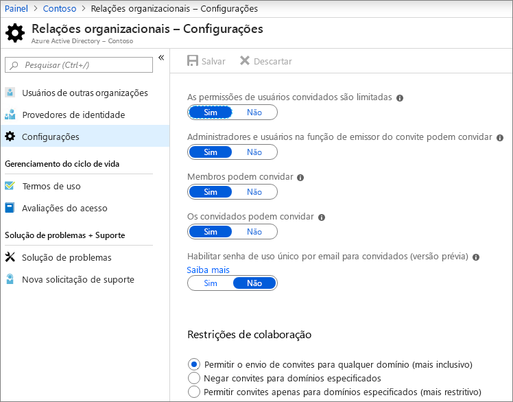

|**Configuração****Setting**|**Padrão****Default**|**Descrição****Description**|
|:-----|:-----|:-----|
|As permissões de usuários convidados são limitadasGuest users permissions are limited|SimYes|Essa configuração afeta as tarefas de diretório que um convidado pode executar.This setting affects the directory tasks that a guest can perform.|
|Somente administradores e usuários na função emissor do convite convidado podem convidarAdmins and users in the guest inviter role can invite|SimYes|Quando definido como **Sim**, os administradores podem convidar convidados por meio do Azure AD e por experiências de compartilhamento da Microsoft 365, como o Teams e SharePoint. Quando definido como **Não**, não podem.When set to **Yes**, admins can invite guests via Azure AD and via  Microsoft 365 sharing experiences such as Teams and SharePoint; when set to **No**, they cannot.|
|Membros podem convidarMembers can invite|SimYes|Quando definido como **Sim**, os membros do Azure AD podem convidar convidados por meio do Azure AD. Quando definido como **Não**, não podem.When set to **Yes**, Azure AD members can invite guests via Azure AD; when set to **No**, they cannot. Quando definido como **Sim**, os membros do Grupo do Office 365 podem convidar convidados com a aprovação do proprietário. Quando definido como **Não**, os membros do Grupo do Office 365 podem convidar convidados com a aprovação do proprietário, mas os proprietários devem ser administradores globais para aprovar.When set to **Yes**, Office 365 Group members can invite guests with owner approval; when set to **No**, Office 365 Group members can invite guests with owner approval but owners must be global administrators to approve.   Observe que a frase **membros podem convidar** se refere aos membros no Azure AD (em vez de convidados) e não aos membros do site ou do grupo no Microsoft 365.Note that **Members can invite** refers to members in Azure AD (as opposed to guests) and not to site or gorup members in  Microsoft 365.   Isso é idêntico à configuração **Permitir que usuários adicionem novos convidados à organização** na Segurança e Privacidade no Microsoft 365.This is identical to the **Let users add new guests to the organization** setting in Microsoft 365 Security & privacy.|
|Os convidados podem convidarGuests can invite|SimYes|Quando definido como **Sim**, os convidados no diretório podem convidar outros convidados para colaborar em recursos do Azure AD e em arquivos e pastas no SharePoint e no OneDrive. Quando definido como **Não**, não podem.When set to **Yes**, guests in the directory can invite other guests to collaborate on Azure AD resources and on files and folders in SharePoint and OneDrive; when set to **No**, they cannot.   Observe que**Permitir que usuários externos encontrem contas de usuários no diretório digitando o endereço de email em correspondência exata** deve ser habilitada no centro de administração do SharePoint para convidados compartilharem arquivos e pastas com outros convidados.Note that **Allow external users to find user accounts in the directory by typing in exact email address matches** must be turned on in the SharePoint admin center for guests to share files and folders with other guests.|
|Habilitar senha de uso único por email para convidados (versão prévia)Enable Email One-Time Passcode for guests (Preview)|NãoNo|Quando definido como **Sim**, os convidados sem um MSA ou uma conta corporativa ou de estudante podem [autenticar com o Azure ad usando uma senha de uso único](https://docs.microsoft.com/azure/active-directory/b2b/one-time-passcode). Quando definido como **Não**, os usuários precisam criar uma Conta Microsoft para autenticação.When set to **Yes**, guests without an MSA or a work or school account can [authenticate with Azure AD using a one-time passcode](https://docs.microsoft.com/azure/active-directory/b2b/one-time-passcode); when set to **No**, users will need to create a Microsoft account in order to authenticate. Essa configuração deve ser definida como **Sim** na [integração do SharePoint e OneDrive com o Azure AD B2B (versão prévia)](https://docs.microsoft.com/sharepoint/sharepoint-azureb2b-integration-preview) para funcionar.This setting must be set to **Yes** for [SharePoint and OneDrive integration with Azure AD B2B (Preview)](https://docs.microsoft.com/sharepoint/sharepoint-azureb2b-integration-preview) to work.|
|Restrições de colaboraçãoCollaboration restrictions|Permitir o envio de convites para qualquer domínioAllow invitations to be sent to any domain|Essa configuração permite especificar uma lista de domínios permitidos ou bloqueados para compartilhamento.This setting allows you to specify a list of allowed or blocked domains for sharing. Quando domínios permitidos são especificados, convites de compartilhamento só poderão ser enviados para esses domínios.When allowed domains are specified, then sharing invitations can only be sent to those domains. Quando domínios negados são especificados, convites de compartilhamento não poderão ser enviados para esses domínios.When denied domains are specified, then sharing invitations cannot be sent to those domains.   Essa configuração afeta as experiências de compartilhamento da Microsoft 365, como o Teams e SharePoint.This setting affects  Microsoft 365 sharing experiences such as Teams and SharePoint. Você pode permitir ou bloquear domínios em um nível mais granular usando a filtragem de domínios no SharePoint ou Teams.You can allow or block domains at a more granular level by using domain filtering in SharePoint or Teams.|

Essas configurações afetam como os usuários são convidados ao diretório.These settings affect how users are invited to the directory. Elas não afetam o compartilhamento com convidados que já estão no diretório.They do not affect sharing with guests who are already in the directory.

## Microsoft 365Microsoft 365

**Função de administrador:** Administrador global**Admin role:** Global administrator

O centro de administração do Microsoft 365 tem configurações no nível da organização para compartilhamento e Grupos do Office 365.The Microsoft 365 admin center has organization-level settings for sharing and for Office 365 Groups.

### CompartilhamentoSharing

**Navegação:** [Centro de administração do Microsoft 365](https://admin.microsoft.com) > Segurança e Privacidade > Compartilhamento**Navigation:** [Microsoft 365 admin center](https://admin.microsoft.com) > Settings > Security & privacy > Sharing

|**Configuração****Setting**|**Padrão****Default**|**Descrição****Description**|
|:-----|:-----|:-----|
|Permitir que os usuários adicionem novos convidados à organizaçãoLet users add new guests to the organization|HabilitadoOn|Quando definido como **Sim**, os membros do Azure AD podem convidar convidados por meio do Azure AD. Quando definido como **Não**, não podem.When set to **Yes**, Azure AD members can invite guests via Azure AD; when set to **No**, they cannot. Quando definido como **Sim**, os membros do Grupo do Office 365 podem convidar convidados com a aprovação do proprietário. Quando definido como **Não**, os membros do Grupo do Office 365 podem convidar convidados com a aprovação do proprietário, mas os proprietários devem ser administradores globais para aprovar.When set to **Yes**, Office 365 Group members can invite guests with owner approval; when set to **No**, Office 365 Group members can invite guests with owner approval but owners must be global administrators to approve.   Observe que a frase **membros podem convidar** se refere aos membros no Azure AD (em vez de convidados) e não aos membros do site ou do grupo no Microsoft 365.Note that **Members can invite** refers to members in Azure AD (as opposed to guests) and not to site or gorup members in  Microsoft 365.   Isso é idêntico à configuração **Membros podem convidar** nas configurações das relações organizacionais do Azure Active Directory.This is identical to the **Members can invite** setting in Azure Active Directory Organizational relationships settings.|

### Grupos do Office 365Office 365 Groups

**Navegação:** [Centro de administração do Microsoft 365](https://admin.microsoft.com) > Configurações > Serviços e suplementos > Grupos do Office 365**Navigation:** [Microsoft 365 admin center](https://admin.microsoft.com) > Settings > Services & add-ins > Office 365 Groups

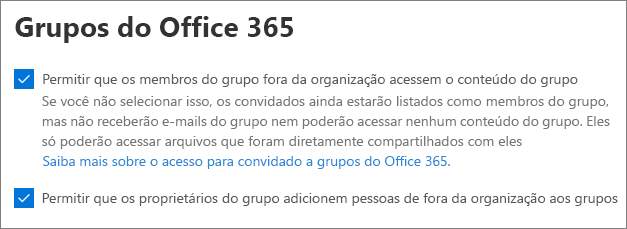

|**Configuração****Setting**|**Padrão****Default**|**Descrição****Description**|
|:-----|:-----|:-----|
|Permitir que os membros do grupo fora da organização acessem o conteúdo do grupoLet group members outside your organization access group content|HabilitadoOn|Quando definida como **Habilitado**, convidados podem acessar o conteúdo de grupos. Quando definido como **Desabilitado**, eles não podem.When set to **On**, guests can access groups content; when set to **Off**, they can't. Essa configuração deve estar **Habilitada** para qualquer cenário em que os usuários convidados estejam interagindo com o Teams ou grupos do Office 365.This setting should be **On** for any scenario where guest users are interacting with Office 365 Groups or Teams.|
|Permitir que os proprietários do grupo adicionem pessoas fora da organização aos gruposLet group owners add people outside your organization to groups|HabilitadoOn|Quando está **Habilitado**, proprietários dos grupos do Office 365 ou do Teams podem convidar novos convidados ao grupo.When **On**, Owners of Office 365 Groups or Teams can invite new guests to the group. Quando está **Desabilitado**, os proprietários só poderão convidar convidados que já estejam no diretório.When **Off**, owners can only invite guests who are already in the directory.|

## TeamsTeams

A chave de acesso principal de convidado do Teams, **Permitir o acesso de convidado no Teams**, deve estar **Habilitada** para que as outras configurações de convidado estejam disponíveis.The Teams master guest access switch, **Allow guest access in Teams**, must be **On** for the other guest settings to be available.

**Função do Administrador:** Administrador de Serviços do Teams**Admin role:** Teams service administrator

### Acesso de convidadosGuest access

**Navegação:** [Centro de administração do Teams](https://admin.teams.microsoft.com) > Configurações em toda a organização > Acesso de convidados**Navigation:** [Teams admin center](https://admin.teams.microsoft.com) > Org-wide settings > Guest access

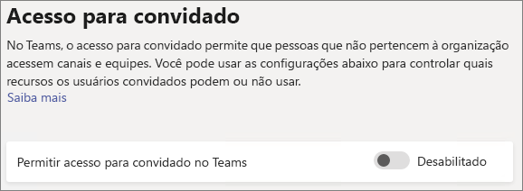

|**Configuração****Setting**|**Padrão****Default**|**Descrição****Description**|
|:-----|:-----|:-----|
|Permitir acesso de convidados no TeamsAllow guest access in Teams|DesabilitadoOff|Habilita ou desabilita o acesso geral de convidados para o Teams.Turns guest access on or off for Teams overall. Essa configuração pode entrar em vigor em até 24 horas após a alteração.This setting can take 24 hours to take effect once changed.|

### Chamadas de convidadoGuest calling

**Navegação:** [Centro de administração do Teams](https://admin.teams.microsoft.com) > Configurações em toda a organização > Acesso de convidados**Navigation:** [Teams admin center](https://admin.teams.microsoft.com) > Org-wide settings > Guest access

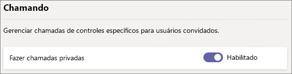

|**Configuração****Setting**|**Padrão****Default**|**Descrição****Description**|
|:-----|:-----|:-----|
|Fazer chamadas privadasMake private calls|HabilitadoOn|Quando está **Habilitado**, os convidados podem fazer chamadas de ponto a ponto no Teams. Quando está **Desabilitado**, não podem.When **On**, guests can make peer-to-peer calls in Teams; when **Off**, they can't.|

### Reunião de convidadosGuest meeting

**Navegação:** [Centro de administração do Teams](https://admin.teams.microsoft.com) > Configurações em toda a organização > Acesso de convidados**Navigation:** [Teams admin center](https://admin.teams.microsoft.com) > Org-wide settings > Guest access

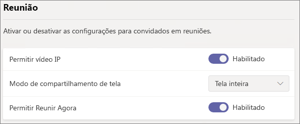

|**Configuração****Setting**|**Padrão****Default**|**Descrição****Description**|
|:-----|:-----|:-----|
|Permitir vídeo IPAllow IP video|HabilitadoOn|Quando está **Habilitado**, os convidados podem usar vídeos em suas chamadas e reuniões. Quando está **Desabilitado**, não podem.When **On**, guests can use video in their calls and meetings; when **Off**, they can't.|
|Modo de compartilhamento de telaScreen sharing mode|Tela inteiraEntire screen|Quando está **Desabilitado**, os convidados não podem compartilhar suas telas no Teams.When **Disabled**, guests can't share their screens in Teams. Quando definido como **Aplicativo único**, os convidados só podem compartilhar um único aplicativo na tela.When set to **Single application**, guests can only share a single application on their screen. Quando definido como **Tela inteira**, os convidados podem optar por compartilhar um aplicativo ou sua tela inteira.When set to **Entire screen**, guests can choose to share an applicaion or their entire screen.|
|Permitir Reunir AgoraAllow Meet Now|HabilitadoOn|Quando está **Habilitado**, os convidados podem usar o recurso Reunir Agora no Teams. Quando está **Desabilitado**, não podem.When **On**, guests can use the Meet Now feature in Teams; when **Off**, they can't.|

### Sistema de mensagens de convidadoGuest messaging

**Navegação:** [Centro de administração do Teams](https://admin.teams.microsoft.com) > Configurações em toda a organização > Acesso de convidados**Navigation:** [Teams admin center](https://admin.teams.microsoft.com) > Org-wide settings > Guest access

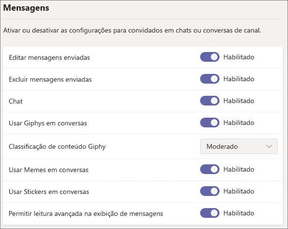

|**Configuração****Setting**|**Padrão****Default**|**Descrição****Description**|
|:-----|:-----|:-----|
|Editar mensagens enviadasEdit sent messages|HabilitadoOn|Quando está **Habilitado**, os convidados podem editar mensagens que já foram enviadas. Quando está **Desabilitado**, não podem.When **On**, guests can edit messages they previously sent; when **Off**, they can't.|
|Excluir mensagens enviadasDelete sent messages|HabilitadoOn|Quando está **Habilitado**, os convidados podem excluir mensagens que já foram enviadas. Quando está **Desabilitado**, não podem.When **On**, guests can delete messages they previously sent; when **Off**, they can't.|
|ChatChat|HabilitadoOn|Quando está **Habilitado**, os convidados podem usar o chat no Teams. Quando está **Desabilitado**, não podem.When **On**, guests can use chat in Teams; when **Off**, they can't.|
|Usar Giphys em conversasUse Giphys in conversations|HabilitadoOn|Quando está **Habilitado**, os convidados podem usar o Giphys nas conversas. Quando está **Desabilitado**, não podem.When **On**, guests can use Giphys in conversations; when **Off**, they can't.|
|Classificação de conteúdo GiphyGiphy content rating|ModeradoModerate|Quando definido como **Permitir todo o conteúdo**, os convidados podem inserir todos os Giphys em chats, independentemente da classificação de conteúdo.When set to **Allow all content**, guests will can insert all Giphys in chats, regardless of the content rating. Quando definido como **Moderado**, os convidados podem inserir Giphys em chats, mas o conteúdo adulto será restringido moderadamente.Wnen set to **Moderate** guests can insert Giphys in chats, but will be moderately restricted from adult content. Quando definido como **Estrito**, os convidados podem inserir Giphys em chats, mas o conteúdo adulto não poderá ser inserido.When set to **Strict** guests can insert Giphys in chats, but will be restricted from inserting adult content.|
|Usar Memes em conversasUse Memes in conversations|HabilitadoOn|Quando está **Habilitado**, os convidados podem usar memes nas conversas. Quando está **Desabilitado**, não podem.When **On**, guests can use memes in conversations; when **Off**, they can't.|
|Figurinha do usuário em conversasUser stickers in conversations|HabilitadoOn|Quando está **Habilitado**, os convidados podem usar figurinhas nas conversas. Quando está **Desabilitada**, não podem.When **On**, guests can use stickers in conversations; when **Off**, they can't.|
|Permitir leitura avançada na exibição de mensagensAllow immersive reader for viewing messages|HabilitadoOn|Quando está **Habilitado**, os convidados podem exibir mensagens na leitura avançada. Quando está **Desabilitada**, não podem.When **On**, guests can view messages in Immersive Reader; when **Off**, they can't.|

## SharePoint e OneDrive (nível da organização)SharePoint and OneDrive (organization-level)

**Função do Administrador:** administrador do SharePoint**Admin role:** SharePoint administrator

Essas configurações afetam todos os sites da organização.These settings affect all of the sites in the organization. Elas não afetam o Teams ou os Grupos do Office 365 diretamente, no entanto, recomendamos que você alinhe essas configurações com as configurações dos Grupos do Office 365 e do Teams para evitar problemas de experiência do usuário.They do not affect Office 365 Groups or Teams directly, however we recommend that you align these settings with the settings for Office 365 Groups and Teams to avoid user experience issues. (Por exemplo, se o compartilhamento de convidados for permitido no Teams, mas não no SharePoint, então os convidados no Teams não terão acesso à guia Arquivos porque os arquivos do Teams estão armazenados no SharePoint.)(For example, if guest sharing is allowed in Teams but not SharePoint, then guests in Teams will not have access to the Files tab because Teams files are stored in SharePoint.)

### Configurações de compartilhamento no SharePoint e no OneDriveSharePoint and OneDrive sharing settings

Como o OneDrive é uma hierarquia de sites no SharePoint, as configurações de compartilhamento no nível da organização afetam diretamente o OneDrive assim como em outros sites do SharePoint.Because OneDrive is a hierarchy of sites within SharePoint, the organization-level sharing settings directly affect OneDrive just as they do other SharePoint sites.

**Navegação:** Centro de Administração do SharePoint > Compartilhamento**Navigation:** SharePoint admin center > Sharing

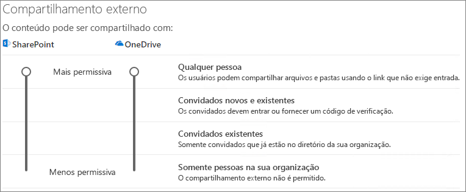

|**Configuração****Setting**|**Padrão****Default**|**Descrição****Description**|
|:-----|:-----|:-----|
|SharePointSharePoint|Qualquer pessoaAnyone|Especifica as permissões de compartilhamento mais permissivas permitidas para sites do SharePoint.Specifies the most permissive sharing permissions allowed for SharePoint sites.|
|OneDriveOneDrive|Qualquer pessoaAnyone|Especifica as permissões de compartilhamento mais permissivas permitidas para sites do OneDrive.Specifies the most permissive sharing permissions allowed for OneDrive sites. Essa configuração não pode ser mais permissiva que a configuração do SharePoint.This setting cannot be more permissive than the SharePoint setting.|

### Configurações de compartilhamento avançado no SharePoint e no OneDriveSharePoint and OneDrive advanced sharing settings

**Navegação:** Centro de Administração do SharePoint > Compartilhamento**Navigation:** SharePoint admin center > Sharing

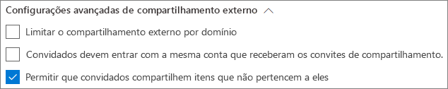

|**Configuração****Setting**|**Padrão****Default**|**Descrição****Description**|
|:-----|:-----|:-----|
|Limitar o compartilhamento externo por domínioLimit external sharing by domain|DesabilitadoOff|Essa configuração permite especificar uma lista de domínios permitidos ou bloqueados para compartilhamento.This setting allows you to specify a list of allowed or blocked domains for sharing. Quando domínios permitidos são especificados, convites de compartilhamento só poderão ser enviados para esses domínios.When allowed domains are specified, then sharing invitations can only be sent to those domains. Quando domínios negados são especificados, convites de compartilhamento não poderão ser enviados para esses domínios.When denied domains are specified, then sharing invitations cannot be sent to those domains.   Essa configuração afeta todos os sites do SharePoint e do OneDrive na organização.This setting affects all SharePoint and OneDrive sites in the organization.|
|Convidados devem entrar com a mesma conta que receberam os convites de compartilhamento.Guests must sign in using the same account to which sharing invitations are sent|DesabilitadoOff|Impede que os convidados resgatem os convites de compartilhamento de sites usando um endereço de email diferente do envio do convite.Prevents guests from redeeming site sharing invitations using a different email address than the invitation was sent to.  [A integração do SharePoint e do OneDrive com o Azure AD B2B (versão prévia)](https://docs.microsoft.com/sharepoint/sharepoint-azureb2b-integration-preview) não usa essa configuração porque todos os convidados são adicionados ao diretório com base no endereço de email do envio do convite.[SharePoint and OneDrive integration with Azure AD B2B (Preview)](https://docs.microsoft.com/sharepoint/sharepoint-azureb2b-integration-preview) does not use this setting because all guests are added to the directory based on the email address that the invitation was sent to. Endereços de email alternativos não podem ser usados para acessar o site.Alternate email addresses cannot be used to access the site.|
|Permitir que convidados compartilhem itens que não pertencem a elesAllow guests to share items they don't own|HabilitadoOn|Quando está **Habilitado**, os convidados podem compartilhar itens que eles não possuem com outros usuários ou convidados. Quando está **Desabilitado**, não podem.When **On**, guests can share items that they don't own with other users or guests; when **Off** they cannot. Os convidados sempre poderão compartilhar itens que têm controle completo.Guests can always share items for which they have full control.|

### Configurações de link para o arquivo e pasta do SharePoint e do OneDriveSharePoint and OneDrive file and folder link settings

Quando arquivos e pastas são compartilhados no SharePoint e no OneDrive, os destinatários de compartilhamento recebem um link com permissões para o arquivo ou pasta, em vez de receberem acesso direto à pasta ou ao arquivo.When files and folders are shared in SharePoint and OneDrive, sharing recipients are sent a link with permissions to the file or folder rather than being granted direct access to the file or folder themselves. Vários tipos de links estão disponíveis e você pode escolher o tipo de link padrão apresentado aos usuários quando eles compartilham um arquivo ou pasta.Several types of links are available, and you can choose the default link type presented to users when they share a file or folder. Você também pode definir opções de expiração e permissões em links para *Qualquer pessoa*.You can also set permissions and expiration options for *Anyone* links.

**Navegação:** Centro de Administração do SharePoint > Compartilhamento**Navigation:** SharePoint admin center > Sharing

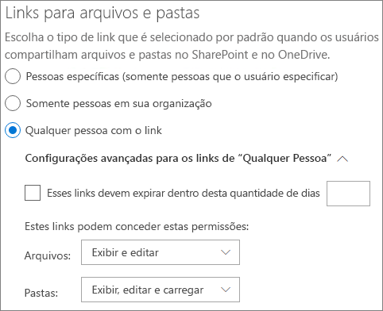

|**Configuração****Setting**|**Padrão****Default**|**Descrição****Description**|
|:-----|:-----|:-----|
|Links para arquivos e pastasFile and folder links|Qualquer pessoa com o linkAnyone with the link|Especifica o link de compartilhamento exibido por padrão quando um usuário compartilha um arquivo ou uma pasta.Specifies which sharing link is shown by default when a user shares a file or folder. Os usuários podem alterar a opção antes de compartilhar, se desejarem.Users can change the option before sharing if they want. Se o padrão estiver definido como **Qualquer pessoa com o link** e *Qualquer pessoa* que compartilha não tem permissão para um determinado site, então **Somente as pessoas da sua organização** serão exibidas como padrão para esse site.If the default is set to **Anyone with the link** and *Anyone* sharing is not allowed for a given site, then **Only people in your organization** will be shown as the default for that site.|
|Esses links devem expirar dentro desta quantidade de diasThese links must expire within this many days|Desabilitado (sem prazo de expiração).Off (no expiration)|Especifica o número de dias em que um link para *Qualquer pessoa* criado deve expirar.Specifies the number of days after an *Anyone* link is created that it expires. Os links expirados não podem ser renovados.Expired links cannot be renewed. Crie um novo link se precisar continuar compartilhar além do prazo de expiração.Create a new link if you need to continue sharing past the expiration.|
|Permissões de arquivoFile permissions|Exibir e editarView and edit slide notes|Especifica os níveis de permissão de arquivo disponíveis para os usuários na criação de um link para *Qualquer pessoa*.Specifies the file permission levels available to users when creating an *Anyone* link. Se **Visualização** estiver selecionada, os usuários só poderão criar links de arquivo para *Qualquer pessoa* com permissões de visualização.If **View** is selected, then users can only create *Anyone* file links with view permissions. Se **Exibir e editar** estiver selecionado, os usuários poderão escolher entre as permissões de visualização e de visualização e edição quando criarem o link.If **View, and edit** is selected, then users can choose between view and view and edit permissions when they create the link.|
|Permissões de pastasFolder permissions|Exibir, editar e carregarView, edit, and upload|Especifica os níveis de permissão de pastas disponíveis para os usuários na criação de um link para *Qualquer pessoa*.Specifies the folder permission levels available to users when creating an *Anyone* link. Se **Visualização** estiver selecionada, os usuários só poderão criar links de pasta para *Qualquer pessoa* com permissões de visualização.If **View** is selected, then users can only create *Anyone* folder links with view permissions. Se **Exibir, editar e carregar** estiver selecionado, os usuários poderão escolher entre as permissões de visualização e de visualização, edição e carregamento quando criarem o link.If **View, edit, and upload** is selected, then users can choose between view and view, edit, and upload permissions when they creat the link.|

### Configurações de grupo de segurança no SharePoint e no OneDriveSharePoint and OneDrive security group settings

Se quer limitar quem pode compartilhar com os convidados no SharePoint e no OneDrive, é possível fazer isso limitando o compartilhamento a pessoas em grupos de segurança especificados.If you want to limit who can share with guests in SharePoint and OneDrive, you can do so by limiting sharing to people in specified security groups. Essas configurações não afetam o compartilhamento por meio dos Grupos do Office 365 ou do Teams.These settings do not affect sharing via Office 365 Groups or Teams. Os convidados que foram convidados por meio de um grupo ou equipe também têm acesso ao site associado, embora o compartilhamento de documentos e pastas só pode ser feito por pessoas nos grupos de segurança especificados.Guests invited via a group or team would also have access to the associated site, though document and folder sharing could only be done by people in the specified security groups.

**Navegação:** Centro de administração do SharePoint > Compartilhamento > Limitar o compartilhamento externo a grupos de segurança específicos**Navigation:** SharePoint admin center > Sharing > Limit external sharing to specific security groups

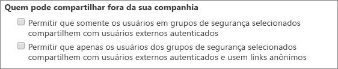

|**Configuração****Setting**|**Padrão****Default**|**Descrição****Description**|
|:-----|:-----|:-----|
|Permitir que somente os usuários em grupos de segurança selecionados compartilhem com usuários externos autenticadosnote the security groups listed for Let only users in selected security groups share with authenticated external users.|DesabilitadoOff|Quando está **Habilitado**, somente as pessoas dos grupos de segurança especificados podem compartilhar com usuários externos.When **On**, only the people in the specified security groups can share with external users. Somente links de *Pessoas específicas* estão disponíveis.Only *Specific people* links are available. *Qualquer pessoa* compartilhando está efetivamente desabilito a não ser que **Permitir que apenas usuários dos grupos de segurança selecionados compartilhem com usuários externos autenticados e usem links anônimos** também esteja **Habilitado**.*Anyone* sharing is effectively disabled unless **Let only users in selected security groups share with authenticated external users and using anonymous links** is also **On**|
|Permitir que apenas os usuários dos grupos de segurança selecionados compartilhem com usuários externos autenticados e usem links anônimos.note the security groups listed for Let only users in selected security groups share with authenticated external users and using anonymous links.|DesabilitadoOff|Quando está **Habilitado**, somente as pessoas dos grupos de segurança especificados podem compartilhar com convidados.When **On**, only the people in the specified security groups can share with guests. Os links *Qualquer pessoa* e *Pessoas específicas* estão disponíveis.Both *Anyone* and *Specific people* links are available.|

Essas duas configurações podem ser usadas ao mesmo tempo.Both of these settings can be used at the same time. Se um usuário tiver um grupo de segurança especificado para as duas configurações, o nível de permissão maior prevalecerá (*Qualquer pessoa* mais *Usuário específico*).If a user is in security groups specified for both settings, then the greater permission level prevails (*Anyone* plus *Specific user*).

## SharePoint (nível do site)SharePoint (site level)

**Função do Administrador:** administrador do SharePoint**Admin role:** SharePoint administrator

### Compartilhamento do siteSite sharing

Você pode definir as permissões de compartilhamento de convidado para cada site do SharePoint.You can set guest sharing permissions for each site in SharePoint. Essa configuração se aplica ao compartilhamento do site e ao compartilhamento de arquivo e pasta.This setting applies to both site sharing and file and folder sharing. (O compartilhamento de *Qualquer pessoa* não está disponível no compartilhamento do site.(*Anyone* sharing is not available for site sharing. Se escolher **Qualquer pessoa**, os usuários poderão compartilhar arquivos e pastas usando os links para *Qualquer pessoa* e o site em si com convidados novos e existentes.If you choose **Anyone**, users will be able to share files and folders by using *Anyone* links, and the site itself with new and existing guests.)

**Navegação:** Centro de administração do SharePoint > Sites Ativos > Selecionar o site > Compartilhamento**Navigation:** SharePoint admin center > Active sites > select the site > Sharing

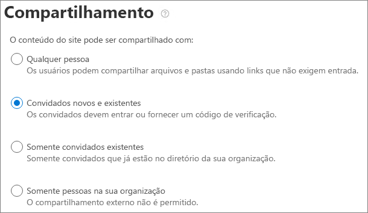

|**Configuração****Setting**|**Padrão****Default**|**Descrição****Description**|
|:-----|:-----|:-----|
|O conteúdo do site pode ser compartilhado comSite content can be shared with|Varia por tipo de site (veja a tabela abaixo)Varies by site type (see the table below)|Indica o tipo de compartilhamento externo permitido para esse site.Indicates the type of external sharing allowed for this site. As opções disponíveis aqui estão sujeitas às configurações de compartilhamento no nível da organização para o SharePoint.Options available here are subject to the organization-level sharing settings for SharePoint.|

Como essas configurações estão sujeitas às configurações de toda a organização do SharePoint, a configuração de compartilhamento efetiva do site poderá mudar se a configuração no nível da organização mudar.Because these settings are subject to the organization-wide settings for SharePoint, the effective sharing setting for the site may change if the organization-level setting changes. Se escolher uma configuração aqui e o nível da organização for definido posteriormente como um valor mais restritivo, esse site funcionará nesse valor mais restritivo.If you choose a setting here and the organization-level is later set to a more restrictive value, then this site will operate at that more restrictive value. Por exemplo, se escolher **Qualquer pessoa** e a configuração no nível da organização for configurada posteriormente como **Convidados novos e existentes**, então esse site permitirá convidados novos e existentes.For example, if you choose **Anyone** and the organization-level setting is later set to **New and existing guests**, then this site will only allow new and existing guests. Se a configuração no nível da organização for definida novamente como **Qualquer pessoa**, esse site permitirá novamente os links para *Qualquer pessoa*.If the organization-level setting is then set back to **Anyone**, this site would again allow *Anyone* links.

A tabela a seguir exibe a configuração de compartilhamento padrão para cada tipo de site.The table below shows the default sharing setting for each site type.

|**Tipo de site****Site Type**|**Configuração de compartilhamento padrão****Default sharing setting**|
|:-----|:-----|
|ClássicoClassic.|**Somente pessoas em sua organização****Only people in your organization**|
|OneDriveOneDrive|**Qualquer pessoa****Anyone**|
|Sites conectados ao grupo (inclusive no Teams)Group-connected sites (including Teams)|**Convidados novos e existentes** se a configuração de Grupos do Office 365 **Permitir que os proprietários de grupos adicionem pessoas de fora da organização aos grupos** estiver **Habilitada**. Caso contrário, **Somente convidados existentes****New and existing guests** if the Office 365 Groups setting **Let group owners add people outside the organization to groups** is **On**; otherwise **Existing guests only**|
|ComunicaçãoCommunication sites|**Somente pessoas em sua organização****Only people in your organization**|
|Sites modernos sem grupo (site de equipe #STS3)Modern sites with no group (#STS3 TeamSite)|**Somente pessoas em sua organização****Only people in your organization**|

## Confira tambémSee also

[Visão geral de compartilhamento externo do SharePoint e do OneDriveSharePoint and OneDrive external sharing overview](https://docs.microsoft.com/sharepoint/external-sharing-overview)

[Acesso para convidado no Microsoft TeamsGuest access in Teams](https://docs.microsoft.com/MicrosoftTeams/guest-access)

[Adicionar convidados nos Grupos do Office 365Adding guests to Office 365 Groups](https://support.office.com/article/bfc7a840-868f-4fd6-a390-f347bf51aff6)