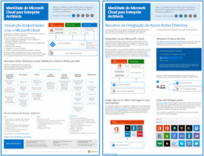
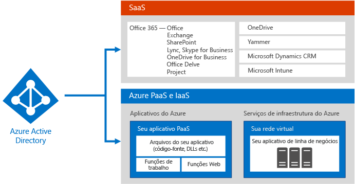
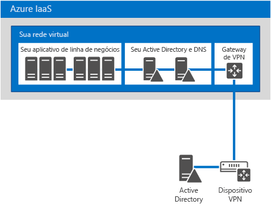
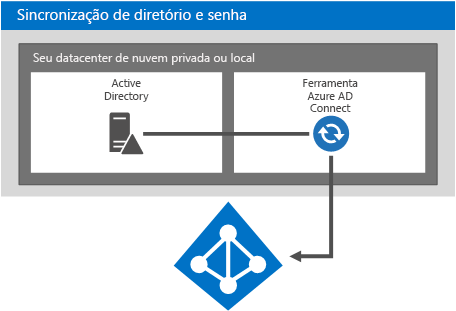
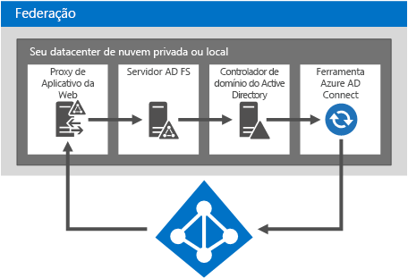
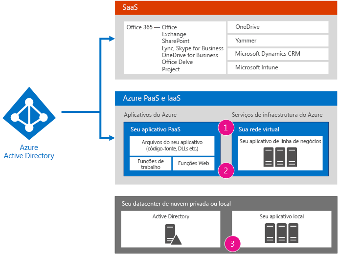
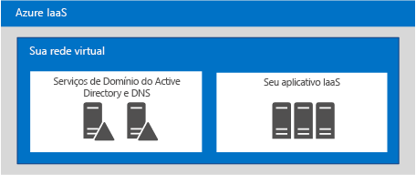

# Identidade da Microsoft Cloud para arquitetos corporativos

 **Resumo:** Criar sua solução de identidade para plataformas e serviços em nuvem da Microsoft.
  
Este artigo descreve o que os arquitetos de TI precisam saber sobre a criação de identidade para organizações que usam plataformas e serviços em nuvem da Microsoft. Você também pode visualizar este artigo como um cartaz de 5 páginas e imprimi-lo em formato tabloide (também conhecido por ledger, 11x17 ou A3).
  

  
[PDF](https://go.microsoft.com/fwlink/p/?LinkId=524586) | [Visio](https://download.microsoft.com/download/2/3/8/238228E6-9017-4F6C-BD3C-5559E6708F82/MSFT_cloud_architecture_identity.vsd) | [Mais idiomas](https://www.microsoft.com/download/details.aspx?id=54431)
  
Você também pode ver todos os modelos nos [recursos de arquitetura de TI de nuvem da Microsoft](microsoft-cloud-it-architecture-resources.md) e passe por meio [mapa de nuvem empresarial da Microsoft: recursos para os tomadores de decisão de TI](https://aka.ms/cloudarchitecture).
  
> [!NOTE]
> Este artigo reflete a versão de janeiro de 2016 do pôster de **identidade de nuvem da Microsoft para arquitetos da empresa** . Ele não contém as alterações para o de 2016 abril ou versões posteriores do pôster.
  
## Criação de identidade para a nuvem da Microsoft

A integração das suas identidades com a nuvem da Microsoft oferece acesso a uma ampla gama de opções de serviços e plataformas em nuvem. Há duas opções principais:
  
- Você pode integrar ao Microsoft Azure AD (Active Directory). Isso envolve a sincronização das suas contas no local com o Azure AD, o provedor de identidade para a nuvem da Microsoft.
    
- Você pode estender seu ambiente do Active Directory Domain Services (AD DS) local para máquinas virtuais em execução nos serviços de infraestrutura do Microsoft Azure.
    

  
 **Figura 1: Opções para a criação das suas identidades na nuvem**
  
A Figura 1 mostra como o Azure AD é o provedor de identidade dos serviços de Software como serviço (SaaS) da Microsoft e de aplicativos do de Plataforma como serviço (PaaS) do Azure e como os aplicativos de linhas de negócios podem usar o AD DS local. 
  
### Azure Active Directory

O Microsoft Azure AD é o serviço de gerenciamento de acesso e identidade hospedado em nuvem da Microsoft. Ele está no centro dos serviços e das plataformas em nuvem da Microsoft. A integração com o Azure AD oferece acesso a todos os serviços de SaaS da Microsoft que usam seu conjunto atual de contas e senhas. Essa integração também oferece identidade baseada em nuvem para aplicativos de PaaS do Azure. 
  
> [!NOTE]
> O Azure AD não substitui a necessidade do AD DS local para organizações empresariais ou de máquinas virtuais com base em Windows em execução no Azure Infraestrutura como serviço (IaaS). 
  
Há três edições do Azure AD: Grátis, Básico e Premium. 
  
||||
|:-----|:-----|:-----|
|**Gratuito**   |**Básica**   |**Premium**   |
| Gerenciar contas de usuário    Sincronizar com diretórios locais    Logon único entre Azure, Office 365 e milhares de outros aplicativos de SaaS populares, como Salesforce, Workday, Concur, DocuSign, Google Apps, Box, ServiceNow, Dropbox e mais   | Inclui todas as capacidades na edição livre, além de:    Marca da empresa    Acesso a aplicativos baseados em grupo    Redefinição de senha de autoatendimento    SLA corporativo de 99,9%   | Inclui todos os recursos das edições Free e Basic, além de:    Gerenciamento de grupo de autoatendimento    Relatórios e alertas avançados de segurança    Multi-factor Authentication    Redefinição de senha com write-back para AD DS local    Sincronização bidirecional da ferramenta Azure AD Connect    Proxy do Aplicativo Azure AD    Microsoft Forefront Identity Manager (MIM)   |
   
Para mais informações sobre versões, confira [Edições do Azure Active Directory](https://go.microsoft.com/fwlink/p/?LinkId=524280).
  
### Opção 1: Integração com o Azure Active Directory

A maioria das organizações sincroniza um conjunto de objetos e atributos padrão para seu locatário do Azure AD. A ferramenta Azure AD Connect sincroniza suas contas entre o AD DS local e o locatário Azure AD.
  

  
 **Figura 2: Integração com o Azure AD**
  
A Figura 2 mostra como a ferramenta Azure AD Connect obtém as alterações do AD DS e as envia ao seu locatário do Azure AD. Nesse caso, seu locatário do Azure AD é uma duplicata hospedada na nuvem de conteúdo do diretório local essencial.
  
Muitas organizações usam o AD DS como provedor de identidade local. Você pode usar um tipo diferente de provedor de identidade local (como um que use LDAP) e sincronizá-lo no Azure AD.
  
### Opção 2: Estender o AD DS ao Azure

Estender o AD DS para máquinas virtuais em execução nos serviços de infraestrutura do Azure oferece suporte a um conjunto diferente de soluções e aplicativos em comparação à sincronização com o Azure AD. Aqui estão duas:
  
- Oferece suporte a soluções baseadas em nuvem que requerem autenticação NTLM ou Kerberos ou máquinas virtuais associadas a um domínio do AD DS.
    
- Adiciona mais potencial de integração para aplicativos e serviços em nuvem em plataformas e serviços em nuvem da Microsoft.
    

  
 **Figura 3: Estender o AD DS ao Azure**
  
A Figura 3 mostra um controlador de domínios do AD DS conectado a uma rede virtual do Azure por um dispositivo VPN no local e um gateway de VPN do Azure. A rede virtual do Azure contém servidores para um aplicativo de linha de negócios e seu próprio conjunto de controladores de domínios do AD DS.
  
### Mais informações

- [A sincronização do seu diretório com o Office 365 é fácil](https://go.microsoft.com/fwlink/p/?LinkId=524281)
    
- [Infográfico: Gerenciamento de identidade e acesso de nuvem](https://go.microsoft.com/fwlink/p/?LinkId=524282)
    
- [Azure Active Directory](https://go.microsoft.com/fwlink/p/?LinkId=524283)
    
## Integrar suas contas do AD DS no local com o Microsoft Azure AD

Ao sincronizar suas contas AD DS no local com o Azure AD, seus usuários podem usar suas contas AD DS locais para acessar:
  
- Todos os serviços de SaaS da Microsoft (Office 365, Microsoft Intune e Dynamics CRM Online)
    
- Os aplicativos em execução na PaaS do Azure
    
Há duas maneiras de configurar essa integração:
  
- Sincronização de diretório e senha
    
- Federação e logon único
    
Comece com a opção mais simples que atenda às suas necessidades. Você pode alternar entre essas opções, se necessário.
  
> [!NOTE]
> Usando contas somente na nuvem (não integração com seu AD DS local) não é recomendado para organizações de grande porte. 
  
### Sincronização de diretório e senha

Essa é a opção mais simples e requer apenas um servidor que execute a ferramenta Azure AD Connect. 
  

  
 **Figura 4: Configuração de sincronização de diretório e senha**
  
A Figura 4 mostra um datacenter local ou de nuvem privada com um controlador de domínio AD DS. Um servidor que executa a ferramenta Azure AD Connect sincroniza a lista de nomes de conta com o Azure AD.
  
Com essa opção:
  
- As contas de usuário são sincronizadas do seu AD DS local (ou de outro provedor de identidade) para o seu locatário do AD Azure. O diretório local continua sendo a origem autoritativa das contas, e você gerencia todas as alterações nas contas nele.
    
- O Azure AD executa toda a autenticação dos serviços baseados em SaaS da Microsoft e aplicativos de PaaS do Azure.
    
- Você também pode configurar a sincronização para várias florestas do AD DS.
    
Com sincronização de senha:
  
- Os usuários são solicitados a inserir uma senha ao acessar serviços na nuvem, que é a mesma senha que eles usam para recursos locais.
    
- As senhas de usuário nunca são enviadas como texto não criptografado para o Azure AD. Em vez disso, um hash da senha é usado. É impossível criptograficamente descriptografar ou fazer engenharia reversa do hash da senha e obter a senha em texto não criptografado. 
    
Com MFA (Autenticação Multifator):
  
- Você pode aproveitar os recursos básicos de MFA oferecidos com o Office 365.
    
- Os desenvolvedores de aplicativos de PaaS do Azure podem aproveitar o Serviço de Autenticação Multifator do Azure.
    
A sincronização de diretórios não oferece integração com as soluções de MFA locais.
  
### Federação e logon único

Essa opção exige infraestrutura e servidores adicionais. 
  

  
 **Figura 5: Servidores necessários para a autenticação federada**
  
A Figura 5 mostra o conjunto de componentes de autenticação federada. O Azure AD entra em contato com um proxy de aplicativo Web que encaminha a solicitação de autenticação para um servidor de serviços de Federação do Active Directory (AD FS), que encaminha a solicitação para um controlador de domínios do AD DS para avaliação e resposta. Um servidor que executa a ferramenta Azure AD Connect sincroniza a lista de nomes de conta do AD DS com o Azure AD.
  
A federação fornece esses recursos corporativos adicionais:
  
- Todas as solicitações de autenticação enviadas ao Azure AD são encaminhadas para e executadas no provedor de identidade local pelo AD FS.
    
- Funciona com provedores de identidade não Microsoft.
    
- A sincronização de hash de senha pode atuar como um backup de entrada para entrada federada (por exemplo, se houver falha na autenticação federada).
    
Use federação se:
  
- Logon único for necessário. Com o logon único, os usuários não serão solicitados a inserir credenciais (nome de usuário ou senha) ao acessar um serviço na nuvem.
    
- O AD FS já estiver implantado.
    
- Você usar um provedor de identidade de terceiros.
    
- Você usa o Forefront Identity Manager 2010 R2 (não oferece suporte a sincronização de hash de senha).
    
- Você tiver um cartão inteligente integrado local ou outra solução de MFA.
    
- Você precisar de auditoria de credenciais e/ou desativação de contas.
    
- Sua organização exige restrições de entrada do cliente pela rede local ou horas de trabalho.
    
- É preciso estar em conformidade com FIPS (Padrões Federais de Processamento de Informações).
    
A autenticação federada requer um maior investimento na infraestrutura local.
  
- Os servidores no local devem estar acessíveis pela Internet por meio de um firewall corporativo. A Microsoft recomenda o uso de servidores Proxy de aplicativo da Web implantados na sua rede de perímetro.
    
- Requer hardware, licenças e operações para servidores do AD FS, proxy do AD FS ou servidores Proxy de Aplicativo Web, firewalls e balanceadores de carga. 
    
- Disponibilidade e desempenho são importantes para garantir que os usuários possam acessar o Office 365 e outros aplicativos em nuvem.
    
### Mais informações

- [A sincronização do seu diretório com o Office 365 é fácil](https://go.microsoft.com/fwlink/p/?LinkId=524281)
    
- [Prepare-se para provisionar usuários pela sincronização de diretório com o Office 365](https://go.microsoft.com/fwlink/p/?LinkId=524284)
    
- [Autenticação de vários fatores para o Office 365](https://go.microsoft.com/fwlink/p/?LinkID=392012)
    
- [Autenticação de vários fatores do Azure](https://go.microsoft.com/fwlink/p/?LinkId=524285)
    
- [TechEd 2014: Integração de Diretórios: Criação de um diretório com o Active Directory e o Azure Active Directory](https://go.microsoft.com/fwlink/p/?LinkId=524286)
    
## Estender o AD DS ao Azure

Estender o AD DS ao Azure é a primeira etapa para oferecer suporte a aplicativos de linha de negócios em execução em máquinas virtuais nos serviços de infraestrutura do Azure, que fornece:
  
- Suporte para soluções baseadas em nuvem que exigem autenticação NTLM ou Kerberos ou máquinas virtuais associadas a um domínio do AD DS.
    
- Potencial de integração adicional para aplicativos e serviços em nuvem e pode ser adicionado a qualquer momento.
    

  
 **Figura 6: Estender o AD DS para uma rede virtual do Azure**
  
A Figura 6 mostra um datacenter local ou de nuvem privada com o AD DS conectado a uma rede virtual Azure com uma conexão VPN ou ExpressRoute de site para site. A rede virtual do Azure contém servidores para um aplicativo de linha de negócios e seu próprio conjunto de controladores de domínios do AD DS. Essa configuração é uma implantação híbrida do AD DS local e nos serviços de infraestrutura do Azure. Exige:
  
- Uma rede virtual do Azure.
    
- Uma conexão entre um dispositivo ou roteador de rede virtual privada (VPN) local ou um gateway de VPN Azure.
    
- Usando uma parte do seu espaço de endereço IP local para máquinas virtuais da rede virtual.
    
- Implantando um ou mais controladores de domínio na rede virtual designada como servidores de catálogo global (reduz o tráfego de saída pela conexão VPN).
    
Essa arquitetura de identidade oferece suporte a um conjunto diferente de soluções e aplicativos em comparação à sincronização com o Azure AD.
  
### Opções de conexão local para o Azure

Para se conectar à sua rede local com uma rede virtual do Azure, você pode usar:
  
- Uma conexão VPN de site para site, que pode se conectar a 1 a 10 sites (inclusive outras redes virtuais do Azure) a uma única rede virtual do Azure.
    
- ExpressRoute, um link WAN particular e seguro ao Azure por um provedor de serviços de rede e datacenter parceiro. As conexões ExpressRoute podem oferecer maior confiabilidade, largura de banda superior e latências inferiores.
    
### Mais informações

- [Conectividade entre locais para redes virtuais](https://go.microsoft.com/fwlink/p/?LinkId=524293)
    
- [Visão geral técnica do ExpressRoute](https://go.microsoft.com/fwlink/?LinkID=392081)
    
- [Diretrizes para implantação do Active Directory do Windows Server em Máquinas Virtuais do Azure](https://go.microsoft.com/fwlink/p/?LinkId=524295)
    
## Integrar os aplicativos com identidades de nuvem

Ao criar e desenvolver aplicativos que são executados na nuvem, você deve ter em mente a homogeneidade da experiência do usuário no processo de autenticação, incluindo o conjunto de credenciais necessárias. Por exemplo, ao usar credenciais do Windows, seja no Azure AD ou em um AD DS estendido, certifique-se de que os usuários possam autenticar rapidamente e se concentrar em suas tarefas.
  

  
 **Figura 7: Integrar os aplicativos com identidades de nuvem**
  
A Figura 7 mostra três opções para integrar seu aplicativo com identidades de nuvem.
  
1. Registre seus aplicativos hospedados na nuvem com o Azure AD.
    
    Confira o artigo da MSDN [Integração de aplicativos com o Azure Active Directory](https://go.microsoft.com/fwlink/p/?LinkId=524303). Isso permite que você use o Azure AD para autenticar o acesso ao seu aplicativo de PaaS, bem como permite que usuários ou administradores concedam direitos ao seu aplicativo para acessar o conteúdo em seu nome de outros serviços de nuvem, como o Office 365. Mais detalhes e amostras de código podem ser encontrados no artigo da MSDN [Cenários de autenticação do Azure Active Directory](https://go.microsoft.com/fwlink/p/?LinkId=524304). 
    
2. Aplicativos que exigem autenticação programática para obter acesso a um aplicativo protegido por AD SD, AD FS no Windows Server 2012 R2 ou Azure AD podem usar:
    
  - A [API do Microsoft Azure AD Graph](https://go.microsoft.com/fwlink/p/?LinkId=524305)
    
  - [Biblioteca de autenticação do Active Directory (ADAL)](https://go.microsoft.com/fwlink/p/?LinkID=524297)
    
    A API do Microsoft Azure AD Graph oferece suporte a OAuth e OpenID Connect. Ela também funciona com aplicativos de PaaS.
    
3. Configure aplicativos no local ou de linha de negócios em execução em máquinas virtuais em uma rede virtual do Azure para usar a autenticação do Windows (NTLM ou Kerberos) diretamente. Essa é a melhor experiência para usuários e requer menos configuração para desenvolvedores de aplicativos de servidor.
    
### Exemplo de integração do aplicativo

Uma organização cria um aplicativo ASP.NET que expõe um ponto de extremidade REST no qual outros aplicativos podem obter os dados de vendas mais recentes. O acesso ao ponto de extremidade REST é protegido com o Azure AD. Aplicativos devem fornecer as credenciais que podem ser autenticadas pelo Azure AD antes que o aplicativo ASP.NET envie os dados solicitados. Outros desenvolvedores na organização poderão então escrever seus próprios aplicativos que usam os dados de vendas do ponto de extremidade REST.
  
Para autenticar no Azure AD e recuperar dados, o ADAL gerencia o processo de autenticação de usuário e transmite o token de acesso para o aplicativo para que ele possa ser usado para obter acesso aos dados de vendas. O ADAL reduz muito da complexidade da obtenção de tokens de análise, fluxos OAuth e outros elementos. O ADAL é outra solução de tecnologia que está mudando rapidamente, então os desenvolvedores devem buscar a versão mais recente no NuGet.
  
## Implantar componentes de diretório no Azure

Você pode implantar componentes de diretório, como servidores, para sincronização de senha ou autenticação federada em uma rede virtual do Azure em vez de em um datacenter no local. Considere os benefícios, especialmente se você planeja estender o AD DS ao Azure.
  
Aqui estão os componentes de diretório que podem ser colocados em uma rede virtual do Azure:
  
- Ferramenta Azure AD Connect
    
- Componentes de autenticação federada
    
- Um ambiente autônomo do AD DS
    
### Ferramenta AD Connect

A ferramenta Azure AD Connect pode ser hospedada na nuvem em uma rede virtual do Azure. Considere estes benefícios da implantação dessa carga de trabalho no Azure:
  
- Operações de provisionamento potencialmente mais rápidas e menor custo de operações
    
- Maior disponibilidade
    

  
 **Figura 8: A ferramenta AD Connect em execução no Azure**
  
A Figura 8 mostra a ferramenta AD Connect em execução em uma máquina virtual em uma rede virtual do Azure, que consulta um controlador de domínios do AD DS local a respeito de alterações de conta e envia essas alterações para o Office 365. Essa solução funciona com:
  
- Serviços do Office 365.
    
- Aplicativos de PaaS do Azure disponíveis pela Internet.
    
- Aplicativos de linha de negócios no Azure que estão disponíveis em ambientes no local por meio da conexão VPN de site a site ou ExpressRoute.
    
Para mais informações, confira [Integrar suas identidades locais ao Azure Active Directory](https://go.microsoft.com/fwlink/p/?LinkId=524307).
  
### Infraestrutura de autenticação federada

Se você ainda não tiver implantado o AD FS no local, considere esses benefícios da implantação dessa carga de trabalho no Azure:
  
- Fornece autonomia para autenticação em serviços de nuvem (sem dependências locais)
    
- Reduz servidores e ferramentas hospedados localmente
    
- Usa um gateway de VPN site a site em um cluster de failover de dois nós para conectar-se ao Azure (novo)
    
- Usa ACLs para garantir que os servidores Proxy de Aplicativo Web possam comunicar-se apenas com o AD FS, não com controladores de domínio ou outros servidores diretamente
    

  
 **Figura 9: Implantar sua infraestrutura de autenticação federada no Azure**
  
A Figura 9 mostra um conjunto controladores de domínio locais que replicam informações do AD DS com um conjunto de controladores de domínio em uma rede virtual do Azure. A ferramenta Azure AD Connect em execução em um servidor na rede virtual do Azure consulta controladores de domínio local a respeito de alterações e, em seguida, envia essas alterações para o Azure AD. As solicitações de autenticação de entrada para o Azure AD de serviços de SaaS da Microsoft, aplicativos de PaaS do Azure e outros aplicativos em nuvem são encaminhadas para um balanceador de carga externo que encaminha a solicitação para um conjunto de servidores Proxy de aplicativo da Web. Os servidores Proxy de aplicativo da Web encaminham a solicitação um balanceador de carga interno, que encaminha a solicitação para um conjunto de servidores do AD FS. Os servidores do AD FS encaminham a solicitação para um controlador de domínios para validar as credenciais de envio.
  
 Essa solução funciona com:
  
- Aplicativos que exigem Kerberos
    
- Todos os serviços de SaaS da Microsoft
    
- Aplicativos no Azure voltados para a Internet
    
- Aplicativos na IaaS ou na PaaS do Azure que exigem autenticação com o conjunto de contas no AD DS da sua organização
    
Para mais informações, confira [Integrar suas identidades locais ao Azure Active Directory](https://go.microsoft.com/fwlink/p/?LinkId=524307).
  
### Ambiente autônomo do AD DS em uma rede virtual do Azure

Não é necessário sempre integrar um aplicativo em nuvem com o seu ambiente local. Por exemplo, um domínio autônomo do AD DS em uma rede virtual do Azure oferece suporte a aplicativos que são públicos, como sites da Internet.
  

  
 **Figura 10: Um ambiente de autônomo do AD DS de um aplicativo baseado em servidor**
  
A Figura 10 mostra uma rede virtual do Azure que hospeda um conjunto de servidores do AD DS, oferecendo serviços de DNS e AD DS, com um conjunto de servidores que hospedam um aplicativo. Essa solução funciona com:
  
- Sites e aplicativos conectados à Internet
    
- Aplicativos que exigem autenticação NTLM ou Kerberos
    
- Aplicativos executados em servidores com Windows que requerem AD DS
    
Para mais informações, confira [Integrar suas identidades locais ao Azure Active Directory](https://go.microsoft.com/fwlink/p/?LinkId=524307).
  
## See Also

[Recursos de arquitetura de TI do Microsoft](microsoft-cloud-it-architecture-resources.md)

[Mapa da nuvem corporativa da Microsoft Recursos para responsáveis pelas decisões de TI](https://sway.com/FJ2xsyWtkJc2taRD)

