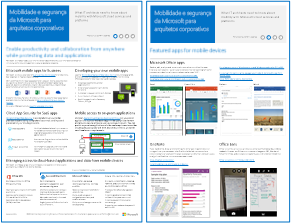
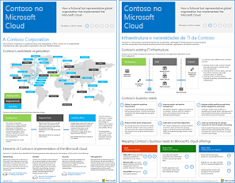
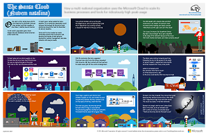
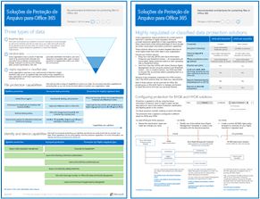
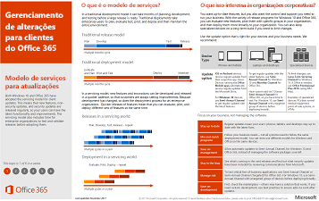

# Recursos de arquitetura de TI do Microsoft CloudMicrosoft Cloud IT architecture resources

 **Resumo:** Saiba mais sobre as plataformas e serviços em nuvem da Microsoft Veja nosso mapa do Enterprise Cloud, explore nossa série de arquitetura de nuvem e muito mais.**Summary:** Learn about Microsoft cloud services and platforms. Review our enterprise cloud roadmap, explore our cloud architecture series, and more.
  
Esses cartazes e ferramentas de arquitetura proporcionam informações sobre os serviços e plataformas de nuvem da Microsoft, como o Office 365, Microsoft Azure, Microsoft Intune, Microsoft Dynamics 365, datacenter da nuvem privada e soluções híbridas no local e em nuvem. Os arquitetos e tomadores de decisões da TI podem usar esses recursos para determinar as soluções ideais para suas cargas de trabalho e para tomar decisões em relação aos principais componentes de infraestrutura, como a identidade e a segurança.These architecture tools and posters give you information about Microsoft cloud services and platforms, including Office 365, Microsoft Azure, Microsoft Intune, Microsoft Dynamics 365, private cloud datacenter, and hybrid on-premises and cloud solutions. IT decision makers and architects can use these resources to determine the ideal solutions for their workloads and to make decisions about core infrastructure components such as identity and security. 
  
- **[Roteiro do Enterprise Cloud da Microsoft](microsoft-cloud-it-architecture-resources.md#roadmap)** (Sway)**[Microsoft's Enterprise Cloud Roadmap](microsoft-cloud-it-architecture-resources.md#roadmap)** (Sway)
    
- **[Série Microsoft Cloud para arquitetos corporativos](microsoft-cloud-it-architecture-resources.md#cloudarch)****[Microsoft Cloud for Enterprise Architects Series](microsoft-cloud-it-architecture-resources.md#cloudarch)** 
    - [Opções de plataforma e serviços da Microsoft CloudMicrosoft Cloud Services and Platform Options](microsoft-cloud-it-architecture-resources.md#platformoptions)
    - [Identidade da Microsoft Cloud para arquitetos corporativosMicrosoft Cloud Identity for Enterprise Architects](microsoft-cloud-it-architecture-resources.md#identity)
    - [Segurança na Microsoft Cloud para arquitetos corporativosMicrosoft Cloud Security for Enterprise Architects](microsoft-cloud-it-architecture-resources.md#security)
    - [Rede do Microsoft Cloud para arquitetos corporativosMicrosoft Cloud Networking for Enterprise Architects](microsoft-cloud-it-architecture-resources.md#networking)
    - [Mobilidade e segurança da Microsoft para arquitetos corporativosMicrosoft Mobility and Security for Enterprise Architects](microsoft-cloud-it-architecture-resources.md#mobility)
    - [Armazenamento do Microsoft Cloud para arquitetos corporativosMicrosoft Cloud Storage for Enterprise Architects](microsoft-cloud-it-architecture-resources.md#storage)
    - [Nuvem híbrida da Microsoft para arquitetos corporativosMicrosoft Hybrid Cloud for Enterprise Architects](microsoft-cloud-it-architecture-resources.md#hybrid)
    - [Contoso na Microsoft CloudContoso in the Microsoft Cloud](microsoft-cloud-it-architecture-resources.md#contoso)
    - [Ataques comuns e recursos da Microsoft que protegem sua organizaçãoCommon attacks and Microsoft capabilities that protect your organizaion](#common-attacks-and-microsoft-capabilities-that-protect-your-organization)
    
- **[Office 365 Enterprise Solution Series](microsoft-cloud-it-architecture-resources.md#BKMK_o365solutions)**:**[Office 365 Enterprise Solution Series](microsoft-cloud-it-architecture-resources.md#BKMK_o365solutions)**:
    - [Proteção de Informações para o Office 365Information Protection for Office 365](microsoft-cloud-it-architecture-resources.md#BKMK_infoprotect)
    - [Proteção de identidade e dispositivo para o Office 365Identity and Device Protection for Office 365](microsoft-cloud-it-architecture-resources.md#BKMK_O365IDP)
    - [Soluções para proteção de arquivos do Office 365File Protection Solutions in Office 365](microsoft-cloud-it-architecture-resources.md#BKMK_O365fileprotect)
    - [Gerenciamento de alterações para clientes do Office 365Change Management for Office 365 Clients](microsoft-cloud-it-architecture-resources.md#changemgmt)
    - [Implantação de uma área de trabalho segura e moderna com a MicrosoftDeploy a modern and secure desktop with Microsoft](microsoft-cloud-it-architecture-resources.md#msd)
    
> [!TIP]
> A maioria dos cartazes desta página está disponível em vários idiomas, inclusive alemão, chinês, coreano, espanhol, francês, inglês, italiano, japonês, português e russo. Para baixar um cartaz em um desses idiomas, clique no link **Mais idiomas**.Most of the posters on this page are available in multiple languages, including Chinese, English, French, German, Italian, Japanese, Korean, Portuguese, Russian, and Spanish. To download a poster in one of these languages, click the **More languages** link for that poster.
  
Dê sua opinião! Envie um email para [cloudadopt@microsoft.com](mailto:cloudadopt@microsoft.com).Let us know what you think! Send us email at [cloudadopt@microsoft.com](mailto:cloudadopt@microsoft.com). 
  

## Roteiro do Enterprise Cloud da MicrosoftMicrosoft's Enterprise Cloud Roadmap

Confira cartazes, conjuntos de ícones, locais de comunidade e outros recursos que descrevem a solução de nuvem mais completa do mercado.See the posters, icon sets, community venues, and other resources that describe the industry's most complete cloud solution.
  
|**Item****Item**|**Descrição****Description**|
|:-----|:-----|
|[          ](https://aka.ms/cloudarchitecture)[          ](https://aka.ms/cloudarchitecture)   [Roteiro do Enterprise Cloud da Microsoft](https://aka.ms/cloudarchitecture) (https://aka.ms/cloudarchitecture) Microsoft's Enterprise Cloud Roadmap  (Sway)   |Deslize o dedo pela experiência do Sway para conhecer os recursos que descrevem a solução de nuvem mais completa do mercado.Swipe through this Sway experience for the resources that describe the industry's most complete cloud solution.    |
   

## Série Microsoft Cloud para arquitetos corporativosMicrosoft Cloud for Enterprise Architects Series

Esses cartazes de arquitetura em nuvem fornecem informações sobre os serviços e as plataformas do Microsoft Cloud, incluindo o Office 365, Microsoft Azure, Microsoft Intune, Microsoft Dynamics CRM Online, datacenter da nuvem privada e soluções híbridas no local e na nuvem. Os arquitetos e tomadores de decisões da TI podem usar esses recursos para determinar as soluções ideais para suas cargas de trabalho e para tomar decisões em relação aos principais componentes de infraestrutura, como a identidade e a segurança.These cloud architecture posters give you information about Microsoft cloud services and platforms, including Office 365, Microsoft Azure, Microsoft Intune, Microsoft Dynamics CRM Online, private cloud datacenter, and hybrid on-premises and cloud solutions. IT decision makers and architects can use these resources to determine the ideal solutions for their workloads and to make decisions about core infrastructure components such as identity and security.
  

### Opções de plataforma e serviços do Microsoft CloudMicrosoft Cloud Services and Platform Options

Aprenda as principais diferenças entre as ofertas de plataforma e serviços em nuvem da Microsoft. Encontre o melhor ajuste para sua solução.Learn key differences between Microsoft cloud services and platform offerings. Find the best fit for your solution.
  
|**Item****Item**|**Descrição****Description**|
|:-----|:-----|
|[          ](https://www.microsoft.com/download/details.aspx?id=54432)[          ](https://www.microsoft.com/download/details.aspx?id=54432)   [PDF](https://go.microsoft.com/fwlink/p/?LinkId=524731)  \| [Visio](https://go.microsoft.com/fwlink/p/?LinkId=524732)  \| [Mais idiomas](https://www.microsoft.com/download/details.aspx?id=54432)[PDF](https://go.microsoft.com/fwlink/p/?LinkId=524731)  \| [Visio](https://go.microsoft.com/fwlink/p/?LinkId=524732)  \| [More languages](https://www.microsoft.com/download/details.aspx?id=54432)   | Este modelo descreve:This model describes: <ul><li>  Ofertas de Software como serviço (SaaS), inclusive Office 365Software as a Service (SaaS) offerings, including Office 365 </li><li>  Recursos de Plataforma como Serviço (PaaS) em Microsoft AzurePlatform as a Service (PaaS) features in Microsoft Azure </li><li>  Recursos de Infraestrutura como Serviço (IaaS) em Microsoft AzureInfrastructure as a Service (IaaS) features in Microsoft Azure </li><li>  Recursos de datacenter de nuvem privada usando o Windows Server e System CenterPrivate cloud datacenter capabilities using Windows Server and System Center </li><li>  Saiba como o departamento de TI da própria Microsoft está migrando para esses serviços em nuvem e construindo uma nuvem híbrida.Learn how Microsoft's own IT department is migrating to these cloud services and building its hybrid cloud. </li></ul> |
   

### Identidade no Microsoft Cloud para arquitetos corporativosMicrosoft Cloud Identity for Enterprise Architects

O que os arquitetos de TI precisam saber sobre a criação de identidade para organizações que usam plataformas e serviços em nuvem da Microsoft.What IT architects need to know about designing identity for organizations using Microsoft cloud services and platforms.
  
|**Item****Item**|**Descrição****Description**|
|:-----|:-----|
|[          ](https://www.microsoft.com/download/details.aspx?id=54431)[          ](https://www.microsoft.com/download/details.aspx?id=54431)   [PDF](https://go.microsoft.com/fwlink/p/?LinkId=524586)  \| [Visio](https://download.microsoft.com/download/2/3/8/238228E6-9017-4F6C-BD3C-5559E6708F82/MSFT_cloud_architecture_identity.vsd)           \| [Artigo](https://technet.microsoft.com/library/mt613459.aspx)[PDF](https://go.microsoft.com/fwlink/p/?LinkId=524586)  \| [Visio](https://download.microsoft.com/download/2/3/8/238228E6-9017-4F6C-BD3C-5559E6708F82/MSFT_cloud_architecture_identity.vsd)           \| [Article](https://technet.microsoft.com/library/mt613459.aspx)   [Mais idiomas](https://www.microsoft.com/download/details.aspx?id=54431)[More languages](https://www.microsoft.com/download/details.aspx?id=54431)   | Este modelo contém:This model contains: <ul><li>Introdução à identidade com a nuvem da MicrosoftIntroduction to identity with Microsoft’s cloud </li> <li>Recursos do Azure AD IDaaSAzure AD IDaaS capabilities </li><li>Integração de contas do Active Directory Domain Services no local com o Microsoft Azure Active DirectoryIntegrating on-premises Active Directory Domain Services accounts with Microsoft Azure Active Directory </li> <li>Colocando componentes de diretório no AzurePutting directory components in Azure </li><li>Opções de serviços de domínio para cargas de trabalho no Azure IaaSDomain services options for workloads in Azure IaaS </li></ul>  |
   

### Segurança no Microsoft Cloud para arquitetos corporativosMicrosoft Cloud Security for Enterprise Architects

O que os arquitetos de TI precisam saber sobre segurança em plataformas e serviços em nuvem da Microsoft.What IT architects need to know about security in Microsoft cloud services and platforms.
  
|**Item****Item**|**Descrição****Description**|
|:-----|:-----|
|[          ](https://www.microsoft.com/download/details.aspx?id=48121)[          ](https://www.microsoft.com/download/details.aspx?id=48121)   [PDF](https://go.microsoft.com/fwlink/p/?linkid=842070)  \| [Visio](https://go.microsoft.com/fwlink/p/?LinkId=842071)  \| [Mais idiomas](https://www.microsoft.com/download/details.aspx?id=48121)[PDF](https://go.microsoft.com/fwlink/p/?linkid=842070)  \| [Visio](https://go.microsoft.com/fwlink/p/?LinkId=842071)  \| [More languages](https://www.microsoft.com/download/details.aspx?id=48121)   | Este modelo contém:This model contains: <ul><li>Função da Microsoft no fornecimento de plataformas e serviços segurosMicrosoft's role in providing secure services and platforms</li><li>Responsabilidade do cliente em reduzir os riscos de segurançaCustomer responsibilities to mitigate security risks</li><li>Principais certificações de segurançaTop security certifications </li><li>Ofertas de segurança fornecidas pelos serviços de consultoria da MicrosoftSecurity offerings provided by Microsoft consulting services </ul></li>Assista ao vídeo [Segurança em um mundo conectado com a nuvem](https://mva.microsoft.com/training-courses/security-in-a-cloudenabled-world-12725?l=CfLHobAcB_3904300474), um curso da Microsoft Virtual Academy com base neste cartaz de arquitetura.Take [Security in a Cloud-Enabled World](https://mva.microsoft.com/training-courses/security-in-a-cloudenabled-world-12725?l=CfLHobAcB_3904300474), a Microsoft Virtual Academy course based on this architecture poster.  |
   

### Rede do Microsoft Cloud para arquitetos corporativosMicrosoft Cloud Networking for Enterprise Architects

O que os arquitetos de TI precisam saber sobre redes para plataformas e serviços em nuvem da Microsoft.What IT architects need to know about networking for Microsoft cloud services and platforms.
  
|**Item****Item**|**Descrição****Description**|
|:-----|:-----|
|[          ](https://www.microsoft.com/download/details.aspx?id=54425)[          ](https://www.microsoft.com/download/details.aspx?id=54425)   [PDF](https://go.microsoft.com/fwlink/p/?linkid=842073)  \| [Visio](https://go.microsoft.com/fwlink/p/?linkid=842074)           \| [Artigo](https://technet.microsoft.com/library/mt733214.aspx)[PDF](https://go.microsoft.com/fwlink/p/?linkid=842073)  \| [Visio](https://go.microsoft.com/fwlink/p/?linkid=842074)           \| [Article](https://technet.microsoft.com/library/mt733214.aspx)  [Mais idiomas](https://www.microsoft.com/download/details.aspx?id=54425)[More languages](https://www.microsoft.com/download/details.aspx?id=54425)   | Este modelo contém as seguintes páginas:This model contains the following pages: <ul><li> **Desenvolvimento de sua rede para conectividade de nuvem** A migração de nuvem altera o volume e a natureza dos fluxos de tráfego dentro e fora de uma rede corporativa. Ela também afeta as abordagens para atenuar os riscos de segurança.**Evolving your network for cloud connectivity** Cloud migration changes the volume and nature of traffic flows within and outside a corporate network. It also affects approaches to mitigating security risk. </li><li> **Elementos comuns da conectividade de nuvem da Microsoft** A integração de sua rede à nuvem da Microsoft proporciona acesso ideal a uma grande variedade de serviços.**Common elements of Microsoft cloud connectivity** Integrating your networking with the Microsoft cloud provides optimal access to a broad range of services. </li><li> **ExpressRoute para conectividade com a nuvem da Microsoft** O ExpressRoute fornece uma conexão de rede privada, dedicada e de alta produtividade para a nuvem da Microsoft.**ExpressRoute for Microsoft cloud connectivity** ExpressRoute provides a private, dedicated, high-throughput network connection to Microsoft's cloud. </li><li> **Criação de rede para o Microsoft SaaS (Office 365, Microsoft Intune e Dynamics CRM Online)** A otimização da rede para serviços do Microsoft SaaS requer análise cuidadosa da borda de Internet, dos dispositivos de clientes e das operações típicas de TI.**Designing networking for Microsoft SaaS (Office 365, Microsoft Intune, and Dynamics CRM Online)** Optimizing your network for Microsoft SaaS services requires careful analysis of your Internet edge, your client devices, and typical IT operations. </li><li> **Criação de rede para o Azure PaaS** Otimizar a rede para os aplicativos PaaS do Azure exige uma largura de banda de Internet adequada e pode ainda exigir a distribuição de tráfego de rede em diversos sites ou aplicativos.**Designing networking for Azure PaaS** Optimizing networking for Azure PaaS apps requires adequate Internet bandwidth and can require the distribution of network traffic across multiple sites or apps. </li><li> **Criação de rede para o Azure IaaS** Percorra o processo de design para criar uma rede virtual (VNet) do Azure, ideal para hospedar cargas de trabalho de TI baseadas em servidor, incluindo sub-redes, espaços de endereço, roteamento, DNS, balanceamento de carga e conectividade com a rede local, com outras VNets e com a Internet.**Designing networking for Azure IaaS** Step through the design process to create an optimal Azure virtual network (VNet) for hosting server-based IT workloads, including subnets, address spaces, routing, DNS, load balancing, and connectivity to your on-premises network, other VNets, and the Internet. </li></ul>   Assista ao vídeo [Otimizar a rede para as ofertas da Microsoft Cloud](https://aka.ms/optimizecloudnetworkingmva), um novo curso da Microsoft Virtual Academy com base neste cartaz de arquitetura.Take [Optimize Your Network for Microsoft Cloud Offerings](https://aka.ms/optimizecloudnetworkingmva), a new Microsoft Virtual Academy course based on this architecture poster.   |
   

### Mobilidade e segurança da Microsoft para arquitetos corporativosMicrosoft Mobility and Security for Enterprise Architects

O que os arquitetos de TI precisam saber sobre mobilidade com as plataformas e serviços em nuvem da Microsoft.What IT architects need to know about mobility with Microsoft cloud services and platforms.
  
|**Item****Item**|**Descrição****Description**|
|:-----|:-----|
|[          ](https://www.microsoft.com/download/details.aspx?id=55023)[          ](https://www.microsoft.com/download/details.aspx?id=55023)   [PDF](https://go.microsoft.com/fwlink/p/?linkid=842076)  \| [Visio](https://go.microsoft.com/fwlink/p/?linkid=842077)  \| [Mais idiomas](https://www.microsoft.com/download/details.aspx?id=55023)[PDF](https://go.microsoft.com/fwlink/p/?linkid=842076)  \| [Visio](https://go.microsoft.com/fwlink/p/?linkid=842077)  \| [More languages](https://www.microsoft.com/download/details.aspx?id=55023)   | Este modelo contém:This model contains: <ul><li>Principais aplicativos móveis para empresasTop mobile apps for business </li><li>Plataforma, serviços e recursos para o desenvolvimento de aplicativos móveisPlatform, services, and resources for developing mobile apps </li><li>Gerenciamento do acesso a aplicativos e dados baseados em nuvem por meio de dispositivos móveisManaging access to cloud-based applications and data from mobile devices </li><li>Comparação de recursos e suporte de plataforma para o Office 365 MDM, Azure Active Directory Premium e IntuneComparison of capabilities and platform support for Office 365 MDM, Azure Active Directory Premium, and Intune </li></ul>  |
   

### Armazenamento do Microsoft Cloud para arquitetos corporativosMicrosoft Cloud Storage for Enterprise Architects

O que os arquitetos de TI precisam saber sobre opções de armazenamento em plataformas e serviços em nuvem da Microsoft.What IT architects need to know about storage options in Microsoft cloud services and platforms.
  
|**Item****Item**|**Descrição****Description**|
|:-----|:-----|
|[          ](https://www.microsoft.com/download/details.aspx?id=49552)[          ](https://www.microsoft.com/download/details.aspx?id=49552)   [PDF](https://go.microsoft.com/fwlink/p/?linkid=842079)  \| [Visio](https://go.microsoft.com/fwlink/p/?linkid=842080)           \| [Artigo](hhttps://technet.microsoft.com/library/mt842597.aspx)[PDF](https://go.microsoft.com/fwlink/p/?linkid=842079)  \| [Visio](https://go.microsoft.com/fwlink/p/?linkid=842080)           \| [Article](hhttps://technet.microsoft.com/library/mt842597.aspx)  [Mais idiomas](https://www.microsoft.com/download/details.aspx?id=49552)[More languages](https://www.microsoft.com/download/details.aspx?id=49552)   | Este modelo contém:This model contains: <ul><li>Motivos para usar o armazenamento em nuvem e os principais cenáriosReasons for using cloud storage and the key scenarios </li><li>Opções de armazenamento em nuvem agrupadas com serviços existentesCloud storage options that are bundled with existing services </li><li>Opções de armazenamento que você pode usar como ponto de partida para a solução de armazenamentoStorage options that you can use as a starting point for your storage solution </li><li>Armazenar blocos de construção para criar uma solução de armazenamento personalizada ou armazenamento para os seus aplicativos.Storage building blocks to create your own storage solution or storage for your apps</li></ul> |
   

### Nuvem híbrida da Microsoft para arquitetos corporativosMicrosoft Hybrid Cloud for Enterprise Architects

O que os arquitetos de TI precisam saber sobre nuvem híbrida dos serviços e plataformas da Microsoft.What IT architects need to know about hybrid cloud for Microsoft services and platforms.
  
|**Item****Item**|**Descrição****Description**|
|:-----|:-----|
|[          ](https://www.microsoft.com/download/details.aspx?id=54424)[          ](https://www.microsoft.com/download/details.aspx?id=54424)   [PDF](https://go.microsoft.com/fwlink/p/?linkid=842082)  \| [Visio](https://go.microsoft.com/fwlink/p/?linkid=842083)           \| [Artigo](https://technet.microsoft.com/library/mt750500.aspx)[PDF](https://go.microsoft.com/fwlink/p/?linkid=842082)  \| [Visio](https://go.microsoft.com/fwlink/p/?linkid=842083)           \| [Article](https://technet.microsoft.com/library/mt750500.aspx)  [Mais idiomas](https://www.microsoft.com/download/details.aspx?id=54424)[More languages](https://www.microsoft.com/download/details.aspx?id=54424)   | Este modelo contém as seguintes páginas:This model contains the following pages: <ul><li> **Visão geral da nuvem híbrida** Ofertas de nuvem da Microsoft (SaaS, Azure PaaS, and Azure IaaS) e seus elementos em comum.**Hybrid cloud overview** Microsoft's cloud offerings (SaaS, Azure PaaS, and Azure IaaS) and their common elements. </li><li> **Arquitetura dos cenários de nuvem híbrida da Microsoft** Um diagrama arquitetônico da nuvem híbrida para ofertas de nuvem da Microsoft, mostrando as camadas comuns da infraestrutura, redes e identidades no local.**Architecture of Microsoft hybrid cloud scenarios** An architectural diagram of hybrid cloud for Microsoft's cloud offerings, showing the common layers of on-premises infrastructure, networking, and identity. </li><li> **Cenários de nuvem híbrida do Microsoft SaaS (Office 365)** A arquitetura de cenário híbrido do SaaS e as principais descrições das configurações híbridas do Skype for Business, SharePoint Server e Exchange Server.**Hybrid cloud scenarios for Microsoft SaaS (Office 365)** The SaaS hybrid scenario architecture and descriptions of key hybrid configurations for Skype for Business, SharePoint Server, and Exchange Server. </li><li> **Cenários de nuvem híbrida do Azure PaaS** A arquitetura de cenário híbrido do Azure PaaS, a descrição de um aplicativo híbrido do Azure PaaS com um exemplo e a descrição do SQL Server 2016 Stretch Database.**Hybrid cloud scenarios for Azure PaaS** The Azure PaaS hybrid scenario architecture, the description of an Azure PaaS hybrid application with an example, and the description of SQL Server 2016 Stretch Database. </li><li> **Cenários de nuvem híbrida do Azure IaaS** A arquitetura de cenário híbrido do Azure IaaS e a descrição de um aplicativo de linha de negócios (LOB) hospedado no Azure IaaS.**Hybrid cloud scenarios for Azure IaaS** The Azure IaaS hybrid scenario architecture and the description of a line of business (LOB) application hosted in Azure IaaS. </li></ul> |
   

### Contoso no Microsoft CloudContoso in the Microsoft Cloud

Como uma organização global fictícia mas representativa implementou ofertas de nuvem da Microsoft, incluindo o Office 365, o Azure, o Dynamics 365 e o Intune.How a fictional but representative global organization has implemented Microsoft's cloud offerings, including Office 365, Azure, Dynamics 365, and Intune.
  
|**Item****Item**|**Descrição****Description**|
|:-----|:-----|
|[          ](https://www.microsoft.com/download/details.aspx?id=54427)[          ](https://www.microsoft.com/download/details.aspx?id=54427)   [PDF](https://go.microsoft.com/fwlink/p/?linkid=842085)  \| [Visio](https://go.microsoft.com/fwlink/p/?linkid=842086)           \| [Artigo](https://technet.microsoft.com/library/mt775341.aspx)[PDF](https://go.microsoft.com/fwlink/p/?linkid=842085)  \| [Visio](https://go.microsoft.com/fwlink/p/?linkid=842086)           \| [Article](https://technet.microsoft.com/library/mt775341.aspx)  [Mais idiomas](https://www.microsoft.com/download/details.aspx?id=54427)[More languages](https://www.microsoft.com/download/details.aspx?id=54427)   |Este modelo contém:This model contains: <ul><li>Visão geral da Contoso CorporationOverview of the Contoso Corporation </li><li>Infraestrutura e necessidades de TI da ContosoContoso's IT infrastructure and needs </li><li>Rede na nuvem para a ContosoCloud networking for Contoso</li><li>Identidade de nuvem para a ContosoCloud identity for Contoso</li><li>Assinaturas, licenças e contas de usuário da ContosoContoso's subscriptions, licenses, and user accounts</li><li>Segurança em nuvem para a ContosoCloud security for Contoso</li><li>Cenários de nuvem corporativa da ContosoEnterprise cloud scenarios for Contoso</li></ul>  |
   

### Ataques comuns e recursos da Microsoft que protegem sua organizaçãoCommon attacks and Microsoft capabilities that protect your organization
Conheça os ataques cibernéticos mais comuns e saiba como a Microsoft pode ajudar sua organização em cada etapa de um ataque.Learn about the most common cyber attacks and how Microsoft can help your organization at every stage of an attack. 

|**Item****Item**|**Descrição****Description**|
|:-----|:-----|
|   [PDF](http://download.microsoft.com/download/F/A/C/FACFC1E9-FA35-4DF1-943C-8D4237B4275B/MSFT_Cloud_architecture_security_commonattacks.pdf) \| [Visio](http://download.microsoft.com/download/F/A/C/FACFC1E9-FA35-4DF1-943C-8D4237B4275B/MSFT_Cloud_architecture_security_commonattacks.vsdx)[PDF](http://download.microsoft.com/download/F/A/C/FACFC1E9-FA35-4DF1-943C-8D4237B4275B/MSFT_Cloud_architecture_security_commonattacks.pdf) \| [Visio](http://download.microsoft.com/download/F/A/C/FACFC1E9-FA35-4DF1-943C-8D4237B4275B/MSFT_Cloud_architecture_security_commonattacks.vsdx)   | Este cartaz ilustra o caminho dos ataques comuns e descreve quais recursos ajudam a impedir os invasores em cada etapa de um ataque.This poster illustrates the path of common attacks and describes which capabilities help stop attackers at each stage of an attack.  |

### The Santa Cloud (Nuvem natalina)The Santa Cloud

Como a nuvem natalina e seus duendes usam as ofertas de nuvem da Microsoft para realizar suas entregas anuais.How Santa and his elves use Microsoft's cloud offerings to make their annual deliveries.
  
|**Item****Item**|**Descrição****Description**|
|:-----|:-----|
|[          ](https://www.microsoft.com/download/details.aspx?id=55039)[          ](https://www.microsoft.com/download/details.aspx?id=55039)   [PDF](https://go.microsoft.com/fwlink/p/?linkid=842088)[PDF](https://go.microsoft.com/fwlink/p/?linkid=842088)   |Para determinar quem é levado e quem é bonzinho, e os presentes a serem entregues em 24 de dezembro, o Papai Noel e seu departamento de TI de elfos usam o Office 365, o Azure, o Dynamics 365 e o Intune.To determine who is naughty and nice and the presents to deliver on December 24, Santa Claus and his elfin IT department use Office 365, Azure, Dynamics 365, and Intune.   |
   

## Office 365 Enterprise Solution SeriesOffice 365 Enterprise Solution Series

O Office 365 Enterprise Solution Series fornece orientações para a implementação de recursos do Office 365, especialmente quando os recursos e as tecnologias se encontram.The Office 365 enterprise solution series provides guidance for implementing Office 365 capabilities, especially where capabilities cross technologies.
  

### Proteção de Informações do Office 365Information Protection for Office 365

Recursos para organizações corporativas protegerem ativos corporativos.Capabilities for enterprise organizations to protect corporate assets.
  
|**Item****Item**|**Descrição****Description**|
|:-----|:-----|
|[          ](https://www.microsoft.com/download/details.aspx?id=54429)[          ](https://www.microsoft.com/download/details.aspx?id=54429)   [PDF](http://download.microsoft.com/download/2/3/D/23D91386-8349-4F7A-9470-FD5AED861F16/MSFT_cloud_architecture_informationprotection.pdf)  \| [Visio](http://download.microsoft.com/download/2/3/D/23D91386-8349-4F7A-9470-FD5AED861F16/MSFT_cloud_architecture_informationprotection.vsd)  \| [Mais idiomas](https://www.microsoft.com/download/details.aspx?id=54429)[PDF](http://download.microsoft.com/download/2/3/D/23D91386-8349-4F7A-9470-FD5AED861F16/MSFT_cloud_architecture_informationprotection.pdf)  \| [Visio](http://download.microsoft.com/download/2/3/D/23D91386-8349-4F7A-9470-FD5AED861F16/MSFT_cloud_architecture_informationprotection.vsd)  \| [More languages](https://www.microsoft.com/download/details.aspx?id=54429)   |A Microsoft fornece o conjunto mais completo de recursos para proteger seus ativos corporativos. Este modelo ajuda as organizações a adotar uma abordagem metódica ao planejar quais recursos implementar.Microsoft provides the most complete set of capabilities to protect your corporate assets. This model helps organizations take a methodical approach when planning which capabilities to implement.   |
   

### Proteção de identidade e dispositivo do Office 365Identity and Device Protection for Office 365

Recursos recomendados para proteger identidades e dispositivos que acessam o Office 365, outros serviços SaaS e aplicativos locais publicados com o Proxy de Aplicativo do Azure AD.Recommended capabilities for protecting identities and devices that access Office 365, other SaaS services, and on-premises applications published with Azure AD Application Proxy.
  
|**Item****Item**|**Descrição****Description**|
|:-----|:-----|
|[          ](https://www.microsoft.com/download/details.aspx?id=55032)[          ](https://www.microsoft.com/download/details.aspx?id=55032)   [PDF](https://go.microsoft.com/fwlink/p/?linkid=841656)  \| [Visio](https://go.microsoft.com/fwlink/p/?linkid=841657)  \| [Mais idiomas](https://www.microsoft.com/download/details.aspx?id=55032)[PDF](https://go.microsoft.com/fwlink/p/?linkid=841656)  \| [Visio](https://go.microsoft.com/fwlink/p/?linkid=841657)  \| [More languages](https://www.microsoft.com/download/details.aspx?id=55032)   |É importante usar níveis consistentes de proteção em seus dados, identidades e dispositivos. Este documento mostra quais recursos são comparáveis com mais informações sobre recursos para proteger identidades e dispositivos.It's important to use consistent levels of protection across your data, identities, and devices. This document shows you which capabilities are comparable with more information on capabilities to protect identities and devices.    |
   

### Soluções para proteção de arquivos do Office 365File Protection Solutions in Office 365

Recursos recomendados para proteção de arquivos do Office 365 com base em três níveis diferentes de confidencialidade.Recommended capabilities for protecting files in Office 365 based on three different sensitivity levels.
  
|**Item****Item**|**Descrição****Description**|
|:-----|:-----|
|[          ](https://www.microsoft.com/download/details.aspx?id=55523)[          ](https://www.microsoft.com/download/details.aspx?id=55523)   [PDF](http://download.microsoft.com/download/7/8/9/789645A5-BD10-4541-BC33-F8D1EFF5E911/MSFT_cloud_architecture_O365 file protection.pdf)  \| [Visio](http://download.microsoft.com/download/7/8/9/789645A5-BD10-4541-BC33-F8D1EFF5E911/MSFT_cloud_architecture_O365%20file%20protection.vsdx)[PDF](http://download.microsoft.com/download/7/8/9/789645A5-BD10-4541-BC33-F8D1EFF5E911/MSFT_cloud_architecture_O365 file protection.pdf)  \| [Visio](http://download.microsoft.com/download/7/8/9/789645A5-BD10-4541-BC33-F8D1EFF5E911/MSFT_cloud_architecture_O365%20file%20protection.vsdx)   |É importante usar níveis consistentes de proteção para dados, identidades e dispositivos. Este documento mostra quais recursos são comparáveis com mais informações sobre recursos para proteger os arquivos do Office 365.It's important to use consistent levels of protection across your data, identities, and devices. This document shows you which capabilities are comparable with more information on capabilities to protect files in Office 365.    |
   

### Gerenciamento de alterações para clientes do Office 365Change Management for Office 365 Clients

O que os arquitetos de TI precisam saber sobre o gerenciamento de lançamentos para os aplicativos clientes do Office 365 e o Windows 10.What IT architects need to know about managing releases for the Office 365 client applications and Windows 10. 
  
|**Item****Item**|**Descrição****Description**|
|:-----|:-----|
|[          ](https://www.microsoft.com/download/details.aspx?id=49141)[          ](https://www.microsoft.com/download/details.aspx?id=49141)   [PDF](https://go.microsoft.com/fwlink/p/?LinkId=626681)  \| [Visio](https://go.microsoft.com/fwlink/p/?LinkId=626680)           \| [Artigo](https://technet.microsoft.com/library/mt584223.aspx)[PDF](https://go.microsoft.com/fwlink/p/?LinkId=626681)  \| [Visio](https://go.microsoft.com/fwlink/p/?LinkId=626680)           \| [Article](https://technet.microsoft.com/library/mt584223.aspx)  [Mais idiomas](https://www.microsoft.com/download/details.aspx?id=49141)[More languages](https://www.microsoft.com/download/details.aspx?id=49141)   | Este modelo contém:This model contains: <ul><li>Modelo de serviço do Windows 10 e aplicativos clientes do Office 365The servicing model for Windows 10 and the Office 365 client applications </li><li>  Opções de lançamentoRelease Options </li><li>  Cadências de lançamentoRelease Cadences </li><li>  Tipos de alteraçõesTypes of Changes </li><li>  Funções e responsabilidadesRoles and Responsibilities </li><li>  Gerenciar implantações de atualizaçãoManage Update Deployments </li></ul>   Exibir as informações no formulário do artigo: [Gerenciamento de alterações para clientes do Office 365](http://technet.microsoft.com/library/815fa1aa-0355-40b5-b7bc-cdf7d4610062.aspx).View the information in article form: [Change management for Office 365 clients](http://technet.microsoft.com/library/815fa1aa-0355-40b5-b7bc-cdf7d4610062.aspx).    |
   

### Implantar uma área de trabalho segura e moderna com a MicrosoftDeploy a modern and secure desktop with Microsoft

O que os arquitetos de TI precisam saber sobre implantação e gerenciamento de atualizações para o Office 365 ProPlus no Windows 10.What IT architects need to know about deploying and managing updates for Office 365 ProPlus on Windows 10.
  
|**Item****Item**|**Descrição****Description**|
|:-----|:-----|
|[          ](https://www.microsoft.com/download/details.aspx?id=55987)[          ](https://www.microsoft.com/download/details.aspx?id=55987)   [PDF](http://download.microsoft.com/download/4/E/9/4E90E227-770A-41D1-99FE-925A64D81A55/MSFT_modern_secure_desktop.pdf)  \| [Visio](http://download.microsoft.com/download/4/E/9/4E90E227-770A-41D1-99FE-925A64D81A55/MSFT_modern_secure_desktop.vsdx)[PDF](http://download.microsoft.com/download/4/E/9/4E90E227-770A-41D1-99FE-925A64D81A55/MSFT_modern_secure_desktop.pdf)  \| [Visio](http://download.microsoft.com/download/4/E/9/4E90E227-770A-41D1-99FE-925A64D81A55/MSFT_modern_secure_desktop.vsdx)   | Este modelo contém:This model contains: <ul><li>  Implantação do Windows 10 e Office ProPlus da nuvem da MicrosoftDeploying Windows 10 and Office ProPlus from the Microsoft cloud </li><li>  Implantação do Windows 10 e Office ProPlus com o System Center Configuration ManagerDeploying Windows 10 and Office ProPlus with System Center Configuration Manager </li><li>  Gerenciamento de atualizações do Windows 10 e Office ProPlus da nuvem da MicrosoftManaging updates for Windows 10 and Office ProPlus from the Microsoft cloud </li><li>  Gerenciamento de atualizações do Windows 10 e Office ProPlus com o System Center Configuration ManagerManaging updates for Windows 10 and Office ProPlus with System Center Configuration Manager </li><li>  Recursos adicionais de proteção do Windows 10Out-of-the-box and additional protection capabilities of Windows 10 </li></ul>  |
   
## Veja tambémSee Also

[Modelos de arquitetura para SharePoint, Exchange, Skype for Business e LyncArchitectural models for SharePoint, Exchange, Skype for Business, and Lync](architectural-models-for-sharepoint-exchange-skype-for-business-and-lync.md)
  
[Guias do Laboratório de Teste (TLGs) para adoção de nuvemCloud adoption Test Lab Guides (TLGs)](cloud-adoption-test-lab-guides-tlgs.md)
  
[Soluções de segurançaSecurity solutions](security-solutions.md)
  
[Soluções híbridasHybrid solutions](hybrid-solutions.md)

