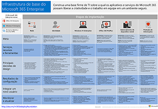
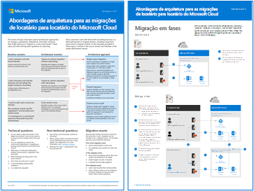
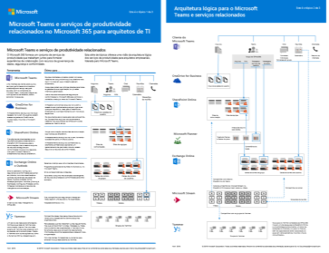
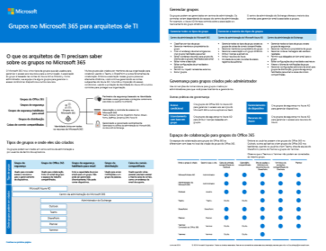

# Recursos de arquitetura de TI do Microsoft CloudMicrosoft cloud IT architecture resources

 **Resumo:** conheça os principais conceitos da Microsoft de arquitetura de nuvem para identidade, segurança, redes e híbrida. Examine as recomendações indicadas para a proteção de arquivos, identidades e dispositivos ao usar a nuvem da Microsoft. Saiba como implantar uma área de trabalho moderna e segura com o Windows 10 e o Office ProPlus.**Summary:** Learn core cloud architecture concepts for Microsoft identity, security, networking, and hybrid. Review prescriptive recommendations for protecting files, identities, and devices when using Microsoft's cloud. Learn how to deploy a modern and secure desktop with Windows 10 and Office ProPlus.
  
Esses cartazes e ferramentas de arquitetura proporcionam informações sobre os serviços em nuvem da Microsoft, incluindo o Office 365, Windows 10, Azure Active Directory, Microsoft Intune, Microsoft Dynamics 365 e soluções híbridas no local e em nuvem. Os arquitetos e tomadores de decisões da TI podem usar esses recursos para determinar as soluções ideais para suas cargas de trabalho e para tomar decisões em relação aos principais componentes de infraestrutura, como a identidade e a segurança.These architecture tools and posters give you information about Microsoft cloud services, including Office 365, Windows 10, Azure Active Directory, Microsoft Intune, Microsoft Dynamics 365, and hybrid on-premises and cloud solutions. IT decision makers and architects can use these resources to determine the ideal solutions for their workloads and to make decisions about core infrastructure components such as identity and security. 
  
<!--**[Microsoft's Enterprise Cloud Roadmap](microsoft-cloud-it-architecture-resources.md#roadmap)** (Sway) -->
    
- **[Série Microsoft cloud para arquitetos empresariais](microsoft-cloud-it-architecture-resources.md#cloudarch)** 
    **[Microsoft cloud for enterprise architects series](microsoft-cloud-it-architecture-resources.md#cloudarch)** 
  <!-- [Microsoft Cloud Services and Platform Options](microsoft-cloud-it-architecture-resources.md#platformoptions) -->
    - [Identidade do Microsoft Cloud para arquitetos corporativosMicrosoft cloud identity for enterprise architects](microsoft-cloud-it-architecture-resources.md#identity)
    - [Segurança no Microsoft Cloud para arquitetos corporativosMicrosoft cloud security for enterprise architects](microsoft-cloud-it-architecture-resources.md#security)
    - [Rede do Microsoft Cloud para arquitetos corporativosMicrosoft cloud networking for enterprise architects](microsoft-cloud-it-architecture-resources.md#networking)
    - [Nuvem híbrida da Microsoft para arquitetos corporativosMicrosoft hybrid cloud for enterprise architects](microsoft-cloud-it-architecture-resources.md#hybrid)
    - [Ataques comuns e recursos da Microsoft que protegem sua organizaçãoCommon attacks and Microsoft capabilities that protect your organization](#common-attacks-and-microsoft-capabilities-that-protect-your-organization)
    - [Infraestrutura de base do Microsoft 365 EnterpriseMicrosoft 365 Enterprise Foundation Infrastructure](#m365foundationinfra)
    - [Abordagens de arquitetura para as migrações de locatário do Microsoft Cloud para o locatárioArchitecture approaches for Microsoft cloud tenant-to-tenant migrations](#architecture-approaches-for-microsoft-cloud-tenant-to-tenant-migrations)
    
- **[Série de solução do Office 365 Enterprise](microsoft-cloud-it-architecture-resources.md#BKMK_o365solutions)**:**[Microsoft 365 enterprise solution series](microsoft-cloud-it-architecture-resources.md#BKMK_o365solutions)**:
    - [Microsoft Teams e serviços de produtividade relacionados no Microsoft 365 para arquitetos de TIMicrosoft Teams and related productivity services in Microsoft 365 for IT architects](#microsoft-teams-and-related-productivity-services-in-microsoft-365-for-it-architects)
    - [Grupos no Microsoft 365 para arquitetos de TIGroups in Microsoft 365 for IT architects](#groups-in-microsoft-365-for-it-architects)
    - [Proteção de identidade e dispositivo para o Office 365Identity and device protection for Office 365](microsoft-cloud-it-architecture-resources.md#BKMK_O365IDP)
    - [Soluções de proteção de arquivos do Office 365File protection solutions in Office 365](microsoft-cloud-it-architecture-resources.md#BKMK_O365fileprotect)
    - [Proteção de Informações do Office 365 para o RGPDOffice 365 Information Protection for GDPR](#office-365-information-protection-for-gdpr)
    - [Diretrizes de segurança da Microsoft para campanhas políticas, instituições sem fins lucrativos e outras organizações do AgileMicrosoft Security Guidance for Political Campaigns, Nonprofits, and Other Agile Organizations](#microsoft-security-guidance-for-political-campaigns-nonprofits-and-other-agile-organizations)
    - [Soluções de telefonia da MicrosoftMicrosoft Telephony Solutions](#microsoft-telephony-solutions) 
    - [Implantar uma área de trabalho segura e moderna com a MicrosoftDeploy a modern and secure desktop with Microsoft](microsoft-cloud-it-architecture-resources.md#msd)
    
Dê sua opinião! Envie um email para [cloudadopt@microsoft.com](mailto:cloudadopt@microsoft.com).Let us know what you think! Send us email at [cloudadopt@microsoft.com](mailto:cloudadopt@microsoft.com). 

<!--

## Microsoft's Enterprise Cloud Roadmap

See the posters, icon sets, community venues, and other resources that describe the industry's most complete cloud solution.
  
|**Item**|**Description**|
|:-----|:-----|
|[          ](https://aka.ms/cloudarchitecture)   [Microsoft's Enterprise Cloud Roadmap](https://aka.ms/cloudarchitecture) (https://aka.ms/cloudarchitecture)   |Swipe through this Sway experience for the resources that describe the industry's most complete cloud solution.    |
-->
  

## Série Microsoft Cloud para arquitetos corporativos## Microsoft cloud for enterprise architects series

Esses cartazes de arquitetura em nuvem proporcionam informações sobre os serviços em nuvem da Microsoft, incluindo o Office 365, Azure Active Directory, Microsoft Intune, Microsoft Dynamics CRM Online e soluções híbridas no local e em nuvem. Os arquitetos e tomadores de decisões da TI podem usar esses recursos para determinar as soluções ideais para suas cargas de trabalho e para tomar decisões em relação aos principais componentes de infraestrutura, como a identidade e a segurança.These cloud architecture posters give you information about Microsoft cloud services, including Office 365, Azure Active Directory, Microsoft Intune, Microsoft Dynamics CRM Online, and hybrid on-premises and cloud solutions. IT decision makers and architects can use these resources to determine the ideal solutions for their workloads and to make decisions about core infrastructure components such as identity and security.

<!--  

### Microsoft Cloud Services and Platform Options

Learn key differences between Microsoft cloud services and platform offerings. Find the best fit for your solution.
  
|**Item**|**Description**|
|:-----|:-----|
|[          ](https://www.microsoft.com/download/details.aspx?id=54432)   [PDF](https://go.microsoft.com/fwlink/p/?LinkId=524731)  \| [Visio](https://go.microsoft.com/fwlink/p/?LinkId=524732)  \| [More languages](https://www.microsoft.com/download/details.aspx?id=54432)   | This model describes: <ul><li>  Software as a Service (SaaS) offerings, including Office 365 </li><li>  Platform as a Service (PaaS) features in Microsoft Azure </li><li>  Infrastructure as a Service (IaaS) features in Microsoft Azure </li><li>  Private cloud datacenter capabilities using Windows Server and System Center </li><li>  Learn how Microsoft's own IT department is migrating to these cloud services and building its hybrid cloud. </li></ul> |
-->

   

### Identidade do Microsoft Cloud para arquitetos corporativos### Microsoft cloud identity for enterprise architects

O que os arquitetos de TI precisam saber sobre a criação de identidade para organizações que usam plataformas e serviços em nuvem da Microsoft.What IT architects need to know about designing identity for organizations using Microsoft cloud services and platforms.
  
|**Item****Item**|**Descrição****Description**|
|:-----|:-----|
|[          ](https://www.microsoft.com/download/details.aspx?id=54431)[          ](https://www.microsoft.com/download/details.aspx?id=54431)   [PDF](https://go.microsoft.com/fwlink/p/?LinkId=524586)  \| [Visio](https://download.microsoft.com/download/2/3/8/238228E6-9017-4F6C-BD3C-5559E6708F82/MSFT_cloud_architecture_identity.vsd)           \| [Mais idiomas](https://www.microsoft.com/download/details.aspx?id=54431)[PDF](https://go.microsoft.com/fwlink/p/?LinkId=524586)  \| [Visio](https://download.microsoft.com/download/2/3/8/238228E6-9017-4F6C-BD3C-5559E6708F82/MSFT_cloud_architecture_identity.vsd)           \| [More languages](https://www.microsoft.com/download/details.aspx?id=54431)   | Este modelo contém:This model contains: <ul><li>Introdução à identidade com a nuvem da MicrosoftIntroduction to identity with Microsoft’s cloud </li><li>Recursos do Azure AD IDaaSAzure AD IDaaS capabilities </li><li>Integração de contas do Active Directory Domain Services no local com o Microsoft Azure Active DirectoryIntegrating on-premises Active Directory Domain Services accounts with Microsoft Azure Active Directory </li><li>Colocando componentes de diretório no AzurePutting directory components in Azure </li><li>Opções de serviços de domínio para cargas de trabalho no Azure IaaSDomain services options for workloads in Azure IaaS </li></ul> |
   

### Segurança no Microsoft Cloud para arquitetos corporativosMicrosoft cloud security for enterprise architects

O que os arquitetos de TI precisam saber sobre segurança em plataformas e serviços em nuvem da Microsoft.What IT architects need to know about security in Microsoft cloud services and platforms.
  
|**Item****Item**|**Descrição****Description**|
|:-----|:-----|
|[          ](https://www.microsoft.com/download/details.aspx?id=48121)[          ](https://www.microsoft.com/download/details.aspx?id=48121)   [PDF](https://go.microsoft.com/fwlink/p/?linkid=842070)  \| [Visio](https://go.microsoft.com/fwlink/p/?LinkId=842071)  \| [Mais idiomas](https://www.microsoft.com/download/details.aspx?id=48121)[PDF](https://go.microsoft.com/fwlink/p/?linkid=842070)  \| [Visio](https://go.microsoft.com/fwlink/p/?LinkId=842071)  \| [More languages](https://www.microsoft.com/download/details.aspx?id=48121)   | Este modelo contém:This model contains: <ul><li>Função da Microsoft no fornecimento de plataformas e serviços segurosMicrosoft's role in providing secure services and platforms</li><li>Responsabilidade do cliente em reduzir os riscos de segurançaCustomer responsibilities to mitigate security risks</li><li>Principais certificações de segurançaTop security certifications </li><li>Ofertas de segurança fornecidas pelos serviços de consultoria da MicrosoftSecurity offerings provided by Microsoft consulting services </ul> |
   

### Rede do Microsoft Cloud para arquitetos corporativosMicrosoft cloud networking for enterprise architects

O que os arquitetos de TI precisam saber sobre redes para plataformas e serviços em nuvem da Microsoft.What IT architects need to know about networking for Microsoft cloud services and platforms.
  
|**Item****Item**|**Descrição****Description**|
|:-----|:-----|
|   [PDF](media/Network-Poster/MSFT_cloud_architecture_networking.pdf)  \| [Visio](https://github.com/MicrosoftDocs/OfficeDocs-Enterprise/raw/live/Enterprise/media/Network-Poster/MSFT_cloud_architecture_networking.vsdx)[PDF](media/Network-Poster/MSFT_cloud_architecture_networking.pdf)  \| [Visio](https://github.com/MicrosoftDocs/OfficeDocs-Enterprise/raw/live/Enterprise/media/Network-Poster/MSFT_cloud_architecture_networking.vsdx)   | Este modelo contém:This model contains: <ul><li> Expandindo sua rede para conectividade de nuvemEvolving your network for cloud connectivity </li><li> Elementos comuns de conectividade de nuvem da MicrosoftCommon elements of Microsoft cloud connectivity </li><li> ExpressRoute para conectividade de nuvem da MicrosoftExpressRoute for Microsoft cloud connectivity </li><li> Criação de rede para o Microsoft IaaS, Azure PaaS e Azure IaaSDesigning networking for Microsoft SaaS, Azure PaaS, and  Azure IaaS </li></ul>    |

### Nuvem híbrida da Microsoft para arquitetos corporativosMicrosoft hybrid cloud for enterprise architects

O que os arquitetos de TI precisam saber sobre nuvem híbrida dos serviços e plataformas da Microsoft.What IT architects need to know about hybrid cloud for Microsoft services and platforms.
  
|**Item****Item**|**Descrição****Description**|
|:-----|:-----|
|   [PDF](media/Hybrid-Poster/MSFT_cloud_architecture_hybrid.pdf)  \| [Visio](https://github.com/MicrosoftDocs/OfficeDocs-Enterprise/raw/live/Enterprise/media/Hybrid-Poster/MSFT_cloud_architecture_hybrid.vsdx)[PDF](media/Hybrid-Poster/MSFT_cloud_architecture_hybrid.pdf)  \| [Visio](https://github.com/MicrosoftDocs/OfficeDocs-Enterprise/raw/live/Enterprise/media/Hybrid-Poster/MSFT_cloud_architecture_hybrid.vsdx)  | Este modelo contém:This model contains: <ul><li> Ofertas de nuvem da Microsoft (SaaS, Azure PaaS e Azure IaaS) e seus elementos em comumMicrosoft's cloud offerings (SaaS, Azure PaaS, and Azure IaaS) and their common elements </li><li> Arquitetura de nuvem híbrida para as ofertas de nuvem da MicrosoftHybrid cloud architecture for Microsoft's cloud offerings </li><li> Cenários de nuvem híbrida para o Microsoft SaaS (Office 365), Azure PaaS e Azure IaaSHybrid cloud scenarios for Microsoft SaaS (Office 365), Azure PaaS, and Azure IaaS </li></ul> |
   

### Ataques comuns e recursos da Microsoft que protegem sua organizaçãoCommon attacks and Microsoft capabilities that protect your organization
Conheça os ataques cibernéticos mais comuns e saiba como a Microsoft pode ajudar sua organização em cada etapa de um ataque.Learn about the most common cyber attacks and how Microsoft can help your organization at every stage of an attack. 

|**Item****Item**|**Descrição****Description**|
|:-----|:-----|
|   [PDF](https://download.microsoft.com/download/F/A/C/FACFC1E9-FA35-4DF1-943C-8D4237B4275B/MSFT_Cloud_architecture_security_commonattacks.pdf) \| [Visio](https://download.microsoft.com/download/F/A/C/FACFC1E9-FA35-4DF1-943C-8D4237B4275B/MSFT_Cloud_architecture_security_commonattacks.vsdx)[PDF](https://download.microsoft.com/download/F/A/C/FACFC1E9-FA35-4DF1-943C-8D4237B4275B/MSFT_Cloud_architecture_security_commonattacks.pdf) \| [Visio](https://download.microsoft.com/download/F/A/C/FACFC1E9-FA35-4DF1-943C-8D4237B4275B/MSFT_Cloud_architecture_security_commonattacks.vsdx)   | Este cartaz ilustra o caminho dos ataques comuns e descreve quais recursos ajudam a impedir os invasores em cada etapa de um ataque.This poster illustrates the path of common attacks and describes which capabilities help stop attackers at each stage of an attack.  |

### Infraestrutura de base do Microsoft 365 EnterpriseMicrosoft 365 Enterprise Foundation Infrastructure

Obtenha uma visão geral da [infraestrutura de base](https://docs.microsoft.com/microsoft-365/enterprise/deploy-foundation-infrastructure) do Microsoft 365 Enterprise para começar sua implantação.Get an at-a-glance view of the [foundation infrastructure](https://docs.microsoft.com/microsoft-365/enterprise/deploy-foundation-infrastructure) for Microsoft 365 Enterprise to begin your deployment.
  
|**Item****Item**|**Descrição****Description**|
|:-----|:-----|
|   [Exibir online](https://aka.ms/m365efoundinfraposter) \| [PDF](https://github.com/MicrosoftDocs/microsoft-365-docs/raw/public/microsoft-365/enterprise/media/deploy-foundation-infrastructure/Microsoft365EnterpriseFoundInfra.pdf)[View online](https://aka.ms/m365efoundinfraposter) \| [PDF](https://github.com/MicrosoftDocs/microsoft-365-docs/raw/public/microsoft-365/enterprise/media/deploy-foundation-infrastructure/Microsoft365EnterpriseFoundInfra.pdf)   | Este pôster resume cada fase da infraestrutura de base em termos de metas, recursos e ferramentas, decisões de design, resultados de configuração, integração, atualizações e monitoramento contínuos.This poster summarizes each phase of the foundation infrastructure in terms of goals, features and tools, design decisions, configuration results, onboarding, and ongoing monitoring and updates.  | 

### Abordagens de arquitetura para as migrações de locatário do Microsoft Cloud para o locatárioArchitecture approaches for Microsoft cloud tenant-to-tenant migrations 
Esta série de tópicos ilustra várias abordagens de arquitetura para fusões, aquisições, despojamento e outros cenários que podem levar você a migrar para um novo locatário de nuvem.This series of topics illustrates several architecture approaches for mergers, acquisitions, divestitures, and other scenarios that might lead you to migrate to a new cloud tenant. Esses tópicos fornecem diretrizes de ponto de partida para o planejamento.These topics provide starting-point guidance for planning.

|**Item****Item**|**Descrição****Description**|
|:-----|:-----|
|   [PDF](downloads/Microsoft-365-tenant-to-tenant-migration.pdf) \| [Visio](https://github.com/MicrosoftDocs/OfficeDocs-Enterprise/raw/live/Enterprise/downloads/Microsoft-365-tenant-to-tenant-migration.vsdx)[PDF](downloads/Microsoft-365-tenant-to-tenant-migration.pdf) \| [Visio](https://github.com/MicrosoftDocs/OfficeDocs-Enterprise/raw/live/Enterprise/downloads/Microsoft-365-tenant-to-tenant-migration.vsdx)     |Este modelo contém:This model contains: <ul><li>Um mapeamento de cenários de negócios para abordagens de arquiteturaA mapping of business scenarios to architecture approaches</li><li>Considerações de designDesign considerations</li><li>Fluxo de migração de evento únicoSingle event migration flow</li><li>Fluxos de migração do usuárioPhased migration flow</li><li>Fluxo de movimentação ou de divisão do locatárioTenant move or split flow</li></ul>|

## Série de solução do Microsoft 365 EnterpriseMicrosoft 365 enterprise solution series

A série de solução do Microsoft 365 Enterprise fornece orientações para a implementação de recursos do Microsoft 365, especialmente quando os recursos e as tecnologias se encontram.The Microsoft 365 enterprise solution series provides guidance for implementing Microsoft 365 capabilities, especially where capabilities cross technologies.

### Microsoft Teams e serviços de produtividade relacionados no Microsoft 365 para arquitetos de TIMicrosoft Teams and related productivity services in Microsoft 365 for IT architects
A arquitetura lógica dos serviços de produtividade no Microsoft 365, liderada pelo Microsoft Teams.The logical architecture of productivity services in Microsoft 365, leading with Microsoft Teams.

|**Item****Item**|**Descrição****Description**|
|:-----|:-----|
|   [PDF](downloads/msft-m365-teams-logical-architecture.pdf) \| [Visio](https://github.com/MicrosoftDocs/OfficeDocs-Enterprise/raw/live/Enterprise/downloads/msft-m365-teams-logical-architecture.vsdx)[PDF](downloads/msft-m365-teams-logical-architecture.pdf) \| [Visio](https://github.com/MicrosoftDocs/OfficeDocs-Enterprise/raw/live/Enterprise/downloads/msft-m365-teams-logical-architecture.vsdx)     |A Microsoft fornece um conjunto de serviços de produtividade que trabalham juntos para fornecer experiências de colaboração com recursos de governança de dados, segurança e conformidade.Microsoft provides a suite of productivity services that work together to provide collaboration experiences with data governance, security, and compliance capabilities.    Esta série de ilustrações oferece uma visão da arquitetura lógica dos serviços de produtividade para arquitetos empresariais, liderada pelo Microsoft Teams.This series of illustrations provides a view into the logical architecture of productivity services for enterprise architects, leading with Microsoft Teams.|

### Grupos no Microsoft 365 para arquitetos de TIGroups in Microsoft 365 for IT Architects
O que os arquitetos de TI precisam saber sobre os grupos no Microsoft 365What IT architects need to know about groups in Microsoft 365

|**Item****Item**|**Descrição****Description**|
|:-----|:-----|
|   [PDF](downloads/msft-m365-groups.pdf) \| [Visio](https://github.com/MicrosoftDocs/OfficeDocs-Enterprise/raw/live/Enterprise/downloads/msft-m365-groups.vsdx)[PDF](downloads/msft-m365-groups.pdf) \| [Visio](https://github.com/MicrosoftDocs/OfficeDocs-Enterprise/raw/live/Enterprise/downloads/msft-m365-groups.vsdx) |Essas ilustrações detalham os diferentes tipos de grupos, como eles são criados e gerenciados e algumas recomendações de governança.These illustrations detail the different types of groups, how these are created and managed, and a few governance recommendations.|

   

### Proteção de identidade e dispositivo para o Office 365Identity and device protection for Office 365

Recursos recomendados para proteger identidades e dispositivos que acessam o Office 365, outros serviços SaaS e aplicativos locais publicados com o Proxy de Aplicativo do Azure AD.Recommended capabilities for protecting identities and devices that access Office 365, other SaaS services, and on-premises applications published with Azure AD Application Proxy.
  
|**Item****Item**|**Descrição****Description**|
|:-----|:-----|
|[          ](https://www.microsoft.com/download/details.aspx?id=55032)[          ](https://www.microsoft.com/download/details.aspx?id=55032)   [PDF](https://go.microsoft.com/fwlink/p/?linkid=841656)  \| [Visio](https://go.microsoft.com/fwlink/p/?linkid=841657)  \| [Mais idiomas](https://www.microsoft.com/download/details.aspx?id=55032)[PDF](https://go.microsoft.com/fwlink/p/?linkid=841656)  \| [Visio](https://go.microsoft.com/fwlink/p/?linkid=841657)  \| [More languages](https://www.microsoft.com/download/details.aspx?id=55032)   |É importante usar níveis consistentes de proteção em seus dados, identidades e dispositivos. Este documento mostra quais recursos são comparáveis com mais informações sobre recursos para proteger identidades e dispositivos.It's important to use consistent levels of protection across your data, identities, and devices. This document shows you which capabilities are comparable with more information on capabilities to protect identities and devices.    |
   

### Soluções de proteção de arquivos do Office 365File protection solutions in Office 365

Recursos recomendados para proteção de arquivos do Office 365 com base em três níveis diferentes de confidencialidade.Recommended capabilities for protecting files in Office 365 based on three different sensitivity levels.
  
|**Item****Item**|**Descrição****Description**|
|:-----|:-----|
|[          ](https://www.microsoft.com/download/details.aspx?id=55523)[          ](https://www.microsoft.com/download/details.aspx?id=55523)   [PDF](https://go.microsoft.com/fwlink/?linkid=2004320)  \| [Visio](https://download.microsoft.com/download/7/8/9/789645A5-BD10-4541-BC33-F8D1EFF5E911/MSFT_cloud_architecture_O365%20file%20protection.vsdx)[PDF](https://go.microsoft.com/fwlink/?linkid=2004320)  \| [Visio](https://download.microsoft.com/download/7/8/9/789645A5-BD10-4541-BC33-F8D1EFF5E911/MSFT_cloud_architecture_O365%20file%20protection.vsdx)   |É importante usar níveis consistentes de proteção para dados, identidades e dispositivos. Este documento mostra quais recursos são comparáveis com mais informações sobre recursos para proteger os arquivos do Office 365.It's important to use consistent levels of protection across your data, identities, and devices. This document shows you which capabilities are comparable with more information on capabilities to protect files in Office 365.    |
   

### Proteção de Informações do Office 365 para RGPDOffice 365 Information Protection for GDPR

Recomendações prescritivas para descoberta, classificação, proteção e monitoramento de dados pessoais. Ela usa o GDRP (Regulamento Geral sobre a Proteção de Dados) como exemplo, mas é possível aplicar o mesmo processo a fim de a cumprir os requisitos de vários outros regulamentos.Prescriptive recommendations for discovering, classifying, protecting, and monitoring personal data. This solution uses General Data Protection Regulation (GDPR) as an example, but you can apply the same process to achieve compliance with many other regulations.

|**Item****Item**|**Descrição****Description**|
|:-----|:-----|
|    [PDF](https://download.microsoft.com/download/E/C/D/ECD5A339-EF10-4420-B3A9-99098884D716/MSFT_Cloud_architecture_information%20protection%20for%20GDPR.pdf) \| [Visio](https://download.microsoft.com/download/E/C/D/ECD5A339-EF10-4420-B3A9-99098884D716/MSFT_Cloud_architecture_information%20protection%20for%20GDPR.vsdx)[PDF](https://download.microsoft.com/download/E/C/D/ECD5A339-EF10-4420-B3A9-99098884D716/MSFT_Cloud_architecture_information%20protection%20for%20GDPR.pdf) \| [Visio](https://download.microsoft.com/download/E/C/D/ECD5A339-EF10-4420-B3A9-99098884D716/MSFT_Cloud_architecture_information%20protection%20for%20GDPR.vsdx)    |Para ver esse conteúdo em formato de artigo, confira [Proteção de informações do Office 365 para o GDPR](https://docs.microsoft.com/Office365/SecurityCompliance/office-365-information-protection-for-gdpr).To see this content in article format, see [Office 365 Information Protection for GDPR](https://docs.microsoft.com/Office365/SecurityCompliance/office-365-information-protection-for-gdpr).      |

### Diretrizes de segurança da Microsoft para campanhas políticas, instituições sem fins lucrativos e outras organizações AgileMicrosoft Security Guidance for Political Campaigns, Nonprofits, and Other Agile Organizations 

Estas diretrizes descrevem como implementar um ambiente de nuvem seguro. As diretrizes da solução podem ser usadas por qualquer organização. Isso inclui ajuda adicional para organizações ágeis com contas de convidado e acesso BYOD. Você pode usar essas diretrizes como o ponto inicial para a criação do seu ambiente. This guidance describes how to implement a secure cloud environment. The solution guidance can be used by any organization. It includes extra help for agile organizations with BYOD access and guest accounts. You can use this guidance as a starting-point for designing your own environment.

|**Item****Item**|**Descrição****Description**|
|:-----|:-----|
|**Diretrizes de segurança da Microsoft para campanhas políticas****Microsoft Security Guidance for Political Campaigns**   [          ](https://download.microsoft.com/download/B/4/D/B4D520C3-4D0C-4B4D-BFB9-09F0651C2775/MSFT_Cloud_architecture_security%20for%20political%20campaigns.pdf)[          ](https://download.microsoft.com/download/B/4/D/B4D520C3-4D0C-4B4D-BFB9-09F0651C2775/MSFT_Cloud_architecture_security%20for%20political%20campaigns.pdf)   [PDF](https://download.microsoft.com/download/B/4/D/B4D520C3-4D0C-4B4D-BFB9-09F0651C2775/MSFT_Cloud_architecture_security%20for%20political%20campaigns.pdf)  \| [Visio](https://download.microsoft.com/download/B/4/D/B4D520C3-4D0C-4B4D-BFB9-09F0651C2775/MSFT_Cloud_architecture_security%20for%20political%20campaigns.vsdx)[PDF](https://download.microsoft.com/download/B/4/D/B4D520C3-4D0C-4B4D-BFB9-09F0651C2775/MSFT_Cloud_architecture_security%20for%20political%20campaigns.pdf)  \| [Visio](https://download.microsoft.com/download/B/4/D/B4D520C3-4D0C-4B4D-BFB9-09F0651C2775/MSFT_Cloud_architecture_security%20for%20political%20campaigns.vsdx)   |Este guia usa uma organização de campanha política como exemplo. Use este guia como um ponto de partida para qualquer ambiente.This guidance uses a political campaign organization as an example. Use this guidance as a starting point for any environment.    |
|**Diretrizes de segurança da Microsoft para organizações sem fins lucrativos****Microsoft Security Guidance for Nonprofits**   [          ](https://download.microsoft.com/download/9/4/3/94389612-C679-4061-8DF2-D9A15D72B65F/Microsoft_Cloud%20Architecture_Security%20for%20Nonprofits.pdf)[          ](https://download.microsoft.com/download/9/4/3/94389612-C679-4061-8DF2-D9A15D72B65F/Microsoft_Cloud%20Architecture_Security%20for%20Nonprofits.pdf)   [PDF](https://download.microsoft.com/download/9/4/3/94389612-C679-4061-8DF2-D9A15D72B65F/Microsoft_Cloud%20Architecture_Security%20for%20Nonprofits.pdf)  \| [Visio](https://download.microsoft.com/download/9/4/3/94389612-C679-4061-8DF2-D9A15D72B65F/Microsoft_Cloud%20Architecture_Security%20for%20Nonprofits.vsdx)[PDF](https://download.microsoft.com/download/9/4/3/94389612-C679-4061-8DF2-D9A15D72B65F/Microsoft_Cloud%20Architecture_Security%20for%20Nonprofits.pdf)  \| [Visio](https://download.microsoft.com/download/9/4/3/94389612-C679-4061-8DF2-D9A15D72B65F/Microsoft_Cloud%20Architecture_Security%20for%20Nonprofits.vsdx)   |Este guia é ligeiramente revisado para organizações sem fins lucrativos. Por exemplo, ele faz referência aos planos do Office 365 para entidades sem fins lucrativos. As diretrizes técnicas são as mesmas do guia de solução de campanha política.This guide is slightly revised for nonprofit organizations. For example, it references Office 365 Nonprofit plans. The technical guidance is the same as the political campaign solution guide.    |

Este guia contém as Guias de laboratório de teste. Para saber mais, confira [Diretrizes de segurança da Microsoft para campanhas políticas, organizações sem fins lucrativos e outras organizações ágeis](https://docs.microsoft.com/Office365/SecurityCompliance/microsoft-security-guidance-for-political-campaigns-nonprofits-and-other-agile-o).This guidance includes Test Lab Guides. For more information, see [Microsoft Security Guidance for Political Campaigns, Nonprofits, and Other Agile Organizations](https://docs.microsoft.com/Office365/SecurityCompliance/microsoft-security-guidance-for-political-campaigns-nonprofits-and-other-agile-o).

### Soluções de telefonia da MicrosoftMicrosoft Telephony Solutions

A Microsoft oferece suporte a várias opções conforme você começa sua jornada no Teams na nuvem da Microsoft. Esse cartaz ajuda você a decidir qual solução de telefonia da Microsoft (sistema de telefone na nuvem ou o Enterprise Voice local) é ideal para os usuários de sua organização e como sua organização pode se conectar à Rede pública de telefonia comutada (PSTN).Microsoft supports several options as you begin your journey to Teams in the Microsoft cloud. This poster helps you decide which Microsoft telephony solution (Phone System in the cloud or Enterprise Voice on-premises) is right for users in your organization, and how your organization can connect to the Public Switched Telephone Network (PSTN).

  
[PDF](https://github.com/MicrosoftDocs/OfficeDocs-SkypeForBusiness/blob/live/Teams/downloads/telephony-solutions/microsoft-telephony-solutions-12-18.pdf) | [Visio](https://github.com/MicrosoftDocs/OfficeDocs-SkypeForBusiness/blob/live/Teams/downloads/telephony-solutions/microsoft-telephony-solutions-12-18.vsdx)[PDF](https://github.com/MicrosoftDocs/OfficeDocs-SkypeForBusiness/blob/live/Teams/downloads/telephony-solutions/microsoft-telephony-solutions-12-18.pdf) | [Visio](https://github.com/MicrosoftDocs/OfficeDocs-SkypeForBusiness/blob/live/Teams/downloads/telephony-solutions/microsoft-telephony-solutions-12-18.vsdx) 

Para saber mais, confira o artigo neste cartaz: [Soluções de telefonia da Microsoft](https://docs.microsoft.com/SkypeForBusiness/hybrid/msft-telephony-solutions).For more information, see the article for this poster: [Microsoft Telephony Solutions](https://docs.microsoft.com/SkypeForBusiness/hybrid/msft-telephony-solutions).
  

### Implantar uma área de trabalho segura e moderna com a MicrosoftDeploy a modern and secure desktop with Microsoft

O que os arquitetos de TI precisam saber sobre implantação e gerenciamento de atualizações para o Office 365 ProPlus no Windows 10.What IT architects need to know about deploying and managing updates for Office 365 ProPlus on Windows 10.
  
|**Item****Item**|**Descrição****Description**|
|:-----|:-----|
|[          ](https://www.microsoft.com/download/details.aspx?id=55987)[          ](https://www.microsoft.com/download/details.aspx?id=55987)   [PDF](https://download.microsoft.com/download/4/E/9/4E90E227-770A-41D1-99FE-925A64D81A55/MSFT_modern_secure_desktop.pdf)  \| [Visio](https://download.microsoft.com/download/4/E/9/4E90E227-770A-41D1-99FE-925A64D81A55/MSFT_modern_secure_desktop.vsdx)[PDF](https://download.microsoft.com/download/4/E/9/4E90E227-770A-41D1-99FE-925A64D81A55/MSFT_modern_secure_desktop.pdf)  \| [Visio](https://download.microsoft.com/download/4/E/9/4E90E227-770A-41D1-99FE-925A64D81A55/MSFT_modern_secure_desktop.vsdx)   | Este modelo contém:This model contains: <ul><li>  Implantação do Windows 10 e Office ProPlus da nuvem da MicrosoftDeploying Windows 10 and Office ProPlus from the Microsoft cloud </li><li>  Implementar o Windows 10 e Office ProPlus com o System Center Configuration ManagerDeploying Windows 10 and Office ProPlus with Microsoft Endpoint Configuration Manager </li><li>  Gerenciamento de atualizações do Windows 10 e Office ProPlus da nuvem da MicrosoftManaging updates for Windows 10 and Office ProPlus from the Microsoft cloud </li><li>  Gerenciar as atualizações do Windows 10 e Office ProPlus com o Microsoft Endpoint Configuration ManagerManaging updates for Windows 10 and Office ProPlus with Microsoft Endpoint Configuration Manager </li><li>  Recursos adicionais de proteção do Windows 10Out-of-the-box and additional protection capabilities of Windows 10 </li></ul>  |
   
## Confira tambémSee Also

[Modelos de arquitetura para SharePoint, Exchange, Skype for Business e LyncArchitectural models for SharePoint, Exchange, Skype for Business, and Lync](architectural-models-for-sharepoint-exchange-skype-for-business-and-lync.md)
  
[Guias do Laboratório de Teste (TLGs) para adoção de nuvemCloud adoption Test Lab Guides (TLGs)](cloud-adoption-test-lab-guides-tlgs.md)
  
[Soluções de segurançaSecurity solutions](security-solutions.md)
  
[Soluções híbridasHybrid solutions](hybrid-solutions.md)

