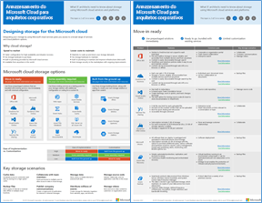

# Armazenamento do Microsoft Cloud para arquitetos corporativosMicrosoft Cloud Storage for Enterprise Architects

 **Resumo:** Projete seu armazenamento de serviços de nuvem da Microsoft e plataformas.**Summary:** Design your storage for Microsoft cloud services and platforms.
  
Este artigo o vincula a um conjunto de artigos que descrevem quais IT arquitetos precisam saber sobre o design de armazenamento para organizações que usam plataformas e serviços de nuvem da Microsoft. Você também pode exibir essas informações como um pôster de página de 6 e imprimi-lo no formato Tabloide (também conhecido como razão, 11x17 ou A3).This article links you to a set of articles that describe what IT architects need to know about designing storage for organizations using Microsoft cloud services and platforms. You can also view this information as a 6-page poster and print it in tabloid format (also known as ledger, 11 x 17, or A3).
  

  
[PDF](https://go.microsoft.com/fwlink/p/?linkid=842079) | [Visio](https://go.microsoft.com/fwlink/p/?linkid=842080) | [Mais idiomas](https://www.microsoft.com/download/details.aspx?id=49552)[PDF](https://go.microsoft.com/fwlink/p/?linkid=842079) | [Visio](https://go.microsoft.com/fwlink/p/?linkid=842080) | [More languages](https://www.microsoft.com/download/details.aspx?id=49552)
  
Também é possível ver todos os modelos nos [Recursos de arquitetura de TI da Microsoft Cloud](microsoft-cloud-it-architecture-resources.md) e deslizar o dedo pelo [Roteiro do Enterprise Cloud da Microsoft: recursos para os responsáveis pelas decisões de TI](https://aka.ms/cloudarchitecture).You can also see all of the models in the [Microsoft Cloud IT architecture resources](microsoft-cloud-it-architecture-resources.md) and swipe through [Microsoft's Enterprise Cloud Roadmap: Resources for IT Decision Makers](https://aka.ms/cloudarchitecture).
  
Confira as seguintes seções:See the following sections:
  
- [Projetar o armazenamento para a nuvem da MicrosoftDesigning storage for the Microsoft cloud](designing-storage-for-the-microsoft-cloud.md)
    
    Entenda por que você deve usar o armazenamento em nuvem e os cenários de armazenamento de chave de nuvem e, em seguida, examinam a lista as diferentes opções de armazenamento de nuvem do Microsoft.Understand why you should use cloud storage and the key cloud storage scenarios, and then scan the list of the different Microsoft cloud storage options.
    
- [Move-in prontoMove-in ready](move-in-ready.md)
    
    Usando uma analogia de construção para organizar a ampla variedade de opções de armazenamento de nuvem, esses são internos para outras ofertas de nuvem da Microsoft e estão prontos para uso imediatamente.Using a construction analogy to organize the wide variety of cloud storage options, these are built-in to other Microsoft cloud offerings and are ready to use immediately.
    
- [Alguns assembly necessárioSome assembly required](some-assembly-required.md)
    
    Essas opções de armazenamento de nuvem são um ponto de partida para sua solução de armazenamento, que exigem configuração adicional ou codificação para um sinalizador caber.These cloud storage options are a starting point for your storage solution, requiring additional configuration or coding for a custom fit.
    
- [Criação de ponta a ponta para cimaBuild from the ground up](build-from-the-ground-up.md)
    
    Essas opções de armazenamento de nuvem são os blocos de construção do armazenamento fundamentais, você pode usar para criar sua própria solução de armazenamento ou aplicativos a partir do zero.These cloud storage options are the fundamental storage building blocks, which you can use to create your own storage solution or apps from scratch.
    
> [!NOTE]
> Estes artigos refletem a versão de **setembro 2017** do Microsoft Cloud armazenamento para cartaz arquitetos da empresa.These articles reflect the **September 2017** release of the Microsoft Cloud Storage for Enterprise Architects poster.
  
## Veja tambémSee Also

[Recursos de arquitetura de TI do MicrosoftMicrosoft Cloud IT architecture resources](microsoft-cloud-it-architecture-resources.md)

[Roteiro do Enterprise Cloud da Microsoft: recursos para os responsáveis pelas decisões de TIMicrosoft's Enterprise Cloud Roadmap: Resources for IT Decision Makers](https://sway.com/FJ2xsyWtkJc2taRD)

