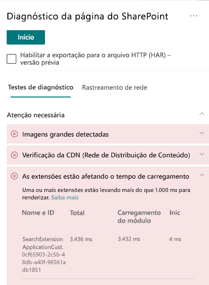

# Otimizar o desempenho da extensão personalizada nas páginas do site modernas do SharePoint OnlineOptimize custom extension performance in SharePoint Online modern site pages

Este artigo ajudará você a entender como determinar de que modo as extensões personalizadas afetam a latência percebida pelo usuário e como corrigir problemas comuns.This article will help you understand how to determine how custom extensions affect user perceived latency, and how to remediate common issues.

## Usar a ferramenta Diagnóstico de Página para SharePoint para analisar as extensões personalizadasUse the Page Diagnostics for SharePoint tool to analyze custom extensions

A ferramenta Diagnóstico de Página para SharePoint é uma extensão do navegador para os novos navegadores Microsoft Edge (https://www.microsoft.com/edge) e Chrome que analisam o portal moderno do SharePoint Online e as páginas clássicas do site de publicação.The Page Diagnostics for SharePoint tool is a browser extension for the new Microsoft Edge (https://www.microsoft.com/edge) and Chrome browsers that analyzes both SharePoint Online modern portal and classic publishing site pages. A ferramenta fornece um relatório para cada página analisada que mostra o desempenho da página em relação a um conjunto definido de critérios de desempenho.The tool provides a report for each analyzed page showing how the page performs against a defined set of performance criteria. Para instalar e saber mais sobre a ferramenta Diagnóstico de Página para SharePoint, acesse [Usar a ferramenta Diagnóstico de Página para SharePoint Online](page-diagnostics-for-spo.md).To install and learn about the Page Diagnostics for SharePoint tool, visit [Use the Page Diagnostics tool for SharePoint Online](page-diagnostics-for-spo.md).

>[!NOTE]
>A ferramenta de Diagnóstico de Página só funciona com o SharePoint Online e não pode ser usada em uma página do sistema do SharePoint.The Page Diagnostics tool only works for SharePoint Online, and cannot be used on a SharePoint system page.

Ao analisar uma página de site do SharePoint com a ferramenta Diagnóstico de Página para SharePoint, você pode ver informações sobre extensões personalizadas que excedem a métrica de linha de base no resultado **As extensões estão afetando o tempo de carregamento da página**, no painel _Testes de diagnóstico_.When you analyze a SharePoint site page with the Page Diagnostics for SharePoint tool, you can see information about custom extensions that exceed the baseline metric in the **Extensions are impacting load time** result in the _Diagnostic tests_ pane.

Os resultados possíveis incluem:Possible results include:

- **Atenção necessária** (vermelho): Qualquer extensão _personalizada_ que leva mais do que **um** segundo para carregar.**Attention required** (red): Any _custom_ extension that takes longer than **one** second to load. O tempo total de carregamento, conforme exibido nos resultados de teste, é dividido por carregamento do módulo, carga lenta, inicialização e renderização.Total load time as displayed in test results is broken down by module load and init.
- **Nenhuma ação é necessária** (verde): Nenhuma extensão está levando mais de um segundo para carregar.**No action required** (green): No extension is taking longer than one second to load.

Se uma extensão estiver afetando o tempo de carregamento da página, o resultado será exibido na seção **Atenção necessária** dos resultados.If an extension is impacting page load time, the result appears in the **Attention required** section of the results. Clique no resultado para ver detalhes sobre qual extensão está carregando lentamente.Click the result to see details about which extension is loading slowly. Futuras atualizações da ferramenta Diagnóstico de Página para SharePoint podem incluir atualizações de regras de análise, portanto, garanta que você sempre tenha a versão mais recente da ferramenta.Future updates to the Page Diagnostics for SharePoint tool may include updates to analysis rules, so please ensure you always have the latest version of the tool.

As informações disponíveis nos resultados incluem:Information available in the results includes:

- **Nome e ID** mostram informações de identificação que podem ajudá-lo a encontrar a extensão na página**Name and ID** shows identifying information that can help you find the extension on the page
- **Total** mostra o tempo total para a extensão inicializar e carregar**Total** shows the total time for the extension to initialize and load
- **Carregamento do Módulo** mostra o tempo necessário para buscar e carregar a extensão**Module Load** shows the time taken to fetch and load the extension
- **Inicialização** mostra o tempo necessário para a extensão inicializar**Init** shows the time taken for the extension to initialize

Essas informações são fornecidas para ajudar designers e desenvolvedores a solucionar problemas.This information is provided to help designers and developers troubleshoot issues. Elas devem ser encaminhadas à equipe de design e desenvolvimento.This information should be provided to your design and development team.

## Visão geral das extensõesOverview of extensions

As Extensões da Estrutura do SharePoint (SPFx) podem ser usadas para estender a experiência do usuário do SharePoint.SharePoint Framework (SPFx) Extensions can be used to extend the SharePoint user experience. Com as Extensões da Estrutura do SharePoint, é possível personalizar mais facetas da experiência do SharePoint, incluindo modos de exibição de dados de lista, barras de ferramentas e áreas de notificação.With SharePoint Framework Extensions, you can customize more facets of the SharePoint experience, including notification areas, toolbars, and list data views.

As extensões podem ter uma influência ruim no desempenho de uma página do SharePoint, pois também são necessários recursos da CPU e da rede para o trabalho necessário.Extensions can have a bad influence on the performance of a SharePoint page as it also takes CPU and network resources to do required work.

Há quatro tipos de extensões:There are four types of extensions:

- **Personalizadores de Aplicativos** adicionam scripts à página e acessam os espaços reservados de elementos HTML conhecidos e os estendem com renderizações personalizadas.**Application Customizers** adds scripts to the page, and accesses well-known HTML element placeholders and extends them with custom renderings.
- **Personalizadores de campo** fornecem visualizações modificadas aos dados dos campos em uma lista.**Field Customizers** provides modified views to data for fields within a list.
- **Conjuntos de Comandos** estendem as superfícies de comando do SharePoint para adicionar novas ações e fornecem código do lado do cliente que você pode usar para implementar comportamentos.**Command Sets** extend the SharePoint command surfaces to add new actions, and provides client-side code that you can use to implement behaviors.
- **Modificador de Consulta de Pesquisa (somente visualização)** são invocados antes de executar a consulta de pesquisa.**Search Query Modifier (preview only)** are invoked just before the search query is executed.

## Corrigir problemas de desempenho da extensãoRemediate extension performance issues

Siga as orientações desta seção para identificar e corrigir problemas de desempenho com extensões listadas nos resultados **As extensões estão afetando o tempo de carregamento da página**.Follow the guidance in this section to identify and remediate performance issues with extensions listed in the **Extensions are impacting page load time** results.

>[!NOTE]
>Os personalizadores de aplicativos podem ser executados no estágio inicial durante o ciclo de vida de uma página e podem influenciar o desempenho de outras extensões na página.Application customizers may be executed in the early stage during the lifecycle of a page and it may influence the performance of other extensions on the page.

Os resultados da auditoria na Ferramenta de Diagnóstico da Página exibirão dois estágios de execução de uma extensão para ajudar a identificar o potencial impacto no desempenho.The audit results in the Page Diagnostic Tool will display two stages of executing an extension in order to help identify the potential performance impact.

- **Carregamento do módulo** é o tempo que leva para carregar a extensão, que é impactado pelo tamanho de uma extensão, portanto, é uma boa ideia agrupar apenas as bibliotecas necessárias na extensão e também escolher bibliotecas mais leves.**Module load** is how long it takes to load the extension, which is impacted by the size of an extension so it is a good idea to only bundle the necessary libraries in the extension and to also choose lighter libraries.
- **Inicialização** é o tempo de inicialização da extensão e os desenvolvedores de extensão devem considerar se a extensão está executando um trabalho desnecessário ou executando muitos comandos durante o estágio de inicialização.**Init** is the initialization time of the extension and extension developers should consider whether the extension is doing unnecessary work or executing too many commands during the initializing stage.

Os autores da página também podem usar o resultado da auditoria para verificar se uma página possui muitas extensões, pois muitas delas impactarão negativamente o desempenho de uma página.Page authors can also use the audit result to see whether a page has too many extensions as too many extensions will negatively impact the performance of a page.

- **Tamanho da extensão e dependências****Extension size and dependencies**
  - É necessário usar a CDN do Office 365 para baixar o recurso estático ideal.Use of the Office 365 CDN is required for optimal static resource download. As origens da CDN pública são preferíveis para arquivos _js/css_.Public CDN origins are preferable for _js/css_ files. Para saber mais sobre como usar a CDN do Office 365, confira [Usar a CDN (Rede de Distribuição de Conteúdo) do Office 365 com o SharePoint Online](use-office-365-cdn-with-spo.md).For more information about using the Office 365 CDN, see [Use the Office 365 Content Delivery Network (CDN) with SharePoint Online](use-office-365-cdn-with-spo.md).
  - Reutilize estruturas como _importações do React_ e do _Fabric_, que vêm como parte da Estrutura do SharePoint (SPFx).Reuse frameworks like _React_ and _Fabric imports_ that come as part of the SharePoint Framework (SPFx). Para saber mais, confira [Visão geral da Estrutura do SharePoint](https://docs.microsoft.com/sharepoint/dev/spfx/sharepoint-framework-overview).For more information, see [Overview of the SharePoint Framework](https://docs.microsoft.com/sharepoint/dev/spfx/sharepoint-framework-overview).
  - Verifique se você está usando a versão mais recente da Estrutura do SharePoint e atualize para novas versões quando elas estiverem disponíveis.Ensure that you are using the latest version of the SharePoint Framework, and upgrade to new versions as they become available.
- **Busca/cache de dados****Data fetching/caching**
  - Se a extensão contar com chamadas adicionais do servidor para buscar dados para exibição, verifique se as APIs do servidor são rápidas e/ou implemente cache do lado do cliente (por exemplo, use _localStorage_ ou _IndexDB_ para conjuntos maiores).If the extension relies on extra server calls to fetch data for display, ensure those server APIs are fast and/or implement client side caching (such as using _localStorage_ or _IndexDB_ for larger sets).
  - Se várias chamadas forem necessárias para renderizar dados críticos, considere o uso de envio em lote no servidor ou de outros métodos de consolidação de solicitações em uma única chamada.If multiple calls are required to render critical data, consider batching on the server or other methods of consolidating requests to a single call.
  - Como alternativa, se alguns elementos de dados exigirem uma API mais lenta, mas não forem críticos para a renderização inicial, separe-os em outra chamada, executada após a renderização dos dados críticos.Alternatively, if some elements of data require a slower API, but are not critical to initial rendering, decouple these to a separate call that is executed after critical data is rendered.
  - Se várias partes usarem os mesmos dados, utilize uma camada de dados comum para evitar chamadas duplicadas.If multiple parts use the same data, utilize a common data layer to avoid duplicate calls.
- **Tempo de renderização****Rendering time**
  - Quaisquer fontes de mídia, como imagens e vídeos, devem ser dimensionadas de acordo com os limites do contêiner, dispositivo e/ou rede para evitar o download de grandes recursos desnecessários.Any media sources like images and videos should be sized to the limits of the container, device and/or network to avoid downloading unnecessary large assets. Para saber mais sobre como usar dependências de conteúdo, confira [Usar a CDN (Rede de Distribuição de Conteúdo) do Office 365 com o SharePoint Online](use-office-365-cdn-with-spo.md).For more information about content dependencies, see [Use the Office 365 Content Delivery Network (CDN) with SharePoint Online](use-office-365-cdn-with-spo.md).
  - Evite chamadas de API que causem refluxo, regras CSS complexas ou animações complicadas.Avoid API calls that cause re-flow, complex CSS rules or complicated animations. Para obter mais informações, confira [Minimizar o refluxo do navegador](https://developers.google.com/speed/docs/insights/browser-reflow).For more information, see [Minimizing browser reflow](https://developers.google.com/speed/docs/insights/browser-reflow).
  - Evite o uso de tarefas de longa execução encadeadas.Avoid use of chained long running tasks. Em vez disso, divida as tarefas de longa execução em filas separadas.Instead, break long running tasks apart into separate queues. Para obter mais informações, confira [Otimizar a execução do JavaScript](https://developers.google.com/web/fundamentals/performance/rendering/optimize-javascript-execution).For more information, see [Optimize JavaScript Execution](https://developers.google.com/web/fundamentals/performance/rendering/optimize-javascript-execution).
  - Reserve o espaço correspondente para renderizar de forma assíncrona mídia ou elementos visuais, a fim de evitar quadros ignorados e instabilidade (também conhecida como _jank_).Reserve corresponding space for asynchronously rendering media or visual elements to avoid skipped frames and stuttering (also known as _jank_).
  - Se determinado navegador não oferecer suporte a um recurso usado na renderização, carregue um polyfill ou exclua o código dependente em execução.If a certain browser doesn't support a feature used in rendering, either load a polyfill or exclude running dependent code. Se o recurso não for crítico, descarte recursos como manipuladores de eventos para evitar vazamentos de memória.If the feature is not critical, dispose resources such as event handlers to avoid memory leaks.

Antes de fazer as revisões das páginas para corrigir problemas de desempenho, anote o tempo de carregamento da página nos resultados da análise.Before you make page revisions to remediate performance issues, make a note of the page load time in the analysis results. Execute a ferramenta novamente após a revisão para ver se o novo resultado está dentro do padrão da linha de base e verifique o tempo de carregamento da nova página para ver se melhorou.Run the tool again after your revision to see if the new result is within the baseline standard, and check the new page load time to see if there was an improvement.

>[!NOTE]
>O tempo de carregamento da página pode variar de acordo com vários fatores, como a carga da rede, hora do dia e outras condições transitórias.Page load time can vary based on a variety of factors such as network load, time of day, and other transient conditions. Você deve testar o tempo de carregamento da página algumas vezes antes e depois de fazer as alterações para ajudá-lo a calcular uma média dos resultados.You should test page load time a few times before and after making changes to help you average the results.

## Tópicos relacionadosRelated topics

[Ajustar o desempenho do SharePoint OnlineTune SharePoint Online performance](tune-sharepoint-online-performance.md)

[Ajustar o desempenho do Office 365Tune Office 365 performance](tune-office-365-performance.md)

[Desempenho na experiência moderna do SharePointPerformance in the modern SharePoint experience](https://docs.microsoft.com/sharepoint/modern-experience-performance)

[Redes de distribuição de conteúdoContent delivery networks](content-delivery-networks.md)

[Usar a Rede de Distribuição de Conteúdo (CDN) do Office 365 com o SharePoint OnlineUse the Office 365 Content Delivery Network (CDN) with SharePoint Online](use-office-365-cdn-with-spo.md)