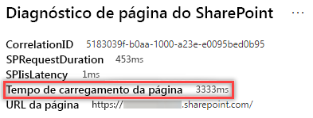

# Otimizar os iFrames em páginas do site de publicação clássico e moderno do SharePoint OnlineOptimize iFrames in SharePoint Online modern and classic publishing site pages

Os iFrames podem ser útil para a visualização de conteúdo avançado, como vídeos ou outras mídias.iFrames can be useful for previewing rich content such as videos or other media. No entanto, como os iFrames carregam uma página separada na página do site do SharePoint, o conteúdo carregado no iFrame pode conter imagens grandes, vídeos ou outros elementos que podem contribuir para o tempo total de carregamento da página e que você não pode controlar na página.However, because iFrames load a separate page within the SharePoint site page, content loaded in the iFrame could contain large images, videos or other elements that can contribute to overall page load times and that you cannot control on the page. Este artigo ajudará você a entender como determinar de que modo os iFrames nas suas páginas afetam a latência percebida pelo usuário e como corrigir problemas comuns.This article will help you understand how to determine how iFrames in your pages affect user perceived latency, and how to remediate common issues.

>[!NOTE]
>Para obter mais informações sobre o desempenho dos sites modernos do SharePoint Online, confira [Desempenho na experiência moderna do SharePoint](https://docs.microsoft.com/pt-BR/sharepoint/modern-experience-performance).For more information about performance in SharePoint Online modern sites, see [Performance in the modern SharePoint experience](https://docs.microsoft.com/pt-BR/sharepoint/modern-experience-performance).

## Usar a ferramenta Diagnóstico de Página para SharePoint para analisar Web Parts usando os iFramesUse the Page Diagnostics for SharePoint tool to analyze web parts using iFrames

A **ferramenta Diagnóstico de Página para SharePoint** é uma extensão de navegador para o Chrome e o [Microsoft Edge versão 77 ou posterior](https://www.microsoftedgeinsider.com/en-us/download?form=MI13E8&OCID=MI13E8) que você pode usar para analisar as páginas do site de publicação moderno e clássico do SharePoint.The **Page Diagnostics for SharePoint tool** is a browser extension for Chrome and [Microsoft Edge version 77 or later](https://www.microsoftedgeinsider.com/en-us/download?form=MI13E8&OCID=MI13E8) you can use to analyze SharePoint both modern and classic publishing site pages. A ferramenta fornece um relatório para cada página analisada que mostra o desempenho da página em relação a um conjunto definido de critérios de desempenho.The tool provides a report for each analyzed page showing how the page performs against a defined set of performance criteria. Para instalar e saber mais sobre a ferramenta Diagnóstico de Página para SharePoint, acesse [Usar a ferramenta Diagnóstico de Página para SharePoint Online](page-diagnostics-for-spo.md).To install and learn about the Page Diagnostics for SharePoint tool, visit [Use the Page Diagnostics tool for SharePoint Online](page-diagnostics-for-spo.md).

Ao analisar uma página do site do SharePoint com a ferramenta Diagnóstico de página do SharePoint, você pode ver as informações sobre as Web Parts que contêm os iFrames no painel _Testes de diagnóstico_.When you analyze a SharePoint site page with the Page Diagnostics for SharePoint tool, you can see information about web parts containing iFrames in the _Diagnostic tests_ pane. A métrica da linha de base é a mesma para as páginas clássicas e modernas.The baseline metric is the same for modern and classic pages.

Os resultados possíveis incluem:Possible results include:

- **Atenção necessária** (vermelho): a página contém **três ou mais** Web Parts usando iFrames**Attention required** (red): The page contains **three or more** web parts using iFrames
- **Oportunidades de melhoria** (amarelo): a página contém **uma ou duas** Web Parts usando iFrames**Improvement opportunities** (yellow): The page contains **one or two** web parts using iFrames
- **Nenhuma ação necessária** (verde): a página não contém Web Parts usando iFrames**No action required** (green): The page contains no web parts using iFrames

Se o resultado **Web Parts usando iFrames detectados** aparecer na seção **Oportunidades de melhoria** ou **Atenção necessária)**, você poderá clicar no resultado para ver a Web Parts que contêm iFrames.If the **Web parts using iFrames detected** result appears in either the **Improvement opportunities** or **Attention required)** section of the results, you can click the result to see the web parts that contain iFrames.

## Solucionar problemas de desempenho de iFrameRemediate iFrame performance issues

Use o resultado **Web Parts usando iFrames detectados** na ferramenta Página de diagnóstico para determinar quais Web Parts contêm iFrames e podem estar contribuindo no tempo de carregamento lento da página.Use the **Web parts using iFrames detected** result in the Page Diagnostic tool to determine which web parts contain iFrames and may be contributing to slow page load times.

Os iFrames são inerentemente lentos porque carregam uma página externa separada, incluindo todo o conteúdo associado, como elementos JavaScript, CSS e Framework, potencialmente aumentando a sobrecarga da página do site em um fator de dois ou mais.iFrames are inherently slow because they load a separate external page including all associated content such as javascript, CSS and framework elements, potentially increasing the overhead of the site page by a factor of two or more.

Siga as orientações abaixo para garantir o uso ideal dos iFrames.Follow the guidance below to ensure optimal use of iFrames.

- Quando possível, use imagens em vez de iFrames se a visualização for não interativa ou pequena para começar.When possible, use images instead of iFrames if the preview is small to begin with or non-interactive.
- Se precisar usar os iFrames, minimize o número e/ou remova-os do visor.If iFrames must be used, minimize the number and/or move them out of the viewport.
- Os arquivos inseridos do Office, como o Word, Excel e PowerPoint são interativos, mas são lentos para carregar.Embedded Office files like Word, Excel and PowerPoint are interactive, but are slow to load. As miniaturas de imagem com um link para o documento inteiro geralmente terão melhor desempenho.Image thumbnails with a link to the full document will often perform better.
- Os vídeos inseridos do YouTube e os feeds do Twitter tendem a funcionar melhor nos iFrames, mas você deve usar esses tipos de incorporações de forma criteriosa.Embedded YouTube videos and Twitter feeds tend to perform better in iFrames, but use these kinds of embeds judiciously.
- As Web Parts isoladas são uma exceção razoável, mas minimize seu número e posicionamento no visor.Isolated web parts are a reasonable exception, but minimize their number and placement in the viewport.
- Se um iFrame estiver fora do visor, considere o uso de um IntersectionObserver para atrasar a renderização do iFrame até que ele seja exibido.If an iFrame is located out of the viewport, consider using an _IntersectionObserver_ to delay rendering the iFrame until it comes into view.

Antes de fazer as revisões das páginas para corrigir problemas de desempenho, anote o tempo de carregamento da página nos resultados da análise.Before you make page revisions to remediate performance issues, make a note of the page load time in the analysis results. Execute a ferramenta novamente após a revisão para ver se o novo resultado está dentro do padrão da linha de base e verifique o tempo de carregamento da nova página para ver se melhorou.Run the tool again after your revision to see if the new result is within the baseline standard, and check the new page load time to see if there was an improvement.

>[!NOTE]
>O tempo de carregamento da página pode variar de acordo com vários fatores, como a carga da rede, hora do dia e outras condições transitórias.Page load time can vary based on a variety of factors such as network load, time of day, and other transient conditions. Você deve testar o tempo de carregamento da página algumas vezes antes e depois de fazer as alterações para ajudá-lo a calcular uma média dos resultados.You should test page load time a few times before and after making changes to help you average the results.

## Tópicos relacionadosRelated topics

[Ajustar o desempenho do SharePoint OnlineTune SharePoint Online performance](tune-sharepoint-online-performance.md)

[Ajustar o desempenho do Office 365Tune Office 365 performance](tune-office-365-performance.md)

[Desempenho na experiência moderna do SharePointPerformance in the modern SharePoint experience](https://docs.microsoft.com/pt-BR/sharepoint/modern-experience-performance.md)
