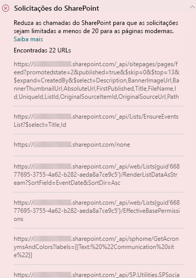

# Otimizar chamadas de página em páginas do site de publicação clássico e moderno do SharePoint Online

Os sites de publicação clássico e moderno do SharePoint Online contêm links que carregam dados de (ou fazem chamadas) recursos do SharePoint e CDNs. Quanto mais chamadas forem feitas por uma página, maior será o tempo de carregamento da página. Isso é conhecido como **latência percebida pelo usuário final** ou **EUPL**.

Este artigo vai ajudá-lo a entender como determinar o número e o impacto das chamadas para pontos de extremidade externos nas páginas do site de publicação clássico e moderno e como limitar o efeito na latência percebida pelo usuário final.

>[!NOTE]
>Para obter mais informações sobre o desempenho dos portais modernos do SharePoint Online, confira [Desempenho na experiência moderna do SharePoint](https://docs.microsoft.com/sharepoint/modern-experience-performance).

## Usar a ferramenta Diagnóstico de Página do SharePoint para analisar as chamadas da página

A **ferramenta Diagnóstico de Página para SharePoint** é uma extensão de navegador para o Chrome e o [Microsoft Edge versão 77 ou posterior](https://www.microsoftedgeinsider.com/download?form=MI13E8&OCID=MI13E8) que você pode usar para analisar as páginas do site de publicação moderno e clássico do SharePoint. A ferramenta fornece um relatório para cada página analisada que mostra o desempenho da página em relação a um conjunto definido de critérios de desempenho. Para instalar e saber mais sobre a ferramenta Diagnóstico de Página para SharePoint, acesse [Usar a ferramenta Diagnóstico de Página para SharePoint Online](page-diagnostics-for-spo.md).

Ao analisar uma página de site do SharePoint com a ferramenta Diagnóstico de Página para SharePoint, você pode ver informações sobre as chamadas externas nos resultado das **Solicitações para o SharePoint** no painel de _Testes de Diagnóstico_. A linha aparecerá em verde se a página do site contiver menos que o número da linha de base de chamadas e em vermelho se a página ultrapassar o número da linha de base. O número da linha de base é diferente para as páginas clássicas e modernas porque as páginas do site clássico usam HTTP1.1 e as modernas usam HTTP2.0:

- As páginas de site moderno não devem conter mais de **25** chamadas
- As páginas de publicação clássicas não devem conter mais de **6** chamadas

Os resultados possíveis incluem:

- **Atenção necessária** (vermelho): a página ultrapassa o número da linha de base de chamadas
- **Nenhuma ação necessária** (verde): a página contém menos do que o número da linha de base de chamadas

Se o resultado das **Solicitações para o SharePoint** aparecer na seção **Atenção necessária**, você poderá clicar no resultado para obter detalhes, incluindo o número total de chamadas na página e uma lista de URLs.

## Solucionar problemas de desempenho relacionados a muitas chamadas em uma página

Se uma página contiver muitas chamadas, você poderá usar a lista de URLs no resultado das **Solicitações do SharePoint** para determinar se há chamadas repetidas, chamadas que devem ser em lotes ou chamadas que retornam dados que devem ser armazenados em cache.

As **chamadas de REST em lote** podem ajudar a reduzir a sobrecarga de desempenho. Para obter mais informações sobre a chamada da API em lote, confira [Fazer solicitações em lote com as APIs REST](https://docs.microsoft.com/sharepoint/dev/sp-add-ins/make-batch-requests-with-the-rest-apis).

**Usar um cache** para armazenar os resultados de uma chamada de API pode melhorar o desempenho de uma solicitação ativa, permitindo que o cliente use os dados armazenados em cache, em vez de fazer uma chamada adicional para cada carregamento de página subsequente. Há várias maneiras de abordar essa solução dependendo da necessidade comercial. Geralmente, se os dados forem os mesmos para todos os usuários, o uso de um serviço de armazenamento hierárquico, como o [cache do _Azure Redis_](https://azure.microsoft.com/services/cache/), é uma ótima opção para reduzir significativamente o tráfego da API em um site, pois os usuários podem solicite os dados do serviço de cache, em vez de diretamente do SPO. As únicas chamadas SPO necessárias seriam para atualizar o cache da camada intermediária. Se os dados flutuarem com base no usuário individual, talvez seja melhor implementar um cache no lado do cliente, como LocalStorage ou até mesmo um cookie. Isso ainda reduzirá os volumes de chamadas, eliminando as solicitações subsequentes feitas pelo mesmo usuário na duração do cache, mas será menos eficiente do que um serviço de cache dedicado. O PnP permite que você use o LocalStorage com um pequeno desenvolvimento adicional necessário.

Antes de fazer as revisões das páginas para corrigir problemas de desempenho, anote o tempo de carregamento da página nos resultados da análise. Execute a ferramenta novamente após a revisão para ver se o novo resultado está dentro do padrão da linha de base e verifique o tempo de carregamento da nova página para ver se melhorou.

>[!NOTE]
>O tempo de carregamento da página pode variar de acordo com vários fatores, como a carga da rede, hora do dia e outras condições transitórias. Você deve testar o tempo de carregamento da página algumas vezes antes e depois de fazer as alterações para ajudá-lo a calcular uma média dos resultados.

## Tópicos relacionados

[Ajustar o desempenho do SharePoint Online](tune-sharepoint-online-performance.md)

[Ajustar o desempenho do Office 365](tune-office-365-performance.md)

[Desempenho na experiência moderna do SharePoint](https://docs.microsoft.com/sharepoint/modern-experience-performance)

[Redes de distribuição de conteúdo](content-delivery-networks.md)

[Usar a Rede de Distribuição de Conteúdo (CDN) do Office 365 com o SharePoint Online](use-office-365-cdn-with-spo.md)
