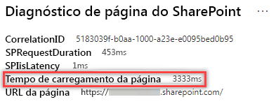

# Otimizar o peso da página nas páginas do site moderno do SharePoint Online.Optimize page weight in SharePoint Online modern site pages

As páginas do site moderno do SharePoint Online contêm o código serializado necessário para renderizar o conteúdo da página, incluindo imagens, texto, objetos na área de conteúdo embaixo das barras de navegação/comando e outro código HTML que forma a estrutura da página.SharePoint Online modern site pages contain serialized code that is required to render page content of the page, including images, text, objects in the content area underneath navigation/command bars and other HTML code that forms the framework of the page. A gramatura da página é uma medida desse código HTML e deve ser limitado para garantir o tempo de carregamento ideal da página.Page weight is a measurement of this HTML code, and should be limited to ensure optimal page load times.

Este artigo vai ajudá-lo a entender como reduzir o peso da página em suas páginas de site modernos.This article will help you understand how to reduce page weight in your modern site pages.

>[!NOTE]
>Para obter mais informações sobre o desempenho dos portais modernos do SharePoint Online, confira [Desempenho na experiência moderna do SharePoint](https://docs.microsoft.com/sharepoint/modern-experience-performance).For more information about performance in SharePoint Online modern portals, see [Performance in the modern SharePoint experience](https://docs.microsoft.com/sharepoint/modern-experience-performance).

## Usar a ferramenta Diagnóstico de Página do SharePoint para analisar o peso da páginaUse the Page Diagnostics for SharePoint tool to analyze page weight

A **ferramenta Diagnóstico de Página do SharePoint** é uma extensão de navegador para o Chrome e o [Microsoft Edge versão 77 ou posterior](https://www.microsoftedgeinsider.com/download?form=MI13E8&OCID=MI13E8), que você pode usar para analisar as páginas do site de publicação moderna e clássica do SharePoint.The **Page Diagnostics for SharePoint tool** is a browser extension for Chrome and [Microsoft Edge version 77 or later](https://www.microsoftedgeinsider.com/download?form=MI13E8&OCID=MI13E8) you can use to analyze SharePoint both modern and classic publishing site pages. A ferramenta fornece um relatório para cada página analisada que mostra o desempenho da página em relação a um conjunto definido de critérios de desempenho.The tool provides a report for each analyzed page showing how the page performs against a defined set of performance criteria. Para instalar e saber mais sobre a ferramenta Diagnóstico de Página do SharePoint, acesse [Usar a ferramenta Diagnóstico de Página do SharePoint Online](page-diagnostics-for-spo.md).To install and learn about the Page Diagnostics for SharePoint tool, visit [Use the Page Diagnostics tool for SharePoint Online](page-diagnostics-for-spo.md).

Ao analisar uma página de site do SharePoint com a ferramenta Diagnóstico de Página para SharePoint, você pode ver informações sobre a página **Peso da página em 500kB** resultado do painel dos _Testes de Diagnóstico _.When you analyze a SharePoint site page with the Page Diagnostics for SharePoint tool, you can see information about page in the **Page weight under 500KB** result of the _Diagnostic tests_ pane. O resultado será exibido em verde se o peso da página estiver abaixo do valor da linha de base e vermelho se o peso da página exceder o valor da linha de base.The result will appear in green if the page weight is under the baseline value, and red if the page weight exceeds the baseline value.

Os resultados possíveis incluem:Possible results include:

- **Atenção necessária** (vermelho): O peso da página ultrapassa 500kB**Attention required** (red): Page weight exceeds 500KB
- **Nenhuma ação necessário** (verde): O peso da página está abaixo de 500kB**No action required** (green): Page weight is under 500KB

Se o resultado **Peso da página abaixo de 500kB** aparecer na seção **Atenção necessária**, você pode clicar no resultado para obter detalhes.If the **Page weight under 500KB** result appears in the **Attention required** section, you can click the result for details.

## Solucionar problemas com o peso da páginaRemediate page weight issues

Se o peso da página exceder 500KB, você pode aumentar o tempo geral de carregamento da página reduzindo o número de Web Parts e limitando o conteúdo da página a um grau apropriado.If page weight exceeds 500KB, you can improve overall page load time by reducing the number of web parts and limiting page content to an appropriate degree.

As diretrizes gerais para reduzir o peso da página incluem:General guidance for reducing page weight includes:

- Limite o conteúdo da página a um valor razoável e use várias páginas para conteúdo relacionado.Limit the page content to a reasonable amount and use multiple pages for related content.
- Minimize o uso de Web Parts com grandes bolsas de propriedades.Minimize the use of web parts that have large property bags.
- Use modos de exibição cumulativos não interativos sempre que possível.Use non-interactive rollup views when possible.
- Otimize os tamanhos das imagens dimensionando-as de forma adequada, usando formatos de imagem compactados e garantindo que eles sejam baixados de uma CDN.Optimize image sizes by sizing images appropriately, using compressed image formats and ensuring that they are downloaded from a CDN.

Para saber mais, confira o artigo a seguir sobre como limitar o peso da página no seguinte artigo:You can find additional guidance for limiting page weight in the following article:

- [Otimizar o desempenho de página no SharePointOptimize page performance in SharePoint](https://docs.microsoft.com/sharepoint/dev/general-development/optimize-page-performance-in-sharepoint)

Antes de criar revisões de página para corrigir problemas de desempenho, anote o tempo de carregamento da página nos resultados da análise.Before you make page revisions to remediate performance issues, make a note of the page load time in the analysis results. Execute a ferramenta novamente após a revisão para ver se o novo resultado está dentro do padrão da linha de base e verifique o tempo de carregamento da nova página para ver se melhorou.Run the tool again after your revision to see if the new result is within the baseline standard, and check the new page load time to see if there was an improvement.

>[!NOTE]
>O tempo de carregamento da página pode variar de acordo com vários fatores, como a carga da rede, hora do dia e outras condições transitórias.Page load time can vary based on a variety of factors such as network load, time of day, and other transient conditions. Você deve testar o tempo de carregamento da página algumas vezes antes e depois de fazer as alterações para ajudá-lo a calcular uma média dos resultados.You should test page load time a few times before and after making changes to help you average the results.

## Tópicos relacionadosRelated topics

[Ajustar o desempenho do SharePoint OnlineTune SharePoint Online performance](tune-sharepoint-online-performance.md)

[Ajustar o desempenho do Office 365Tune Office 365 performance](tune-office-365-performance.md)

[Desempenho na experiência moderna do SharePointPerformance in the modern SharePoint experience](https://docs.microsoft.com/sharepoint/modern-experience-performance)

[Redes de distribuição de conteúdoContent delivery networks](content-delivery-networks.md)

[Usar a Rede de Distribuição de Conteúdo (CDN) do Office 365 com o SharePoint OnlineUse the Office 365 Content Delivery Network (CDN) with SharePoint Online](use-office-365-cdn-with-spo.md)
