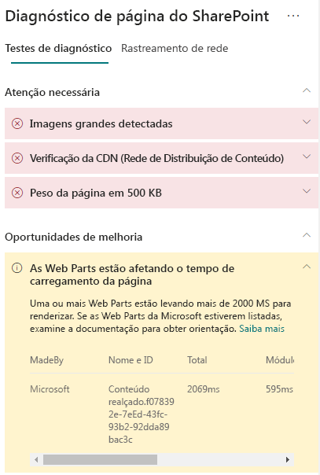

# Otimizar o desempenho de Web Parts em páginas de site moderno do SharePoint OnlineOptimize web part performance in SharePoint Online modern site pages

>[!TIP]
>Para saber mais sobre como otimizar iFrames nas páginas de site do SharePoint, confira [Otimizar iFrames em páginas de site de publicação clássico e moderno do SharePoint Online](modern-iframe-optimization.md).For information about optimizing iFrames in SharePoint site pages, see [Optimize iFrames in SharePoint Online modern and classic publishing site pages](modern-iframe-optimization.md).

As páginas de site moderno do SharePoint Online contêm Web Parts que podem contribuir para os tempos totais de carregamento de página.SharePoint Online modern site pages contain web parts that can contribute to overall page load times. Este artigo ajudará você a entender como determinar de que modo as Web Parts em suas páginas afetam a latência percebida pelo usuário e como corrigir problemas comuns.This article will help you understand how to determine how web parts in your pages affect user perceived latency, and how to remediate common issues.

>[!NOTE]
>Para obter mais informações sobre o desempenho dos portais modernos do SharePoint Online, confira [Desempenho na experiência moderna do SharePoint](https://docs.microsoft.com/pt-BR/sharepoint/modern-experience-performance).For more information about performance in SharePoint Online modern portals, see [Performance in the modern SharePoint experience](https://docs.microsoft.com/pt-BR/sharepoint/modern-experience-performance).

## Usar a ferramenta Diagnóstico de Página para SharePoint para analisar Web PartsUse the Page Diagnostics for SharePoint tool to analyze web parts

A **ferramenta Diagnóstico de Página para SharePoint** é uma extensão de navegador para o Chrome e o [Microsoft Edge versão 77 ou posterior](https://www.microsoftedgeinsider.com/en-us/download?form=MI13E8&OCID=MI13E8) que você pode usar para analisar as páginas de site de publicação moderno e clássico do SharePoint.The **Page Diagnostics for SharePoint tool** is a browser extension for Chrome and [Microsoft Edge version 77 or later](https://www.microsoftedgeinsider.com/en-us/download?form=MI13E8&OCID=MI13E8) you can use to analyze SharePoint both modern and classic publishing site pages. A ferramenta fornece um relatório para cada página analisada que mostra o desempenho da página em relação a um conjunto definido de critérios de desempenho.The tool provides a report for each analyzed page showing how the page performs against a defined set of performance criteria. Para instalar e saber mais sobre a ferramenta Diagnóstico de Página para SharePoint, acesse [Usar a ferramenta Diagnóstico de Página para SharePoint Online](page-diagnostics-for-spo.md).To install and learn about the Page Diagnostics for SharePoint tool, visit [Use the Page Diagnostics tool for SharePoint Online](page-diagnostics-for-spo.md).

Ao analisar uma página de site do SharePoint com a ferramenta Diagnóstico de Página para SharePoint, você pode ver informações sobre Web Parts que excedem a métrica de linha de base no resultado de **As Web Parts estão afetando o tempo de carregamento da página**, no painel _Testes de diagnóstico_.When you analyze a SharePoint site page with the Page Diagnostics for SharePoint tool, you can see information about web parts that exceed the baseline metric in the **Web parts are impacting page load time** result in the _Diagnostic tests_ pane.

Os resultados possíveis incluem:Possible results include:

- **Requer atenção** (vermelho): qualquer Web Part _personalizada_ que demora mais de **dois** segundos para ser carregada.**Attention required** (red): Any _custom_ web part that takes longer than **two** seconds to load. O tempo total de carregamento, conforme exibido nos resultados de teste, é dividido por carregamento do módulo, carga lenta, inicialização e renderização.Total load time as displayed in test results is broken down by module load, lazy load, init and render.
- **Oportunidades de melhoria** (amarelo): os itens que podem estar afetando o tempo de carregamento da página são mostrados nesta seção e devem ser examinados e monitorados.**Improvement opportunities** (yellow): Items that may be impacting page load time are shown in this section and should be reviewed and monitored. Isso pode incluir Web Parts OOTB (“prontas para uso”) da Microsoft.This may include "out of the box" (OOTB) Microsoft web parts. Os resultados de todas as Web Parts da Microsoft mostradas nesta seção são automaticamente relatados à Microsoft, portanto, **nenhuma ação é necessária**.Results for any Microsoft web parts shown in this section are automatically reported to Microsoft, so **no action is required**. Você só precisará registrar um tíquete de suporte para investigação se estiver enfrentando um desempenho muito lento na página e **todas as Web Parts da Microsoft** na página aparecerem nos resultados na seção **Oportunidades de melhoria**.You should only log a support ticket for investigation if you are experiencing very slow performance on the page and **all Microsoft web parts** on the page appear in the results in the **Improvement opportunities** section. Uma atualização futura da ferramenta Diagnóstico de Página detalhará ainda mais os resultados com base na configuração específica da Web Part da Microsoft.Note that a future Page Diagnostics tool update will further break down the results based on the specific configuration of the Microsoft web part.
- **Nenhuma ação necessária** (verde): nenhuma Web Part está demorando mais de **dois** segundos para retornar dados.**No action required** (green): No web part is taking longer than **two** seconds to return data.

Se o resultado de **As Web Parts estão afetando o tempo de carregamento da página** aparecer na seção **Requer atenção** ou **Oportunidades de melhoria**, clique no resultado para ver detalhes sobre quais Web Parts estão com carregamento lento.If the **Web parts are impacting page load time** result appears in either the **Attention required** or **Improvement opportunities** section of the results, click the result to see details about which web parts are loading slowly. Futuras atualizações da ferramenta Diagnóstico de Página para SharePoint podem incluir atualizações de regras de análise, portanto, garanta que você sempre tenha a versão mais recente da ferramenta.Future updates to the Page Diagnostics for SharePoint tool may include updates to analysis rules, so please ensure you always have the latest version of the tool.

As informações disponíveis nos resultados incluem:Information available in the results includes:

- **Feita por** mostra se a Web Part é personalizada ou OOTB da Microsoft**Made by** shows whether the web part is custom or Microsoft OOTB
- **Nome e ID** mostra informações de identificação que podem ajudar você a encontrar a Web Part na página**Name and ID** shows identifying information that can help you find the web part on the page
- **Total** mostra o tempo total de carregamento de Web Part**Total** shows the total time for the web part to load
- **Carregamento do Módulo** mostra o tempo gasto para buscar e carregar os componentes de Web Part**Module Load** shows the time taken to fetch and load the web part components
- **Carregamento Lento** mostra o tempo de carregamento adiado de Web Parts não exibido na seção principal da página**Lazy Load** shows the time for deferred loading of web parts not seen in the main section of the page
- **Inicialização** mostra o tempo gasto para a inicialização da Web Part**Init** shows the time taken for web part initialization
- **Renderização** mostra o tempo gasto para a Web Part buscar e renderizar resultados**Render** shows the time taken for the web part to fetch and render results

Essas informações são fornecidas para ajudar designers e desenvolvedores a solucionar problemas.This information is provided to help designers and developers troubleshoot issues. Elas devem ser encaminhadas à equipe de design e desenvolvimento.This information should be provided to your design and development team.

## Solucionar problemas de desempenho de Web PartsRemediate web part performance issues

Siga as orientações desta seção para identificar e corrigir problemas de desempenho com Web Parts indicados nos resultados de **As Web Parts estão afetando o tempo de carregamento da página**.Follow the guidance in this section to identify and remediate performance issues with web parts listed in the **Web parts are impacting page load time** results.

Há três categorias de possíveis causas do desempenho ruim de uma Web Part.There are three categories of possible causes for poor web part performance. Use as informações abaixo para determinar quais problemas se aplicam ao seu cenário e corrigi-los.Use the information below to determine which issues apply to your scenario and remediate them.

- Dependências e tamanho de script da Web PartWeb part script size and dependencies
  - Otimize o script inicial que renderiza o cenário principal para _somente modo de exibição_.Optimize the initial script that renders the mainline scenario for _view mode only_.
  - Mova os cenários menos frequentes e o código do modo de edição (como o painel de propriedades) para partes separadas usando a instrução _ import()_.Move the less frequent scenarios and edit mode code (like the property pane) to separate chunks using the _import()_ statement.
  - Examine as dependências do arquivo _package.json_ para remover completamente qualquer código morto.Review dependencies of the _package.json_ file to remove any dead code completely. Mova todas as dependência apenas de teste/build para devDependencies.Move any test/build only dependencies to devDependencies.
  - É necessário usar a CDN do Office 365 para baixar o recurso estático ideal.Use of the Office 365 CDN is required for optimal static resource download. As origens da CDN pública são preferíveis para arquivos _js/css_.Public CDN origins are preferable for _js/css_ files. Para saber mais sobre como usar a CDN do Office 365, confira [Usar a CDN (Rede de Distribuição de Conteúdo) do Office 365 com o SharePoint Online](use-office-365-cdn-with-spo.md).For information about how to use the Office 365 CDN, see [Use the Office 365 Content Delivery Network (CDN) with SharePoint Online](use-office-365-cdn-with-spo.md).
  - Reutilize estruturas como _importações do React_ e do _Fabric_, que vêm como parte da Estrutura do SharePoint (SPFx).Reuse frameworks like _React_ and _Fabric imports_ that come as part of the SharePoint Framework (SPFx). Para saber mais, confira [Visão geral da Estrutura do SharePoint](https://docs.microsoft.com/pt-BR/sharepoint/dev/spfx/sharepoint-framework-overview).For more information, see  [Overview of the SharePoint Framework](https://docs.microsoft.com/pt-BR/sharepoint/dev/spfx/sharepoint-framework-overview).
  - Verifique se você está usando a versão mais recente da Estrutura do SharePoint e atualize para novas versões quando elas estiverem disponíveis.Ensure that you are using the latest version of the SharePoint Framework, and upgrade to new versions as they become available.
- Busca/cache de dadosData fetching/caching
  - Se a Web Part contar com chamadas adicionais do servidor para buscar dados para exibição, verifique se as APIs do servidor são rápidas e/ou implemente cache do lado do cliente (por exemplo, use _localStorage_ ou _IndexDB_ para conjuntos maiores).If the web part relies on extra server calls to fetch data for display, ensure those server APIs are fast and/or implement client side caching (such as using _localStorage_ or _IndexDB_ for larger sets).
  - Se várias chamadas forem necessárias para renderizar dados críticos, considere o uso de envio em lote no servidor ou de outros métodos de consolidação de solicitações em uma única chamada.If multiple calls are required to render critical data, consider batching on the server or other methods of consolidating requests to a single call.
  - Como alternativa, se alguns elementos de dados exigirem uma API mais lenta, mas não forem críticos para a renderização inicial, separe-os em outra chamada, executada após a renderização dos dados críticos.Alternatively, if some elements of data require a slower API, but are not critical to initial rendering, decouple these to a separate call that is executed after critical data is rendered.
  - Se várias partes usarem os mesmos dados, utilize uma camada de dados comum para evitar chamadas duplicadas.If multiple parts use the same data, utilize a common data layer to avoid duplicate calls.
- Tempo de renderizaçãoRendering time
  - Quaisquer fontes de mídia, como imagens e vídeos, devem ser dimensionadas de acordo com os limites do contêiner, dispositivo e/ou rede para evitar o download de grandes recursos desnecessários.Any media sources like images and videos should be sized to the limits of the container, device and/or network to avoid downloading unnecessary large assets. Para saber mais sobre como usar dependências de conteúdo, confira [Usar a CDN (Rede de Distribuição de Conteúdo) do Office 365 com o SharePoint Online](use-office-365-cdn-with-spo.md).For information about how to use the Office 365 CDN, see [Use the Office 365 Content Delivery Network (CDN) with SharePoint Online](use-office-365-cdn-with-spo.md).
  - Evite chamadas de API que causem refluxo, regras CSS complexas ou animações complicadas.Avoid API calls that cause re-flow, complex CSS rules or complicated animations. Para obter mais informações, confira [Minimizar o refluxo do navegador](https://developers.google.com/speed/docs/insights/browser-reflow).For more information, see [Minimizing browser reflow](https://developers.google.com/speed/docs/insights/browser-reflow).
  - Evite o uso de tarefas de longa execução encadeadas.Avoid use of chained long running tasks. Em vez disso, divida as tarefas de longa execução em filas separadas.Instead, break long running tasks apart into separate queues. Para obter mais informações, confira [Otimizar a execução do JavaScript](https://developers.google.com/web/fundamentals/performance/rendering/optimize-javascript-execution).For more information, see [Optimize JavaScript Execution](https://developers.google.com/web/fundamentals/performance/rendering/optimize-javascript-execution).
  - Reserve o espaço correspondente para renderizar de forma assíncrona mídia ou elementos visuais, a fim de evitar quadros ignorados e instabilidade (também conhecida como _jank_).Reserve corresponding space for asynchronously rendering media or visual elements to avoid skipped frames and stuttering (also known as _jank_).
  - Se determinado navegador não oferecer suporte a um recurso usado na renderização, carregue um polyfill ou exclua o código dependente em execução.If a certain browser doesn't support a feature used in rendering, either load a polyfill or exclude running dependent code. Se o recurso não for crítico, descarte recursos como manipuladores de eventos para evitar vazamentos de memória.If the feature is not critical, dispose resources such as event handlers to avoid memory leaks.

Antes de fazer as revisões das páginas para corrigir problemas de desempenho, anote o tempo de carregamento da página nos resultados da análise.Before you make page revisions to remediate performance issues, make a note of the page load time in the analysis results. Execute a ferramenta novamente após a revisão para ver se o novo resultado está dentro do padrão da linha de base e verifique o tempo de carregamento da nova página para ver se melhorou.Run the tool again after your revision to see if the new result is within the baseline standard, and check the new page load time to see if there was an improvement.

>[!NOTE]
>O tempo de carregamento da página pode variar de acordo com vários fatores, como a carga da rede, hora do dia e outras condições transitórias.Page load time can vary based on a variety of factors such as network load, time of day, and other transient conditions. Você deve testar o tempo de carregamento da página algumas vezes antes e depois de fazer as alterações para ajudá-lo a calcular uma média dos resultados.You should test page load time a few times before and after making changes to help you average the results.

## Tópicos relacionadosRelated topics

[Ajustar o desempenho do SharePoint OnlineTune SharePoint Online performance](tune-sharepoint-online-performance.md)

[Ajustar o desempenho do Office 365Tune Office 365 performance](tune-office-365-performance.md)

[Desempenho na experiência moderna do SharePointPerformance in the modern SharePoint experience](https://docs.microsoft.com/pt-BR/sharepoint/modern-experience-performance.md)

[Redes de distribuição de conteúdoContent delivery networks](content-delivery-networks.md)

[Usar a Rede de Distribuição de Conteúdo (CDN) do Office 365 com o SharePoint OnlineUse the Office 365 Content Delivery Network (CDN) with SharePoint Online](use-office-365-cdn-with-spo.md)
