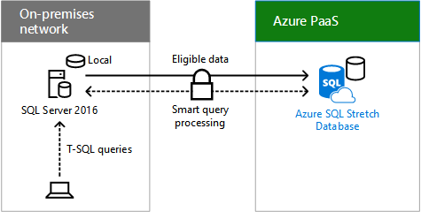

# Mover dados de histórico de transação para a nuvemMoving historical transaction data to the cloud

 **Resumo:** Como a Contoso implementou Alongar banco de dados do SQL Server para reduzir as suas necessidades de armazenamento de dados no local e diariamente executando os custos.**Summary:** How Contoso implemented SQL Server stretch database to reduce its on-premises data storage needs and daily running costs.
  
Sistema de armazenamento corporativo da Contoso armazena uma grande quantidade de dados de histórico de transação para adesão com os requisitos normativos e para pesquisas de marketing e análise de tendências de gastos de BI. A Contoso também precisa restaurar os dados arquivados de fita magnético, um processo demorada. O hardware no sistema de armazenamento corporativo da Contoso estava perto de seu fim da vida útil e substitui-la seria muito caro.Contoso's enterprise storage system stores a large amount of historical transaction data for adherence with regulatory requirements and for marketing research and BI analysis of spending trends. Contoso also needs to restore archived data from magnetic tape, a time-intensive process. The hardware in Contoso's enterprise storage system was nearing its end of life and replacing it would be very expensive. 
  
Como parte da sua necessidade comercial para dimensionar a seus centros de dados local, a Contoso optou por atualizar para o SQL Server 2016 devido ao recurso de híbrido de banco de dados Alongar e sua perfeita integração com o Windows Azure. Alongar do banco de dados permite que a Contoso mover os dados frio nas suas tabelas no local para armazenamento em nuvem, liberar espaço no disco local e reduzindo a manutenção. Dados quente e a frio são nas tabelas a mesma e estão sempre disponíveis para aplicativos e seus usuários e para manutenção, como backups e restaurações. A Figura 1 mostra Alongar banco de dados.As part of its business need to scale down its on-premises datacenters, Contoso chose to upgrade to SQL Server 2016 because of the Stretch Database hybrid feature and its seamless integration with Azure. Stretch Database allows Contoso to move the cold data in its tables from on-premises to cloud storage, freeing up local disk space and reducing maintenance. Both hot and cold data are in the same tables and are always available to applications and their users and for maintenance, such as backups and restores. Figure 1 shows Stretch Database.
  
**Figura 1: SQL Server Database Alongar****Figure 1: SQL Server Stretch Database**

  
A Figura 1 mostra como um cliente SQL envia consultas T-SQL para um servidor executando o SQL Server 2016, que encaminha para um banco de dados do Windows Azure SQL Alongar no Azure PaaS.Figure 1 shows how a SQL client sends T-SQL queries to a server running SQL Server 2016, which forwards them to an Azure SQL Stretch Database in Azure PaaS.
  
Para obter mais informações, consulte [Alongar banco de dados](https://msdn.microsoft.com/library/dn935011.aspx).For more information, see [Stretch Database](https://msdn.microsoft.com/library/dn935011.aspx).
  
Contoso usado estas etapas para mover seus dados históricos para a nuvem:Contoso used these steps to move their historical data to the cloud:
  
1. Analisar bancos de dadosAnalyze databases
    
    Realizou uma análise das tabelas nos bancos de dados que eles foi projetado para mover para a nuvem e corrigido quaisquer problemas. Supervisor de banco de dados do novo Alongar deu-las uma visão geral do que eles podem esperar de todos os recursos no SQL Server 2016, incluindo quais tabelas tenham dados frio que poderiam ser alongados.Performed an analysis of the tables in the databases that they intended to move to the cloud and fixed any issues. The new Stretch Database Advisor gave them a full overview of what they can expect from all features in SQL Server 2016, including which tables have cold data that could be stretched.
    
2. AtualizarUpgrade
    
    Atualizado servidores SQL existentes no datacenter Paris matrizes para 2016 do SQL Server.Updated existing SQL servers in the Paris headquarters datacenter to SQL Server 2016.
    
3. Migrar dados frio para a nuvemMigrate cold data to the cloud
    
    Usando o SQL Management Studio, eles identificados alongar os bancos de dados e as tabelas para migrar para instâncias de banco de dados Alongar no Windows Azure. Ao longo do tempo e em segundo plano, SQL Server 2016 movidas os dados históricos para alongar bancos de dados no Windows Azure.Using SQL Management Studio, they identified the databases to stretch and the tables to migrate to instances of Stretch Database in Azure. Over time and in the background, SQL Server 2016 moved the historical data to stretch databases in Azure.
    
Aqui está a configuração resultante para um servidor executando o SQL Server 2016 da matriz da Paris.Here is the resulting configuration for one server running SQL Server 2016 in the Paris headquarters.
  
**Figura 2: Usando o banco de dados de Alongar para um servidor em um datacenter da Contoso****Figure 2: Using Stretch Database for a server in Contoso's datacenter**

  
A Figura 2 mostra como consultas de usuário para um servidor de aplicativos no datacenter da Contoso se tornam consultas SQL que são passadas para um banco de dados do Windows Azure SQL Alongar no Azure PaaS.Figure 2 shows how user queries to an application server in Contoso's datacenter become SQL queries that are passed to an Azure SQL Stretch Database in Azure PaaS.
  
Os usuários acessam os dados por meio de consultas e aplicativos existentes. Políticas de acesso permanecem os mesmos. Não é mais adiante, é necessário para backups em fita. Manutenção consiste em fazendo backup e restaurando dados hot.Users access the data through existing apps and queries. Access policies remain the same. Moving forward, there is no need for tape backups. Maintenance consists of backing up and restoring hot data.
  
Depois da implementação do banco de dados de alongar, Contoso:After implementing Stretch Database, Contoso:
  
- Reduziu suas necessidades de armazenamento de dados local 85%.Reduced its on-premises data storage needs by 85%.
    
- A atualização do sistema de armazenamento da empresa e a dependência de arquivos em fita magnético feitas desnecessárias.Made the update of the enterprise storage system and reliance on magnetic tape archives unnecessary.
    
- Reduziu os seus custos de execução diários significativamente.Reduced its daily running costs significantly.
    
## Veja tambémSee Also

[Cenários empresariais para a Contoso CorporationEnterprise scenarios for the Contoso Corporation](enterprise-scenarios-for-the-contoso-corporation.md)
  
[Contoso na Microsoft CloudContoso in the Microsoft Cloud](contoso-in-the-microsoft-cloud.md)
  
[Recursos de arquitetura de TI do MicrosoftMicrosoft Cloud IT architecture resources](microsoft-cloud-it-architecture-resources.md)

[Alongar para o banco de dadosStretch Database](https://msdn.microsoft.com/library/dn935011.aspx)
  
[Roteiro do Enterprise Cloud da Microsoft: recursos para responsáveis pelas decisões de TIMicrosoft's Enterprise Cloud Roadmap: Resources for IT Decision Makers](https://sway.com/FJ2xsyWtkJc2taRD)

