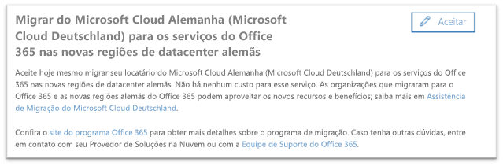
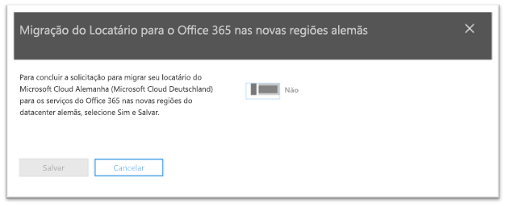
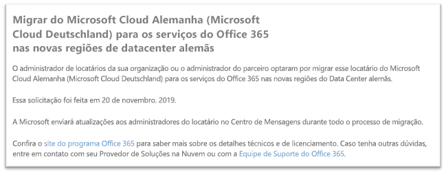

# Como aceitar a migração do Microsoft Cloud Alemanha (Microsoft Cloud Deutschland) para os serviços do Office 365 nas novas regiões de datacenter alemãs

>[!Note]
>Esse artigo aplica-se somente aos clientes qualificados do Microsoft Cloud Alemanha/Deutschland.
>

## Como solicitar a migração

Os clientes qualificados com serviço provisionado no Microsoft Cloud Alemanha verão uma página no centro de administração do Microsoft 365, que permitirá que um administrador de locatários do cliente opte por migrar.

Para acessar a página no centro de administração do Microsoft 365, no painel de navegação à esquerda, expanda **Configurações** e, em seguida, clique em **Perfil da Organização**.

Na página **Perfil da Organização**, role para baixo até a seção **Migrar do Microsoft Cloud Alemanha (Microsoft Cloud Deutschland) para os serviços do Office 365 nas novas regiões do datacenter alemãs**.

Se a sua organização deseja migrar seu serviço do Microsoft Cloud Alemanha (Microsoft Cloud Deutschland) para os serviços do Office 365 nas novas regiões de data center alemãs, clique em **Opt-in**.
 

Uma nova seção será exibida no lado direito da tela para aceitar a confirmação. Selecione o botão para **Sim** e, em seguida, clique em **Salvar**.
 

Depois que um administrador aceitar em nome de seu locatário, todos os administradores verão a confirmação na seção **Migrar do Microsoft Cloud Alemanha (Microsoft Cloud Deutschland) para os serviços do Office 365 nas novas regiões do Data Center alemãs**, incluindo a data do consentimento. Os administradores também terão uma confirmação no Centro de Mensagens do centro de administração do Microsoft 365. 
 

## O que acontece após aceitar a migração?

Para as organizações que aceitarem a abordagem orientada pela Microsoft, espera-se que as migrações ocorram em 2020.  Como resultado da migração, os dados principais e assinaturas do cliente serão movidos para as novas regiões alemãs.  A Microsoft enviará atualizações durante todo o processo de migração no Centro de Mensagens.

## Mais informações

- Assistência de Migração do Microsoft Cloud Deutschland em [https://aka.ms/germanymigrateassist](https://aka.ms/germanymigrateassist)
- Migração do Office 365 em [https://aka.ms/office365germanymove](https://aka.ms/office365germanymove)
- Migração do Dynamics 365 em [https://aka.ms/d365ceoptin](https://aka.ms/d365ceoptin)
- Migração do Power BI em [https://aka.ms/pbioptin](https://aka.ms/pbioptin)
- Enviar perguntas usando o "Precisa de Ajuda?" link do [Centro de administração do Microsoft 365](https://portal.office.de/).
