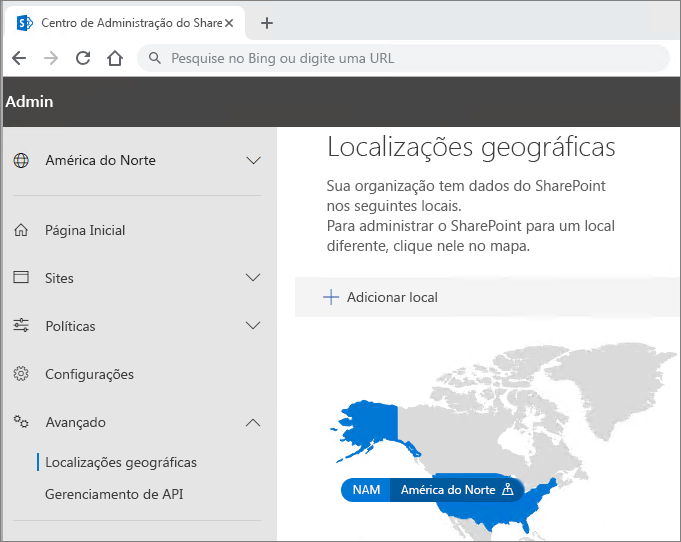

# Configuração de um locatário do Office 365 multigeográficoOffice 365 Multi-Geo tenant configuration

Antes de configurar seu locatário do Office 365 multigeográfico, certifique-se de que você leu o [Plano para o Office 365 multigeográfico](plan-for-multi-geo.md).Before you configure your tenant for Office 365 Multi-Geo, be sure you have read [Plan for Office 365 Multi-Geo](plan-for-multi-geo.md). Para seguir as etapas neste artigo, você precisará de uma lista de localizações geográficas que você deseja habilitar como locais de satélite e os usuários de teste que você deseja provisionar para esses locais.To follow the steps in this article, you'll need a list of the geo locations that you want to enable as satellite locations, and the test users that you want to provision for those locations.

## Adicionar recursos multigeográficos no plano do Office 365 para seu locatárioAdd the Multi-Geo Capabilities in Office 365 plan to your tenant

Para usar o Office 365 multigeográfico, é necessário o plano _Funcionalidades Multigeográficas no Office 365_.To use Office 365 Multi-Geo, you need the _Multi-Geo Capabilities in Office 365_ plan. Trabalhar com sua equipe de conta para adicionar este plano para seu locatário.Work with your account team to add this plan to your tenant. Sua equipe de conectará você com o especialista de licenciamento apropriado e fará a configuração do seu locatário.Your account team will connect you with the appropriate licensing specialist and get your tenant configured.

Observe que o plano de _Funcionalidades Multigeográficas no Office 365_ é um plano de serviços de nível de usuário. Você precisa de uma licença para cada usuário que deseja hospedar em um local de satélite. Você pode adicionar mais licenças ao longo do tempo ao adicionar usuários em locais de satélite.Note that the _Multi-Geo Capabilities in Office 365_ plan is a user-level service plan. You need a license for each user that you want to host in a satellite location. You can add more licenses over time as you add users in satellite locations.

Depois que o locatário for provisionado com o plano  _Funcionalidades Multigeográficas no Office 365_, a guia **Localizaões geográficas** será disponibilizada no OneDrive e no Centro de administração do SharePoint.Once your tenant has been provisioned with the  _Multi-Geo Capabilities in Office 365_ plan, the **Geo locations** tab will become available in the OneDrive and SharePoint admin centers.

## Adicionar locais de satélites ao seu locatárioAdd satellite locations to your tenant

Você deve adicionar um local de satélite para cada localização geográfica onde você deseja armazenar dados.You must add a satellite location for each geo location where you want to store data. As localizações geográficas disponíveis são mostrados na tabela a seguir:Available geo locations are shown in the following table:

[!INCLUDE [Office 365 Multi-Geo locations](includes/office-365-multi-geo-locations.md)]

Para adicionar um local de satéliteTo add a satellite location

1. Abra o Centro de Administração do SharePoint.Open the SharePoint admin center.

2. Navegue até a guia **Localizações geográficas**.Navigate to the **Geo locations** tab.

3. Clique em **Adicionar local**.Click **Add location**.

4. Selecione o local que você deseja adicionar e clique em **Avançar**.Select the location that you want to add, and then click **Next**.

5. Digite o domínio que você deseja usar com a localização geográfica e clique em **Adicionar**.Type the domain that you want to use with the geo location, and then click **Add**.

6. Clique em **Fechar**.Click **Close**.

O provisionamento pode levar desde algumas horas até 72 horas, dependendo do tamanho de seu locatário. Depois que o provisionamento de uma localização satélite for concluído, você receberá um email de confirmação. Quando o novo local geográfico for exibido em azul no mapa na guia **Localizações geográficas** no Centro de administração do OneDrive, você poderá definir o local preferencial de dados dos usuários como essa localização geográfica.Provisioning may take from a few hours up to 72 hours, depending on the size of your tenant. Once provisioning of a satellite location has completed, you will receive an email confirmation. When the new geo location appears in blue on the map on the **Geo locations** tab in the OneDrive admin center, you can proceed to set users' preferred data location to that geo location. 

> [!IMPORTANT]
> A nova localização satélite será definida com configurações padrão. Isso permitirá configurar a localização satélite de acordo com suas necessidades locais de conformidade.Your new satellite location will be set up with default settings. This will allow you to configure that satellite location as appropriate for your local compliance needs.

## Defina o local de dados preferencial dos usuáriosSetting users' preferred data location
 

Depois de habilitar as localizações satélites necessárias, você pode atualizar as contas de usuários para usar o local de dados de sua preferência. É recomendável definir um local preferencial de dados para todos os usuários, mesmo que o usuário permaneça no local de dados central.Once you enable the needed satellite locations, you can update your user accounts to use the appropriate preferred data location. We recommend that you set a preferred data location for every user, even if that user is staying in the central location.

> [!IMPORTANT]
> Se o local de dados preferencial do usuário for definido em um local que não foi configurado como um local de satélite ou um local central, o sistema adotará como padrão o local central ao provisionar sites do OneDrive e do SharePoint e caixas de correio de Grupo.If a user's preferred data location is set to a location that has not been configured as a satellite location or the central location, the system will default to the central location when provisioning OneDrive and SharePoint sites and Group mailboxes.

> [!TIP]
> É recomendável começar validações com um usuário de teste ou um pequeno grupo de usuários antes de implantar Funcionalidades Multigeográficas em sua organização de forma mais ampla.We recommend that you begin validations with a test user or small group of users before rolling out multi-geo to your broader organization.

Há dois tipos de objetos de usuário no Azure Active Directory: usuários somente nuvem e usuários sincronizados.In Azure Active Directory there are two types of user objects: cloud only users and synchronized users. Siga as instruções apropriadas para o seu tipo de usuário.Please follow the appropriate instructions for your type of user.

### Sincronizar o local de dados preferencial do usuário usando o Azure Active Directory ConnectSynchronize user's Preferred Data Location using Azure Active Directory Connect 

Se os usuários da empresa são sincronizados de um sistema local do AD (Active Directory) ao AAD (Azure Active Directory), o PreferredDataLocation deve ser preenchido no AD e sincronizado com o AAD. Siga o processo em [Sincronização do Azure AD Connect: configurar o local preferencial de dados para recursos do Office 365](/azure/active-directory/hybrid/how-to-connect-sync-feature-preferreddatalocation) para configurar a sincronização do local preferencial de dados do Active Directory local com o Azure Active Directory.If your company’s users are synchronized from an on-premises Active Directory system to Azure Active Directory, their PreferredDataLocation must be populated in AD and synchronized to AAD. Follow the process in [Azure Active Directory Connect sync: Configure preferred data location for Office 365 resources](/azure/active-directory/hybrid/how-to-connect-sync-feature-preferreddatalocation) to configure Preferred Data Location sync from on-premises Active Directory to Azure Active Directory.

Recomendamos que você inclua o Local de Dados Preferencial do usuário na configuração como parte do fluxo de trabalho de criação de usuário padrão.We recommend that you include setting the user's Preferred Data Location as a part of your standard user creation workflow.

> [!IMPORTANT]
> Para novos usuários sem o OneDrive provisionado, aguarde pelo menos de 24 horas após o PDL do usuário ser sincronizado com o Azure Active Directory para que as alterações se propaguem antes de fazer logon no OneDrive for Business.For new users with no OneDrive provisioned, wait at least 24 hours after a user's PDL is synchronized to Azure Active Directory for the changes to propagate before the user logs in to OneDrive for Business. (Configurar o Local de Dados Preferencial antes do usuário fazer o logon para provisionar o OneDrive for Business garante que o novo OneDrive do usuário seja provisionado no local correto.)(Setting the preferred data location before the user logs in to provision their OneDrive for Business ensures that the user's new OneDrive will be provisioned in the correct location.)

### Configurar Local de Dados Preferencial para usuários somente na nuvemSetting Preferred Data Location for cloud only users 

Se os usuários da empresa não estiverem sincronizados a partir de um sistema do Active Directory local para o Azure Active Directory, o que significa que são criados no Office 365 ou no Azure Active Directory, o PDL deverá ser definido usando o PowerShell do Azure Active Directory.If your company's users are not synchronized from an on-premises Active Directory system to Azure Active Directory, meaning they are created in Office 365 or Azure Active Directory, then the PDL must be set using Azure Active Directory PowerShell.

Os procedimentos desta seção exigem o [Módulo do Microsoft Azure Active Directory para o Módulo do Windows PowerShell](https://www.powershellgallery.com/packages/MSOnline/1.1.166.0). Se você já tiver instalado o PowerShell do Azure Active Directory, não se esqueça de atualizar para a versão mais recente.The procedures in this section require the [Microsoft Azure Active Directory Module for Windows PowerShell Module](https://www.powershellgallery.com/packages/MSOnline/1.1.166.0). If you already have Azure Active Directory PowerShell installed, please ensure you update to the latest version.

1.  Abra o Módulo Microsoft Azure Active Directory para Windows PowerShell.Open the Microsoft Azure Active Directory Module for Windows PowerShell.

2.  Execute o `Connect-MsolService` e insira as credenciais de administrador global do locatário.Run `Connect-MsolService` and enter the global administrator credentials for your tenant.

3.  Use o cmdlet [Set-MsolUser](https://docs.microsoft.com/powershell/msonline/v1/set-msoluser) para definir o local preferencial de dados para cada um dos usuários. Por exemplo:Use the [Set-MsolUser](https://docs.microsoft.com/powershell/msonline/v1/set-msoluser) cmdlet to set the preferred data location for each of your users. For example:

    `Set-MsolUser -userprincipalName Robyn.Buckley@Contoso.com -PreferredDatalocation EUR`

    Você pode confirmar se o local preferencial de dados foi atualizado corretamente usando o cmdlet Get-MsolUser. Por exemplo:You can check to confirm that the preferred data location was updated properly by using the Get-MsolUser cmdlet. For example:

    `(Get-MsolUser -userprincipalName Robyn.Buckley@Contoso.com).PreferredDatalocation`

Recomendamos que você inclua o Local de Dados Preferencial do usuário na configuração como parte do fluxo de trabalho de criação de usuário padrão.We recommend that you include setting the user's Preferred Data Location as a part of your standard user creation workflow.

> [!IMPORTANT]
> Para novos usuários sem o OneDrive provisionado, aguarde pelo menos de 24 horas após o PDL ser feito para que as alterações se propaguem antes de fazer logon no OneDrive.For new users with no OneDrive provisioned, wait at least 24 hours after a user's PDL is set for the changes to propagate before the user logs in to OneDrive. (Configurar o Local de Dados Preferencial antes do usuário fazer o logon para provisionar o OneDrive for Business garante que o novo OneDrive do usuário seja provisionado no local correto.)(Setting the preferred data location before the user logs in to provision their OneDrive for Business ensures that the user's new OneDrive will be provisioned in the correct location.)

## Provisionamento do OneNote e efeito de PDLOneDrive Provisioning and the effect of PDL

Se o usuário já tiver um site do OneDrive criado no locatário, configurar o PDL não moverá automaticamente o OneDrive existente.If the user already has a OneDrive site created in the tenant, setting their PDL will not automatically move their existing OneDrive. Para mover o OneDrive de um usuário, confira [Movimentação Geográfica do OneDrive for Business](move-onedrive-between-geo-locations.md) siga as instruções em Mover o OneDrive entre localizações geográfica.To move a user's OneDrive, see [OneDrive for Business Geo Move](move-onedrive-between-geo-locations.md) please follow the instructions in Moving OneDrive between geo locations. (Observe que a caixa de correio do Exchange do usuário não move automaticamente quando ao definir o PDL do usuário.)(Note that the user's Exchange mailbox does move automatically when you set the user's PDL.)

Se o usuário não tiver um site do OneDrive no locatário, o OneDrive será provisionado para ele de acordo com o valor do PDL, supondo que o PDL do usuário corresponda a um dos locais de satélites da empresa.If the user does not have a OneDrive site within the tenant, OneDrive will be provisioned for them in accordance to their PDL value, assuming the PDL for the user matches one of the company's satellite locations.

## Configurar pesquisa multigeográficaConfiguring Multi-Geo search

O locatário com Funcionalidades Multigeográficas terá recursos de pesquisa agregados, permitindo que uma consulta de pesquisa retorne resultados de praticamente qualquer lugar no locatário.Your multi-geo tenant will have aggregate search capabilities allowing a search query to return results from anywhere within the tenant.

Por padrão, pesquisas desses pontos de entrada retornam resultados agregados, mesmo que cada índice de pesquisa esteja em sua localização geográfica relevante:By default, searches from these entry points will return aggregate results, even though each search index is located within its relevant geo location:

- OneDrive for businessOneDrive for business

- DelveDelve

- Página inicial do SharePointSharePoint Home

- Centro de PesquisaSearch Center

Além disso, recursos de pesquisa multigeográfica podem ser configurados para os aplicativos de pesquisa personalizados que usam a API de pesquisa do SharePoint.Additionally, multi-geo search capabilities can be configured for your custom search applications that use the SharePoint search API.

Examine [Configurar a pesquisa para o OneDrive for Business com a funcionalidade multigeográfica](configure-search-for-multi-geo.md) para obter instruções, incluindo limitações e diferenças.Please review [Configure Search for OneDrive for Business Multi-Geo](configure-search-for-multi-geo.md) for instructions including any limitations and differences.

## Validar a configuração do Office 365 multigeográficoValidating the Office 365 Multi-Geo configuration

Veja a seguir alguns casos de uso básico que você pode incluir em seu plano de validação antes de implementar o Office 365 multigeográficolargamente em sua empresa.Below are some basic use cases you may wish to include in your validation plan before broadly rolling out Office 365 Multi-Geo to your company. Depois de concluir esses testes e os casos de uso mais relevantes para sua empresa, você pode optar por prosseguir e adicionar os usuários em seu grupo piloto inicial.Once you have completed these tests and any additional use cases that are relevant to your company, you may choose to move on to adding the users in your initial pilot group.

**OneDrive for Business****OneDrive for Business**

Selecione o OneDrive no inicializador de aplicativos do Office 365 e confirme que você será direcionado automaticamente para a localização geográfica apropriada do usuário com base no PDL do usuário.Select OneDrive from the Office 365 app launcher and confirm that you are automatically directed to the appropriate geo location for the user, based on the user's PDL. OneDrive for Business agora vai começar a provisionar nesse local.OneDrive for Business should now begin provisioning at that location. Uma vez provisionado, tente carregar e baixar alguns documentos.Once provisioned, try uploading and downloading some documents.

**Aplicativo móvel do OneDrive****OneDrive Mobile App**

Faça logon no aplicativo móvel do OneDrive com suas credenciais de conta de teste. Confirme se você pode ver os arquivos do OneDrive for Business e se pode interagir com eles no dispositivo móvel.Log into your OneDrive mobile App with your test account credentials. Confirm that you can see your OneDrive for business files and can interact with them from your mobile device.

**Cliente de sincronização do OneDrive****OneDrive sync client**

Confirme que o cliente de sincronização do OneDrive detecta automaticamente a localização geográfica do OneDrive for Business após o logon. Se você precisar baixar o cliente de sincronização, clique em **Sincronização** na biblioteca do OneDrive.Confirm that the OneDrive sync client automatically detects your OneDrive for Business geo location upon login. If you need to download the sync client, you can click **Sync** in the OneDrive library.

**Aplicativos do Office****Office applications**

Confirme que você pode acessar o OneDrive for Business fazendo logon de um aplicativo do Office, como o Word. Abra o aplicativo do Office e selecione "OneDrive – <TenantName>". O Office detectará o local do OneDrive e mostrará os arquivos que você pode abrir.Confirm that you can access OneDrive for Business by logging in from an Office application, such as Word. Open the Office application and select "OneDrive – <TenantName>". Office will detect your OneDrive location and show you the files that you can open.

**Compartilhamento****Sharing**

Tente compartilhar arquivos do OneDrive. Confirme se o seletor de pessoas mostra todos os usuários online do SharePoint, independentemente da localização geográfica.Try sharing OneDrive files. Confirm that the people picker shows you all your SharePoint online users regardless of their geo location.
