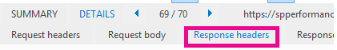

# <a name="navigation-options-for-sharepoint-online"></a><span data-ttu-id="d84cb-104">Opções de navegação para o SharePoint Online</span><span class="sxs-lookup"><span data-stu-id="d84cb-104">Navigation options for SharePoint Online</span></span>

<span data-ttu-id="d84cb-p102">Este artigo descreve os sites de opções de navegação com a publicação do SharePoint habilitado no SharePoint Online. As opções e a configuração da navegação afeta significativamente o desempenho e escalabilidade de sites no SharePoint Online.</span><span class="sxs-lookup"><span data-stu-id="d84cb-p102">This article describes navigation options sites with SharePoint Publishing enabled in SharePoint Online. The choice and configuration of navigation significantly impacts the performance and scalability of sites in SharePoint Online.</span></span>

## <a name="overview"></a><span data-ttu-id="d84cb-107">Visão geral</span><span class="sxs-lookup"><span data-stu-id="d84cb-107">Overview</span></span>

<span data-ttu-id="d84cb-p103">Configuração de provedor de navegação pode afetar significativamente o desempenho para todo o site e cuidadosa consideração deve ser seguida para selecionar um provedor de navegação e a configuração que pode ser dimensionado com eficiência para os requisitos de um site do SharePoint. Existem dois provedores de navegação da caixa, bem como implementações de navegação personalizado.</span><span class="sxs-lookup"><span data-stu-id="d84cb-p103">Navigation provider configuration can significantly impact performance for the entire site, and careful consideration must be taken to pick a navigation provider and configuration that scales effectively for the requirements of a SharePoint site. There are two out-of-the-box navigation providers, as well as custom navigation implementations.</span></span>

<span data-ttu-id="d84cb-p104">A primeira opção, [**navegação gerenciado (metadados)**](#using-managed-navigation-and-metadata-in-sharepoint-online), é recomendável e é uma das opções padrão no SharePoint Online; No entanto, é recomendável que a filtragem de segurança seja desativado, a menos que o necessário. Filtragem de segurança está habilitada como uma configuração de seguro por padrão para esse provedor de navegação; No entanto, muitos sites não exigem a sobrecarga de filtragem de segurança desde que elementos de navegação normalmente são consistentes para todos os usuários do site. Com a configuração recomendada para desabilitar a filtragem de segurança, esse provedor de navegação não exige enumerando a estrutura do site e é altamente escalonável com impacto no desempenho aceitável.</span><span class="sxs-lookup"><span data-stu-id="d84cb-p104">The first option, [**Managed (Metadata) navigation**](#using-managed-navigation-and-metadata-in-sharepoint-online), is recommended, and is one of the default options in SharePoint Online; however, we recommend that security trimming be disabled unless required. Security trimming is enabled as a secure-by-default setting for this navigation provider; however, many sites do not require the overhead of security trimming since navigation elements often are consistent for all users of the site. With the recommended configuration to disable security trimming, this navigation provider does not require enumerating site structure and is highly scalable with acceptable performance impact.</span></span>

<span data-ttu-id="d84cb-p105">A segunda opção, [**navegação estrutural**](#using-structural-navigation-in-sharepoint-online), **não uma opção de navegação recomendada no SharePoint Online**. Esse provedor de navegação foi projetado para uma topologia de local tem suporte limitado no SharePoint Online. Enquanto ele fornece alguns adicional conjunto de recursos em comparação com outras opções de navegação, esses recursos, incluindo a filtragem de segurança e enumeração de estrutura do site, tem um custo de desempenho e escalabilidade impactos e chamadas de cargas excessivas no servidor quando ele é usado. Sites usando navegação structed que consomem recursos excessivos podem estar sujeitos de limitação.</span><span class="sxs-lookup"><span data-stu-id="d84cb-p105">The second option, [**Structural navigation**](#using-structural-navigation-in-sharepoint-online), **is NOT a recommended navigation option in SharePoint Online**. This navigation provider was designed for an on-premises topology has limited support in SharePoint Online. While it provides some additional set of capabilities versus other navigation options, these features, including security trimming and site structure enumeration, comes at a cost of excessive server calls and impacts scalability and performance when it is used. Sites using structed navigation that consume excessive resources may be subject to throttling.</span></span>

<span data-ttu-id="d84cb-p106">Os provedores de navegação de-de-imediata, além de muitos clientes implementou com êxito implementações alternativas de navegação personalizado. Uma classe comum das implementações de navegação personalizado engloba os padrões de design renderizados pelo cliente que armazenam um cache local de nós de navegação. (Consulte **[scripts do lado do cliente orientado por pesquisa](#using-search-driven-client-side-scripting)** neste artigo.)</span><span class="sxs-lookup"><span data-stu-id="d84cb-p106">In addition to the out-of-the-box navigation providers, many customers have successfully implemented alternative custom navigation implementations. One common class of custom navigation implementations embraces client-rendered design patterns that store a local cache of navigation nodes. (See **[Search-driven client-side scripting](#using-search-driven-client-side-scripting)** in this article.)</span></span>

<span data-ttu-id="d84cb-120">Esses provedores de navegação tem algumas das principais vantagens:</span><span class="sxs-lookup"><span data-stu-id="d84cb-120">These navigation providers have a couple of key advantages:</span></span> 
- <span data-ttu-id="d84cb-121">Eles geralmente funcionam bem com designs de página responsivos.</span><span class="sxs-lookup"><span data-stu-id="d84cb-121">They generally work well with responsive page designs.</span></span>
- <span data-ttu-id="d84cb-122">Eles são escaláveis extremamente alto desempenho porque eles podem renderizar sem custo do recurso (e a atualização em segundo plano após um tempo limite).</span><span class="sxs-lookup"><span data-stu-id="d84cb-122">They are extremely scalable and performant because they can render with no resource cost (and refresh in the background after a timeout).</span></span> 
- <span data-ttu-id="d84cb-123">Esses provedores de navegação podem recuperar dados de navegação usando diversas estratégias, que varia de configurações estáticas simples a vários provedores de intercâmbio dinâmico de dados.</span><span class="sxs-lookup"><span data-stu-id="d84cb-123">These navigation providers can retrieve navigation data using various strategies, ranging from simple static configurations to various dynamic data providers.</span></span> 

<span data-ttu-id="d84cb-124">Um exemplo de um provedor de dados é usar uma **navegação orientada por pesquisa**, que permite a flexibilidade para enumerar nós de navegação e lidar com eficiência de filtragem de segurança.</span><span class="sxs-lookup"><span data-stu-id="d84cb-124">An example of a data provider is to use a **Search-driven navigation**, which allows flexibility for enumerating navigation nodes and handling security trimming efficiently.</span></span> 

<span data-ttu-id="d84cb-p107">Existem outras opções populares para criar **provedores de navegação personalizado**. Analise [as soluções de navegação para portais SharePoint Online](https://docs.microsoft.com/sharepoint/dev/solution-guidance/portal-navigation) para obter mais orientações sobre a criação de um provedor de navegação personalizado.</span><span class="sxs-lookup"><span data-stu-id="d84cb-p107">There are other popular options to build **Custom navigation providers**. Please review [Navigation solutions for SharePoint Online portals](https://docs.microsoft.com/sharepoint/dev/solution-guidance/portal-navigation) for further guidance on building a Custom navigation provider.</span></span>
  
## <a name="pros-and-cons-of-sharepoint-online-navigation-options"></a><span data-ttu-id="d84cb-127">Opções de navegação prós e contras do SharePoint Online</span><span class="sxs-lookup"><span data-stu-id="d84cb-127">Pros and Cons of SharePoint Online navigation options</span></span>

<span data-ttu-id="d84cb-128">A tabela a seguir resume as vantagens e desvantagens de cada opção.</span><span class="sxs-lookup"><span data-stu-id="d84cb-128">The following table summarizes the pros and cons of each option.</span></span> 


|<span data-ttu-id="d84cb-129">Navegação gerenciada</span><span class="sxs-lookup"><span data-stu-id="d84cb-129">Managed navigation</span></span>  |<span data-ttu-id="d84cb-130">Navegação estrutural</span><span class="sxs-lookup"><span data-stu-id="d84cb-130">Structural navigation</span></span>  |<span data-ttu-id="d84cb-131">Navegação orientada por pesquisa</span><span class="sxs-lookup"><span data-stu-id="d84cb-131">Search-driven navigation</span></span>  |<span data-ttu-id="d84cb-132">Provedor de navegação personalizada</span><span class="sxs-lookup"><span data-stu-id="d84cb-132">Custom-navigation provider</span></span>  |
|---------|---------|---------|---------|
|<span data-ttu-id="d84cb-133">Vantagens:</span><span class="sxs-lookup"><span data-stu-id="d84cb-133">Pros:</span></span><br/><br/><span data-ttu-id="d84cb-134">Fácil de manter</span><span class="sxs-lookup"><span data-stu-id="d84cb-134">Easy to maintain</span></span><br/><span data-ttu-id="d84cb-135">Opção recomendada</span><span class="sxs-lookup"><span data-stu-id="d84cb-135">Recommended option</span></span><br/>     |<span data-ttu-id="d84cb-136">Vantagens:</span><span class="sxs-lookup"><span data-stu-id="d84cb-136">Pros:</span></span><br/><br/><span data-ttu-id="d84cb-137">Fácil de configurar</span><span class="sxs-lookup"><span data-stu-id="d84cb-137">Easy to configure</span></span><br/><span data-ttu-id="d84cb-138">Filtragem de segurança</span><span class="sxs-lookup"><span data-stu-id="d84cb-138">Security trimmed</span></span><br/><span data-ttu-id="d84cb-139">Atualiza automaticamente conforme o conteúdo é adicionado</span><span class="sxs-lookup"><span data-stu-id="d84cb-139">Automatically updates as content is added</span></span><br/>|<span data-ttu-id="d84cb-140">Prós:</span><span class="sxs-lookup"><span data-stu-id="d84cb-140">Pros:</span></span><br/><br/><span data-ttu-id="d84cb-141">Filtragem de segurança</span><span class="sxs-lookup"><span data-stu-id="d84cb-141">Security trimmed</span></span><br/><span data-ttu-id="d84cb-142">Atualização automática quando os sites são adicionados</span><span class="sxs-lookup"><span data-stu-id="d84cb-142">Automatically updates as sites are added</span></span><br/><span data-ttu-id="d84cb-143">Tempo de carregamento rápido e estrutura de navegação armazenada em cache localmente</span><span class="sxs-lookup"><span data-stu-id="d84cb-143">Fast loading time and locally cached navigation structure</span></span><br/>|<span data-ttu-id="d84cb-144">Prós:</span><span class="sxs-lookup"><span data-stu-id="d84cb-144">Pros:</span></span><br/><br/><span data-ttu-id="d84cb-145">Ampla gama de opções disponíveis</span><span class="sxs-lookup"><span data-stu-id="d84cb-145">Wider choice of options available</span></span><br/><span data-ttu-id="d84cb-146">Carregando Fast quando o cache é usada corretamente</span><span class="sxs-lookup"><span data-stu-id="d84cb-146">Fast loading when caching is used correctly</span></span><br/><span data-ttu-id="d84cb-147">Muitas opções funcionam bem com o design da página responsivos</span><span class="sxs-lookup"><span data-stu-id="d84cb-147">Many options work well with responsive page design</span></span><br/>|
|<span data-ttu-id="d84cb-148">Desvantagens:</span><span class="sxs-lookup"><span data-stu-id="d84cb-148">Cons:</span></span><br/><br/><span data-ttu-id="d84cb-149">Não é atualizado automaticamente para refletir a estrutura do site</span><span class="sxs-lookup"><span data-stu-id="d84cb-149">Not automatically updated to reflect site structure</span></span><br/><span data-ttu-id="d84cb-150">Impacto sobre o desempenho se a filtragem de segurança está habilitada</span><span class="sxs-lookup"><span data-stu-id="d84cb-150">Impacts performance if security trimming is enabled</span></span><br/>|<span data-ttu-id="d84cb-151">Desvantagens:</span><span class="sxs-lookup"><span data-stu-id="d84cb-151">Cons:</span></span><br/><br/><span data-ttu-id="d84cb-152">**Não recomendado**</span><span class="sxs-lookup"><span data-stu-id="d84cb-152">**Not recommended**</span></span><br/><span data-ttu-id="d84cb-153">**Impacto sobre o desempenho e escalabilidade**</span><span class="sxs-lookup"><span data-stu-id="d84cb-153">**Impacts performance and scalability**</span></span><br/><span data-ttu-id="d84cb-154">**Sujeito a limitação**</span><span class="sxs-lookup"><span data-stu-id="d84cb-154">**Subject to throttling**</span></span><br/>|<span data-ttu-id="d84cb-155">Desvantagens:</span><span class="sxs-lookup"><span data-stu-id="d84cb-155">Cons:</span></span><br/><br/><span data-ttu-id="d84cb-156">Não possui capacidade de ordenar facilmente os sites</span><span class="sxs-lookup"><span data-stu-id="d84cb-156">No ability to easily order sites</span></span><br/><span data-ttu-id="d84cb-157">Requer a personalização da página mestra (habilidades técnicas necessárias)</span><span class="sxs-lookup"><span data-stu-id="d84cb-157">Requires customization of the master page (technical skills required)</span></span><br/>|<span data-ttu-id="d84cb-158">Desvantagens:</span><span class="sxs-lookup"><span data-stu-id="d84cb-158">Cons:</span></span><br/><br/><span data-ttu-id="d84cb-159">Desenvolvimento personalizado é necessário</span><span class="sxs-lookup"><span data-stu-id="d84cb-159">Custom development is required</span></span><br/><span data-ttu-id="d84cb-160">Fonte de dados externa / cache armazenados é necessária Azure ex.:</span><span class="sxs-lookup"><span data-stu-id="d84cb-160">External data source / cache stored is needed e.g. Azure</span></span><br/>|

<span data-ttu-id="d84cb-p108">A opção mais adequada ao seu site dependerá em seus requisitos de site e em sua capacidade técnica. Se desejar que um provedor de navegação de-de-imediata escalonável, navegação gerenciada com a filtragem de segurança desabilitada é uma boa opção.</span><span class="sxs-lookup"><span data-stu-id="d84cb-p108">The most appropriate option for your site will depend on your site requirements and on your technical capability. If you want a scalable out-of-the-box navigation provider, then Managed navigation with security trimming disabled is a very good option.</span></span> 

<span data-ttu-id="d84cb-p109">A opção de navegação gerenciado pode ser mantida por meio de configuração, não envolvem arquivos de personalização de código e é consideravelmente menor do que a navegação estrutural. Se você exige a filtragem de segurança e estiver familiarizado com o uso de uma página mestra personalizada e alguns recursos na organização para manter as alterações que podem ocorrer na página mestra padrão para o SharePoint Online, a opção orientado por pesquisa pode produzir um melhor experiência do usuário. Se você tiver requisitos mais complexos, um provedor de navegação personalizado pode ser a melhor opção. Navegação estrutural não é recomendada.</span><span class="sxs-lookup"><span data-stu-id="d84cb-p109">The Managed navigation option can be maintained through configuration, does not involve code customization files, and it is significantly faster than structural navigation. If you require security trimming and are comfortable using a custom master page and have some capability in the organization to maintain the changes that may occur in the default master page for SharePoint Online, then the Search-driven option may produce a better user experience. If you have more complex requirements, then a custom navigation provider may be the right choice. Structural navigation is NOT recommended.</span></span>

<span data-ttu-id="d84cb-p110">Finalmente, é importante observar que o SharePoint está adicionando provedores de navegação adicionais e funcionalidades para modernas arquiteturas de site do SharePoint aproveitamento uma hierarquia de site mais plana e um modelo de hub e spoke com sites de hub do SharePoint. Isso permite que vários cenários que não exigem o uso do recurso de publicação do SharePoint a ser alcançada, e essas configurações de navegação otimizadas para escalabilidade e a latência no SharePoint Online. Observe que geralmente aplicando o mesmo princípio - simplificando a estrutura geral do seu site de publicação do SharePoint para uma estrutura mais simples, ajuda com o desempenho geral e dimensionar também. Isso significa que, em vez de informarem um único conjunto de sites com centenas de sites (subwebs), uma abordagem melhor é terá muitos conjuntos de sites com subsites pouquíssimas (subwebs).</span><span class="sxs-lookup"><span data-stu-id="d84cb-p110">Finally, it’s important to note that SharePoint is adding additional navigation providers and functionality for modern SharePoint site architectures leveraging a more flattened site hierarchy and a hub-and-spoke model with SharePoint hub sites. This allows many scenarios to be achieved that do NOT require the use of SharePoint Publishing feature, and these navigation configurations are optimized for scalability and latency within SharePoint Online. Note that applying the same principle - simplifying the overall structure of your SharePoint Publishing site to a flatter structure, often helps with overall performance and scale as well. What this means is that instead of having a single Site Collection with hundreds of sites (subwebs), a better approach is to have many site collections with very few subsites (subwebs).</span></span>


## <a name="using-managed-navigation-and-metadata-in-sharepoint-online"></a><span data-ttu-id="d84cb-171">Usando navegação gerenciada e metadados no SharePoint Online</span><span class="sxs-lookup"><span data-stu-id="d84cb-171">Using managed navigation and metadata in SharePoint Online</span></span>

<span data-ttu-id="d84cb-p111">Navegação gerenciada é outra opção de-de-imediata que você pode usar para recriar a maioria da mesma funcionalidade da navegação estrutural. Metadados gerenciados podem ser configurado para que a filtragem de segurança habilitados ou desabilitados. Quando configurado com a filtragem de segurança desabilitada, navegação gerenciada é bastante eficiente, conforme ele carrega todos os links de navegação com um número constante de chamadas do servidor. Habilitar a filtragem de segurança, no entanto, dispensa algumas das vantagens da navegação gerenciada e os clientes podem escolher explorar uma das soluções de navegação personalizada para obter o melhor desempenho e escalabilidade.</span><span class="sxs-lookup"><span data-stu-id="d84cb-p111">Managed navigation is another out-of-the-box option that you can use to recreate most of the same functionality as structural navigation. Managed metadata can be configured to have security trimming enabled or disabled. When configured with security trimming disabled, managed navigation is fairly efficient as it loads all the navigation links with a constant number of server calls. Enabling security trimming, however, negates some of the advantages of managed navigation, and customers may choose to explore one of the custom navigation solutions for optimal performance and scalability.</span></span>

<span data-ttu-id="d84cb-p112">Muitos sites não exigem a filtragem de segurança, como a estrutura de navegação normalmente é consistente para todos os usuários do site. Se a filtragem de segurança está desabilitada e um link é adicionado à navegação que nem todos os usuários têm acesso a, o link ainda mostrará mas levará a uma mensagem acesso negado. Não há nenhum risco de acesso inadvertidas ao conteúdo.</span><span class="sxs-lookup"><span data-stu-id="d84cb-p112">Many sites do not require security trimming, as the navigation structure is often consistent for all users of the site. If security trimming is disabled and a link is added to navigation that not all users have access to, the link will still show but will lead to an access denied message. There is no risk of inadvertent access to the content.</span></span>

### <a name="how-to-implement-managed-navigation-and-the-results"></a><span data-ttu-id="d84cb-179">Como implementar a navegação gerenciada e os resultados</span><span class="sxs-lookup"><span data-stu-id="d84cb-179">How to implement managed navigation and the results</span></span>

<span data-ttu-id="d84cb-180">Há vários artigos sobre Docs.Microsoft.com sobre os detalhes da navegação gerenciada, por exemplo, consulte [Visão geral da navegação gerenciada no SharePoint Server](https://docs.microsoft.com/sharepoint/administration/overview-of-managed-navigation).</span><span class="sxs-lookup"><span data-stu-id="d84cb-180">There are several articles on Docs.Microsoft.com about the details of managed navigation, for example, see [Overview of managed navigation in SharePoint Server](https://docs.microsoft.com/sharepoint/administration/overview-of-managed-navigation).</span></span>

<span data-ttu-id="d84cb-p113">Para implementar a navegação gerenciada, você configurar termos com URLs correspondente à estrutura de navegação do site. Navegação gerenciada ainda pode ser curated manualmente para substituir a navegação estrutural em muitos casos. Por exemplo:</span><span class="sxs-lookup"><span data-stu-id="d84cb-p113">In order to implement managed navigation, you set up terms with URLs corresponding to the navigation structure of  the site. Managed navigation can even be manually curated to replace structural navigation in many cases. For example:</span></span>


<span data-ttu-id="d84cb-185">O exemplo a seguir mostra o desempenho da navegação complexa usando a navegação gerenciada.</span><span class="sxs-lookup"><span data-stu-id="d84cb-185">The following example shows the performance of the complex navigation using managed navigation.</span></span>


<span data-ttu-id="d84cb-187">Usar a navegação gerenciada consistentemente melhora o desempenho em comparação com a abordagem de navegação estrutural.</span><span class="sxs-lookup"><span data-stu-id="d84cb-187">Using managed navigation consistently improves performance compared to the structural navigation approach.</span></span>
  
## <a name="using-structural-navigation-in-sharepoint-online"></a><span data-ttu-id="d84cb-188">Usando a navegação estrutural no SharePoint Online</span><span class="sxs-lookup"><span data-stu-id="d84cb-188">Using structural navigation in SharePoint Online</span></span>

<span data-ttu-id="d84cb-p114">Esta é a navegação da caixa usada por padrão e é a solução mais simples, mas como tal, tem uma compensação de desempenho caro. Ele não requer qualquer personalização e um usuário não técnico também facilmente pode adicionar itens, ocultar itens e gerenciar o painel de navegação da página Configurações. Isso é Entretanto também true para a navegação gerenciada então, é recomendável usar a navegação gerenciada como que pode também ser facilmente gerenciado e controlado também com melhor desempenho.</span><span class="sxs-lookup"><span data-stu-id="d84cb-p114">This is the out-of-the-box navigation used by default and is the most straightforward solution but as such has an expensive performance trade-off. It does not require any customization and a non-technical user can also easily add items, hide items, and manage the navigation from the settings page. This is however also true for Managed Navigation so it is recommended to use Managed Navigation as that can also be easily managed and controlled as well with improved performance.</span></span>


  
### <a name="turning-on-structural-navigation-in-sharepoint-online"></a><span data-ttu-id="d84cb-193">Ativando a navegação estrutural no SharePoint Online</span><span class="sxs-lookup"><span data-stu-id="d84cb-193">Turning on structural navigation in SharePoint Online</span></span>

<span data-ttu-id="d84cb-p115">Para ilustrar como o desempenho em uma solução do SharePoint Online standard com navegação estrutural e show subsites opção ativada. A seguir é uma captura de tela das configurações encontradas na página **Configurações do Site** \> **navegação**.</span><span class="sxs-lookup"><span data-stu-id="d84cb-p115">To illustrate how the performance in a standard SharePoint Online solution with structural navigation and the show subsites option turned on. Below is a screenshot of settings found on the page **Site Settings** \> **Navigation**.</span></span>
  

  
### <a name="analyzing-structural-navigation-performance-in-sharepoint-online"></a><span data-ttu-id="d84cb-197">Analisando o desempenho da navegação estrutural no SharePoint Online</span><span class="sxs-lookup"><span data-stu-id="d84cb-197">Analyzing structural navigation performance in SharePoint Online</span></span>

<span data-ttu-id="d84cb-198">Para analisar o desempenho de uma página do SharePoint, use a guia de **rede** das ferramentas de desenvolvedor do F12 no Internet Explorer.</span><span class="sxs-lookup"><span data-stu-id="d84cb-198">To analyze the performance of a SharePoint page, use the **Network** tab of the F12 developer tools in Internet Explorer.</span></span> 
  

  
1. <span data-ttu-id="d84cb-200">Na guia **Rede**, clique na página .aspx que está sendo carregada e, em seguida, clique na guia **Detalhes**.</span><span class="sxs-lookup"><span data-stu-id="d84cb-200">On the **Network** tab, click on the .aspx page that is being loaded and then click on the **Details** tab.</span></span><br/> <span data-ttu-id="d84cb-201"></span><span class="sxs-lookup"><span data-stu-id="d84cb-201"></span></span><br/>
2. <span data-ttu-id="d84cb-202">Clique em **Cabeçalhos de resposta**.</span><span class="sxs-lookup"><span data-stu-id="d84cb-202">Click **Response headers**.</span></span> <br/><span data-ttu-id="d84cb-203"></span><span class="sxs-lookup"><span data-stu-id="d84cb-203"></span></span><br/><span data-ttu-id="d84cb-204">SharePoint retorna algumas informações de diagnósticos úteis em seus cabeçalhos de resposta.</span><span class="sxs-lookup"><span data-stu-id="d84cb-204">SharePoint returns some useful diagnostic information in its response headers.</span></span> 
3. <span data-ttu-id="d84cb-p116">Uma das partes de informações mais útil é **SPRequestDuration** , que é o valor, em milissegundos, dos quanto tempo levou de uma solicitação para ser processada no servidor. **Mostrar subsites** é desmarcada para navegação estrutural na seguinte imagem. Isso significa que há somente o link de conjunto de sites, no painel de navegação global:</span><span class="sxs-lookup"><span data-stu-id="d84cb-p116">One of the most useful pieces of information is **SPRequestDuration** which is the value, in milliseconds, of how long a request took to process on the server. In the following screenshot **show subsites** is unchecked for the structural navigation. This means that there is only the site collection link in the global navigation:</span></span><br/><span data-ttu-id="d84cb-208"></span><span class="sxs-lookup"><span data-stu-id="d84cb-208"></span></span><br/>
4. <span data-ttu-id="d84cb-p117">A chave **SPRequestDuration** tem um valor de 245 milissegundos. Isso representa o tempo necessário para retornar a solicitação. Como há somente um item de navegação no site, este é um parâmetro de comparação bom para como o SharePoint Online executa sem navegação pesada. A próxima captura de tela mostra como a adição de subsites afeta essa chave.</span><span class="sxs-lookup"><span data-stu-id="d84cb-p117">The **SPRequestDuration** key has a value of 245 milliseconds. This represents the time it took to return the request. Since there is only one navigation item on the site, this is a good benchmark for how SharePoint Online performs without heavy navigation. The next screen shot shows how adding in the subsites affects this key.</span></span><br/><span data-ttu-id="d84cb-213"></span><span class="sxs-lookup"><span data-stu-id="d84cb-213"></span></span><br/>
  
<span data-ttu-id="d84cb-p118">Adicionar os subsites aumentou significativamente o tempo que leva para retornar a solicitação de página para este site de amostra relativamente simples. Hierarquias de sites complexos, incluindo páginas na navegação e outras configuração e as opções de topologia drasticamente podem aumentar ainda mais esse impacto.</span><span class="sxs-lookup"><span data-stu-id="d84cb-p118">Adding the subsites has significantly increased the time it takes to return the page request for this relatively simple sample site. Complex site hierarchies, including pages in navigation, and other configuration and topology options can dramatically increase this impact even further.</span></span>

## <a name="using-search-driven-client-side-scripting"></a><span data-ttu-id="d84cb-216">Usando o script do lado do cliente orientado por pesquisa</span><span class="sxs-lookup"><span data-stu-id="d84cb-216">Using Search-driven client-side scripting</span></span>

<span data-ttu-id="d84cb-p119">Usando a pesquisa, você pode aproveitar os índices que são criados no plano de fundo usando o rastreamento contínuo. Os resultados da pesquisa são extraídos do índice de pesquisa e os resultados são aparada de segurança. Isso é geralmente menor do que os provedores de navegação da caixa quando a filtragem de segurança é necessária. Usando a pesquisa para a navegação estrutural, especialmente se você tiver uma estrutura de site complexa, agilizará consideravelmente o tempo de carregamento de página. A principal vantagem disso sobre navegação gerenciada é que você se beneficia de filtragem de segurança.</span><span class="sxs-lookup"><span data-stu-id="d84cb-p119">Using search you can leverage the indexes that are built up in the background using continuous crawl. The search results are pulled from the search index and the results are security-trimmed. This is generally faster than out-of-the-box navigation providers when security trimming is required. Using search for structural navigation, especially if you have a complex site structure, will speed up page loading time considerably. The main advantage of this over managed navigation is that you benefit from security trimming.</span></span>

<span data-ttu-id="d84cb-p120">Essa abordagem envolve a criação de uma página mestra personalizada e substituindo o código de navegação da caixa com HTML personalizadas. Siga este procedimento descrito no exemplo a seguir para substituir o código de navegação no arquivo `seattle.html`. Neste exemplo, você abrirá o `seattle.html` de arquivo e substitua o elemento todo `id=”DeltaTopNavigation”` com código personalizado de HTML.</span><span class="sxs-lookup"><span data-stu-id="d84cb-p120">This approach involves creating a custom master page and replacing the out-of-the-box navigation code with custom HTML. Follow this procedure outlined in the following example to replace the navigation code in the file `seattle.html`. In this example, you will open the `seattle.html` file and replace the whole element `id=”DeltaTopNavigation”` with custom HTML code.</span></span>

### <a name="example-replace-the-out-of-the-box-navigation-code-in-a-master-page"></a><span data-ttu-id="d84cb-225">Exemplo: Substitua o código de navegação da caixa em uma página mestra</span><span class="sxs-lookup"><span data-stu-id="d84cb-225">Example: Replace the out-of-the-box navigation code in a master page</span></span>

1.  <span data-ttu-id="d84cb-226">Navegue até a página Configurações do Site.</span><span class="sxs-lookup"><span data-stu-id="d84cb-226">Navigate to the Site Settings page.</span></span>
2.  <span data-ttu-id="d84cb-227">Abra a galeria de páginas mestras clicando em **Páginas Mestras**.</span><span class="sxs-lookup"><span data-stu-id="d84cb-227">Open the master page gallery by clicking **Master Pages**.</span></span>
3.  <span data-ttu-id="d84cb-228">A partir daqui, você pode navegar por meio da biblioteca e baixe o arquivo `seattle.master`.</span><span class="sxs-lookup"><span data-stu-id="d84cb-228">From here you can navigate through the library and download the file `seattle.master`.</span></span>
4.  <span data-ttu-id="d84cb-229">Edite o código usando um editor de texto e exclua o bloco de código na captura de tela a seguir.</span><span class="sxs-lookup"><span data-stu-id="d84cb-229">Edit the code using a text editor and delete the code block in the following screen shot.</span></span><br/><br/>
5. <span data-ttu-id="d84cb-231">Remover o código entre o `<SharePoint:AjaxDelta id=”DeltaTopNavigation”>` e `<\SharePoint:AjaxDelta>` tags e substituí-lo com o trecho a seguir:</span><span class="sxs-lookup"><span data-stu-id="d84cb-231">Remove the code between the `<SharePoint:AjaxDelta id=”DeltaTopNavigation”>` and `<\SharePoint:AjaxDelta>` tags and replace it with the following snippet:</span></span><br/>

```
<div id="loading">
  <!--Replace with path to loading image.-->
  <div style="background-image: url(''); height: 22px; width: 22px; ">
  </div>
</div>
<!-- Main Content-->
<div id="navContainer" style="display:none">
    <div data-bind="foreach: hierarchy" class="noindex ms-core-listMenu-horizontalBox">
        <a class="dynamic menu-item ms-core-listMenu-item ms-displayInline ms-navedit-linkNode" data-bind="attr: { href: item.Url, title: item.Title }">
            <span class="menu-item-text" data-bind="text: item.Title">
            </span>
        </a>
        <ul id="menu" data-bind="foreach: $data.children" style="padding-left:20px">
            <li class="static dynamic-children level1">
                <a class="static dynamic-children menu-item ms-core-listMenu-item ms-displayInline ms-navedit-linkNode" data-bind="attr: { href: item.Url, title: item.Title }">
               
                 <!-- ko if: children.length > 0-->
                    <span aria-haspopup="true" class="additional-background ms-navedit-flyoutArrow dynamic-children">
                        <span class="menu-item-text" data-bind="text: item.Title">
                        </span>
                    </span>
                <!-- /ko -->
                <!-- ko if: children.length == 0-->   
                    <span aria-haspopup="true" class="ms-navedit-flyoutArrow dynamic-children">
                        <span class="menu-item-text" data-bind="text: item.Title">
                        </span>
                    </span>
                <!-- /ko -->   
                </a>
               
                <!-- ko if: children.length > 0-->                                                       
                <ul id="menu"  data-bind="foreach: children;" class="dynamic  level2" >
                    <li class="dynamic level2">
                        <a class="dynamic menu-item ms-core-listMenu-item ms-displayInline  ms-navedit-linkNode" data-bind="attr: { href: item.Url, title: item.Title }">
         
          <!-- ko if: children.length > 0-->
          <span aria-haspopup="true" class="additional-background ms-navedit-flyoutArrow dynamic-children">
           <span class="menu-item-text" data-bind="text: item.Title">
           </span>
          </span>
           <!-- /ko -->
          <!-- ko if: children.length == 0-->
          <span aria-haspopup="true" class="ms-navedit-flyoutArrow dynamic-children">
           <span class="menu-item-text" data-bind="text: item.Title">
           </span>
          </span>                 
          <!-- /ko -->   
                        </a>
          <!-- ko if: children.length > 0-->
         <ul id="menu" data-bind="foreach: children;" class="dynamic level3" >
          <li class="dynamic level3">
           <a class="dynamic menu-item ms-core-listMenu-item ms-displayInline ms-navedit-linkNode" data-bind="attr: { href: item.Url, title: item.Title }">
            <span class="menu-item-text" data-bind="text: item.Title">
            </span>
           </a>
          </li>
         </ul>
           <!-- /ko -->
                    </li>
                </ul>
                <!-- /ko -->
            </li>
        </ul>
    </div>
</div>
```
<br/>
6. <span data-ttu-id="d84cb-p121">Substituir a URL no carregamento da imagem marca âncora no início, com um link para uma imagem de carregamento em seu conjunto de sites. Depois de fazer as alterações, renomeie o arquivo e, em seguida, carregue-o para a Galeria de páginas mestras. Isso gerará um novo arquivo. master.</span><span class="sxs-lookup"><span data-stu-id="d84cb-p121">Replace the URL in the loading image anchor tag at the beginning, with a link to a loading image in your site collection. After you have made the changes, rename the file and then upload it to the master page gallery. This generates a new .master file.</span></span><br/>
7. <span data-ttu-id="d84cb-p122">Este HTML é a marcação básica que será preenchida pelos resultados de pesquisa retornados pelo código JavaScript. Você precisará editar o código para alterar o valor para a raiz de var = "URL do conjunto de sites" conforme demonstrado no seguinte trecho:</span><span class="sxs-lookup"><span data-stu-id="d84cb-p122">This HTML is the basic markup that will be populated by the search results returned from JavaScript code. You will need to edit the code to change the value for var root = “site collection URL” as demonstrated in the following snippet:</span></span><br/>

```
var root = “https://spperformance.sharepoint.com/sites/NavigationBySearch”;
```
<br/>
8. <span data-ttu-id="d84cb-p123">Os resultados são atribuídos à matriz self.nodes e uma hierarquia é compilada sem os objetos usando linq.js atribuindo a saída para um self.heirarchy de matriz. Esta matriz é o objeto que é vinculado ao HTML. Isso é feito na função toggleView() passando o objeto self para a função ko.applyBinding().</span><span class="sxs-lookup"><span data-stu-id="d84cb-p123">The results are assigned to the self.nodes array and a hierarchy is built out of the objects using linq.js assigning the output to an array self.heirarchy. This array is the object that is bound to the HTML. This is done in the toggleView() function by passing the self object to the ko.applyBinding() function.</span></span><br/><span data-ttu-id="d84cb-240">Em seguida, isso faz a matriz de hierarquia deve ser vinculado a seguinte HTML:</span><span class="sxs-lookup"><span data-stu-id="d84cb-240">This then causes the hierarchy array to be bound to the following HTML:</span></span><br/>

```
<div data-bind=”foreach: hierarchy” class=”noindex ms-core-listMenu-horizontalBox”>
```

<span data-ttu-id="d84cb-241">Os manipuladores de eventos para `mouseenter` e `mouseexit` são adicionados para a navegação de nível superior para lidar com os menus de lista suspensa de subsite que é feita no `addEventsToElements()` função.</span><span class="sxs-lookup"><span data-stu-id="d84cb-241">The event handlers for `mouseenter` and `mouseexit` are added to the top-level navigation to handle the subsite drop-down menus which is done in the `addEventsToElements()` function.</span></span>

<span data-ttu-id="d84cb-242">No nosso exemplo complexas de navegação, uma página nova carga sem mostra o cache local o tempo gasto no servidor foi reduzido para baixo de navegação estrutural parâmetro de comparação para obter um resultado semelhante como a abordagem da navegação gerenciada.</span><span class="sxs-lookup"><span data-stu-id="d84cb-242">In our complex navigation example, a fresh page load without the local caching shows the time spent on the server has been cut down from the benchmark structural navigation to get a similar result as the managed navigation approach.</span></span>

### <a name="about-the-javascript-file"></a><span data-ttu-id="d84cb-243">Sobre o arquivo JavaScript …</span><span class="sxs-lookup"><span data-stu-id="d84cb-243">About the JavaScript file...</span></span>

<span data-ttu-id="d84cb-244">O arquivo JavaScript inteiro é o seguinte:</span><span class="sxs-lookup"><span data-stu-id="d84cb-244">The entire JavaScript file is as follows:</span></span>

```
//Models and Namespaces
var SPOCustom = SPOCustom || {};
SPOCustom.Models = SPOCustom.Models || {}
SPOCustom.Models.NavigationNode = function () {

    this.Url = ko.observable("");
    this.Title = ko.observable("");
    this.Parent = ko.observable("");

};

var root = "https://spperformance.sharepoint.com/sites/NavigationBySearch";
var baseUrl = root + "/_api/search/query?querytext=";
var query = baseUrl + "'contentClass=\"STS_Web\"+path:" + root + "'&trimduplicates=false&rowlimit=300";

var baseRequest = {
    url: "",
    type: ""
};


//Parses a local object from JSON search result.
function getNavigationFromDto(dto) {
    var item = new SPOCustom.Models.NavigationNode();
    if (dto != undefined) {

        var webTemplate = getSearchResultsValue(dto.Cells.results, 'WebTemplate');

        if (webTemplate != "APP") {
            item.Title(getSearchResultsValue(dto.Cells.results, 'Title')); //Key = Title
            item.Url(getSearchResultsValue(dto.Cells.results, 'Path')); //Key = Path
            item.Parent(getSearchResultsValue(dto.Cells.results, 'ParentLink')); //Key = ParentLink
        }

    }
    return item;
}

function getSearchResultsValue(results, key) {

    for (i = 0; i < results.length; i++) {
        if (results[i].Key == key) {
            return results[i].Value;
        }
    }
    return null;
}

//Parse a local object from the serialized cache.
function getNavigationFromCache(dto) {
    var item = new SPOCustom.Models.NavigationNode();

    if (dto != undefined) {

        item.Title(dto.Title);
        item.Url(dto.Url);
        item.Parent(dto.Parent);
    }

    return item;
}

/* create a new OData request for JSON response */
function getRequest(endpoint) {
    var request = baseRequest;
    request.type = "GET";
    request.url = endpoint;
    request.headers = { ACCEPT: "application/json;odata=verbose" };
    return request;
};

/* Navigation Module*/
function NavigationViewModel() {
    "use strict";
    var self = this;
    self.nodes = ko.observableArray([]);
    self.hierarchy = ko.observableArray([]);;
    self.loadNavigatioNodes = function () {
        //Check local storage for cached navigation datasource.
        var fromStorage = localStorage["nodesCache"];
        if (false) {
            var cachedNodes = JSON.parse(localStorage["nodesCache"]);

            if (cachedNodes && timeStamp) {
                //Check for cache expiration. Currently set to 3 hrs.
                var now = new Date();
                var diff = now.getTime() - timeStamp;
                if (Math.round(diff / (1000 * 60 * 60)) < 3) {

                    //return from cache.
                    var cacheResults = [];
                    $.each(cachedNodes, function (i, item) {
                        var nodeitem = getNavigationFromCache(item, true);
                        cacheResults.push(nodeitem);
                    });

                    self.buildHierarchy(cacheResults);
                    self.toggleView();
                    addEventsToElements();
                    return;
                }
            }
        }
        //No cache hit, REST call required.
        self.queryRemoteInterface();
    };

    //Executes a REST call and builds the navigation hierarchy.
    self.queryRemoteInterface = function () {
        var oDataRequest = getRequest(query);
        $.ajax(oDataRequest).done(function (data) {
            var results = [];
            $.each(data.d.query.PrimaryQueryResult.RelevantResults.Table.Rows.results, function (i, item) {

                if (i == 0) {
                    //Add root element.
                    var rootItem = new SPOCustom.Models.NavigationNode();
                    rootItem.Title("Root");
                    rootItem.Url(root);
                    rootItem.Parent(null);
                    results.push(rootItem);
                }
                var navItem = getNavigationFromDto(item);
                results.push(navItem);
            });
            //Add to local cache
            localStorage["nodesCache"] = ko.toJSON(results);

            localStorage["nodesCachedAt"] = new Date().getTime();
            self.nodes(results);
            if (self.nodes().length > 0) {
                var unsortedArray = self.nodes();
                var sortedArray = unsortedArray.sort(self.sortObjectsInArray);

                self.buildHierarchy(sortedArray);
                self.toggleView();
                addEventsToElements();
            }
        }).fail(function () {
            //Handle error here!!
            $("#loading").hide();
            $("#error").show();
        });
    };
    self.toggleView = function () {
        var navContainer = document.getElementById("navContainer");
        ko.applyBindings(self, navContainer);
        $("#loading").hide();
        $("#navContainer").show();

    };
    //Uses linq.js to build the navigation tree.
    self.buildHierarchy = function (enumerable) {
        self.hierarchy(Enumerable.From(enumerable).ByHierarchy(function (d) {
            return d.Parent() == null;
        }, function (parent, child) {
            if (parent.Url() == null || child.Parent() == null)
                return false;
            return parent.Url().toUpperCase() == child.Parent().toUpperCase();
        }).ToArray());

        self.sortChildren(self.hierarchy()[0]);
    };


    self.sortChildren = function (parent) {

        // sjip processing if no children
        if (!parent || !parent.children || parent.children.length === 0) {
            return;
        }

        parent.children = parent.children.sort(self.sortObjectsInArray2);

        for (var i = 0; i < parent.children.length; i++) {
            var elem = parent.children[i];

            if (elem.children && elem.children.length > 0) {
                self.sortChildren(elem);
            }
        }
    };

    // ByHierarchy method breaks the sorting in chrome and firefix 
    // we need to resort  as ascending
    self.sortObjectsInArray2 = function (a, b) {
        if (a.item.Title() > b.item.Title())
            return 1;
        if (a.item.Title() < b.item.Title())
            return -1;
        return 0;
    };


    self.sortObjectsInArray = function (a, b) {
        if (a.Title() > b.Title())
            return -1;
        if (a.Title() < b.Title())
            return 1;
        return 0;
    }
}

//Loads the navigation on load and binds the event handlers for mouse interaction.
function InitCustomNav() {
    var viewModel = new NavigationViewModel();
    viewModel.loadNavigatioNodes();
}

function addEventsToElements() {
    //events.
      $("li.level1").mouseover(function () {
          var position = $(this).position();
          $(this).find("ul.level2").css({ width: 100, left: position.left + 10, top: 50 });
      })
   .mouseout(function () {
     $(this).find("ul.level2").css({  left: -99999, top: 0 });
   
    });
   
     $("li.level2").mouseover(function () {
          var position = $(this).position();
          console.log(JSON.stringify(position));
          $(this).find("ul.level3").css({ width: 100, left: position.left + 95, top:  position.top});
      })
   .mouseout(function () {
     $(this).find("ul.level3").css({  left: -99999, top: 0 });
    });
} _spBodyOnLoadFunctionNames.push("InitCustomNav");

``` 

<span data-ttu-id="d84cb-p124">Para resumir o código mostrado acima no `jQuery $(document).ready` função existe um `viewModel object` criado e depois o `loadNavigationNodes()` função em tal objeto é chamada. Essa função ou carrega a hierarquia de navegação previamente compilado armazenada no armazenamento local HTML5 do navegador do cliente ou ele chama a função `queryRemoteInterface()`.</span><span class="sxs-lookup"><span data-stu-id="d84cb-p124">To summarize the code shown above in the `jQuery $(document).ready` function there is a `viewModel object` created and then the `loadNavigationNodes()` function on that object is called. This function either loads the previously built navigation hierarchy stored in the HTML5 local storage of the client browser or it calls the function `queryRemoteInterface()`.</span></span>

<span data-ttu-id="d84cb-p125">`QueryRemoteInterface()`cria uma solicitação usando o `getRequest()` função com o parâmetro de consulta definidos anteriormente no script e, em seguida, retorna dados do servidor. Esses dados são essencialmente uma matriz de todos os sites no conjunto de sites, representado como objetos de transferência de dados com várias propriedades.</span><span class="sxs-lookup"><span data-stu-id="d84cb-p125">`QueryRemoteInterface()` builds a request using the `getRequest()` function with the query parameter defined earlier in the script and then returns data from the server. This data is essentially an array of all the sites in the site collection represented as data transfer objects with various properties.</span></span> 

<span data-ttu-id="d84cb-249">Esses dados são analisados, em seguida, em previamente definido `SPO.Models.NavigationNode` objetos que utilizam `Knockout.js` para criar propriedades observáveis para uso por dados, os valores de vinculação para o HTML que podemos definidos anteriormente.</span><span class="sxs-lookup"><span data-stu-id="d84cb-249">This data is then parsed into the previously defined `SPO.Models.NavigationNode` objects which use `Knockout.js` to create observable properties for use by data binding the values into the HTML that we defined earlier.</span></span> 

<span data-ttu-id="d84cb-p126">Os objetos são colocados em uma matriz de resultados. Essa matriz é analisada em JSON usando vazado e armazenado no armazenamento local do navegador para melhorar o desempenho no futuro página for carregada.</span><span class="sxs-lookup"><span data-stu-id="d84cb-p126">The objects are then put into a results array. This array is parsed into JSON using Knockout and stored in the local browser storage for improved performance on future page loads.</span></span>

### <a name="benefits-of-this-approach"></a><span data-ttu-id="d84cb-252">Benefícios dessa abordagem</span><span class="sxs-lookup"><span data-stu-id="d84cb-252">Benefits of this approach</span></span>

<span data-ttu-id="d84cb-p127">Uma grande vantagem [dessa](#example-replace-the-out-of-the-box-navigation-code-in-a-master-page) abordagem é que usando-se HTML5 de armazenamento local, painel de navegação é armazenado localmente para o usuário na próxima vez em que eles carregam a página. Recebemos melhorias de desempenho principais que usa a API de pesquisa para a navegação estrutural; No entanto, levará alguns recursos técnicos para executar e personalizar essa funcionalidade.</span><span class="sxs-lookup"><span data-stu-id="d84cb-p127">One major benefit of [this approach](#example-replace-the-out-of-the-box-navigation-code-in-a-master-page) is that by using HTML5 local storage, the navigation is stored locally for the user the next time they load the page. We get major performance improvements from using the search API for structural navigation; however, it takes some technical capability to execute and customize this functionality.</span></span> 

<span data-ttu-id="d84cb-p128">Na [implementação de exemplo](#example-replace-the-out-of-the-box-navigation-code-in-a-master-page), os sites são ordenados da mesma maneira como a navegação estrutural-de-imediata; ordem alfabética. Se você quisesse desviar nesta ordem, seria mais complicado para desenvolver e manter. Além disso, essa abordagem exige que você desviar das páginas mestras com suporte. Se a página mestra não é mantida, seu site será perder abrindo diante atualizações e aperfeiçoamentos que a Microsoft faz as páginas mestras.</span><span class="sxs-lookup"><span data-stu-id="d84cb-p128">In the [example implementation](#example-replace-the-out-of-the-box-navigation-code-in-a-master-page), the sites are ordered in the same way as the out-of-the-box structural navigation; alphabetical order. If you wanted to deviate from this order, it would be more complicated to develop and maintain. Also, this approach requires you to deviate from the supported master pages. If the custom master page is not maintained, your site will miss out on updates and improvements that Microsoft makes to the master pages.</span></span>

<span data-ttu-id="d84cb-259">O [acima código](#about-the-javascript-file) tem as seguintes dependências:</span><span class="sxs-lookup"><span data-stu-id="d84cb-259">The [above code](#about-the-javascript-file) has the following dependencies:</span></span>

- <span data-ttu-id="d84cb-260">jQuery-http://jquery.com/</span><span class="sxs-lookup"><span data-stu-id="d84cb-260">jQuery - http://jquery.com/</span></span>
- <span data-ttu-id="d84cb-261">KnockoutJS-http://knockoutjs.com/</span><span class="sxs-lookup"><span data-stu-id="d84cb-261">KnockoutJS - http://knockoutjs.com/</span></span>
- <span data-ttu-id="d84cb-262">LINQ.js - http://linqjs.codeplex.com/, ou github.com/neuecc/linq.js</span><span class="sxs-lookup"><span data-stu-id="d84cb-262">Linq.js - http://linqjs.codeplex.com/, or github.com/neuecc/linq.js</span></span>

<span data-ttu-id="d84cb-p129">A versão atual do LinqJS não contém o método ByHierarchy usado no código acima e interromperá o código de navegação. Para corrigir esse problema, adicione o seguinte método ao arquivo Linq.js antes da linha `Flatten: function ()`.</span><span class="sxs-lookup"><span data-stu-id="d84cb-p129">The current version of LinqJS does not contain the ByHierarchy method used in the above code and will break the navigation code. To fix this, add the following method to the Linq.js file before the line `Flatten: function ()`.</span></span>

```
ByHierarchy: function(firstLevel, connectBy, orderBy, ascending, parent) {
     ascending = ascending == undefined ? true : ascending;
     var orderMethod = ascending == true ? 'OrderBy' : 'OrderByDescending';
     var source = this;
     firstLevel = Utils.CreateLambda(firstLevel);
     connectBy = Utils.CreateLambda(connectBy);
     orderBy = Utils.CreateLambda(orderBy);
    
     //Initiate or increase level
     var level = parent === undefined ? 1 : parent.level + 1;

    return new Enumerable(function() {
         var enumerator;
         var index = 0;

        var createLevel = function() {
                 var obj = {
                     item: enumerator.Current(),
                     level : level
                 };
                 obj.children = Enumerable.From(source).ByHierarchy(firstLevel, connectBy, orderBy, ascending, obj);
                 if (orderBy !== undefined) {
                     obj.children = obj.children[orderMethod](function(d) {
                         return orderBy(d.item); //unwrap the actual item for sort to work
                     });
                 }
                 obj.children = obj.children.ToArray();
                 Enumerable.From(obj.children).ForEach(function(child) {
                     child.getParent = function() {
                         return obj;
                     };
                 });
                 return obj;
             };

        return new IEnumerator(

        function() {
             enumerator = source.GetEnumerator();
         }, function() {
             while (enumerator.MoveNext()) {
                 var returnArr;
                 if (!parent) {
                     if (firstLevel(enumerator.Current(), index++)) {
                         return this.Yield(createLevel());
                     }

                } else {
                     if (connectBy(parent.item, enumerator.Current(), index++)) {
                         return this.Yield(createLevel());
                     }
                 }
             }
             return false;
         }, function() {
             Utils.Dispose(enumerator);
         })
     });
 },

```
  
## <a name="related-topics"></a><span data-ttu-id="d84cb-265">Tópicos relacionados</span><span class="sxs-lookup"><span data-stu-id="d84cb-265">Related topics</span></span>

[<span data-ttu-id="d84cb-266">Visão geral da navegação gerenciada no SharePoint Server</span><span class="sxs-lookup"><span data-stu-id="d84cb-266">Overview of managed navigation in SharePoint Server</span></span>](https://docs.microsoft.com/sharepoint/administration/overview-of-managed-navigation)

