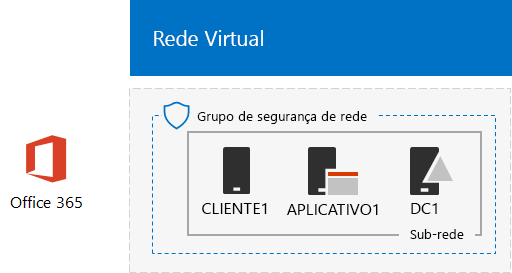

# <a name="office-365-devtest-environment"></a>Ambiente de desenvolvimento/teste do Office 365

 **Resumo:** Use este guia de laboratório de teste para criar uma assinatura de avaliação do Office 365 para avaliação ou desenvolvimento/ teste.
  
Você pode usar uma assinatura de avaliação do Office 365 e criar um ambiente de desenvolvimento/teste do Office 365 para aplicativos ou para demonstrar recursos do Office 365. Há duas versões:
  
- O leve ambiente de desenvolvimento/teste do Office 365 consiste em uma assinatura de avaliação do Office 365 que você acessa do seu computador principal.
    
    Use esse ambiente para demonstrar um recurso rapidamente. Para o ambiente de desenvolvimento/teste do Office 365 leve, conclua apenas as fases 2 e 3 deste artigo.
    
- O ambiente corporativo simulado de desenvolvimento/teste do Office 365 consiste em uma assinatura de avaliação do Office 365 e uma intranet da organização simplificada conectada à Internet, que está hospedada em serviços de infraestrutura do Microsoft Azure. Você pode criar esta configuração totalmente na nuvem da Microsoft.
    
    Use esse ambiente para demonstrar um recurso ou um aplicativo em um ambiente que se assemelha a uma rede de organização típica conectada à Internet ou para recursos que exigem esse tipo de ambiente. Para o ambiente de desenvolvimento/teste corporativo simulado do Office 365, conclua as etapas de 1, 2 e 3 deste artigo.
    
> [!NOTE]
> Talvez você queira imprimir este artigo para deixar guardado os valores específicos que serão necessários para esse ambiente durante os 30 dias da assinatura de avaliação do Office 365. Você pode estender a assinatura de avaliação para mais 30 dias, sem complicação. Para um ambiente de desenvolvimento/teste permanente, crie uma nova assinatura paga com um pequeno número de licenças. 
  

  
> [!TIP]
> Clique [aqui](http://aka.ms/catlgstack) para ver um mapa visual para todos os artigos da pilha do Guia do Laboratório de Teste do One Microsoft Cloud.
  
## <a name="phase-1-create-the-base-configuration-in-azure"></a>Fase 1: Criar a configuração padrão no Azure

Siga as instruções em [Ambiente de desenvolvimento/teste de configuração de base](base-configuration-dev-test-environment.md).
  
Você precisará de uma assinatura do Azure. Você pode usar a [avaliação gratuita do Azure](https://azure.microsoft.com/pricing/free-trial/) para essa configuração. Se você tiver uma assinatura do MSDN ou Visual Studio, consulte o [Crédito mensal do Azure para assinantes do Visual Studio](https://azure.microsoft.com/pricing/member-offers/msdn-benefits-details/).
  
Esta é a configuração resultante.
  


  
Essa configuração consiste nas máquinas virtuais DC1, APP1 e CLIENT1 na sub-rede de uma rede virtual do Azure.
  
## <a name="phase-2-create-an-office-365-trial-subscription"></a>Fase 2: Criar uma assinatura de avaliação do Office 365

Para começar a usar a sua assinatura de avaliação do Office 365 E5, primeiro é necessário um nome de empresa fictícia e uma nova conta da Microsoft.
  
1. Recomendamos que você use uma variante do nome de empresa Contoso para o nome da sua empresa, que é uma empresa fictícia usada no conteúdo de exemplo da Microsoft, mas não é necessário. Registre o seu nome de empresa fictícia aqui: 
    
2. Para se inscrever em uma nova conta da Microsoft, acesse [https://outlook.com](https://outlook.com) e crie uma conta com um novo endereço e conta de email. Você usará essa conta para se inscrever no Office 365.
    
  - Armazene o nome e sobrenome da sua nova conta aqui: 
    
  - Armazene o novo endereço de conta de email aqui: @outlook.com
    
### <a name="sign-up-for-an-office-365-e5-trial-subscription"></a>Inscrever-se em uma assinatura de avaliação do Office 365 E5

1. Para o ambiente de desenvolvimento/teste leve do Office 365, abra o navegador da Internet em seu computador e acesse [https://aka.ms/e5trial](https://aka.ms/e5trial). 
    
    Para o ambiente de desenvolvimento/teste corporativo simulado do Office 365, conecte-se a CLIENT1 com a conta CORP\Usuário1 do portal do Azure.

    Na tela Inicial, execute o Microsoft Edge e acesse [https://aka.ms/e5trial](https://aka.ms/e5trial).
    
2. Na página **Bem-vindo, fale mais sobre você**, especifique:
    
  - Sua localização física
    
  - Nome e sobrenome da sua nova conta da Microsoft
    
  - Seu novo endereço de conta de email
    
  - Um número de telefone comercial
    
  - Nome da sua empresa fictícia
    
  - Um tamanho de organização de 250-999
    
3. Clique em **Apenas mais uma etapa**.
    
4. Na página **Crie a sua ID de usuário**, digite um nome de usuário com base em seu novo endereço de email, sua empresa fictícia após o sinal de @ (remova todos os espaços no nome) e depois uma senha (duas vezes) para essa nova conta do Office 365.
    
    Armazene a senha que você digitou em um local seguro.
    
    Armazene o nome da sua empresa fictícia, a ser chamada de **nome da organização**, aqui: 
    
5. Clique em **Criar minha conta**.
    
6. Na página **Prove. que você. não é. um. robô.**, digite o número do seu telefone capaz de receber mensagem de texto e clique em **Enviar mensagem**.
    
7. Digite o código de verificação da mensagem de texto recebida e clique em **Avançar**.
    
8. Armazene a URL da página de entrada aqui (selecione e copie): 
    
9. Armazene a ID de usuário aqui (selecione e copie): .onmicrosoft.com
    
    Esse valor será chamado de **Nome de administrador global do Office 365**.
    
10. Quando você vir a mensagem, **Você está pronto para avançar**, clique nela.
    
11. Na próxima página, aguarde até o Office 365 concluir a configuração e os blocos estarem disponíveis.
    
Você verá a página principal do portal do Office 365 que você pode acessar os serviços do Office Online e o centro de Administração do Microsoft 365.
  
Para o ambiente corporativo simulado de desenvolvimento/teste do Office 365, aqui está a sua configuração resultante.
  

  
Esta configuração consiste em: 
  
- As máquinas virtuais DC1, APP1 e CLIENT1 em uma sub-rede de uma rede virtual do Azure.
    
- Uma assinatura de avaliação do Office 365 E5.
    
## <a name="phase-3-configure-your-office-365-trial-subscription"></a>Fase 3: Configurar a sua assinatura de avaliação do Office 365

Nesta fase, você configura a sua assinatura do Office 365 com outros usuários e sites de equipe do SharePoint Online.
  
Primeiro, adicione quatro novos usuários e atribua licenças do E5 a eles.
  
Use as instruções em [Conectar-se ao PowerShell do Office 365](https://technet.microsoft.com/library/dn975125.aspx) para instalar os módulos do PowerShell e se conectar à sua nova assinatura do Office 365 a partir de:
  
- Seu computador (para o ambiente leve de desenvolvimento/teste do Office 365).
    
- A máquina virtual CLIENT1 (para o ambiente de desenvolvimento/teste corporativo simulado do Office 365).
    
 Na caixa de diálogo Solicitação de credenciais do Windows PowerShell, digite o nome de administrador global do Office 365 (exemplo: jdoe@contosotoycompany.onmicrosoft.com) e a senha.
  
Preencha o nome de sua organização (exemplo: contosotoycompany), o código de país com dois caracteres de seu local e execute os seguintes comandos no prompt do Módulo do Windows Azure Active Directory para Windows PowerShell:
  
```
$orgName="<organization name>"
$loc="<two-character country code, such as US>"
$licAssignment= $orgName + ":ENTERPRISEPREMIUM"
$userName= "user2@" + $orgName + ".onmicrosoft.com"
New-MsolUser -DisplayName "User 2" -FirstName User -LastName 2 -UserPrincipalName $userName -UsageLocation $loc -LicenseAssignment $licAssignment
```
<!--
> [!TIP]
> Click [here](https://gallery.technet.microsoft.com/PowerShell-commands-for-fe3d7a34) to get a text file that has all the PowerShell commands in this article.
-->

Na exibição do comando **New-MsolUser**, anote a senha gerada para a conta de Usuário 2 e grave-a em um local seguro.
  
Execute os seguintes comandos no prompt do Módulo do Windows Azure Active Directory para Windows PowerShell:
  
```
$userName= "user3@" + $orgName + ".onmicrosoft.com"
New-MsolUser -DisplayName "User 3" -FirstName User -LastName 3 -UserPrincipalName $userName -UsageLocation $loc -LicenseAssignment $licAssignment
```

Na exibição do comando **New-MsolUser**, anote a senha gerada para a conta de Usuário 3 e grave-a em um local seguro.
  
Execute os seguintes comandos no prompt do Módulo do Windows Azure Active Directory para Windows PowerShell:
  
```
$userName= "user4@" + $orgName + ".onmicrosoft.com"
New-MsolUser -DisplayName "User 4" -FirstName User -LastName 4 -UserPrincipalName $userName -UsageLocation $loc -LicenseAssignment $licAssignment
```

Na exibição do comando **New-MsolUser**, anote a senha gerada para a conta de Usuário 4 e grave-a em um local seguro.
  
Execute os seguintes comandos no prompt do Módulo do Windows Azure Active Directory para Windows PowerShell:
  
```
$userName= "user5@" + $orgName + ".onmicrosoft.com"
New-MsolUser -DisplayName "User 5" -FirstName User -LastName 5 -UserPrincipalName $userName -UsageLocation $loc -LicenseAssignment $licAssignment
```

Na exibição do comando **New-MsolUser**, anote a senha gerada para a conta de Usuário 5 e grave-a em um local seguro.
  
Em seguida, crie três novos sites de equipe do SharePoint Online para os departamentos de produção, vendas e suporte.
  
## <a name="phase-4-create-three-new-sharepoint-online-team-sites-optional"></a>Fase 4: Crie três novos sites de equipe do SharePoint Online (opcional)

Nesta fase, você configura um conjunto de sites de equipe do SharePoint Online.
  
1. Instale o [Shell de Gerenciamento do SharePoint Online](https://go.microsoft.com/fwlink/p/?LinkId=255251) (a versão x64).
    
2. Clique em **Iniciar**, digite **sharepoint** e, em seguida, clique em **Shell de gerenciamento do SharePoint Online**.
    
3. Preencha o nome da sua organização (exemplo: contosotoycompany) e, em seguida, execute os seguintes comandos do prompt do Shell de gerenciamento do SharePoint Online para se conectar ao serviço do SharePoint Online
```
$orgName="<organization name>"
$spURL="https://" + $orgName + "-admin.sharepoint.com"
Connect-SPOService -Url $spURL
```

4. Na caixa de diálogo **Shell de Gerenciamento Online do Microsoft SharePoint**, digite o nome de administrador global do Office 365 (exemplo: jdoe@contosotoycompany.onmicrosoft.com) e a senha e clique em **Entrar**.
    
5. Para criar três novos sites de equipe (vendas, produção e suporte), preencha o nome de administrador global do Office 365 e, em seguida, execute os seguintes comandos do prompt do Shell de Gerenciamento Online do SharePoint:
    
  ```
  $owner = "<global administrator account name>"
$siteURL = "https://" + $orgName + ".sharepoint.com/sites/sales"
New-SPOSite -Url $siteURL -Owner $owner -StorageQuota 1000 -Title "Sales site collection" -Template "STS#0"
$siteURL = "https://" + $orgName + ".sharepoint.com/sites/production"
New-SPOSite -Url $siteURL -Owner $owner -StorageQuota 1000 -Title "Production site collection" -Template "STS#0"
$siteURL = "https://" + $orgName + ".sharepoint.com/sites/support"
New-SPOSite -Url $siteURL -Owner $owner -StorageQuota 1000 -Title "Support site collection" -Template "STS#0"
  ```

6. Execute este comando para listar as URLs desses novos sites:
    
  ```
  Get-SPOSite | Where URL -like "*/sites/*" | Sort URL | Select URL
  ```

7. No Internet Explorer, insira a URL do site de produção para ver o site de equipe padrão do SharePoint Online para o departamento de produção.
    
## <a name="record-values-for-future-reference"></a>Valores de registro para referência futura

Armazene esses valores para trabalhar com ou implantar guias de laboratório de teste adicionais no ambiente de teste:
  
- O nome de administrador global do Office 365: .onmicrosoft.com (da etapa 9 da fase 2)
    
    Também armazene a senha dessa conta em um local seguro.
    
- O nome da organização da sua assinatura de avaliação:  (da etapa 4 da fase 2)
    
- Para listar as contas do usuário 2, Usuário 3, Usuário 4 e Usuário 5, execute o seguinte comando no prompt do Módulo do Windows Azure Active Directory para Windows PowerShell:
    
  ```
  Get-MSolUser | Sort UserPrincipalName | Select UserPrincipalName
  ```

    Armazene os nomes de contas aqui:
    
  - Nome da conta do Usuário 2: usuário2@.onmicrosoft.com
    
  - Nome da conta do Usuário 3: usuário3@.onmicrosoft.com
    
  - Nome da conta do Usuário 4: usuário4@.onmicrosoft.com
    
  - Nome da conta do Usuário 5: usuário5@.onmicrosoft.com
    
    Também armazene as senhas dessas contas em um local seguro.
    
- (opcional) Para listar as URLs para os sites de equipe de Vendas, Produção e Suporte, execute o seguinte comando no prompt do Shell de Gerenciamento Online do SharePoint:
    
  ```
  Get-SPOSite | Where URL -like "*/sites/*" | Sort URL | Select URL
  ```

  - URL do site produção: https://.sharepoint.com/sites/production
    
  - URL do site de vendas: https://.sharepoint.com/sites/sales
    
  - URL do site de suporte: https://.sharepoint.com/sites/support
    
## <a name="next-steps"></a>Próximas etapas

Use estes outros artigos em seu ambiente de desenvolvimento/teste do Office 365:
  
- [Sincronização de diretório do ambiente de desenvolvimento/teste do Office 365](dirsync-for-your-office-365-dev-test-environment.md)
    
- [Autenticação multifator para o ambiente de desenvolvimento/teste do Office 365](multi-factor-authentication-for-your-office-365-dev-test-environment.md)
    
- [Identidade federada para seu ambiente de desenvolvimento/teste do Office 365](federated-identity-for-your-office-365-dev-test-environment.md)
    
- [Segurança de Aplicativo na Nuvem para seu ambiente de desenvolvimento/teste do Office 365](cloud-app-security-for-your-office-365-dev-test-environment.md)
    
- [Proteção Avançada contra Ameaças para seu ambiente de desenvolvimento/teste do Office 365](advanced-threat-protection-for-your-office-365-dev-test-environment.md)
    
- [Descoberta Eletrônica Avançada para o seu ambiente de desenvolvimento/teste do Office 365](advanced-ediscovery-for-your-office-365-dev-test-environment.md)
    
- [Proteção de arquivos confidenciais no ambiente de desenvolvimento/teste do Office 365](sensitive-file-protection-in-the-office-365-dev-test-environment.md)
    
- [Site de equipe do SharePoint Online isolado no seu ambiente de desenvolvimento/teste](isolated-sharepoint-online-team-site-dev-test-environment.md)
    
- [Classificação de dados e rotulagem no ambiente de desenvolvimento/teste do Office 365](data-classification-and-labeling-in-the-office-365-dev-test-environment.md)
    
Estenda o seu ambiente de desenvolvimento/teste do Office 365 para incluir outras ofertas da nuvem da Microsoft:
  
- [Ambiente de desenvolvimento/teste do Microsoft 365 Enterprise](the-microsoft-365-enterprise-dev-test-environment.md)
    
- [Office 365 e o ambiente de desenvolvimento/teste do Dynamics 365](office-365-and-dynamics-365-dev-test-environment.md)
    
## <a name="see-also"></a>Confira também

- [Guias do Laboratório de Teste (TLGs) para adoção de nuvem](cloud-adoption-test-lab-guides-tlgs.md)
  
- [Office 365 e o ambiente de desenvolvimento/teste do Dynamics 365](office-365-and-dynamics-365-dev-test-environment.md)
  
- [Adoção da nuvem e de soluções híbridas](cloud-adoption-and-hybrid-solutions.md)


