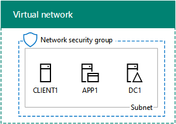

# <a name="office-365-devtest-environment"></a><span data-ttu-id="35a3c-103">Ambiente de desenvolvimento/teste do Office 365</span><span class="sxs-lookup"><span data-stu-id="35a3c-103">Office 365 dev/test environment</span></span>

 <span data-ttu-id="35a3c-104">**Resumo:** Use este guia de laboratório de teste para criar uma assinatura de avaliação do Office 365 para avaliação ou desenvolvimento e teste.</span><span class="sxs-lookup"><span data-stu-id="35a3c-104">**Summary:** Use this Test Lab Guide to create an Office 365 trial subscription for evaluation or dev/test.</span></span>
  
<span data-ttu-id="35a3c-p101">Você pode usar uma assinatura de avaliação do Office 365 e criar um ambiente de desenvolvimento e teste do Office 365 para aplicativos ou para demonstrar os recursos e capacidades do Office 365. Existem duas versões:</span><span class="sxs-lookup"><span data-stu-id="35a3c-p101">You can use an Office 365 trial subscription and create an Office 365 dev/test environment for applications or to demonstrate features and capabilities of Office 365. There are two versions:</span></span>
  
- <span data-ttu-id="35a3c-107">O ambiente de desenvolvimento e teste do Office 365 lightweight consiste em uma assinatura de avaliação do Office 365 que você pode acessar do computador principal.</span><span class="sxs-lookup"><span data-stu-id="35a3c-107">The lightweight Office 365 dev/test environment consists of an Office 365 trial subscription that you access from your main computer.</span></span>
    
    <span data-ttu-id="35a3c-p102">Use esse ambiente quando quiser demonstrar rapidamente um recurso. Para o ambiente de desenvolvimento e teste leve do Office 365, conclua somente as fases 2 e 3 deste artigo.</span><span class="sxs-lookup"><span data-stu-id="35a3c-p102">Use this environment when you want to quickly demonstrate a feature. For the lightweight Office 365 dev/test environment, complete only phases 2 and 3 of this article.</span></span>
    
- <span data-ttu-id="35a3c-p103">Ambiente de desenvolvimento e teste do Office 365 enterprise simulado consiste em uma assinatura de avaliação do Office 365 e uma intranet da organização simplificado conectado à Internet, que é hospedada no serviços de infraestrutura do Microsoft Azure. Você pode construir essa configuração completamente na nuvem da Microsoft.</span><span class="sxs-lookup"><span data-stu-id="35a3c-p103">The simulated enterprise Office 365 dev/test environment consists of an Office 365 trial subscription and a simplified organization intranet connected to the Internet, which is hosted in Microsoft Azure infrastructure services. You can build this configuration completely in the Microsoft cloud.</span></span>
    
    <span data-ttu-id="35a3c-p104">Use esse ambiente quando quiser demonstrar um recurso ou um aplicativo em um ambiente que se parece com uma rede de organização típica conectada à Internet ou para recursos que exigem esse tipo de ambiente. Para o ambiente de desenvolvimento e teste de enterprise simulado Office 365, conclua as fases 1, 2 e 3 deste artigo.</span><span class="sxs-lookup"><span data-stu-id="35a3c-p104">Use this environment when you want to demonstrate a feature or an app in an environment that resembles a typical organization network connected to the Internet, or for features that require this type of environment. For the simulated enterprise Office 365 dev/test environment, complete phases 1, 2, and 3 of this article.</span></span>
    
> [!NOTE]
> <span data-ttu-id="35a3c-p105">Convém imprimir este artigo para registrar os valores específicos que você precisará desse ambiente nos 30 dias da assinatura de avaliação do Office 365. Você pode estender facilmente a assinatura de trilha para outro 30 dias. Para um ambiente de desenvolvimento e teste permanente, crie uma nova assinatura com um pequeno número de licenças paga.</span><span class="sxs-lookup"><span data-stu-id="35a3c-p105">You might want to print this article to record the specific values that you will need for this environment over the 30 days of the Office 365 trial subscription. You can easily extend the trail subscription for another 30 days. For a permanent dev/test environment, create a new paid subscription with a small number of licenses.</span></span> 
  

  
> [!TIP]
> <span data-ttu-id="35a3c-118">Clique [aqui](http://aka.ms/catlgstack) para ver um mapa visual para todos os artigos da pilha do Guia do Laboratório de Teste do One Microsoft Cloud.</span><span class="sxs-lookup"><span data-stu-id="35a3c-118">Click [here](http://aka.ms/catlgstack) for a visual map to all the articles in the One Microsoft Cloud Test Lab Guide stack.</span></span>
  
## <a name="phase-1-create-the-base-configuration-in-azure"></a><span data-ttu-id="35a3c-119">Fase 1: Criar a configuração base no Windows Azure</span><span class="sxs-lookup"><span data-stu-id="35a3c-119">Phase 1: Create the base configuration in Azure</span></span>

<span data-ttu-id="35a3c-120">Siga as instruções no [ambiente de desenvolvimento e teste de configuração básica](base-configuration-dev-test-environment.md).</span><span class="sxs-lookup"><span data-stu-id="35a3c-120">Follow the instructions in [Base Configuration dev/test environment](base-configuration-dev-test-environment.md).</span></span>
  
<span data-ttu-id="35a3c-p106">Você precisará de uma assinatura do Windows Azure. Você pode usar a [Versão de avaliação gratuita do Windows Azure](https://azure.microsoft.com/pricing/free-trial/) para esta configuração. Se você tiver uma assinatura do MSDN ou o Visual Studio, consulte [crédito Azure mensal para assinantes do Visual Studio](https://azure.microsoft.com/pricing/member-offers/msdn-benefits-details/).</span><span class="sxs-lookup"><span data-stu-id="35a3c-p106">You will need an Azure subscription. You can use the [Azure Free Trial](https://azure.microsoft.com/pricing/free-trial/) for this configuration. If you have an MSDN or Visual Studio subscription, see [Monthly Azure credit for Visual Studio subscribers](https://azure.microsoft.com/pricing/member-offers/msdn-benefits-details/).</span></span>
  
<span data-ttu-id="35a3c-124">Aqui está a configuração resultante.</span><span class="sxs-lookup"><span data-stu-id="35a3c-124">Here is the resulting configuration.</span></span>
  

  
<span data-ttu-id="35a3c-126">Essa configuração consiste das máquinas virtuais DC1, APP1 e CLIENT1 em uma sub-rede de uma rede virtual do Azure.</span><span class="sxs-lookup"><span data-stu-id="35a3c-126">This configuration consists of the DC1, APP1, and CLIENT1 virtual machines on a subnet of an Azure virtual network.</span></span>
  
## <a name="phase-2-create-an-office-365-trial-subscription"></a><span data-ttu-id="35a3c-127">Fase 2: Criar uma assinatura de avaliação do Office 365</span><span class="sxs-lookup"><span data-stu-id="35a3c-127">Phase 2: Create an Office 365 trial subscription</span></span>

<span data-ttu-id="35a3c-128">Para iniciar a sua assinatura de avaliação do Office 365 E5, primeiro é necessário um nome de empresa fictícia e uma nova conta da Microsoft.</span><span class="sxs-lookup"><span data-stu-id="35a3c-128">To start your Office 365 E5 trial subscription, you first need a fictitious company name and a new Microsoft account.</span></span>
  
1. <span data-ttu-id="35a3c-p107">É recomendável que você usar uma variant do nome da empresa Contoso para o nome da sua empresa, que é uma empresa fictícia usada no conteúdo de exemplo da Microsoft, mas isso não é obrigatório. Registre seu nome de empresa fictícia aqui:</span><span class="sxs-lookup"><span data-stu-id="35a3c-p107">We recommend that you use a variant of the company name Contoso for your company name, which is a fictitious company used in Microsoft sample content, but it isn't required. Record your fictitious company name here: </span></span>
    
2. <span data-ttu-id="35a3c-p108">Para se inscrever para uma nova conta da Microsoft, vá para [https://outlook.com](https://outlook.com) e crie uma conta com uma nova conta de email e o endereço. Você usará essa conta para inscrever-se no Office 365.</span><span class="sxs-lookup"><span data-stu-id="35a3c-p108">To sign up for a new Microsoft account, go to [https://outlook.com](https://outlook.com) and create an account with a new email account and address. You will use this account to sign up for Office 365.</span></span>
    
  - <span data-ttu-id="35a3c-133">Registre o nome e sobrenome de sua nova conta:</span><span class="sxs-lookup"><span data-stu-id="35a3c-133">Record the first and last name of your new account here: </span></span>
    
  - <span data-ttu-id="35a3c-134">Registrar o nova conta endereço de email aqui: @outlook.com</span><span class="sxs-lookup"><span data-stu-id="35a3c-134">Record the new email account address here: @outlook.com</span></span>
    
### <a name="sign-up-for-an-office-365-e5-trial-subscription"></a><span data-ttu-id="35a3c-135">Inscreva-se para uma assinatura de avaliação do Office 365 E5</span><span class="sxs-lookup"><span data-stu-id="35a3c-135">Sign up for an Office 365 E5 trial subscription</span></span>

1. <span data-ttu-id="35a3c-136">Para o ambiente de desenvolvimento e teste do Office 365 leve, abra o navegador da Internet no seu computador e vá para [https://aka.ms/e5trial](https://aka.ms/e5trial).</span><span class="sxs-lookup"><span data-stu-id="35a3c-136">For the lightweight Office 365 dev/test environment, open the Internet browser on your computer and go to [https://aka.ms/e5trial](https://aka.ms/e5trial).</span></span> 
    
    <span data-ttu-id="35a3c-137">Para o ambiente de desenvolvimento e teste de enterprise simulado Office 365:</span><span class="sxs-lookup"><span data-stu-id="35a3c-137">For the simulated enterprise Office 365 dev/test environment:</span></span>
    
  - <span data-ttu-id="35a3c-138">Do [portal do Azure](https://portal.azure.com), conecte-se ao CLIENT1 com CORP\\conta User1.</span><span class="sxs-lookup"><span data-stu-id="35a3c-138">From the [Azure portal](https://portal.azure.com), connect to CLIENT1 with the CORP\\User1 account.</span></span>
    
  - <span data-ttu-id="35a3c-139">Abra um prompt de comando do Windows PowerShell de nível de administrador e, em seguida, execute estes comandos:</span><span class="sxs-lookup"><span data-stu-id="35a3c-139">Open an administrator-level Windows PowerShell command prompt, and then run these commands:</span></span>
    
  ```
  Set-ItemProperty -Path "HKLM:\\SOFTWARE\\Microsoft\\Active Setup\\Installed Components\\{A509B1A7-37EF-4b3f-8CFC-4F3A74704073}" -Name "IsInstalled" -Value 0
Set-ItemProperty -Path "HKLM:\\SOFTWARE\\Microsoft\\Active Setup\\Installed Components\\{A509B1A8-37EF-4b3f-8CFC-4F3A74704073}" -Name "IsInstalled" -Value 0
Stop-Process -Name Explorer -Force
  ```

    > [!TIP]
    > <span data-ttu-id="35a3c-140">Clique [aqui](https://gallery.technet.microsoft.com/PowerShell-commands-for-fe3d7a34) para obter um arquivo de texto que contém todos os comandos do PowerShell neste artigo.</span><span class="sxs-lookup"><span data-stu-id="35a3c-140">Click [here](https://gallery.technet.microsoft.com/PowerShell-commands-for-fe3d7a34) to get a text file that contains all the PowerShell commands in this article.</span></span>
  
  - <span data-ttu-id="35a3c-141">Na tela Iniciar, clique em **Internet Explorer** e vá para [https://aka.ms/e5trial](https://aka.ms/e5trial).</span><span class="sxs-lookup"><span data-stu-id="35a3c-141">From the Start screen, click **Internet Explorer** and go to [https://aka.ms/e5trial](https://aka.ms/e5trial).</span></span>
    
2. <span data-ttu-id="35a3c-142">Na página de **boas-vindas, vamos fazer conhecê-lo** , especifique:</span><span class="sxs-lookup"><span data-stu-id="35a3c-142">On the **Welcome, let's get to know you** page, specify:</span></span>
    
  - <span data-ttu-id="35a3c-143">Seu local físico</span><span class="sxs-lookup"><span data-stu-id="35a3c-143">Your physical location</span></span>
    
  - <span data-ttu-id="35a3c-144">O nome e sobrenome de sua nova conta da Microsoft</span><span class="sxs-lookup"><span data-stu-id="35a3c-144">The first and last name of your new Microsoft account</span></span>
    
  - <span data-ttu-id="35a3c-145">Seu novo endereço de conta de email</span><span class="sxs-lookup"><span data-stu-id="35a3c-145">Your new email account address</span></span>
    
  - <span data-ttu-id="35a3c-146">Um número de telefone comercial</span><span class="sxs-lookup"><span data-stu-id="35a3c-146">A business phone number</span></span>
    
  - <span data-ttu-id="35a3c-147">Nome da sua empresa fictícia</span><span class="sxs-lookup"><span data-stu-id="35a3c-147">Your fictional company name</span></span>
    
  - <span data-ttu-id="35a3c-148">Um tamanho de organização de 250-999 pessoas</span><span class="sxs-lookup"><span data-stu-id="35a3c-148">An organization size of 250-999 people</span></span>
    
3. <span data-ttu-id="35a3c-149">Clique em **apenas um deles mais etapa**.</span><span class="sxs-lookup"><span data-stu-id="35a3c-149">Click **Just one more step**.</span></span>
    
4. <span data-ttu-id="35a3c-150">Na página **criar sua ID de usuário** , digite um nome de usuário com base em seu novo endereço de email, sua empresa fictícia após o sinal (remover todos os espaços no nome de usuário), @ e uma senha (duas vezes) para este novo Office 365 da conta.</span><span class="sxs-lookup"><span data-stu-id="35a3c-150">On the **Create your user ID** page, type a user name based on your new email address, your fictional company after the @ sign (remove all spaces in the name), then a password (twice) for this new Office 365 account.</span></span>
    
    <span data-ttu-id="35a3c-151">Registre a senha que você digitou em um local seguro.</span><span class="sxs-lookup"><span data-stu-id="35a3c-151">Record the password that you typed in a secure location.</span></span>
    
    <span data-ttu-id="35a3c-152">Registre o nome da sua empresa fictícia, para ser referida como o **nome da organização**, aqui:</span><span class="sxs-lookup"><span data-stu-id="35a3c-152">Record your fictional company name, to be referred to as the **organization name**, here: </span></span>
    
5. <span data-ttu-id="35a3c-153">Clique em **Criar minha conta**.</span><span class="sxs-lookup"><span data-stu-id="35a3c-153">Click **Create my account**.</span></span>
    
6. <span data-ttu-id="35a3c-p109">Sobre o **Prove. Você está. Não. R. robô.** página, digite o número de telefone do seu telefone capaz de texto e, em seguida, clique em **texto-me**.</span><span class="sxs-lookup"><span data-stu-id="35a3c-p109">On the **Prove. You're. Not. A. Robot.** page, type the phone number of your text-capable phone, and then click **Text me**.</span></span>
    
7. <span data-ttu-id="35a3c-156">Digite o código de verificação da mensagem de texto recebido e clique em **Avançar**.</span><span class="sxs-lookup"><span data-stu-id="35a3c-156">Type the verification code from the received text message, and then click **Next**.</span></span>
    
8. <span data-ttu-id="35a3c-157">Registre a URL da página de entrada aqui (select e cópia):</span><span class="sxs-lookup"><span data-stu-id="35a3c-157">Record the sign-in page URL here (select and copy): </span></span>
    
9. <span data-ttu-id="35a3c-158">Registre a ID de usuário aqui (select e cópia): . onmicrosoft.com</span><span class="sxs-lookup"><span data-stu-id="35a3c-158">Record the user ID here (select and copy): .onmicrosoft.com</span></span>
    
    <span data-ttu-id="35a3c-159">Esse valor será chamado como o **nome de administrador global do Office 365**.</span><span class="sxs-lookup"><span data-stu-id="35a3c-159">This value will be referred to as the **Office 365 global administrator name**.</span></span>
    
10. <span data-ttu-id="35a3c-160">Quando você vê que **você está pronto para ir**, clique nele.</span><span class="sxs-lookup"><span data-stu-id="35a3c-160">When you see **You're ready to go**, click it.</span></span>
    
11. <span data-ttu-id="35a3c-161">Na próxima página, aguarde até que o Office 365 for concluído a configuração de backup e todos os blocos estão disponíveis.</span><span class="sxs-lookup"><span data-stu-id="35a3c-161">On the next page, wait until Office 365 completes setting up and all the tiles are available.</span></span>
    
<span data-ttu-id="35a3c-162">Você deverá ver a página portal principal do Office 365 no qual você pode acessar os Serviços Online do Office e o Centro de administração do Office 365.</span><span class="sxs-lookup"><span data-stu-id="35a3c-162">You should see main Office 365 portal page from which you can access Office Online services and the Office 365 Admin center.</span></span>
  
<span data-ttu-id="35a3c-163">Para o ambiente de desenvolvimento e teste do Office 365 enterprise simulado, aqui está a configuração resultante.</span><span class="sxs-lookup"><span data-stu-id="35a3c-163">For the simulated enterprise Office 365 dev/test environment, here is your resulting configuration.</span></span>
  

  
<span data-ttu-id="35a3c-165">Esta configuração consiste em:</span><span class="sxs-lookup"><span data-stu-id="35a3c-165">This configuration consists of:</span></span> 
  
- <span data-ttu-id="35a3c-166">Os virtual DC1, APP1 e CLIENT1 máquinas em uma sub-rede de uma rede virtual do Azure.</span><span class="sxs-lookup"><span data-stu-id="35a3c-166">The DC1, APP1, and CLIENT1 virtual machines on a subnet of an Azure virtual network.</span></span>
    
- <span data-ttu-id="35a3c-167">Uma assinatura de avaliação do E5 do Office 365.</span><span class="sxs-lookup"><span data-stu-id="35a3c-167">An Office 365 E5 Trial Subscription.</span></span>
    
## <a name="phase-3-configure-your-office-365-trial-subscription"></a><span data-ttu-id="35a3c-168">Fase 3: Configurar sua assinatura de avaliação do Office 365</span><span class="sxs-lookup"><span data-stu-id="35a3c-168">Phase 3: Configure your Office 365 trial subscription</span></span>

<span data-ttu-id="35a3c-169">Nesta fase, você pode configurar sua assinatura do Office 365 com outros usuários e sites de equipe do SharePoint Online.</span><span class="sxs-lookup"><span data-stu-id="35a3c-169">In this phase, you configure your Office 365 subscription with additional users and SharePoint Online team sites.</span></span>
  
<span data-ttu-id="35a3c-170">Primeiro, você pode adicionar quatro novos usuários e atribuir-lhes licenças E5.</span><span class="sxs-lookup"><span data-stu-id="35a3c-170">First, you add four new users and assign them E5 licenses.</span></span>
  
<span data-ttu-id="35a3c-171">Use as instruções em [conectar-se ao Office 365 PowerShell](https://technet.microsoft.com/library/dn975125.aspx) para instalar os módulos do PowerShell e se conectar à sua nova assinatura do Office 365 de:</span><span class="sxs-lookup"><span data-stu-id="35a3c-171">Use the instructions in [Connect to Office 365 PowerShell](https://technet.microsoft.com/library/dn975125.aspx) to install the PowerShell modules and connect to your new Office 365 subscription from:</span></span>
  
- <span data-ttu-id="35a3c-172">Seu computador (para o ambiente leve de desenvolvimento/teste do Office 365).</span><span class="sxs-lookup"><span data-stu-id="35a3c-172">Your computer (for the lightweight Office 365 dev/test environment).</span></span>
    
- <span data-ttu-id="35a3c-173">A máquina virtual CLIENT1 (para o ambiente de desenvolvimento e teste de enterprise simulado Office 365).</span><span class="sxs-lookup"><span data-stu-id="35a3c-173">The CLIENT1 virtual machine (for the simulated enterprise Office 365 dev/test environment).</span></span>
    
 <span data-ttu-id="35a3c-174">Na caixa de diálogo solicitação de credencial do Windows PowerShell, digite o nome de administrador global do Office 365 (exemplo: jdoe@contosotoycompany.onmicrosoft.com) e a senha.</span><span class="sxs-lookup"><span data-stu-id="35a3c-174">In the Windows PowerShell Credential Request dialog box, type the Office 365 global administrator name (example: jdoe@contosotoycompany.onmicrosoft.com) and password.</span></span>
  
<span data-ttu-id="35a3c-175">Preencha o nome de sua organização (exemplo: contosotoycompany), o código de país com dois caracteres de seu local e execute os seguintes comandos no prompt do Módulo do Windows Azure Active Directory para Windows PowerShell:</span><span class="sxs-lookup"><span data-stu-id="35a3c-175">Fill in your organization name (example: contosotoycompany), the two-character country code for your location, and then run the following commands from the Windows Azure Active Directory Module for Windows PowerShell prompt:</span></span>
  
```
$orgName="<organization name>"
$loc="<two-character country code, such as US>"
$licAssignment= $orgName + ":ENTERPRISEPREMIUM"
$userName= "user2@" + $orgName + ".onmicrosoft.com"
New-MsolUser -DisplayName "User 2" -FirstName User -LastName 2 -UserPrincipalName $userName -UsageLocation $loc -LicenseAssignment $licAssignment
```

<span data-ttu-id="35a3c-176">Na exibição do comando **New-MsolUser** , observe a gerado senha para a conta de usuário 2 e registre-a em um local seguro.</span><span class="sxs-lookup"><span data-stu-id="35a3c-176">From the display of the **New-MsolUser** command, note the generated password for the User 2 account and record it in a safe location.</span></span>
  
<span data-ttu-id="35a3c-177">Execute os seguintes comandos no prompt do Módulo do Windows Azure Active Directory para Windows PowerShell:</span><span class="sxs-lookup"><span data-stu-id="35a3c-177">Run the following commands from the Windows Azure Active Directory Module for Windows PowerShell prompt:</span></span>
  
```
$userName= "user3@" + $orgName + ".onmicrosoft.com"
New-MsolUser -DisplayName "User 3" -FirstName User -LastName 3 -UserPrincipalName $userName -UsageLocation $loc -LicenseAssignment $licAssignment
```

<span data-ttu-id="35a3c-178">Na exibição do comando **New-MsolUser** , observe a gerado senha para a conta de usuário 3 e registre-a em um local seguro.</span><span class="sxs-lookup"><span data-stu-id="35a3c-178">From the display of the **New-MsolUser** command, note the generated password for the User 3 account and record it in a safe location.</span></span>
  
<span data-ttu-id="35a3c-179">Execute os seguintes comandos no prompt do Módulo do Windows Azure Active Directory para Windows PowerShell:</span><span class="sxs-lookup"><span data-stu-id="35a3c-179">Run the following commands from the Windows Azure Active Directory Module for Windows PowerShell prompt:</span></span>
  
```
$userName= "user4@" + $orgName + ".onmicrosoft.com"
New-MsolUser -DisplayName "User 4" -FirstName User -LastName 4 -UserPrincipalName $userName -UsageLocation $loc -LicenseAssignment $licAssignment
```

<span data-ttu-id="35a3c-180">Na exibição do comando **New-MsolUser** , observe a gerado senha para a conta de usuário 4 e registre-a em um local seguro.</span><span class="sxs-lookup"><span data-stu-id="35a3c-180">From the display of the **New-MsolUser** command, note the generated password for the User 4 account and record it in a safe location.</span></span>
  
<span data-ttu-id="35a3c-181">Execute os seguintes comandos no prompt do Módulo do Windows Azure Active Directory para Windows PowerShell:</span><span class="sxs-lookup"><span data-stu-id="35a3c-181">Run the following commands from the Windows Azure Active Directory Module for Windows PowerShell prompt:</span></span>
  
```
$userName= "user5@" + $orgName + ".onmicrosoft.com"
New-MsolUser -DisplayName "User 5" -FirstName User -LastName 5 -UserPrincipalName $userName -UsageLocation $loc -LicenseAssignment $licAssignment
```

<span data-ttu-id="35a3c-182">Na exibição do comando **New-MsolUser** , observe a gerado senha para a conta de usuário 5 e registre-a em um local seguro.</span><span class="sxs-lookup"><span data-stu-id="35a3c-182">From the display of the **New-MsolUser** command, note the generated password for the User 5 account and record it in a safe location.</span></span>
  
<span data-ttu-id="35a3c-183">Em seguida, você pode cria três novos sites de equipe do SharePoint Online para as vendas, produção e departamentos de suporte.</span><span class="sxs-lookup"><span data-stu-id="35a3c-183">Next, you create three new SharePoint Online team sites for the Sales, Production, and Support departments.</span></span>
  
### <a name="create-three-new-sharepoint-online-team-sites"></a><span data-ttu-id="35a3c-184">Crie três novos sites de equipe do SharePoint Online</span><span class="sxs-lookup"><span data-stu-id="35a3c-184">Create three new SharePoint Online team sites</span></span>

1. <span data-ttu-id="35a3c-185">Instalar o [Shell de gerenciamento do SharePoint Online](https://go.microsoft.com/fwlink/p/?LinkId=255251) (o x64 versão).</span><span class="sxs-lookup"><span data-stu-id="35a3c-185">Install the [SharePoint Online Management Shell](https://go.microsoft.com/fwlink/p/?LinkId=255251) (the x64 version).</span></span>
    
2. <span data-ttu-id="35a3c-186">Clique em **Iniciar**, digite **sharepoint**e clique em **Shell de gerenciamento do SharePoint Online**.</span><span class="sxs-lookup"><span data-stu-id="35a3c-186">Click **Start**, type **sharepoint**, and then click **SharePoint Online Management Shell**.</span></span>
    
3. <span data-ttu-id="35a3c-187">Preencha o nome da sua organização (exemplo: contosotoycompany), e, em seguida, execute os seguintes comandos no prompt de Shell de gerenciamento do SharePoint Online para se conectar ao serviço do SharePoint Online</span><span class="sxs-lookup"><span data-stu-id="35a3c-187">Fill in your organization name (example: contosotoycompany), and then run the following commands from the SharePoint Online Management Shell prompt to connect to the SharePoint Online service</span></span>
```
$orgName="<organization name>"
$spURL="https://" + $orgName + "-admin.sharepoint.com"
Connect-SPOService -Url $spURL
```

4. <span data-ttu-id="35a3c-188">Na caixa de diálogo do **Microsoft SharePoint Online Management Shell** , digite o nome de administrador global do Office 365 (exemplo: jdoe@contosotoycompany.onmicrosoft.com) e uma senha e clique em **entrar**.</span><span class="sxs-lookup"><span data-stu-id="35a3c-188">In the **Microsoft SharePoint Online Management Shell** dialog box, type the Office 365 global administrator name (example: jdoe@contosotoycompany.onmicrosoft.com) and password, and then click **Sign in**.</span></span>
    
5. <span data-ttu-id="35a3c-189">Para criar três novos sites de equipe (vendas, produção e suporte), preencham o nome de administrador global do Office 365 em, em seguida, execute os seguintes comandos no prompt de Shell de gerenciamento do SharePoint Online:</span><span class="sxs-lookup"><span data-stu-id="35a3c-189">To create three new team sites (Sales, Production, and Support), fill in the Office 365 global administrator name, and then run the following commands from the SharePoint Online Management Shell prompt:</span></span>
    
  ```
  $owner = "<global administrator account name>"
$siteURL = "https://" + $orgName + ".sharepoint.com/sites/sales"
New-SPOSite -Url $siteURL -Owner $owner -StorageQuota 1000 -Title "Sales site collection" -Template "STS#0"
$siteURL = "https://" + $orgName + ".sharepoint.com/sites/production"
New-SPOSite -Url $siteURL -Owner $owner -StorageQuota 1000 -Title "Production site collection" -Template "STS#0"
$siteURL = "https://" + $orgName + ".sharepoint.com/sites/support"
New-SPOSite -Url $siteURL -Owner $owner -StorageQuota 1000 -Title "Support site collection" -Template "STS#0"
  ```

6. <span data-ttu-id="35a3c-190">Execute este comando para listar as URLs desses sites novos:</span><span class="sxs-lookup"><span data-stu-id="35a3c-190">Run this command to list the URLs of these new sites:</span></span>
    
  ```
  Get-SPOSite | Where URL -like "*/sites/*" | Sort URL | Select URL
  ```

7. <span data-ttu-id="35a3c-191">No Internet Explorer, digite a URL do site de produção para ver o site de equipe do SharePoint Online padrão para o departamento de produção.</span><span class="sxs-lookup"><span data-stu-id="35a3c-191">In Internet Explorer, enter the URL of the Production site to see the default SharePoint Online team site for the Production department.</span></span>
    
## <a name="record-values-for-future-reference"></a><span data-ttu-id="35a3c-192">Valores do registro para referência futura</span><span class="sxs-lookup"><span data-stu-id="35a3c-192">Record values for future reference</span></span>

<span data-ttu-id="35a3c-193">Registre esses valores para trabalhar com ou implantando guias de laboratório de teste adicionais neste ambiente de teste:</span><span class="sxs-lookup"><span data-stu-id="35a3c-193">Record these values for working with or deploying additional Test Lab Guides in this test environment:</span></span>
  
- <span data-ttu-id="35a3c-194">Nome de administrador global do Office 365: . onmicrosoft.com (da etapa 9 da fase 2)</span><span class="sxs-lookup"><span data-stu-id="35a3c-194">Office 365 global administrator name: .onmicrosoft.com (from step 9 of Phase 2)</span></span>
    
    <span data-ttu-id="35a3c-195">Além disso, registre a senha dessa conta em um local seguro.</span><span class="sxs-lookup"><span data-stu-id="35a3c-195">Also record the password for this account in a secure location.</span></span>
    
- <span data-ttu-id="35a3c-196">O nome da sua organização de assinatura de avaliação:  (da etapa 4 da fase 2)</span><span class="sxs-lookup"><span data-stu-id="35a3c-196">Your trial subscription organization name:  (from step 4 of Phase 2)</span></span>
    
- <span data-ttu-id="35a3c-197">Para listar as contas de usuário 2, 3 do usuário, usuário 4 e 5 do usuário, execute o seguinte comando a partir do prompt do Windows Azure Active Directory módulo para Windows PowerShell:</span><span class="sxs-lookup"><span data-stu-id="35a3c-197">To list the accounts for User 2, User 3, User 4, and User 5, run the following command from the Windows Azure Active Directory Module for Windows PowerShell prompt:</span></span>
    
  ```
  Get-MSolUser | Sort UserPrincipalName | Select UserPrincipalName
  ```

    <span data-ttu-id="35a3c-198">Registre os nomes de conta:</span><span class="sxs-lookup"><span data-stu-id="35a3c-198">Record the account names here:</span></span>
    
  - <span data-ttu-id="35a3c-199">Nome da conta de usuário 2: Usuário2 @. onmicrosoft.com</span><span class="sxs-lookup"><span data-stu-id="35a3c-199">User 2 account name: user2@.onmicrosoft.com</span></span>
    
  - <span data-ttu-id="35a3c-200">Nome da conta de usuário 3: user3 @. onmicrosoft.com</span><span class="sxs-lookup"><span data-stu-id="35a3c-200">User 3 account name: user3@.onmicrosoft.com</span></span>
    
  - <span data-ttu-id="35a3c-201">Nome da conta de usuário 4: user4 @. onmicrosoft.com</span><span class="sxs-lookup"><span data-stu-id="35a3c-201">User 4 account name: user4@.onmicrosoft.com</span></span>
    
  - <span data-ttu-id="35a3c-202">Nome da conta de usuário 5: user5 @. onmicrosoft.com</span><span class="sxs-lookup"><span data-stu-id="35a3c-202">User 5 account name: user5@.onmicrosoft.com</span></span>
    
    <span data-ttu-id="35a3c-203">Registre também as senhas para essas contas em um local seguro.</span><span class="sxs-lookup"><span data-stu-id="35a3c-203">Also record the passwords for these accounts in a secure location.</span></span>
    
- <span data-ttu-id="35a3c-204">Para listar as URLs de vendas, produção e oferecer suporte aos sites de equipe, execute o seguinte comando no prompt de Shell de gerenciamento do SharePoint Online:</span><span class="sxs-lookup"><span data-stu-id="35a3c-204">To list the URLs for the Sales, Production, and Support team sites, run the following command from the SharePoint Online Management Shell prompt:</span></span>
    
  ```
  Get-SPOSite | Where URL -like "*/sites/*" | Sort URL | Select URL
  ```

  - <span data-ttu-id="35a3c-205">URL do site de produção: https://.sharepoint.com/sites/production</span><span class="sxs-lookup"><span data-stu-id="35a3c-205">Production site URL: https://.sharepoint.com/sites/production</span></span>
    
  - <span data-ttu-id="35a3c-206">URL do site de vendas: https://.sharepoint.com/sites/sales</span><span class="sxs-lookup"><span data-stu-id="35a3c-206">Sales site URL: https://.sharepoint.com/sites/sales</span></span>
    
  - <span data-ttu-id="35a3c-207">URL do site de suporte: https://.sharepoint.com/sites/support</span><span class="sxs-lookup"><span data-stu-id="35a3c-207">Support site URL: https://.sharepoint.com/sites/support</span></span>
    
## <a name="next-steps"></a><span data-ttu-id="35a3c-208">Próximas etapas</span><span class="sxs-lookup"><span data-stu-id="35a3c-208">Next steps</span></span>

<span data-ttu-id="35a3c-209">Use estes artigos adicionais em seu ambiente de desenvolvimento e teste do Office 365:</span><span class="sxs-lookup"><span data-stu-id="35a3c-209">Use these additional articles in your Office 365 dev/test environment:</span></span>
  
- [<span data-ttu-id="35a3c-210">Sincronização de diretórios para o seu ambiente de desenvolvimento e teste do Office 365</span><span class="sxs-lookup"><span data-stu-id="35a3c-210">Directory Synchronization for your Office 365 dev/test environment</span></span>](dirsync-for-your-office-365-dev-test-environment.md)
    
- [<span data-ttu-id="35a3c-211">Autenticação multifator para o ambiente de desenvolvimento/teste do Office 365</span><span class="sxs-lookup"><span data-stu-id="35a3c-211">Multi-factor authentication for your Office 365 dev/test environment</span></span>](multi-factor-authentication-for-your-office-365-dev-test-environment.md)
    
- [<span data-ttu-id="35a3c-212">Identidade federada para seu ambiente de desenvolvimento e teste do Office 365</span><span class="sxs-lookup"><span data-stu-id="35a3c-212">Federated identity for your Office 365 dev/test environment</span></span>](federated-identity-for-your-office-365-dev-test-environment.md)
    
- [<span data-ttu-id="35a3c-213"> Segurança no Aplicativo na Nuvem para seu ambiente de desenvolvimento e teste do Office 365</span><span class="sxs-lookup"><span data-stu-id="35a3c-213">Cloud App Security for your Office 365 dev/test environment</span></span>](cloud-app-security-for-your-office-365-dev-test-environment.md)
    
- [<span data-ttu-id="35a3c-214">Proteção Avançada contra Ameaças para seu ambiente de desenvolvimento e teste do Office 365</span><span class="sxs-lookup"><span data-stu-id="35a3c-214">Advanced Threat Protection for your Office 365 dev/test environment</span></span>](advanced-threat-protection-for-your-office-365-dev-test-environment.md)
    
- [<span data-ttu-id="35a3c-215">Descoberta Eletrônica Avançada para o seu ambiente de desenvolvimento e teste do Office 365</span><span class="sxs-lookup"><span data-stu-id="35a3c-215">Advanced eDiscovery for your Office 365 dev/test environment</span></span>](advanced-ediscovery-for-your-office-365-dev-test-environment.md)
    
- [<span data-ttu-id="35a3c-216">Proteção de arquivos confidenciais no ambiente de desenvolvimento/teste do Office 365</span><span class="sxs-lookup"><span data-stu-id="35a3c-216">Sensitive file protection in the Office 365 dev/test environment</span></span>](sensitive-file-protection-in-the-office-365-dev-test-environment.md)
    
- [<span data-ttu-id="35a3c-217">Site de equipe do SharePoint Online isolado no seu ambiente de desenvolvimento/teste</span><span class="sxs-lookup"><span data-stu-id="35a3c-217">Isolated SharePoint Online team site dev/test environment</span></span>](isolated-sharepoint-online-team-site-dev-test-environment.md)
    
- [<span data-ttu-id="35a3c-218">Classificação de dados e rotulagem no ambiente de desenvolvimento/teste do Office 365</span><span class="sxs-lookup"><span data-stu-id="35a3c-218">Data classification and labeling in the Office 365 dev/test environment</span></span>](data-classification-and-labeling-in-the-office-365-dev-test-environment.md)
    
<span data-ttu-id="35a3c-219">Estenda seu ambiente de desenvolvimento e teste do Office 365 para incluir adicionais ofertas de nuvem da Microsoft:</span><span class="sxs-lookup"><span data-stu-id="35a3c-219">Extend your Office 365 dev/test environment to include additional Microsoft cloud offerings:</span></span>
  
- [<span data-ttu-id="35a3c-220">Ambiente de desenvolvimento/teste do Microsoft 365 Enterprise</span><span class="sxs-lookup"><span data-stu-id="35a3c-220">The Microsoft 365 Enterprise dev/test environment</span></span>](the-microsoft-365-enterprise-dev-test-environment.md)
    
- [<span data-ttu-id="35a3c-221">Office 365 e o ambiente de desenvolvimento/teste do Dynamics 365</span><span class="sxs-lookup"><span data-stu-id="35a3c-221">Office 365 and Dynamics 365 dev/test environment</span></span>](office-365-and-dynamics-365-dev-test-environment.md)
    
## <a name="see-also"></a><span data-ttu-id="35a3c-222">Confira também</span><span class="sxs-lookup"><span data-stu-id="35a3c-222">See Also</span></span>

- [<span data-ttu-id="35a3c-223">Guias do Laboratório de Teste (TLGs) para adoção de nuvem</span><span class="sxs-lookup"><span data-stu-id="35a3c-223">Cloud adoption Test Lab Guides (TLGs)</span></span>](cloud-adoption-test-lab-guides-tlgs.md)
  
- [<span data-ttu-id="35a3c-224">Office 365 e o ambiente de desenvolvimento/teste do Dynamics 365</span><span class="sxs-lookup"><span data-stu-id="35a3c-224">Office 365 and Dynamics 365 dev/test environment</span></span>](office-365-and-dynamics-365-dev-test-environment.md)
  
 - [<span data-ttu-id="35a3c-225">Adoção da nuvem e soluções híbridas</span><span class="sxs-lookup"><span data-stu-id="35a3c-225">Cloud adoption and hybrid solutions</span></span>](cloud-adoption-and-hybrid-solutions.md)


