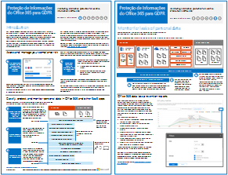

# Proteção de Informações do Office 365 para GDPR

 **Resumo:** esta solução demonstra como proteger dados confidenciais armazenados nos serviços do Office 365.
  
Esta solução inclui recomendações prescritivas para descoberta, classificação, proteção e monitoramento de dados pessoais. Ela usa o GDRP (Regulamento Geral sobre a Proteção de Dados) como exemplo, mas é possível aplicar o mesmo processo a fim de a cumprir os requisitos de vários outros regulamentos.

.
  
[PDF](http://download.microsoft.com/download/E/C/D/ECD5A339-EF10-4420-B3A9-99098884D716/MSFT_Cloud_architecture_information protection for GDPR.pdf)  | [Visio](http://download.microsoft.com/download/E/C/D/ECD5A339-EF10-4420-B3A9-99098884D716/MSFT_Cloud_architecture_information protection for GDPR.vsdx)
  

## Veja também

[Soluções de segurança](security-solutions.md)
  
[Diretrizes de segurança da Microsoft para campanhas políticas, instituições sem fins lucrativos e outras organizações Agile](microsoft-security-guidance-for-political-campaigns-nonprofits-and-other-agile-o.md)

